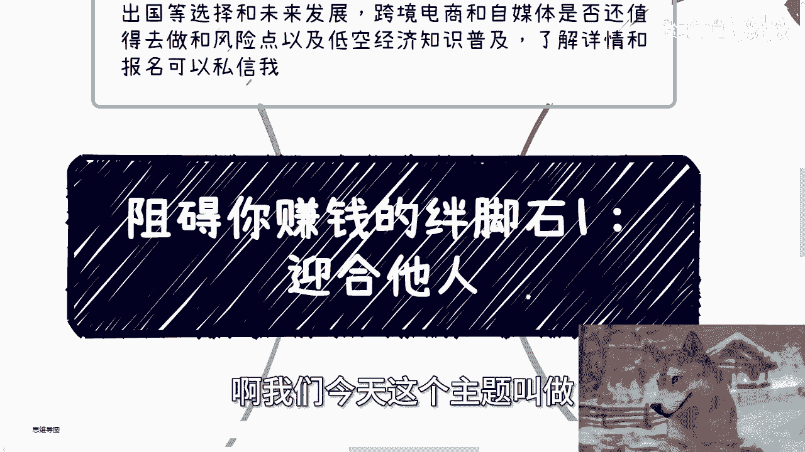
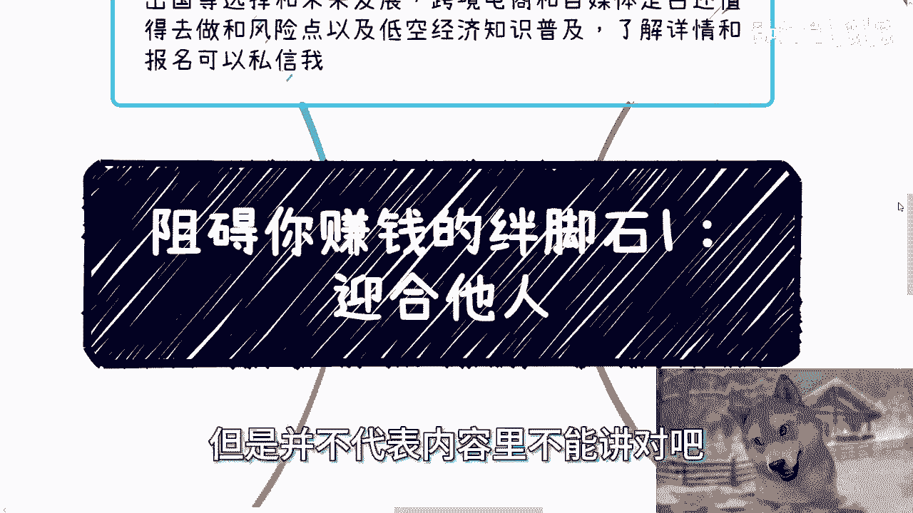
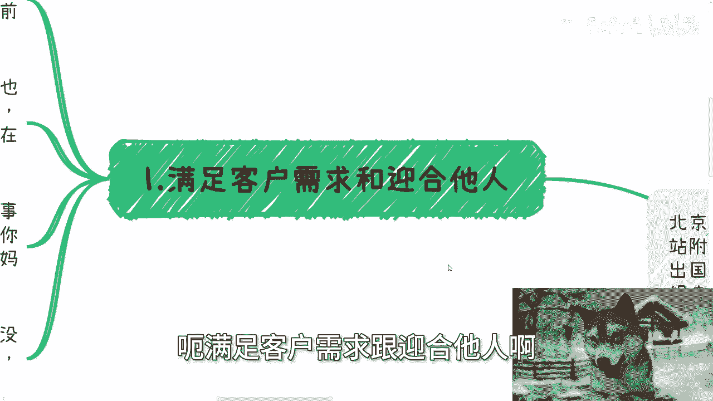
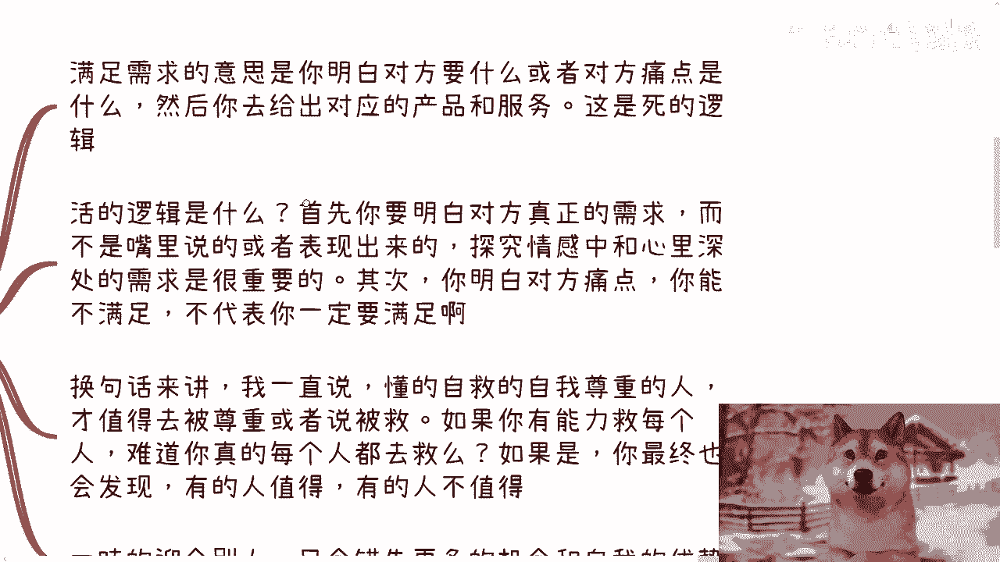
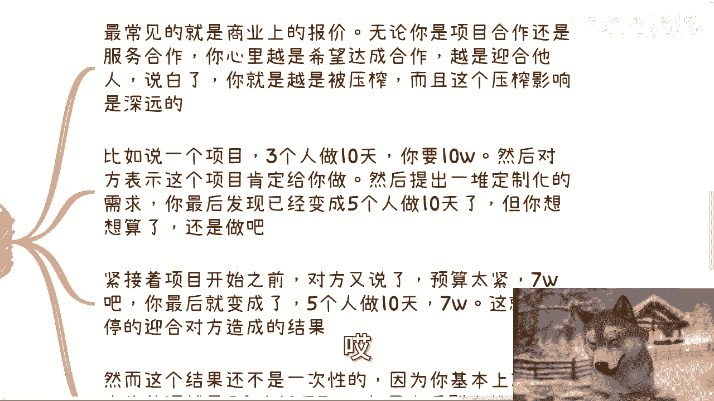
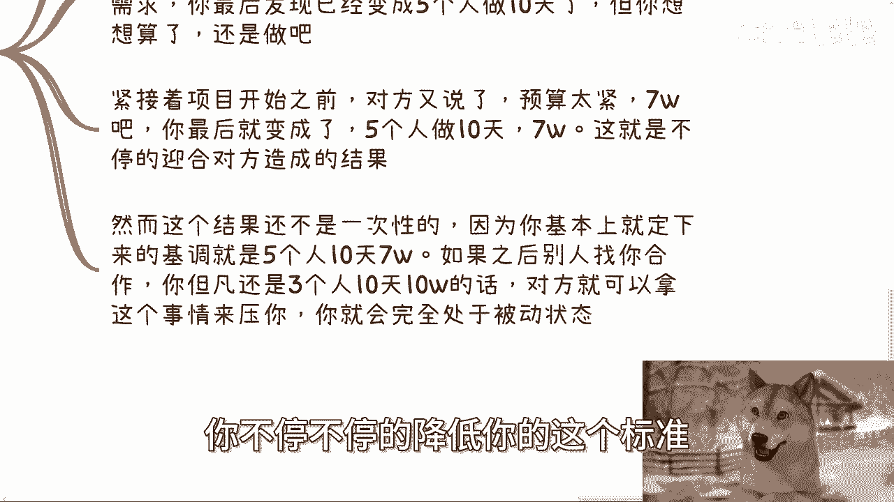
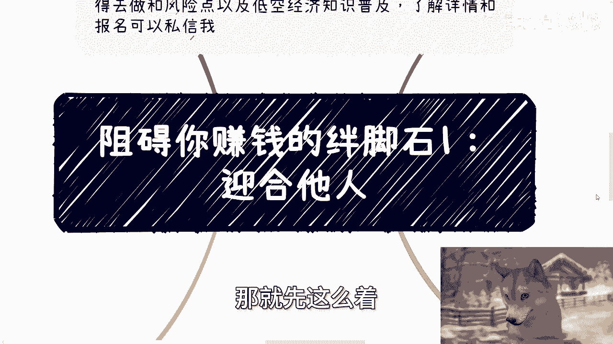

# 阻碍你赚钱的绊脚石1：迎合他人 - P1 - 赏味不足 - BV1Vx4y147sM

啊大家好啊咳咳我又挖了个坑，对吧啊，我们今天这个主题叫做阻碍你赚钱的绊脚石啊。

一啊一迎合他人啊，嗯不用着急，我的确不太想说，就是我肯定这个主题上不能说啊，但是并不代表内容里不能讲对吧。

这种东西不吐槽啊，妈的活着干嘛，对不对啊，呃首先啊我们还是先说一下活动啊，活动已经定了啊，然后本周日本周日28号下午啊，在东直门地铁站附近，那本次活动内容呢，大致是就是说我给大家会讲一下这个私企啊。

国央企，外企出国等选择，还有未来的一些发展，然后个人做那个跨境电商跟自媒体，是否还值得去做，以及一些就这个风险点啊，还有低空经济的这个知识普及啊，了解详情和报名可以私信我。

呃首先啊第一个啊就满足这个客户需求啊，不用着急，额满足客户需求。

更迎合他人啊，就是你看啊，有的人肯定要说了，他说陈老师啊，一天到晚说一直要满足客户需求，这不就迎合他人吗，对吧就怎么说呢，我跟你们说啊，我敢打赌啊，呵呵还好，这个视频肯定是充电的，我敢打赌。

一旦是公开的，肯定有的有人上来就要黑我对吧，说哎你看啊，讲东西前后矛盾对吧，说怎么怎么样怎么样啊，我跟你们这么说啊，我觉得这类人啊，我不能说这类人读书读少了，而是说这类人读书读傻了，你知道吧。

就他妈纯纯纯的哈，为什么，因为书也好，道理也好，都是死的，你明白吗，人是活的，社会是活的，什么意思呢，也就是说你做事是有情感的，是有思想的，有上下文在里面的，而不是说今天1+1必须等于二，宁哥。

你就像很多人私信问我说啊，什么什么问什么，什么解决方案，什么什么东西，你不存在一个标准答案对吧，这说过很多次了啊，然后银河这个事呢，其实无论如何，在什么层面上都是非常烂的事啊。

你比如说你说你谈恋爱去迎合，那就是跪舔对吧，但跪舔往往说的好听点叫做跪舔，往往得不到你想要的，说的不好听点，他妈跪舔往往不得好死啊，而且很多人得不到吧，他还要抱怨啊，我跟你说，他抱怨说什么呢。

就是说你看啊，我都已经跪舔了，你怎么还不给我对吧，怎么还我还得不到对吧，我跟你讲，这就是巨婴啊，我跟你讲啊咋了，有什么问题呢对吧，你说俗话说得好对吧。

俗话说得好，放下屠刀立地成佛，什么意思啊，就是你放下了屠刀就真的立地成佛了吗对吧，你什么意思，就是说你放下屠刀这件事情，并不是单纯行为上的，你要真的内心放下，你要思维上，格局上。

思想上各方面你都得明白对吧，你才立地成佛，你不是说我今天行为上做做样子对吧，但很多人不明白，他就认认认死道理。

那有什么办法呢，对吧啊，第二那么我们说说两者差别，满足需求的意思是什么。

是你明白对方要什么，或者知道对方痛点是什么，然后你去给出对应的产品跟服务对吧，这是死的逻辑啊，死的逻辑好，那么活的逻辑是什么，诶我的那个呢啊对，就是活的逻辑是什么，活动逻辑就是说。

首先你要明白对方真正的需求，而不是嘴里说的，或者来说表面上表现出来的，探究其情感中跟心中深处的需求，才是最重要的对吧，其次你明白对方的痛点，你能满足，但不代表你要满足啊。

对不对，你能满足我能做的事情多了，为什么我要去，我一定要去做呢，这两者没有因果关系啊对吧，那换句话换句话来讲，就是我一直说我说懂得自救的，懂呃，懂得自我尊重人才才值得去被尊重，或者说被救。

如果你有能力救每个人，难道你真的每个人都去救吗，你想想看对吧，如果是你是一个就是说博爱对吧，或者你是一个就是这种圣母，我们说啊就是圣母性的这种，那你到最后一定会被别人喷死啊，哎呀我这这个这个识别哎。

就因为这个灯太亮了啊。

呃为什么呢，因为你你有很多人不值得救啊对吧，你救他，他还会外骂你哦。

那么你要明白，一味的迎合别人，你只会错失更多的机会和自我优势对吧，那么我们来举个例子，你最常见的就是商业上的报价，你无论是商那个和那个项目合作，还是说服务合作，你心里越是希望达成合作，越是迎合他们。

那么说白了你是叫什么诶，唉今天这个切换太多了。

就是你就会越被压榨，而且这个压榨影响的越深远。

你比如说一个项目对吧，三个人做十天，你要10万块钱，然后对方表示啊，这个项目肯定给你做对吧，先给你画饼啊，给你让你知道牛逼啊，你马上就起飞了啊，然后呢提出一堆定制化的需求。

你最后发现已经就是变成了五个人做十天对吧，那你想想算了，因为为什么，因为你跪舔了对吧，你你迎合对方啊，那还是做了对吧，那紧接着项目开始之前，或者项目开项目做到一半啊，那对方又说了啊，预算太紧，7万吧啊。

那么你最后发现哎呀他妈的做都做了对吧，老子老子这这沉没成本他妈太高了啊，你最后就变成了五个人做十天变成7万啊，那么这就是不停的迎合对方造成的结果，然而这个结果还不是一次性的。

就这个结果对你造成的伤害还不是一次性的，你明白吗，为什么，因为如果之后别人再找你合作，你但凡还是三个人，十天10万的话，那么对方就可以拿出你你当时五五个人啊，十天7万的这个事情来压你，我跟你讲。

你别管别人怎么知道的，同一个行业里面找你来合作的呵，圈子小的很啊，那么我就跟你说，你不停的迎合对方，你不停不停的降低你的这个标准。

那么你最后只会不停的，让你自己完全处于被动状态，对不对，我说不好听点，你你你你五个人做十天期嘛，你还赚什么东西啊啊你倒贴要买对吧，而且你到时候一旦不做吧，人家又还能喷，你说说什么呢，就说哎呀，你你看啊。

这个人这个以前之前给那个人做啊，不给我做，他他妈看不起我对吧，怎么样怎么样好嘞对吧，你洗你跳进黄河，你都洗不清啊，那么第四啊。

包括你做任何事呢也是一样的，迎合的结果就是不停的被坑啊，你看啊，一味的迎合所谓的需求，别说赚钱了，基本上就被坑，而且是各种被坑，你就想象当中你是个舔狗啊，只不过舔的不是对象，舔的是所有压榨你的人。

或者要攻击你的人，你说比如说做自媒体看数据增长，对不对对，做电商看品类数据，对不对对，这些都对，哪个好做哪个对不对对，但是你需要去思考的是，你核心竞争力是什么，你必须总归有一条你主线的商业路线吧对吧。

否则随时都有可能这个一棵树上吊死，那么举个呃呃呃那那更别说啊，你可能你比如说做了某个内容啊，别人啊我们举个例子，比如说你做自媒体啊，你做电商，别人说这个主题好啊，你你说你也说啊，你做好那个主题好啊。

你也做好那个品类好，你也卖啊，这个品类好，你也卖好，那么最终你积累了什么呢，你到底给你自己形成了怎么样的护城河呢，以及你到底在这过程当中通过实践积累出了，就总结出怎样的方法论，什么都没有。

你都是迎合对方对吧，然后你直到某一天就会发现啊，你不迎合对方，你就没有流量，你不迎合对方，你可能就没有收入，那怎么办呢，你是为你自己在做事情吗，你永远处于被动状态对吧，我不是说你一定要有什么人设。

但是你自己至少得要有自己的这个想法，或者有你的这个这个做事情态度吧，而不是说我做什么事情都是个舔狗啊，你更别说可能你做了某个内容啊，别人就等着举报你，你卖了某个品类平台就等着封禁你对吧。

但是从你角度来讲，你不知道你一味的迎合对方，不管是谁，肯定要有个底线，也就是我说的，我们也许有能力去做，但是有能力不代表我们一定要去做，对不对，我我也可以迎合啊，我怎么不能迎合我。

迎合了我能赚更多钱对吧，但是我不迎合，为什么，因为我真的迎合更烦你，就像我跟我给很多人做咨询，我跟你们这么说，好多人都不知道自己问题是啥，一我钱我不收的，二微信我也不加的对吧，为什么。

因为你他自己都不知道是要什么，我能知道他要什么吗啊哦我到最后钱收了，他肯定要说了，他肯他肯定要说啊，这个他妈陈老师这个咨询一点价值都没有对吧，怎么怎么样怎么样哦，拉不出屎，怪马桶没有吸力，诶。

奇了怪了对吧。

那我我我干嘛，我他妈吃饱了撑的啊，我求求你嗯对吧。

一样的道理呀，你我跟你们说啊，真的很多时候就是某个节点上啊，你会发现你迎合对方，你可能赚的是多的，你可能心中会有美滋滋的，你知道吧，卧槽，但是我你你你要明白你你每一步都是累啊，这个雷就好像哼。

这就好像你你你这个雷都是定时炸弹，不知道什么时候爆，你妈给你连环连环爆，你直接可以把你炸死，啊你还赚什么钱，对不对，不赔钱就不错了啊，行那个哼那那个啥事啊，我们的另外一个视频再说啊，好吧行啊。

那就先这么着。

然后那个活动这个咨询或报名的去私信我啊，那另外一方面就是说那个呃，你们现在做什么职业啊，做什么个人的一些副业啊，或者你们跟别的小伙伴做一些项目啊，在这当中涉及到了，比如说合同啊，分红啊，分润啊对吧。

这个商业计划啊，呃职业规划啊啊包括你们手上有什么牌，你们有怎么样些资源，呃你们希望通过我的一些视角，或者通过我的一些这个对于今当下，整个市场的一些认知，给你们一些更接地气的啊，这个建议或者规划的话。

那么你们可以整理好对应的问题跟个人背景，我们再来做咨询，好吧啊行。

