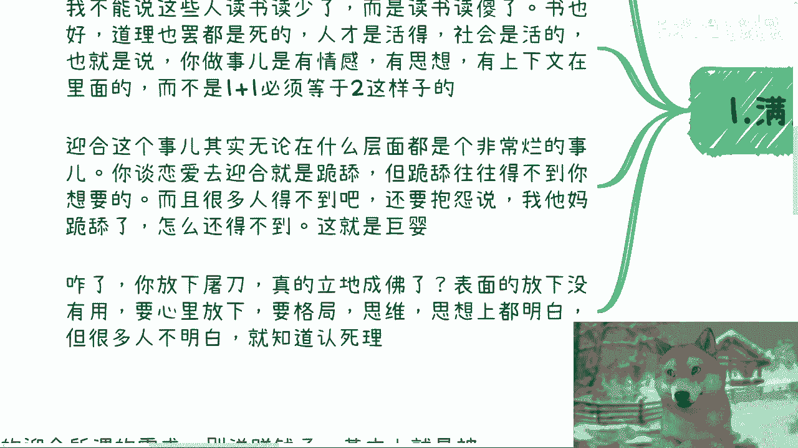
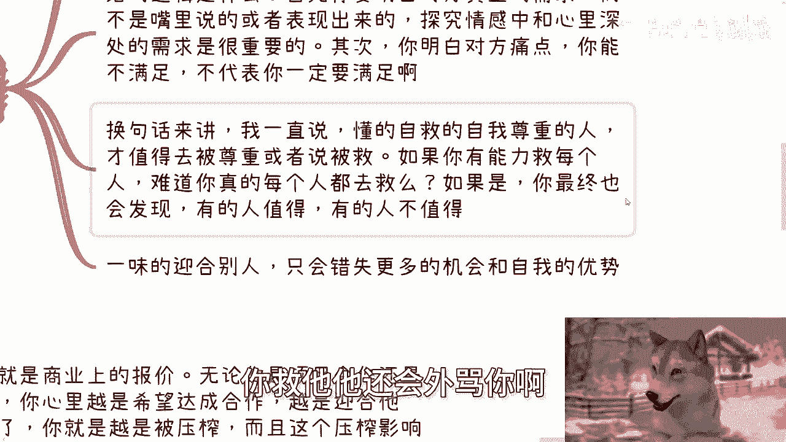

# 课程P1：阻碍你赚钱的绊脚石1：迎合他人 🚫

在本节课中，我们将要学习一个阻碍你赚钱的关键心态：迎合他人。我们将深入探讨“迎合他人”与“满足需求”之间的本质区别，并通过具体案例理解其危害，帮助你建立更健康的商业与处事原则。

---

## 活动通知 📢

本周日（28号）下午，在东直门地铁站附近将举办一场线下活动。

本次活动内容大致包括：
*   讲解私企、国央企、外企及出国等职业选择与未来发展。
*   探讨个人从事跨境电商与自媒体是否仍值得投入，以及相关风险点。
*   普及低空经济相关知识。

了解详情与报名请私信。

---

## 核心概念辨析：满足需求 vs. 迎合他人

上一节我们预告了活动信息，本节中我们来看看核心议题。首先需要明确一个关键区别：满足客户需求不等于迎合他人。

有人可能会质疑，强调满足客户需求本身就是一种迎合。这种看法是片面的，因为它将书本上的道理视为僵死的教条。社会与人是活的，做事需要结合情感、思想和具体情境，不存在放之四海皆准的标准答案。

迎合他人，在任何层面上都是一种糟糕的策略。例如在恋爱中迎合对方，就成了“跪舔”，这往往无法达成目的，甚至可能招致恶果。许多人抱怨“我已经如此卑微，为何还得不到想要的”，这实质上是巨婴心态。

俗话说“放下屠刀，立地成佛”。其真意在于，成佛的关键是内心与思想上的真正觉悟与转变，而非仅仅是行为上做做样子。许多人恰恰不明白这个道理。

---

## 两者的本质差别

那么，“满足需求”与“迎合他人”的本质差别究竟何在？

**满足需求**的逻辑是：你明白对方要什么，或知道其痛点所在，然后提供对应的产品或服务。这是一个基础的、静态的逻辑。

**而“迎合他人”则涉及更动态、复杂的层面：**
1.  你需要洞察对方内心深处的真实需求，而非其口头表达或表面诉求。
2.  更重要的是，即使你有能力满足对方的需求，也不代表你必须去满足。能力与行动之间没有必然的因果关系。

懂得自我尊重、懂得自救的人，才值得被尊重或被拯救。如果你有能力拯救每个人，难道你真的要去做吗？如果答案是肯定的，那么这种“圣母”心态最终很可能会让你陷入困境，因为并非所有人都值得拯救，你的善举甚至可能招致怨恨。

一味地迎合他人，只会让你错失更多机会并丧失自我优势。

---

## 商业案例：报价中的迎合陷阱

为了更具体地说明，我们来看一个商业上的常见例子：报价。

在项目或服务合作中，你内心越是渴望达成合作，越是去迎合对方，你就越容易被压榨，且这种影响极为深远。

以下是事情可能的发展链条：

1.  初始状态：一个项目，三人做十天，你报价10万元。
2.  对方画饼：表示项目肯定给你，并描绘美好前景，同时提出一堆定制化需求。
3.  你的第一次迎合：你接受了新增需求，项目变为五人做十天，但你仍只收10万元。
4.  对方进一步施压：项目进行中，对方以预算紧张为由要求降价至7万元。
5.  你的第二次迎合：考虑到沉没成本，你无奈接受，最终以五人十天仅获7万元收场。

这不仅是单次损失。此后，若其他客户找你合作相同规模（三人十天10万）的项目，对方很可能以你“五人十天七万”的先例来压价。行业圈子很小，信息流通很快。

你不停地迎合对方、降低标准，最终只会让自己完全陷入被动。更糟糕的是，如果你拒绝后续的不合理要求，对方还可能倒打一耙，指责你区别对待，让你有口难辩。

---

## 普遍危害：丧失主动与积累

做任何事都一样，迎合的结果就是不停地被坑。

一味地迎合所谓“需求”，别说赚钱，基本就是在被坑害。这就像你是一个“舔狗”，只不过舔的不是恋爱对象，而是所有意图压榨或攻击你的人。

例如在做自媒体或电商时：
*   看数据增长、看品类热度，哪个好做就做哪个，这本身没错。
*   但关键在于，你必须思考自己的**核心竞争力**是什么，必须有一条**主线的商业路线**。否则随时可能在一棵树上吊死。

如果你总是别人说什么主题火、什么品类好，你就去做什么，那么你最终积累了什么呢？你为自己构建了怎样的**护城河**？通过实践总结出了怎样的**方法论**？

答案可能是：什么都没有。你只是在迎合。

长此以往，你会发现，不迎合就没有流量，不迎合就没有收入。你永远处于被动状态，不是在为自己做事。更危险的是，你可能做了某个内容，别人就等着举报你；卖了某个品类，平台就等着封禁你。

因此，必须设立底线。我们有能力做某事，不代表我们一定要去做。就像提供咨询，如果对方自己都不知道问题何在，我收了钱也难提供价值，最终反而可能被抱怨。这无异于“拉不出屎怪马桶没吸力”。

很多时候，在某个节点上迎合对方，你可能赚得更多，心中窃喜。但你要明白，你埋下的每一个“雷”都是定时炸弹，不知道何时会引爆，甚至可能连环爆炸，将你彻底摧毁。到那时，还谈何赚钱？不赔钱已是万幸。

---

## 总结与咨询建议

本节课中我们一起学习了“迎合他人”这一赚钱绊脚石。我们辨析了它与“满足需求”的本质区别，并通过商业报价等案例，深入理解了无底线迎合所带来的被动处境、价值损耗与长期风险。核心在于，建立底线、保持主动、聚焦构建自身核心竞争力与护城河，才是健康可持续的发展之道。

最后，关于个人咨询：如果你目前在职业发展、个人副业或项目合作中，涉及到合同、分红、商业计划、职业规划等问题，或希望基于你手中的资源和背景，获得更接地气的市场分析与建议，可以整理好具体问题与个人情况后，再联系我进行咨询。

---