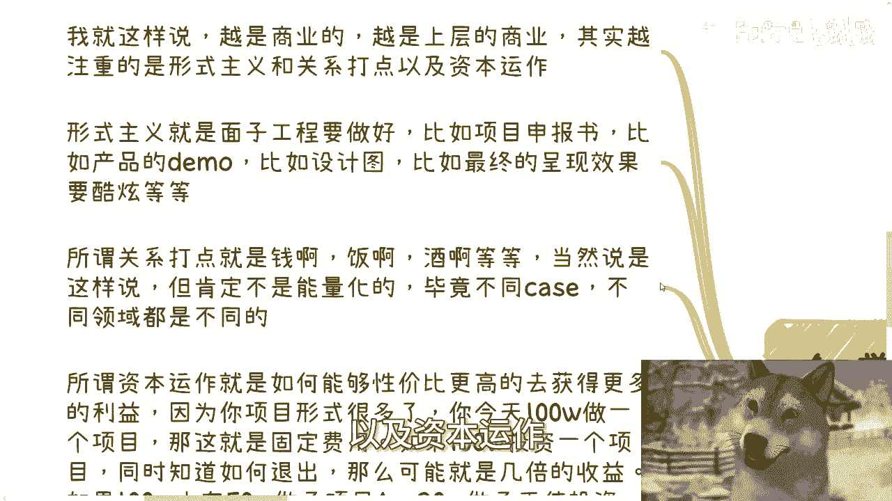

# 阻碍你赚钱的绊脚石2-用幻想当依据---P1---赏味不足---BV12w4m1k7df


## 概述
在本节课中，我们将探讨一个阻碍许多人实现财务目标的核心问题：**用幻想作为决策依据**。我们将分析几种常见的、基于错误认知的幻想，并揭示其背后的现实逻辑，帮助你建立更务实、更有效的行动基础。


---

## 一、对学历价值的过度幻想 🎓
上一节我们介绍了阻碍赚钱的普遍心态，本节中我们来看看第一个具体表现：对学历价值的过度幻想。

许多人认为，高学历是进入任何领域、获得合作的“敲门砖”。他们认为没有学历，别人就不会与之合作甚至交谈。然而，这种认知往往是社会、家庭或学校灌输给我们的思想钢印，而非基于现实世界的真实观察。

事实上，学历的重要性因时代而异。在10年或15年前，一个名校背景或许能带来合作机会与仰慕。但在今天，情况已大不相同。

*   **学历严重贬值**：在专升硕都可以用钱购买的时代，学历本身的稀缺性和信号价值已大幅降低。
*   **商业世界的核心是价值交换**：在商业合作中，当你介绍自己时，若首要强调的是学历，这恰恰说明你缺乏更直接的**资源**、**变现能力**或**项目积累**。学历本身无法直接带来收入。
*   **可能产生反效果**：在某些情况下，过分强调“海归”等光环，甚至可能让人怀疑你的务实性或怀疑你是骗子。


**核心公式**：
```
商业合作的有效性 ≠ 学历高低
商业合作的有效性 = 可提供的价值（资源/技能/解决方案）
```

因此，将学历视为不可逾越的门槛或万能钥匙，是一种脱离当前市场环境的幻想。

---

## 二、对“牛人/大佬”的神秘化幻想 👑
接下来，我们剖析第二种幻想：对所谓“牛人”或“大佬”的神秘化与崇拜。


在我看来，众生平等，每个人的硬件条件差异不大。真正的区别在于**视野、格局、运气和所处的时代**。许多人列举马云、马化腾、Elon Musk等人，认为他们拥有非凡的远见。


但事实是，在每个时代，拥有类似远见和能力的人并不少。成功的关键往往在于**运气**——合适的时代（天时）、合适的合作伙伴（人和）、合适的市场土壤（地利）。当一个人抓住了这些契机并取得积累后，其视野和格局自然会扩大，从而被外界视为“大佬”。


**核心逻辑**：
```
所谓“成功者” ≈ “普通人” + 独特的“运气契机” + 后续的“正反馈积累”
```

绝大多数岗位（95%-98%）的工作内容，对于一个正常人而言，在3-6个月内都能成为熟练工。这与学历关系不大。因此，神化他人只会矮化自己，关键在于识别并抓住属于自己的契机。

---

## 三、对“原始积累”的刻板幻想 💰
第三个常见的幻想是：在开始任何事情之前，必须完成“原始积累”或拥有足够的“资本”。

持这种想法的人，常常将这句话作为拖延行动的借口。当被问及“具体要做什么？需要多少资本？积累什么？”时，他们往往答不上来。这意味着他们**没有清晰的目标和路径**，只是在空泛地等待一个永远不成熟的“开始时机”。


这个道理在过去（如15年前自己组装电脑、手动安装驱动）可能更适用。但在2024年的今天，互联网和商业模式提供了大量**低门槛、轻资产的切入点**。许多机会并不需要传统的巨额资本或漫长积累。




**核心警示**：
```
“我需要先积累” ≈ “我尚未开始思考具体目标与路径”
```

时代在变，成功的路径也在多样化。固守过时的“先积累后行动”的线性思维，会让你永远停留在准备阶段，错失当下的机会。

---

## 四、对“商业合作”形式的高大上幻想 🤵
最后，我们探讨一个最离谱的幻想：认为高级的商业合作都是关于尖端技术、完美产品和精英团队的。

实际上，越是上层的、规模化的商业合作，其核心优先级往往是：
1.  **关系打点**（人脉、信任建立、利益沟通）
2.  **资本运作**（金融与商业模式设计）
3.  **产品/服务本身**（执行层的事情）

**产品交付**只是最基础的一层，赚取的是固定的“死钱”。而**资本运作**则能实现性价比更高的收益。例如：
*   **单纯项目**：投资100万，交付后赚取100万。
*   **资本项目**：投资100万，通过股权设计，可能获得项目估值增长带来的数倍收益。
*   **做局运作**：将资金分配于项目A、投资天使项目B，并撮合A与B合作，从而同时赚取项目利润和多个公司的估值增长收益。


**代码比喻**：
```python
# 低级模式：赚取固定劳务费
income = project_fee - cost


# 高级模式：通过资本与规则设计获取超额收益
income = (equity_return_A + equity_return_B + project_fee) - cost
```

许多技术顶尖的团队却需要依靠中介才能找到项目，原因就在于他们只擅长“执行”，而不擅长“找钱”和“设计交易结构”。商业的核心是**价值发现与资源整合**，而非单纯的技术实现。将精力全部投入到对技术“高大上”的追求上，反而可能限制你的盈利天花板。

---

## 总结
本节课我们一起学习了四种以幻想为依据的错误认知：
1.  **迷信学历**是万能敲门砖，忽视了价值交换的本质。
2.  **神化成功者**，忽略了运气和时代契机的作用。
3.  **空等原始积累**，用模糊的借口拖延实质性的目标规划与行动。
4.  **误解商业合作**，过度关注执行层面的“高大上”，而非决定利润分配的关系与资本逻辑。

这些幻想的共同点是：它们都不是来自亲身实践的一手经验，而是被灌输或臆想的二手结论。**用错误的依据做决策，必然导致高昂的试错成本和曲折的路径**。破除这些幻想，建立基于现实观察和实操的认知，是迈向有效赚钱的第一步。


---
**行动建议**：如果你在职业规划、副业开展、商业合作（合同、分红、融资）等方面需要结合具体背景的、接地气的建议，可以系统整理你的个人情况与问题列表，以寻求更落地的指导。