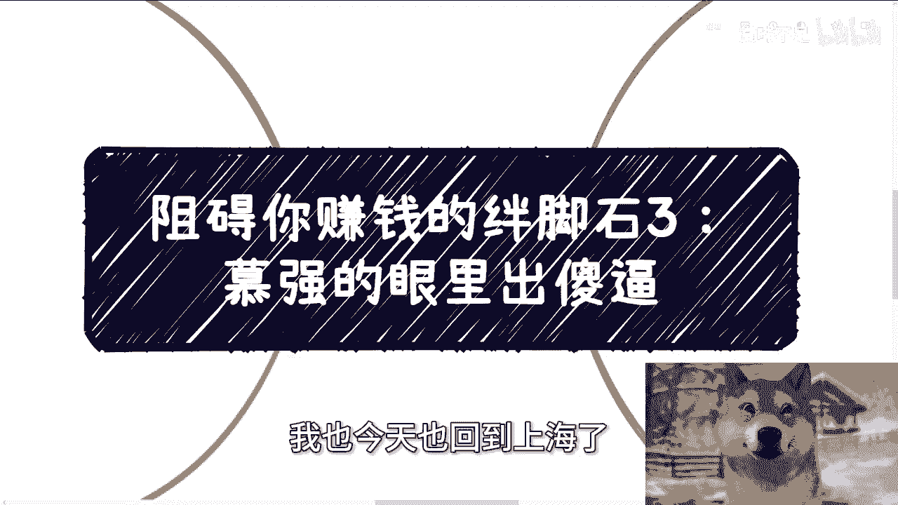
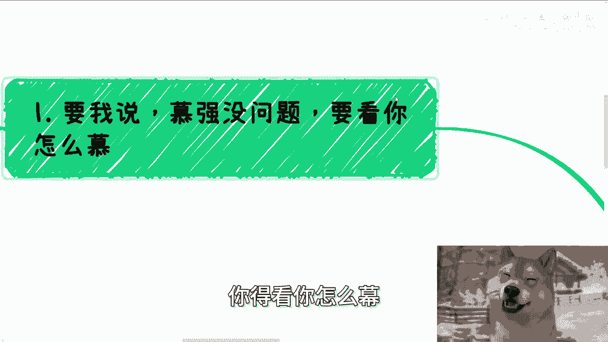
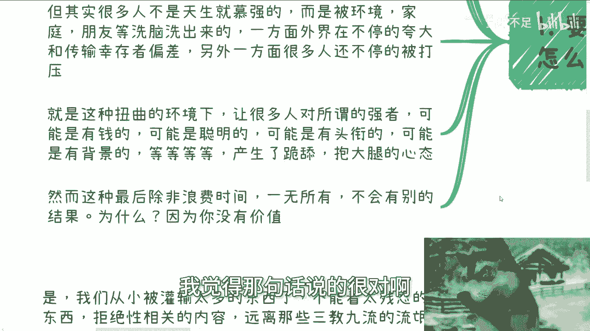
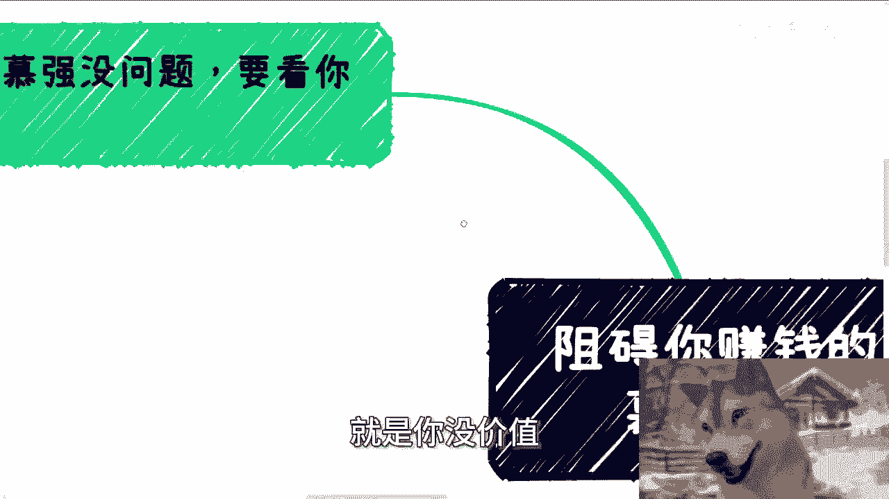
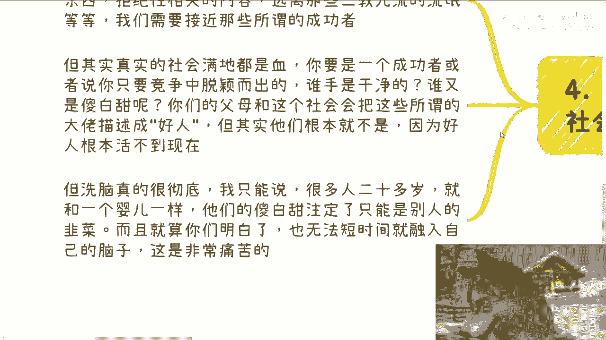

# 阻碍你赚钱的绊脚石3：慕强的眼里出傻逼 - P1 - 赏味不足 - BV1oS421X7cG

哈大家好啊，这个北京活动已经结束了啊，我也今天也回到上海了。

那么今天我们来讲的这个主题呢，叫做阻碍你的赚钱的绊脚石三啊，这个慕强啊，然后呢我也不想再含蓄了啊，就他妈直接一点啊，幕强的这个眼里有句俗话怎么说的啊。

情人眼里出西施啊，我就跟你们讲，慕强的眼里出，就这么简单啊，那你要我说呢，幕墙呢本身没有问题啊，但取决于呢你得看你怎么木。

这就像我们说的，你说你情人眼里出西施行不行行啊，那他他他得是个西施啊，对不对，那往往他妈的他也是个，你也是个啊，那么在这方面呢，情感跟商业是一样的啊，所谓这个情人眼里出西施啊，是一个道理。

那幕墙呢我觉得没有问题啊，前提你得有分辨能力，那很多人花了几年甚至十几年甚至几十年，他都无法去分辨所谓的真假，所谓的是非啊，他靠的都是别人啊，别人说什么是什么，别人说什么听什么，这就像一根风中摇摆的。

这个叫什么狗尾巴草嗯，那但其实很多人呢不是天生就慕强的啊，这点我也发现了，你说他天生啊，这个幕墙呢，我你说有没有我信的啊，但是你说这么多人天生幕强，我就不信了啊。

所以说很多人很多人呢其实是后天啊被环境啊，啊家庭啊，朋友啊等洗洗脑洗出来的，那一方面呢外界你会发现父母啊对吧，这个朋友啊，老师啊啊，那么在你们还小的时候，他就不停的夸大啊和传输所谓的幸存者偏差啊。

这些人牛逼啊，这些人啊这个什么神童对吧啊，那么另外一方面呢，他还会不停的去打压你们啊，那当然了嗯在这个事情里面，你你说他们是故意的吧，那我也我我也说不准啊，但是不管怎么样，呃。

可悲的是这个社会事实就是这样子啊，那么就是在这个扭曲的环境下面呢，那让很多人呢觉得所谓的啊强者，比如说可能有钱的啊，不可能聪明的啊，可能有头衔的啊，可能有背景的啊，可能有高学历的等等等等等啊。

产生了那种就是说跪舔啊，包括就是说患得患失啊，就觉得就是说啊你要我说呢，我说的不好听点，就是他妈的你们会觉得他是个人，你们根本不是人啊，然后就会患得患失啊，就我做了些什么，是不是啊，让他不开心了。

我说了点什么话，是不是会惹她生气啊，我跟你们讲滚他妈蛋，结果呢你们但凡这么做，只会浪费时间，一无所有，我跟你们讲不会有别的结果啊，还是那句话，我觉得那句话说的很对啊。

舔狗一无所有对吧啊，我们你不要问为什么为什么，为什么就是你没价值。

因为当然啊，这个时候有有我如果啊我就是说啊，我说如果我当面说，我相信肯定有人反反驳了，哎陈老师，你怎么敢说我们没有价值对吧，那我就告诉你，任何事情都是有因果论，在这个地方的，你但凡是一个无脑慕强的人。

你就没有价值，为什么，因为你但凡是一个有价值的人，你不会无脑慕强的。

就这么简单啊，那么第二当你上头时候呢。

这本身别人是无法干涉的啊，所以要我说啊，只有在大家冷静的时候，更多的进行沟通啊，多少还有点效果，如果呢比如说你现在就是个上头状态啊，你现在比如说正在看这个视频啊，我就这么说，不管我怎么说啊。

不管我他妈的花了一个小时，两个小时说没用啊，啊因为在你眼里啊，你已经坚信了，你幕墙的那位大佬会带你走上人生人生巅峰啊，会让你赚到钱，会让你得到你想要的一切啊，然而呢你根本就不关心啊，这个人有什么。

这个人会什么，以及你自己有什么，你自己会什么，那凭什么他会带你，他不带别人对吧，其实你已经无所谓了，因为你觉得这个就是一根救命稻草，你想抓住他罢了，你根本不想讲道理，所以这在这个时候，无论谁跟你讲啊。

这个人不好，或者让你就是啊讲道理啊，摆事实啊对吧，举例子啊，跟你讲这种有的没的，包括我啊，我我们都是敌人啊，那么当你上头的时候呢，其实你已经开始浪费自己的时间了啊，我们在冷静的时候，客观的说啊。

如果这个人真是大佬，那么他根本就不可能去带你，我他妈的就就非常斩钉截铁的，跟非常一刀切的跟你们讲，不可能啊，如果不是，那么我跟你讲，你只会一地鸡毛，不就这么简单吗，对不对，我我以前就给你们举个例子。

你就像你就像啊，你说私信找我，他甚至可以跟我说，哎付给我钱对吧，就是付钱来给我打工，包括来和我就是帮我做事情的不少啊，对不对，但是一样的道理啊，如果我答应我，只有一种可能性，就是我要割他韭菜，难道什么。

难道难道说哦我答应了，我真的愿意带他，我我还是那句话，任何事情都是有因果论的，我但凡愿意带他，那就意味着我是个，不就这么简单吗，对不对，那么第三你千万别觉得你有判断能力啊，我跟你们讲啊。

真的说来也很好笑的，我不是说你们不好啊，咱客观的说我们所有人，包括你包括我啊，我们所有人，我们在出学校之前，我们在学校里面，不管你在什么学校，都不会来教你社会的规则，更不会教你商业的规则以及金融的规则。

包括识人的规则对吧，包括判断社会上包装啊，包括怎么看待真的假的不存在的啊，那么我们假设啊今天一个人40岁，或者你们我们啊大家到40岁，你读书读25年，剩下15年工作，但你会发现。

我们还是对上面我们说的这些东西一无所知，你别说你工作15年，你工作55年，你也是一无所知啊，对不对，然后所有的信息来自于网络，来自于各种短视频，没有任何的自己的经历跟积累啊，然后还自信跟我说。

我有判断能力，有什么判断能力啊，啊对吧，我我就我就这么跟你们讲，我们就拿融资来讲，我好歹啊我好歹2018年19年，我把中国的十大天使融资，我一个一个谈过来，虽然我最后没有任成功。

但是整个流程我都是走过的，对不对，我不是说我今天到网上去看了一下啊，别人怎么融资的啊，别人可能怎么怎么弄的对吧，我只上台面来跟你们讲，没有用的，因为真正我跟你们讲过了，真正的战斗，真正的分辨是线下的人。

线下的察言观色，甚至一个细节的这种表情对吧，甚至一些东西这些才是重点，你在网上看那些东西都是死的，就跟你读了20多年书，他妈读出来都是死理论是一个道理啊，对不对，那你说你没有任何的经历跟积累。

你还相信你有判断能力，这他妈不是地狱笑话是什么啊，那你就我跟你讲啊，核心就是在你拥有真正的自己的经，历跟经验之前，你记住啊，你就没有判断能力啊，不要在那边就是切，怎么说呢，在那边啊，就是叛逆对吧。

或者说纠结，有的没的，我我就有你没有啊，不好意思，你没有啊，不但你没有，你爸妈也没有，你身边人也没有，就这么简单啊。

第四你我可以这么说，打破幕墙就是你了解真实社会的第一步，我跟你讲，是我们从小灌输太多东西，比如说不能看太残忍的东西，比如说拒绝性相关的任何的内容，比如说家长就教导我们要远离那些该溜子对吧。

那些所谓三教九流的流氓对吧，我们需要接近那些所谓的成功者，或者在他们眼里就啊叫什么就高学历的对吧，或者说是那种啊好像正派的那些人，但其实我就这么说嘛，真实的社会满地都是雪对吧，你就像昨天北京活动。

我跟他们讲，这个上海也不是上海了，就各地方那种创业者的故事对吧，你要是一个成功者，或者说你只要是个竞争中能脱颖而出的人，我我就这么说，谁的手是干净的啊，谁又是傻白甜呢，你们的父母跟这个社会。

会将这些所谓的大佬描述成好人，但其实他们根本就不是啊，因为好人根本就活不到现在啊，你给我去举举几个例，举几个例子，或者说找几个企业啊，手上不沾血的啊，这一路一路傻白甜过来，能做到现在的用吗。

哪个人啊啊不存在的啊，但是我跟你们讲洗脑是真的很彻底，我只能说啊，很多人20多岁就跟一个婴儿一样，他们的傻白甜注定了只能成为别人的韭菜。

而且就算你们现在明白了，你们也无法短时间内，就将这种我们说的商业思维，或者说把你们以前洗脑的这些东西，短时间内去除，把在自己的脑子里面去掉很难，这是非常痛苦的对吧，那我给你们打个比方啊。

你就像昨天活动结束，有个小伙伴线下见过面了对吧，活动刚结束，他就跟我说，大家唱唱啥，你能不能在群里面让大家介绍一下，我说不能，为什么很简单啊，我我我来发一句话，让你们介绍一下，我能赚钱吗，我能吗。

我为什么要去做我不能赚钱的事情，哎奇了怪了，对不对，就是就我们不是来判断这件事情好是不好的，我我跟你们这么说，我上来第一句话回他怎么说的，我不是个慈善家，对不对，你要我就这么讲。

你要觉得群里面大家要介绍的对吧，那么你如果自己去加别人，我管不着对吧，我也没这个权利来管，但是如果你希望我来帮你去发的，来艾特一下大家对吧，然后群里面大家能够介绍一下的，那可以啊，要么你给我一点。

给我一笔钱，要么你众筹，让群里人给我一笔钱，就这么简单，对不对，还是那句话啊，你我们有句老话叫什么叫勿以恶小而为之对吧，那其实以什么道理一样的道理，就是当你作为一个资本家，当你要去赚钱的时候。

当你要进入一个商业社会的时候，我就像我以前说的，我不关心你给我多少钱，我关心的是个态度，而同样的我自己也得有这个态度，但凡我就是今天去做了一些不赚钱的，这个慈善家的事情，那意味着什么。

意味着我的这种心态最后只会让我万劫不复，对啊就这么简单啊。

你们可以想想看想想看行好吧，那么今天这个我们就讲到这啊，然后就是职业规划，商业规划啊，包括你们现在呃自己的工作当中啊，包括跟别人做副业啊，合作当中啊，啊有些分红分润啊，合同啊，商业计划书啊。

白皮书啊啊就是啊这个这叫什么，就是股权啊，期权啊对吧，包括其他一些这个这个设计上的问题啊，包括就是说你们希望通过我的视角，通过的事业啊，结合你们个人的问题，结合你们个人的背景啊。

能够给你们一些更接地气的一些建议，或者说呃这个希望能少走些弯路的话，当然啊我不保证一定能走到成功那根路对吧，但是我能保证的是，我绝对可以让你们少走很多弯路啊，那么呃如果有这方面的需求。

你们可以整理好对应的问题跟个人背景。

