# 阻碍你赚钱的绊脚石3-慕强的眼里出傻逼---P1---赏味不足---BV1oS421X7cG_not

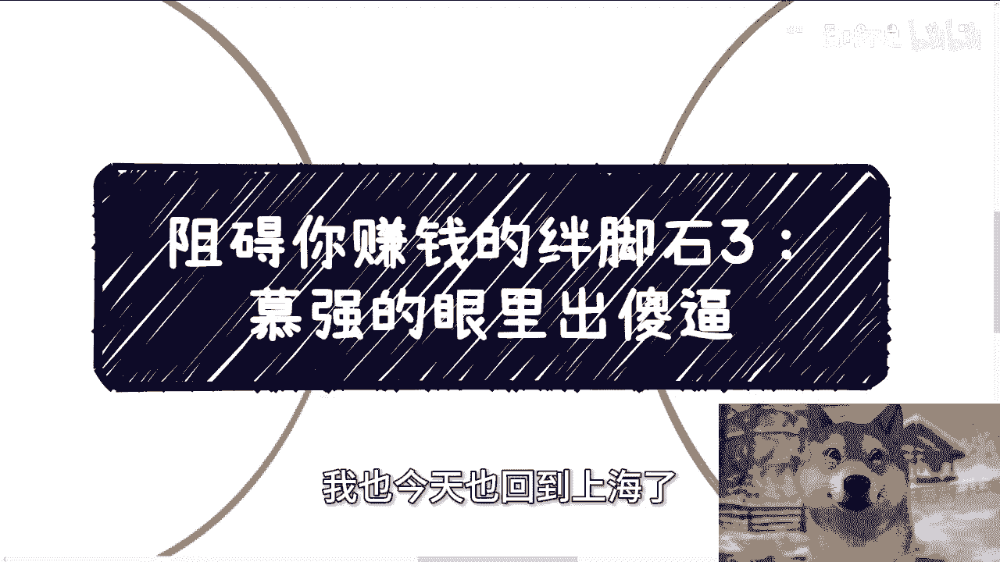

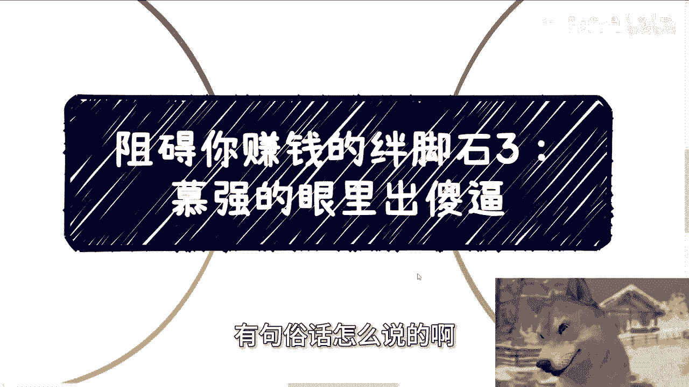

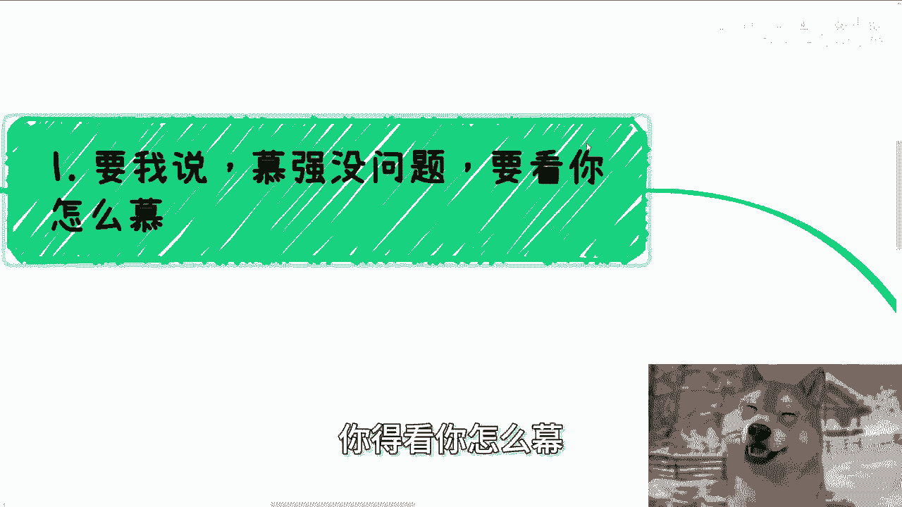

## 概述
在本节课中，我们将要学习一个阻碍你赚钱的关键心理障碍：**慕强**。我们将分析其成因、表现，并探讨如何建立分辨能力，从而避免在商业和生活中做出错误决策。

---

## 慕强现象的本质
上一节我们介绍了其他赚钱的绊脚石，本节中我们来看看“慕强”这个普遍现象。慕强本身没有问题，但关键在于你如何“慕”。

这就像俗语“情人眼里出西施”。在情感和商业中，道理是相通的。慕强的前提是**拥有分辨能力**。许多人花费数年甚至数十年都无法分辨真假与是非，总是依赖他人的判断，如同风中摇摆的狗尾巴草。

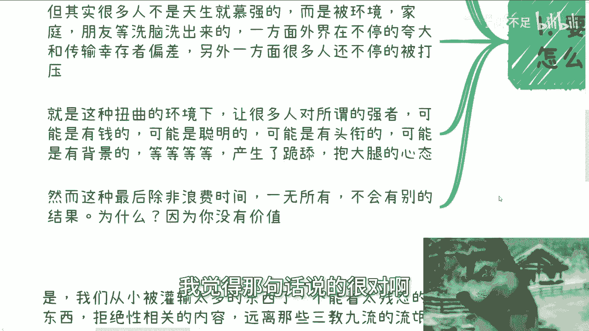

## 慕强心态的成因
很多人并非天生慕强。这种心态往往是后天被环境、家庭、朋友等因素塑造出来的。

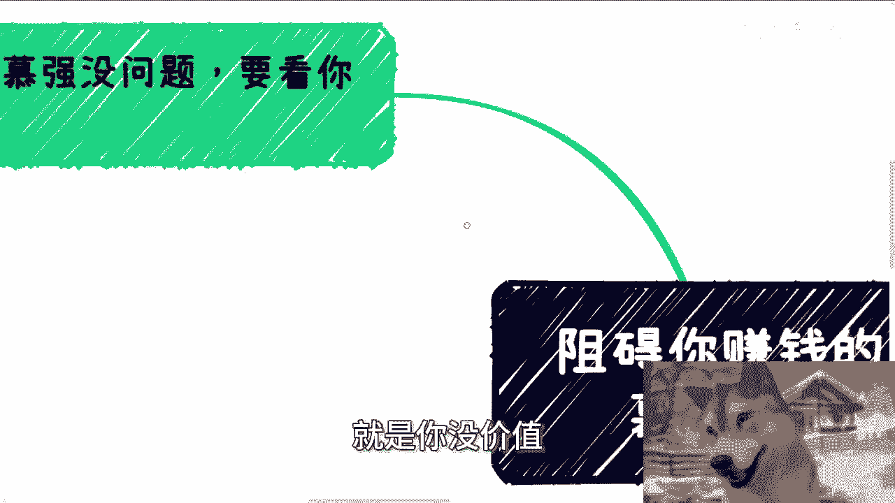

以下是其形成的主要途径：
*   **夸大幸存者偏差**：父母、老师、朋友在个人成长早期，不断夸大和传输关于“神童”、“成功者”的信息。
*   **持续被打压**：外界环境同时会不断打压个人自信。

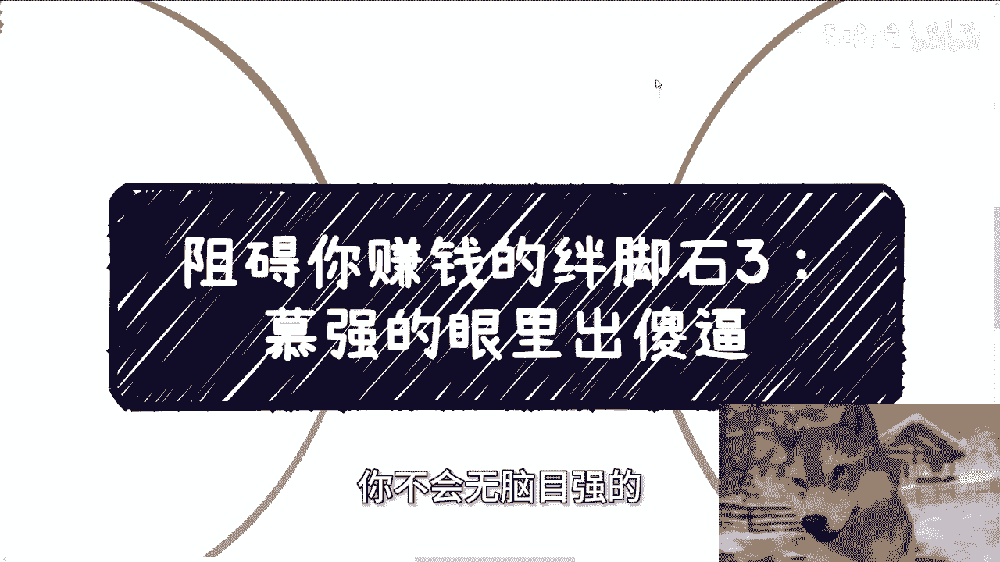

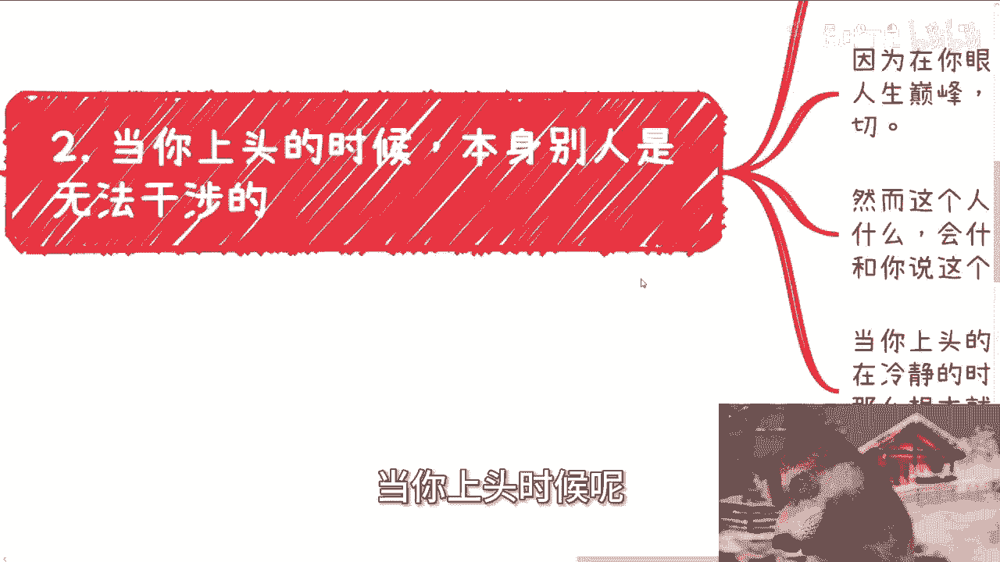

在这种扭曲的环境下，许多人会对所谓的“强者”（如有钱、聪明、有头衔、有背景、高学历的人）产生不理性的崇拜，甚至出现“跪舔”和患得患失的心态。这种心态会让你在关系中处于绝对劣势。

**核心逻辑**：`舔狗一无所有`。原因很简单，因为你没有展示出**对等的价值**。`有价值的人不会无脑慕强`。

## 慕强心态的三个阶段与危害
当你陷入无脑慕强时，通常会经历以下阶段，每个阶段都伴随着巨大的时间与机会成本。

### 1. 价值认知错位
你将自己置于低位，将对方神化。你开始担心自己的言行是否会“冒犯”对方。结果就是，你只会浪费自己的时间，最终一无所获。

### 2. 陷入“上头”状态
此时，你坚信你所崇拜的“大佬”能带你走向人生巅峰。你不再关心对方**真正拥有什么**，也不审视自己**具备什么**。你把他当作救命稻草，拒绝一切理性分析。任何劝诫你的人都成了“敌人”。

**客观事实是**：如果对方是真正的大佬，他几乎不可能无偿带你；如果对方不是，你最终只会“一地鸡毛”。这背后的因果论很简单：`对方愿意带你 ≈ 对方有所图（如割韭菜）`。

### 3. 误判自身能力
许多人自信拥有判断力，但这往往是一种错觉。我们的教育体系不教授社会、商业、金融及识人规则。许多人信息源单一（如网络短视频），缺乏真实的经历与积累，却自信能看透复杂的商业包装。

**核心结论**：`在拥有真正的亲身经历与经验之前，你没有判断能力`。这不是叛逆或纠结能改变的客观事实。

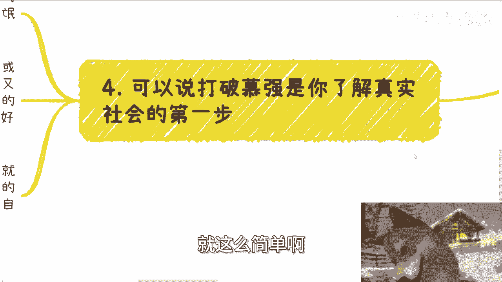

## 打破慕强：认识真实社会的第一步
要打破慕强心态，首先要认清真实社会的运行规则。我们从小被灌输要远离“黑暗面”，接近“正派”的成功者。但现实是，商业竞争充满残酷。

**一个残酷的真相**：在竞争中脱颖而出的人，几乎没有“手是干净的”。社会将成功者包装成“好人”，但“好人”往往难以在激烈的商业环境中存活至今。彻底的“傻白甜”注定只能成为别人的韭菜。

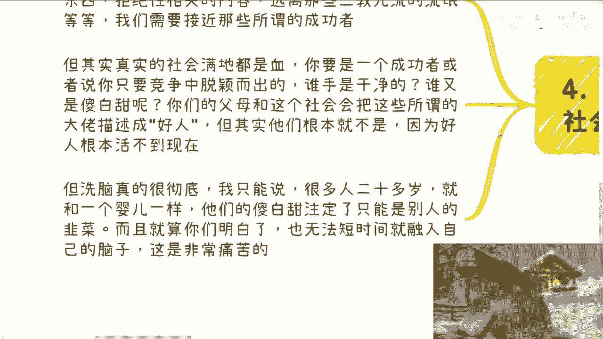

即使认识到这一点，要彻底清除被灌输的思维定式也非常痛苦且耗时。你需要建立全新的**商业思维**。

**商业思维示例**：
假设活动结束后，有人请求你在群内组织大家自我介绍。从商业视角出发，你的思考不应是“这件事好不好”，而是“做这件事能否为我创造价值”。
```text
请求：“你能不能在群里让大家介绍一下？”
商业思维回复：“我不是慈善家。如果你希望我来组织，要么你支付费用，要么你向群友众筹费用。”
```
这背后的逻辑是：`勿以恶小而为之，勿以善小而不为`。在商业社会中，维持“一切行为需考虑价值交换”的态度至关重要。随意进行无回报的付出，会模糊你的商业边界，可能导致更大的损失。

---

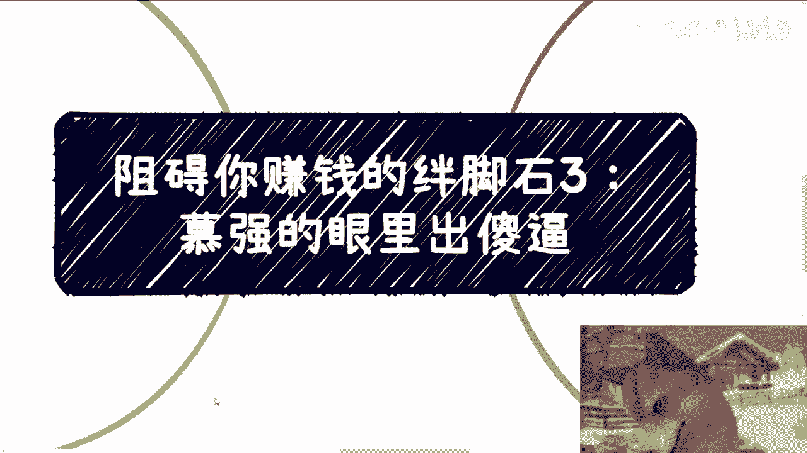

## 总结
本节课我们一起学习了“慕强”如何成为赚钱的绊脚石。我们分析了其后天成因、三个阶段的表现（价值错位、上头状态、能力误判）以及带来的危害。关键在于，必须通过积累真实经历来获得判断力，并认清商业社会**价值交换**的本质，打破对“强者”的光环滤镜，才能避免时间和资源的巨大浪费。

---

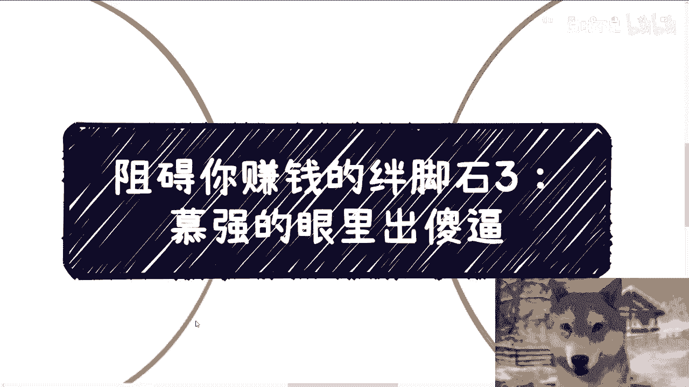

## 后续支持
如果你在职业规划、商业规划、副业合作、分红合同、商业计划书、股权期权设计等方面有问题，或希望结合我的视角与你的个人背景，获得更接地气的建议以少走弯路，可以整理好具体问题和你的个人背景进行咨询。