# 阻碍你赚钱的绊脚石4：你是个好人 - P1 - 赏味不足 - BV1Eb421J7xk

好大家好，这个今天我们讲的主题呢，叫做阻碍你赚钱的绊脚石，第四章啊，你看这个主题非常的简单啊，就你是个好人啊，这个主题其实我讲我想讲很长时间啊。

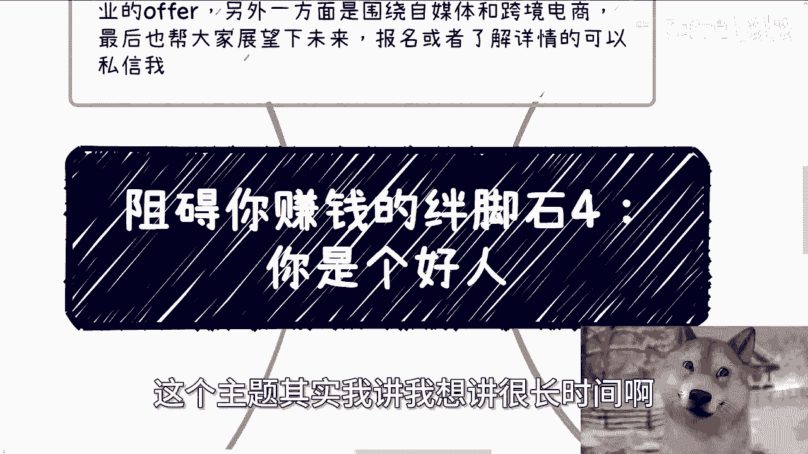

但是一直没有找到一个合适的切入点啊，终于在这个主题里面找到了啊，首先是这样子的啊，下一期活动已经定了，在下周日啊，下周日也是也就是8月11号啊，然后很多人小伙伴从去年说到今年他妈不来，也不太可能对吧。

就在长沙啊，我已经钱我也付了啊，在长沙啊，大概主题的话一方面是围绕不同的企业的offer，另外一方面围绕自媒体跟跨境电商，另外一方面呢就是帮大家展望一下，就2025年2026年吧。

啊那报名或者了解详情的可以私信我。

首先第一啊嗯我们今天这个主题，第一个啊叫做你是一个传统意义上的好人啊。

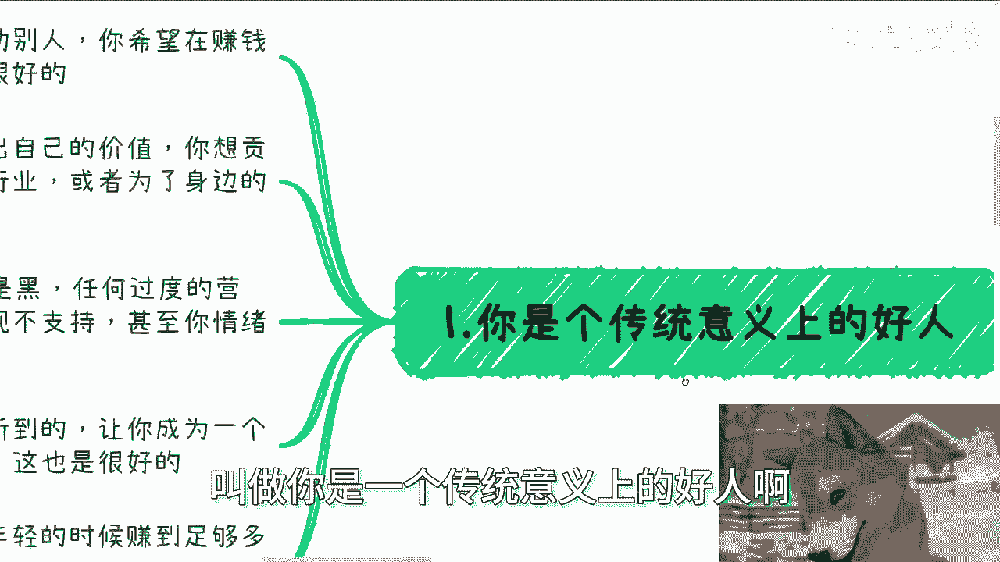

就是就如我最近一直说的，你愿意帮助别人，你希望在赚钱的时候顺便去帮助别人。

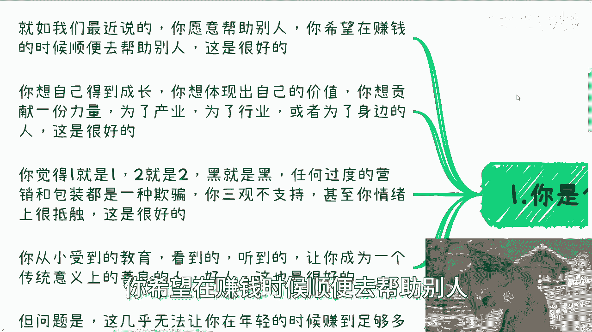

这是很好的，这是我非常赞扬的，也是非常赞同。

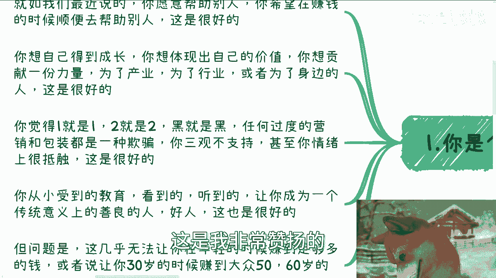

非常钦佩的一种美德啊，你想自己得到成长，你想在产业或者行业当中体现出自己的价值，你想贡献出一份力量，又或者为了身边人去贡献出一份一份力量，这也是很好的啊。

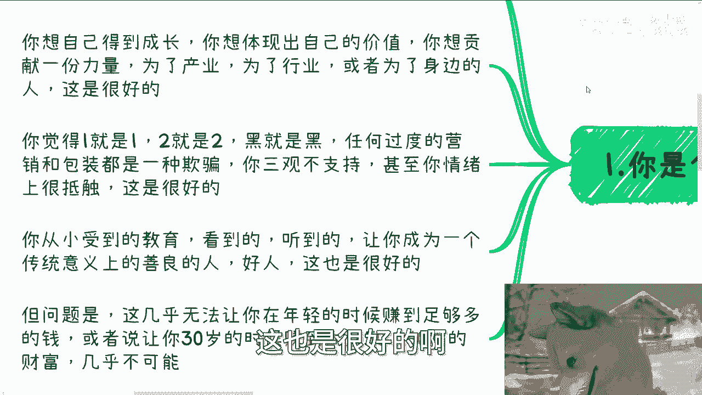

我也很钦佩你觉得一就是一，二就是二，黑就是黑，白就是白对吧，任何过度的营销跟包装啊，当然就是说可能你有一定的这种容错性啊，或者说有一定的这种弹性，但是相对来讲，一旦就稍微过度的营销或者包装。

你可能会觉得都是一种欺骗，你的三观是不支持的，甚至你的情绪上是很抵触的，这点也很好，我也非常的赞同啊，你从小受到教育，看到的东西，听到的东西，学到的东西，让你成为一个传统意义上的一个善良的人，一个好人。

这也是非常好的，这也是我非常怎么说呢，支持的，但问题就在这个地方，这些东西几乎无法让你在年轻时候，赚到足够多的钱，或者还说让你能够在30岁或者，25岁的时候赚到大众。

普罗大众50岁60岁的财富就是不可能的啊。

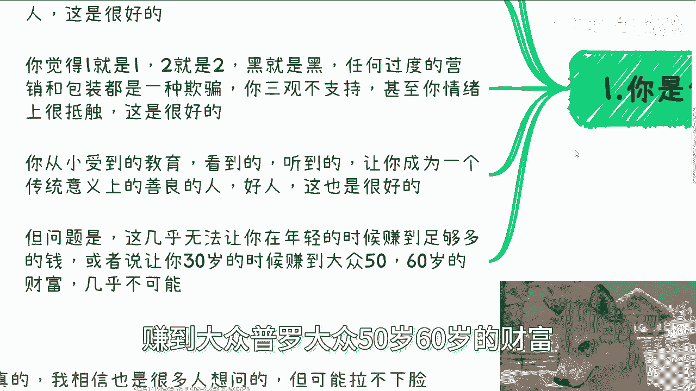

我们说什么叫赚钱，赚钱就是高效率的。

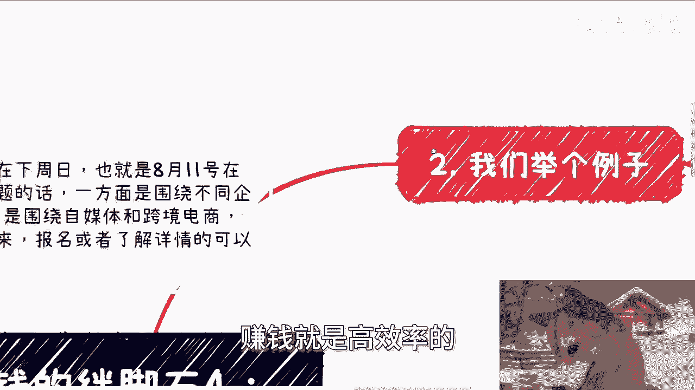

人家一年赚一年的，你一年赚10年的，这叫高效率的，但以上我们刚刚说的。

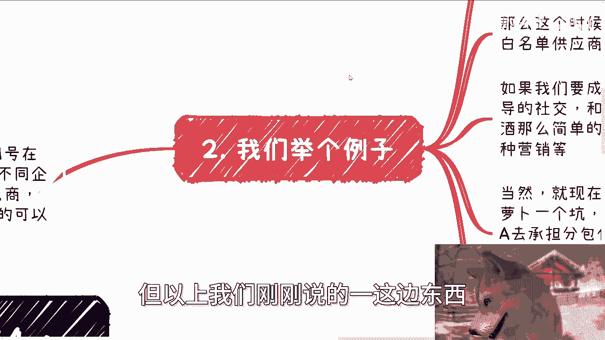

一这边的东西全部都是阻碍你赚钱的特点啊。

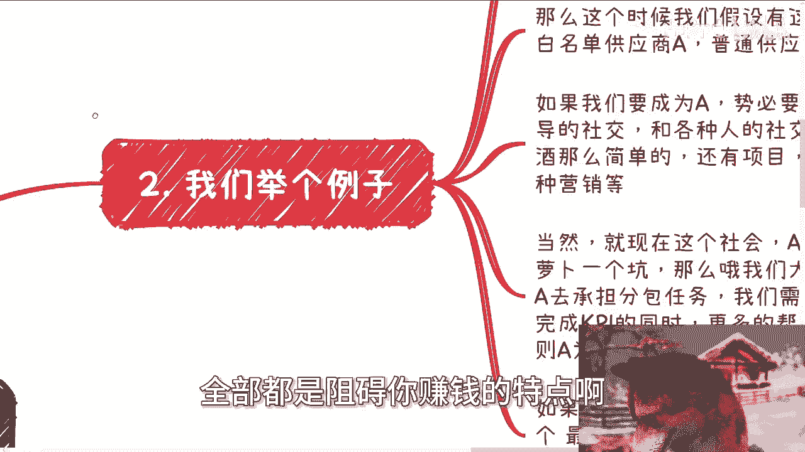

二我们举个例子啊，比如一些市里区级的软件项目采购啊，我给你们举个例子啊，区级的软件项目采购差不多不超过120万，就可以自己决定。

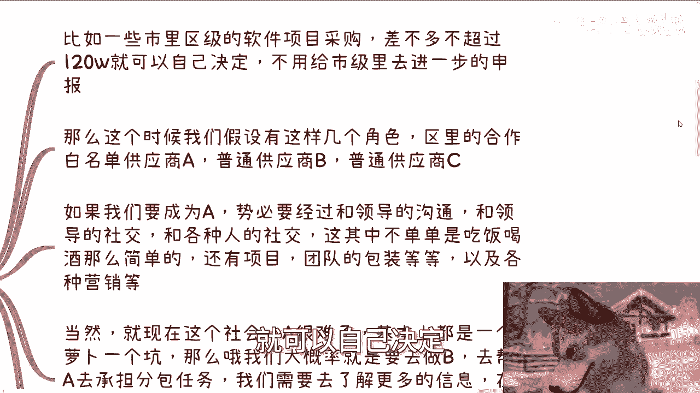

不用给市级里面进一步申报，那么这个时候啊，我们假设有这么几个角色，区里的合作白名单，供应商，A普通供应商，B以及以及所谓的普通的供应商C对吧好，那么我们想想看啊，如果我们要成为A。

那么势必要经过跟领导的沟通啊，跟领导的社交啊，跟各种人的社交啊对吧，那么这其中呢不单单只是形式层面的，比如说吃饭喝酒这么简单的，还有项目团队包装以及以及融资的包装，以及背景的包装以及各种营销都逃不掉的。

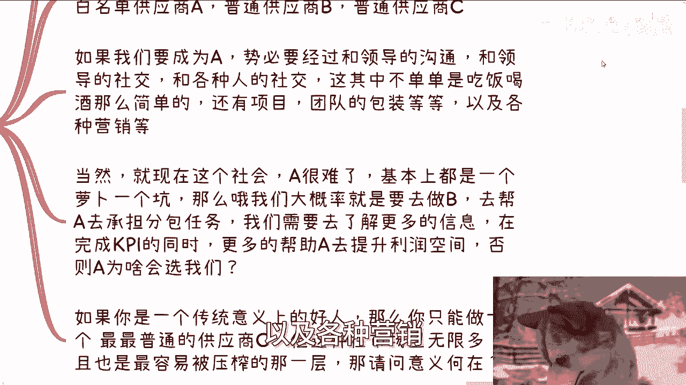

当然啊就现在这个社会A很难，因为基本上一个时代过来都是一个萝卜一个坑，对吧好，那么我们这么说，我们大概率就只能去做B，那么B这个角色是什么，就是我们刚刚说的这个供应商B嘛对吧。

那么B的这个角色是帮助A去承担分包的，分包的任务，我们需要去了解更多信息，在完成A跟领导的KPI的同时，更多的要帮助A去提升利润空间，否则A为什么会选我们，对不对，你想想看啊。

如果我们今天只是做一个普通的供应商，那满地都是对吧，那么我们之所以要跟A去打交道，就是为了去抱大腿对吧，说直白点就是抱大腿，那么怎么抱大腿，就是我们要通过我们的技术能力，通过我们的一些了解。

因为往往A自己不做，会让我们做，一定是一个新兴产业，而我们要通过我们的了解帮他去画饼，因为A对这个产业不了解，他不知道怎么画对吧，那么我们需要帮他去画饼，同时帮他争取到更多的利益，那么只有尝到甜头。

大家赚到钱，那么A才有可能跟我们有更密切的关系，也就是说在未来的很长时间里面，我们成为我们就能一直能成为A的分包商，或假说，如果A未来不做了，我们就成为里面的白名单供应商对吧。

那么如果你是一个传统意义上的好人，那么你只能去做一个最最最最普通的一个，有供应商，C为什么，因为你在这里面，你就不会包装，你也不会营销，甚至你非常厌恶包装，厌恶营销，那么我就这么问，你在一个社会上面。

你在一个国家。

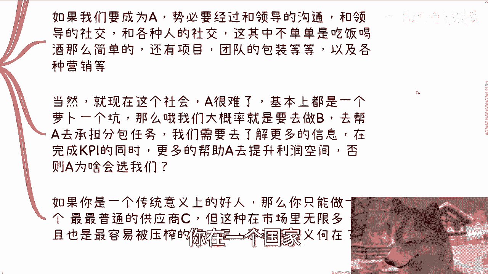

你作为一个最普普通通的供应商，那他妈的整个市场里面，像你这样的供应商无数无限多，哎那我奇了怪了，为什么别人要跟你合作，以及就算别人跟你合作，你也是最后一层被压榨的那一层，那我就请问你的意义何在，对吧好。

那么第三再举个例子，我发现很多人其实没有合作的意识，他总总觉得是一个孤胆英雄的这种感觉啊，呃或者说再露骨一点，就是他是没有做事情，他是没有所谓的战略层，战术层，执行层的这种分层的理念。

就好像就是说我们说唉今天这个人要会社交，这个人要有好的学历对吧，这个人要要有好的诶，要有开发能力，要怎么样子，他总感觉所有的能力都是集于他一身的，但是往往你们没有这个能力对吧。

就是说明明自己没有读书或者社交天赋，但是一味的去强迫自己去读读好书，读出一个好的高的学历，或者是强迫自己去社交，最后你只会苦不堪言或者抑郁对吧，我之前花了很长时间在解释一个观点，那就是无论学历也好。

社交也罢，单纯你的学历很高，或者社交能力很强很强，或者你的情商很高，或者你很会察言观色，能带来钱吗，不能因为这种技能很多人都有对吧，那么能带来钱的是什么，能带来钱的是你要懂得怎么用雪梨。

怎么用这个社交能力，怎么用这个察言观色，对不对，这就好像我我这么说啊，我我跟很多小姑娘也说过，我说你们长得好看，是不是有时是啊，然后你们会打扮，会化妆是不是优势，是也是，但是你们的好看跟打扮化妆。

不能直接给你们带来钱要怎么办，你要明白怎么去利用它，对不对，就这个社会是一个很多的灰色地方的一些东西，当然我不是说那些擦边啊，我更多的是说哎，你你懂得怎么一个很好的表情对吧。

你懂得怎么一个甜美的话术对吧，怎么样子，唉，那很多时候你的成功概率，就就就就呈几何倍增长对吧，那么就是意味着就是说学历也好，社交也好，美貌也好，谁有，其实都无所谓，你要去学习的是怎么利用这些东西对吧。

那照照你们很多人的想法，那你不是个女的，怎么滴，你跟我说，你先去整，先去变个性嘛，对不对，你要学会合作啊对吧，各取所需啊，啊那么第四今天有人问我这么一个问题啊，他们说呃呃说真的啊。

我相信很多人呢就很多人可能很想问，但是呢他拉不下来脸来问啊，就他们会这么问，他说唱啥我什么都不会啊，我也没有任何的经验，那当然他也不一定这么直白的说，他可能跟跟你呃描述它的背景啊，或者和很多东西哎。

但是总结出来就是我什么都不会，我也没有任何经验，但是我想赚钱啊，那么他就问我，他说陈老师你觉得什么方向最好，或者你有什么建议，哎我听到这个问题的时候，我都懵了，我他妈第一时间闪过的就零元购。

但是我想想不行啊，法制社会啊，我们是法制社会，我怎么能跟你讲零元购呢，对不对，但你这个问题你让我怎么讲啊，我一下子想不出来啊，然而呢我曾经说过很多遍，就当下这个社会啊，你要赚钱最大的切入点就是C端。

C端当下最大的痛点就是两个玄学跟心理疗愈，但是我回答对方之后，对方竟然跟我说，哎陈老师，你真幽默，卧槽，我一时我一时之间有点懵啊，我真的是不知道谁幽默，你知道吗，就我其实很想说，是你幽默，不是我幽默。

为什么，因为一方面你们没有任何积累，也没有任何特长，也没有任何沉淀，也没有别的东西，然后来问我建议，那么我只能给你们，符合这个社会最大基本面的切入点对吧，而然后我就说哎在当下这个社会。

这两个切入点是最容易切的对吧，但是我讲了事实，你们竟然反而觉得我在开玩笑，觉得我很幽默对吧，那记住一点啊，很多赚钱的方式，尤其是互联网普及之后，赚钱这件事情本身是没有门槛的，你要觉得有。

比如说你说爱H老师这个东西我不会啊，或者这个东西我做了，别人为什么信，或者我对别人到底有什么帮助，以及别人为什么要付钱等等等，那我就告诉你你以上的思想，所有总结出来唯一的门槛是什么，你是个好人。

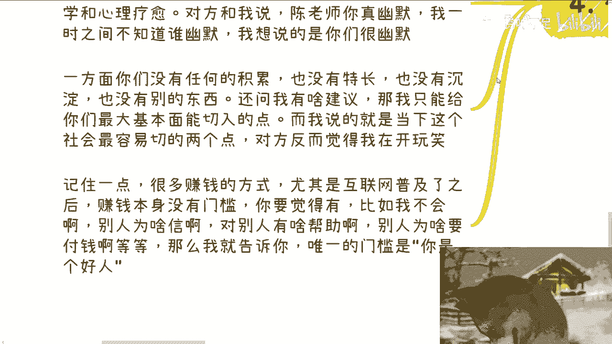

你明白吗，就是很多时候对吧，你比如说你们听完我今天这么说，你们可能会在想的是爱，那陈老师，按照你这个说法，你这个东西跟骗没什么区别，那我就这么说，第一再用心理疗愈，再用玄学或者再用别的东西骗的。

你怎么定义骗呢，对不对，就是很多人在做这种东西，你不做也有别人在做，另外一方面，你做了也有可能帮到别人，你怎么定义骗不骗呢，对不对，你为什么一定要如此的，高尚的去定义这件事情呢，更何况另外一方面。

你们现在大部分人是面对着生活的压力，面对着就是说生存的压力，那你说你说啊，就就像我我我之前问他们的，我说你们可能连饭都吃不上了，你难道还来跟我讨论说爱陈老师，我我今天去吃个饭。

你说我要不要去去穿个西装去，有必要吗，对不对，就像我一直跟你们讲的，就是你但凡去考虑这个问题，那就代表着你是一个传统意义上的好人，你是一个传统意义上的好人，这这层东西你打不破，或者你无法辩证的。

因为我不是说你你不做好人啊，我从来没有这么说过对吧，但是你如果没有办法辨认真的去看待这个问题，那么你永远赚不到钱，好吧啊行好吧。

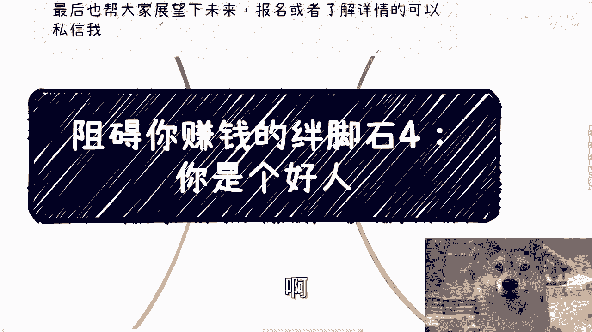

那就这么照啊，然后那个活动好吧，我已经定了，8月11号在长沙哦，要报名或者了解详情的那个私信我，那另外一方面就是说呃职业规划，那个商业规划，你们在呃工作上面或者做一些副业上面啊，这个有些合同啊，分红啊。

丰润啊，商业计划书白皮书啊对吧，股权期权啊这种啊相关的东西啊，那么你们希望通过这个跟我的沟通，通过我的一些事业，能够给你们更接地气的一些呃建议，或者未来规划的话，那么你们可以整理好对应的问题跟背景。

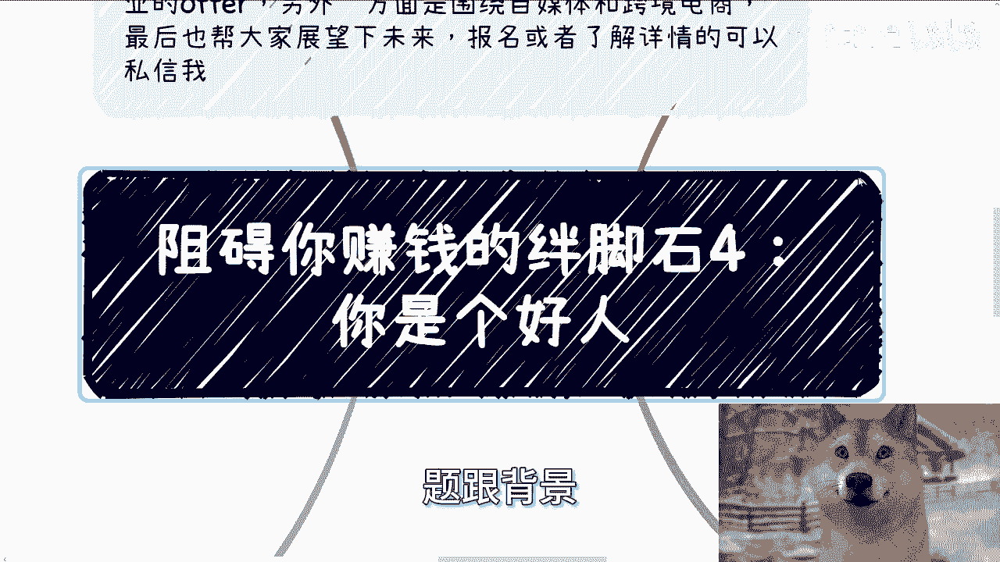

好吧。