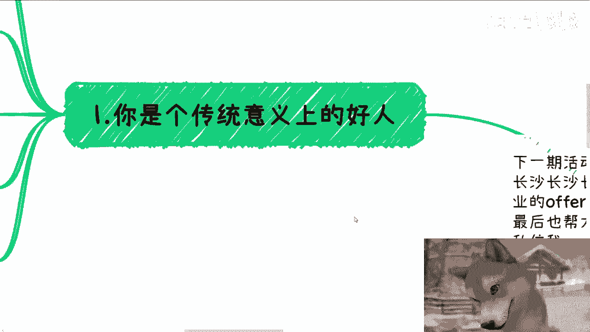
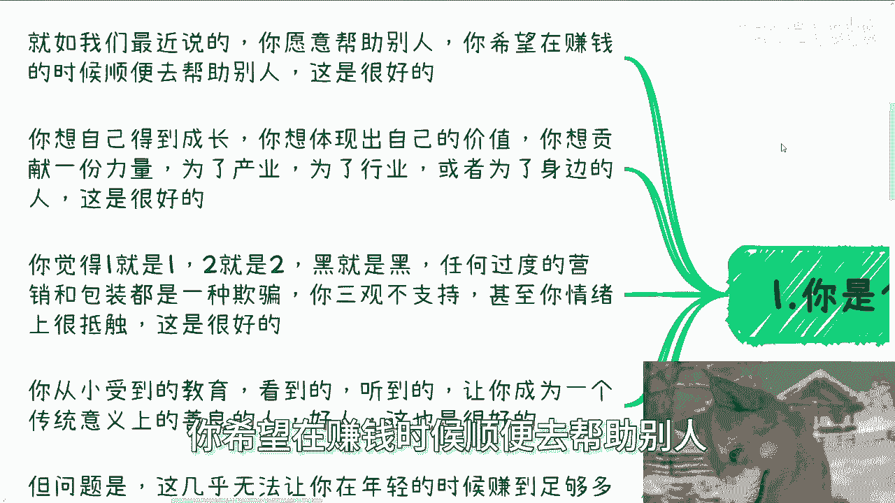
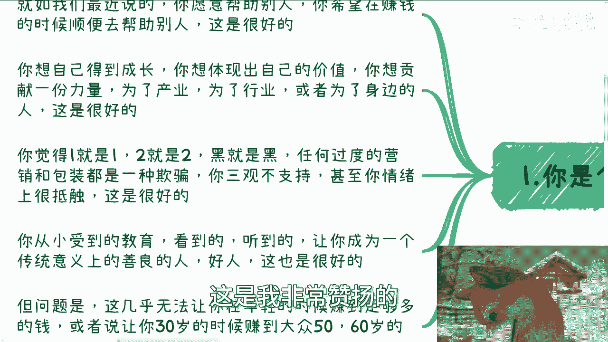
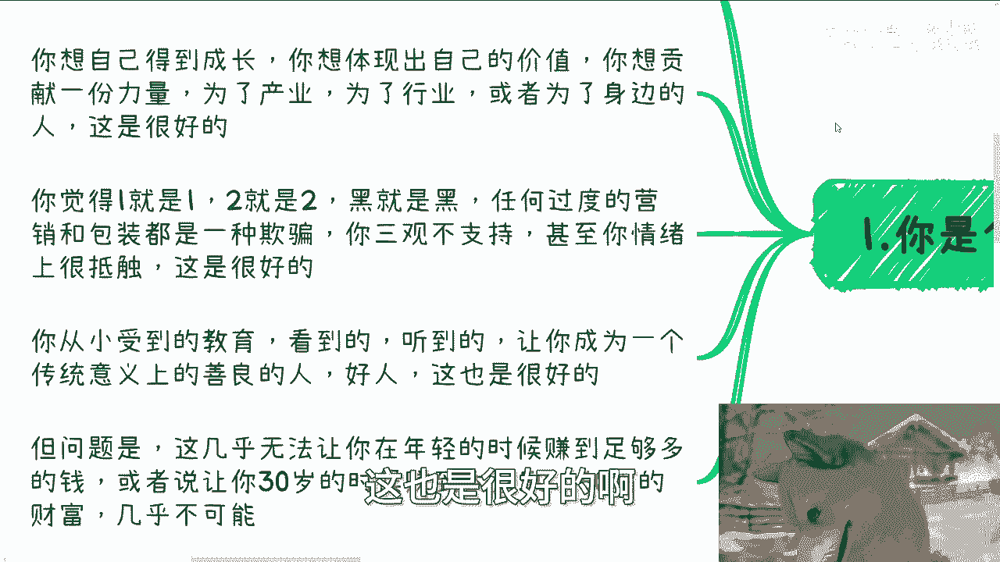
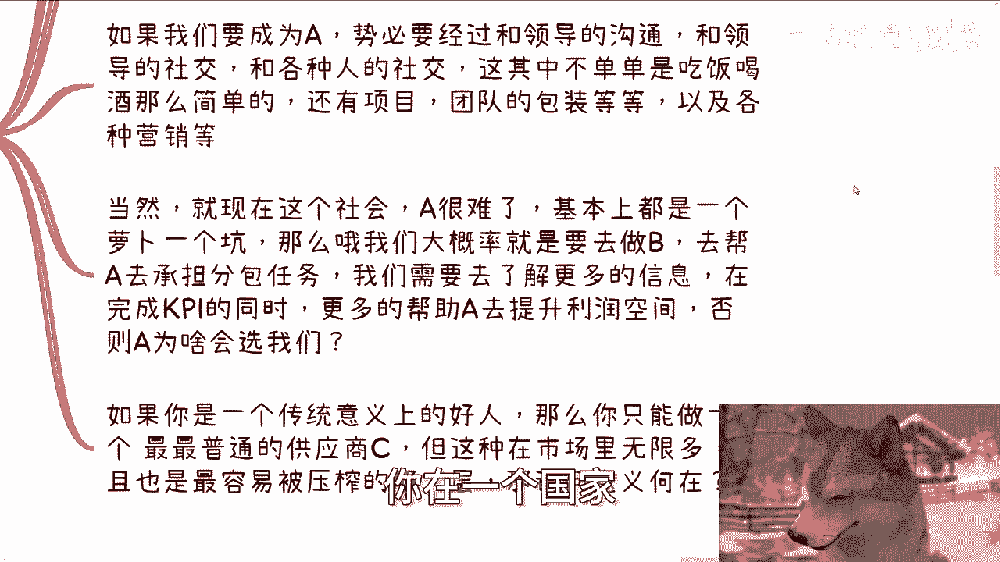
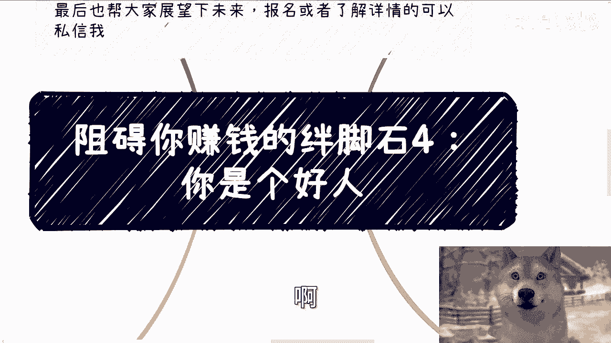
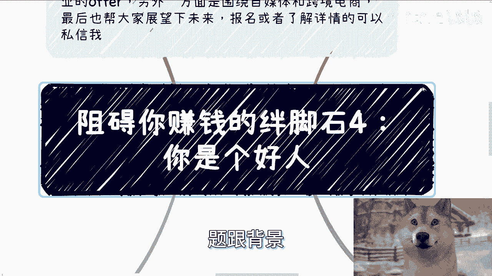

# 课程名称：阻碍你赚钱的绊脚石4：你是个好人 🧱

## 概述

在本节课中，我们将探讨一个可能阻碍你获取财富的关键心理特质：成为一个“传统意义上的好人”。我们将分析这种特质在商业环境中的局限性，并通过具体案例说明，为何过度坚守某些“好人”原则，可能会让你错失高效率赚钱的机会。

***

## 1. “好人”特质的赞扬与困境 👍

上一节我们概述了课程主题，本节中我们来看看“好人”的具体含义。

你是一个传统意义上的好人。你愿意帮助别人，并希望在赚钱的同时也能帮助他人。这是一种值得赞扬和钦佩的美德。

你想在产业或行业中体现自己的价值，为身边人或社会贡献一份力量。这同样很好。

你认为一就是一，二就是二，黑就是黑，白就是白。你对过度的营销和包装感到抵触，认为那可能是一种欺骗。你的三观不支持这种行为，情绪上也很抗拒。这一点也很好。

你从小受到的教育和所见所闻，让你成为了一个善良的、传统意义上的好人。这非常好。

但问题在于，以上这些特质几乎无法让你在年轻时赚到足够多的钱。它们很难让你在25岁或30岁时，就积累到普罗大众在50岁或60岁才能拥有的财富。

***

## 2. 高效率赚钱的定义与冲突 💰

上一节我们定义了“好人”特质，本节中我们来看看它与“赚钱”的本质有何冲突。

我们所说的赚钱，指的是**高效率地获取财富**。其核心公式可以概括为：

**赚钱效率 = 单位时间创造的价值 / 大众平均单位时间创造的价值**

当别人一年赚取一年的收入时，你能一年赚取十年的收入，这就是高效率。

然而，我们之前所赞扬的所有“好人”特质，恰恰是阻碍你实现这种高效率的特点。

***

## 3. 案例分析：项目采购中的角色定位 🏢

理解了冲突所在后，我们通过一个商业案例来具体说明。

以市、区级的软件项目采购为例。一个区级的软件项目采购，金额在120万以下时可以自行决定，无需向市级申报。

假设在这个场景中有以下几个角色：
*   **A**：区里的合作白名单供应商
*   **B**：普通供应商（A的分包商）
*   **C**：最普通的供应商

以下是不同角色的生存逻辑：

*   **成为A（白名单供应商）**：这需要与领导进行大量沟通和社交。不仅限于吃饭喝酒，还涉及项目团队包装、融资包装、背景包装和各种营销手段。在当前环境下，成为A非常困难。
*   **成为B（分包商）**：这是更现实的路径。B的角色是帮助A承担分包任务。你需要了解更多信息，在完成A与领导的KPI的同时，帮助A提升利润空间。你需要利用自己的技术能力或对新产业的了解，帮A“画饼”（进行前景描绘），共同争取更多利益。只有让A尝到甜头，你们才能建立长期合作关系，未来甚至可能取代A。
*   **成为C（最普通供应商）**：如果你是一个传统意义上的好人，厌恶包装和营销，那么你很可能只能成为C。市场上像C这样的供应商无数，你缺乏独特性，合作时也处于价值链最末端，是被压榨的一层。

***

## 4. 合作意识与资源利用 🤝

上一节我们看到了在具体项目中“好人”的劣势，本节中我们拓宽视野，看看另一种思维局限。

很多人缺乏合作意识，抱有“孤胆英雄”的幻想。他们没有战略层、战术层、执行层的分层理念，总幻想自己一人具备所有能力（高学历、强社交、会开发）。

这会导致一个误区：强迫自己去获得并不擅长的能力（如强迫不善社交的人去社交），结果只会苦不堪言。

关键在于，**单一技能（高学历、强社交、高情商、美貌）本身不能直接带来财富**。能带来财富的是你**懂得如何利用这些技能或资源**。

这个社会存在许多灰色地带（并非指违法擦边）。例如，懂得利用恰当的表情和话术，可以极大提高成功概率。这意味着，无论资源在谁手里，你要学习的是**如何通过合作去利用它们**，而不是妄想自己拥有全部。各取所需的合作，才是高效路径。

***

## 5. 面对现实：从“什么都不会”到切入市场 🎯

讨论了思维模式后，我们来看一个最常见的现实问题。

常有人问：“我什么都不会，也没有任何经验，但我想赚钱。有什么建议？”

在当下社会，要赚钱的最大切入点就是**C端（消费者端）**。而当前C端最大的痛点集中在两个领域：**玄学**和**心理疗愈**。

当我给出这个符合社会基本面的建议时，提问者却可能觉得我在开玩笑。

这里存在一个认知偏差：很多赚钱方式，在互联网普及后，本身**没有硬性门槛**。你觉得有门槛，比如“我不会”、“别人为什么信我”、“我对别人有什么帮助”，这些想法总结起来，唯一的门槛就是：**你是个好人**。

你可能会质疑：这是不是骗人？

第一，如何定义“骗”？很多人正在做这些事，你不做也有别人做。而且，你做了也有可能真的帮到别人。
第二，当面临生存压力时，首要任务是解决问题，而不是执着于形式上的“高尚”。就像饭都吃不上了，不会优先考虑吃饭时是否要穿西装。
如果你无法辩证地看待商业中的“灰度”问题，永远用“传统好人”的标尺去衡量一切，那么你将很难赚到钱。

***

## 总结

本节课我们一起学习了“传统意义上的好人”特质如何可能成为赚钱的绊脚石。我们分析了其与高效率赚钱的冲突，并通过项目采购案例说明了在商业竞争中“好人”的被动地位。我们还探讨了建立合作意识、学会利用资源的重要性，以及面对现实需求时，如何选择市场切入点并克服心理障碍。核心在于，需要在坚守底线与适应商业现实之间找到平衡，进行辩证思考。

***

## 附加信息

*   下一期线下活动已定于8月11日（周日）在长沙举行。主题涵盖企业offer、自媒体与跨境电商，并对2025-2026年进行展望。报名或了解详情请私信。
*   若你在职业规划、商业规划、副业、合同、分红、股权期权等方面需要更接地气的建议或未来规划，可以整理好具体问题和背景后进行咨询。