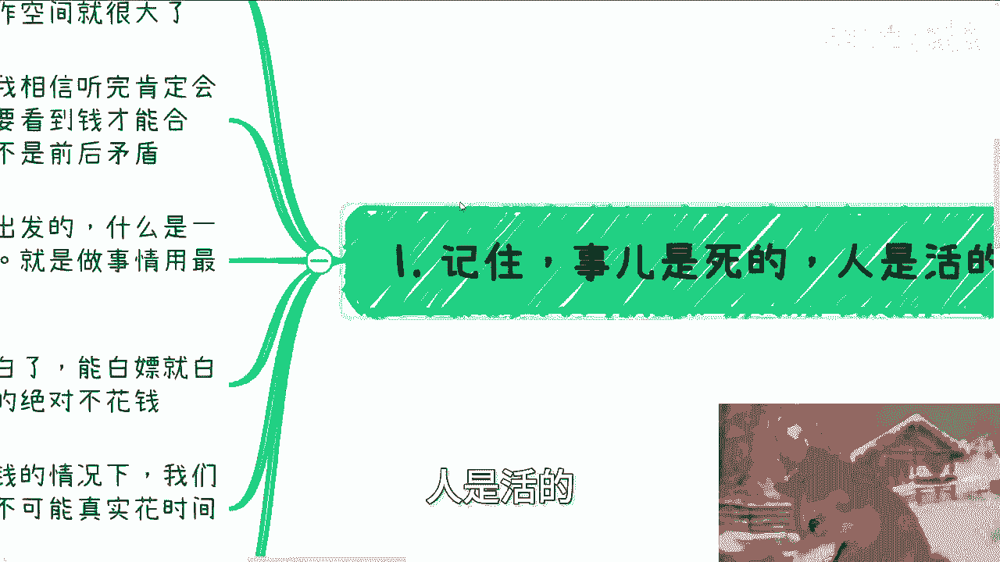
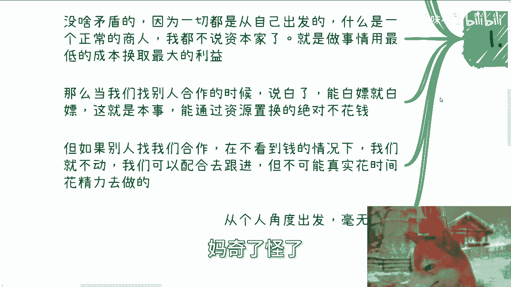
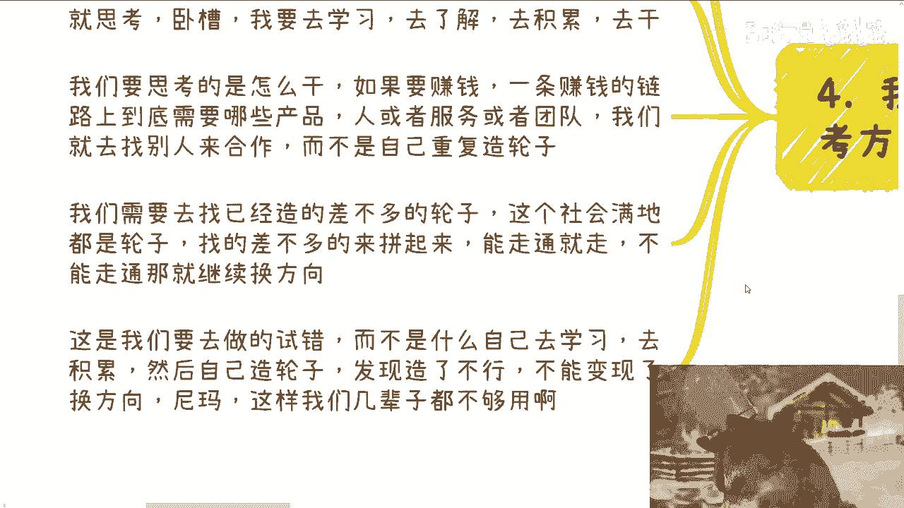
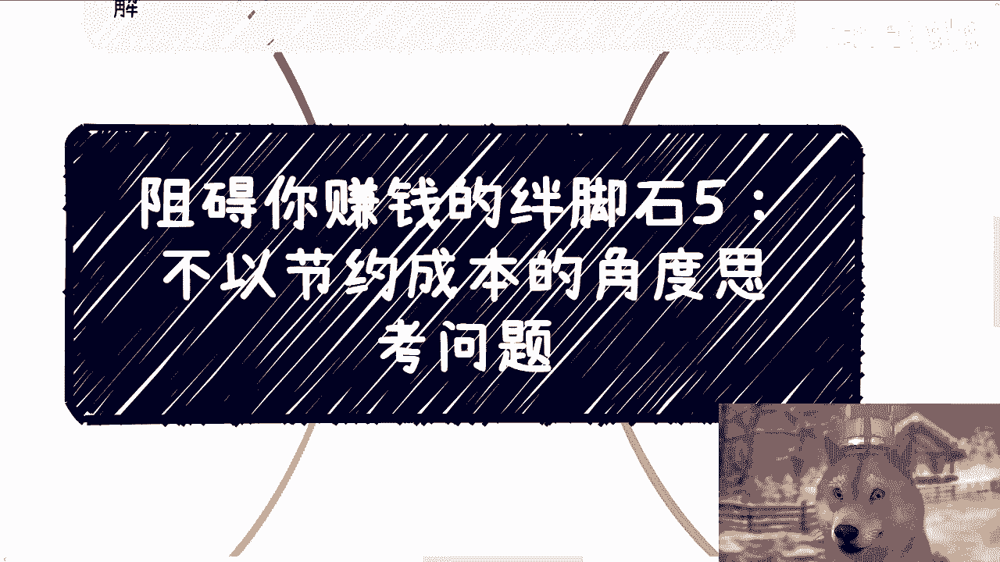

# 阻碍你赚钱的绊脚石5：不以节约成本的角度思考问题 - P1 - 赏味不足 - BV1tM4m117mY

啊大家好啊，这个我们继续来讲今天第二个视频啊，就阻碍你赚钱的这个系列啊，第五个叫做不以节约成本的这个，角度思考问题啊，这个主题听上去呢有点抽象啊，但是呃我待会儿反正会跟你们解释的啊。

呃那么首先呢是这样子的，下期活动已经定了，在下周日8月11号好吧，在长沙啊，在长沙呃，场地钱我已经付了啊，大概主题的话呢，一个是面额围绕不同的这个企业的offer。

而另外一方面呢围绕这个自媒体跟跨境电商，那么最后呢也帮大家展望一下，就是2024年往后的一些发展好吧，然后报名或者了解了解详情的呢，可以这个私信我啊，呃然后顺便提一点啊。

就是说今天这个主题呢每次有人问我，他说啊陈老师我做什么什么事情啊，要花多少钱，或者说呃一开始这个就去思考怎么花钱对吧，或者说我我比如说我要花多少钱，我怎么花钱啊，每次就是讨论这种问题的时候，我就很疑惑。

就是为什么，因为每次我都会问他们，我说你们的目的是什么，你们的目的是不是赚钱啊，都回答是，我说那如果是赚钱的话，你为什么一开始总考虑怎么花钱呢，我我我真的我跟你们讲，我永远都不明白这一点啊。

而且我觉得这一点也是个最最通用，就是就是常见的这么一个问题，所以才会有今天这么个主题啊，就是今天这个主题，我跟你们先总结宏观的总结一下啊，核心点是什么，就是所有我们只要考虑的是，跟我们赚钱有因果关系的。

或者能帮助我们赚钱的东西，所有没有因果关系，不能帮助我们的，不要去思考，它能明白吗啊当然你们可能不明白啊，但是我们往后走啊，记住第一记住啊，事儿是死的，人是活的什么意思呢。

就是大家受到的教育，我跟你们讲实在太根深蒂固了，就所有的事情其实民要都是人来谈的啊，就是你到底怎么合作，到底怎么付钱，合同到底怎么签，到底付多少钱对吧，这钱怎么付对吧，是分期付，还是说怎么一次性付。

还是他妈最后付对吧，还是怎么样子，你都是靠弹出来的，这里面的操作空间很大对吧，你就比如今天我上一个视免费的那个视频，跟你们讲的很多人，我相信听完肯定会存在一个疑惑，他说你马超老师，以前你跟我们说啊。

看到钱才能合作，而现在又跟我们说，不一定要付钱，这是不是前后矛盾，我跟你们讲没啥矛盾的，因为一切都是从自己出发的对吧，就是一个正常的商人，我都不说资本家了，一个正常的商人，做事情。

就是叫做要用最低的成本换取最大的利益，对不对，那么当我们找别人合作的时候，说白了你能白嫖就白嫖，这是本事对吧，你今天白嫖个老百姓可能不是什么本事，你今天能白嫖一个区长师长，那是你的本事对吧。

能通过资源置换的，绝对不花钱啊，但如果别人找我们合作，在不看到钱的情况下面，我们就不动，为什么，因为这样的话我们成本才最低啊，哦你钱都不给我，看到我，你钱也不付给我，我为什么要动，对不对啊。

我们可以配合去跟进，但不可能真的花时间花精力去做，你明白吗，就这不是双标不双标的问题，这就是做事件方式怎么了呢，对吧，你说你要赚钱，OK你但凡要赚钱，然后所有的做事情方式上来不思考成本，你赚什么钱。

妈奇了怪了对吧。

这件事情就让我非常匪夷所思。

第二成本这个事情我不是说的仅仅是钱啊，我比如说啊在咨询过程当中，很多人跟我提到一个问题，就比如说他说现在啊陈老师我还在工作，然后呢我想自己去做点副业啊，做点兼职啊，那么在我做的过程当中，摸索过程当中。

我对这个工作应该什么态度啊，他说比如说是一个摸鱼的态度呢，还是说在工作当中寻求一些平衡点呢，还是说就我就当个僵尸对吧，就当一个他妈的工具人啊，没有什么情绪的，还是怎么样子，我跟他们是这么说的。

我说你们当什么都行，但是我说问题不在这个地方，是在于你们思考的方式方向就已经不对了，因为当你的目标如果是赚钱的时候，你只要去思考的是，但凡不能帮助你赚钱的事，都会成为你的付出呃。

就就都会变成你的付出跟你的成本，你想想看对不对，就是比如说你现在这工作上面，我不管你是个工具人还是一个，就是说啊啊啊啊啊，这个讨好老板的对吧，讨好你领导的人，还是说就是个摸鱼的态度。

你有没有发现你只要在这里面浪费时间，就等于变相的在提升你赚钱的成本一样的，你明白吗，什么意思，意思就是说你根本就不要去考虑这个时间，而是说你得把你所有空下来的时间。

所有的这个这个这个这个能够支配利用的资源，全部利用起来，而所有利用起来的时候是奔着你那个变变现，或者奔着你那个赚钱目标去的，能够帮助你赚钱呢，那么这个才是你要去思考的对吧。

你付出你你剩下所有的别的事情上面，你付出越高，成本越高，你收益也就会相对变得越低，你没有意义啊对吧，你你很简单嘛，你今天做一件事情，你可能我举个例子，一个月你可能变现就10万啊。

那么你但凡在这个case里面花的时间越多，你的成本你的成本不就越高吗，对不对，你不就是要为了把这个，把这个这个精力集中起来，然后把这个里面的各种各样的问题，尽可能在短时间内解决掉。

你这样的话成本才最低啊，对吧哦你你你你花了很长时间浪费在各种各样，我不管是跟这个case有关，跟这个跟这个我们刚刚说的5万块钱，10万块钱K有关，还是跟这case无关，但凡只要跟你赚钱没有关系。

都是你的成本啊，那你去思考它没有意义啊，所以说一旦你会这么想，其实在我看来，其实本身就是目标不明确，或者说你这个人做事情还不够果断，所以其实改变本身的这个思考逻辑方式，才最重要的。

而不是说就就就就这个思考逻辑方式不变啊，我我们我们就在里面开始那个抠一些细节，你说爱川老师，我在这个工作当中应该什么什么态度，没有什么好抠的，你从宏观来讲，你还在浪费时间对吧，第三在日常的商业合作当中。

这种事情很多很多，你比如说我们随便举个例子，比如说你所有的交付产物能录播的，能一次性劳动的，绝对不不直播，从绝对不重复劳动，对不对啊，你比如说今天有个单子能交给别人去做的，绝对不自己做，对不对。

你你比如说今天有个单子，有个有个学历的门槛，或者有些东西需要别人来站台的，你要硕士，要博士站台的，能找一个现成的硕士博士来做工具人，能给一些劳务费解决的，绝对不会自己去考，或者自己去赌，我跟你们讲。

很多人很搞笑的会跟我说，哎陈老师，我我我我觉得我以后做一些东西，我自己这个可能需要一个硕士或博士的学历，哎我要不要花个什么3年五年的时间去读，卧槽你时间是不值钱，就你这种思考方式，你怎么赚得到钱。

对不对啊，那么记住一点啊，你们不要去太关心什么中介不中介，我发现很多人就是自我的束缚，就是从赚钱角度来讲，没有角色这个说法，只有性价比这个说法你明白吗，就是我们所有做的事情追求的都只有性价比。

我们要对自己要有个客观的判断，什么意思，就是以你们以我大部分人，我们作为这个普通人的出身，我们不可能在社会上成为甲方，你们能明白吗，对吧啊，没错啊，那么以现在的这种经济情况。

以以经济的状态和国家的整个发展，以及你们跟我的这种状态，我们也不可能成为一个满足很多条件，比如说什么什么什么呃，那个叫什么叫专利啊，对吧，或者软注啊对吧，或者说什么什么融资规模啊，什么东西啊。

我们也不可能成为这种乙方难度很高，所以我们只能做这个组局的人，我们不做组局的人，我们还能做什么呢，对不对，你不是在搞笑吗，对吧，你千万千万别问我啊，为什么甲方需要我们，或者说为什么乙方不自己去找甲方。

为什么甲方不自己去找乙方，那我就要说了，那他妈这么多人还会写代码，这么多人会做开发，他们怎么不自己去开公司呢，哎奇了怪了，那按照你们这种说法，很多公司就是做外包的，那为什么这些开发不自己去接甲方呢。

对不对，这逻辑本身就走不通啊，你们明白吗，你不要想当然就觉得哦甲方乙方相互找得到，他妈的，这社会要有这么简单，我们早就财务自由了对吧，第四啊，我们需要完全的去改变我们的这个思考方式。

就是我们做事情要考虑我们的性价比，我们付出的钱跟时间都是我们的成本，那么我们需要最小程度的付出，而且甚至最好就是不付出对吧，所以比如说我给你们打个比方，比如说我们很多人说做自媒体，做跨境电商。

或者跟我说做什么呃，呃呃K12这种小学初中的教育，或者做什么培训，或者做什么情趣用品，OK都可以，我们一开始就去，不是一开始就去思考，说哎卧槽，我要去学习，我要去了解哦，我要去积累啊，我要去积累这个呃。

干我我要去积累这个什么什么什么什么啊，行业经验对吧，或者怎么样子，我觉得去去干对吧，不是的，我们要思考的是怎么干，怎么组局，因为如果你要赚钱，整个一条赚钱的链路，上下游一定有很多合作方，对不对。

好那么有的合作方就是拉关系的，有的合作方就是做产品的，有的合作方就是来来来来做咨询，做服务的很，每个团队或每个人都有他的角色，那么我们要去做的就是把这些拼图找起来，而不是说我们自己成为这些拼图。

我们成为这些拼图，就在自己重复造轮子，你们重复造轮子，就当下这个社会狼多肉少的情况，下，面轮子这么多，我们有什么好造的呢，对不对，我们要去找的是已经造的差不多的，比如说造了七八十%的轮子。

这个社会满地都是轮子对吧，我们只要把它们拼起来，这个东西能跑通，那就跑通，不能跑通，继续换方向，换轮子继续跑，这叫做试错，而不是说什么东西我们自己去学习，然后去积累，然后我们自己造了个轮子啊。

发现啊造的不行了啊，不能变现，好换方向，我就跟你们这么说，如果按照这种做生意方式，你不要说你活100年，你就算活几辈子也不够，你用明白吗。

就是说如果从一个宏观的一种方式啊，我给你们总结一下啊，就是说现在有根坐标轴，你呃比如说正向的XY0时这个点啊，零逗号呃，呃不是零逗号，就十逗号零这个点是我们要赚钱的目标，而十逗号零呃，0。

0坐标到十逗号零，这个坐标当中的这些地方，就是跟我们赚钱没有关系的东西，那么你们要去记住一点，所有的思考方式，一定是朝着十逗号零的那个坐标轴去想的，无论怎么想，都是往那边去想啊。

就包括就我们说做自媒体对吧，你说我分销额这个找人合作要流量好，那我就找人分销，而不是说我去投流投流，我就问你投流要权要钱，对不对，好，能有多大转化率，知道吗，不知道有多少人付钱，知道吗，也不知道。

那你做它干嘛呢，对不对，你要找的就是那些能够蹭的免费流量流量，或者说能够通过分润来去蹭的那些流量，那这样的话你做这件事情，你的成本是最低的，同时你做这件事情能跟你的赚钱是挂钩的。

你所有的思考方式都要往正向方式去思考，而不要去有任何的纠结那些点，因为你就像我们刚刚说的，你要去投流，就像我们说的，你投流你的结果明确吗，不明确，那就跟你的赚钱没有关系，而且更何况你还要投入钱。

没有必要，啊所以说大部分我沟通下来啊，就是就是往往他思考的方式他纠呃。

就就他思考的问题跟他纠结的问题，跟他最终要达到那个赚钱的目标，他他当中没有因果关系，就是他纠结的问题跟思考问题就算解决了，他也赚不到钱，你知道吗，这个其实是最大的问题啊，行好吧，就这么着啊。

然后那个额那个活动好吧，8月11号啊，在长沙啊，要报名或者了解详情的，你们继续私信我，然后剩下的话就是说七那个你们自己呃工作，或者说跟别人的一些副业，那么在职业规划，商业规划啊，在跟别人做副业当中。

比如说有些合同啊，股权啊，期权啊，商业计划书啊，白皮书啊，分红分润啊，有没额合同啊，或者相关问题啊，或者说你们希望通过跟我的沟通，能够呃让自己少走点弯路，或者说呃通过我的一些视野或者视角。

能给你们一些更接地气的，这个这个这个规划或者建议的话，那么你们可以整理好对应的问题跟个人背景，好吧。

