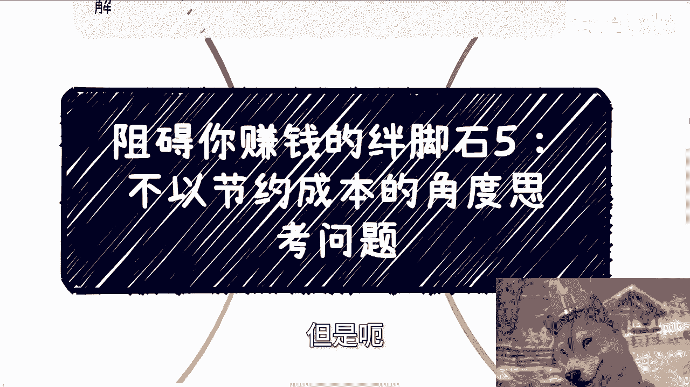
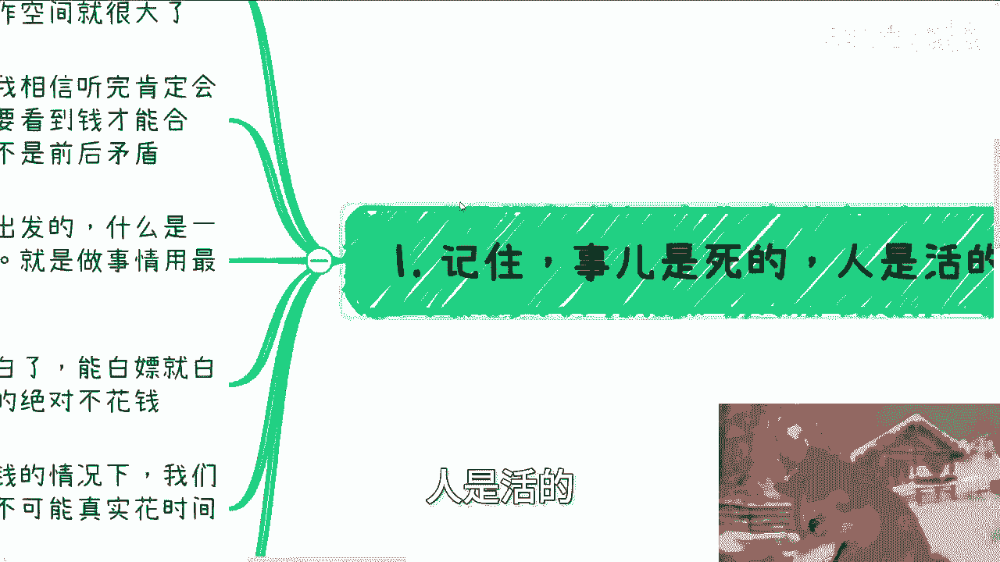
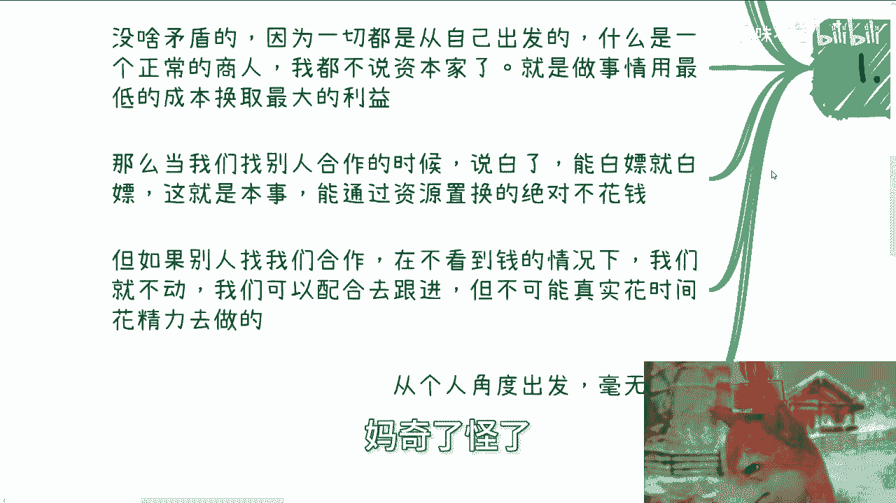
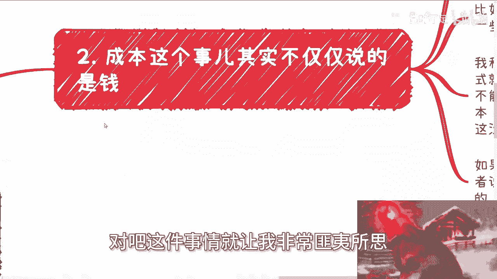
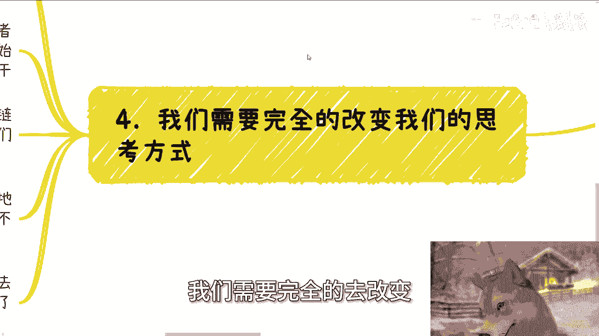
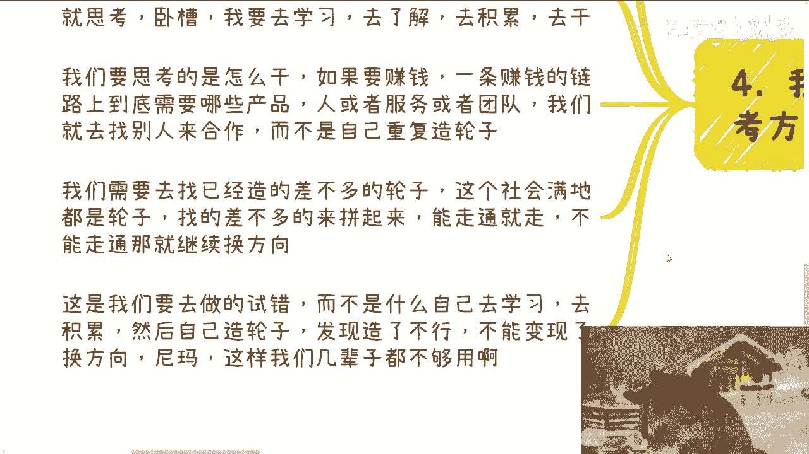
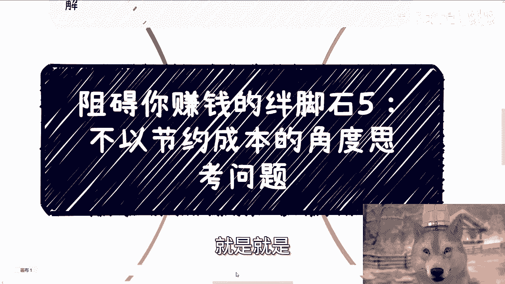
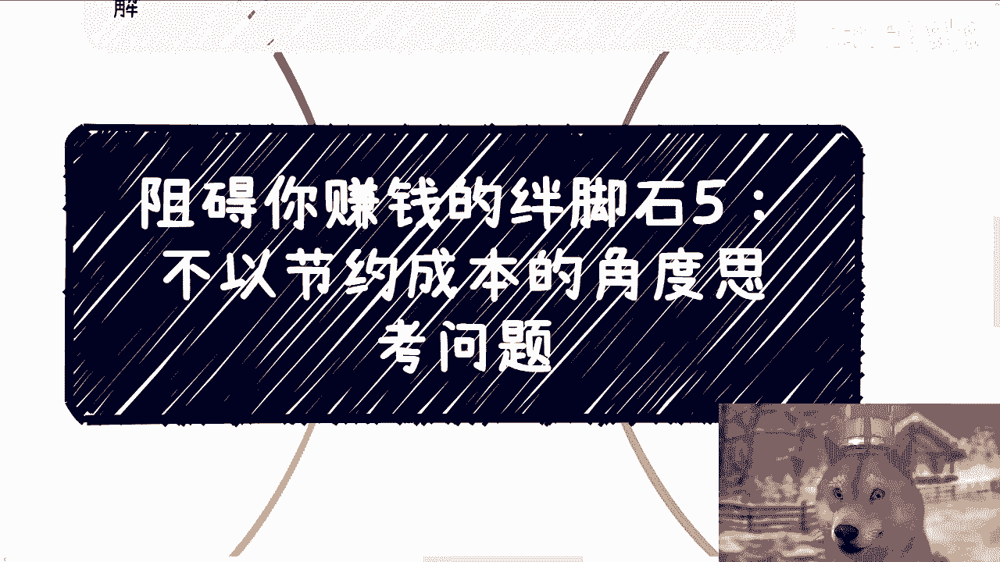

# 课程名称：阻碍你赚钱的绊脚石5：不以节约成本的角度思考问题 - P1

## 📖 概述
在本节课中，我们将探讨一个阻碍赚钱的常见思维误区：不从节约成本的角度思考问题。许多人在追求财富时，首先考虑的是如何花钱，而不是如何以最低成本实现目标。我们将深入分析这种思维模式的弊端，并提供改变思考方式的具体方法。

---

## 🧠 核心思维转变
上一节我们概述了课程主题，本节中我们来看看需要建立的核心思维。

所有与我们赚钱有因果关系、或能帮助我们赚钱的事情，才值得思考。所有没有因果关系、不能帮助我们的，都不应去思考。

记住第一点：事是死的，人是活的。大家受到的教育根深蒂固，但所有事情本质上都是人谈出来的。合作方式、付款条件、合同细节都有很大的操作空间。

一个正常的商人，做事原则是：**用最低的成本换取最大的利益**。

当我们找别人合作时，能白嫖就白嫖，能通过资源置换就绝不花钱。但当别人找我们合作时，在不看到钱的情况下，我们就不动。我们可以配合跟进，但不会真的投入时间和精力去做。

这不是双标，这是做事的合理方式。如果你的目标是赚钱，却从不思考成本，那将难以成功。

---

## 💰 成本不仅仅是金钱
上一节我们强调了成本思维，本节中我们来看看成本的广义定义。

成本不仅仅是钱。在咨询中，很多人会问：在做副业摸索阶段，对主业工作应该持什么态度？是摸鱼、寻求平衡，还是当个没有情绪的工具人？

问题的关键不在于态度，而在于思考方向。当你的目标是赚钱时，任何不能帮助你赚钱的事，都会成为你的付出和成本。

无论你在工作中是工具人、讨好领导的人，还是摸鱼，只要你在这里面浪费时间，就等于变相提升了赚钱的成本。

正确的思考方式是：把你所有能支配的时间与资源，全部利用起来，并且是奔着变现或赚钱目标去的。所有与赚钱无关的付出，都会拉高你的成本，降低你的收益。

改变思考逻辑方式才是最重要的，而不是在旧逻辑下抠细节。

---

## 🤝 商业合作中的成本控制
上一节我们讨论了广义成本，本节中我们来看看在日常商业合作中如何应用。

在日常商业合作中，控制成本的例子很多。

以下是几个关键原则：
*   所有交付产物，能录播、能一次性完成的，绝不直播、绝不重复劳动。
*   今天有个单子能交给别人做的，绝对不自己做。
*   需要学历或资质站台的，能找一个现成的工具人（支付劳务费）解决的，绝不会自己去考或自己赌。

很多人会陷入自我投资的陷阱，例如考虑花三五年去读一个学位。如果你的时间不值钱，这种思考方式很难赚到钱。

记住一点：从赚钱角度讲，没有“角色”的说法，只有“性价比”的说法。我们所有做的事情，追求的只有性价比。

---

## 🧩 成为组局者，而非造轮者
上一节我们看了合作中的具体原则，本节中我们来看看更高层面的定位策略。

我们需要完全改变思考方式。做事情要考虑性价比，我们付出的钱和时间都是成本，我们需要最小化付出，甚至最好不付出。

例如，很多人想做自媒体、跨境电商、教育、培训等。一开始的思考不应该是“我要去学习、了解、积累行业经验”。

正确的思考是：**怎么干，怎么组局**。因为一条赚钱的链路，上下游一定有很多合作方。有的负责拉关系，有的负责做产品，有的负责做服务。

我们要做的是把这些拼图找起来并拼好，而不是让自己成为其中一块拼图。让自己成为拼图，就是在重复造轮子。当下社会轮子已经很多，我们要找的是那些已经造了七八十的轮子。

我们的任务是：找到这些轮子，把它们拼起来。能跑通就继续，不能跑通就换方向、换轮子。这叫做试错。

如果按照“自己学习、积累、造轮子、发现不行、再换方向”的方式，效率极低，难以成功。

---

## 🧭 宏观思考模型总结
上一节我们明确了组局的定位，本节中我们用模型来总结整个思考方式。

从一个宏观模型来总结：假设有一个坐标轴，点 (10, 0) 是我们的赚钱目标。从原点 (0, 0) 到 (10, 0) 之间的区域，是跟我们赚钱没有直接关系的东西。

**所有的思考方式，必须始终朝着 (10, 0) 的目标点去想。**

以做自媒体为例，需要流量时，思考方向应该是找人分销（用分润换取流量），而不是自己投流。因为投流需要钱，且转化率未知，这与“低成本”和“目标明确”的原则相悖。

你要找的是那些能蹭的免费流量，或能通过分润合作的流量。这样成本最低，且与赚钱目标直接挂钩。

大部分人的问题在于：他们纠结和思考的问题，与他们最终要实现的赚钱目标之间，没有因果关系。即使那些问题解决了，他们也赚不到钱。

---

## ✅ 总结
本节课中，我们一起学习了“不以节约成本的角度思考问题”这一赚钱绊脚石。

我们认识到，成本不仅指金钱，还包括时间等一切资源。核心思维是：**始终以最低成本追求最大利益，所有思考与行动都必须直接指向赚钱目标**。

在策略上，我们应努力成为“组局者”，整合现有资源，而非“造轮者”，事事亲力亲为。要判断每件事与赚钱目标的因果关系，摒弃无效思考与付出。

改变根深蒂固的思维模式是第一步，也是迈向成功赚钱的关键一步。