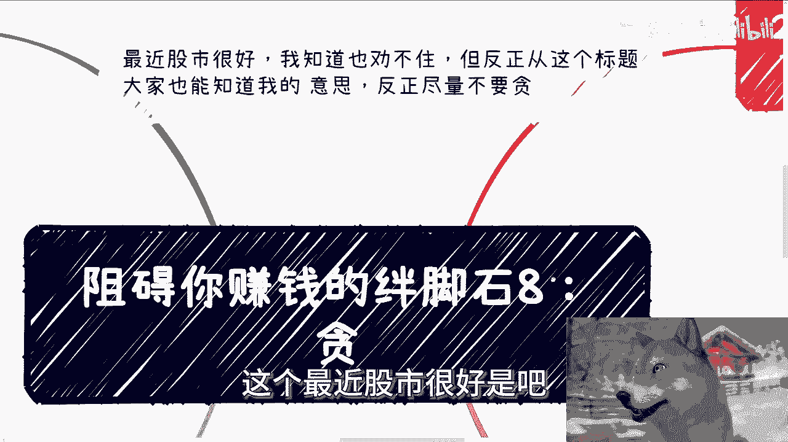
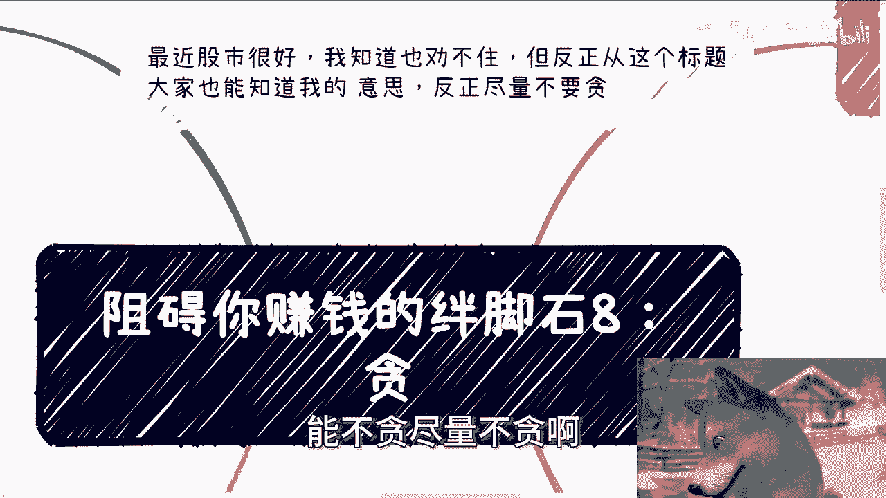
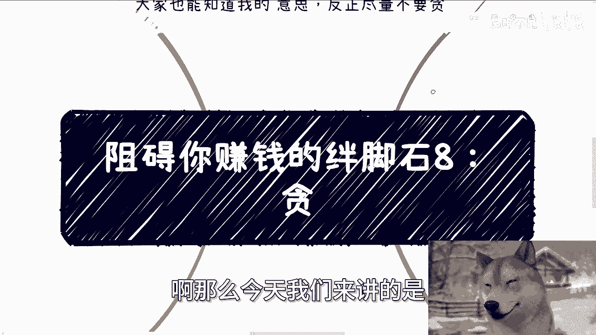
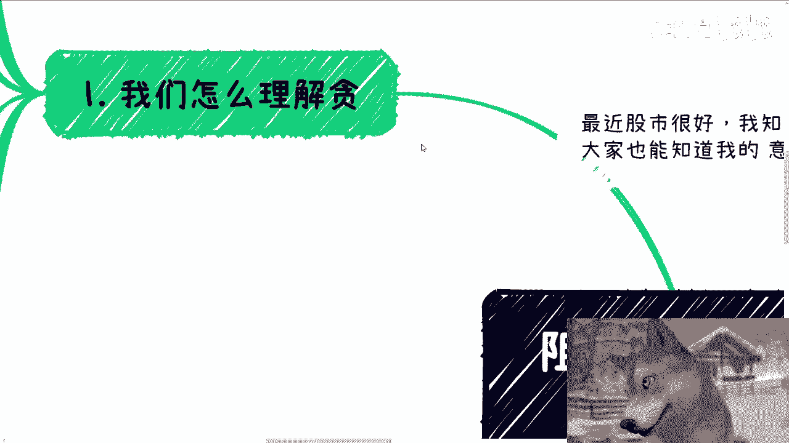
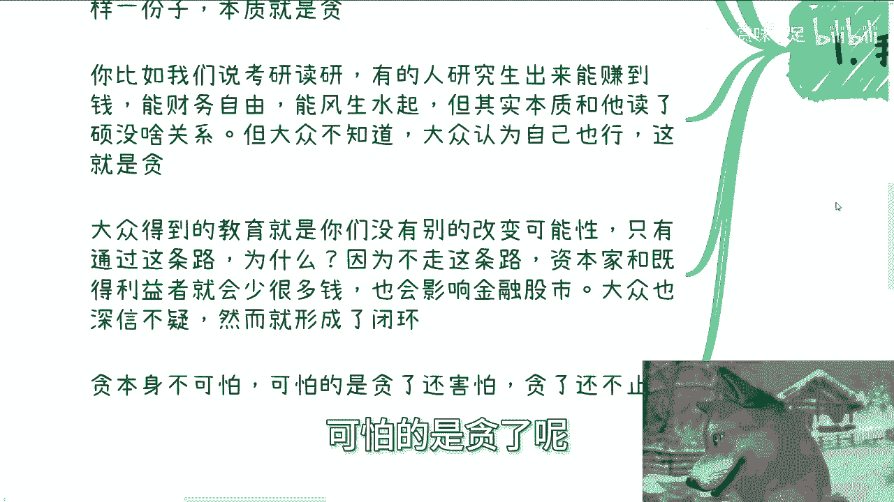
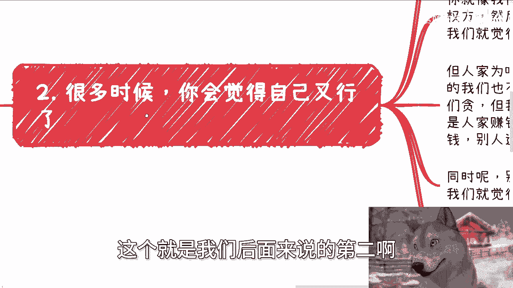
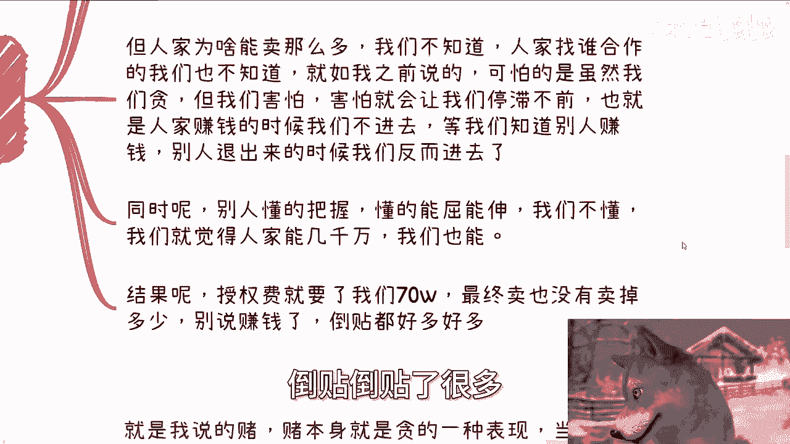
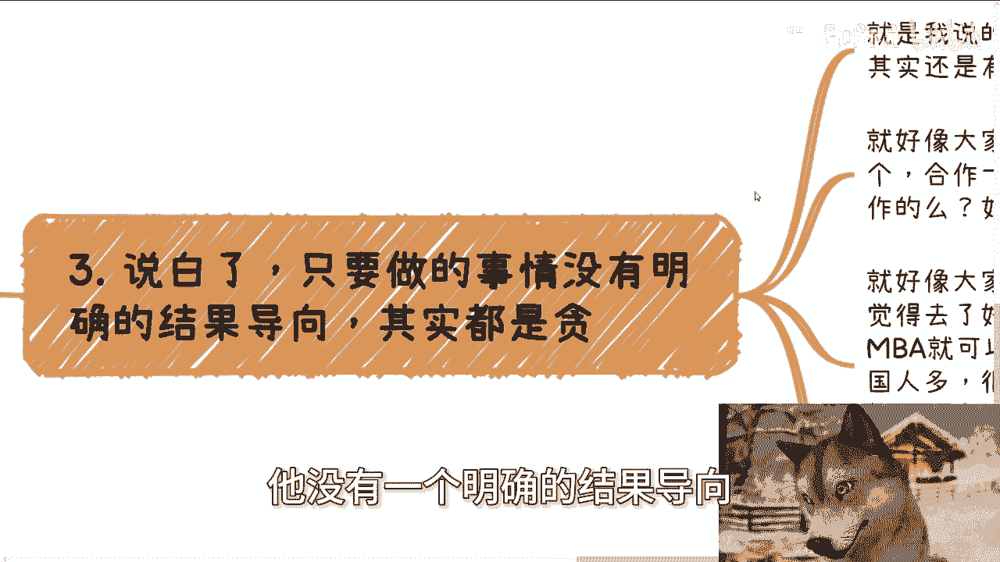

# 阻碍你赚钱的绊脚石8：贪 - P1 - 赏味不足 - BV1csxbe6E8R

好大家好啊，这个最近股市很好是吧。

就我知道也圈不住啊，但是反正呢这个标题大家也能知道我的意思啊，呃能不贪尽量不贪啊。

你要这个玩不玩，这随意对吧啊，那么今天我们来讲的是。

阻碍你赚钱的绊脚石八啊，那就是一个字贪额。

我们怎么理解，怎么理解这个词啊，很多人觉得贪的理解就是贪污的贪对吧，贪钱投资投资贪钱的这种贪啊，但是而不仅限于此，因为你想想看啊，贪本身这件事情为什么会阻碍赚钱，主要的原因是在于贪本身呢。

你把它抽象出来，贪是什么，为什么会贪，它是一种幻想对吧，我之前就跟就跟大家说过，就是中国在经济不好的时候哦，或者说只要是低迷的时候，他有三大人民群众最喜欢做的事情对吧，教育就是贩卖未来，投资就是赌博。

现在啊，然后还有一个就是玄学对吧，那三个东西你可以认为都是血啊，那么其实本质上就是对于任何一件事情，现在或者未来他充满了一种幻想，我们都叫谈，并不是说只对于钱啊，你包括收入啊，关系啊，合作啊对吧。

包括你谈恋爱对吧，说白了啊，超出你自己当下情况和认知的都叫谈，但是为什么能砍呢，嗯你想想看啊，那是因为在一个基数里面，他会有成功的案例对吧，但是为什么成功其实大家不知道的，大家就很想成为这样一份子啊。

这就好像今天微博有个热搜，就说啊这个某某某股民对吧，一上午赚了52万，那我就这么说吧，大部很多人啊，很多股民他听到这个热搜，他就会觉得的，我也能52万，你知道吗啊，所以说你比如说我们考研读研。

有的人研究生出来对吧，他能够赚到钱，能财务自由，能风生水起，但其实本质跟他读了硕跟不读硕没有关系，那么读不读硕只是他的一个标签，但大众不知道，大众认为自己也行了啊，这就是他那么大众得到的教育是什么呢。

就是你们没有别的改变的可能性，只有通过这条路，为什么呢，因为不走这条路，资本家跟基德利益者就会少很多钱，当然我说的我说的这条路就是你们走独木桥，去本硕博的这条路对吧，那么如果不走这条路呢。

咳咳资本家跟基的利益者会少很多钱，也会影响金融股市，那大众对此表示表示深信不疑，从而形成了一个收割的闭闭环啊，那既然今天我们说金融，我就说直白一点，这就是割啊，那么贪呢本身我觉得并不可怕。

可怕的是贪了呢还害怕贪了还不止损啊。

这个就是我们后面要来说的第二啊。

很多时候啊你会觉得你自己就行了啊，就是我我我又崛起了啊，为什么你觉得自己就行了，为什么呢，因为你看到别人醒了，或者别人已经醒了，但是别人为什么信，你不知道啊，这就是贪，这就好像我们以前做过业务。

简单的很啊，就是我们理解啊，只要找到授权方，然后呢软件平台我们也有了啊，那就是直接开开卖啊，直接开卖，那我们觉得自己就行了啊，人家一次性能卖个几千万，那我们就觉得哎呀，那实在不行吧，几百万也行啊对吧。

但是人家为什么能卖这么多呢，我们不知道人家找谁合作的呢，我们也不知道啊，就如我之前说的，可怕的是，虽然我们贪啊，但是我们害怕，那害怕呢就会让我们停滞不前，什么意思呢，也就是说在人家真正赚钱的时候呢。

我们不进去啊，我们在观望，等我们知道别人怎么赚钱呢，别人退出来的时候，我们反而进去啊，同时呢别人懂得把握，懂得能屈能伸啊，懂得如何止损啊，我们不懂啊，我们就他妈觉得人家能几千万，我们也能啊。

少个零也能啊，对不对，结果呢授权费要了我们70万啊，最终卖了也卖，没卖出去多少，你别说赚钱了啊，倒贴倒贴了很多。

这就是怎么说呢，对吧你们懂我在说什么啊，第三说白了嗯，只要做的事情他没有一个明确的结果导向。

他都是谈，那就是我说的堵嘛对吧，你赌本身也是他的一种表现，这就好像大家寻求合作，大家想的是找到一个能合作的，一个这个合作方啊，怎么能找到一个他就能合作，那合作了一个呢就能盈利，你会发现很多人都这么想的。

就是他是没有这种叫做什么叫做概率论，你没有这个比例改这个概念的，他就认为就说别人能合作，那我也能啊，别人能赚钱，我也能，但从来不想就说他为什么能不想呢啊，那么问题是你我们就这么说嘛，社会是这样运作的吗。

那如果来说能找到一个就合作，能合作一个就盈利，那他妈大家早就财务自由了，是不是啊，这就好像大家觉得有了工作经验之后啊，自然机会就会就会多很多，哎这句话是不是我说的，以前很多人跟我说过，我就问他们。

我说你们你们以后打算怎么发展，他说我打算工作一段时间之后再怎么样怎么样，那我说你工作一段时候时间之后再怎么样，怎么样，凭什么能怎么样怎么样呢，他说我工作一段时间之后，我觉得这种机会就会很多，我就懵了啊。

然后就觉得去了好的学校就有好的关系，就觉得读的NBA就可以上一个社交的圈子，我还是那句话啊，中国人很多，同时在这个基础之下也不缺读NBA的那八九十万，对不对啊，那那我就这么说。

我们如果来说读个MANBA，真的能够去质变的改变社交圈子，那大家就算砸锅卖铁也得去赌啊，但问题事实上是不啦，你像个师傅啦，八九十万就能改变了，我们缺的是这八九十万，当然啊你说普通人是是不是都谈。

这句话本身就没有逻辑，为什么，因为谈不谈看你自己啊，跟你是个普通人有什么关系呢，你非要说普通人都谈。

那无非也就是给你自己一个结果呃，借口给你自己一个好受一点的自我安慰对吧，第四啊，这就跟股市是一样的，说白了劝不住的啊。

因为所有人都觉得这个时候又行了，啧，我就这么说，我是经历过一些金融项目的，我不敢说多正确啊，但是我跟你们分享一下我的结论啊，我的结论就是金融他背后就是人跟机构操控的。

而且更何况当下A股的这种我国的金融情况，可很有可能这个开关是他妈在美国手上对吧啊，那么很多人呢两这两天就跟我说，是不是散户都没钱了，所以大家索性就他妈的无脑集体冲股票去，我说这跟散户真没关系。

你每次套牢也好，暴涨也好，都是做市商跟操盘手所造成的，所以你问我投不投，我所有的逻辑都是一样，要么我就是那个操盘手，要么我就是那个做市商，要么我就是庄家，要么我就坐在庄家旁边，否则我是不会投的。

明白吗对吧，这就好像以前还有很多人会问我，他说那陈老师，你你投资不能保证都赚呀，我说对大哥，但是你能保证亏得你不投啊，谁他妈逼你投了啦，对不对，当然啊，你就像这两天你说这情况，你你投不投，问我打个比方。

你问我我怎么说呢，我的我我我我跟你们说不投，但是我的潜台词不是不投，我的潜台词是怕你们投了出不会出来，能明白吗，对吧，你要是投，你说我前天去投没问题啊，那你国庆节止止损，你你你止得住吗。

你心里面想的就是卧槽，后面他妈的每天都每天都跌停，或者说稍微回回调两天再跌停没用的，所以就是劝不住，对不对，就是人都是这样过来的，卧槽我们能不懂吗，对不对，所以说我就说一个逻辑啊，咱就这么说。

你们是散户，我是散户，散户都赚钱了，散户把机构跟庄家割了，你就说信不信吧，反正我不信。

你就说这话，你信不信嘛，对不对。

啊嗯嗯唉反正就是这么个情况，我呢不是很想讲这个东西，但是因为这两天大家也都很感兴趣是吧，那我就稍微带一下，反正你们自己看吧，就这么个情况啊，呃行吧啊，那就这么着吧好吧，然后就是国庆节快乐好吧。

想大家该干嘛干嘛啊，如果你们觉得有些摸不清楚，想找我咨询的对吧，你们也可以整理好啊，国庆可以后面几天嘛对吧，456啊，后面几天有空。

