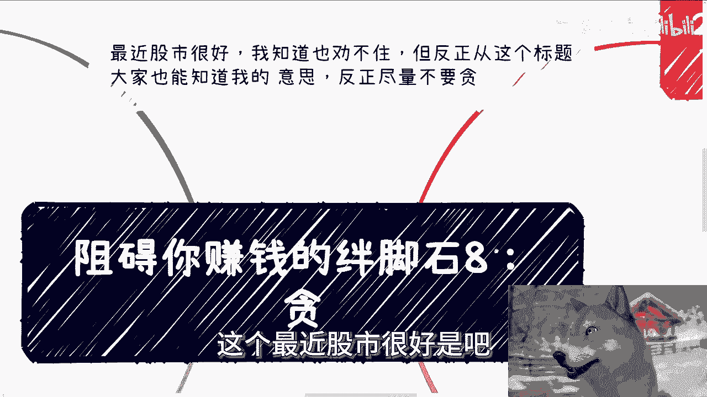
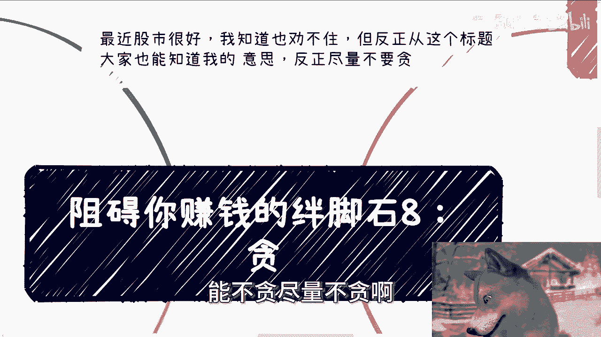
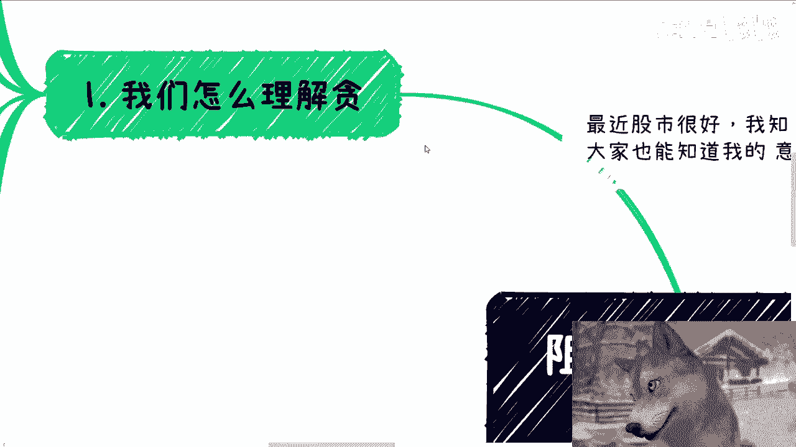
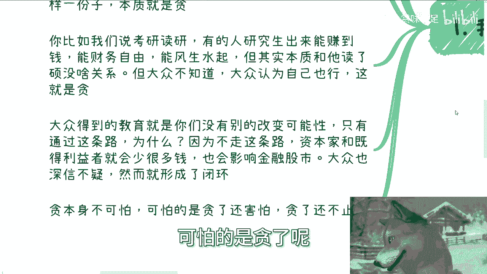
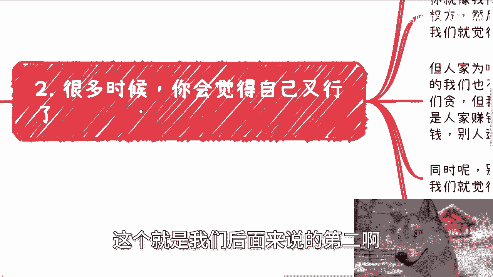
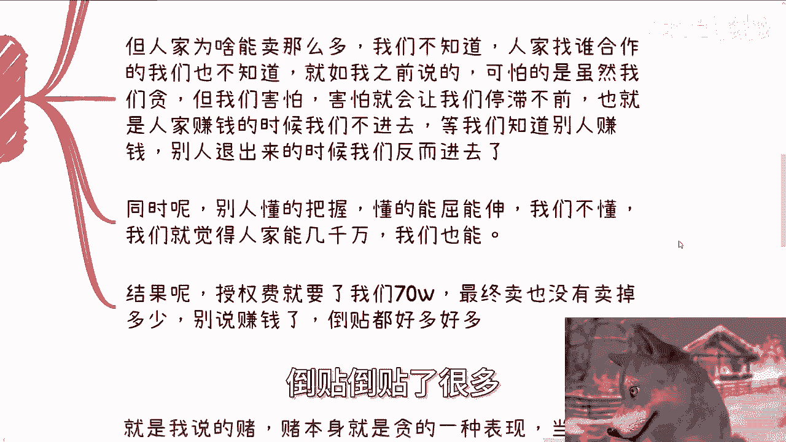
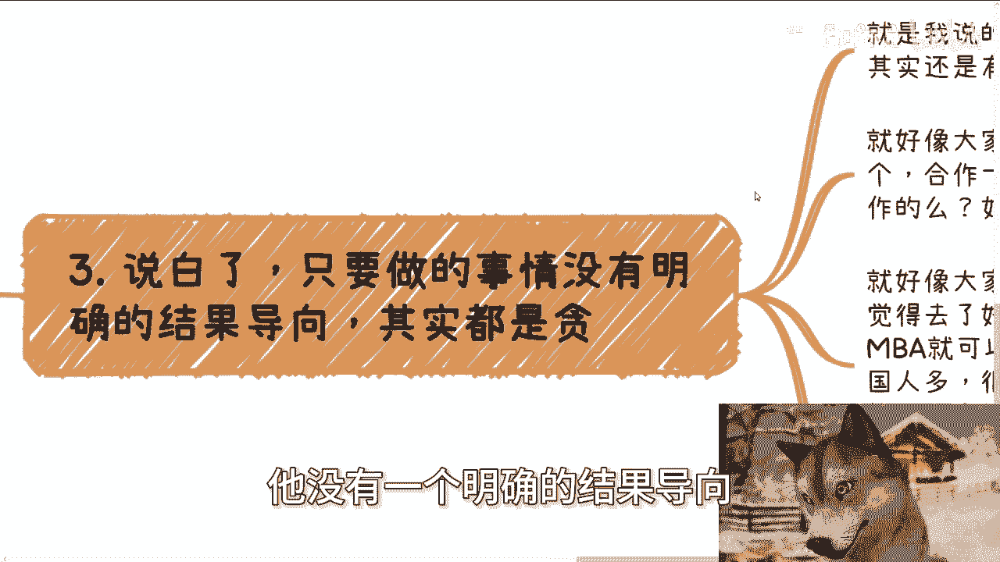
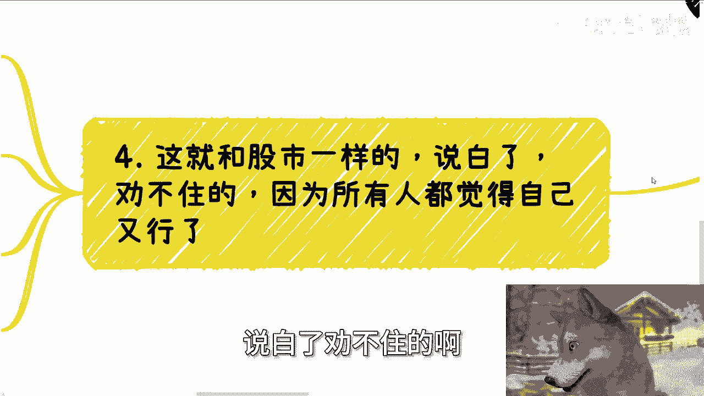
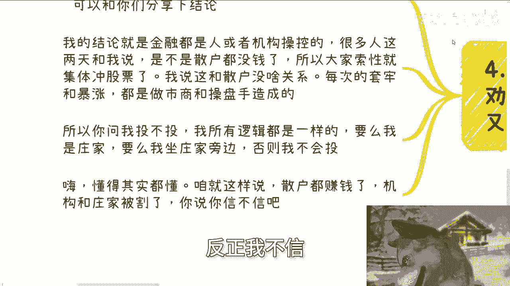
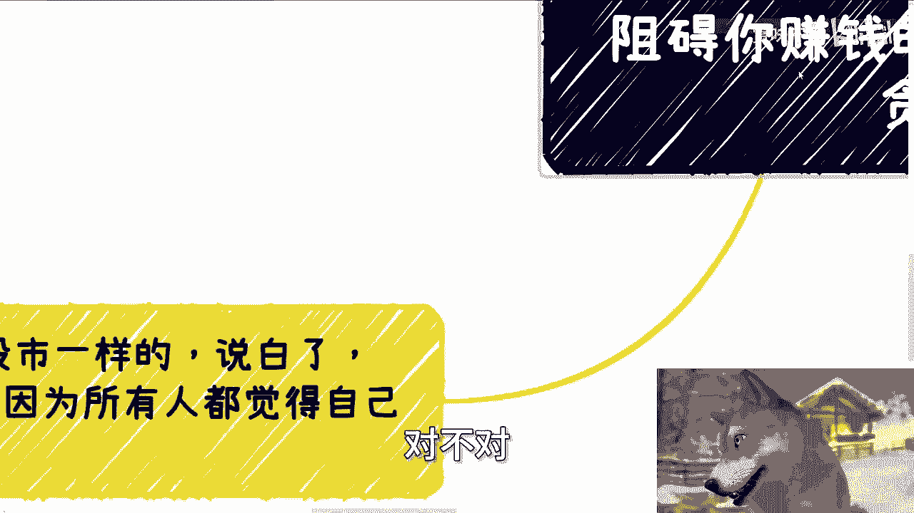

# 课程08：阻碍你赚钱的绊脚石之“贪” 🪨

在本节课中，我们将要学习“贪”如何成为投资和个人发展中的主要障碍。我们将剖析“贪”的本质，探讨其表现形式，并理解为何它会阻碍我们做出理性的决策。

## 概述：什么是“贪”？

“贪”通常被理解为对金钱的过度渴望。然而，其本质远不止于此。**“贪”是一种基于幻想的期望**，它源于对超出自身当下情况和认知范围的事物的不切实际的向往。无论是对于投资回报、职业发展还是人际关系，只要存在不切实际的幻想，都可以称之为“贪”。

## “贪”的根源：成功案例的误导

上一节我们介绍了“贪”的本质，本节中我们来看看人们为何会产生“贪”念。核心原因在于，在一个庞大的群体中，总会出现少数成功的案例。大众只看到了成功的结果，却并不了解其背后的复杂原因和特定条件，于是便产生了“我也能行”的幻想。

这就好比看到新闻“某股民一上午赚了52万”，许多人会下意识地认为自己也能复制这种成功。这种幻想在教育、职场等领域同样普遍。例如，某人研究生毕业后事业成功，大众可能将其归因于“读研”这个标签，而忽略了其个人能力、机遇等关键因素，从而盲目追求学历，形成了被收割的闭环。

## “贪”的四大表现与危害

理解了“贪”的根源后，我们具体分析它在行为上的几种主要表现及其带来的风险。

以下是“贪”的四种常见表现：

1.  **幻想超越现实**：认为只要模仿成功者的某个表面行为（如购买某个软件、进入某个圈子），就能获得同等回报，而忽视其背后的资源、时机和核心能力。公式可以表示为：**成功 ≠ 简单复制表面动作**。
2.  **贪婪且恐惧，不懂止损**：在机会出现时因害怕而观望，等机会窗口关闭、别人退场时，却因贪婪而涌入。同时，缺乏风险控制和止损意识，导致亏损扩大。这可以用一个简单的交易逻辑描述：`if (loss > threshold): exit_position()` （如果损失超过阈值，则平仓离场）。
3.  **忽视概率，追求确定性**：认为事情的发展是“找到一个合作方就能盈利”、“有工作经验机会自然来”的线性必然关系，缺乏概率思维。社会运作的本质充满不确定性，**成功 = 能力 × 机遇 × 概率**。
4.  **在非对称游戏中幻想胜利**：特别是在金融市场上，散户普遍相信“这次不一样”，认为自己可以战胜由机构和庄家主导的游戏规则。然而，市场结构决定了 **散户群体长期盈利的概率极低**。

## 金融市场中的“贪”：一个劝不住的循环

上一节我们列出了“贪”的具体表现，本节我们聚焦于金融市场，看看“贪”如何在这里形成一个难以打破的循环。

近期股市波动就是一个典型例子。市场上涨时，人们普遍感觉“又行了”，涌入市场。然而，金融市场的价格波动很大程度上由做市商、操盘手和机构资金主导。散户往往在信息、资金和工具上处于绝对劣势。

因此，一个核心逻辑是：**如果散户都能轻松赚钱，那赚的是谁的钱？机构与庄家是否可能被散户集体“收割”？** 答案显然是否定的。许多人在高点买入后，因“贪”念不止损，最终在下跌中承受巨大损失。这个过程周而复始，正是因为“贪”让人相信自己会是例外。

## 总结与建议

本节课中我们一起学习了“贪”作为阻碍赚钱的核心绊脚石。我们明确了“贪”是基于幻想的非理性期望，它导致人们忽视概率、模仿表面、恐惧与贪婪交织，并在不对称的游戏中陷入被动。

要克服“贪”，关键在于：
*   **建立概率思维**，认识到成功是多重因素的结合。
*   **设定明确的止损规则**，用纪律对抗情绪。
*   **认清自身在系统中所处的位置**，避免参与完全被动的“赌博”。
*   **专注于提升自身认知和能力**，这才是应对不确定性的根本。

投资与个人发展如同修行，克服“贪”念是走向理性与成熟的重要一步。