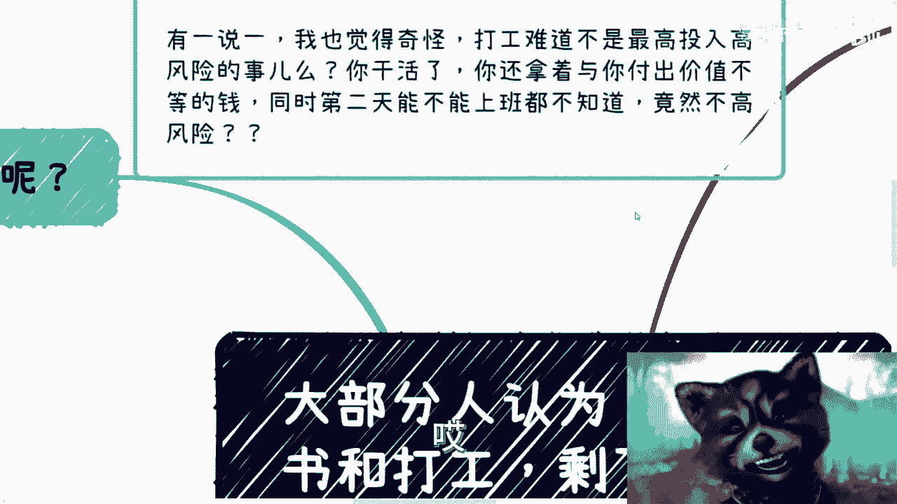
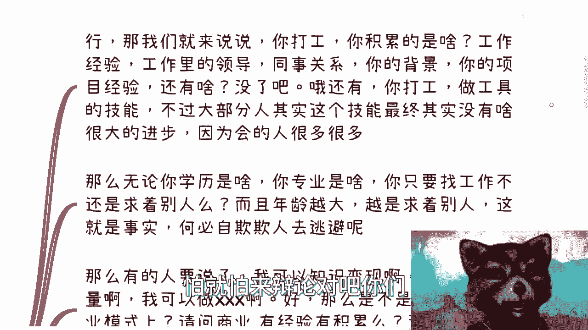
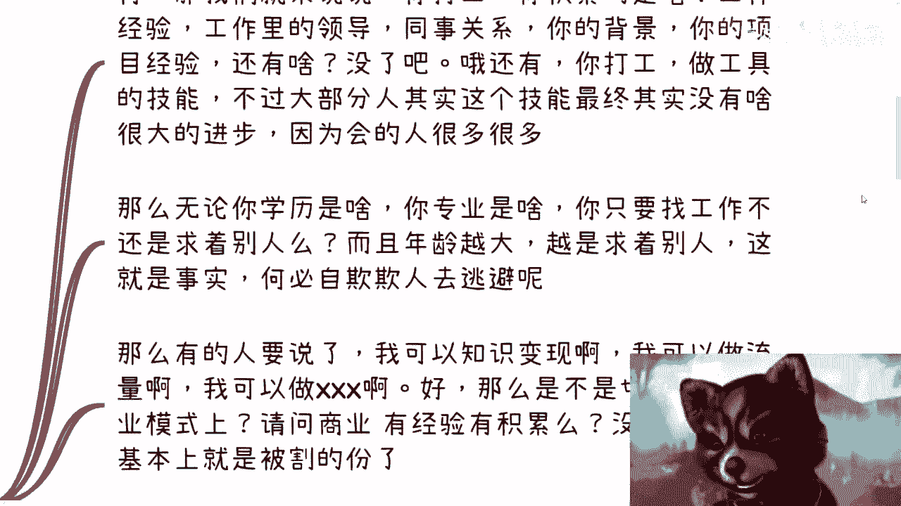
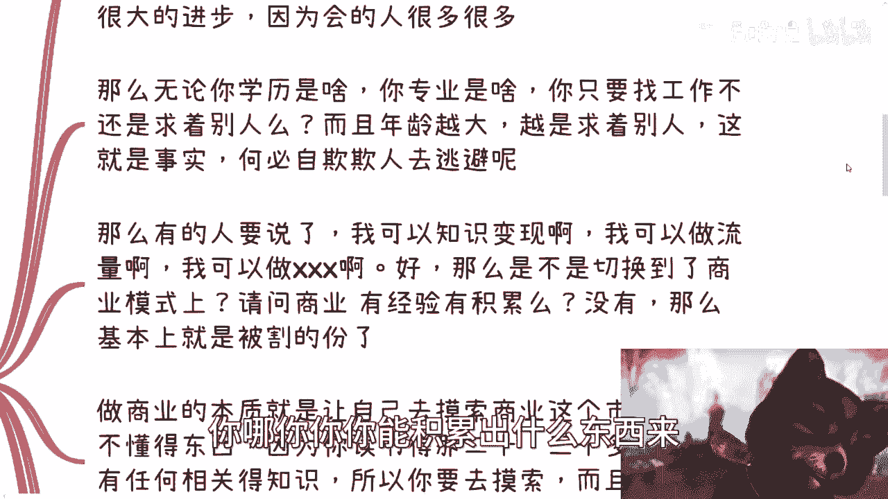
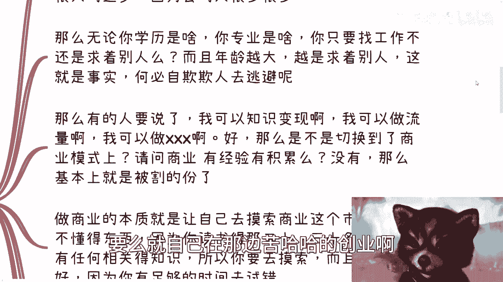
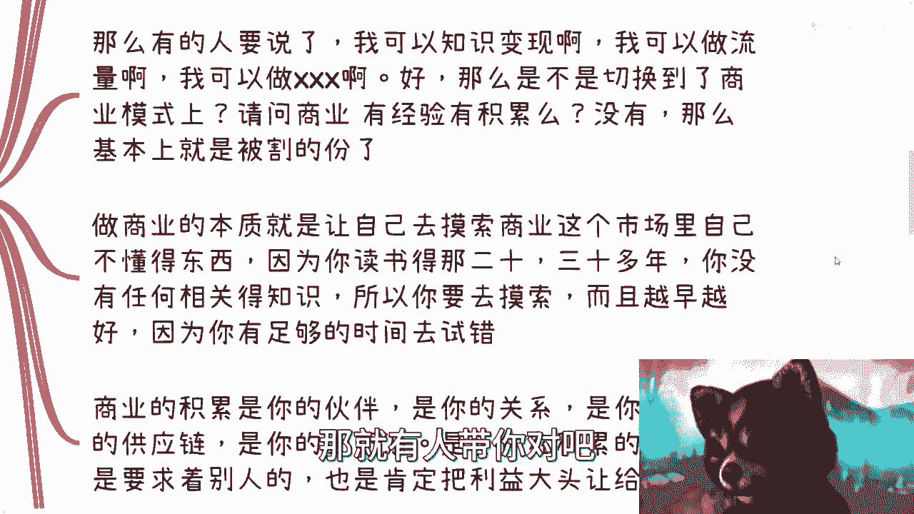

# 除了读书和打工，剩下的都是高投入高风险？？ - P1 - 赏味不足 - BV1Du411J7Yx

今天这个话题就非常的有趣啊。

啊极其有趣是吧，首先呢这个最近私信我的人蛮多的对吧，可能我也说了对吧，这个可以白嫖对吧，大家都是白嫖，我也都回复了啊，然后呢我发现这个兑换的特别多啊，就是问完一个问题呢，我开始跟他讲啊。

我说那你可以摸索摸索自己的这个赚钱途径啊，这个尝试尝试自己的积累啊，那么所有人啊，几乎所有的人啊都回答一句话叫什么呢，叫做我觉得啊这个商业的呃，这个这么高都是高投入高风险啊。

那么我发现呢大家呢这思维局限性是真的大啊，就是除了读书跟打工啊，剩下反正都是高投入高风险啊，呃虽然话是这么说，但是我跟你讲啊，就是越是这么想的人呢，越是容易被骗啊，你会发现到最后被割韭菜的都是这些人啊。

别去想啊，别去想，你有可能就是其中一个啊，有一说一啊，我说实话我觉得蛮奇怪的啊，为什么，因为打工难道不是最高投入高风险的事吗，就是你干了个活儿啊，你还拿着与你付出价值不等的钱对吧啊。

同时呢第二天能不能上班，也不是你说了算，这难道不是高风险吗，我也不明白对吧，然后很多人要跟我说了啊，驴老师，你这样说是不对的，我们有合同的，有合作怎么样了，有合同，你第二天能不能上班。

还不是别人说了算吗。

这不还是高风险吗，我也不明白了啊，这种就不叫高风险了，唉真的我就觉得就大家这个怎么说呢。

就是呃虽然都是大学生是吧。

但是这个逻辑思维让我啊就就就啊对吧，就只能啊这种感觉啊，那为什么会出现这种情况呢，我还是觉得啊就说到底还是被PUA的啊，这个从小呢高校啊对吧，家长啊，家庭啊各种吓唬对吧，什么动不动就被骗钱啊。

好像你只要对吧，不按照他们定的这个规定规定上的路啊，你去走你就要被骗啊，你就是这个要被骗得倾家荡产，你但凡按照这个规定走了啊，那么人生太平无事啊，你能这个叫铁饭碗啊，就好像是这么样子啊。

哼那可惜的是事实不是这样啊对吧，这第一点啊，第二点呢就是说我跟很多人也说过啊，国内外最大的差别在哪里，在这个地方还是那句话啊，呃不是说一定要去说海外好或者国内好啊，咱不去管他谁好不好啊。

咱们就客观的说国内外，你知道最大的差别在哪里，在就是在于海外，他妈的没这么多这么强的PUA，你知道吗啊没这么多，从小莫名其妙的思想灌输进去啊对吧，我给你们举个例子啊，这就好像刚刚对吧，有私信问我。

他说驴老师啊，你觉得是北京的户口，这个国我要去一家国企落北京户口好呢，还是我去考公好对吧，还是我去公司里好，我说从你的描述当中来讲呢，我觉得你是个老实人，什么叫老实人，知道吗，老实人就是我今天他妈的。

你别说国北京的户口，我全中国的户口都给你，你也用不来，你懂吗啊，什么叫老实人，就是你就算拿到了资源，你也用不来，这他妈叫老实人啊对吧，那为什么我说这边的PUPUA就是在于，其实有很多路可以走。

但是大家不会走，但大家不会走，不怪大家，你知道吗，那怪的是从小到大的这个教育对吧，但是我还是那句话，你知道吗，就是就是我前两天说有人白嫖，我的视频是一样的，就是不拒绝，就是我不拒绝大家白嫖我对吧。

但是你要商业合作，你要分我钱对吧，因为我我说我说直白一点，我是个商人，对不对啊，我说我教大家做商业，说到现在了对吧，你们要合作，你们就私信跟我讲对吧，怎么合作，你们出什么我出什么对吧，大家怎么分钱。

这叫商业合作，你知道吗啊不要就是说那种哎想着就是说哎呀，我好像啊这个这个到处都白嫖，这不叫商业合作啊，所以我跟你们讲，就是很多事情不是不能做，你知道吗，做你得懂得怎么做，而不是毫无章法地去做啊。

所以就是在这个当中啊，我们回到这个当中来啊，就是说你从一开始就不会被学校跟老师里面，那种人忽悠哦，或者说PUA这个我觉得是最大的一个差别啊，那么我为什么鼓励大家去做商业，因为你去做商业。

你去为了自己赚钱，这是唯一的一条能够帮自己赚钱的一个一个路，也是唯一的一条稳定的，也是唯一的一条，就是说你能够自主控制的一件事情，你但这件事情的点就在于，你需要慢慢积累自己的竞争力，对于大部分人来讲。

最大的难度是在于前20多年，前二前30多年的读书的人生里面，没有任何人教你们这件事情，这就是最大的难点。

但是不代表没有别的路啊啊好吧。

啊这是第一点，第二点啊，很多人说打工也行啊，打工也可以啊，做商业其实也是求着别人啊，因为很多人反驳我是这么说的，他说驴老师，你说做商业难道不求着别人吗，难道你就自主权吗。

行我们来说一下啊，说一下对吧，怕就怕来辩论对吧。

你们有有有什么，你们继续辩论啊，请评论区辩论，别上来杠啊。

拿出你们的论据好吧啊行，那我们来说说你打工，我就问你，你积累的是啥工作经验，工作里的领导同事关系你的背景，你的项目经验还有啥哦，还有你打工，你做工具人的技能还有什么没来，没了没了。

还有什么你做过的项目我写了对吧，那不过大部分人呢，其实你要明白，这个技能最终其实也没啥很大竞争力，为什么，因为对于大部分人来讲，你的技能并不是唯一性的，什么意思，就是说你有这个技能，别人也有啊。

他妈普普经验，有的人多了去了，对不对。

你有什么竞争力啊，你告诉我你哪你你你能积累出什么东西来对吧。

第二点，无论你学历是什么，也无论你专业是什么，你只要找到找工作不还求着别人，对不对，而且你年龄越大，越是求着别人不就这么回事吗，哦你难道跟我说啊，驴老师不是的，我年龄越大，别人求着我，你脸呢啊。

你到底是什么背景能让你说出这么大脸的话啊，中国14亿人，你年纪大了哦，工作啊，别人不找啊，求着找你有吗，有有的话，那你就不是普通人啊，我就这句话啊，你看资本盘有吗，没有的对吧。

那基本盘我他妈身边七七几年的交大，同济复旦对吧，求着别人求工作吗，啊要么就自己在那边苦哈哈的创业啊。

他妈搞笑了，真的是对吧，这叫这叫事实，你知道吗啊，不要避开这些事实去自欺欺人，没有必要的对吧，你在网上自嗨，你通过发评论发什么东西去嗨你，你可以去high，但是你嗨了，改变不了这个事实啊。

有什么用呢，对不对，我跟你们这么说好了，你但凡今天嗨了啊，你能够嗨到35岁，40岁，你告诉我说好他妈工作求着你的，那你去嗨对吧，没问题呢，有吧，那没有的呀。

对不了，那么有的人要说了啊，我可以知识变现啊，我可以做流量，我可以做叉叉叉好，没问题啊，你可以做是，但你做的同时是不是已经切换到了，你就要做商业模式上面对吧，那我就请问你要切换到商业模式上面。

你有经验积累吗，没有，那你基本上就是被割的份，对不了，无论我还是那句话，无论你多么牛逼啊，无论你技能多么牛逼，无论你多么聪明，都一样的，该交学费都要交的对吧，你告诉我你不要叫可以，那就有人带你对吧。

有你你有很强的背景，那你就不是普通人，我就不在这里讨论了对吧好。

那么做商业的本质是什么，是让自己去摸索商业在这个市场里面啊，就在摸索商业这个市场里面，自己不懂的东西就是去摸索，那你读书20多年，30多年完全没有学过的东西对吧，所以才叫要去摸索啊。

所以这也是为什么我跟大家说，越早去做越好啊，对吧不是就是说只有打工跟商业二选一啊，啊对吧，因为你年轻的时候你有足够时间去试错啊，等你年纪大了，你到时候我跟你讲，三观碎了是很难重重重铸起来的啊。

我跟你们讲，30多岁的人，40多岁人最怕的是什么，就是颠覆了他的三观啊，然后到那个时候他的心理对吧，他的身体，他的各个方面都接受不了，那怎么办呢对吧，到时候只能怨天尤人啊，那么商业的积累是什么。

是你的合作伙伴，是你的关系链对吧，是你所在领域的供应链，是你的上下游啊，是你所做的那个业务的，就是最终其实都是你的合作伙伴啊，所以我才说宇宙的尽头是关系对吧，你在积累的时候肯定是求着别人的，这没毛病啊。

也是肯定要把利益大头让给别人，但是随着时间的推移，我就无论你爬到多么高的高度啊，哪怕你今天就是一个，比如说每个月就赚那么几百块，几千块的也无所谓啊，我无论你爬到什么高度，只要你有自己的一亩三分地的商业。

合作伙伴或者关系，那么其实你就不用求着别人，为什么我能自力更生啊，我管你又谁都不可能第二天炒谁鱿鱼，就这么简单，对不对，大家能合作就一直会稳定合作下去，这个业务如果不行了，OK大家换个业务做。

今天我卖区块链卖不动，我明天卖元宇宙卖不动，我明天会卖，后天可以卖西瓜，对不对，我买卖西瓜卖不动，我大后天可以卖，人工智能怎么了呢，有什么区别呢，我卖什么是不是卖吗，稳定的是模式，稳定的是合作关系。

卖什么一点都不重要，所以你要明白，你的竞争力永远是你的关系，和你积累的上下游以及你的资源，这些资源不会随着行业好不好，或者经济好不好而质变，你知道吗，不可能的啊。

好那么说到这儿呢，那又有人要说了，好那我们来看三啊。

有人要说了，他驴老师啊，你这样说不对的啊，那么商业合作呢也是存在不稳定的啊，也是会掉单的，是这句话没毛病啊，没毛病，那我们来想想看啊，你们想想看一个问题啊，这事我就这样说，大家都是老百姓。

大家合作其实都不是做，不是奔着做多大的生意，大家都是混口饭吃对吧，那么我就这么跟你们说，每个月几万块钱已经算是很好的收入了，已经是天花板了啊，那么我们就来说说那么几个问题，第一个问题是商业上面有跳单。

没毛病，但是你跟打工比呢，啊，你跟打工第二天，他妈的让你滚就滚的这种概率比呢，哪个概率高，啊哪个可控力强，我就问对不对啊，这是第一点啊，第二点是，那么既然大家都是老百姓。

我就问你们老百姓最怕的是什么风险，对不对，我就问你们政府最怕的是什么风险对吧，政府要的最高最要的是什么稳定，对吧好，那么我就问了，在这当中有任何一个点跟学历，跟你们的技能好坏有关系吗，没有啊。

毛关系都没有啊，那么我就请问跟你合作过的小伙伴合作风险高，还是换个合作伙伴风险高，那么是个正常人都懂对吧，一定是大家一起赚过钱，背靠背战斗过的才是可信的啊，我但凡换个合作伙伴，我对他一定是有质疑的。

就这么简单，我不说有质疑吧，我一定是先合作对吧，然后看看大家的这个这个态度啊，各个方面啊对吧，包括走账啊对吧，包括交税啊等等，各个方面是不是靠谱靠谱，我再继续合作合作，那就请问了。

我今天如果有一个稳定的合作伙伴，我为什么要跳过他对吧，好那么有人要跟我说了，他说因为那个人能给你更大的利益，诶，那奇了怪了，作为一个成年人，我为什么是选择题呢，我不能既要又要嘛，我为什么要跳过这个人呢。

我跟他已经合作过了，已经大家是可信的合作伙伴，我跳过他既损害了我的信誉，又损失了一个合作伙伴，我图什么呢，我不明白呀，对吧啊，好，那么你说跳单情况下有没有有，但无非两种可能性。

第一种是你碰到的证人就是垃圾，他开始就想好来白嫖，你就跳单，那你的确没办法，那我只我只能这么说，你自己看人有问题，你的商业经验还过于浅薄，对不对啊，那么第二种是什么，就是但凡你们合作过了啊，他还跳你担。

那说明什么，那说明肯定你有什么地方做得不好，我觉得这句话哦，或者说你踩到人家红线上面，而你在商业的认知上面可能比较浅薄，你不自知对吧，也就是说他一定是有一个正当的理由，或者说得过去的理由啊。

他不会无缘无故去挑担的对吧，所以我们顺便说一下政府的合作，你以为你技术怎么样很重要吗，没卵用啊，没卵用啊，找谁不是找啊，我就这么跟你们讲，政府单子他妈几百个，我1000个可能没有吧对吧。

大大大几百个肯定是做完了啊，我很清楚技术没卵用啊，其实无论谁合作，关注的都是安全稳定可信啊，政府更是，所以跟你合作并不是因为你牛逼，也不是因为你技术好啊，也不是因为你活好啊，而是因为你们合作过，你可信。

你不会给出幺蛾子，你明白吗啊你比较稳定，不会弄花里胡哨的，这是核心，你懂吗啊，如果你还听不懂，那我再举个局，打个比方啊，就这么说，今天啊我们做个考卷，100分，满分及格分数20分好。

那么无论是我还是政府，会选择一个怎么样的合作伙伴呢，可信稳定，合作过，一起赚过钱，只要能交出20分的卷子，ok NO problem可以了，没人追求21分好，就这么简单啊，好第四。

所以呢有哪些不高风险不高的啊，那我跟你讲太多了，比如说我现在说我现在最支持的就搞相亲，为什么，因为搞相亲最短平快啊，整个世界整个中国最刚的需求，最刚的痛点就相亲，怎么了呢，你每次主题都不用想啊。

你就搞相亲会，你连你每次主题也不用想啊，嘉宾也不用找对吧，有受众也不用着对吧，都是纯刚需呃呃呃永永恒不变的主题，无脑呀，怎么不能做了，你要什么毛成本啊，啊要什么成本，怎么做，不是做啊，对吧啊。

你要么搞留学，对不对，搞RA搞什么各种培训不一样的吗，你就无脑两呃，无脑的两边撮合嘛，对不了，找个留学机构，找个流量，你一撮合，你就跟他们说，我要少一点，我每一单只要个200%分之三，怎么了呢，不行吗。

怎么不行呢，诶奇了怪了，真的是对吧，哎我跟你们讲，我跟你讲，很多人就不愿意，为什么，因为他们看不起，因为他们觉得自己高端，这也太low逼，对不对，但我跟你讲，我就觉得好笑了对吧。

就我看到的世界这种低端赚很多钱的东西，都是这些，大家看不看不起的东西对吧，而且这些东西也都是可以零成本尝试的，我就跟你们这么说，你知道我有个朋友之前卖那个香肠对吧，怎么了，卖香肠怎么了呢。

我让很多人买卖，很多人去卖，他还不愿意对吧，那他一个月一个月，当时鼎盛时期一个月能卖到200多万，怎么了呢，对对啦，你告诉我商业都是高投入，高风险的，那你不做对吧，我跟你讲。

现在现在这些零成本的东西你不做，你非要说高商业都是高风险高投入的，那你怪别人高风险干嘛，你你不敢做，你又怪别人高风险干嘛呢对吧，你这样你就所有的人都在PUA自己有意义了，没有意义的呀，对不对。

说白了我给你们讲一切通过资源和流量变现的，都不是高投入高风险的，你高投入是我就问你高投入什么东西，你除了经历的投入，你还有什么投入，对不啦啊啊驴老师活动怎么做啊，驴老师这个人怎么认识啊。

驴老师这个东西怎么怎么去怎么去切入，你去切啊，你倒是你倒是去认识啊，对不对，你作为一个普通老百姓和普通人，别动不动就想着积累自己的流量，也别动不动想着自己做什么产品，不可能的啊，你你别想了啊。

你20多年读书读出来连连个连个最上层的，比如说学历啊，或者说别的东西都做不到，你商业上面，你做一个婴儿，你想怎么样，你想怎么样，对不了，所以说一定要学会借力打，你一定要学会自己撮合已有的资源就去找。

没有什么不能找的啊，别想着一夜暴富，然后我就跟你讲，你别想着一夜暴富，否则你不高风险，谁高风险，对不对啊。

好那么说到这里呢，我顺便再提一句啊，因为这两天有小伙伴在那边做活动啊，我顺便说一句啊，做事情就要认真的做啊，什么意思，就是你们去认识人就好好包装，你们要做活动就好好做海报对吧，好好做介绍，好好做方案。

该有的东西都要有啊，别就是那种哎呀驴老师啊，这个东西怎么做不了，哎呀那个东西怎么做不了啊，真的我跟你们讲啊，那些你们看不起的人，那些学历肯定比你们低，这也是为什么人家能赚得到钱对吧。

而大家都是抱着那种哎呀我就玩玩对吧，我也我也就是毫毫毫不用心的对吧，就是什么认识人了对吧，就就去做活动了，或者做什么东西呢，你但凡不用心，别人都看得出来，谁会来啊，对不对，好了就这么着吧。

嗯唉有什么对吧，直接规划的或者什么，你们反正总结好了，你们再私信我好吧，简单的你们就直接问啊，你们要觉得有详细的啊，需要我给你们做详细规划的啊，那我们就做咨询。

