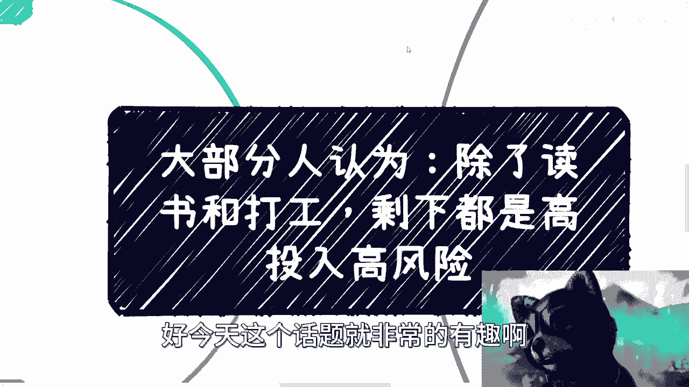
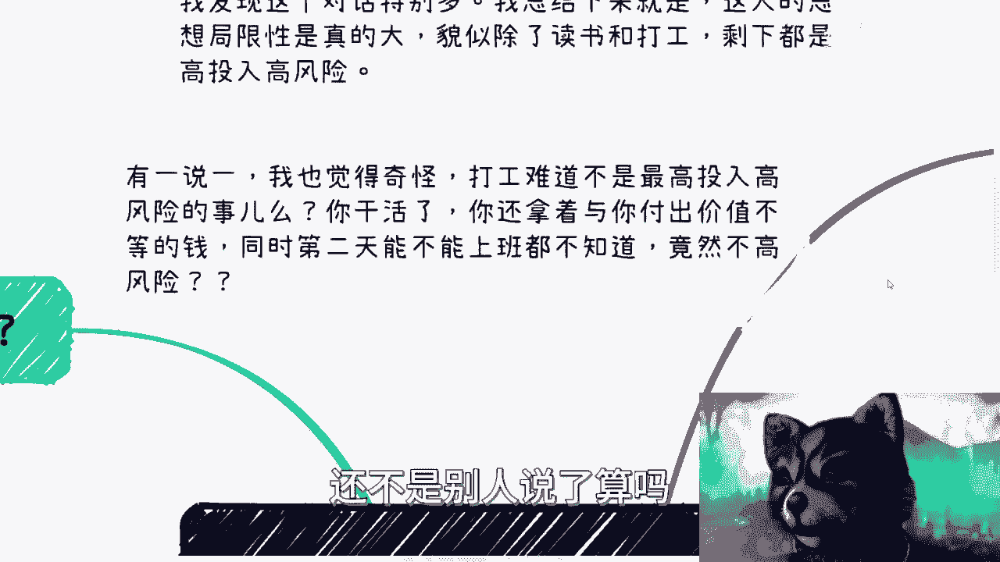
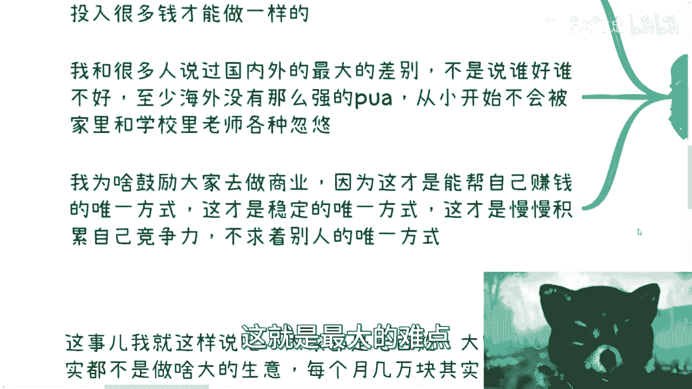
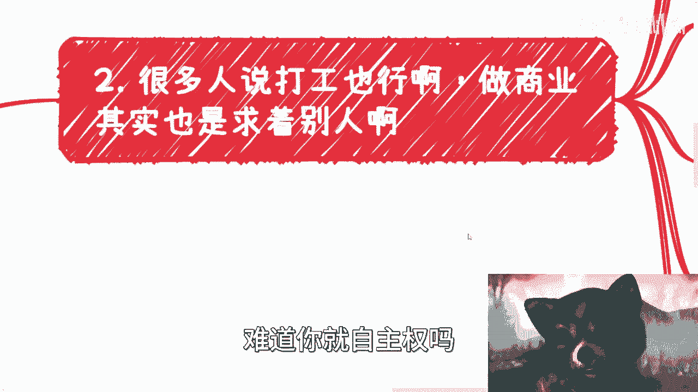
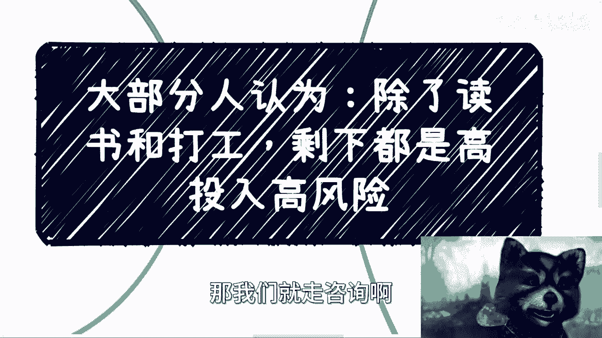

# 课程01：破除“高投入高风险”迷思，探索商业入门路径 🧠



在本节课中，我们将探讨一个普遍存在的思维误区：“除了读书和打工，其他事情都是高投入高风险的”。我们将分析这种想法的来源，对比打工与商业的本质区别，并为你指出一条低风险起步的商业实践路径。




## 思维局限的来源


上一节我们提到了课程的主题，本节中我们来看看这种“高投入高风险”的思维是如何形成的。

许多人认为，只有遵循“读书-打工”这条既定道路才是安全的。他们认为商业活动充满未知与风险。然而，这种观念很大程度上源于长期的教育和社会环境灌输，即偏离常规路径就会遭遇失败或欺骗。这种思维定式限制了探索更多可能性的勇气。

## 重新审视“风险”

上一节我们探讨了思维局限，本节中我们来看看如何重新定义“风险”。



许多人认为打工是低风险的，因为有合同保障。但我们需要用公式来思考其本质：




**打工风险 = 失业概率 × 个人生存依赖度**


打工的风险在于其主动权并不完全掌握在个人手中。岗位存续、收入水平很大程度上依赖于外部环境和雇主决策。第二天能否继续工作，往往不是自己说了算。从这个角度看，打工同样存在高风险。


## 打工与商业积累的本质区别

理解了风险的定义后，我们进一步比较两种路径积累的资产有何不同。


打工所积累的核心是**可替代的技能与经验**。在大多数情况下，这些技能并非独一无二，其市场竞争力会随着环境变化和年龄增长而衰减。


相比之下，商业积累的核心是**资源与关系网络**。这包括：
*   合作伙伴
*   供应链上下游关系
*   特定领域的知识与人脉


这些资源具有更强的稳定性和迁移性。商业的竞争力公式可以简化为：

**商业竞争力 = 关系网络强度 × 资源整合能力**

## 商业合作稳定性的内核


上一节我们对比了两种积累模式，本节中我们深入探讨商业合作为何能带来稳定。


有人认为商业合作也不稳定，存在“跳单”风险。但相较于打工中被动失业的风险，商业合作的稳定性建立在**互信与持续共赢**的基础上。对于普通人而言，合作的核心诉求是安全、稳定、可信，而非追求利益最大化。一旦建立起背靠背战斗过的信任关系，这种合作便是最稳固的资产。

以下是维持商业合作稳定的几个关键点：
1.  **信誉积累**：长期合作建立的信誉是无形的护城河。
2.  **价值提供**：持续为合作伙伴提供稳定价值。
3.  **风险共担**：共同面对问题，而非出现问题就更换伙伴。

## 低风险商业实践路径

经过前面的分析，我们明白了商业的核心在于资源整合。那么，初学者如何低风险起步呢？

关键在于**借力打力，撮合资源**，而非自己创造全新产品或流量。许多商业机会并不需要高额启动资金。

以下是几个可供参考的低成本实践方向：
*   **本地服务撮合**：例如组织相亲活动、本地社群聚会。需求明确，重在组织和运营。
*   **资源中介**：例如留学咨询、技能培训。连接需求方（学生/学员）与供给方（机构/老师），赚取撮合费用。
*   **细分领域销售**：代理或销售有稳定需求的产品（如特色食品）。关键在于找到供应链和销售渠道。

这些实践的通用代码逻辑是：
```plaintext
1. 识别一个明确的需求（A）。
2. 找到能满足该需求的现有资源或服务（B）。
3. 将A与B连接起来，并从中抽取部分价值作为报酬。
```
启动时，请务必**认真对待**，哪怕是小活动，也需要认真准备方案、做好宣传、维护关系，用心是建立信任的第一步。

## 总结与行动建议

本节课中我们一起学习了如何破除“除打工外皆高风险”的思维定式。

我们重新审视了风险，认识到打工的被动性风险并不低。我们明确了商业积累的核心在于构建**可信的关系网络与资源池**，这种资产更具掌控力和迁移性。最后，我们指出了一条通过**撮合现有资源**来低风险启动商业实践的道路。


行动的第一步是转变观念：商业不是洪水猛兽，而是一种可学习、可练习的生存与发展技能。从小处着手，认真实践“识别需求-连接资源”的闭环，逐步积累你的商业资本。



---
**本节课总结**：改变观念是第一步，认识到商业是关乎**资源整合**与**关系构建**的能力。从低成本的撮合型实践开始，认真积累，是普通人迈向商业世界的稳健起点。