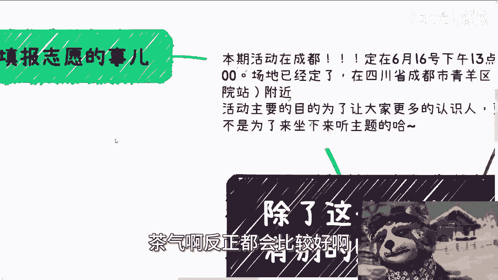
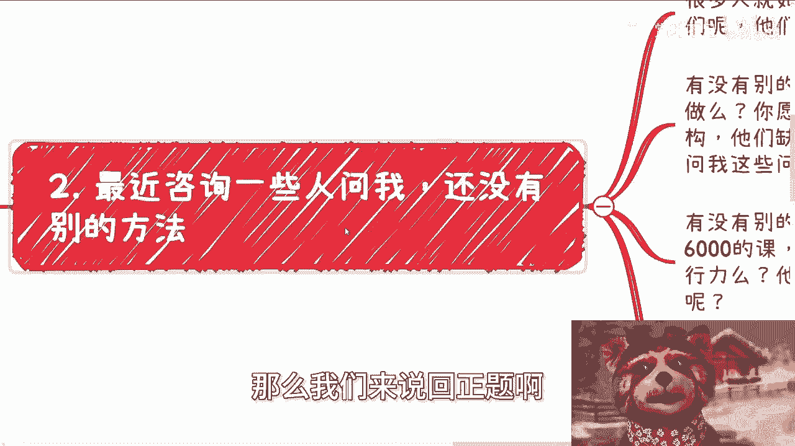
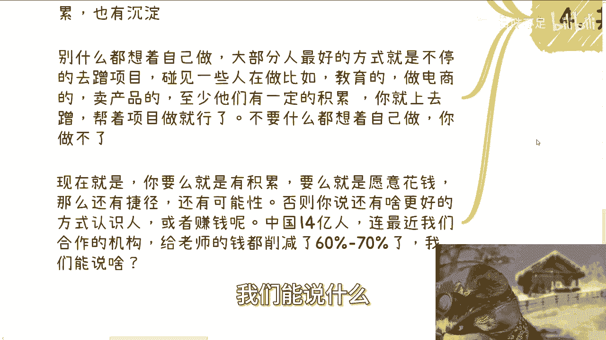

# 课程名称：拓展赚钱与人脉的方法论 🧠💰 - P1

在本节课中，我们将要学习如何拓展赚钱和结识人脉的途径。课程将分析常见问题背后的思维误区，并提供具体、可操作的思路。核心在于理解“确定性”的局限，并转向基于自身能力和行动的务实策略。

***

## 活动通知 📅

首先，通知一项已确定的活动。

活动将于6月16日下午1:30至6点举行，地点在青羊区省骨科医院站附近。

本次活动的核心目的是促进交流、结识更多人，而非坐下来听固定主题的讲座。因此，无需过分关注主题内容。

若想了解详情或报名，请私信联系。本次场地环境与茶歇品质都较好。

***

## 从高考志愿谈起：对“确定性”的执念 🎓

上一节我们介绍了线下交流活动，本节中我们来看看一个普遍存在的思维模式，这有助于理解为何人们总在寻找“更多方法”。

近期高考填报志愿的现象，与用本课标题提问的人是同一类人。本质在于，当被问及“未来能否预测”时，他们会回答“不能”，但依然会来询问“哪个专业或志愿更好”，或“有没有更稳定、确定的赚钱或结识人脉的方法”。

原因在于，他们可能认为我通常分享的路径“太不稳定、太不确定”，他们渴望更确定的东西。

这里存在两个问题：
1.  如果存在确定无疑的方法，还轮得到普通人来做吗？
2.  即便我提供了确定的方向，提问者自身有能力承接吗？

这类似于咨询场景：我会根据个人实际情况给出建议，但对方往往不愿听取或实践。本质原因在于**懒惰、不愿付出实践、拒绝接受不确定性**，总幻想不劳而获。

按照这种逻辑，为何不向高中、大学老师要求“读完书必须找到年薪50万的工作”呢？因为不存在这样的保证。

填报志愿也是如此。大部分家长和学生本身并不懂，这不是通过咨询或花费数万元报班就能彻底解决的。这些服务更多是提供信息、梳理现状以辅助决策，而非给出“最优解”。关键在于**实事求是**，认识到不存在一劳永逸的完美答案。

***

## 剖析“更多方法”的请求：能力与意愿 💪

那么，说回正题。最近很多咨询者问我“有没有别的好方法”。我认为其本质常是想不劳而获，尽管他们并不承认。

当被问及“有没有别的赚钱方式”时，答案是：有。但紧接着需要问两个问题：
1.  **你有能力做吗？**
2.  **你愿意做吗？**

例如，长三角、珠三角很多机构急需互联网、AI、新能源等领域的嘉宾或老师。但询问这些问题的多数人并不具备相应的专业能力。因此，即便告知这是稳定赚钱的途径，他们也做不了。

再比如，我曾提过一种方法：定价五六千的课程，瞄准长沙、佛山、武汉、成都等下沉市场。只要具备执行力、包装能力和营销能力，去实践就很可能成功。但很多人听后又会抱怨“我没做过”、“没经验”、“路子太野”、“风险高”。

这暴露了核心矛盾：既想获得结果，又不愿承担过程的风险与付出，近乎幻想“别人替你抢银行并坐牢，再把钱送到你家门口”。

***

## 拓展人脉的务实方法：成本与价值交换 🤝

接着，我们来看看如何结识人脉。同样，很多人只是“口嗨”，希望零成本获取资源，实为“白嫖”，若不成则恼羞成怒。

最靠谱的结识人脉方法之一是**转介绍**。例如，你可以明确告知我需要结识哪类人，我可以帮忙寻找或托人寻找。

但这必然涉及成本。无论是组一个七八人、人均消费千元的饭局（这还不含酒水及可能的中介费），还是承担其中的人际信用风险，都是需要付出的。这是有效的方法，但关键在于：**你愿意为此支付成本吗？**

现实中，愿意真金白银投入的人极少。此外，参与闭门会议、线下项目对接旁听也是途径，但问题在于：别人为何要邀请你？要么你付费，要么你自身有足够的积累或背景价值。

如果既不愿付费，自身又无积累，则很难通过高端渠道结识人脉。

***

## 赚取“小钱”的可行路径与实践心态 🔄

最后，我们来探讨一些更落地的赚钱逻辑。零散的赚钱机会很多，例如售卖考研资料、鞋服食品、甚至运营商积分等。

但需注意：
*   这些项目的靠谱性与利润未必高。
*   若想薄利多销，极度依赖流量，而多数人并无流量。

因此，对于大部分人，最佳策略并非从零开始自己做项目。

以下是更可行的路径：

**核心策略是“蹭项目”**。即主动寻找并参与他人已有的项目（如教育、电商、产品销售等），通过帮助分销、寻找销售渠道或合作方等方式参与其中。你的核心是**不承担项目主要风险，而是借助项目积累经验与人脉**。

一个不行就换下一个，在不断实践中学习和链接。很多人恰恰相反：既不愿实践，又总想完全自主创业，继而抱怨赚不到钱。这仍是“不劳而获”心态的变种。

总结而言，你要么有深厚积累，要么愿意支付成本，这才存在走捷径的可能。否则，空谈“更好的方法”并无意义。即便世界上存在更好的赚钱或识人方法，在中国巨大的人口基数下，也未必轮得到我们。

现实是，我们作为普通人，只能跟随趋势与社会发展而行动，而非让世界围绕个人意愿旋转。

***

## 终极思考：面对现实，解决问题 🎯

在课程的最后，我想强调一点：与其空想未来哪个方向好，不如先思考一个迫在眉睫的现实问题。

**每年有近1600万至1700万应届毕业生需要就业。请先思考如何解决（或在这个环境中找到自己的位置）这个问题，再去讨论行业未来。如果无法应对这个基本盘，其他讨论都意义有限。**

***

## 课程总结 📝

本节课中我们一起学习了：
1.  **识别思维误区**：认识到对“绝对确定性”的追求是不现实的，它常与“不劳而获”的心态相关联。
2.  **评估自身条件**：在寻找新方法时，必须冷静评估 **`自身能力`** 与 **`支付意愿`**（包括金钱、时间、风险）。
3.  **理解价值交换**：拓展高端人脉的核心是 **`价值交换`**，通常需要通过付费或提供对等价值来实现。
4.  **采取务实行动**：对于多数人，赚取初始资金和积累经验的最佳方式是 **`“蹭项目”`**——即参与他人项目，分担工作，积累资源和认知。
5.  **聚焦现实问题**：将注意力从预测未来转向解决当下的核心挑战（如激烈就业竞争），在应对现实的过程中寻找机会。

***

## 服务与咨询 📞

提供以下专业服务：
*   职业规划与商业规划。
*   成都线下活动报名（通过私信）。
*   项目计划书、行业白皮书、股权设计等相关咨询。
*   帮助梳理个人现有资源（“牌面”）并规划务实发展方向。
*   提供贴近现实的社会发展洞察与分析。

**重要提示**：希望通过咨询获得“手把手教学”、“绝对确定方向”或要求我对结果完全负责的，请勿联系。我的咨询旨在提供分析、思路与基于现实的规划，决策与行动仍需依靠您自身。