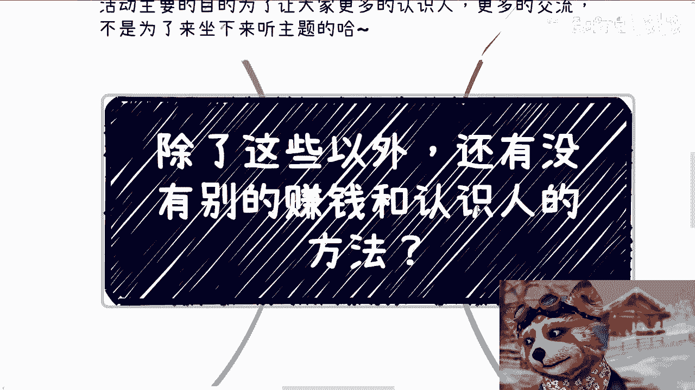
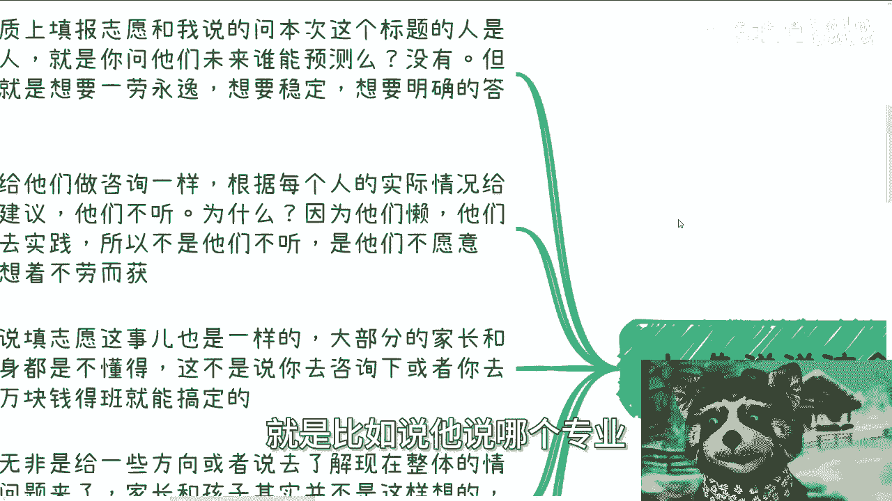
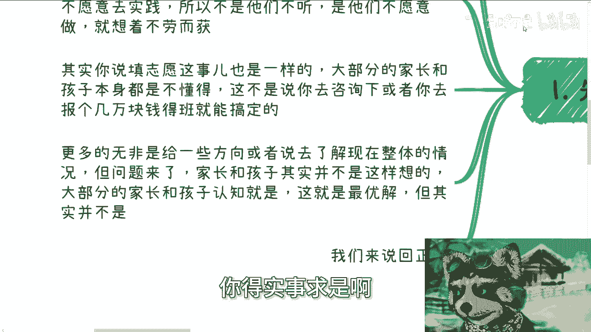
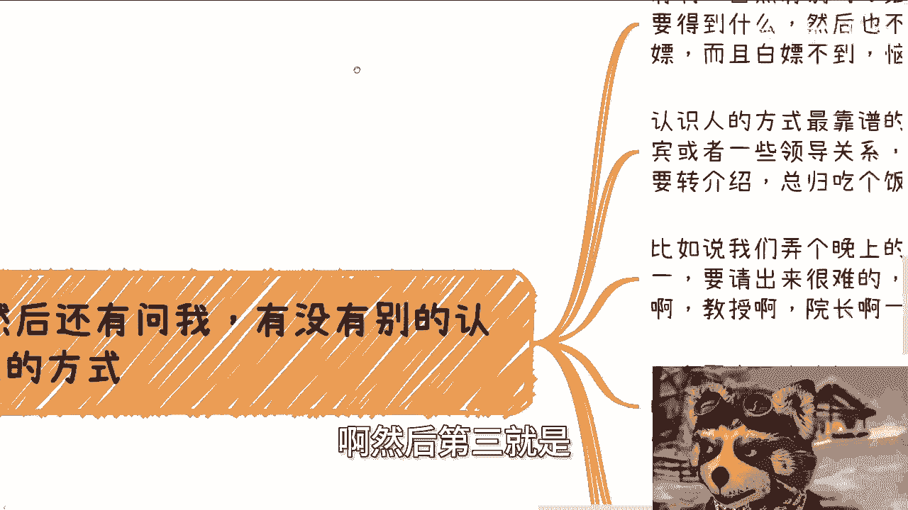
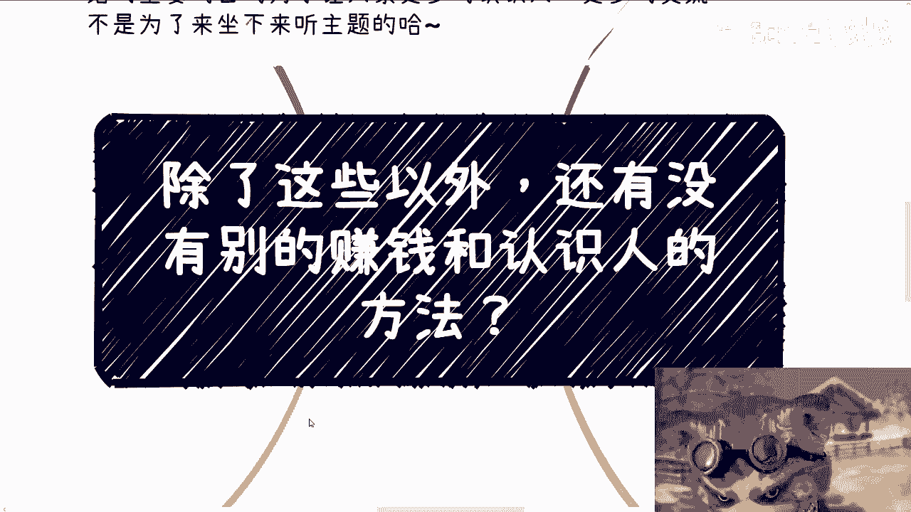

# 除了这些，还有没有别的赚钱的和认识人的方法 - P1 - 赏味不足 - BV14m42157Zr

好大家好，今天我们讲的这个主题啊，叫做除了这些以外，还有没有别的赚钱跟认识人的方法。

呃，也这个怎么说呢，严谨点说这不是个主题啊，这个是最近他妈的问我问的最多的一句话，我跟你们讲，我已经是被问的没办法了啊，所以我就就索性做这个视频，回头要是再有人问我，我他妈就直接把这个链接妈拍他脸上啊。

首先啊那个本期活动已经定了好吧，6月16号下午在01：30呃，下午01：30到六点，场地也定了，在这个青羊区啊，然后省骨科医院站附近好吧，然后活动主要目的是为了让大家认识更多的人，更多交流啊。

不是说为了过来坐下来听主题的好吧，也就是说你们不用太关心主题是什么啊，然后你们要是想了解详情，要报名的话，你们都私信我好吧，然后这次场地找了一个比较好的场地，就整个的环境啊，茶系啊，反正都会比较好啊。

那么首先第一点啊，我们先来这个提提最近高考报志愿的事情，因为跟今天这个主题有关系，其实本质上啊去寻求填报志愿跟我说的问呃，用这个标题来问我的是同一类人，就是你问他们未来谁能预测吗。

他们就会告诉你不能预测，但是呢他还要来问你说有没有，就是比如说他说哪个专业。

哪个志愿比较好啊对吧，然后或者来说这个有没有更多的这个稳定的，赚钱的或能够认识人的方法，为什么呢，因为我跟他们讲的东西可能在他们看来啊，就是说太不稳定啊，太不确定他们想要的是更确定的东西。

那问题是你如果有确定的东西，哼哼我，我就两件事情，第一如果有确定的事情还轮得到你们来做，没有对吧，这是第一点，第二点是我可以有确定的东西，你们接得住吗对吧，这就像我给给他们做咨询一样。

根据每个人实际情况，我会给一些建议，那他们不听啊，我跟他们讲，他们不要啊，那为什么对吧，我说他们他们有，我就说不好听点，我我直接说他们本质他们承认吗，他们不承认啊，你要我说是什么，因为他们懒。

他们不愿意实践啊，他们他们不愿意去付出，所以不愿意听对吧，他们不愿意所有而不愿意去接受所有，不那个不准确的事情，不确定的事情就想着不劳而获，那你按照这么个说法，那我就我就想跟他们说。

那你们以前读书干嘛呢，那你们怎么他妈的不跟不跟你们高中，不跟你们初中不跟你们大学那些老师说呢，哎我读完书了，我读完书必须找到工作，我他妈必须年薪50万，对不啦，有不了就没有呀对吧，我不管别人愿不愿意讲。

那但凡有我肯定愿意讲啊，那他们没有哇啊，听得懂吗啊，所以说其实你填志愿，我觉得啊他们填志愿这事也是一样的，就大部分的家长跟孩子本身他就是不懂的啊，这不是说你去咨询一下，或者你去报个几万块钱的班。

他就能搞定的，你不懂，你去报了这些班怎么了呢，就能预测未来了，不能呀对吧，你更多的无非是给一些方向，或者说去了解现在整体的情况，就比如说你不了解，你说你办了个几呃，你报了个几万块钱的班对吧。

去了解一下现状，然后让自己更好的去做决策，那没问题对吧，但是你你想想看，这个当中还有个问题，就是其实家长跟孩子他不会像我这样去想，能像我这样去想的人比较少，那么大部分家长跟孩子的认知就是。

OK我来报我来我我来就是交一个钱，我就想得到一个最优解，可能吗啦，对不对，就我们我们做事情，我们怎么样，你得实事求是啊。

对不对，你不可能啊啊那好，那么我们来说回正题啊。

你说最近一些咨询人问我，他又说有没有好别的犯法，你比如说很多人就问我啊，问我，那么我觉得呢本质他就是想不劳而获，但你问他们呢，他们也不承认对吧，那他他就问我，他说陈老师有没有别的赚钱方式，有啊有啊。

我觉得两个一，你有能力做吗，第二你愿意做吗对吧，我举个例子啊，我这边长三角珠三角有非常多的机构，他们缺互联网AI，缺新能源，缺各种各样的嘉宾跟老师，那我我就问嘛，问我这些问题的人，你们能做吗。

你们不能做对吧，那我要去我去跟你们提这些干嘛呢，你做不了啊对吧，我可以告诉你这个东西稳定赚钱，你能做稳拿，就你不要来问我有没有稳定的，你先看你有没有这个能力做啊对吧，你包括有没有别的赚钱方式，有啊。

我说了呀，你定个五六千的课，直接去下沉市场，长沙到佛山啊，武汉成都，你去搞啊，你我跟你讲，你只要有执行力，你只要有这个包装能力，你只要有这个营销能力对吧，你不要在那边想半天啊，又想这个我没做过对吧。

又怎么样，又抱怨说我我我没有经验，对不啦，你有本事你去做呀，我我可以跟你打保票，你只要做，你只要比如说海报做的足够好对吧，你的嘉宾对吧，包装的足够好，五六千，你去发，肯定有人报，我他妈给你打保票。

你相信吗，就现在一定有人报没有，就一定是你的这个内容做的不够好对吧，就包装的不够好，你坐稳了，能有几个人做了对吧，那说白了赚大钱是难的，小钱的方式千千万啊，我真的说了，那比如说我真的跟他们讲了。

他们又要说了，哎呀这个我不会那个嘛路子太野，这个嘛这个嘛风险很高，那个嘛我担心这个，我担心那个，那你想怎么样对吧，你想怎么样，别人替你抢银行，别人替你坐牢，然后把抢银行的钱送到你家门口，是这意思吧。

他妈服了。

我跟你们讲，真的对吧啊，然后第三就是。

然后还有问我有没有更好的认识人方式，有啊，我跟你们讲有啊，但很多人就口嗨呀对吧，想要得到什么，然后也不用付出成本，说白了就是白嫖，而且白嫖不到还恼羞成怒对吧，我就跟你们讲认识人方法很靠谱的。

就是转最靠谱的就是转介绍，你比如说啊你比如说你就跟我讲，你说你要你要怎么样的人，可以的，我帮你找，我找不到，我托人帮你找都可以的，那我就问我帮你找，托人帮你找，你总归要吃个饭吧，你总要给个钱吧对吧。

你比如说我们晚上弄个圆桌，多点人，因为为什么，因为你比如说你要去找找谁谁谁我，我不可能跟对方说哦，我们介绍一个陌生人对吧，一对一出来不可能的，你总归是找一些，或者都是教授对吧。

你你找一些人出来一起请出来，那么你这个由头比较好找，对不对，那我就问你们一个圆桌，一个圆桌，比如说七八个人或者十个人，人均1000块钱，不过分吧啊不过分吧对吧，可能我还没算上酒水。

而且另外一方面你找别人介绍，可能还有中介费，或者你还要担心这个人就算给了中介费，这个人介绍过来的人靠不靠谱，你其实里面风险也很高，但是这是方法呀，是的呀，你愿意出不来，有几个人愿意出啊，啊对吧。

我就这么跟你们讲，你们但凡有人愿意出，你跟我说好，陈老师，我组个局啊，我出钱你帮我去组对吧，你但凡跟我说，你愿意出钱，大家当中的劳务费对吧，我也不问你们要多对吧，你比如说你给我个二三十%的这种服务费。

我帮你去找你，只要说出钱，我肯定帮你找，就这么简单，你愿有几个人愿意出来，不都口嗨嘛对吧，你问我方法有方法多了区别呀，你包括平时有闭门会议，线下有项目对接，你都可以旁听，没问题的。

我甚甚至可以说不不要钱，对不对，也可以认识人，但问题是别人为啥请你呢，大哥你有没有想过这个问题对吧，就是你我知道你们的想法，你们都是希望就是说跟以前读书一样，说好老师讲一个方法。

这个方法就一定能达到这个目标，你达不到，哥哥们对吧，你你要么付钱，你要么就是自己有积累跟背景关系，你又不愿意付钱，自己也没有积累，然后你想怎么样啊，你想怎么样，对吧，然后第四我跟你讲。

其实零散的逻辑也很多，你比如说你要赚小钱或者说更小的钱，你卖什么考研教材啊，你卖鞋卖吃的，卖衣食住行，甚至还有很多人卖这种联通联通积分对吧，运营商积分很多很多，但你按我想法，不是说这些东西不能做。

你懂吗，这些东西一方面靠不靠谱，你也不知道，另外一方面利润也很低，而且在另外一方面，如果你想薄利多销你，你你也完全看流量，但是大部分人他没有流量对吧，那就说白了你要么就是有很强的营销能力。

那你可以自己去找卖的东西，然后去营销，去写话术，去做海报，做短视频去卖，虽然可能没有啥大钱，但至少你有沉淀，有积累，你可以赚点小钱对吧，你别什么都想着你自己做啊，然后大部分人最好的方式是什么。

我跟你们讲了很多遍了，就是你们最好的方式就是先不停的去蹭项目，碰到一些人，比如说做教育的，做电商的，卖产品的，你甭甭管他卖什么东西，毕竟咳他卖什么，风险在于他，你只你只要关心你怎么去蹭这个项目。

比如说帮他分销对吧，帮他做，帮他找找销售对吧，帮他帮他找找合作方，你不要承担任何的风险，然后你就去蹭帮着做一个不行，两个两个不行，三个三个不行，100个你就去搞啊，对吧哦，你我跟你讲，很多人是这样子的。

他又不愿意去做，他又不愿意实践，然后什么事情都想着自己做，然后还抱怨自己赚不到钱，那他妈你那我就说了，你还你，你就想着是别人抢好银行，不替你去坐个牢，然后钱扔你门口可能吗啦，对不对。

那现在就是说你要么就是有积累，你要么就愿意花钱，那么还有捷径，还有可能性，否则你有啥好说的呢，对吧啊，你你你说世界上有没有更好的方法，有，但跟你没关系对吧，如果我们就说这个世界上有更好的。

认识人的方式或者赚钱的方式，中国14亿人啊，轮得到你做，轮得到我做嘛啊，而且我就跟你们这么讲，连连我们现在合作机构给我们老师的钱，相比去年啊，今年相比去年削减了六十七十%，我跟你讲啊，不夸张的说啊。

真的百分90%都有的，我们能说什么对吧。

就是我一直跟你们强调什么意思，就是我们是普通人是什么意思，我们只能跟着趋势走，我们只能跟着社会走，我们只能跟着地球去转，你呢你你你你们现在大部分人的想法是什么，就地球社会趋势跟着你转可能吗啊，对吧。

然后我最后还提一点啊，就是不要再去想着说未来哪个方向好不好，我就现在只问你们一个问题，每年将近1600万，1700万的应届生，你先告诉我怎么解决这个问题，你再来讨论未来行业怎么样。

你如果这个问题解决不了，讨论什么东西都没用，你懂吗啊行好吧，那先这么着啊，那个职业规划好吧，商业规划啊，然后那个成都这个活动啊，报名的就私信我啊，然后剩下的话就直接规划商业规划，然后项目项目计划书啊。

然后那个叫什么白皮书啊，分红啊，丰润啊，股权啊对吧，各种各样的东西，包括你们现在有什么牌，你们没有什么牌啊，你们希望就是说通过跟我的沟通，能够把未来的这个规划或者方向，可能呃或者说就像我们刚刚说的。

你们想更贴近地气的了解，现在整个社会的一个发展，那么你们可以找我咨询好吧，然后如果啊想要通过咨询得到完全，手把手确定的方向的，以及希望我对你们负责的，你们就不要来找我了。

