# 除了高效的搞钱，一切都是虚的！ - P1 - 赏味不足 - BV1Jo4y1x7bM

好啊，小伙伴大家好啊对吧，今天是几号一号对吧，正好他想让我校对一下我的这个小浣熊啊，对就今天讲这个内容呢，我觉得是这样子的啊，结合最近的这个咨询跟私信啊。

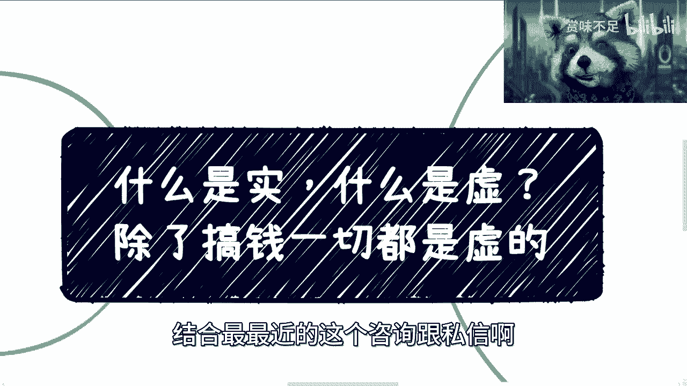

我先给你们结论对吧，你们别来跟我讲什么是实，什么是虚啊，你们以后跟别人讨论也是一样的，但凡你们想要去就是做商业的对吧，或者以更高效的方式去赚钱的，我跟你们讲什么叫什么叫虚啊，除了搞钱，除了能搞到钱。

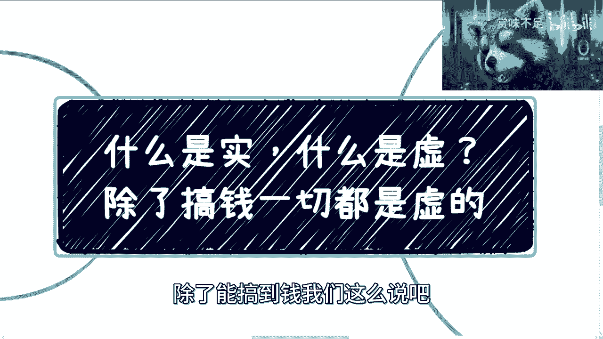

我们这么说吧，我这个地方写一下，除了高效的啊，能高效的搞到钱啊，一切都是虚的，你明白吗啊，别人跟我讲什么打工啊，怎么样怎么样怎么样，你打工所有的你，你年薪再高，在我看来也是电池，有什么区别，没有区别。

你明白吗啊，然后我来给你们演推演一下，这个最近这件事情的过程是这样子的，这个众多咨询的朋友呢跟我聊的过程当中呢，其实都会聊到什么是虚，什么是实啊，包括他们想做什么兼职对吧。

包括什么毕业之后想做什么方向对吧，聊了很多啊，这第一个第二个呢，今天评论区啊有人问我，他说因为前两次不是写了个测试吗，他们就问我，他说测试转行转什么，我说转产品经理，项目经理运营啊对吧，都能转啊。

然后他就问我，他说啊，他说项目经理比测试还要虚啊，我跟你们讲，为什么我推荐啊，会说啊你能够转呢，还是转项目产产品啊，项目那个叫什么产品，或者来说运营，为什么呢，是因为你同样有，比如说你同样工作时间。

同样工作十几年，或者同样工作5656年，你做项目经理，你做产品经理，你做运营所能接触到的，能够说未来达成商业化合作的，或者说能够有一定商业化突破，或者在思维上能有一定突破的，至少比你做开发和测试来的强。

你明白吗，你不要去管他虚不虚，虚不虚，是这么判断的吗，并不是啊，并不是你不是说在那边写代码，你就是十，你要是这种时间的话，那OK你就做好电池，你不用来跟我讨论这件事情好吗，我不跟电池讨论这件事情啊。

那么这是第二点，第三点是评论区，还有人跟我说，他说哎呀叉叉发展很多，对吧啊，这个某某某岗位发展很好对吧，人家公司里化用权很大，这位电池啊，我跟你说的很清楚，人家话语权很大，并不是人家十而导致的。

反而是人家跪舔的好，人家关系处的好，这叫虚，你明白吗啊，别人跟我提什么那个公司里面谁话语权很大，我刚刚说的很清楚了，你主要是在公司里面对吧，我给你举个例子，比如说你在阿里对吧。

你比如你哪怕就是个P8P9，在我看来你也是个电池，有什么区别没有区别是吧，然后还有人跟我提啊，就说啊这个这个叫什么，你说赚不到钱是吧，那公司里面其实至少还是有那些能够有股票啊，有期权啊对吧，我跟你们说。

所有的东西都是有红利期的，有红利期有个人吃到，并不代并不代表所有人都吃得到对吧，你不能用很多的幸存者的偏差来定义这件事情，首先这第一点，第二点是在我看来，从本质上来讲，无论是股权还是期权，这个东西。

无非就是资本家出来让电池更压榨电池的，或者更压榨那些想拿却拿不到的那些电池的，方法二罢了对吧，你明白吗，只不过只是如此，你不能把他这个东西拿过来跟我说哦，打工也能赚多少钱呢，那行啊。

那你那按照你这个理论行啊，那么天下这么多打工人都赚得到钱吗，啊你的妈不是搞笑吗。

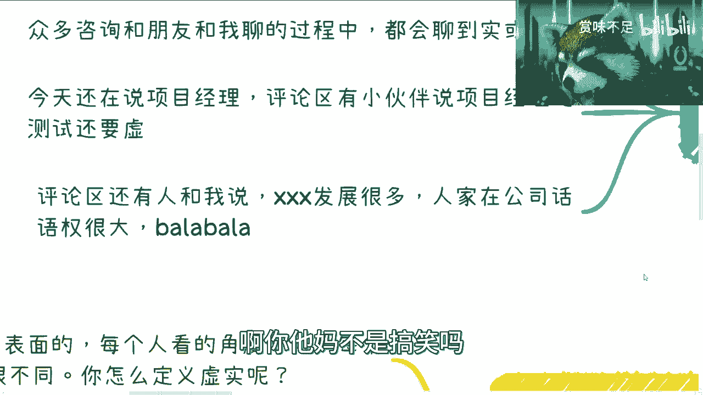

是不是对吧，嗯然后这是整个这件，今天我来讲这个主题的一个过程啊，二啊我在这个地方跟你们说了啊，我来列几个啊，好那么我来问你们几个问题啊。

你们看啊，第一你们在公司里面好好工作对吧，好好晋升，我来问你这个东西是虚还是，你们觉得是虚还是对吧，那我可以你的逻辑理论，我跟你们讲的很清楚，你们但凡能赚到钱，或者大部分人，我不说少部分人啊。

大部分人能够更高效的赚到钱吗，如果可以，那就是使啊，如果不行，那就是虚，那我就问你们是虚还是有意义吗对吧，这是第一点，第二点是你们说你们在公司里面话语权很大，你再大能大到哪里去，你是老板吗，你是股东吗。

你有分红吗对吧，你跪你你跪舔的好，那我就请问你到底是因为实你你你跪舔好呢，还是因为虚拟跪舔好对吧，那第二第二个问题啊，第三个问题，你技术不好对吧，你MIT背景对吧，我就算你M这个全部是MIT博士背景。

好了对吧，团队好对吧，业务做得好，不停的接外包对吧，为别人做分包，我就问你这件事情是虚还是啊，你们想想看对吧，再加上我前两天在动态里面也写了，也发了对吧，我发了一个项目书啊，是这个直播电商的对吧。

然后呢你会写项目书，项目书你会写申请书，那我就问你是虚还是好，OK我们先来讲上面这些我就不去讲它了啊，我从第三个开始讲，你看啊，你技术好，团队好，给别人追外包，你能赚的是什么技术服务费对吧，你做的很好。

你接的也不过技术服务费对吧，比如说一个项目啊，按照按照我现在看到的一个项目对外包装，对对那个技术项目对外去外包，30万到50万了不起了，顶天了顶天了啊，你再再怎么样也就顶天了啊，但是你要明白。

你要知道人家的总包方对上面放报是多少，总包方对上面报几百万，几千万，几个亿都有的，但是你外包出去也就是几10万，那我就问你嘛，你到底觉得几10万是虚还是还是几百万，是虚还还是对吧，你怎么定义呢。

哦你今天如果跟我说啊，我我东西那个上面都很虚的对吧，人家都不做事情的，都他妈往外包的那行啊，那我就告诉告诉你们，这些虚的都是几百万几千万的，你做不做嘛，我告诉你，你不要你不要嫉妒人家。

你这么说是因为你没有能力做，你不知道怎么做总总包，所以你说人家虚对吧，但是我就反过来说，你就算十了怎么样呢，你赚到钱吗，赚不到你十个屁啊，是不是对吧，然后项目书也是一样的，我告诉你这个项目书对吧。

要说就是各地方这种能批的话，基本上就是几千万就几千万这个level的对吧，但是我就我就问你，我写个项目书，我既没有团队，也没什么东西，我就问你，我算虚还是对吧，那按照你们的逻辑就是我肯定是虚的啊。

虚成狗了是吧，但是我我关心吗，别人关心吗，不关心，为什么我告诉你的，你只要能高效赚钱，比你打工来到高效就是屎，怎么了呢，虚怎么了呢，十怎么了呢，Who care，对不对啊，然后我再问你对吧。

你在外面画饼，比如说你今天是个是个COFOUNDER对吧，你在外面画饼，我问题是虚还是我就这么跟你讲，企业资本家只关心一件事情，活下去赚钱对吧，嗯你在外面画饼，只要你能够把钱忽悠进来。

你就是十管你这么多哦，那我今天如果来说哎我在外面不画饼，然后我就你是我的员工，我就跟你说，哎咱们用爱发电啊，用爱发电，你别人打工资了，你到时候还是骂我的呀，对不啦，那我就问你，我就反过来问你。

你觉得是10号还是10号对吧，那你肯定要讲的，还这老板对吧，那陈老师，陈老师他妈年前忽悠不到哼，那我就搞笑了，那你们不是要实的吗，哎十的话就拿不到钱，大概率拿不到钱，那到底怎么样，你们想怎么样是吧。

就我告诉你们，你们所有人对吧，就这个思想上要改变过来，别去老是觉得什么就是固有的思想，去定义所谓的适合去有意义吗，没有意义对吧，然后我今天早上在刷B站的时候更搞笑了，还看到一个up主说什么认知道吧。

说自己用心做视频啊，然后B站没有推荐也不给钱，哎呦我真的是搞笑的，我就我我今天早上看完这个视频啊，我就有一个想法，B站现在自己都泥菩萨过河对吧，自身难保，人家要的是什么，要赚钱，人家要的是盈利哦。

你一个公司本身，一个社区，一个生态本身都已经不盈利了哦，你作为一个up主对吧，你在用心做视频，你说他不给你钱怎么呢，我是一个资本家，我觉得从任何商业角度，我不给你钱是正常的。

你给我阐述什么价值的行为对吧，我是拿着你的这个视频去融资了，还说我拿这个你的这个视频，能他妈的申请几百万有吗，没有，那我为什么给你钱呢，对不起，莫名其妙嘛。

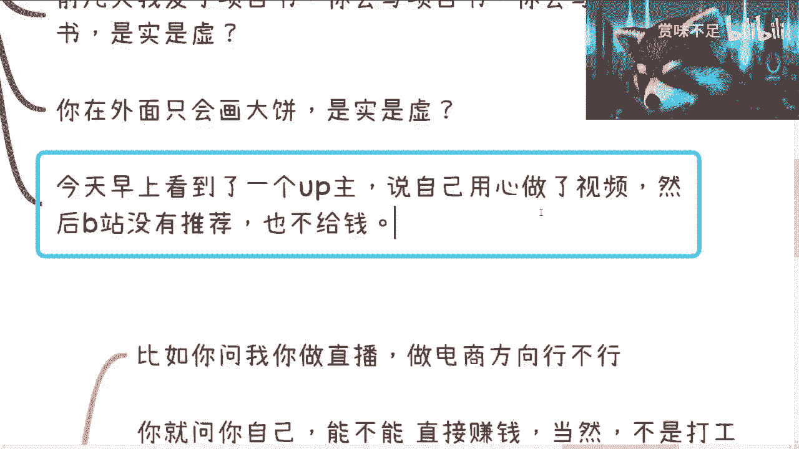

是不是，所以我跟你们讲了，你们但凡想要打工的。

做电池的，别来跟我沟通对吧，你们就好好去打工，你们看未来是不失业对吧。

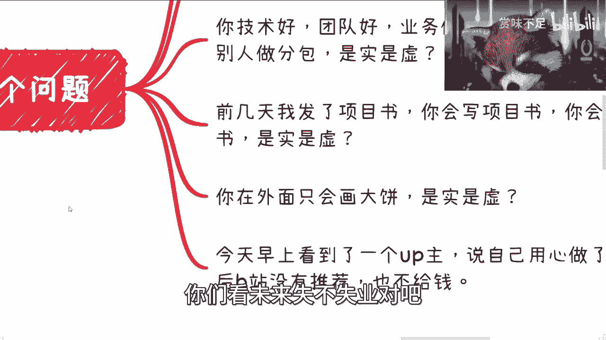

失业到时候别来找我，我是帮不到你的好。

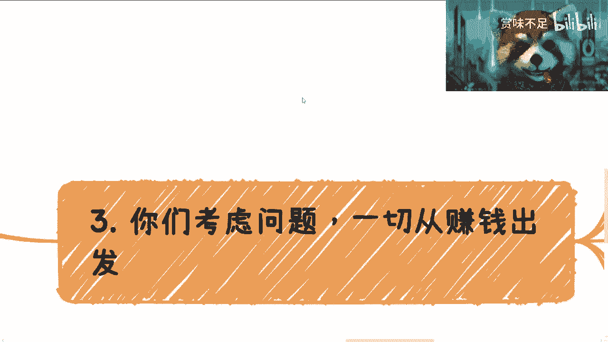

然后第三点，你们考虑问题，我跟你们讲，一切从赚钱出发反推就可以了。

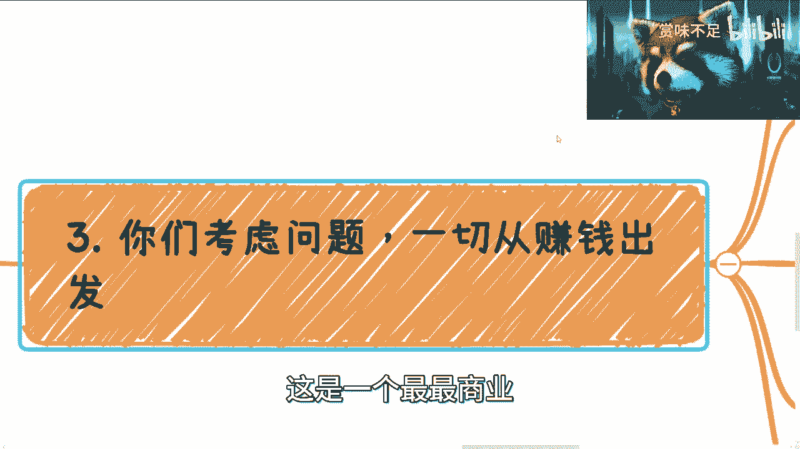

这是一个最具商业就是最最商业化的逻辑，比如说给你们举个例子，比如说你们现在都在问我说做直播，做电商，做晚安对吧，或者来说做什么这个考研对吧，怎么怎么样，我跟你们讲，你们问我的所有方向，你们先问你们自己。

你们做这个方向能不能直接赚钱，当然不是打工那种赚钱能不能性价比更高的，赚钱能吗，我就问你们自己问题，自己能吗对吧。

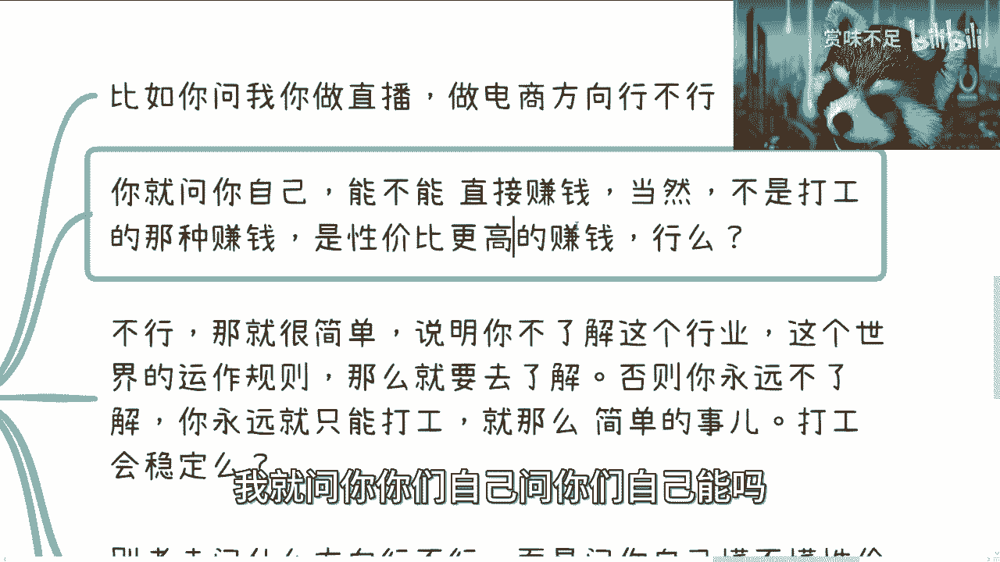

那99%的人答案都是不能对吧好，那不能的话，那就很简单，说明你不了解这个行业，你不了解这个行业水下的运作规则，你不了解这个世界的运作规则，那么你就先要去了解，而不是先干，有什么好干的呢对吧。

你兴致勃勃对吧，在那边说啊，我要进这个行业，我要干好，你干什么东西啊，对我来讲，你就做个电池有什么好干的，缺你不缺，少多你不多，你说是不是，那你还跟我讲什么呢，你说做呗对吧，做到三做。

做到30岁被被替换掉，换些新的电池，对我没影响的呀，对不对，我跟你们说这么长时间，我苦口婆心说这么说这么长时间，我就觉得你大部分人还是没有get到我的点对，那你就去了解，否则你永远是不了解。

那你永远你比如说你2023年不了解你，到2025年还是不了解你的，2027年还是不了解你的，32030年还是不了解，那么你永远只能打工对吧，你永远只能做个电池，就这么简单的事，而且你打工稳定吗。

你打工能赚到钱吗对吧，当然你可以说你赚钱，比如说很多人觉得年薪50万，年薪100万很牛逼对吧，可能怎么样，可以啊，可以啊，没问题啊，我觉得你在你20岁你觉得是很牛逼，你在你30岁可能觉得一般牛逼。

你的你40岁你就会觉得你在用命换这个钱，我就问你牛不牛逼，对不对，就我觉得就是唉不说了是吧，然后还有什么呢，就是你别老是问这个方向行不行，而是你问你自己懂不懂性价比更高的赚钱方式，不懂你就去学好嘛。

然后很多人又来问我，我不知道怎么学对吧，我告诉你了，你就去认识人去聊去问去聊去问去聊，什么意思，就是你要去不停地尝试的，这个事情不是一次性的，不是说你碰到两三个人都像我这么好，苦口婆心跟你讲的对吧。

你有可能是碰到100个人认知的，1000个人里面有一两个，你可能问到了精髓，然后你问到了核心之后，你通过这个核心去赚，以性价比更高的方式赚到了钱，这才是你的出路啊，你知道吗，不是说哦，我今天不知道好。

然后怎么办呢，好刷小红书对吧，刷B站，刷YOUTUBE有用了，没有用的呀，真的是，就我跟你们讲，你们但凡有谁对吧，能够了解商业的本质，你们就会明白，所有的东西都是通过沟通来的。

没有哪个东西是在网上会有的，因为它不符合商业逻辑，你就好像你就好像我今天只能讲到这，你看我会再往下减吗，不会的，因为有两点，第一我知道我再往下讲，我就会影响到别人的蛋糕。

第二是我也知道再往下讲的一些内容，肯定是有价值的，我不可能免费给你们，当然你们可以不不付费给我，我不要你们付费给我，你们可以付费给别人，随便你的对吧，但是你们得要明白这件事情是不是。

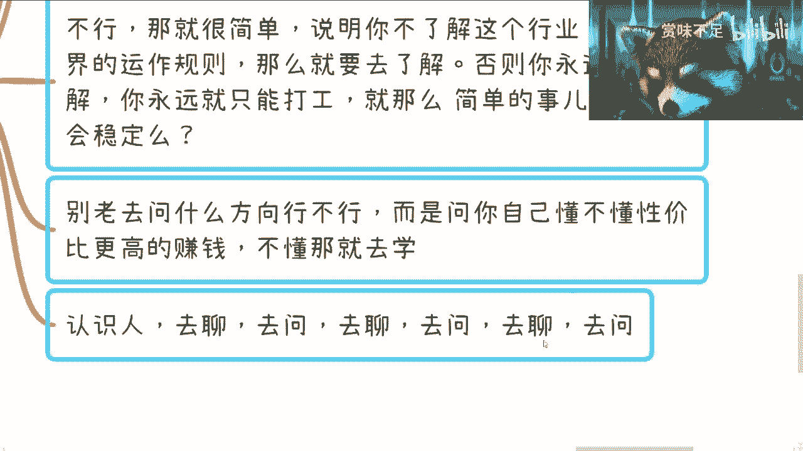

然后这个是三，所以我今天在这就是我们绕回来啊，再说我就问你，你现在告诉我什么是实，什么是虚重要吗对吧，你们自己想想看重要吗，不重要对吧。

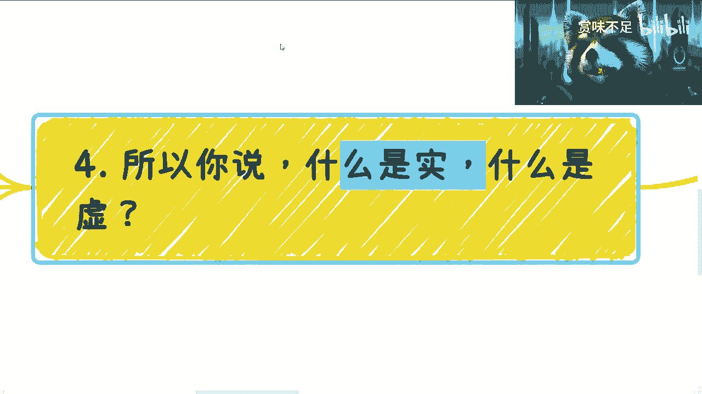

我跟你讲，虚和实并不是只有你们肉眼看到的，那些表面上的东西，就好像我刚刚说的，我写了一个项目书，我去申请，你看上去是很需要陈陈老师，你的团队也没有，陈老师这个技术架构也没有对吧，就他妈写个项目书。

是那我告诉你，我行业项目社能申请2000万，你管我对不对，我我我我我我关心吗，我关心你觉得我虚不虚，是不是，who care是吧，而且另外一方面每个level看上去不同啊对吧，你从你执行方。

你作为一个电池，你觉得我很虚，但是你要明白，从可能从政府上面的官员对吧，或者说从从产业园，从整个更宏观的角度，我也很实啊，我怎么不实呢，你以为这方言这么好写啊，是不是，你说你说我做数据经验。

我给别人做农业对吧，金融包括那个叫什么就是ARVR的对吧，结合数字经济，你以为这些方案这么好写，你写给我看看对吧，我跟你们讲，你们但凡谁能写，你跟我讲啊，我以后项目给你们，你们写我我就拿个手续费5%。

剩下95%都你的，对不啦，可以的呀，你以为这么好写是吧，然后另外一方面，你现在想想看，我就问你虚不好时一定好是吗，你再想想看，再问问自己是吗对吧，所以我跟你们讲，我觉得我觉得大部分人没有明白这个核心。

这核心是什么，就是从现在开始，往后的10年，我告诉你们是很艰难的，对不对，那么你们打工不是我说你们不要打工，而是说你们打工是不稳定的，你们需要找更高效的出路，对不对，但是你们不知道路在哪里。

那么从现在开始做积累，明白吗啊你你要做的就是能高效的去搞到钱，这就是实，否则这就是虚，剩下都是垃圾，结束了就这么简单，我你所以你现在想看方向重要吗，你考研重要吗，你别人的东西重要吗，我就问你重要吗。

对吧，你别人跟我说哦，我我我考研了，所以我赚了多少钱，这两者有因果关系吗，啊你有趣，你有去问过吗，你有去实践过吗，都没有，你怎么得出因果关系来的对吧，就好像很多人跟我说，我要去做直播了。

我要制作跨境电商了，我就问你，你手上有什么牌，你凭什么说你做了能高效赚到钱，你的不能啊，为什么不能，因为你不了解规则啊。

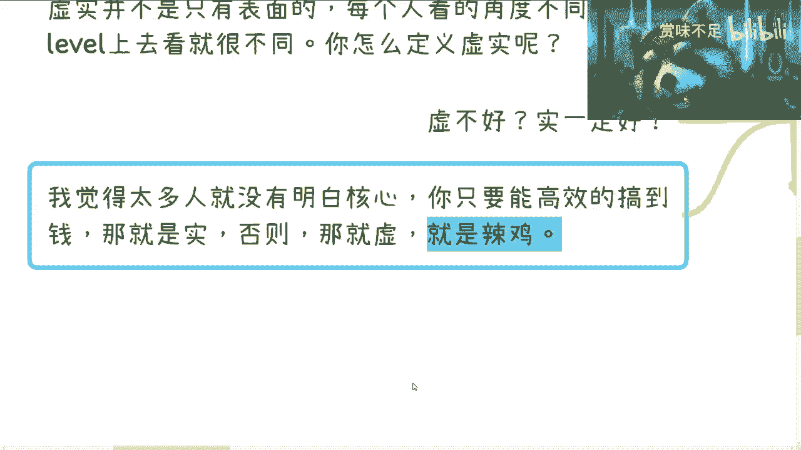

真的同学们。

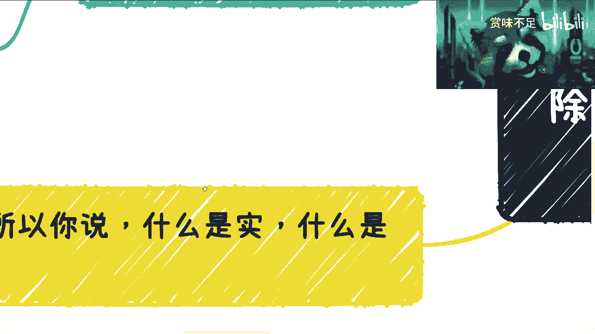

你们要明白啊，这个事情呢你们在学校里面是学不到的啊，你们在任何公司里面也是学不到的，但是你们想在我这边，或者想在别人这边免费学到也是不可能的，这当中主要还有个大的问题是，你们很多人问问题都问不到点子上。

都是这都是问那些大而全的对吧，我就这么说啊，你们但凡哪天有问题问到点子上，你就会发现我给你的回答肯定就完全不一样了，而且你们会看到全新的一个世界就这么简单，但是你总不能跟我说，哎陈老师。

我也不知道我问什么，你就跟我说说那水下80%的东西呢，不可能对吧，那你这不是说500块钱了，你给我5万块钱，我也不会跟你讲，因为什么，因为我不知道哪些适合你的，到时候我讲了，你要喷我了。

哎陈老师讲的跟我一点关系都没有对吧，结果我又用不上，是用不上，因为跟你没有关系，你都不知道你想要什么，我怎么知道你想要什么是吧，行吧就这么说吧。

