# 除了高效的搞钱-一切都是虚的----P1---赏味不足---BV1Jo4y1x7bM

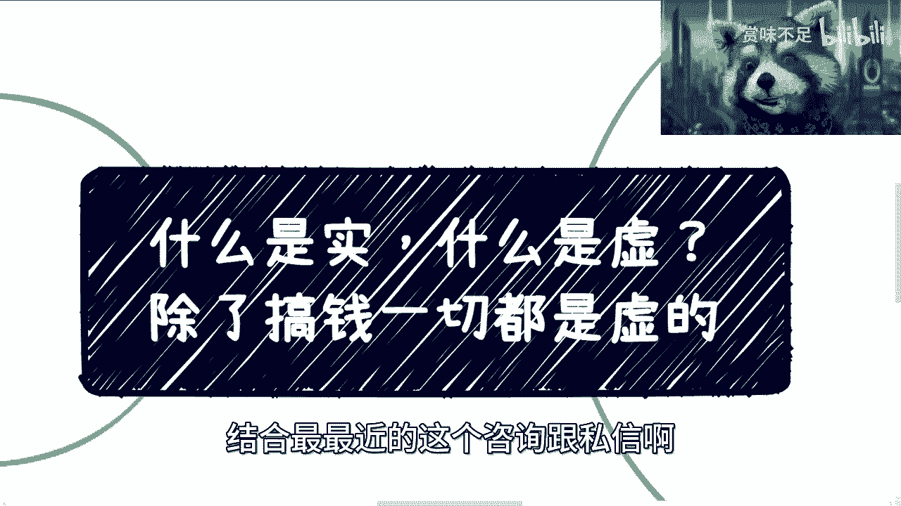

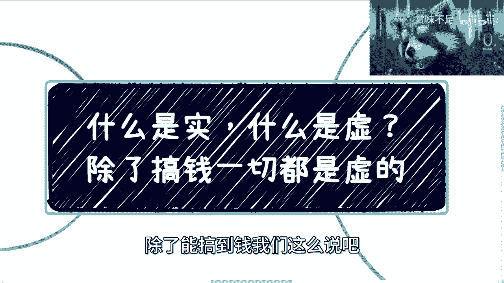

在本节课中，我们将要学习如何从商业和赚钱的角度，重新审视我们通常认为的“实在”与“虚幻”的工作与行为。核心观点是：**除了能高效地搞到钱，一切都是虚的**。我们将通过一系列问题和案例，帮助你建立以结果为导向的商业思维。

## 概述：问题的起源

最近在回复咨询和私信时，我发现很多人都在纠结什么是“实”，什么是“虚”。例如，有人问测试岗位转行做什么，我推荐了产品经理、项目经理或运营。对方却质疑：“项目经理比测试还要虚啊？”

这种疑问引发了我的思考。我们判断“实”与“虚”的标准究竟是什么？是写代码、做技术就更“实”吗？本节课，我们将彻底厘清这个概念。

## 核心论点：重新定义“实”与“虚”

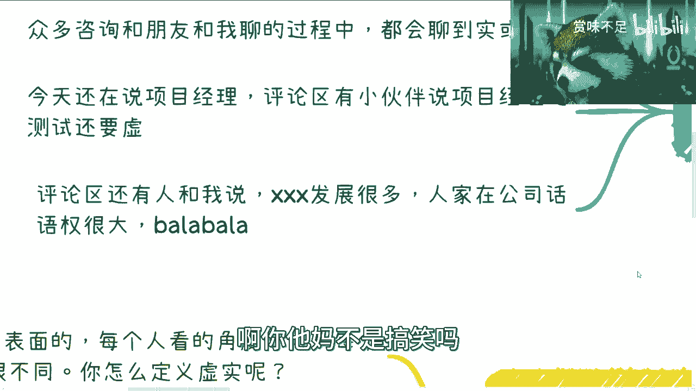

我的核心结论非常明确：**判断“实”与“虚”的唯一标准，是能否高效地赚钱**。

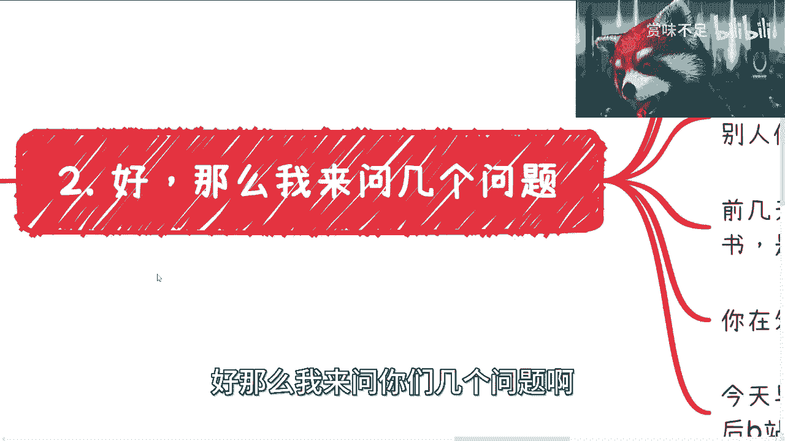

公式可以简化为：
**实 = 能高效搞到钱**
**虚 = 不能高效搞到钱**

在这个定义下，无论你的工作看起来多么“实在”（比如写代码、做技术），如果它不能让你比同龄人更高效地积累财富或商业资源，那么其本质就是“虚”的，你只是一块可替换的“电池”。反之，一些看起来“虚”的工作（比如写项目方案、整合资源），只要能带来高效的经济回报，它就是“实”的。

## 对常见迷思的剖析

上一节我们确立了核心标准，本节中我们来看看几个常见的认知误区，并用新标准进行剖析。

以下是几个需要重新思考的问题：

1.  **在公司好好工作、努力晋升，是实是虚？**
    *   判断标准：这份工作能让**大多数人**（而非少数幸运儿）稳定且高效地赚到钱吗？如果不能，那么对于追求财务效率的人来说，它就是“虚”的。

2.  **在公司话语权大，是实是虚？**
    *   判断标准：你的话语权是来自你创造了不可替代的商业价值（实），还是仅仅源于人际关系处理得好（虚）？只要你不是老板或股东，没有分红权，再大的话语权也可能瞬间消失。

3.  **技术好、团队强，只接外包项目，是实是虚？**
    *   判断标准：比较收入层级。一个技术外包项目可能报价30-50万，但项目的总包方可能向上报价几百万甚至几千万。如果你只能赚取底层的技术服务费，而无法触及高价值的资源整合环节，那么你的“实”是低效的。抱怨总包方“虚”的人，往往是因为没有能力去做那个“虚”但高价值的工作。

## 关键案例：项目书的启示

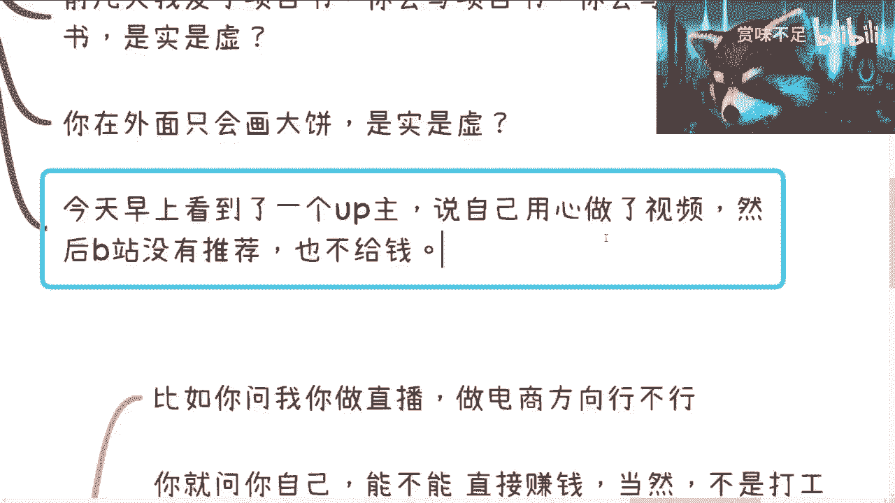

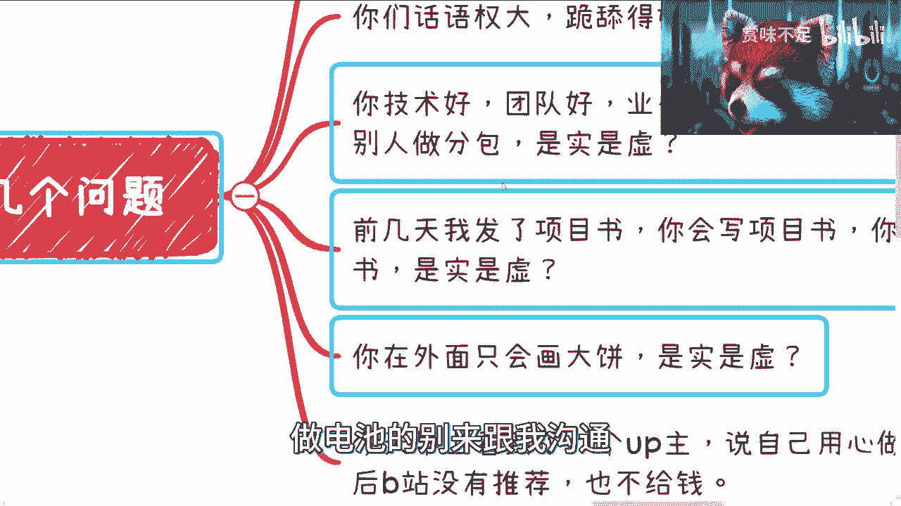

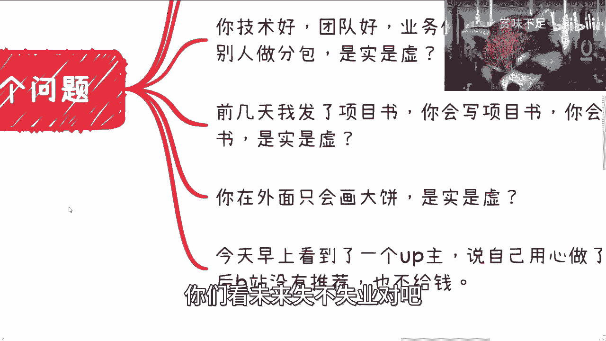

让我们深入看一个具体案例，它完美诠释了“虚”与“实”的转化。

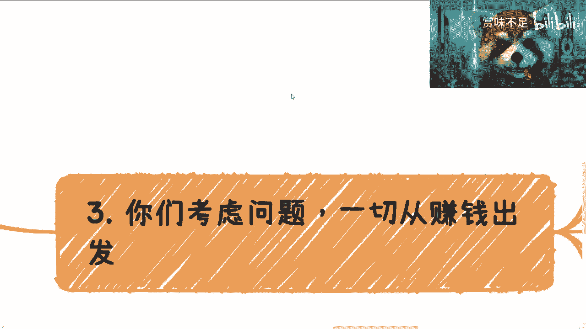

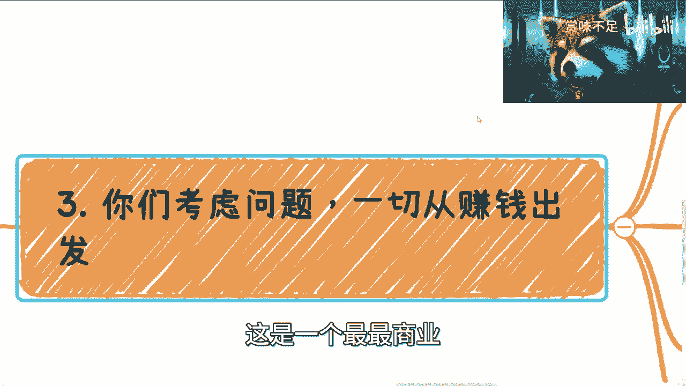

我写了一份关于直播电商的项目计划书。从表面看，我既没有现成团队，也没有技术架构，只有一份文档，这看起来非常“虚”。

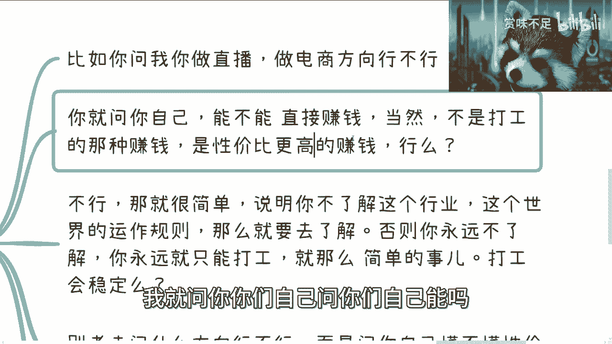

然而，这份项目书的目标是申请地方产业资金，级别在几千万。那么，核心问题来了：这份能申请到几千万资金的项目书，是“实”还是“虚”？

答案是：**它高效地指向了赚钱的结果，因此它是“实”的**。谁会在意它看起来是否“虚”呢？商业世界只关心结果。同样，创业者“画饼”融资，只要能把钱“忽悠”进来让公司活下去，这就是“实”。反之，一个让员工“用爱发电”却发不出工资的老板，才是真正的“虚”。

## 行动指南：如何应用这一思维

理解了新标准后，我们来看看如何将其转化为行动。

思考任何商业方向时，都应从赚钱结果反推。以下是你的行动 checklist：

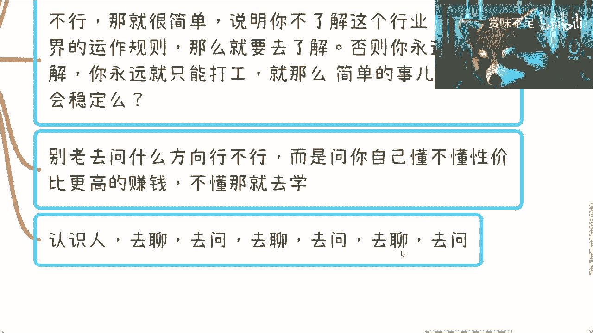

*   **第一步：自我提问**
    *   我想做的这件事，能否让我**直接**（非打工）且**更高效**地赚钱？
    *   如果内心答案99%是“不能”，请进入下一步。

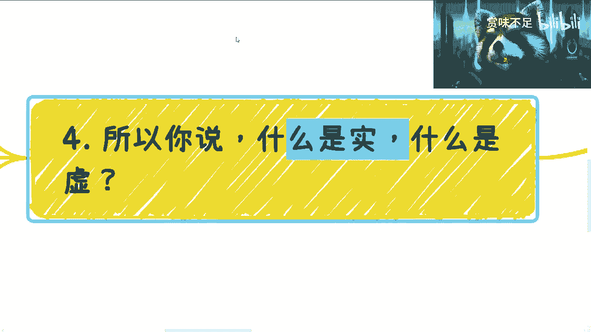

*   **第二步：承认无知**
    *   “不能”的答案说明你不了解这个行业的**水下规则**和真实运作逻辑。这不是行动的时候，而是学习的时候。

*   **第三步：正确学习**
    *   **学习方式**：不是通过刷小红书、B站看泛泛而谈的内容。真正有价值的信息在**人与人之间的直接沟通**里。
    *   **学习路径**：你需要主动去认识人、聊天、提问。这可能意味着接触1000个人，才能从中找到一两个愿意分享核心认知的人。这个过程无法一蹴而就。

*   **第四步：聚焦关键**
    *   停止询问“这个方向行不行”这种大而空的问题。应该问自己：“我如何掌握这个行业中性价比更高的赚钱方式？”
    *   当你提出的问题足够具体、触及要害时，你获得的答案和看到的视野将完全不同。

## 总结与忠告

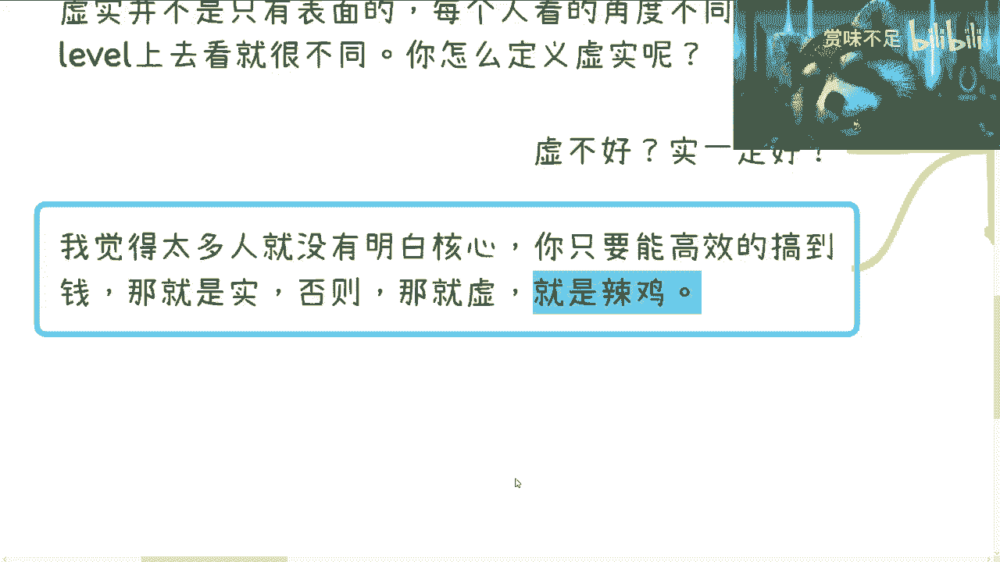

本节课中，我们一起学习了用“能否高效赚钱”这一标准来重新定义商业世界中的“实”与“虚”。

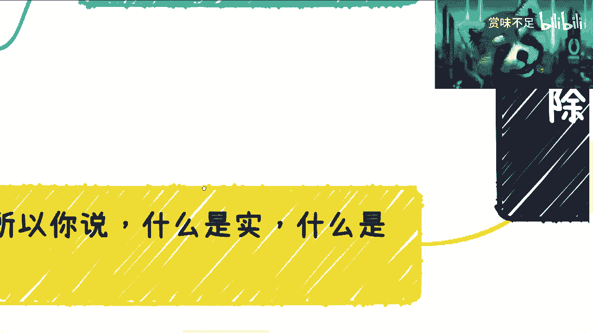

记住以下几点：
1.  **标准唯一**：抛开所有传统成见，`能否高效搞到钱`是唯一的试金石。
2.  **结果导向**：商业世界尊重结果，而非过程的形式。能带来资金和资源的“虚”比不能带来回报的“实”更有价值。
3.  **主动破圈**：学校和企业不会教你这些。你必须主动出击，通过有效沟通去获取水下80%的信息。
4.  **为自己负责**：未来十年充满挑战。满足于做一颗可替换的“电池”，将面临巨大风险。从现在开始，围绕“高效赚钱”去积累知识和资源，才是你的出路。

不要再纠结岗位或形式的虚实。问自己正确的问题，走正确的学习路径，才是从“虚”走向“实”的关键。