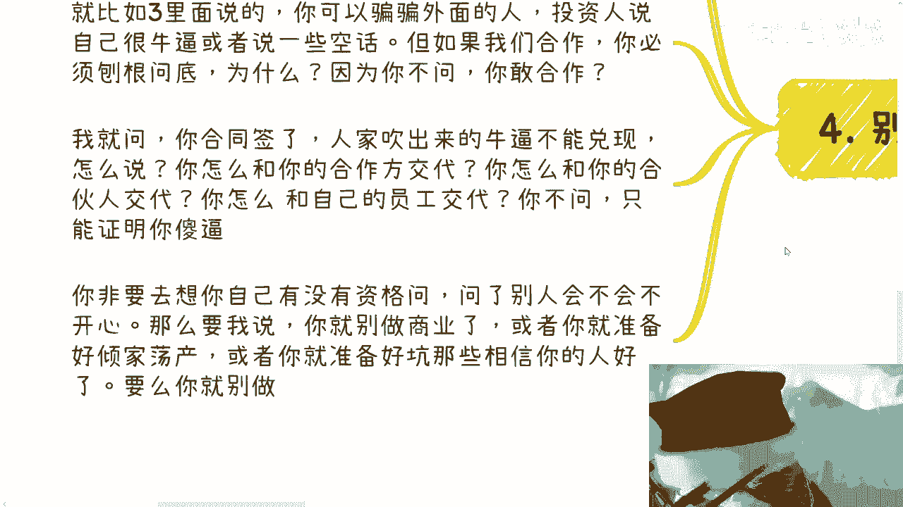

# 随机应变和占据主动权是非常重要的 - P1 - 赏味不足 - BV1tu4m1K72j

大家好啊，呃首先啊我先是本来呢我想说个事儿，我后来想算了，没必要啊，太冒风险，真的我本来已经准备好一大段文字，什么准备好喷了，但是想想算了没必要啊，何必呢是吧，另外说个事啊。

就是很多时候呢我觉得咱不要太思维定势，就是今天沟通下来啊，有个小伙伴就说呢说这个自己在读书啊，然后呃说去年呢可能自己也想赚钱啊。

也也在考虑这个问题啊，然后就跟我说，他说他考虑怎么平衡两者的时间啊，然后我就问我说你说平衡这两者的时间对吧好，那我说你了解了你，你就是我我不知道啊，我就随便问啊，我说那你说的赚钱的事是啥，他就跟我说。

我不知道，那我说你不知道，你也不知道你大概投入多少时间，你也不知道产出是什么，你也不知道性价比有多高，你可能甚至呃连这些就是说啊，就是细节或者说到底什么方向，你也没了解过，你上来就跟我说。

你说你要去平平衡这些东西，这就是用空话在套自己啊，没有意义啊，你平衡什么玩意儿，你平衡个锤子平衡，对不对，你不是平衡空气吗，你除了在那边叫什么叫叫叫叫与空气斗智斗勇，你你你你平衡啥对吧。

然后然后当然啊我我我我其实那个咨询的时候，因为对方也说嘛，他说陈老师你不用不用不用留情啊，随便说，然后我就跟他讲，我说那你平衡个锤子对吧，那你除了自我感动，觉得我思考了这个问题，你思考个屁啊。

你思考对不对啊，所以我希望大家不要老是用这种空话套自己，没必要啊，然后我们今天说的这个呢，叫随机应变跟占据主动权是非常重要的。

什么意思啊，就是我们每次谈话都是不可预知的对吧。

比如说你在活动上面有一个陌生人聊天，你不知道对方会问你什么，你也不知道你们聊着聊着聊到哪里去了对吧，那么你需要随机应变的去说去套去打太极拳，那在这个地方我说的很清楚。

不要觉得去套去说去打太极拳，就是为了骗别人，你骗不骗不重要，因为你只要不谋财害命，不去不去骗他的钱，你说一些虚的东西怎么了呢对吧怎么了呢，啊我我我我吹牛逼不犯法是吧啊，你比如说你说你公司，人家问你公司。

你可以说啊，你说我们刚创业对吧，我们也找了一些小伙伴正在注册公司，下周咳咳咳，公司才注册好，然后巴拉巴拉巴拉，你稍微稍微就是圆两句，那下周还会有人来问你们嘛对吧，那就算有人来问你们。

你就说啊我们现在还没注册好公司，名字重名了，怎么了呢，唉我就发现就是大家这这这这么实诚干嘛呢，对不对啊，你比如说问你们做什么业务的，你可以多说说别人的业务啊对吧，比如说你了解你，你比较了解跨境电商对吧。

那么你就可以自己说，你说哎我们做跨境电商的对吧，我们比如说可能跟这个杭州对吧，产业园有些合作或者怎么样的，你就说的模棱两可一点嘛，对不对，就是就是我们要明白我们做事情的目的对吧，就像我刚刚跟你说的。

你们随机应变只是为了产生更多的与对方，更多的这种聊天的机会，你知道吗，让你们能够有更多的机会去了解对方，去把这个对话继续下去，而不是说随机应变去骗对方对吧，哎呦我真的我发现我发现就是不把话说明了。

我觉得大家这个理解方向很很歪啊，啊很扭曲啊对吧。

啊然后第二占据主动权很重要，你看啊就是比如说往往你们去协会啊，公司啊，和别人谈商务啊对吧。

你比如说有很多人也跟我说，他说就怕别人问东问西，然后自己露馅对吧，好没问题啊，首先我们参考一，你需要随机应变，对不对，也就是说对方但凡问了你们，我们可以打一些马虎眼，打一些太极拳就过去了对吧。

另外一方面我们举个例子，比如说之前有小伙伴咨询我的时候问我，他说陈老师有人在现场就直接问我啊，什么营业执照对吧，然后问我一些这个这个这个，比如说这个公司团队的学历对吧，各种杂七杂八问题怎么办好。

我跟你讲啊，首先你要看你自己判断这些问题，影不影响你们两个合作的痛点，合作的痛点是什么，就是两点，第一他们公司跟你合作有没有什么硬性条件，就我现在坐下来没有看到过哪个签合同里面，除了那种招投标对吧。

哪个正常的合作业务里面是有一些什么，你们学历或者别的东西的硬性条件，从来没有见到过对吧，首先这第一点，第二点，咳咳咳咳咳，就是合作最大的痛点是什么，是你们双方能不能赚钱哦。

你难道跟我说我这个营业执照范围，或者我团队的学历，影响你或者影响我们赚钱了吗对吧，你自己想想有这种可能性吗，啊什么商业合作会因为这个东西影响，不存在的对吧，那么你自己去想想看是不是影响你们合作痛点。

如果影响了，那么那么你避不开，对不对，好，那么你要是避不开呢，你觉得你要能回答就回答，不能回答，你可以说哎这个东西等会后，等过两天我整理好材料再给你，怎么了呢，有什么问题呢，也就是说你你缓兵之计啊。

有问题回去再说对吧，如果根本无根本就无关痛痒，你就说啊，你直接说你说我们谈商业是为了大家一起赚钱，我觉得这些问题可能并不重要啊，我觉得这些问题才是重要的，你列出来123怎么了呢，有什么问题呢，对吧啊。

凭什么对方说的问题，你要跟着对方走呢，没有这个道理的呀对吧，而且你从谈商业角度来讲，大家就是为了赚钱的，你所有的出发点，只要你讲出来的123影响大家赚钱的，或者影响大家赚钱多少的，他不会反驳你的呀。

有意义了没有意义的呀对吧，如果来说他反驳你，那我就觉得对方是个，你可以换一家合作啊，是不是我我我我觉得我们是这样的，我们我们是一个人，就人与人的合作是灵活的，我们不是个计算机呀对吧。

就是说无论跟谁沟通都是一样的，你不要被牵着鼻子走啊，对吧啊，然后就和我们说在社会上碰见问题是一样的，你你往下看往下看啊，好第三个，任何事情都是要落到细节，这个事情我们以前说过，我今天再跟你们重申一遍啊。

比如说你今天跟我讲陈老师啊，比如说你们跟我是合作方案好，我来给你们举个例子，比如说你们跟我说，陈老师，我们的这个这个领导很牛逼啊，我们的领导关系很牛逼，我们有很多合作的院士很牛逼，我们以前有很多案例好。

我会怎么问啊，我就会问我不关心你们的院士，你们的老板牛不牛逼啊，我也不关心你们关系硬不硬，我只关心的是什么，你们能不能给大家带来带来赚钱的机会对吧，然后你们可能会说哎可以啊，我们可以拉点资源来啊对吧。

拉拉什么资源一大堆对吧好，那我就会问你告诉我拉什么资源，能提供什么服务，对吧啊，然后可能你们比如说你们可能跟我讲可以啊，拉一些区长啊，拉些书记好，那我就继续问，OK你说可以拉对吧，没问题。

那我就问之前你有没有拉过来的案例，拿出来看看对吧，或者来的其他人是什么职级的，你怎么证明就是你们老板跟院士拉过来的，另外拉过来的给钱了吗，给了多少钱对吧啊，然后比如说你跟我说有很多案例对吧。

OK那么我就会问什么案例有没有照片，媒体报道有没有对吧，你们在这些案例里面是什么角色，你们赚到多少钱，你们投入了多少钱，这些案例里面的合作伙伴或其他细节，我都可以来问，我，就看你能不能回答的出来对吧。

因为什么，因为我还是那句话，牛不牛逼，关系硬不硬，这他妈都是虚的呀，你跟我讲什么用呢，对啊，包括你们在市场上会碰到很多人跟你们讲，这种话有卵用啊，屁用没有啊对吧，你告诉我硬不硬，我不关心。

你告诉我能给我们带来什么，能给我们这个case带来什么对吧，能带来多大的赚钱的机会对吧，你说能拉来资源，什么资源对吧，因为我们碰到过太多这样的人啊，哦包括什么，还他说有案例的，怕拿出来一些案例。

然后我一问，我说你们在里面什么角色啊，你们做什么事情，一问三不知对吧，或者一问，那就是什么呢，就是他就是狐假虎威，拿出来一个案例，其实跟他屁关系都没有对吧，然后还有什么呢，就是就是亏本赚吆喝的。

就是明明这个东西吧，他拉过来拉过来给了20万，卧槽，你要是亏本赚吆喝，那我从我角度来讲，从我商业合作角度来讲，我要你有个屁用啊啊，我他妈不会花20万去请啊，我他妈还要给你赚钱干什么，你不再坑我。

你是干什么，对不对，就我觉得我们要有这种意识，不要去讲这种空话哦，就包括跟我说什么，哎呀我们领导和有行业影响力，我管你什么影响力啊啊那你到底说什么影响力，你说什么叫影响力，你说对吧，你要跟我说。

哎我们这个事对吧，比如说所有这个浙江省对吧，这个地铁也好，其他东西也好，这里面的算法就是我们提供的，我们有专利对吧，我就是我们有合作合作合同啊，我们可以给你看脱敏的，那我认你狠，没问题。

你不说空话谁不会说诶，我发现就是基本上大家都很喜欢听这种空话，很愿意听这种空话，然后你们跟我沟通的时候，你们也喜欢说这种空话有什么用啊，对不对啊，然后我跟你讲，你也我每次这么说，有很多人都会在想哎。

你自己有没有资格问这些哎，我告诉你们什么叫商业合作，商业合作就是不用基于所谓的信任，基于的是合同，信任有个屁用啊，不用基于所谓虚的东西，一切都是合作前提，大家都能赚钱为前提的对吧。

也就是说你跟我说关系硬不硬，怎么样子，这些空话你去骗别人，你别骗我们合作方，你懂吗，也就是说你去跟别人聊的时候也是一样的，你要明白对方跟你是合作方，他不要来跟你空对空，跟你空对空，没有意思的对吧。

就比如说我们三里面的，如果你是我的话，你一定要明白，就是对方这个人他可以骗骗外面人，他可以跟投资人说自己很牛逼，可以说一些空话，说哎我们能拉来很牛逼的资源市场，什么区长都是我们拉的对吧，没问题。

但是但凡你要跟他合作，你必须刨根问底，为什么，因为你不问，请问你敢合作吗，你怎么合作啊，啊你怎么合作啊，我就问你今天基于他这些所谓的吹出来牛逼，你合同签了，人家吹出来牛逼不能兑现怎么办，我就问你。

你怎么跟你别的合作方交代，你怎么跟你的合伙人交代，你怎么跟你的员工交代对吧，你不问我只能证明你是啊，对不对，你们每次讲出来的话，你们自己问问自己，这些话实不实际，你到底了不了解你不了解。

说这种话没有用的对吧，你如果非要去想自己有没有资格问问了什么，别人会不会不高兴，那我跟你讲，你要么就别去做商业了哦，或者你就准备好被骗得倾家荡产，或者你就准备好去坑那些愿意相信你的人。

我不知道你图什么，对不对。

你们明白吗，就是说如果你们想赚钱，你们所做的事情就要非常的直接，就是所有你们的行为目的只有赚钱这一个，不要去想那些有的没的，我到现在为止，到到今天为止，咨询还有很多人来跟我说啊。

啊我我我我当然当然他不一定说，就是我会跟他讲，我说你讲出来的这个行为里面，就包含了一定的情怀，他说对的对吧，我说你也包含了一定的不自信，我说对的，那我说有用的，你要么就好好赚钱。

你所有的行为都是去赚钱的对吧，咳咳不要去曲线救国，不要想不要就说就说，除非你家里银山金山堆着对吧，你要么就是以赚钱为目标，你就定好计划，你就一步步往下去做对吧，当下的经济情况不允许大家做过多的过渡。

那么你们可以定一个，比如说三个月一个半月的计划就去做，而不是在乎那些有的没的，也不是也不是就是说跟别人去空对空啊，甚至就是甚至就是说你们就是有些咨询我的人，包括评论区也是的，就你回复你，你说一句话对吧。

你作为一个大学生，你得有逻辑思维，你不能说出来任何话都是卫星啊对吧，就是我基本上现在碰到没有几个话，是属于那种说出来我觉得就很实很直接，一点都不虚的，而不是套用那种空话，那现在好了。

就喜欢那种什么那种叫什么，就假大空的文字对吧，然后看上去都很有用，但是我不知道这些话有什么意义，有什么意义，对吧，就像我以前我以前跟他们讲的，就是跟我说，那我们亲戚，我们的亲戚好像很牛逼，那你很牛逼。

能给我赚钱吗，能给你赚钱吗，那不能给你赚钱，不能给我赚钱，你很牛逼，有什么用啊，就这话说出来干嘛呢对吧，然后还有很多人跟我说，哎我进我进这个学校，这个学校校长院长都很牛逼，然后呢走能给你赚钱吗。

能给我赚钱吗，能赚多少钱，我要给多少钱，对不起，你了解过吗，对不对，就所有空话讲出来就讲出来都很自然，你知道吗，但是有用吗，没用啊，屁用没有，好吧行，就这么着吧，这个我想喷的，我真的不想喷了。

也没啥好喷的，回头还有人举报我，哎呀好有有啥大家新年快乐啊。

