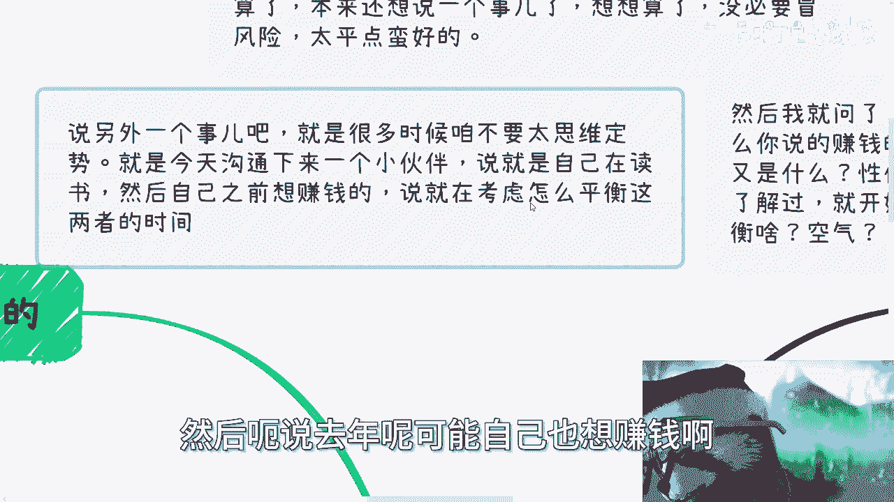
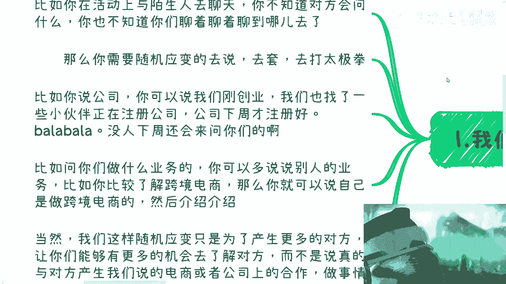
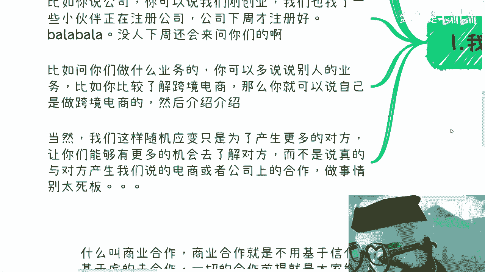
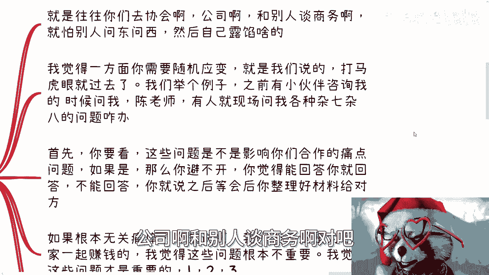
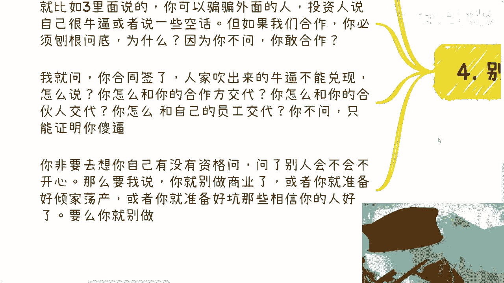

# 随机应变和占据主动权是非常重要的---P1---赏味不足---BV1tu4m1K72j

在本节课中，我们将学习在沟通和商业活动中至关重要的两个核心能力：**随机应变**与**占据主动权**。我们将通过具体场景分析，理解如何避免空谈，聚焦实际目标，并掌握将对话引向有利方向的实用技巧。

---

## 避免思维定势与空谈 🤔

上一节我们提到了课程的核心主题。在深入探讨之前，首先需要破除一种常见的思维误区：**用空话进行自我设限**。

许多人习惯于提出模糊、宏大的问题，例如“如何平衡读书和赚钱的时间”。然而，在提出这类问题前，必须先将问题**具体化**。

以下是具体化的关键步骤：
*   **明确目标**：你想通过“赚钱”具体做什么？方向是什么？
*   **量化投入**：你计划为此投入多少时间、金钱或资源？
*   **评估产出**：你期望获得什么回报？性价比如何？
*   **了解细节**：你对所选方向的具体路径和细节了解多少？

如果这些问题都无法回答，那么所谓的“平衡”就只是在“与空气斗智斗勇”，是一种无效的自我感动。所有思考和行动都必须建立在具体的细节之上，而非空泛的概念。

---

## 核心一：学会随机应变 🔄

在社交或商业场合中，对话往往是不可预知的。你无法提前知道对方会问什么，话题会走向何方。因此，**随机应变**的能力至关重要。

随机应变的核心目的不是欺骗，而是**创造和延续对话机会**，以便更好地了解对方，探索合作可能。

**核心公式**：
`随机应变 = 创造对话机会 + 延续话题 + 获取信息`

以下是一些实用技巧：
*   **模糊化处理**：当被问及公司状态时，可以说“我们正处于创业初期，正在注册公司，下周会有进一步进展”。这为后续沟通留下了空间。
*   **转移焦点**：当被问及具体业务时，可以谈论你更了解的关联领域。例如，若熟悉跨境电商，可以说“我们的业务与跨境电商和杭州产业园有些合作”，保持话题的开放性。
*   **目的导向**：始终记住，应变是为了推进对话，而非终结它。只要不涉及原则性欺骗（如谋财害命），适当的语言修饰是沟通策略的一部分。

简而言之，随机应变是润滑剂，确保对话之轮能够持续向前滚动。

---

## 核心二：牢牢占据主动权 🎮

上一节我们介绍了如何灵活应对问题。本节我们来看看如何更进一步，从被动回答转为主动引导，即**占据对话的主动权**。

许多人害怕在商务洽谈中被问及细节而“露馅”。解决之道除了随机应变，更关键的是主动定义对话框架。

**核心逻辑**：
`合作痛点 = 能否共同赚钱 + 是否存在硬性合作条件`

当对方提出一些可能让你为难的问题（如询问营业执照、团队学历）时，你可以遵循以下步骤应对：
1.  **判断相关性**：快速判断该问题是否触及上述**合作痛点**。绝大多数正常商业合作，都不会将学历等作为硬性条件。
2.  **分类处理**：
    *   如果问题无关痛痒，可以直接回应：“我认为我们合作的核心是一起赚钱，您刚才的问题可能不是关键。我更想探讨的是如何实现盈利，例如123……”
    *   如果问题相关但难以立即回答，可以使用缓兵之计：“关于这个细节，我需要会后整理一份准确材料再提供给您。”
3.  **主动引导**：将话题拉回你关心的、与赚钱直接相关的核心议题上。在商业对话中，只要你的提议紧扣“共同获利”这一目标，对方通常没有理由反驳。

记住，沟通是灵活的。不要被对方的问题序列牵着鼻子走，要学会建立自己的对话节奏。

---

## 一切都要落实到具体细节 📝

无论是随机应变还是占据主动权，其根基都在于对**细节**的把握。空话和虚言在商业世界中毫无价值。

当有人用“资源很强”、“关系很硬”、“案例很多”等空话与你沟通时，你必须具备**刨根问底**的能力。

以下是一套追问细节的示范流程，假设对方声称“资源雄厚”：
1.  **追问具体资源**：“您说的‘资源’具体指什么？能提供什么服务？”
2.  **要求证据**：“您提到能邀请领导，之前有成功案例吗？能否看看当时的照片或报道？”
3.  **明确角色与成本**：“在那个案例中，贵方具体扮演什么角色？投入了多少成本？获得了多少收益？”
4.  **量化价值**：“这些资源能为我们现在讨论的项目带来多少具体的盈利机会或成本节约？”

**核心原则**：商业合作基于**合同**与**可验证的细节**，而非虚妄的“信任”或“影响力”。对方可以对外吹嘘，但作为潜在合作方，你必须核实。不问细节就合作，既是对自己的不负责，也可能坑害你的团队与合伙人。

---

## 总结：目标导向，拒绝空谈 🏁

本节课我们一起学习了有效沟通与商业思维的关键。

*   **破除空谈**：所有计划必须始于具体、可执行的细节，避免用空泛的问题自我设限。
*   **随机应变**：以创造和延续对话为目的，灵活应对不可预知的话题，获取更多信息。
*   **占据主动**：在对话中判断问题的相关性，主动将话题引导至核心痛点——**共同赚钱**。
*   **深挖细节**：对任何空泛的承诺保持警惕，通过连环追问将一切落实到可验证、可量化的具体事实上。

最终，一切行为的指向都应高度明确：**以赚钱为目标**。制定短期（如三个月）可执行计划，并直接行动。在商业世界里，实打实的细节和直指盈利的思维，远比任何华丽的情怀与空话更有力量。