# 面试的时候如何更好的提问来了解这家企业 - P1 - 赏味不足 - BV1iD4y1A7r6

好那么这一期来讲这个企业岗位的这个review，昨天其实上传了一个视频，但是我傻了啊，就是后面把那个音音乐这个设置开的太大了。

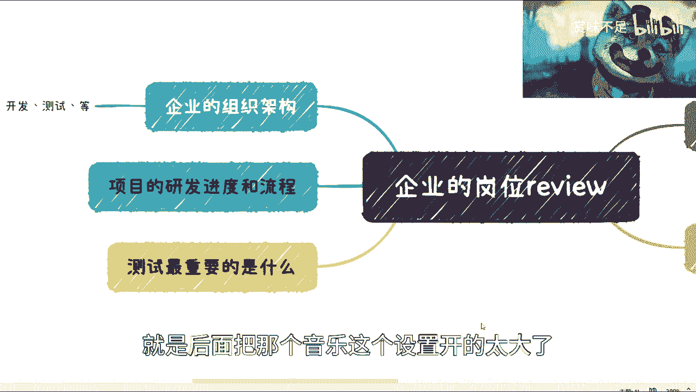

所以就是很多人听不没听清楚呃，我重新来说一下啊，就是说我们在面试的时候呢，它是一个呃相互平等的一个位置对吧，那么我们需要的是对企业有足够了解，但是呢同样的，就是说我们可以通过一些这个其他手段啊。

这个回头我应该我再开一期吧，好吧就回头就是我会再说一下，就通过一些互联网的手段去了解这个，写了一些背景啊，但是呢就是说最好的方式呢，还是在这个呃面试过程当中啊，经过一些提问的方式啊。

可以这个对企业有足够的了解。

那我觉得是什么呢，就是从这个测试啊。

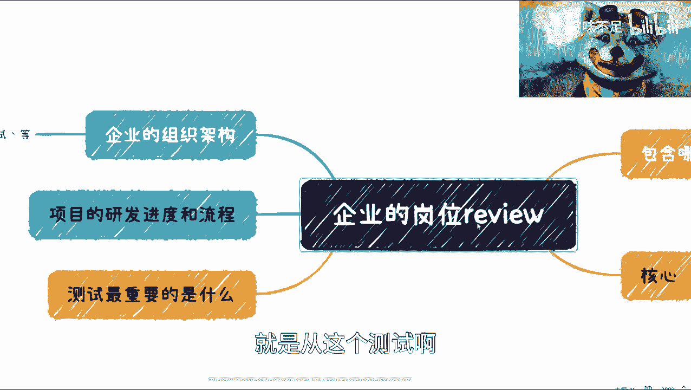

比如说从这个测试啊，开发角度，我们看看怎么来说啊，首先第一个呢就是说我们可以问对吧。

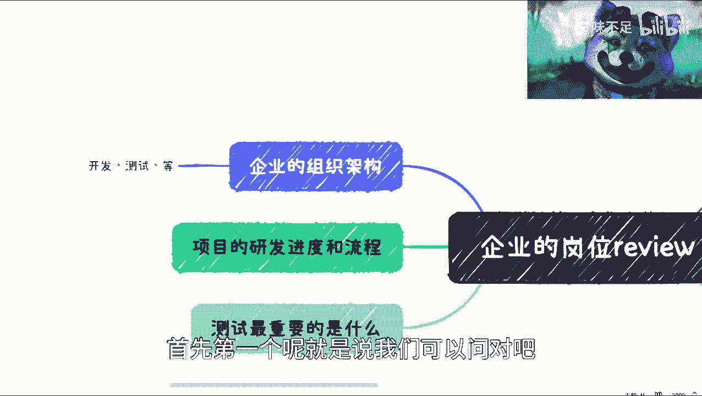

你这个组织架构，那组织架构呢首先它得有个倾斜组织架构，我不管你是这个扁平化的，还是说是比较这个多层级的对吧，那你跟我讲对吧，这个产品经理，项目经理啊，测试啊，开发啊怎么样等等等啊对吧，那有多少人啊对吧。

大概这个汇报关系啊对吧，那么面试你的这个人和你的汇报关系是什么，对吧等等等。

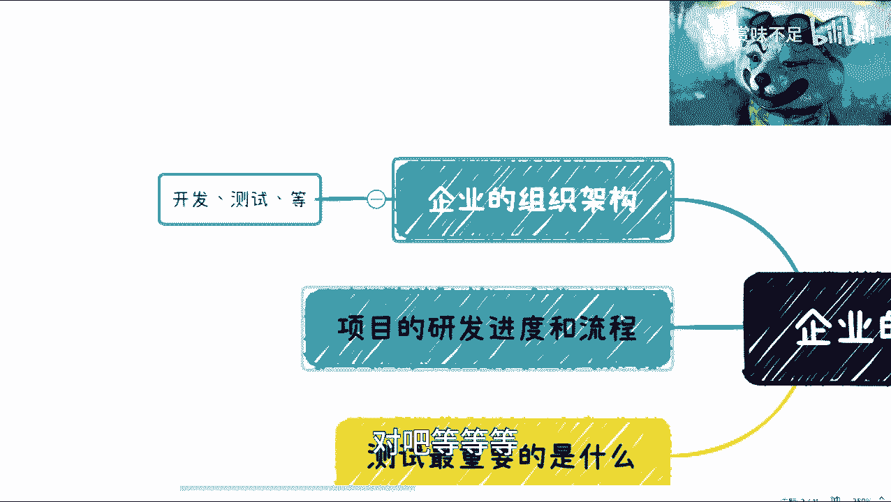

那么这些他得知道啊，那么第二点呢就是这个研发的研呃。

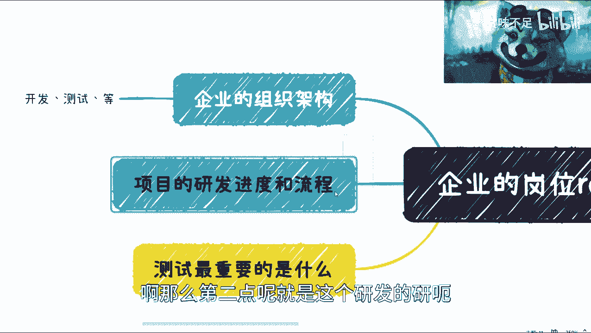

这个项目的研发进度跟流程，那比如说啊我们举个例子，比如说你这个企业里面小迭代大迭代对吧，那你小迭代多少时间迭代一次呢，大迭代多少时间迭代一次呢对吧，那小迭代可能是什么功能定义为小迭代，大功能。

什么大迭代，什么功能定义为大迭代对吧，那你在迭代过程当中，这个小迭代跟大迭代流程有什么区别呢对吧，那么这些其实反过来说，就是说我们得要呃这个让他去讲，然后从他的这个描述里面能看出来。

就是当下这个企业的一个一个成熟度对吧，当然我们不能说啊，你这个企业里面呃流程啊，进度啊就非常的完美，那也是不可能的是吗，那但是问题就在于就是说啊我们得要看，就是说啊我知道你不成熟。

但你不成熟，不成熟到什么地步对吧，那这第二点第三点呢就是说我们可以问他啊，就是问他什么呢，就是我这个岗位对吧，比如说我来面试这个这个这个，这个这个叫什么产品啊对吧，项目啊啊销售啊对吧，市场运营啊对吧。

那ok你去问他。

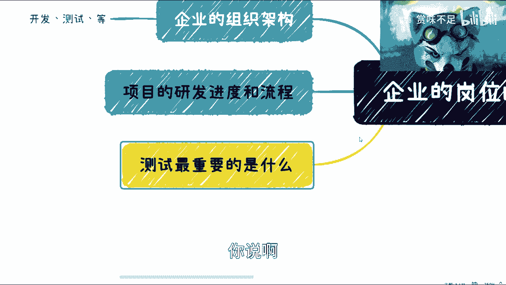

你说啊，比如说我们举个例子，比如说我的岗位什么是最重要的对吧，你可以问他对吧，他觉得哪个岗位啊，这个我应聘这个岗位什么是最重要的，第二怎么成长对吧，你问他，你说啊，比如说我现在要做运营对吧。

那你觉得运营里面应该怎么成长对吧，那你说我是一个面试，就是我是来应聘的，你是面试官对吧，那么呃虽然先不说这个谁好谁谁谁牛逼对吧，谁好谁坏，但是呢我也是有平等的权利，能够去知道你是怎么看待这岗位的对吧。

那怎么成长对吧，第三个就是说这个需要哪些技能，啊那或者说换过来讲，就是说你他是我们想要知道的是，他是怎么来判断，我在这个岗位上做得好不好的对吧，因为这才是最重要的，那我举个例子。

就比如说我是去做这个市场运营的对吧，那我可能说有这个数据的指标，或者我觉得啊这个打通哪些渠道对吧，或者怎么样子，那这个是我觉得很重要的对吧，那么你去问他，他也会跟你讲啊，这个哪些很重要的。

那么同样的就是说你如果能力ok，那你可能能够一眼一下子就判断出来，他是不是这个吹牛逼对吧，这是一个那或者他是不是忽悠你对吧，那这是一个，那另外一个就是说如果他讲的有道理对吧。

那么你也可以从中去获取一定的知识。

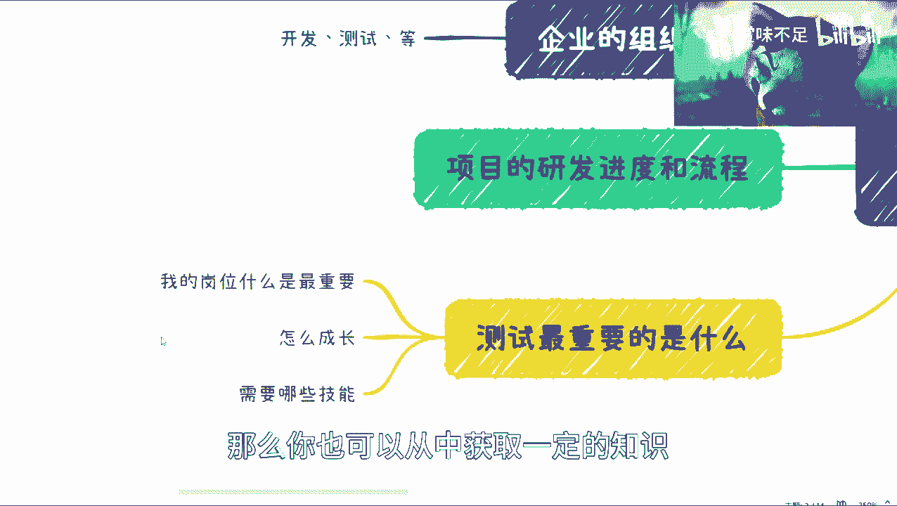

哪怕你面试不上对吧，你也是可以获取一定知识的是吧。

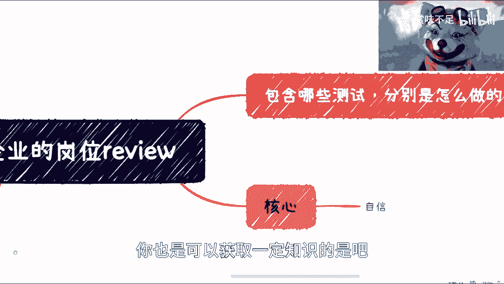

那么我们说同样的打个比方测试对吧，我们还要问什么呢，你这个测试的分类你们现在怎么分呢对吧，有哪些类型测试的这个时间点对吧，你其实运营产品也是一样的，你比如说产品对吧，那产品你们怎么分的呢。

有没有所谓的业务产品，然后技术产品呢或者架构产品架构呢对吧，那你比如说这个这个项目里面对吧，呃运营是什么时候做的，运营这边是怎么来判断这个运营的kpi的，怎么来判断这个运营的这个这个这个呃。

孰优孰劣对吧，那么最后你比如说怎么来怎么来，就像我们刚刚说你怎么来判断一个测试，做完了没有，怎么判断这个研发开发完了没有，怎么判断这个这个销售做的好不好，怎么判断这个运营做的好不好对啊。

就是说我们得要去知道他们里面的，一定的这个企业里面的规定。

对吧啊，那么我觉得这个一般来讲啊，就是一般来讲啊，我觉得我们这个问问题的时候呢，这个主要是关注主要是关注什么啊。

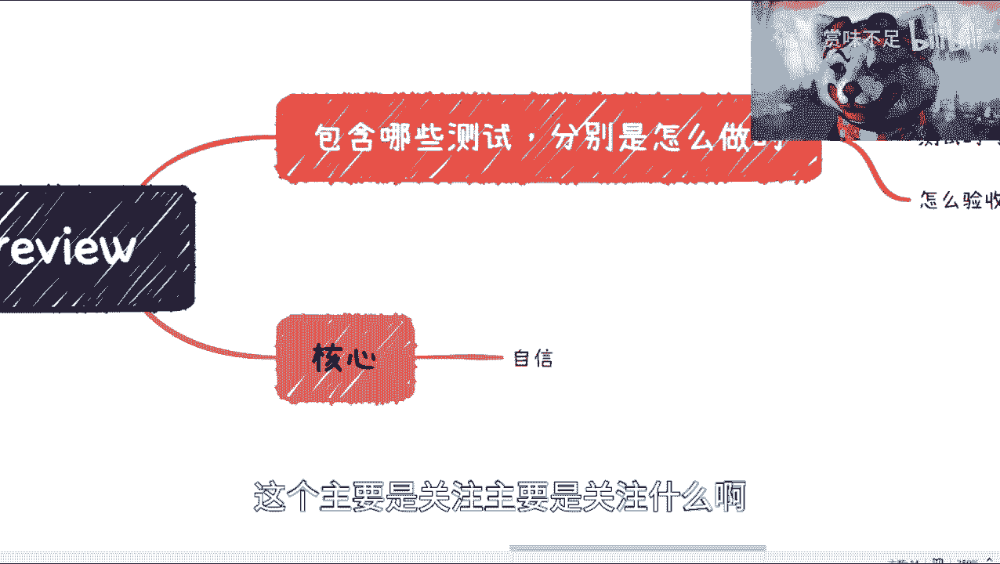

我们这么说主要是关注什么，首先第一个问题主要关注什么呢，就是说他得告诉你啊，他得告诉你就说好，咱们今天面试结束了，我的问题已经结束了对吧，那你有什么问题，对不对，因为我面所有的人我都会问这个问题。

为什么呢，因为这个是一个最基本的尊重对吧，你说如果在面试的时候，他都不尊重你，那你指望你进去说他尊重你们，那更不可能了，对不对，那好这是第一个就是尊重啊，第二个是什么呢，就是说你得去看他。

从他的这个回答当中来了解当下啊，这个企业的一个现状哦，因为为什么呢，因为不管怎么样，你比如说你今天只有一面也好，三面也好，这个人总归是这家企业的，并且这个人能来灭你。

就说明他一定是跟你有一个岗位有一定的关系，我不是说非常强的关系啊，那么你去问他这些问题，其实也就意味着，基本代表了你接下来进去之后，所面临的这个现状，那么我们说你进去之后，试用期。

这个试错成本肯定远远高于，你面试时候就了解他们的这个情况的这个成本，对不对，好，那么这个呢其实我们也是这个要去了解的，第三个呢就是看对方的啊，这叫做应变能力，因为其实面试时候他很多的时候。

他问题是随机的对吧，那当然他问你什么问题呢，他是知道的，他肯定准备过的，他他也知道答案，但是你问他的问题，他肯定是不知道的对吧，那么从他的这个应对能力里面，你能够看得出来，就这个人他是不是思考过对吧。

因为我们水平可能那个不行啊，就大部分人可能水平不行，但是对方能不能忽悠你，或者这个事情能不能忽悠你，我觉得大家还得擦擦眼睛啊，擦亮眼睛呢，就是说他很多时候是跟你绕圈子，就是开始呃。

就是这个你可以问他很直白的问题对吧，就开始他就开始跟你绕绕半天了，就不跟你说这个那个那个问题啊，这个问题的答案，然后呢我觉得就是大家一定要明白一点，就是说呃所有的这个这个这个面试啊，他都是平等的。

就是你是去找工作，对方是去找人对吧，我不管是人才的人还是工具人的人，这不重要对吧，大家都是相互找的，那么我也就是去面试的人，应聘者也应该有足够的这个叫做权力，或者说足够的这个立场去问对方问题。

从而去了解他，因为我们问问他问题，不是为了去为难他，而是为了去了解他，他问我们问题也是一样的道理，对不对，好，那么我觉得在这个对方的反应里面，其实大家一定要清晰的去判断啊，而且包括是什么呢。

还有些就是说呃那种面试官，就是说很高高在上的对吧，然后呢，就是很容易很很喜欢这种打断你的这个谈话，对话，对你讲到一半，他会打断你对吧，那我觉得其实都是一样的，就是说你面试的时候。

如果他对你就已经是这种不尊重的，或者来说他这种脾气比较暴躁啊对吧，比较急躁啊，比较这个浮躁啊等等等，那你基本上啊这个企业的现状，就是这个人的一个放大版啊，这是肯定的啊，没有办法的事情。

啊所以说呢我觉得就是说呃核心，我们这个面试的核心呢其实就是自信啊，就是说你不要跟别人沟通的时候，或者问问题的时候非常唯唯诺诺对吧，或者说声音很小或者怎么样，其实没有必要啊，没有必要。

因为人都是一个成长的过程对吧，你先你说我现在水平可能比较差或者比较低，那又怎么样呢，谁不是这么过来的呢对吧，那我觉得就是说只要大家有面试，大家就需要这种很自信的方式去问清楚啊，问清楚。

当然就是说呃我其实这个地方其实还得加一个。

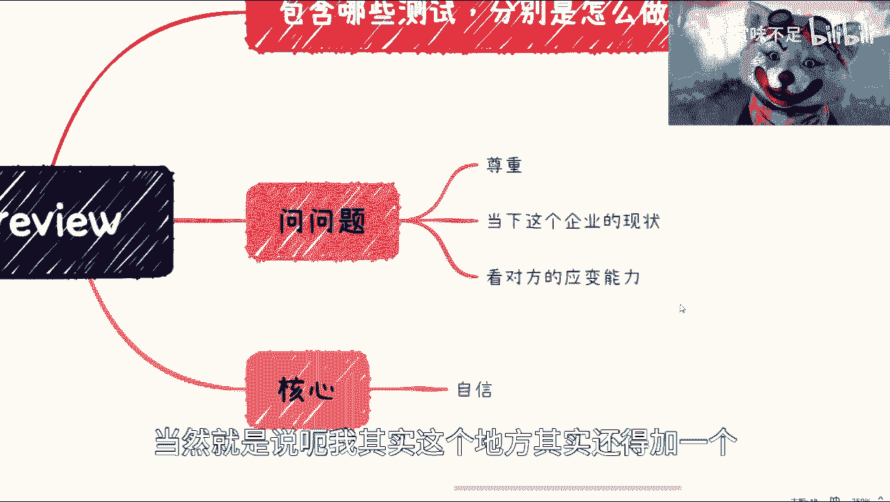

还得加一个，我看看时间啊啊对，还有家呀呀呀呀，顶不住了，还得加一个是什么呢，就是这个薪资结构啊，就是这个package的结构。

为什么呢，就是有很多人会觉得hr会跟你讲对，是会跟你讲，但是你得问，就是他讲的并不一定是全部哦，你一定得问啊，什么意思呢，就比如说你问他哎试用期多久啊对吧，你这pk觉得这个结算周期是怎么样的。

是不是按月每个月都发的，还是每个月打折啊，但怎么样啊，因为这种里面坑很多很多，有很多人都是那种比如说package 300000对吧，package，然后呢等你签合同了，你就会发现哦，好像这个30万呢。

可能是比如说你呃这个要待满1年对吧，他给你全部的，但不满，那么可能就给你个六折七折对吧，因为这种事情呢其实都是消耗，那当然你也可以说你那个那个写合同的时候呢，你说我看到这一条我不写，我不签，要是可以。

但是你这当中时间消耗就很大对吧，你何必呢，就相当于哦我我我浪费了一个月对吧，谈了一个offer，然后这offer呢就是谈的时候蛮开心的，到最后签的时候发现跟谈的时候不一样，那你又没法去挑战他，为什么。

因为是你自己没问清楚对吧，你不能怪他没有讲清楚，他没有讲清楚，是他的事情，对不对。

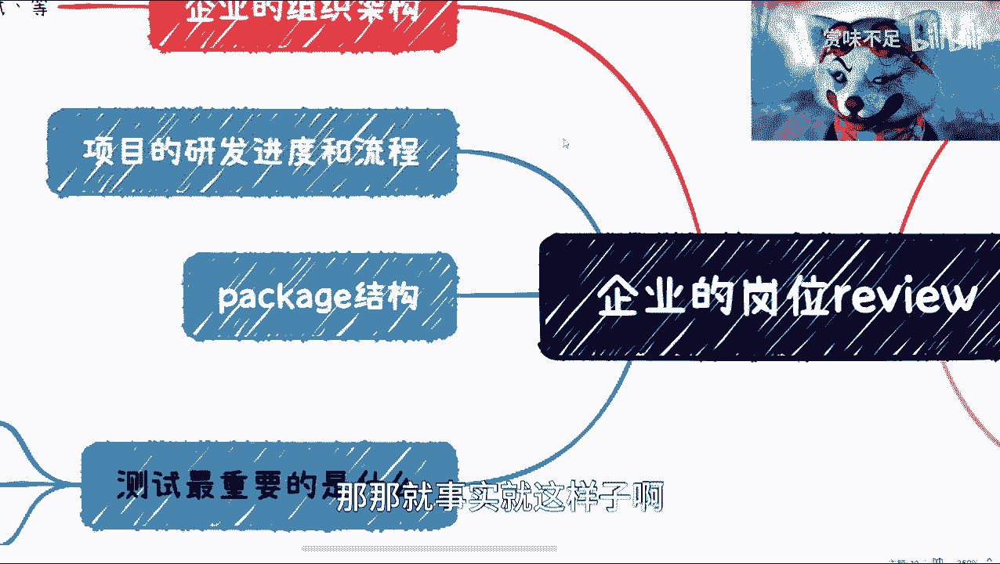

那那就事实就这样子啊，所以就是说我觉得我们去review一个岗位的时候呢，就是呃除了一些表面上的，就回头我再开一期啊，就是说啊比如说从这个jd啊对吧，从其他各个方面啊，怎么去这个审视他，除了这个以外。

就是面试过程当中去问对方也是非常重要的，好吧，那个感谢那个网友的这个私信啊，因为我去对吧好吧。

那我就重新录一个好吧。