# 面试技巧课程 P1：如何通过提问深入了解企业 🧐

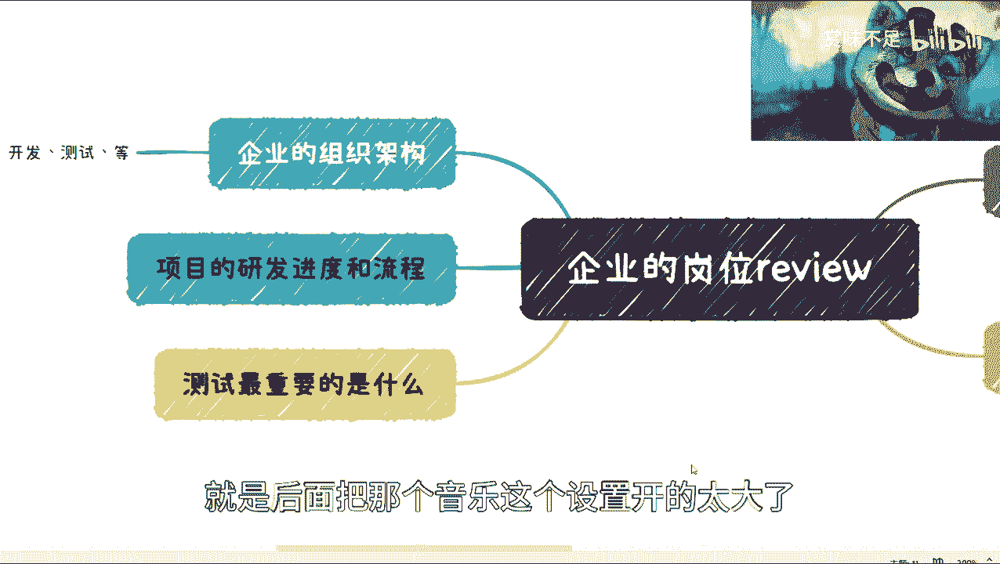

在本节课中，我们将学习如何在面试环节中，通过向面试官提出有效的问题，来全面评估一家企业的实际情况。面试是一个双向选择的过程，提问不仅能帮助你获取关键信息，也是判断企业文化和团队氛围的重要方式。

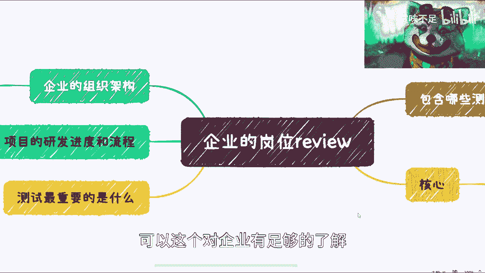

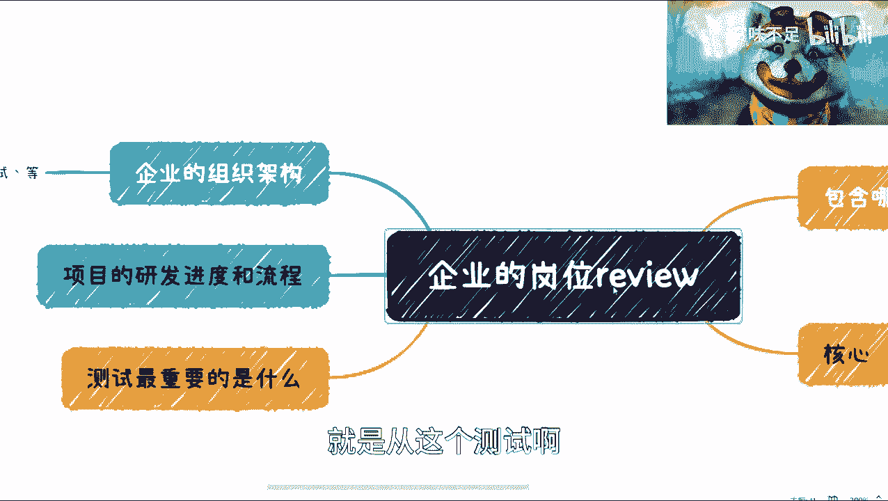

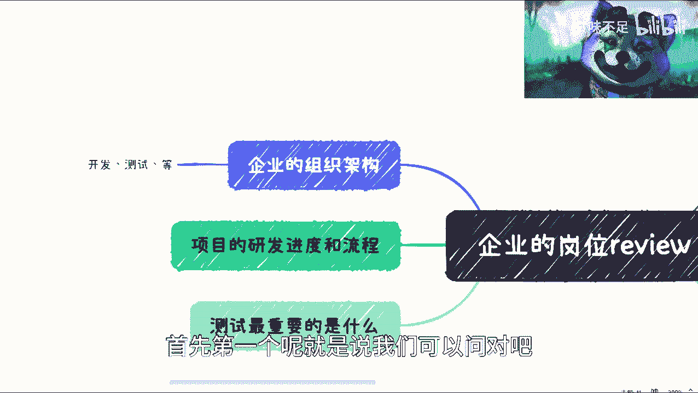

上一节我们介绍了面试是双向平等的沟通，本节中我们来看看具体应该从哪些方面提问。

## 一、 询问组织架构 🏢

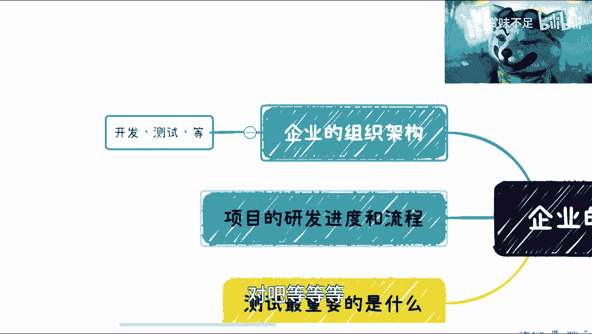

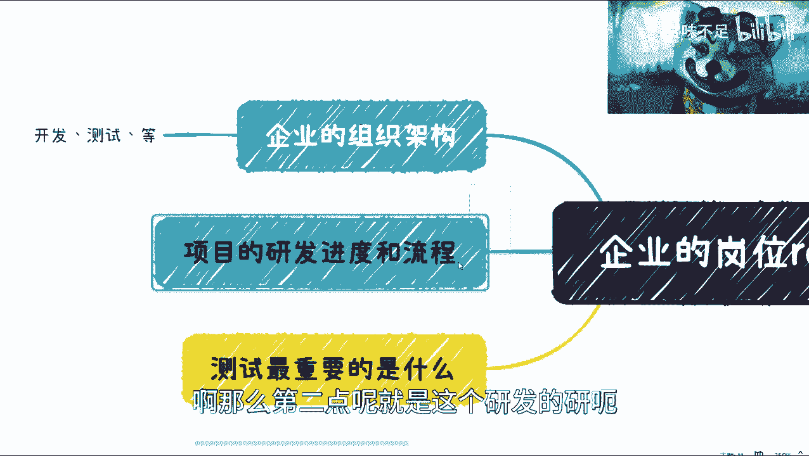

首先，你需要了解团队的组织架构。无论企业采用扁平化管理还是多层级的结构，清晰的汇报关系和工作协作模式都至关重要。

以下是关于组织架构可以提问的具体方向：
*   团队的具体构成：例如，产品经理、项目经理、测试、开发等角色如何配置，各有多少人。
*   汇报关系：明确你未来的直接上级是谁，面试官与你未来的汇报关系是什么。

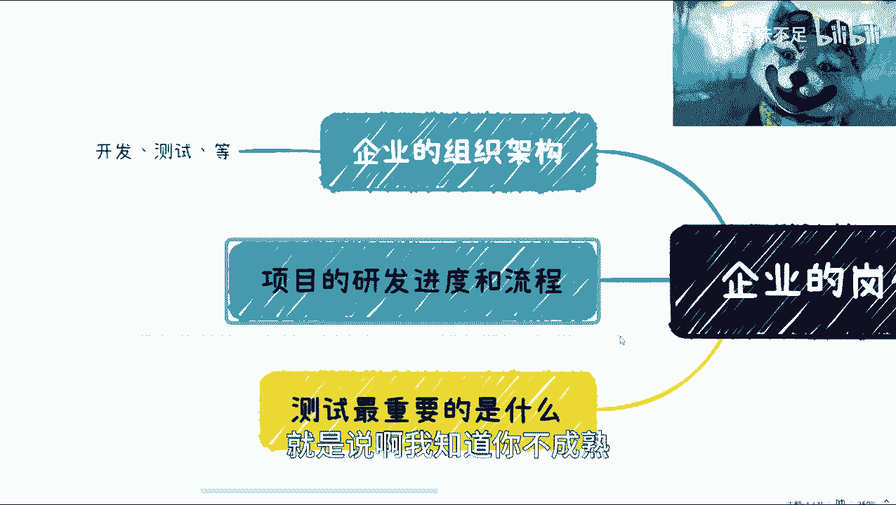

## 二、 了解研发流程与进度 📅

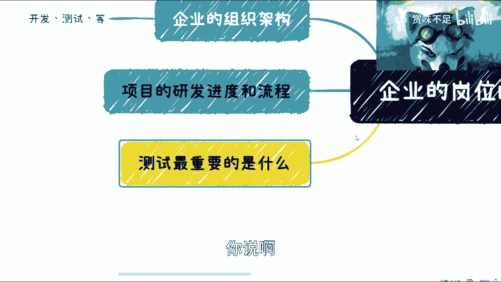

其次，需要探明企业的项目研发流程与进度管理方式。这能反映企业的项目管理成熟度。

以下是关于研发流程可以提问的具体方向：
*   迭代周期：询问小迭代和大迭代的周期分别是多长。
*   功能定义：了解什么样的功能被定义为小迭代，什么样的功能属于大迭代。
*   流程差异：了解小迭代和大迭代在具体流程上有何区别。

通过面试官对这些问题的描述，你可以判断企业当前流程的规范性与成熟度。

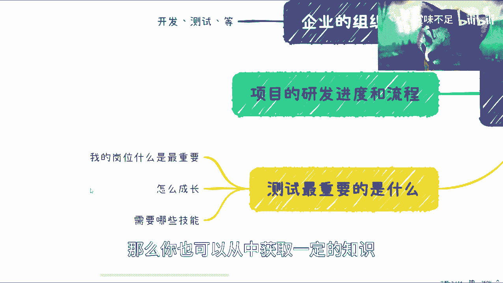

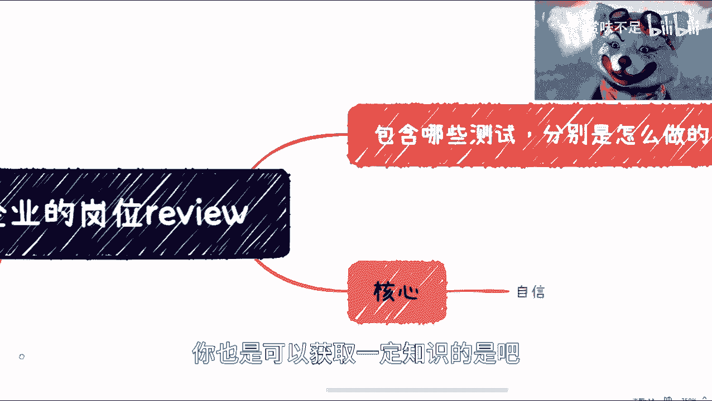

## 三、 探究岗位的具体要求与成长路径 🎯

接下来，针对你应聘的岗位进行深入提问。了解面试官（通常是未来的同事或上级）如何看待这个岗位，对你判断工作重心和未来发展至关重要。

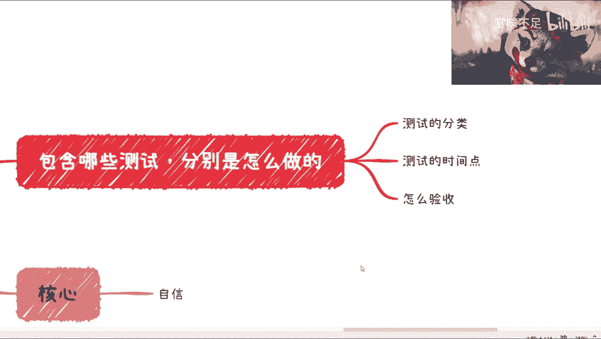

以下是关于岗位认知可以提问的具体方向：
*   岗位核心：询问“您认为这个岗位最重要的职责或价值是什么？”
*   成长路径：提问“在这个岗位上，您认为最佳的成长路径是怎样的？”
*   评估标准：了解“公司如何评估这个岗位的工作成果？需要哪些关键技能？”

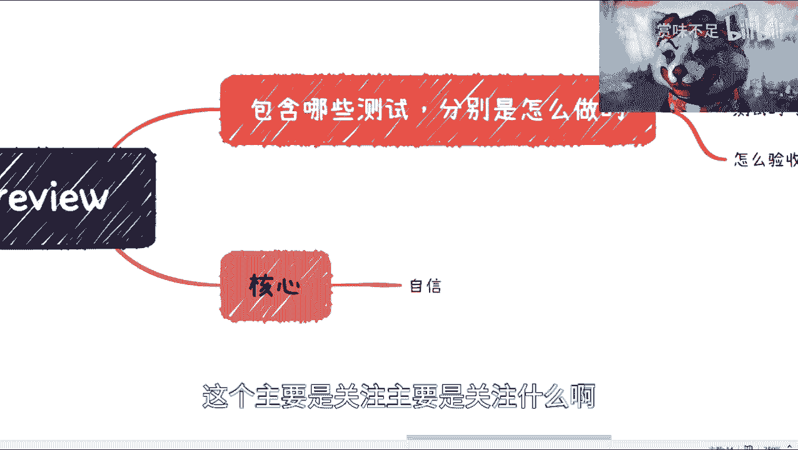

提出这些问题，一方面可以判断面试官是否在“画大饼”，另一方面即使面试未通过，你也能从中获得有价值的行业认知。

同理，对于其他岗位（如测试、产品、运营），你也可以询问类似的具体划分、工作节点和绩效评估方式。

## 四、 提问的三大核心关注点 🔍

在面试官让你提问的环节，你的问题应聚焦于以下三点：

以下是提问时需要关注的三个核心方面：
*   **获取尊重**：面试官主动询问“你还有什么问题吗？”是基本的尊重。如果连面试时都无法获得尊重，入职后的情况更不容乐观。
*   **了解现状**：面试官的回答基本代表了你入职后将面对的现实。在面试时了解情况的成本，远低于入职后试错的成本。
*   **考察对方**：通过提出对方未准备的问题，观察其应变能力和思考深度，判断其是否真诚，能否清晰、直接地回答问题。

面试是平等的双向选择。应聘者完全有权利通过提问来了解企业。如果面试官表现出高高在上、频繁打断、急躁或不尊重等态度，这通常是团队或企业文化的缩影。

**核心态度是自信**。无论资历深浅，都应自信、清晰地进行沟通和提问。

## 五、 务必厘清的薪资结构 💰

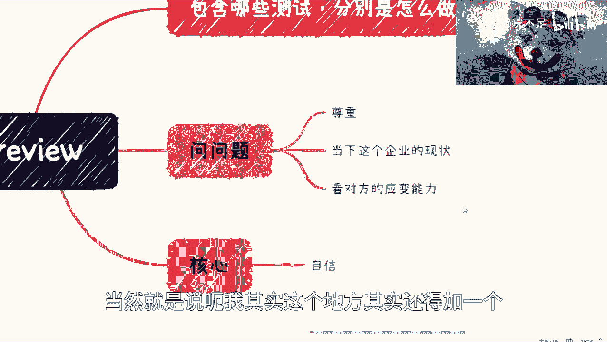

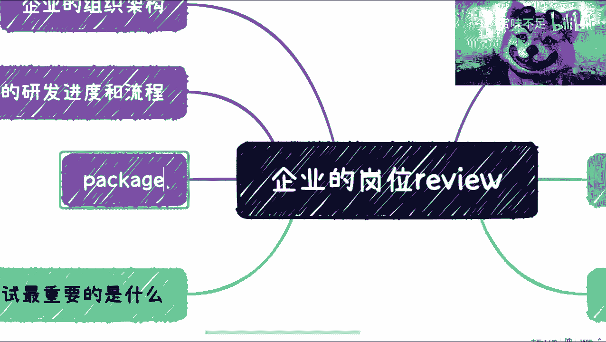

最后，必须明确询问薪资待遇的具体结构。很多潜在问题都隐藏在这里。

以下是关于薪资结构必须厘清的具体事项：
*   **试用期**：试用期时长及期间的薪资比例。
*   **发放方式**：薪资是每月足额发放，还是存在折扣或与绩效强挂钩。
*   **构成细节**：所谓的“打包价”（Package）是否包含年终奖，发放是否有附加条件（如需工作满一年）。

务必在面试环节主动问清所有细节，避免在收到Offer后才发现与口头约定不符，造成时间和机会的损失。

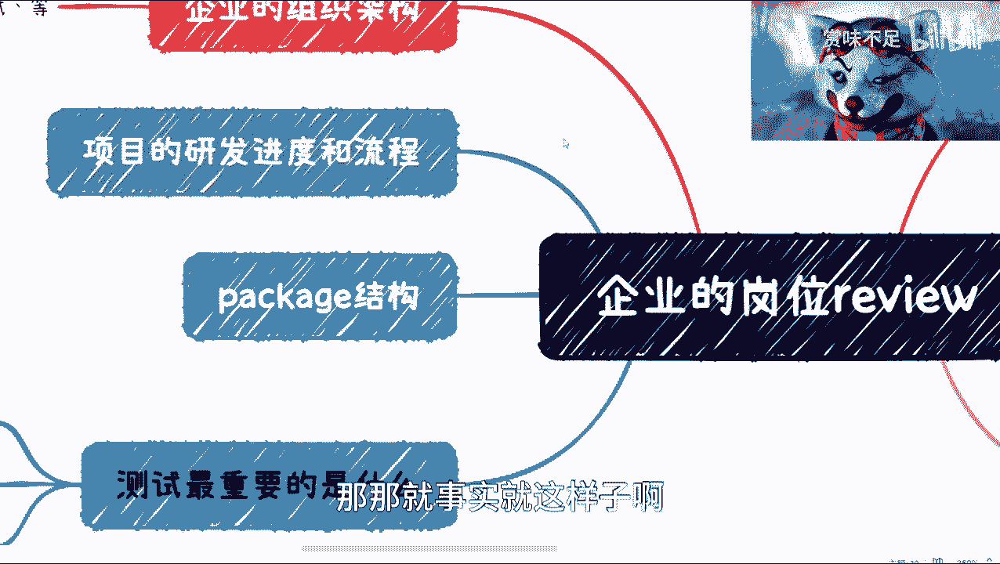

---

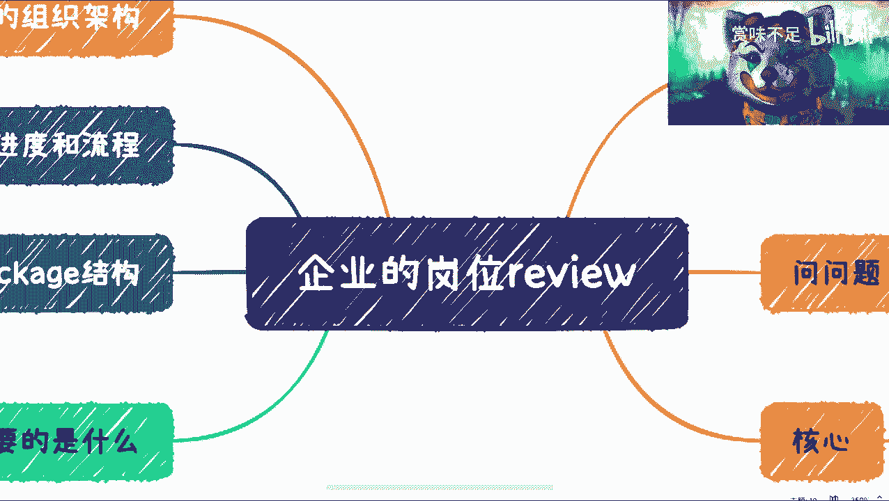

本节课中我们一起学习了在面试中通过五个维度的提问来深入了解企业：**组织架构**、**研发流程**、**岗位认知**、**提问策略**以及**薪资结构**。掌握这些提问技巧，能帮助你在面试中变被动为主动，做出更明智的职业选择。