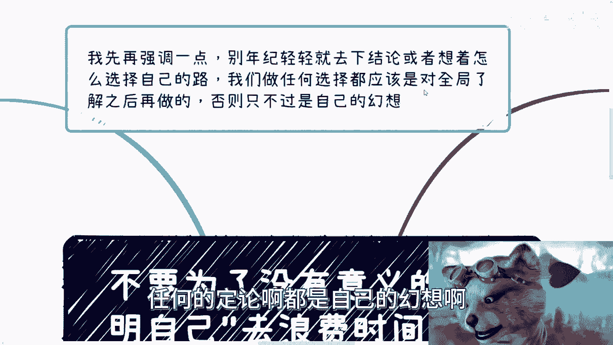
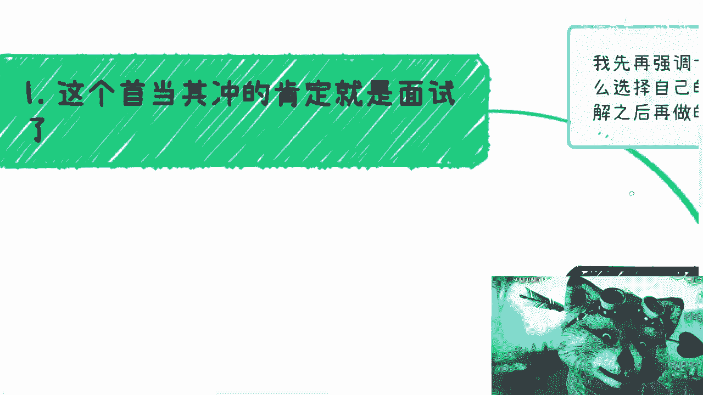
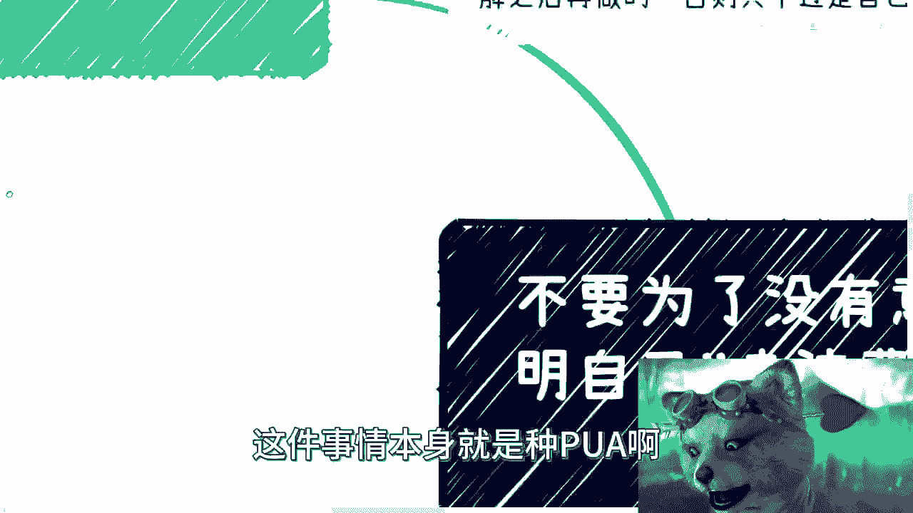
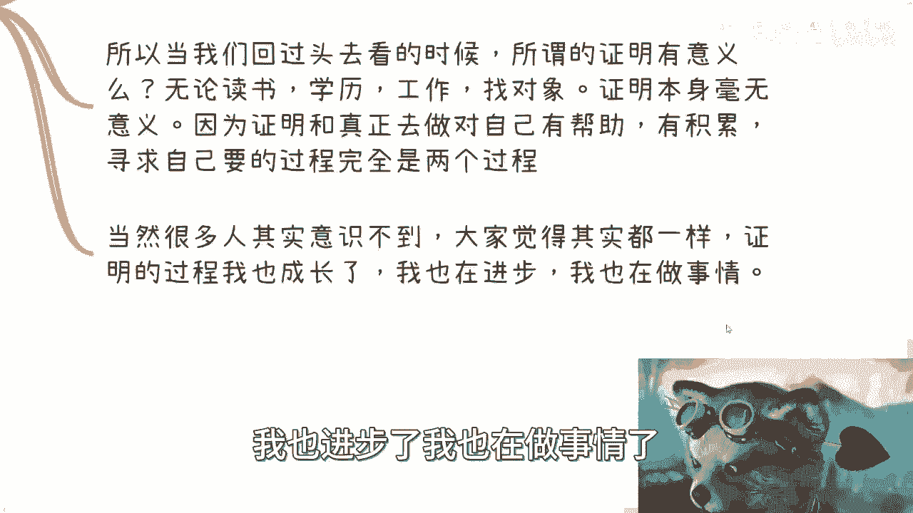
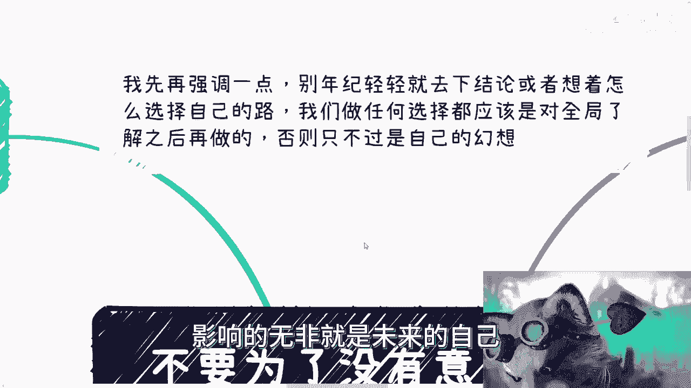

# 面试考研工作，为了所谓的”证明“，却浪费了真正有价值的时间和机会 - P1 - 赏味不足 - BV1Eu4y1B7E7

啊大家好啊，这个昨天因为都忙了一天了，我给大家来补个档啊，今天呢我们来讲个啊非常严肃的问题是吧，很简单，就是我发现很多人啊他没有明白一件事情，就是大部分人做事情呢其实是在为了证明自己。

而不是为了去做一件事情，那么你会发现呢，证明自己呢其实也就是说自己是个标品啊，虽然我相信很多人有抱负啊，很多人也有很多的想法啊，很多人觉得自己与众不同，但是啊非常可惜的是，大部分的人被学校被老师啊。

被家长，被家庭，被这个社会所PUA出来的这个思想啊，那么到目前为止啊，可能还是表皮，首先第一点啊，我先强调一点，别人年纪轻轻就去下结论啊，想着怎么选自己的路，或者变成什么样的人没有意义，为什么。

因为我觉得大家需要先对全局有了解，哎呀道德是怎么样子，哎呀商业是怎么样子，哎呀这个怎么样子，你别来跟我讲什么样子对吧，你们有本事先去了解啊，先去把整个啊一线到五线城市上上下下，左左右右对吧。

三教九流先去了解之后，你再来评价什么叫道德啊，你讲的道理没有用，因为你左右不了这个世界，我也左右不了所有时间，所以说我只是在告诉你们啊，本质是什么样子的啊，那么是不是相信取决于你们自己。

但是你们别轻易去下这个结论没有意义，你知道吗，哦那么在你们真正了解全局之前，我跟你们讲啊，对自己做任何的定论啊，都是自己的幻想啊。

因为我们都不了解全局，你下什么定论，没什么好下的，对吧好。

那么首先啊根据今天这个主题啊，首当其冲的就是面试。

为什么啊，首先面试面试这件事情就非常的扯啊，非常非常的扯，就是他本身其实是个演员加气场加运气，加你的知识储备，加你的穿搭，家里的风格加各种各样东西的一个综合体，他并不是一个真正来评价你这个人的。

这么一个东西，但是你会发现非常可悲的是什么啊，我们待会儿来讲，首先因为时间很短啊，也就是说考察的知识点啊，你说这个考察知识点，是否一定能代表我的能力吗，可能吗，不可能对吧。

更何况很多企业莫名其妙考察的是些什么啊，这个这个这个智力体验对吧，什么乱七八糟，有的没的对吧，就没有任何意义，对吧，那这是第一个，那么你说这些知识点考研了，能代表我个人能力吗。

不能那这个知识点并且一定能在工作上用到吗，那更不一定了对吧，你们自己想想看对吧，不管是技术岗还是什么岗位，你妈的真面试的时候跟你们真正进去对吧，就面试我造航天火箭，我进去拧螺丝不就这样吗，对不对啊。

其实呢我跟你们讲，这也是潜移默化啊，被PUA的结果，就说说白了我来面试，你公司招我是什么一个，这个大家双方诉求是什么，不就是我能不能干活嘛，对不对，那我能不能干活，这件事情是由这件事情来决定的。

而不是通过一两个人来面试来决定的，你明白吗，对吧哦，你一两个人来面试，你就来决定我能不能做这个事情，这个逻辑就不通啊对吧，当然你说面试现在这套规则就这么定，这套规则本身这样子有没有问题没有问题。

但问题是很多人面试没有过，他会因为这件事情去否定自己啊对吧，你就会觉得哦我根本就还没有做这件事情，我也没有真正的去在这个工作岗位上做过，对吧，哦我就开始因为面试在否定我，同时你也因为面试来否定我。

这就非常可笑啊对吧，所以说你们怎么说呢，就是很多人每天都在面试，每天有这么几千万人，几亿人在那边面试，有多少人反思过这件事情有吗，没有对吧好，那么这就是一个很有趣的现象，也就是说比如说啊。

包括就是说很还有个很有趣的现象是什么呢，就是公司晋升，你们但凡在大公司呆广啊，你们就会发现一个很有趣的现象是什么呢，就是在公司里面晋升啊，尤其是技术岗要晋升多一些，比如说管理岗位职责。

那这个时候他会先让你做一些尝试性的啊，叫做岗位管理岗的工作啊，叫做美名其曰叫什么呢，叫叫做我们先看看你有没有这个管理的sense啊，有没有这个management对吧，然后再来做精神答辩，哎那我跟你讲。

这就很奇怪了对吧，那为什么我在公司里面啊，我要去晋升了，你反而是要看我能力倒不大啊，那么答辩这件事情反而变成了形式呢，哎我就觉得奇了怪了对吧，那所以说我觉得任何一个有逻辑的成年人啊，做任何一件事情。

他都应该懂一个道理，诶我打错了啊，不用管它，就是你要证明就是证明你别逼逼对吧，但是面试不同，就是面试就是靠你逼逼来证明的，你发现了对吧，也就是说你今天要让我证明对吧，比如说我呃这个你有没有什么能力对吧。

或者你能不能做到什么东西，你以前做过什么东西没问题对吧，那我就证明你别跟我逼逼，那这这啊比如说我们今天再做个商业对吧，你跟我说哎吕老师，我们能不能合作，能啊，你合作呗，我给你两个月，我先看落地啊对吧。

这合作不是说我们两个在那边开会，然后逼逼半天看能不能合作，没有用的呀对吧，但是面试你会发现不同，面试靠的就是你逼逼对吧，所以我跟你讲，这是一个非常反常理的一个东西啊，你别来跟我说。

哎这个程序员面试也写代码的，写代码能证明你的能力吗，我就问能吗，啊半个小时一个小时写，你能证明你的能力吗，不能好吗对吧，而且这个东西更何况对吧，你更多的还得看这个人出的题目是什么。

他出的到时候就是八竿子打不到边的，你告诉我证明什么能力啊，证明你们会扯淡的能力对吧。

所以我跟你讲这件事情本身就是一种PUA啊。

当然就像我说的，我们没有能力制定这个规则，那么我们可以，或者说我们就是不用去抱怨这件事情，但是同样的我希望大家能明白，你不要因为这个事情去否定你自己，因为这个事情本来就不合理，就不合。

就就非常的不符合常理，你知道吗对吧，所以说这就像什么，这就像我告诉你们任何一件事情对吧，打不过我们可以加入，这没问题，但是我们得要有能力去判断，这里面哪些事情是对的，哪些事情是不对的。

不要无脑的去否定自己，不要无脑的否定别人，不要无脑的去PUA自己，你明白吗啊，那么这是第一个，第二个对吧，第二个说什么啊，就比如说啊我一直说让大家去做商业行为啊，那么比如说问题来了啊，按照这个逻辑。

那我是不是说先要证明我有做商业的这个能力，那么又问题来了，我怎么证明呢，是靠逼逼吗，那肯定不是啊。

对吗啊，舅舅好像今天早上还有个很有趣的私信，你知道吗，就跟我说哎吕老师，我们现在在做这个东西对吧，但这个东西没有任何合同约束，也没有任何的都什么东西都是口头约定，口头约定，那你跟我讲什么东西啊。

那我还跟你们口头约定来了，妈妈我从明天开始，每个人打100万，我随便扯回来，你能把我怎么样，对不对，就我觉得很神奇，你知道吗，就是很多人虽然是个成年人，但是他好毫无成年人的思维。

就他的思维还不如一个十岁的小朋友啊，非常的神奇，包括昨天还有一个，你知道吗，还有个硕士要跟我说，我每个月投20万啊，我能够拿到多少多少钱，然后我还努力的想去劝他啊，然后反而他还努力的想要说服我。

我跟你讲，真的要不是看在这个人以前是咨询过我的份上，我他妈早就拉黑了对吧，就真的叫什么叫做我我所以我还是那句话，你知道吗，就是什么叫普通人，普通人就是当你跟他说真话的时候，他不愿意相信。

当你在割他韭菜的时候，他还有跟你说谢谢哦，哼对吧好，那比如你今天要去组织一场活动啊，最好的方式是什么，就是直接去干，直接去办啊，而不是来跟我提一个方案啊，或者给我写一个东西来告诉我，吕老师。

我他妈能办一场活动，有屁用啊啊，对吧好，那么问题来了啊，有的小伙伴觉得其实去做了，就是去也是去证明的一种哈，我跟你讲，其实不是为什么，因为基本盘受到的教育，你会发现一旦他认为这是证明的一个时候啊。

他会通过非常多的理论知识去说服你，或者通过一些旁门左道的方式，去达到这个效果啊，这就好像我们今天要做，要说举办一个盈利活动，那么如果要证明很简单，按照我国老百姓的套路，活动现场的人可以找托对吧。

盈利这件事情更简单了，你可以自己贴钱，甚至可以造假，这就叫证明，这不叫干活，这不叫做事情。

这也不叫商业，你懂吗啊，那么真正的商业行为是什么，你不是要做给别人看的，是真的要去赚钱了对吧，我不说多赢，至少你要跟合作方是赢的，你明白吗，好那这个时候又有很多人说了，他说吕老师，你不是教我们要包装吗。

对吧，你不是叫我们要要要要这个叫什么对吧，这个叫什么，就是呃忽悠嘛对吧，要画饼嘛对吧，是你们要明白啊，包装跟忽悠还有画饼的对象是谁啊，我就一句话啊，如果今天你们包装忽悠画饼的对象是我。

那就说明我跟你不是商业伙伴，我是你的韭菜，那就别怪我心狠手辣，你们明白这个道理吧，啊做事情我可你们可以不道德，你们给也可以认同，可以就是说啊让割别人韭菜，你也可以让别人亏钱没问题，但是你要记住你跟我。

还有你跟别人，你跟每一个人，大家的角色是什么啊，你要是要去坑你的合作伙伴，那我跟你讲，你以后是没有路走的啊，就这句话你们自己去想想看啊，好吧。

第三点啊，不知道大家有没有发现，很多人潜移默化被PUA出来，结果就是什么事情，潜意识都已经不是为了做一件事情，潜意识都是为了证明这件事情，而他们根本自己分不清楚，这就是非常可怜更可悲的啊。

我们来往下看啊，因为当你为了证明你自己的时候，不管你做什么，其实你的目的都是证明你自己，不是做一件事情啊，但是你有没有想过，你证明出来的结果是不是对的呢，对吧，你怎么判断证明出来的结果是对的。

你怎么判断证明这件事情的过程，对你是有帮助的，认同你，另外你证明给谁看对吧，谁真的关心你的这个证明，这就好像很多人说啊，我他妈就要考研，我就要读博，我就要干嘛，我请问你证明给谁看。

你证明出来的事情对你有意义，对吧啊，有很多人还跟我说说什么，说哎呀，研究生出来工作一定比本科好找，博士出来一定比研究生好找我，请问你是有数据依据呢，啊有数据支撑呢，还是你已经经过了这个人生呢。

还是你已经有足够多的阅历呢，都没有，你是怎么得出这种理论的，PAYYE赢，莫名其妙对吧，所以啊当我们回过头去看的时候，所谓证明有意义吗，无论读书学历，工作找对象，证明本身这件事情都是没有意义的。

因为证明这件事情我读书读得多牛逼，我学历多高，我工作做得多好对吧，我他妈人家不加班，我加班，人家他妈的生病去看医生，我不去，我就证明我牛逼对吧，我能找到对象啊，我不择手段，我就想办法去找对吧。

我能找到富婆又怎么样呢，终究无非就是昙花一现，竹篮打水一场空，没有意义的，你知道吗，就是你会发现很多人的事情，很多人去做事情，是为了证明他不是为了做事情啊，证明跟你真正去做一件对自己有帮助，有积累啊。

需求自己要做的这个事情的过程，完全是两回事情，但是能有几个人能明白这件事情的对吧，那当然很多人其实意识不到，你知道吗，大家觉得其实都一样，证明的过程我也成长了，我也进步了，我也在做事情了对吧。

那我跟你讲，你只能靠个人开悟了对吧，劝是劝不动了啊。

最后一点啊，只有去做了，你才能评估你自己是不是合适的，证明这件事情只能代表着你自己是个标品啊。

好什么是标品，我曾经说过这个概念，我再提一点，什么是标品，标品就是你只知道读书，只知道读考研，只知道卷学历，只知道别人说rain，你就认知道别人说出国就出国，只知道别人说，你要是不开心，你要是觉得不好。

你就滚，你就滚，对不对，那你就是个标品，为什么，因为你不知道你要做什么对吧，你所有的事情都只知道这件事情本身，我为了证明唉，我认了我牛逼，然后呢，So what，对吧，做事情啊，没有任何的商业逻辑。

不知道社会运作的规律，不知道商业运作的逻辑，不知道高效协会乃至政府的运作方式，那么你就是个标品很简单，因为你的可替换性不是很强，你就可替换百分之百可替换，打工就是最常见的标品对吧。

说白了任何事情你只要是为了证明，那么大家得出的结论就是我达到了某个label，比如说我考上了某个学校，比如说我去了某个大公司，比如说我可以经济独立了，比如说我离家出走了，比如说我他妈润了对吧。

但又怎么样呢，能做到这些，能做到这件事情能达到这个level，能证明这件事情的人少吗，是只有你一个人吗，还是说还是说全中国就那么就那么几百个人，这说白了还是有很多，你还是个标品啊对吧。

但做事情就不一样啊，任何一件事情只要去做了，每个人都会有差异化，你知道吗，你就算今天我跟你们都开滴滴了对吧，我们每个人开的模式也不同，这是真正的评估，你评估了之后，你才能知道你合不合适，你知道吗啊。

所以说啊回到我们的这个开头。

就说我这个叫什么，就是回归到我们的开头，就是再强调一遍，我们做任何一件事情，你给你自己下定义，你给你自己觉得你适合做什么事情，但前提是你得都去做过一遍对吧，包括你别来跟我谈道德。

道不道德不是我们定的算的，你先去整个一线五线城市商业走一遍，你再来跟我谈道不道德啊，包括你要先去跟政府都合作一遍，你去看看政府的回款率，你去看看国企央企的回款率，再来跟我讲企业合作好。

还是to c合作好，还是做咨询培训啊，还是to那些叫什么，就是政府企业合作好对吧，还是做供应商好对吧，包括是什么，包括就是说啊，你说这个这个叫什么，就是啊除了问我啊，除了工作啊，除了卷学历。

还有什么别的路，有没有别的路，你去找啊，啊难道这个社会从开始到现在，大家所有的人啊，中国14亿人，每个人都是读书考研考研卷，学历卷工作往死里卷，卷到后面被被淘优化掉，淘汰掉，都这个路吗，有吗。

不是吧啊还还是说除了这个路以外，都是创业也没有吧，对吧哦包括你们很多人都在想说，哎我要做自媒体，我要干嘛干嘛，我要干嘛干嘛，没有用的，你知道吗啊，所有的东西你先去了解好。

你先去把全局的东西尽可能地了解好，你要做自媒体对吧，可以的对吧，你去义乌，去杭州，去其他地方，你了解一遍吗对吧，你先找100个人看看人家做自媒体怎么做的，一年赚几个钱对吧，你别说做过嗯嗯别任何事情。

你没有自己任何的调研，没有任何的了解，也没有跟真正做过人去了解，就一拍脑袋说好，我要做这玩意儿或者好，我觉得这个东西适合我，一切都是PV，人生真正啊你的肉体，你的精神能够支持你的，也就是那么六七十年。

说少可能还说多了啊，四五十年对吧，很多时候不是你做不懂，是你心有余力不足，你知道吗，就是很就反过来说啊，很多时候不是你做不动，是你的这个思维，你的心情啊，你的心心力，你知道吧，包括你的认知其实过于狭隘。

不过于的就是狭窄，而导致你觉得没有任何的路，然后每天在面内耗一耗，耗到30多，40多40多，你反而又会再会觉得哎呀，我好像也没有这个心死了对吧，我也没这个能力了，或者怎么样子。

就很说到底很多事情敌人不在外界，都是我们自己对吧，包括很多人评论区的非要跟我来杠啊，非要怎么样子，你们想想看，回退1万步来讲，跟我杠有意义了，对不对，就我所有的出发点，都是希望能有多一个人能明白。

那就是最好的这些人跟我杠，对我没有任何影响，影响的无非就是未来的自己。

好吧嗯先这么多吧，啊这个大家因为我也知道啊，就很多都是18~22岁的这个小朋友啊，呃反正你们不管你们未来就是怎么想的，包括你们现在有没有自己的想法，不过我也不管你们到时候以后是卷学历，还有卷商业好吧。

你们但凡有任何的想法，职业规划或者别的东西，你们觉得你们手上牌不知道怎么打的啊，可以想排列组合打的，你们来跟我讲好吧，整理好你们的问题，整理好你们的背景啊。

