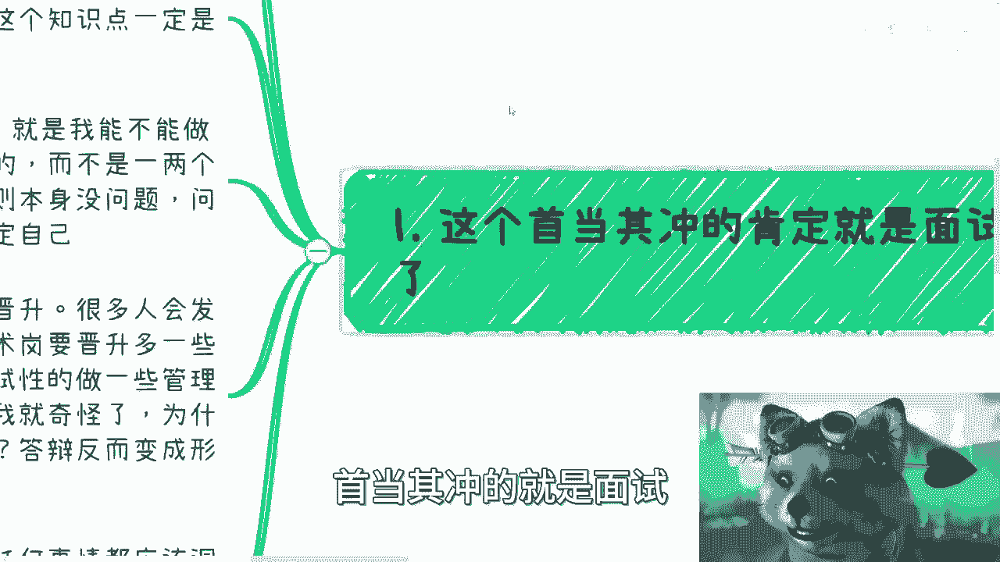
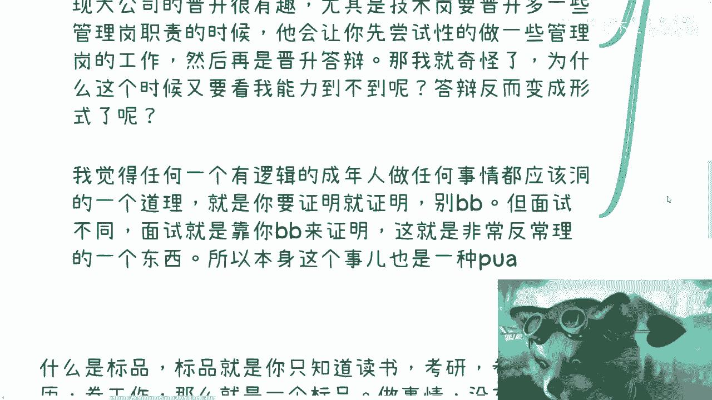

# 课程01：从“证明自己”到“做成事情”的思维转变 🧠

在本节课中，我们将探讨一个普遍存在却常被忽视的思维陷阱：许多人做事的核心动机是为了“证明自己”，而非真正地“做成事情”。我们将分析这种思维在面试、考研、工作等场景中的具体表现，并探讨其背后的不合理性，最终引导大家将注意力转向更有价值的行动本身。

---

## 全局认知：避免过早下结论

上一节我们介绍了本课程的核心议题，本节中我们来看看一个重要的前提：在了解全局之前，不要轻易对自己或世界下结论。

很多人年纪轻轻就急于为自己的人生下结论、选择道路或定义自己，这没有意义。因为在不了解全局的情况下，任何定论都只是幻想。

以下是几个关键点：
*   道德、商业、社会的真实面貌，需要你亲自去一线到五线城市、接触三教九流之后才能真正了解。
*   你讲的道理没有用，因为你左右不了这个世界。
*   在真正了解全局之前，对自己做的任何定论，都是自己的幻想。

因为我们都不了解全局，所以没什么好下定论的。

---

## 面试的悖论：为何“证明”不合理

上一节我们强调了全局认知的重要性，本节中我们来看看“证明自己”思维在面试中的具体体现。

面试本身是一个非常复杂的综合体，它考察演员般的表现力、个人气场、运气、知识储备、穿搭等多种因素，并非一个真正评价个人能力的有效工具。

以下是面试作为“证明”手段的几个不合理之处：
*   **时间短，考察片面**：短时间内考察的知识点，并不能代表个人的综合能力。
*   **考察内容与实际脱节**：很多企业考察的智力题等内容，与未来实际工作可能毫无关联。
*   **逻辑不通**：通过一两个人的面试来判断一个人能否胜任一份工作，其逻辑本身就不通顺。
*   **导致自我否定**：最可悲的是，很多人会因为面试失败而否定自己，尽管他们从未真正在该岗位上工作过。

面试规则本身没有问题，但问题在于很多人没有反思过这套规则，并因此无端地否定自己。这是一个非常反常理的现象。

---

## 从“证明”到“行动”：商业逻辑的启示

上一节我们剖析了面试中的“证明”陷阱，本节中我们来看看在更广泛的行动中，如何区分“证明”与“做事”。

真正的能力不是靠“说”（逼逼）来证明的，而是靠“做”来展现的。这尤其体现在商业行为中。

以下是“证明”思维在行动中的错误体现：
*   **空谈与空想**：试图通过提方案、写计划来“证明”自己能做某事，而非直接去行动。
*   **追求表面效果**：当目的是“证明”时，人们可能通过找托、自己贴钱、数据造假等旁门左道来达到表面效果。这叫做 `伪证明`，不叫做事，更不叫商业。
*   **混淆对象**：包装、画饼、忽悠的对象应该是市场或客户，而不是你的合作伙伴。对合作伙伴使用这些手段，意味着你在把他当韭菜，这将导致你无路可走。

真正的商业行为，其核心是创造真实价值与共赢，而不是做给别人看。

---

## 被PUA的潜意识：分不清目的与手段

上一节我们明确了“行动”优于“空谈”，本节中我们深入探讨一个更隐蔽的问题：很多人潜意识里已经将“证明”当成了目的。

许多人潜移默化地被环境PUA，导致他们做任何事的潜意识目的都是为了证明自己，而非做好事情本身，并且他们自己根本分不清这两者的区别。

以下是“证明”作为目的的几大谬误：
*   **证明给谁看？** 谁真正关心你的这个证明？例如，考研、读博是为了证明给谁看？
*   **证明的依据是什么？** 很多结论（如“学历越高工作越好找”）缺乏数据支撑和阅历验证，只是人云亦云。
*   **证明的意义何在？** 无论是拼命读书、加班、还是不惜手段找对象，如果只是为了证明“我牛逼”，那最终往往是昙花一现，没有意义。
*   **混淆过程与结果**：`证明的过程` 与 `为积累和成长而做事的过程` 完全不同，但很多人误以为它们一样。

意识到这种潜意识的错误，往往只能依靠个人开悟。

---

## 评估与标品：只有“做”才能定义你

上一节我们指出了潜意识中被PUA的可怕之处，本节中我们给出最终的解决方案：用“行动”代替“证明”，从而摆脱“标品”命运。

只有通过真正去做，你才能评估自己是否合适。而“证明”这件事，只能代表你是一个可被轻易替换的“标品”。

以下是“标品”与“行动者”的核心区别：
*   **什么是标品？** 标品指那些只知道遵循单一社会路径（读书、考研、卷学历、卷工作）的人。他们的可替换性为 **100%**。
*   **标品的逻辑**：`达成某个标签（Label）` = `证明成功`。但能达到同一个标签的人成千上万，你依然没有独特性。
*   **行动者的逻辑**：任何一件事情，只要去做了，每个人都会产生差异化。即使同样开滴滴，每个人的模式也不同。这才是真正的自我评估：`行动 + 差异化 = 自我认知与合适性评估`。

因此，给自己下定义、判断自己适合什么的前提是：**你得都去做过一遍**。

---

## 总结与行动指南

本节课中，我们一起学习了“证明自己”这一思维陷阱的多种表现形式及其危害。

让我们回归开头，并总结出行动指南：做任何判断前，请先尽可能了解全局。不要空谈道德，先去真实世界了解商业、政府运作；不要空想出路，先去调研、接触至少100个相关领域的从业者。

人生不过六七十年，很多时候限制你的不是外界，而是自己狭隘的认知和无穷的内耗。敌人不在外界，都在我们自己。

**核心公式**：
*   错误路径：`做事动机 = 证明自己` -> `结果 = 成为可替换的标品`
*   正确路径：`做事动机 = 解决问题/创造价值` -> `行动 + 差异化` -> `结果 = 自我成长与独特定位`

希望你能摆脱“证明”的枷锁，将宝贵的精力投入到真正能带来积累和成长的“行动”中去。