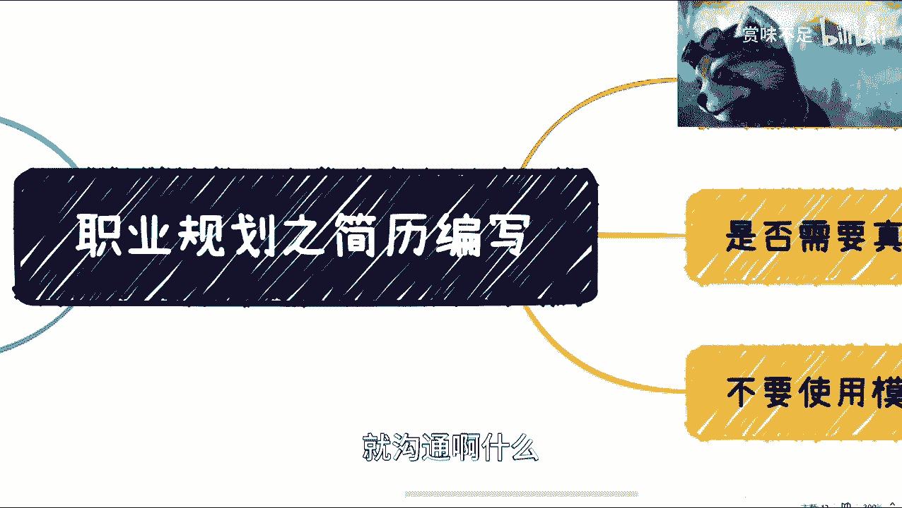

# 面试职业发展之简历编写 - P1 - 赏味不足 - BV13A411U7ji

好啊，今天我们继续来讲这个职业规划，这个简历相关的东西啊，然后这个呢我觉得很多人哎呀就工作时间短，工作时间长了都这个不是特别的清楚呃，我这边列了几个最最重要的好吧，大家可以看一下。

第一呢就是说简历一定要剪短啊，就简历简历啊，他一定要简短，我看到很多人呢他就觉得我要写的很长对吧，写的很长，显得我很专业啊，呃然后这个长稍微长一点的呢，两三页也有，那再长一点的五六页也有对吧。

我以前这个hr给我打印什么，接到过一个，我还以为像一个什么论文一样的东西，嗯我觉得这个地方呢首先是这样子的，突出重点啊，一页最后一页啊，然后呢写清楚你到底应聘什么岗位，要干什么，别什么都往上写啊。

然后呢又有人会问，那你怎么知道呢对吧，你又不是hr，你又不是人家公司的人对吧，你怎么晓得呢，对不对，好，那我就这么跟你们讲，很简单，你们思考一下啊，用这个大部分的正常人类的那个脑子，思考一下对吧。

这个hr一天看多少简历对吧，然后这个你的manager一天看多少简历，1年看多少简历对吧，然后简历对他们来讲是看简历是不是他们的kpi，不是吧对吧，看多少简历，他们有空吗，没有吧。

那有空不能去摸鱼吗是吧，那谁吃饱了撑的，要把你这么一个五六页，七八页，两三页的简历看一遍，他就瞄一眼，最多五六秒对吧，那五六秒瞄什么东西呢，你以前做什么的，什么学校毕业的对吧。

人工作多少年了都不结束了呗，那你说难听点，五六页有什么用呢，是不是哎呀对吧，这是第一个，第二个呢，啊真的讲了很多就感觉对吧，叫什么操作也行，呃第二个呢是什么呢，项目经历对吧。

那有很多人呢简历上写项目经历，这也没毛病啊，也没毛病，但是啊这个项目经历写了老多老多啊，也不知道他写这么多干嘛啊，然后呢我们首先我在这个地方写，首先你要突出你在项目当中做什么对吧，你比如说你说好。

我做了一个cheat gp t啊哈，那cheat gbt是你做的吗对吧，你在里面做了什么对吧，那就好像嗯我开一家谷歌公司对吧，谷歌公司是我开的，那你在里面干嘛呢，哦我在里面扫地的对吧。

那你这个写它干嘛呢，对吧，就说难听点，你今天就算写了，面试官也得问你问了，你还得说说不清楚，你要面不上有什么区别呢，对不对，那首先是第一点啊，嗯第二点是这个叫做别试图解释你的项目，你的项目是做什么的。

什么意思呢，就是说因为你做的项目啊，大家不同的行业，不同的领域啊，这个不同的这个业务你是去面试的啊，你不可能在一两分钟之内跟对方解释清楚，你的项目里面有多么深奥，有多么复杂，有多么怎么样。

更不要说你在简历上去显示这些东西，更没有人看了对吧，这就好像你跟我说你做游戏的，ok我对于游戏的概念就是好，我每天玩的这么多游戏，那你可能做的这个项目里面，你自己觉得啊。

我这里面有很多的car a bug对吧，或者复杂的东西，那我又不知道对吧，那你也别试图去跟别人去解释，因为这么短时间你解释不清楚对吧，好，那么最后呢就是你简单明了就简单明了。

就是说呃你不用每个下面都去解释一遍，你可以写一些东西啊，你可以写一些东西，但是呢这个东西就说突出，你在里面做什么即可啊，即可好吧，那这个是第二点，第三点呢就是叫做这个是否需要真人照片啊。

我觉得这个事情真的是我也真的是无解了，无语了啊，就是啊你要么就别要啊，你要了吗，你就做那个商务证对吧，你别把一个生活照p在上面对吧，这个是2023年，又不是2003年是吧啊对对吧，那这个是一个。

然后呢我觉得可以适当的准备多份简历，那意思就是说啊，你面的呢就可能是不同的行业对吧，也有可能是不同的岗位，那就打个比方说吧，你说你要做测试，你要做开发，你要做产品经理对吧，或者你是个多面手啊。

你觉得我都要找工作，那我这个也可以做，那个也可以做，那你总不能拿一份钱，你来吧对吧，那你可以是什么呢，你比如说我举个例子啊，比如说，嗯偏销售类的对吧，你准备一个简历对吧，偏这种产品经理之类的。

你准备个简历对吧，偏嗯嗯还有可能比如说你说啊，我对这个医疗行业特别了解，那你就单独准备个医疗行业的简历对吧，那你肯定准备多份简历，你不能只有一份简历的对吧，嗯最后呢就是不要使用模板，为什么呢。

是因为啊还是那句话，就是说你面试呢是面一次啊，这个对于企业来讲呢，他已经看了无数份简历了啊，就算他们不刻意去看啊，大大小小的模板他们也都见过了，所以你别用模板，用模板，其实怎么说呢，对吧。

就就第一感觉就是说你对你自己也不尊重啊，你对你投简历也不尊重对吧，你对于这份工作就不尊重，那别人怎么去尊重你的这个这个这个面试呢，对不对啊，然后又有人说了，他说啊我不用简历就不尊重吗，啊不好意思，是的。

为什么呢，因为你不用简历才几分钟，你认认真真写份简历很难吗对吧，你说你连这点时间都不愿意付出，你怎么尊重呢，你怎么说服得了人家呢，是不是哎呀，这个这个昨天呐喊那个我朋友还说我啊，说我这个叫什么，哈哈对。

反正就这么个情况好吧，就是里面呢其实有蛮多东西还是可以说的啊，然后呢大家要是有什么这个回头嗯，就是叫什么信任我的话，我也可以让我帮你们看看啊，改改都行啊，这个改个简历，看个简历，我肯定不会收你们费对吧。

我就算就算我说要收费，我也不能把刀架在你们脖子上，说收费是吧，就我觉得哎呀真的现在互联网真的太难了好吧，那我就先说这些，ok那么后面的话我会再把嗯，后面我想想吧，还有什么东西可以拆开来说的啊。

就面试技巧啊对吧，就沟通啊什么。

我回头回头再说吧，好吧。