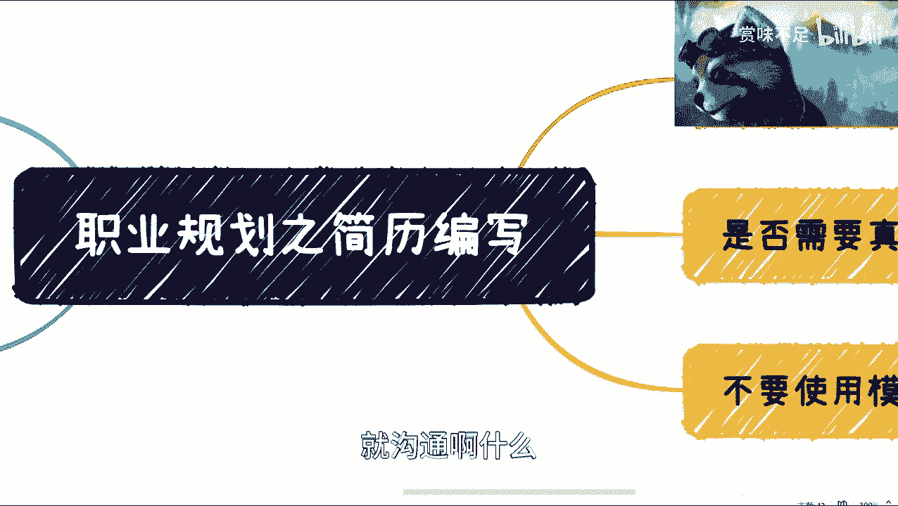

# 面试职业发展之简历编写 - P1 📄

在本节课中，我们将学习如何编写一份专业、高效的简历。一份好的简历是获得面试机会的敲门砖，我们将重点探讨简历的长度、内容组织、照片使用等核心要点，帮助你避开常见误区，提升简历的通过率。

---

## 一、简历务必简短 📏

上一节我们介绍了课程概述，本节中我们来看看简历编写的第一个核心原则：简短。

简历的本质是“简要的经历”，其核心目的是在极短时间内向招聘者传递关键信息。招聘人员（HR）和业务经理每天需要浏览大量简历，这并非他们的核心绩效指标（KPI），因此他们分配给每份简历的时间非常有限，通常只有**5到6秒**。

在这个短暂的时间里，他们只会快速扫描几个关键点：**你的教育背景、工作年限以及过往职位**。一份冗长的简历（例如超过两页）不仅不会被仔细阅读，反而可能因为信息繁杂而掩盖了你的亮点。

**核心公式**：简历的有效性 ∝ 1 / 简历长度（在信息清晰的前提下）

因此，突出重点，将简历内容浓缩至**一页**是最佳选择。务必明确你应聘的岗位，并围绕该岗位需求来组织内容，避免写入不相关的经历。

---

## 二、项目经历：突出个人贡献 🔧

在明确了简历的篇幅后，我们需要思考如何有效地展示我们的工作能力。项目经历是简历的核心部分，但写法至关重要。

以下是撰写项目经历时的两个关键点：

1.  **明确你的角色与贡献**：不要仅仅罗列项目名称。需要清晰地说明你在项目中**具体负责了什么**、**使用了哪些技术或方法**、以及**取得了什么可量化的成果**。
    *   **错误示例**：参与了“智能聊天机器人”项目。
    *   **正确示例**：在“智能聊天机器人”项目中，负责后端API开发与数据库设计，使用Python Flask框架，将接口响应时间优化了**30%**。

2.  **避免过度解释项目背景**：你所在行业的项目可能非常复杂，但招聘方可能并不熟悉。试图在简历中用大段文字解释项目的业务逻辑、技术难点，往往是无效的。招聘者更关心的是**你在其中的能力和行动**。

简单来说，项目经历的描述应做到：**聚焦个人行动，使用技术关键词，呈现客观结果**。

---

## 三、关于照片与简历版本 📸

除了内容本身，简历的一些形式细节也会影响招聘者的第一印象。

*   **是否需要照片**：如果招聘要求中未明确要求附照片，或者非必要（如非前台、公关等对外貌有要求的岗位），可以不添加。如果决定添加，请使用专业的**商务证件照**，避免使用生活照或过度修饰的照片。
*   **准备多份定制化简历**：如果你应聘不同行业或不同类型的岗位（例如，同时应聘软件开发工程师和测试工程师），应该针对每个目标岗位准备侧重点不同的简历。你可以根据岗位描述（JD）调整简历中的技能、经历和项目描述的权重。

---

## 四、拒绝使用通用模板 🚫

最后，我们来谈谈简历的呈现形式。一个常见的误区是直接使用网上下载的华丽简历模板。

招聘方已经阅览过成千上万份简历，对各种流行模板早已司空见惯。使用一份明显的通用模板，可能会给招聘者留下“缺乏诚意”、“准备仓促”或“对此次申请不重视”的印象。

亲手撰写和排版简历的过程，本身就是对自身经历的梳理和对求职机会的尊重。一份简洁、清晰、内容扎实的自定义简历，远比一份花哨的模板更能体现你的专业态度。

---

本节课中我们一起学习了编写简历的四个关键原则：**力求简短、突出个人贡献、注意形式细节、以及拒绝模板化**。记住，简历的目标是争取面试机会，而非事无巨细地记录生平。确保你的简历在几秒钟内就能让招聘者抓住重点，看到你与岗位的匹配度。