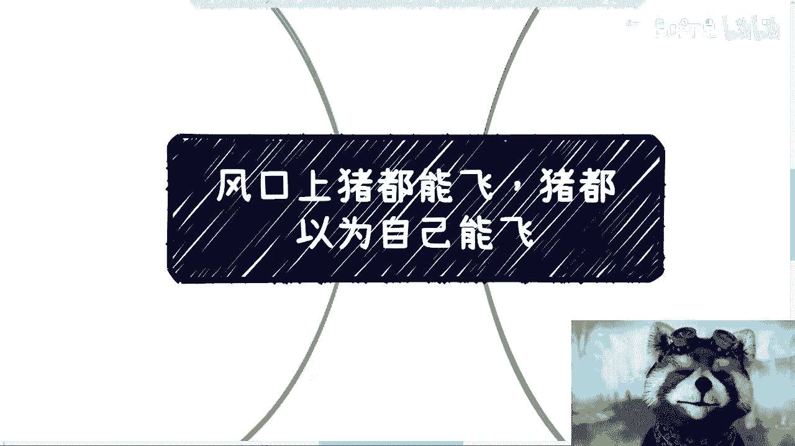
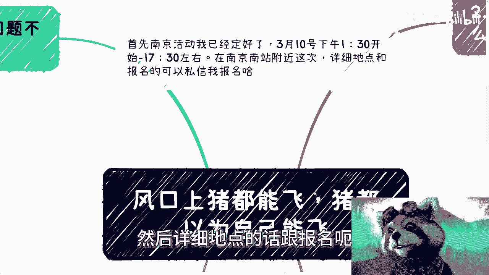
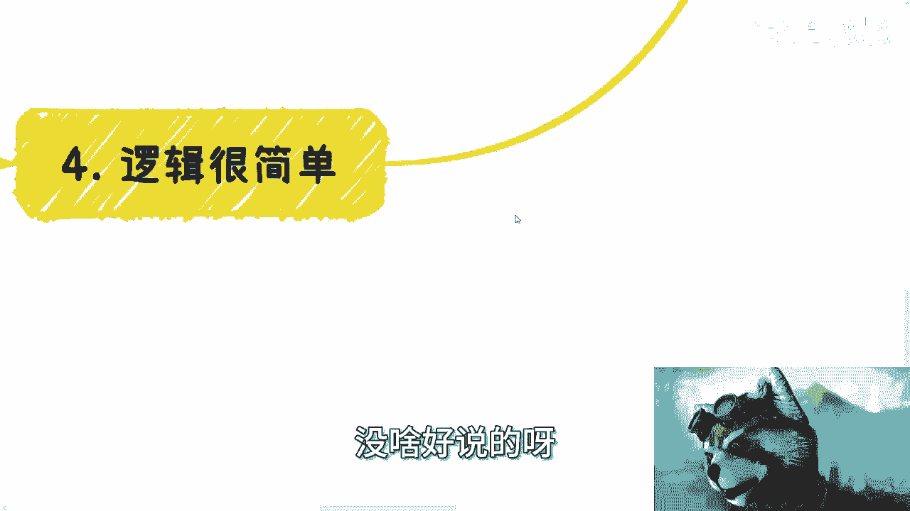
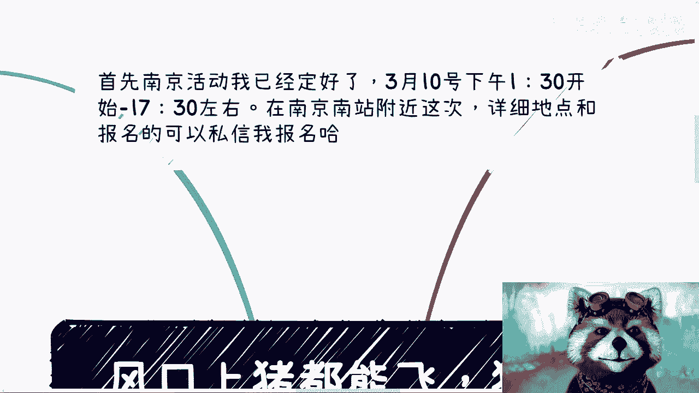

# 课程 P1：风口上的猪都能飞，猪甚至都觉得自己会飞 🐷💨

在本节课中，我们将探讨一个广为人知的商业比喻——“风口上的猪都能飞”。我们将分析这句话背后的深层含义，并拆解个人或企业成功背后的真实逻辑，而非表面现象。课程将帮助你建立更清醒的认知，避免被幸存者偏差和虚假神话所误导。

---

## 一、 现象剖析：飞起来的猪与背后的真相

上一节我们提到了课程主题，本节中我们来看看这个现象的本质。

“风口上的猪都能飞”这句话众所周知。但核心问题不在于猪是否能飞，而在于这头飞起来的猪，会真的认为自己拥有飞翔的能力。它会不停地向他人宣扬自己会飞，甚至开始教导别人如何飞翔。这是当下社会的一种现状。

无论你是这头“猪”，还是你的朋友是，都必须明白一个事实：世界上任何人或企业的成功，飞一次或两次，都是**天时、地利、人和**共同加持的结果，而非其自身真正具备了飞翔的能力。当事人自己可以相信这个神话，但旁观者绝不能轻信。

然而，当前的社会现状往往是，不仅当事人自己相信，大众也选择相信。

---

## 二、 破除因果错觉：幸存者偏差的陷阱

上一节我们指出了成功背后的复合因素，本节中我们来深入分析一种常见的认知误区。

许多人通过观察现存的成功案例来推导因果，这是一种典型的幸存者偏差。例如：
*   看到如今存活壮大的企业多是互联网或游戏公司，就得出结论：要做大赚钱就必须进入互联网或游戏行业。
*   看到身边有人通过某项投资赚了钱，就得出结论：做这项投资就能赚钱，或者大家做投资都能赚钱。

这种推导**没有因果关系**。我们只能认为，那些成功者是在恰当的时机（天时）、合适的环境（地利）和必要的资源（人和）下，走到了今天。他们能“活到现在”最根本的原因，是其脚下踩着了**遍地的失败者尸体**。只是大众通常只看到成功者，选择性地忽视那些失败者。

---

## 三、 飞行的真实前提：关系、消息与积累

认识到成功并非简单的因果后，我们来看看，若想把握机遇，真正需要依赖的是什么。

无论从事业务还是投资，赚钱的核心依赖三点：**关系、消息、积累**。象牙塔内或父母告知的许多“与赚钱有关的知识”往往用处不大。

以下是这三点的具体作用：
*   **消息**：决定你能否更好地进场，能否留在牌桌上。它提供了时机和方向。
*   **关系**：决定你能否快速拼凑出所需的团队或合作链条。它提供了资源和路径。
*   **积累**：让你有能力在风口的周期内，看清何时该做什么事，从而做出更优决策。它提供了判断力和稳定性。

如果同时具备这三点，并且拥有顶级的资源，那么赚钱是大概率事件。但这里存在两个关键限制：
1.  这只能保证你在**特定领域**且**风口来临时**可能飞起来，能飞多高仍是未知数。
2.  如果跨领域、跨行业，你原有的关系、消息和积累的价值会大打折扣，获取信息的准确性和全面性会下降，想“飞”起来就更加困难。

本质上，想要成功“飞起来”是极其困难的。

---

## 四、 创新的价值 vs. 模仿的局限

上一节我们讨论了成功的内在条件，本节我们通过一个案例来审视另一种行为模式。

经常有公司看到某个领域火热，便跟随进入（例如，看到电车火就造电车，看到AI热就做AI）。从商业利益角度，这种行为没有错，也可能赚到更多钱。

但问题在于：**能赚钱，不代表值得被看好或钦佩**。许多公司的成功只是运气较好，或是在资本加持下进行的模仿与跟随。他们缺乏真正的创新，永远在追随（Follow）别人的脚步。

这种没有创新的“跟进”行为，与职场中许多人教授“如何写报告”、“如何职场内卷”本质相同，都是在存量市场中进行底层互害，不值得提倡。真正的敬佩应该留给那些在不同时代、不同环境下，依然能开辟新路、做出创新的个体或组织。

让那些曾经飞起来的“猪”，在当下普通年轻人的环境中再去尝试，谁能保证他们还能飞起来？大部分所谓成功，不过是“草台班子，各凭本事（和运气）”。

---

## 五、 方法论迷信与认知层级的突破

许多人热衷于寻求一套“放之四海而皆准”的成功方法论。这种想法本身就需要警惕。

逻辑很简单：如果真存在一套不分背景、不分条件、在任何市场环境下都能保证成功的方法论，那它就如同“大富翁”游戏里的“均富卡”。请问现实世界“均富”了吗？没有。这说明这样的方法论**并不存在**。

在认知上，许多人生活在“第一层象牙塔”中，通过**窥视**世界而活：
*   他们将自己看到的（往往是幸存者）当作世界的全部。
*   等真正下场实践后，发现现实与所见不同，便开始抱怨、自我怀疑。
*   继而转向追求所谓的“方法论”，继续被收割。

可悲的是，收割他们的人，往往自己也未突破更高的认知层级，但这不妨碍他们赚钱。社会的本质有时就是如此。关键在于，你能否清醒地认识世界的真实样貌，并客观评估自己的斤两。

许多事情（如不懂股票却指望投资发财），你内心知道不真实，却仍抱有幻想，这本质上就是**赌博**。相反，许多脚踏实地、看似“很虚”的长期积累，却被眼高手低的人所忽视。

---

## 六、 务实建议：聚焦自身，远离无意义消耗

最后，我们基于以上分析，给出一些务实的行动建议。

1.  **认清投资本质**：对于普通个人，投资赚钱的前提是，你要么是庄家，要么是庄家的朋友。如果两者都不是，仅抱着少量本金幻想翻倍，是不切实际的。在经济环境下行时，更应思考如何高性价比地赚钱，而非守着有限本金幻想暴富。
2.  **杜绝自我PUA**：不要给自己创造神话，也不要轻易被他人创造的神话所PUA。活得透彻一些，基于现实做判断。
3.  **珍惜时间精力**：不要浪费时间在无意义的人或事上。人际交往的核心应围绕“能否共同创造价值”展开。不能一起赚钱的关系，不必投入过多情感和时间。每一秒都是你的宝贵生命。
4.  **脚踏实地积累**：关注那些真实、需要长期积累的事情，哪怕它们看起来不酷、不快捷。拒绝眼高手低。

---

## 总结

本节课中，我们一起学习了“风口上的猪都能飞”这一现象的深层含义。我们拆解了成功背后的**天时、地利、人和**复合因素，指出了**幸存者偏差**的认知陷阱，分析了真正有助于把握机遇的**关系、消息、积累**三要素，并对比了**创新**与**模仿**的价值差异。最后，我们强调了破除方法论迷信、建立清醒认知，并务实聚焦于自身积累的重要性。记住，能飞一次是运气，持续飞翔则需要超越“猪”的清醒与实力。