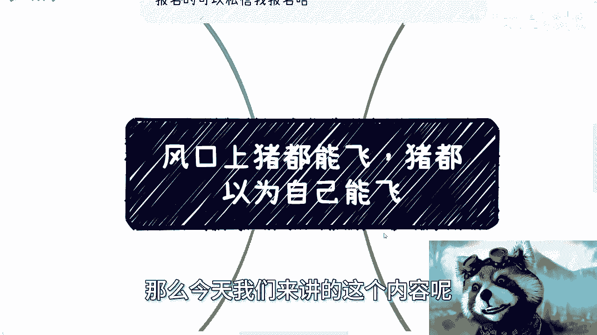
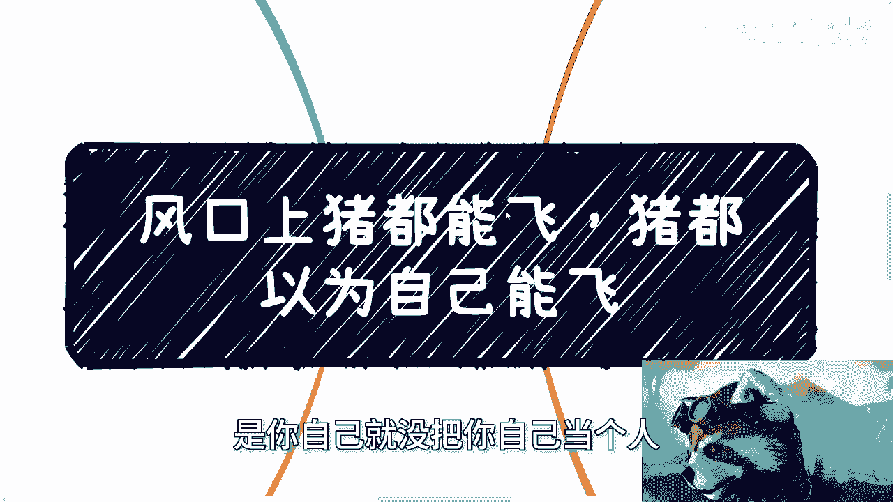

# 风口上的猪都能飞，猪甚至都觉得自己会飞 - P1 - 赏味不足 - BV1fZ421h7aB

嗯好啊，大家好啊，首先南京活动我已经定好了啊，本周日也就3月10号下午01：30到05：30左右，在南京南站附近好吧，这次然后详细地点的话跟报名啊。

可以私信我好吧，报名啊，那么今天我们来讲的这个内容呢叫做风口上的。

就这个是个老话嘛对吧，只要风口上猪都能飞对吧，猪都以为自己能飞啊，呃我们来详细看一下啊，首先啊这句话大家都知道啊，但是问题不在这个地方，你比如说很多人关心自己，是不是能够在这个风口上。

当然是不是猪并不重要，只要能在风口上能飞就行是吧，但但问题并不在这个地方啊，问题在于这头猪竟然真的会认为自己能飞啊，然后不停的跟别人说自己能飞，还不停的教别人怎么飞啊，这就是当下社会的现状呃。

无论你是猪还是你朋友是猪，你都得明白，这个世界上无论谁飞雷子或者飞了两次，那都是天时地利人和的加持，而不是他自己真的能飞啊，他自己可以呃，他自己呢守信不能信啊，你们就更不能信了啊。

当然现在社会现状是自己信的啊，大家也信啊，那么比如说从去年到现在对吧，包括今天其实私信还有人跟我说投资的事情，问我怎么看，我跟你讲这事很简单，就如我刚跟人家讲的啊，你们看活到现在大的企业啊。

你们能得出做大的企业就能赚钱这个结论嘛，肯定不能吧，你总不能说哦，我看到现在活到现在的企业，可能做游戏做得好，做什么做得好，你就来得出一个结论说哦我就以后做游戏，我就以后必须做互联网。

他没有这个因果关系的对吧，所以说你说一个投资赚钱了，你看到你身边有个投资赚钱了，你能能得出你做投资就能赚钱这个结论，或者说你能得出大家做投资就能赚钱，这个结论吗，一样不能，你去看看A股就知道了，对不对。

你去看任何一个盘子，你能得出这个结论吗，不能啊是吧，你能得出什么结论，我们只能认为他们在天时地利人和的时候，走到了今天，碰巧能够活到现在，为什么，因为他们活到现在，最根本的原因是。

因为他背后有是有遍地的尸体对吧，这才是真的，但问题你看得到吗，你看得到，你也假装看不到，那怎么办呢，你还有什么好说的呢，对吧，第二点，我们很多时候说飞的前提是什么关系，积累啊，我一直跟大家说一个行业啊。

一个这个经济形势啊，那个如何的不重要，为什么，因为行业不行业总有赚钱，总有不赚钱，好的经济形势，也有很多人不赚钱亏钱，一个不好的经营形式一样，有人赚得盆满钵满，你怎么说呢是吧，而且更何况行行业好不好。

跟你赚不赚钱有因果关系吗，没有啊，这取决于你在里面到底做啥，你怎么做是吧，那么因为赚钱啊，不管你是做业务还是做投资，我们就来讲赚钱的核心是什么关系，积累消息没有了，你曾经被象牙塔内的这些人。

包括你的父母告知，那些所谓跟赚钱有关系的东西都没用啊，我就今天我就跟你说，这都没用，你别跟我讲这些那些没有用啊，消息决定你能否更好的进场，能否更好的在牌桌上，哎我在这个地方不得不安利一下。

我最近那个发的那个探索楚门的世界，这个系列啊，你们但凡看了你就会明白啊，很多东西你不看怎么说呢，你可能你可能这辈子都不会明白啊，好，那么关系决定你能否尽快的拼凑出你想要的，团队或者合作关系链积累呢。

是让你看清楚在烽火的周期内，什么是什么时候应该做什么事情，更好的去做出做出自己的抉择，当然如果有这三个，我觉得你是可以百分之百赚钱的啊，我这里得出一个就是因果关系，就是如果你有这三个。

并且你有很很好的啊top的资源，你是百分之百能赚钱的，这没啥毛病，但问题来了啊，我们退1万步来讲，你今天就算在某个领域的这三个点上面，你拥有非常强的关系，非常好的资源跟积累，但也只能代表你在这个领域的。

并且同时封口的时候，你可能能够飞起来，你看到没有，就是你百分之百能赚钱，但是能飞多高不知道对吧，但是你反过来说，如果跨领域跨行业了，你原本积累在这三个方面的，这个这个积累和关系其实也会大打折扣。

你跨平台跨行业有没有用有用的，但是他肯定没有在当十，就没有在各自擅长的领域里面这么牛逼吧对吧，那么自然你获取的信息面也就相对会比较小啊，准确性也会失真，那就你就更别说废了是吧。

所以本质上你要去飞很难很难啊，那么第三你说猪能不能飞，我就问你们猪能不能飞，难道你不知道吗，这还用人说吗是吧，你说我们讲个故事啊，前两天有人问我，他说某公司要造要造电车啊。

我问我为什么不看好某公司要做人工智能，问我为什么不看好，我说这公司造电车的发展跟呃，他说造这个公司造电车的发展跟利润，一定比现在原本的业务前景大，并且利润高啊，好我说是这样子啊。

首先你从商业和利益角度来讲，这个行为没有毛，没有毛病，你说的这些话也没有毛病，而且他现在转这个业务，他也一定能比以前赚到更多钱，但是问题在哪里啊，问题是你能赚多少钱，并不代表我就要佩服他们。

同时我就更不代表我要看好他们，对吧，哦也许我就说他们曾经成功过，也许他们以前飞起来过，但也只代表他们的运气比其他人好对吧，同时也代表着他们是踩着别人尸体上来的，你们要明白一点，所有的同一个领域。

同一个时期的人嗯，没有成功人并不代表他不努力，他甚至比现在你们看得到活着的这些人，也就是说企业活到现在，或者业务能做到现在的人更努力，但是他们可能就没有这么好的天时，地利人和对吧。

那么我们不能否认人家的努努力吧，那其他人也同样努力，同样的付出，所以我觉得这更是没啥，我和我可以去看好的，那你要我说要我看好的话，可以的，我那天是这么回答他，我说你他有本事在别人做之前，在海外做之前。

他们就做别什么，别人做了他们就跟进对吧，别人别人开始做了，他跟进开始做，这有啥好值得看好和平配的，那我也搞不懂了啊，你无非就是资本游戏，就跟就跟就跟就是说你有钱，你跟进你也可以一样可以做，有什么区别呢。

没有创新点永远都在follow呀，对不对，这种没有创新永远都在follow的，我我价值观我是不会去看好的，有啥好看的，你有本事创新，你给我看看对吧，这就好像什么我随便举个例子，这就好像你们看到。

比如说你们可以在B站上看到，有非常多的人做职业规划对吧，跟你们说二级市场上面怎么选，职场上面怎么写报告，我也可以去彻底啊，我又不是不能说了，我靠我他妈大公司小公司这个外企，那个民中国的民企哪些我都待过。

我怎么不能讲呢，我不屑于去讲呀，为什么，因为你去跟别人卷，本质上还是底层相互伤害，有啥好卷的呢，对不对，我说我说过无数次，这件事情，就是大家不要去学习那些什么所谓的职场技能，什么卷不卷的。

这有啥好学的呢，你你说你捅来捅去，捅得都是自己人是吧，我还是那句话，你让这些所谓的人在不同的时代都去尝试一下，难道这些曾经飞过的猪都能在飞吗，啊，你让他们按照现在当下，很多普通人在这个环境啊。

年轻人的这个环境，你让他们去飞，你飞给我看看啊，谁能保证啊，你就这种情况有啥可看，有啥可看好的，妈都他妈草台班子各凭本事对吧，而且另外一方面我就回到刚刚那个问题，猪能不能飞，你难道不知道吗是吧。

你其实大家都知道，但是问题是大部分人就是愚昧的，他喜欢创造神话，喜欢自己去PUA自己，喜欢别人PUA她，那个时候我觉得你让我你让我怎么看，我说我只能随他们去，你愿意相信啥是啥。

反正我不信你去改变别人干嘛呢，你们吃饱了撑的吗，第四逻辑很简单，你比如说啊好多人到我这，包括小红书，包括其他地方，他就问方法论，我就这么问你啊，一套，如果我们假设真的有一套方法论能成功，同时它不分背景。

不分上下门，不分市场环境能成功，这不就是大富翁的均富卡吗，那请问你们现在均付了吗，我们付了吗，没有呀，那说明什么呢，说明不存在这些东西，对付了就这么简单一件事，我在探索楚门世界的这个这个那个专辑里面啊。

就这个充电专辑里面我写的很清楚，第一层象牙塔的人是怎么活的，是窥视世界活着，什么叫窥视啊，就是他看到的永远都是他看他看到的，永远他认为会是全部，他看到的永远都是幸存者偏差，对于真正的世界，他完全不了解。

他们认为他们看到的就是真的，等做了之后啊，就是哪天等他们下场了啊，下海了啊，然后说哦等等做了对吧，发现和自己看到的不同，然后开始抱怨，开始怨天尤人，开始觉得自己是不是方法不一样，是不是说自己的理解有误。

甚至自我怀疑，然后开始追求方法论，然后继续被割对吧，但问题是你会发现歌里那个人，他其实也没有突破第三象牙塔，但这不重要啊，就是其实他也不懂，你也不懂啊，但是他们能赚到钱，这个我就跟你说啊。

这个社会的本质他就是如此，你不要去思考，对或者不对，没有什么对或者不对的，本质在于你能不能清醒的看待世界的样貌，跟你自己几斤几两对吧，就是说很多东西其实我就是很可能啊，你内心知道是不真实的。

但是你却抱希望去做，比如说投资，比如说股票，比如说期货，比如说基金一样的呀，我就问你自己懂不懂啊，不懂你不懂，你就在那边期望什么期望我能赚钱，我就问你有多少本金，你赚钱，你赚什么钱，那莫名其妙的你就好。

你就你就跟跟那些所有跟我跟我说要投资的，我就问他们，我说你们本金多少，二三十万，我说你就算两三百万对吧，那也就也就算我就忍了，你二三十万投什么资啊，我怎么莫名其妙的有什么好投的，是吧。

所以说你但凡自己知道是不真实的，但是你又抱有希望的，无论是哪个方面都是赌博啊对吧，反而我跟你讲很多真实的事情，很多真实的脚踏实地的事情，哪怕啊被别人觉得好像很虚的事情，你看不上眼高手低，那我就跟你讲。

一辈子一辈子很快的，就这样呗，有啥好说的呢，没啥好说的呀是吗。

你就好像今天这个主题啊，我说你告诉我哪头猪能飞，他对方非要跟我说，我觉得猪就能飞，那怎么办呢，你跟他有什么好辩论的呢是吧，就说就好像我跟所有人说，我说投资这个东西是什么，就是你要么去做庄家。

你要么就是庄家的朋友，你但凡什么都没有，你什么都不是，你投什么资，你投资怎么会赚钱，你说你投资比如投黄金保值，我也就忍了对吧，你说我要是投资，我要我要赚赚几倍，你在想啥呀，啊你想啥呀。

而且更何况你投入的资金，成那个资金的那个本钱才多少钱啊，就现在当下这经济环境，你们难道不应该考虑的是你，你每个月每一个，每一年怎么更高性价比的赚钱吗，而不是守着自己手上那一丢丢的小的本钱，在那边翻。

你能翻几番啊，啊你能翻几番，你去看看中国一年一年，那些所谓的基金经理或者怎么样，他们能翻多少啊，一样的呀。

唉真的我有时候觉得就是我觉得还是那句话，就是大家不要浪费自己的时间，在没有意义的人身上，不要自己PUA自己，你活着就要活得透彻啊，你知道吗，不要那种就是说哦这个人因为怎么样，所以我跟他是朋友。

这个人应该怎么怎么样，所以我钦佩他有卵用啊，啊能不能赚钱能赚钱，大家一起赚钱，不能赚钱，让他滚，你花精力花时间在他身上干嘛，你浪费一秒就是一秒，何必呢对吧，那我我我我跟你们说，我在之前跟别人也讲过了。

很多时候嗯，有有有一些人还觉得我对他态度不好，我说不是我对你态度不好，是你自己就没把你自己当个人。

我为什么要把你当人对吧，OK那么南京活动啊，这个我已经订好了好吧，然后报名的话你们找我，然后剩下的话就是职业商业合同股权啊，然后什么什么什么什么创业对吧，或者其他的各种各样的这种这种领域上的东西。

或者你们有其他的想了解的东西好吧，你们呃总结好啊，就是这个总结好这个问题list啊。

