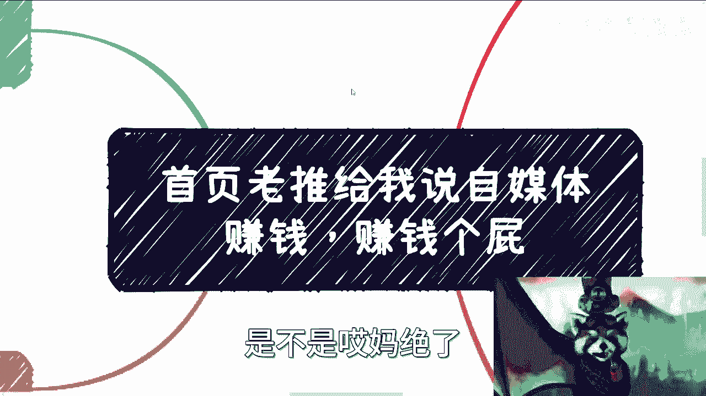
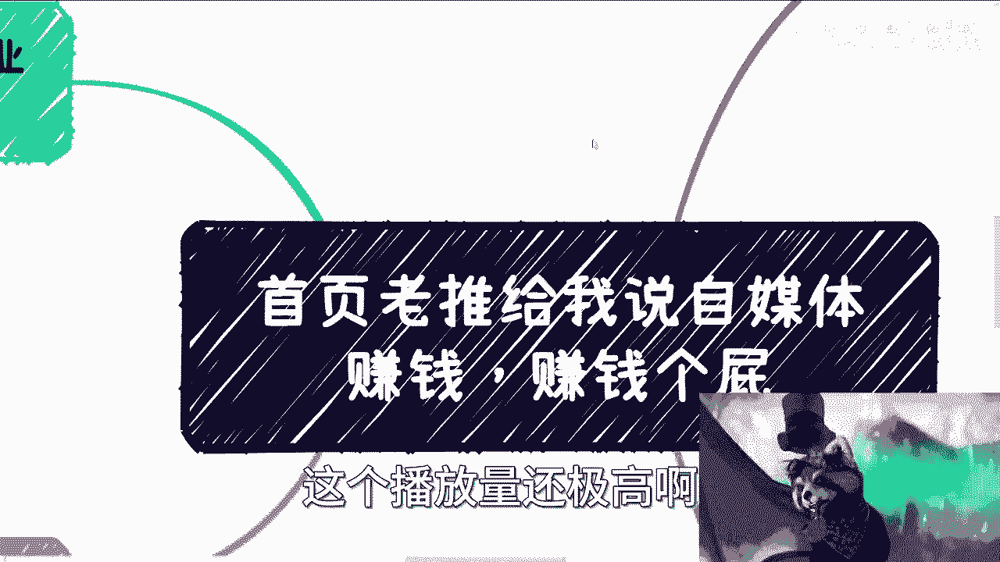
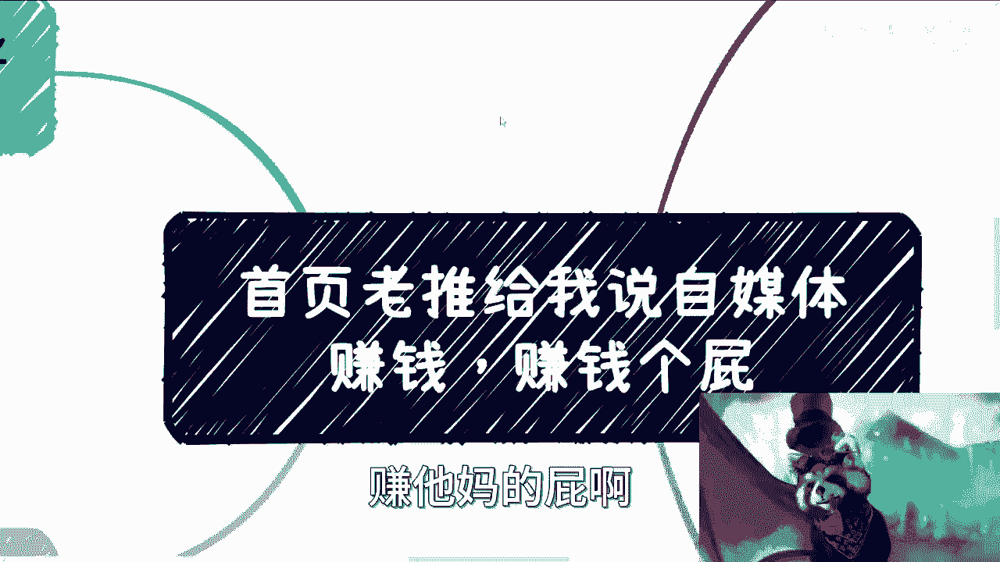
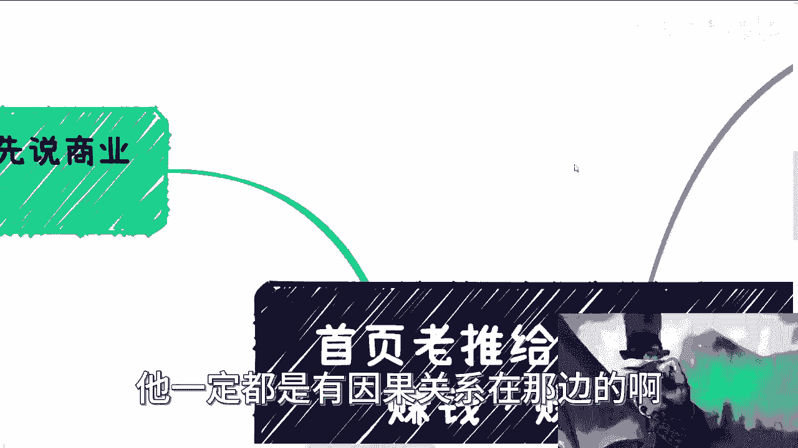
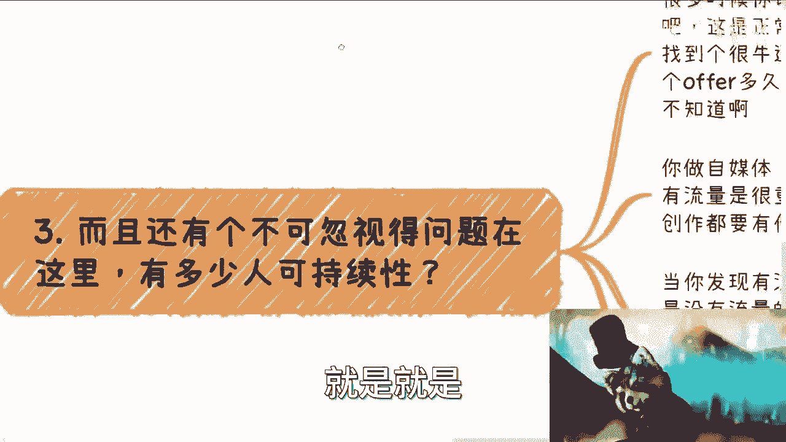
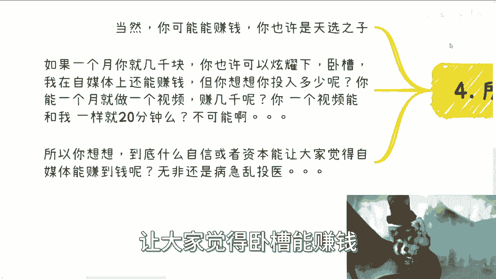
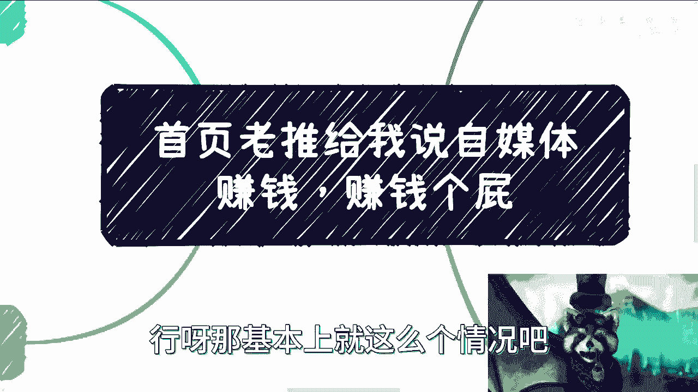

# 自媒体赚钱真相分析 - 课程01：拆解商业逻辑与常见误区 💰

在本节课中，我们将要学习如何从商业逻辑的角度，理性分析“自媒体赚钱”这一热门话题。我们将拆解其背后的经济模型、流量本质和盈利模式，帮助你认清现实，避免被误导。

---

## 概述：为什么“自媒体赚钱”是个陷阱？

最近，我经常在首页看到各种宣称能轻松通过自媒体赚钱的视频。这些视频通常承诺“稳定月入4000或5000”，但当你花几分钟看完，会发现它们根本没有讲清楚**如何真正赚到钱**。视频创作者往往在最后才轻描淡写地说一句：“只要坚持做，有流量就行。”这完全回避了问题的核心。

这类视频播放量通常很高，但这恰恰说明了大众对此类信息的盲目追捧。本节课，我们将抛开情绪，用清晰的商业逻辑来分析这件事。

---

## 第一部分：商业闭环的基本逻辑 🔄

上一节我们概述了问题的普遍性，本节中我们来看看任何商业模式要成立，都必须满足的基本条件：形成商业闭环。

一个完整的商业闭环需要满足两个核心条件：

1.  **稳定的流量来源。**
2.  **清晰的付费方与付费理由。**

如果无法同时满足这两点，所谓的“赚钱”就无从谈起。接下来，我们将对这两点进行深入分析。

---

## 第二部分：流量从哪里来？ 📈

在理解了商业闭环的基础后，我们首先来分析第一个难点：流量。

**核心观点：指望自然流量赚钱，概率低于买彩票。**

以下是流量获取困难的几个关键原因：

*   **平台是商业机构**：平台（如B站、抖音）的本质是商业公司，其目标是盈利。它们没有义务免费给一个毫无价值的新账号输送流量。
*   **流量分配的马太效应**：流量市场遵循“强者愈强”的规则。拥有大量粉丝的账号，平台可能会给予更便宜的流量包价格甚至免费赠送流量，而新人购买流量包的效果微乎其微。
*   **平台的投入产出比（ROI）考量**：平台给创作者激励（如B站的创作激励），意味着该创作者为平台创造的价值必须高于激励金额。如果平台盲目扶持所有新人，其ROI将是负值，这在商业上不可持续。

用公式表示平台与创作者的关系可以简化为：
`平台收益 >= 给予创作者的激励 + 运营成本`
如果创作者无法为平台带来足够收益，就无法获得流量扶持。

---

## 第三部分：钱从哪里来？ 💸

分析了流量的困境后，我们再来看看第二个核心问题：自媒体有哪些变现途径？它们各自的门槛又有多高？

自媒体常见的变现方式主要有以下几种：

1.  **平台创作激励**：如B站创作激励、头条号收益等。对于绝大多数新人，其收益极低（通常只有几分几毛），无法作为稳定收入来源。
2.  **粉丝直接付费**：如充电、上舰、直播打赏。这需要极高的粉丝粘性，要么能提供独特的娱乐价值（如游戏、舞蹈），要么能提供情绪价值（如陪伴、安抚），普通人难以复制。
3.  **电商带货**：通过视频或直播销售商品。其难点在于：
    *   佣金比例低（通常为销售额的10%-15%）。
    *   对货源、品控、物流有很高要求，远超内容创作本身。
4.  **商业合作（商单）**：为品牌方制作定制内容。这是相对优质的变现方式，但前提是：
    *   你必须有可观的现有流量。
    *   商单要求高，制作过程繁琐。
    *   受经济环境影响，商单数量正在减少，竞争加剧。

可以看到，每一条变现路径都存在着“先有鸡还是先有蛋”的悖论：**你需要流量来赚钱，但又需要钱（或巨大投入）来获取流量。** 对于大多数从零开始、两手空空的人来说，这是一个难以逾越的障碍。

---

## 第四部分：被忽视的关键：可持续性 ⏳

除了流量和变现，还有一个至关重要但常被忽略的因素：**可持续性**。

做自媒体不是靠一两个爆款视频就能成功的。关键在于能否持续、稳定地输出有价值的内容。许多人在经历以下心态变化后，最终走向失败：

*   **流量焦虑**：长时间没有流量，会怀疑自己的方向，开始盲目调整风格以迎合观众。
*   **失去自我**：一旦开始为了流量而迎合，创作者就容易失去个人特色，变成一个“标准化产品”。
*   **心态失衡**：看到同类内容创作者获得流量，容易产生嫉妒和不平，影响创作心态。

如果将自媒体作为全职工作，生存压力会迫使你不断迎合观众，这反而可能加速你的独特性流失，陷入恶性循环。

---

## 第五部分：理性评估与行动建议 🧠

综合以上分析，我们应该如何理性看待并行动呢？

**核心结论：对于绝大多数普通人，将自媒体作为主业并期望稳定赚钱是不现实的。**

在考虑投入自媒体时，请务必用以下商业思维进行自我评估：

*   **计算投入产出比（ROI）**：估算你每月投入的时间成本，对比可能获得的、不稳定的收入。如果收入远低于一份普通工作的月薪，则不值得全职投入。
    *   简单公式：`自媒体月收入 / 投入时间（小时） << 市场时薪`
*   **明确自身定位与护城河**：你是否有与众不同的技能、知识或资源？你的内容是否具有不可替代性？
*   **调整预期与策略**：
    *   可以将自媒体作为一项**支线任务**或兴趣，用业余时间（如20%的精力）尝试，而非“救命稻草”。
    *   如果决心尝试，目标应是建立**多元化的收入组合**，或是在过程中明确短板并系统性地弥补。

请记住，自媒体的红利期早已过去。现在入场，更像是在一个成熟市场中创业，需要完整的商业规划和强大的执行力，而非听信几个“速成教程”就能成功。

---

## 总结

本节课中我们一起学习了如何用商业逻辑拆解“自媒体赚钱”的幻象。

我们分析了构成商业闭环的两大基石——**流量**与**变现**——各自存在的巨大门槛，指出了**可持续创作**的挑战，并最终给出了理性评估与行动的框架。

希望本课程能帮助你拨开迷雾，用更清醒、更务实的态度看待自媒体与副业选择。如果你在个人职业或商业规划上有具体问题，欢迎在整理好背景和思路后进行交流。