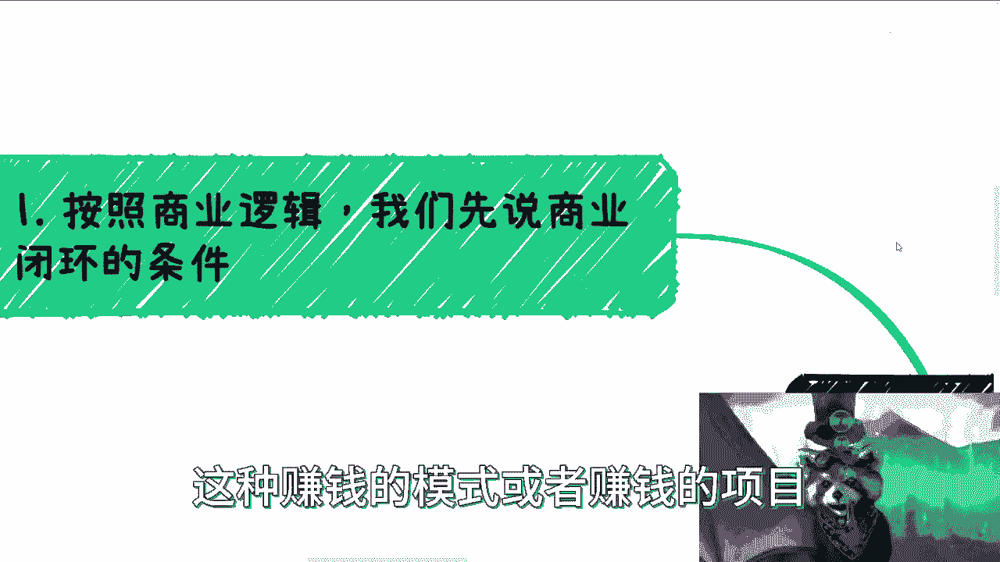

# 首页老推给我说自媒体赚钱，赚个屁！我们来分析下商业逻辑 - P1：首页老推给我说自媒体赚钱，赚个屁。我们来分析下商业逻辑 - 赏味不足 - BV1dH4y1f72i

好大家好，这个国庆已经到第五天了，诶对第四天差不多啊。

然后大家记得到我首页去那个抽奖，我刚刚又发了一个只有20个20块钱的红包，要乘以十，这个有十份对吧。

大家可以试试看，哎我最近刷B站啊，我老是看到这个什么各种各样赚钱的途径啊，这个点进去真绝了。

你知道吗，我今天早上看到一个什么，就是说什么啊，哦他就说啊这个什么稳定月入4000，稳定月入5000，然后我就点进去看了，你知道吗，你看了他意思就是说你用什么剪映啊，然后什么前面剪剪那边剪剪。

然后发出去，然后他那个视频啊一共大概也就4分钟，我看了3分钟，我愣是没有看出来，他做的东西跟就跟别人做的有什么区别，就比如说他做这些东西，到底能怎么能赚到4000块钱，我不明白，直到他发完了。

他大概在三分多钟的时候说了一句话，我他妈人就实话了，他说啊只要你坚持做，如果有流量的话，呸有他妈流量，我他妈还看你做这个东西啊，这逼我真的是变成含妈区博主吗，是不是哎妈绝了。

但是你还别说这种这种视频，他妈的这个播放量还极高啊。

首先啊我给出结论，你写的很清楚了，赚他妈的屁啊。

不好意思，我粗鲁了啊，第一啊我们先来按照商业逻辑。

我们先来说商业闭环的条件啊，首先闭环的逻辑就两点，第一你要有流量，对不对，就像我刚刚说的，第二就是你需要知道谁来买单，为什么买单，对不对，那我们来看啊，首先我们一个来分析啊，第一流量从哪里来。

你如果指望自然流量，你还不如去买彩票来实现，为什么我跟你们这么说，你们自己去试试看啊，抖音也好，微博也好，B站也好，任何地方你们去试试看啊，我不说多，你们花个50块钱，100块钱，你去试试看。

就是这个钱跟扔在水里没什么区别，你扔水里它还能有点涟漪出来，你扔到这种自媒体平台里面，我的连涟漪都看不到，你知道吗，就你会感觉就是那种比他妈彩票都假，你知道吗，然后流量市场呢一直都是强者越强的啊。

因为你要明白一点，平台是什么，平台是商业平台，平台是一个商业的运作模式，对吧哦你今天一个新人进去，你有什么价值，你没有价值，平台为什么给你流量，对不对，好，我举个例子啊，比如说啊某粉丝很多的账号啊。

你去啊就他去购买流量包，我跟你这么说，他买个1万块钱流量包，他有可能是买1万送1万，你懂吗，只不过这种东西你们看不到啊，但是你真的去找那种那些平台方，你去问问里面的这种这种工作人员，你就知道了。

你知道吧，那么它不仅能够获得更便宜的价格，平台可能还会赠送对应的流量，甚至平台的流量包都不用花钱，就平时的流量包都不用花钱，那么你说流量哪来对吧，你都说赚，我跟你说赚钱这个东西是什么概念。

就是金钱跟价值它是守恒的对吧，就比如说我打个比方，我今天做个视频，B站给我20块钱，那就意味着我这个视频一定给他带来的，赚钱价值或者流量价值是大于20块钱的对吧，那么否则的话你想想看啊。

平台如果每个新人都扶持，从平台来讲，投入产出比是负的，可能问了你想看，可能问了对吧，就是我今天不说B站，不说抖音，不说小红书对吧，你今天创一个亿，你今天比如说日活有一个亿，其中5000万用户。

你对于这些用户都是扶持的，投资产是负的，我就问你嘛，你股东会同意吗。

唉就是有时候我真的觉得，就是就是大家很多时候不要去叫什么，那就不要去有侥幸心理。

因为在商业层面，尤其是在他背后的经济模型层面，他是不可能有侥幸心理的，我跟你讲，你你去看好了所有真正的稳定的能赚钱的对吧，或者说我们叫做有完善的商业价值的，这种这种赚钱的模式或者赚钱的项目。

他背后没有一丝侥幸的，他一定都是有因果关系在那边的好。

那么第二我们来看啊，钱一般哪里来对吧，好我们就拿B站来讲啊，抖音也可以，无所谓啊，你看啊创作激励平台本身的赚钱机制，比如说充电，比如说上舰，比如说别的平台的直播打赏对吧，那么主要可能还有各种商单啊。

商单，那么还有就是平台的一些电商带货属性没了，基本上就这些了啊，那么我们一个来看啊，比如说创作激励对吧，这玩意儿我跟你说，还是那句话，你要不信你自己去做对啊，你自己去做，你做一个月啊，我也不用多。

你做一个月，你收这么赚钱，你就知道了啊，你别你别听别人说，哎呀，我的，你跟着我这个套路做对吧，你你你什么月入几万，然后你还没赚呢，你先教他个几万，你这不是这不是割韭菜是啥是吧，你自己做一个月。

无论什么平台，反正你看吧啊，就但但凡像像西瓜视频对吧，像呃头条他都有激励的，但你看看你激励是多少啊，你正常啊，我就说正常啊，几分几毛对吧，就现在还来吹这个玩意的，他不是坏就是蠢啊，那这是第一点，第二点。

充电上舰这玩意需要粉丝粘度对吧，你要么就是小姐姐，你很好看，你跳舞很好看，你打游戏很好对吧，有很多榜一榜二大哥，你会发嗲吧，哎呀大哥好像不是这样子是吧对吧，就是就是反正就是这个意思啊。

要么就是说你你输出有很大的价值对吧，我不一定说是真的价值，就是你可以有很多情绪价值对啊，你们去看B站也好，别的地方也好，有很多那种什么帮你催眠的对吧，这个抚慰你情绪的有很多啊，真的我我我真的是服气的。

就是我我我当时看了我才也也第一次看到，原来这种还有隔着屏幕用那种，比如说女友视角对吧，或者说是一种安抚式的视角，隔着屏幕来安抚你，卧槽牛逼的，而且这种视频播放量就几稿，都是那种几10万上百万的啊。

我我我承认我是肤浅的啊，那么这种大家愿意付钱，否则呢，否则你还不如去找个C差，直接去麦克来的快，我跟你说啊，然后带货这事我跟你讲更难啊，真的是更难，因为带货这个事情啊，你会比你打赏。

会比你做很多别的东西，它的风险更高，同时它的粘性要更高，那么正常来讲，你去看啊，平台的这种带货，它分润就10%到15%啊，要死了，我跟你讲十百%分之15什么概念啊，就是你跟讨饭差不多，你知道吗啊。

你要有自己的货源和品通话，品控的话，那就更难了，就我们做个自媒体，你还需要有这么多什么啊，这个人你说你们做个自媒体，然后你到时候还来问我，哎呀，吕老师做个自媒体门槛这么高啊对吧，我还要有货源。

我还有品控，我没有啊，那好了，又又又这条路走不通，对不对好，那接下来就商单，我就这么说啊，商单上面小红书和抖音都是不错的啊，但是今年的经济情况以及往后，我相信你们身边但凡有做的人，他都会明白。

商单已经越来越少了，而且越来越难接，而且我跟你们说啊，商单这个东西你但凡接过一次，你就知道这我的要求老高了，你们有看到过我接过吗，我就接了两次清华大学出版社的书对吧，你们有看过我接过别的东西吗。

没有为什么，因为太烦，我懒得做，我没这心思，不是没人找我，你知道吗，但他们要求都很高，什么什么专门为他们出个视频，我吃饱了撑的对吧。

那么商单这个东西呢，它还有个前提，就是你得有现有流量吧对吧，那么这个时候你又陷入了一个，先有鸡还是先有蛋的问题对吧，那么大部分人是鸡和蛋都没有。

那你跟我说啥说呢对吧，我就觉得这个东西真的是很很很有趣啊，就是就是普罗大众啊。

大部分都是病急乱投医，然后就是被忽悠，但凡我觉得大家是一个，读过9年制义务教育的对吧，不是九漏鱼嗯，漏网之鱼对，不是九漏鱼的话，基本上我觉得这个逻辑是想得通的对吧。

第三点啊，而且有个不可忽视的问题，在这里就有多少人我们说的可持续性啊，你看啊，很多时候你说做自媒体，你我相信啊，无论你们做什么，你们总会会有就终究会有个视频流量很高的对，有那么一两个啊，这是正常的啊。

这个很多人也和我说，刘老师啊，我找到就就跟很多人跟我说的一样，他说刘老师我找到一个很牛逼的offer一样对吧，但是你从我的角度来讲没有用啊，为什么，因为你跟我说，你现在年薪100万。

我就问你能持续拿多少钱，就是你能持续多少年这个钱对吧，以及你以后跳槽是不是都是100万往上跳，你不知道的呀对吧，而且这件事情的可控性不在你手上对吧，你做自媒体是一个道理对吧。

你可持续的可持续性的创作是最重要的，你创作有有流量是很重要的，你要能坚持创作很重要，而且你的创造都要让你的，就是关注者觉得有价值，你不能说啊，你今天两个做的不错，到后面就开始洒水了，那就开始还有上海。

我叫蔡莱姆对吧，就就就就开始忽悠大众了，那就不可能那就没戏了，人家这个关注你的人，人家肯定是有目的的，对啊，当你发现我跟你讲啊，你做自媒体，当你发现有流量的时候，你会很开心的。

但大部分情况你是没有流量的，而当你没有流量的时候，有的人就会去想，是不是说我做的这个风格不对，或者来说怎么样，我要不要调整对吧，然后有的人呢就会嫉妒别人，就会发现诶，那凭什么他跟我做的一样。

他妈的他就有流量，而我他妈的没有量，对不对，那就开始变成海马区博主，是不是，所以说你会发现，当你一旦有这种心态的时候，基本上就是走到一个死胡同上，为什么，因为你会不停的去调整风格，去迎合你的观众对吧。

然后还如果还是没有流量，那么你就开始盲目乱改了，而且你一旦记住事后之后，你其实基本上就是所谓乱了阵脚，所以说这也是为什么我就是所有的人跟我说，六过来做自媒体啊，我一般都会这么说。

就是你分20%的精力去做，没问题的哦，你别跟我说，你当你把它当成主业什么什么，很多人什么辞职去做没有用的，我跟你们讲，为什么，因为很简单，这就跟我之前说什么，我说啊，我不是有一些说嘛。

我说大家如果要去赚钱，你们跟企业的合作一定是就商业合同，而不是劳务合同对吧，或者劳动合同对吧，为什么，因为当你全职去做一个自媒体的时候，你会发现啊，就是所有的人都是你的金主爸爸，对不对，那没这没错啊。

但是你会慢慢慢慢去迎合观众，为什么，因为你是靠这个东西吃饭的，你不迎合他们没有办法对吧，但是你一旦迎合他们，你就失去了你自己啊，你你其实就变成了一个标品，你知道吗，就慢慢慢慢就变成了一个标兵。

我不管你是打打游戏，打王者荣耀也好，还是说跟我一样讲讲讲这种商业也好对吧，或者来说跟其他人一样，讲什么工作内容怎么卷也好，就是你一旦迎合了你的观众之后，你就会发现你你不自觉的你的风格会变调。

而你的风格变变调之后，你就不是你了，你知道吗，所以说你这样看你，你拿我自己来讲啊，我到今天对吧，视频出了这么多了，虽然只有半年时间对吧，出了这么多，就是有很多人给我提过意见，也有很多人给我提过方向。

但是你看到我有改吗，我不改，为什么，因为我不care啊，就是我的我的态度一直是这样子的，就是你要愿意尊重我，那我很开心，你就尊重我，你要愿意不尊重你，不尊重我对吧，你要觉得你你你不喜欢我无所谓。

我不强求你对吧，另外一方面就是说你给我提意见，我都是欣然去接受，但欣然接受的前提是什么，就是你得让我感觉到你是有判断力的，你是有根据的，你是有依据的，而不是上来就哎刘老师。

我觉得你应该怎么样怎么样怎么样，那我凭什么怎么样怎么样，我是差你这几块钱呢，还是怎么滴呢，对吧，所以呢就是说很多时候一个道理，就是说大家去做这个东西，你可以把它当成一根支线，但是不要去当成一根救命稻草。

因为你你们想想看啊，从最早公众号开始对吧，公众号上的打赏到后面知识星球哦，到喜马拉雅对吧，到播到这种播客小宇宙，到现在这经历了多少年了对吧，就是自媒体这个东西，它存在就很多年了。

他所有的红利期什么东西早就没有了，你说大家作为一个老百姓，一穷二白啊，你说我要开始创业了，我要开始做自媒体，这个，就有时候我就觉得这种想法就除了被割，他没有别的出路啊，啊所以呢就是说结论很简单。

就是穿个屁对吧，你想想看，当然你可能能赚，你也许是天选之子啊，每个人都觉得自己是天选之子，那我也劝不动，对不对啊，那我们再从商业角度来讲，如果一个月你想想啊，如果一个月你就赚那么几千块钱，我跟你讲啊。

几千块钱很牛逼了，你不要以为很少啊，你也许可以炫耀一下，我在自媒体上还能赚钱，对不对，但是我问你啊，你想想看你投入多少时间呢对吧，以及你能够持续几个月继续创作呢，以及你能一个月只做一个视频赚几千吗对吧。

你一个视频能跟我一样，就做20分钟吗，对不对，你成本有多高呢，哎呀就你知道吗，就很多人想赚钱，我是知道的对吧，但是你要去，就是就是用你的正常的逻辑去想一想，投入产出比多少啊，是啊，所以说啊你想想看看。

到底什么样的自信或者怎么样的资本，能让大家觉得自媒体能赚到钱，其实无非就是病急乱投医，或者说对方营造了一个假象，让大家觉得我才能赚钱。

我想他首先先收你，就是先收割你一部分的这个叫什么，就是知识付费啊，让你觉得你能赚钱，但其实赚不到啊对啊，所以说呢就是你们但凡跟我沟通过，跟我交流过啊，你们就会发现。

我就是就是比如说你们今天有个有个id啊，你们跟我讲，你们会发现你们的id啊，我从来就不听呢，为什么，因为我只关心什么，我只关心就是第一你有没有什么门槛，有没有什么护城河，你是不是跟别人都一样。

第二你就告诉我你一个月投入时间是多少，以及你产出是多少钱对吧，如果啊我就说我就按一个月月薪2万吧来算吧，如果来说啊，你一个月投入的时间跟人家打工差不多，然后赚呢还不是人家那种2万3万稳定的月薪。

那种东西，做它干嘛，对不对，就就就就就这种东西做的，它就是一个虎头蛇尾的东西啊，就是说如果你真的要做也不是不行对吧，就像就像我前两天说的，你要么就是批量的，你说我手上有那么五六个业务。

每个业务可能都稳定，就比如说有个有个范围吧，1万到3万的这个区间，那我觉得没问题，要么就是说你说哎我现在先做着先做着，但是呢我知道这里面肯定有哪些欠缺的地方，然后想办法去补，那也没问题。

但是你但凡这两个想法都没有啊，你就跟我说刘老师，我有个id对吧，然后我大概怎么样怎么样啊，大概收入怎么样，那这种东西做了就没用了，因为这种东西你还不如去打个工啊，对吧好吧行啊，那基本上就这么个情况吧。

就是嗯我觉得我逻辑已经讲的很清楚了，就就如果你们听下来还觉得自己能赚钱，那你们就吃的我就劝不住啊行吧，那就这么着吧好吧，然后嗯同样的啊，就是大家想对啊，对对对，那个我我后面还会再出一期数据经济的。

因为最近可能有些update更新给大家好吧，OK然后大家副业啊赚钱啊，然后对于这个社会商业上的运作啊，包括就是政府啊，高校啊，企业啊，这个各个商单啊，包括就是说你们自己手上有什么牌，不知道怎么打的好吧。

然后你们整理好你们的背景，整理好你们的问题，然后你们可以私信我，然后来做咨询好吧，当然啊就是你要有最最简单的问题，你也可以直接问我对吧，你私信我不可能不回答，除非就是你这个什么什么说出来一些问题。

实在是这个狗屁不通的，那我实在是不想回啊，行吧。

