# 高举高打中的高指的是什么--竞赛-自媒体-外包等例子----P1---赏味不足---BV1z34y1

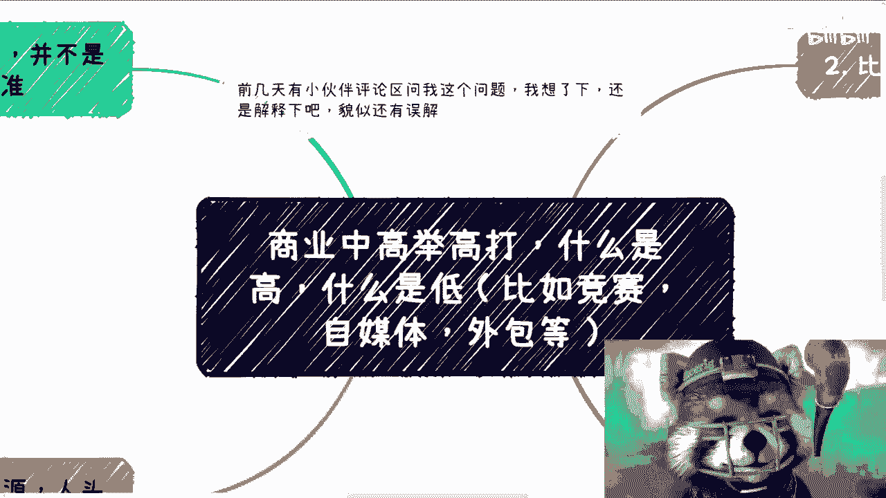

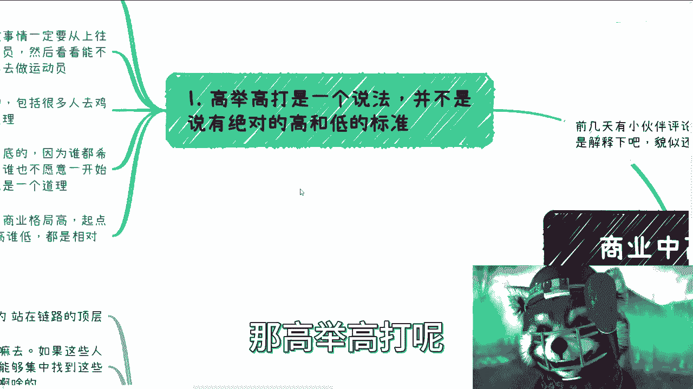

在本节课中，我们将深入探讨“高举高打”策略中“高”的真正含义。我们将通过竞赛、自媒体、外包等具体例子，解析如何从“裁判员”或“合作方”的视角切入，而非直接成为“运动员”，从而在商业或竞争中占据更有利的位置。课程将帮助你理解“高”的相对性，并学习如何应用这一思维模式。

---

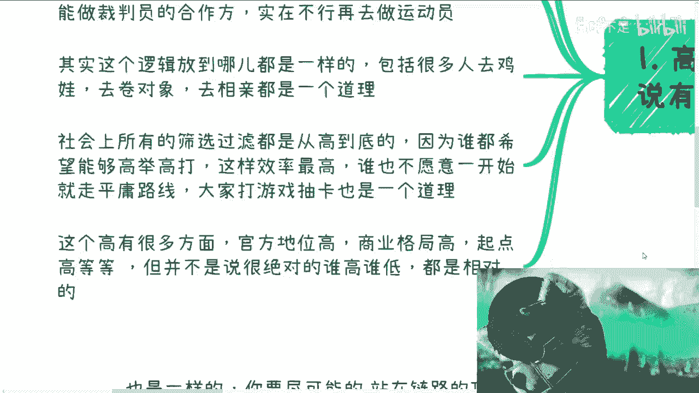

## 什么是“高举高打”？ 🤔

“高举高打”并非指绝对意义上的高低标准，例如政府高于百姓。其核心含义是：做任何事情时，应尝试**自上而下**地推进。优先考虑能否成为规则的制定者（裁判员），若不能，则争取成为裁判员的合作方，最后才考虑作为执行者（运动员）参与。这一逻辑普遍适用于各种场景。

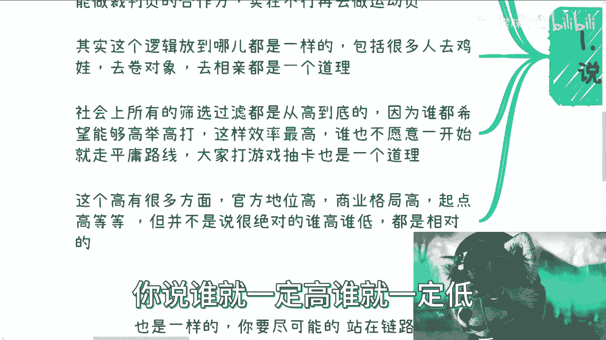

---

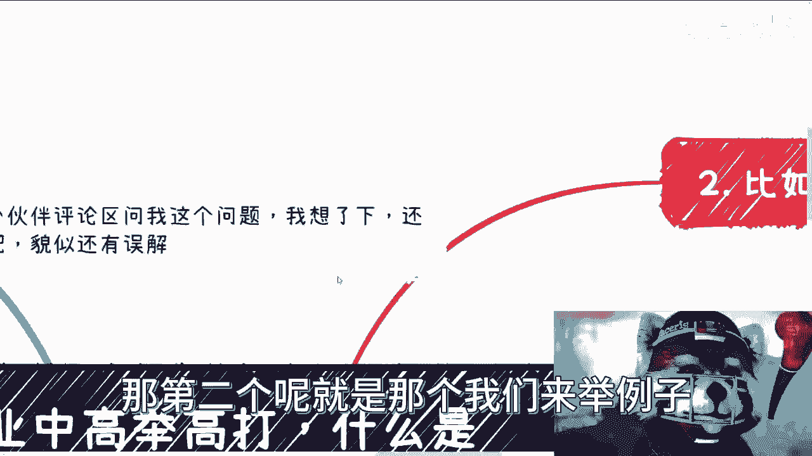

## “高”的多重含义与相对性 ⚖️

“高”可以体现在多个维度，例如**官方地位高**、**商业格局高**或**起点高**。然而，这些“高”都是**相对**的，并非绝对。例如，企业招聘时要求高学历（博士、硕士），或通过竞赛、协会等渠道寻找合作伙伴，都是在寻找相对更高的切入点。所有人都希望获得优势，如同游戏中玩家都希望抽到**SSR**或**五星**角色。

---

## 实例解析：学校竞赛 🏆

上一节我们介绍了“高举高打”的基本概念，本节中我们来看看学校竞赛的例子。许多人听到“竞赛能赚钱”时，第一反应是“我该参加哪个竞赛？”。这并非“高举高打”的思维。

以下是“高举高打”在竞赛中的正确应用思路：

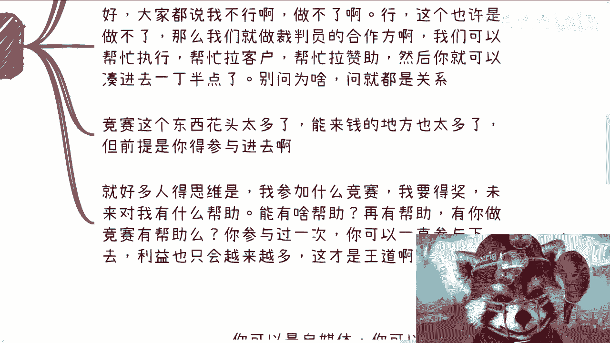

*   **成为规则制定者**：思考能否**举办**竞赛、担任**评委**或**制定流程**。目标是成为“裁判员”。
*   **成为合作方**：如果无法成为主办方，可以寻求作为**协办方**或**执行方**参与。例如，帮助拉赞助、联系客户。通过合作切入，逐步深入。
*   **建立信任与执行力**：信任源于共同创造价值。例如，你可以组织一场小型培训，邀请嘉宾，让各方（包括你自己）都赚到钱。这证明了你的**执行力**，而执行力是靠谱的核心。

竞赛蕴含大量机会，但关键在于**参与其组织与运作**，而非仅仅作为参赛者。参与组织带来的利益是持续且增长的。

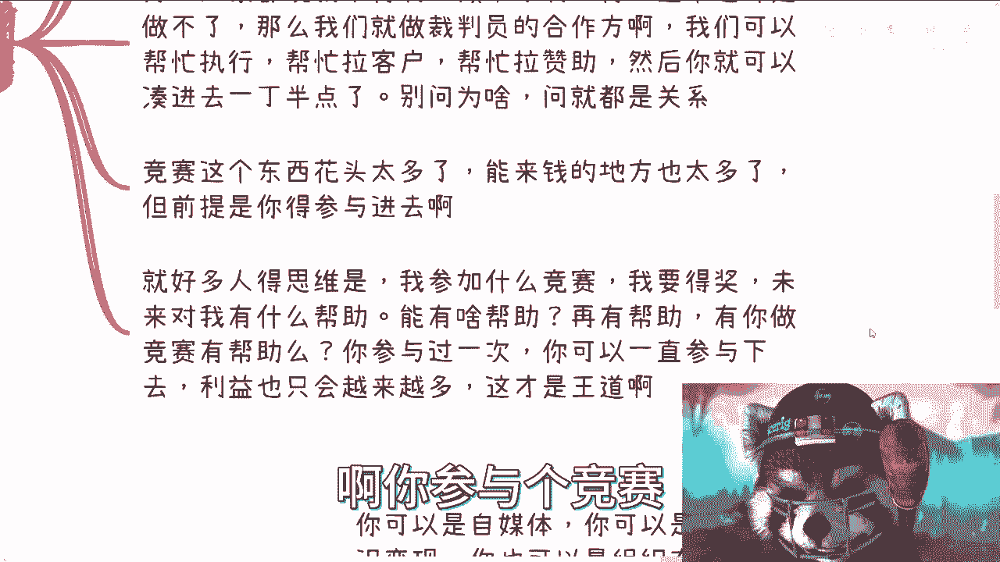

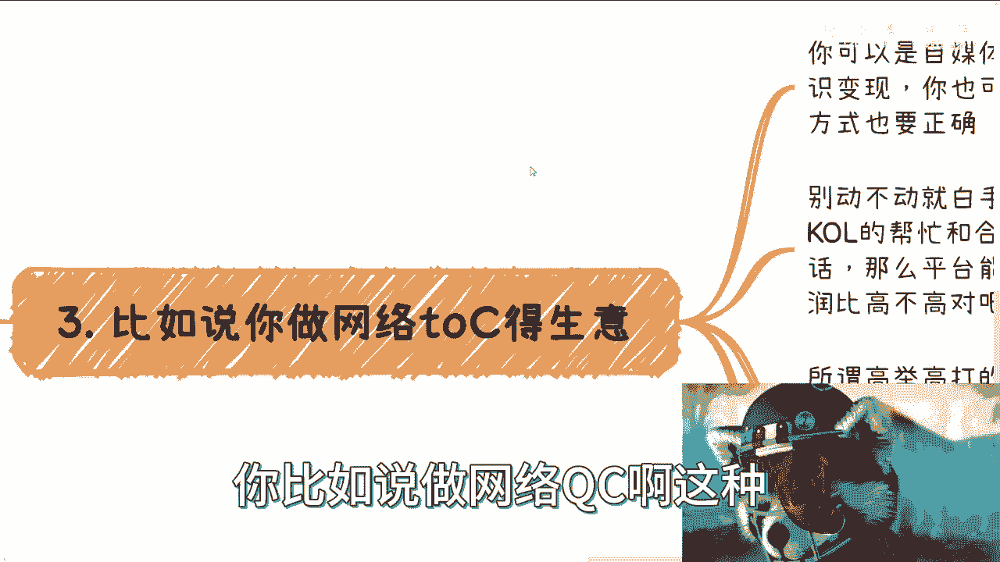

---

## 实例解析：网络To C生意（自媒体/电商） 💻

理解了竞赛中的思路，我们将其应用到网络To C生意中，如自媒体、电商带货或知识付费。正确的方法不是注册账号后盲目开始。

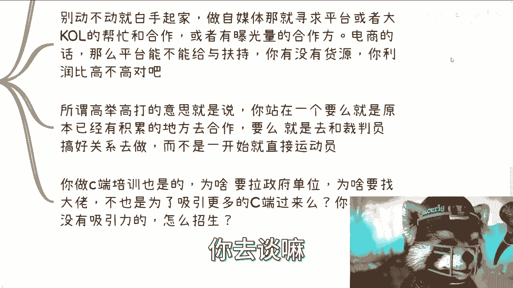

以下是进入该领域的高举高打方法：

*   **寻求平台合作**：首先尝试联系平台（如B站、微博、抖音）的运营人员。通过活动二维码等渠道接触，他们通常愿意沟通。这是与“裁判员”建立关系的开始。
*   **联合有影响力者**：寻找大V或已有曝光量的合作伙伴，而非完全白手起家。
*   **争取平台扶持**：对于电商，主动与平台洽谈可能的扶持政策，不要未经尝试就认定“不可能”。

所谓“高举高打”，就是站在已有积累的位置合作，或与规则制定方搞好关系。许多C端培训业务寻求政府或大佬背书，正是为了吸引更多客户和赞助，这是一层层的资源叠加。

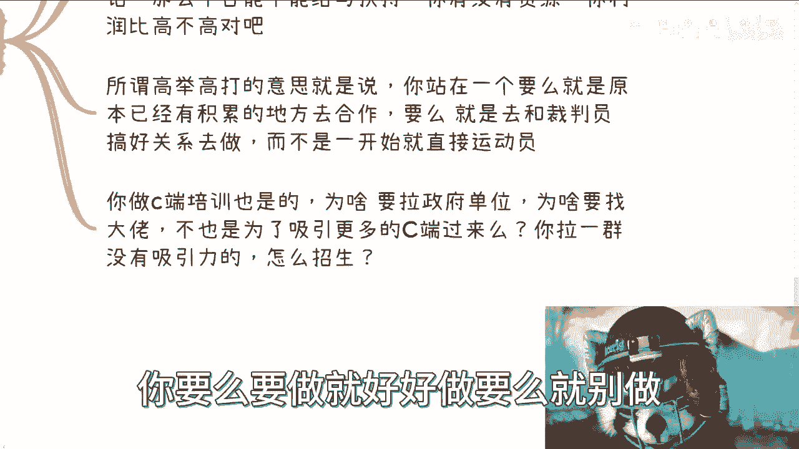

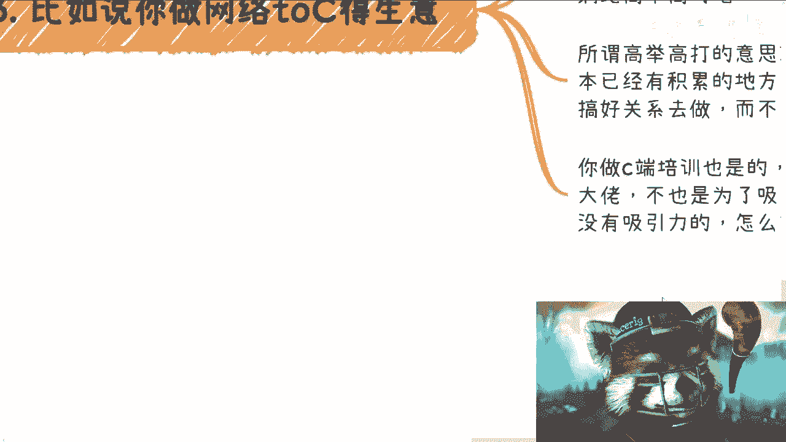

---

## 实例解析：外包与人力资源 👥

最后，我们来看外包或人力资源生意。其核心同样是尽可能站在链路的顶层，控制资源入口。

以下是操作思路：

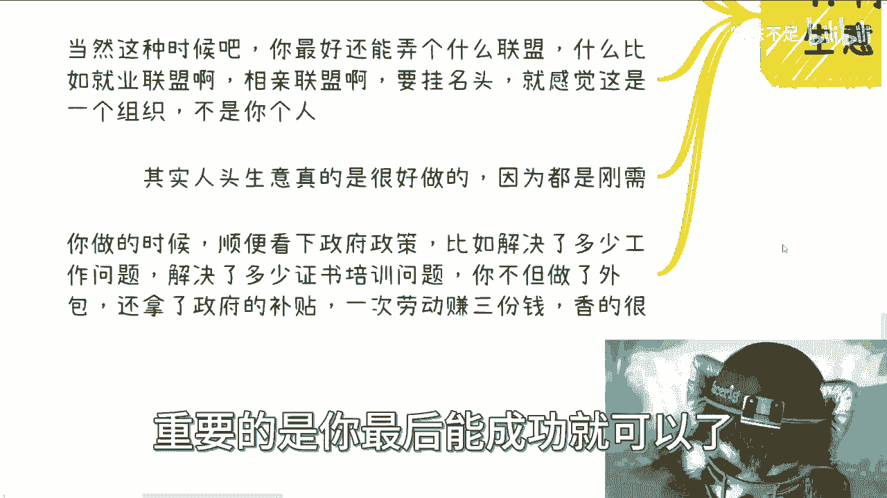

*   **集中资源入口**：不要零散寻找。针对社会人员，可以联系**居委会**、**村委会**，了解其KPI并提供帮助（如举办活动），从而建立合作，打开渠道。
*   **对接学校资源**：针对学生，直接与高职、中职等学校洽谈。
*   **创建品牌联盟**：可以创建诸如“就业联盟”、“相亲联盟”等品牌。名称本身就能营造组织感和权威性。**先有品牌，再充实内容**是可行的路径。
*   **结合政策获利**：在开展业务时，研究政府政策。例如，解决就业或培训问题可能符合补贴条件。这样，一次劳动可能赚取多份收益（服务费、补贴等）。

---

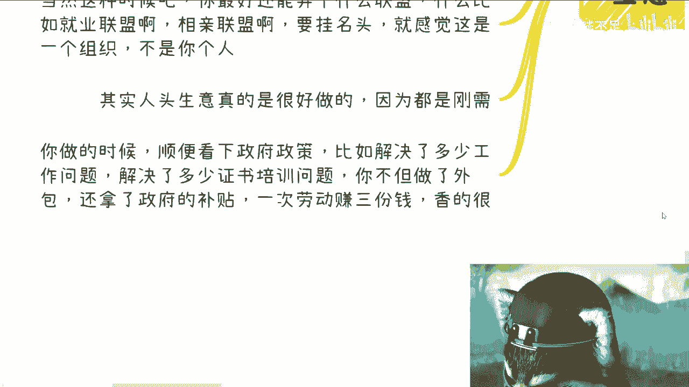

## 总结与核心思维 🧠

本节课中，我们一起学习了“高举高打”策略的精髓。

1.  **“高”是相对的**：它指的是在特定层级或生态中，处于更靠近规则制定端或资源上游的**相对位置**。
2.  **行动顺序**：理想路径是 **裁判员 -> 合作方 -> 运动员**。即优先考虑制定规则或与规则制定者合作，而非直接下场竞争。
3.  **核心公式**：**成功概率 ≈ 所处位置的相对高度**。从更高维度切入，进行降维打击。
4.  **社会是分层的**：可以将社会想象成一个百层套娃结构。每一层相对于其下层是“高”，相对于其上层是“低”。商业逻辑的关键是找到你能进入的**相对高的那一层**，然后向下拓展。

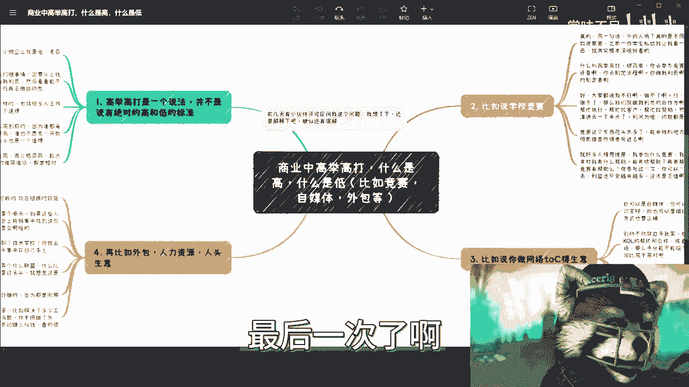

“高举高打”是一种思维模式，它鼓励我们突破“直接参与竞争”的惯性，转而思考如何**参与定义竞争**或**与定义者同行**。这需要主动、胆识和执行力，而非被动等待或盲目报课学习。