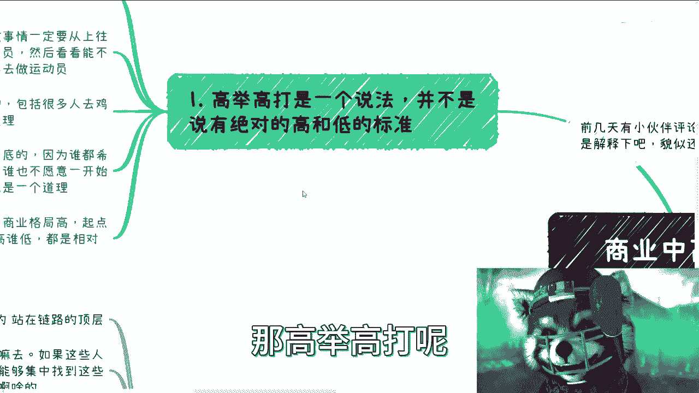
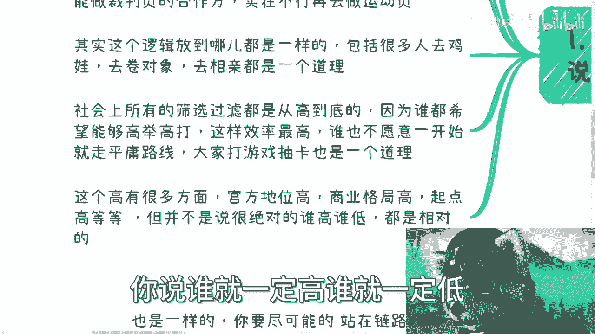
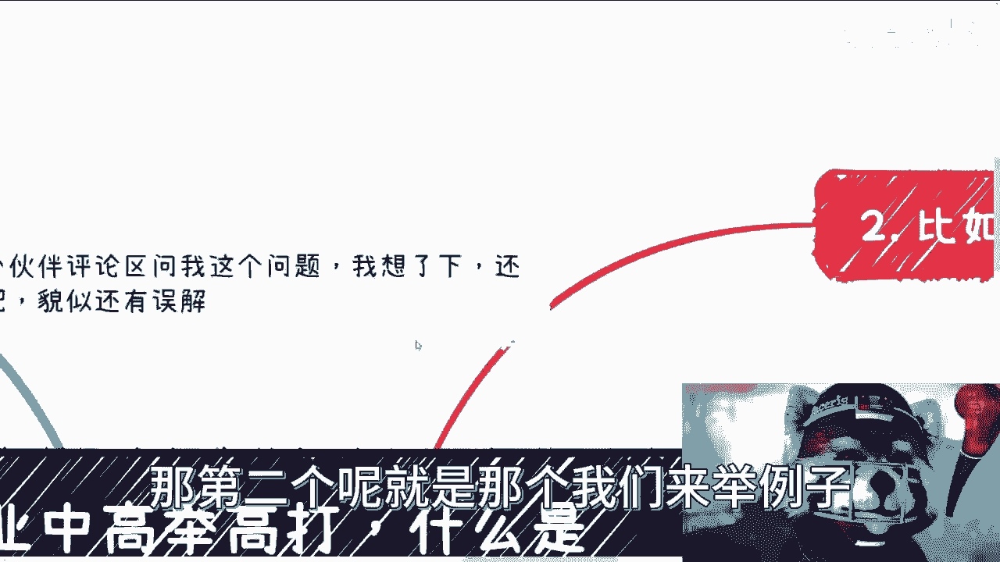
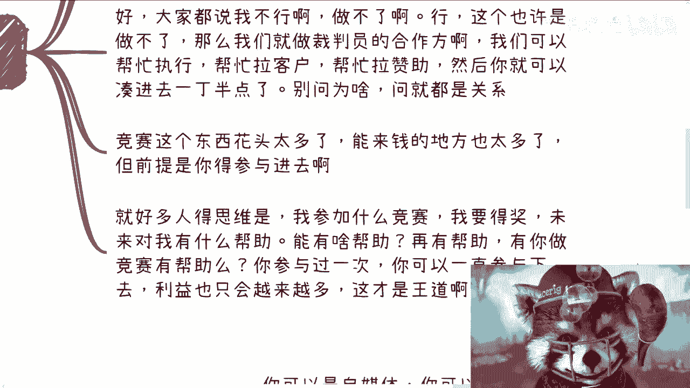
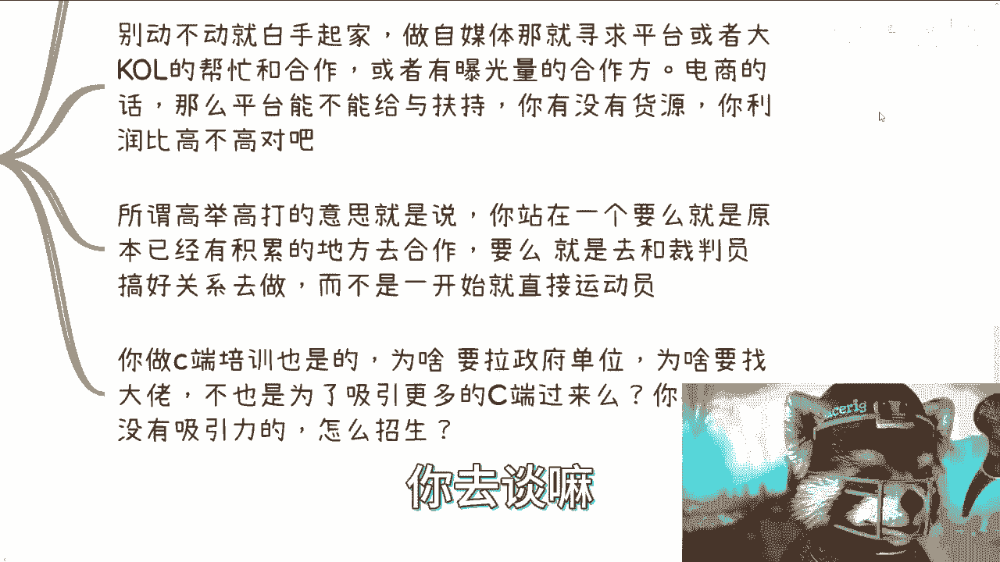
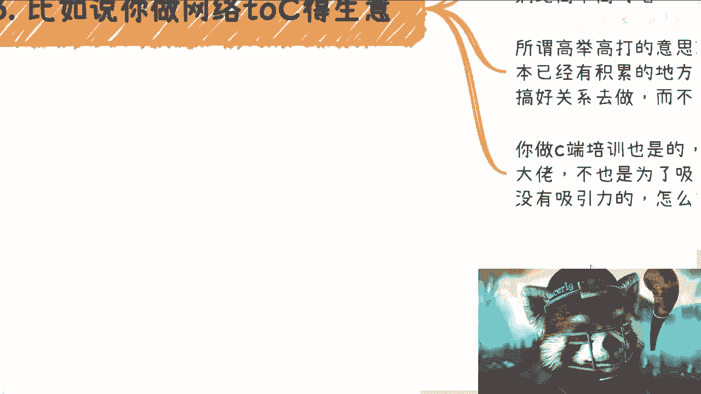
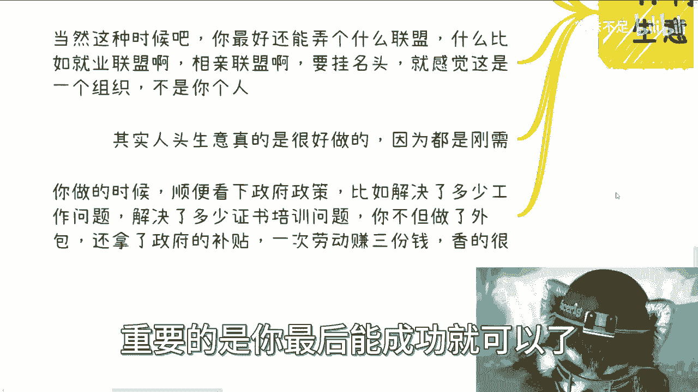

# 高举高打中的高指的是什么？（竞赛，自媒体，外包等例子） - P1 - 赏味不足 - BV1z34y1g75W

哈喽大家好啊，前两天这个评论区小伙伴问我，这个高举高打什么是高，什么是低是吧，我想了一下，好像有点误解啊，有点误解我，我再来肯定这个从一些案例上这个解释一下啊，就是高举高打的意思不是说一定怎么个高法。

比如说你说政府高还是老百姓第一，还是怎么样对吧，但不是这么个意思啊，那高举高打呢。

它并不是说一定绝对有个高和低的标准啊，首先啊是这样子的啊，这个高举高达的意思，其实是说我们做一件事情呢，一定是从上往下走，或者说先看看，就是说整个事情当中能不能做裁判员，然后呢做不了呢。

能不能做裁判员的合作方啊，然后再做不了，那就再去做运动员，你懂吗，那当然不懂，后面我能举例子啊，其实这个逻辑放到哪都是一样的，那包括很多人去鸡娃对吧，去举举对象，你比如说鸡娃为什么要记啊。

要怎么记啊对吧，你你你你双语学校对吧，你私立学校，那为什么他也是高举高打对吧，他觉得比如说4D学校拿到机会更多对吧，未来这个交换生出国的机会就更多对吧，那为什么选对象选对象，你说学历对吧，身高吧等等等。

各种各样的要求，反正一大堆对吧，那为什么要卷啊，这也是高举高打的一种嘛对吧，那去相亲也是一个道理，那社会上呃，大部分所有选筛选过滤的机制，其实都是从高到低的啊。

因为谁都希望能够高举高打，那当然这个高举高打，这个里面的含义就很多对吧，你就打，比方说你说企业对吧，招人啊，我从社会上招，那我可能要的是博士，要的是硕士对吧，那这个是以某一些学历高对吧。

那你说我要是跟别人合作呢对吧，那那我可能更多的就是说哎我希望从竞赛啊，从比如说协会对吧，从这种什么什么很多私立学校对吧，那这种也叫高举高打，那这种高呢就并不是说一定是他学历高，而是说啊从更高的一种呃。

就我们说裁判员啊或者层级这种层面对吧去打，那么谁也不愿意一开始就走平庸路线对吧，包括你们所有的人去打游戏，FGO对吧，包括那个其他抽卡的都一样啊，你你你谁不想SSR对吧，谁不想五星是吧，就都这个道理啊。

当然这个高呢它有很多方面啊，比如说官方地位高，比如说商业格局高，比如说起点高等等等啊，但是呢不管哪个方面高呢，它都是相对的啊，不是说绝对的，你说谁就一定搞，谁就一定低对吧。

这个没有这种说法的啊，那么首先这第一个，那第二个呢就是那个我们来举例子。

比如说学校竞赛啊，呃首先呢我跟你们讲啊，真的是同一句话呢，不同的人听到啊，他就有不同的理解，我有时候哼有时候咨询的时候跟他们讲讲东西，他妈讲完我就想骂人，你知道吗，就是那种就是说你比如说竞赛啊。

之前有些学生私信我说让我看一些竞赛的东西，我跟你讲其实没什么好看的，包括就是我就跟他说，我说他他问我，比如说什么东西能赚钱，我说竞赛啊对吧，哎也很好啊对吧，很有很很很有这个创业啊。

很有这个商业逻辑啊对吧，而且来说短平快对吧，怎么样怎么样，他就跟我说，他说那那吕老师我我参加什么样的竞赛比较好，然后我就说，我说的能不能别想着老师参加对吧，什么叫高举高打，能不能去想想举办。

你能不能先想想做评委，你能不能想想去制定流程，你要做裁判员，你要做就是就是这个叫高举高打，你要做规则定制人，你懂吗，唉对吧，那好了，那很多人要说了，哎呀我不行啊对吧，那那我我就小不拉子对吧。

我怎么做做不了对啊，也许这个你其实你是做不了好，那没关系啊，所有的东西我就跟你们说，所有的东西他都有合作方的，因为你们去看所有的东西都有所谓的主办方，协办方，执行方对吧，那我再low。

我做执行方总可以吧对吧，那我帮忙拉拉客户，拉拉赞助啊，然后你就可以你你拉东西，你跟他们合作，你也是一种合作啊啊你然后就可以凑进去了，你然后就可以就是说慢慢慢慢往里面切对吧，就和我这么说吧。

就像你说最近啊来咨询我的人，他说我问他有什么问题，他说我也没什么问题，想不出来我手上什么牌都没有，我就跟他讲，我说你什么牌都没有，最简单的方式是什么，你知道吗，就是你先跟我合作，什么叫跟我合作呢。

我就告诉你，你比如说你先去办一个区块链，或者办一个这个数字经济的，比如说10~20个人的培训，你先办对吧，我可以找帮你找嘉宾，你先去做，你让嘉宾，你让我，你让你自己先赚到钱，三方都赚到钱之后。

大家再来盘往下走的东西不就好了吗，信任怎么来的，信任不是说你们能找到我，这不叫信任，信任是你能帮我赚到钱，你能帮你自己赚到钱，信任自然就来了，你会让你靠不靠谱，我不知道，但是我知道你有执行力，你能落地。

这就是靠谱，别的我不关心，对不对，你要觉得你对我放心，我们可以不签合同，你要觉得不放心，我可以跟你签合同，无所谓都可以，你想怎么做都可以，你你你是主导方，我是配合你的对吧，你不要想着就说一上来就说哦。

哦刘老师这边做这个东西，那个一定是要什么啊，跟政府做的，跟高校做的，或者我一定要在里面做个讲师，你做不了，你的确做不了，但是你能够去凑东西，你可以跟我说，哎那个刘老师12月份我在办个东西。

你能不能出兵结束了呀，可以的呀，没问题呀，你只要跟我谈钱就可以啊，有什么不能做的，卧槽又不是黄赌毒，怎么滴了对吧，我觉得我觉得真的所有的思路应该往这方面走，但不是说就是就是哎呀我我我这个做不了哎呀。

这个东西很高级的啊，这个东西很高端的，我我跟我没关系，怎么会没关系的，要要有关系，总要总可以有各种各样的方式可以有关系对吧，那么我跟你们讲啊，竞赛这个东西花头太多了，能来钱的地方也太多了。

但前提你得先参与进去是吧，就好多人好多人的思维是什么，哎我参与什么竞赛，我要得奖啊，未来对我有什么帮助，哎呀你们真的，我跟你讲，你格局但凡大一点，你想想看能有一个屁帮助吧对吧。

再有帮助有你做竞赛有帮助吗，你参与过一次，你可以一直你可以一直参与下去，利益只会越来越多，这才是王道啊，对吧啊，你参与过竞赛有屁用是吧。

那么第三个你比如说做网络to c啊。

这种生意对吧，好看啊，网络TC这种生意，你可以是自媒体，你可以是电商带货，你也可以是知识变现，你也可以组织玄学，你也可以进进出口贸易都可以啊，但是你做事情得要有正确的方法啊。

就是你别动不动就说我要做了啊，我怎么做的好，我现在就去找找合作方对吧，然后就自己弄个店铺对吧，弄个弄个自媒体号没用的，你要做什么，你要要么就是寻求平台的合作，比如说你说我在B站上做，我在微博上做。

那你第一步你能不能先去找到B站和微博，B站和微博的运营，抖音的运营你肯定找得到的，我跟你讲，网上多的是的，你随便找个他们的活动拍二维码扫进去，你跟他聊，他不会不跟你聊的，对不对。

他最多就觉得就是你没有价值，但是他不可能拒绝你，就是大家都是就是因为这本来是什么，本来就是一种服务机制对吧，你就像你再没有钱，你跑进一家餐厅，他在他可以就是在知道你没有钱之前，他一定是对你很好态度。

那你先去聊嘛，总有人可以合作的呀，对不啦，那你平台合作找一些大QL帮忙一起合作，或者找有曝光量的合作，不是说你就白手起家好，我注册个账号好他妈我开始干了，没用的对吧，你包括电商平台能不能给扶持啊。

你先去谈呢，你没谈过，你跟我说，哎呀吕老师，我这个白，我现在就一个老百姓，我什么都没有，但他不可能给我复制，你去谈嘛。

唉我妈就绝了，你知道吗啊，那所谓高举高打意思是什么呢，就是你站在一个，要么就是说原本就已经有积累的地方去合作，你要么就是去和裁判员搞好关系去做啊，而不是一开始你就说我什么都没试过，我就去当运动员了。

那你怪谁啊，啊当然了，我也不说运动员不好对吧，那你总归先试试吧，啊你做C端培训也是一个道理，你为什么很多人要去拉政府单位，为什么要去找大佬，为什么要去干嘛，他不就是为了吸引更多C端过来吗。

吸引更多的C端，有了政府的背书，他才能拉到更多的赞助对吧，这都是一层层往外包的，你所有东西都没有，哎呀我跟你们讲，我在这个地方真的要吐槽一件事情，就是嗯前两天有人这个做做活动啊，然后我说你就是他说哎呀。

没人来对吧，或者怎么样子，我说你这活动发我看一下，哎呀真的真的，我他妈想骂骂人，真的想骂人，你知道吗，他那个活动介绍写什么，他说我活动没有主题啊，大家自由可以可以自由选择来，哎，一个白手起家的。

没有主题资源了，谁会来吗，哎呦我真的是真的，我有时候我就告诉你们传销，你们不要看不起传销，不要看不起别的那些微商，好他妈1000倍，我我跟你讲，我后来就真的麻了，就是说你要么就做，你要不要做就好好做。

要不就别做。

对不对，这东西有什么好做的，唉我真的是服气。

哦那么你再比如说外包人力资源人头的审议，我跟你讲也是一样的，你要尽可能的站在链路的顶层，比如说你想啊，这些人哪里来的对吧，要干嘛去啊，如果这些人是社会上的，那么你是不是说在社会上找一些。

能够集中找到这些散兵游勇的地方，而不是说一个个去找啊，比如说居委会对吧，你跟居委会聊的时候，你不但能聊对吧，包括村委会你不但能聊，你还能聊聊看哎哎你们有什么KPI吗对吧，我能不能帮你一起满足啊。

大家分点钱啊，对不对，包括就是居委会这边，可能比如说定期还要办一些活动，办什么，哎我能不能帮你办啊，你路不就开始靠扩开了吗，对不对啊，如果是学生，那么比如说高职中职就是学校，你就去谈啊，你需要把人的。

把人的这个来源的口子集中在自己身上对吧，那当然这种时候你最好还能弄个什么联盟啊，比如说什么就业联盟啊，相亲联盟啊对吧，你挂好名头就感觉这是一个组织，而且组织很牛逼对吧，不是你一个人好。

那说到这又要有人说了是吧，于老师啊，这联盟也不是我们说做就做的，那你想怎么做诶，我不明白了啊，你说你得出来的结论，说我这不是我们说做就能做的，那你觉得怎么做呢，这大部分人都他妈不知道怎么做，张口就来。

不是我们说做就能做的，那你做了吧，你做呗，哎呦我就这么说，你定一个品牌就叫什么什么联盟，谁知道了，哎我他妈毕业两三年的时候，我也做过联盟的呀，对不对，无所谓的呀，就先有鸡先有蛋不重要。

重要的是你最后能成功就可以了。

管他是先有鸡先有蛋的，对不对，唉我也我也奇了怪了，有很多人觉得哎不能做，那你告诉我哪条法律不能做了哦，只要法理上走的过去，有什么不能做的了啊，其实我跟你讲，人头生意很好做，都是刚需啊。

你做的时候顺便那我跟你讲，你做的时候顺便还能看下政府政策对吧，比如说你做人生意，顺便看看是不是说解决多少工作问题啊，解决多少证书培训问题啊对吧，那么你不但做了外包，你还能拿政府补贴，对吧。

你一次你就一次劳动赚三份钱，你从他身上能薅到三份钱，不香吗，不香吗对吧，那当然可能可能他可能不开心，当然他也开心，你帮他找到工作了对吧，但是他可能不开心，是你从他身上薅到三笔钱，你不给他分对吧。

但是问题是，这不就是资本家和电池的区别吗。

对啊所以说啊，所以说做任何东西我们都是先去高举高打的啊，你不高举高打，你上来就做运动员，我没有，我是没意见，反正跟我没什么关系对吧，但是你别去老是抱怨，就说哎呀，我这个东西做不好，那个东西做不好啊。

这怎么这里有问题，那就有问题，很正常啊对吧，你就把整个社会从上到下理解为，比如说可能有100层这种像像什么，像像俄罗斯套娃一样的对吧，就是每一层相比上一层它都是低的，但是每一层相比下一层又是高的。

它都是相对论啊，那么你在整个做商业逻辑的时候，你一定要找到一个相对高的地方去往下去打，降维打击，而不是相对低的地方，然后往上打，你打不动的，你懂吗啊，然后每一层都有每一层的规则啊。

就是他因为他运作逻辑很复杂嘛对吧，但是我觉得大大大部分人啊，他做事情他就没这个想法，他就觉得哎呀我可能所谓的高举高打，就是说啊我要找个课去听一下啊，花个45万去学习一下，又他妈乱用啊，对不对，好吧啊。

我希望大家能明白啊，这这不是说什么哪个高哪个低啊，或者说什么什么院士就高对吧，是不是硕士就高高，什么博士就高，没有这种说法的啊，行吧啊，那就这么着吧好吧，大家反正嗯这个手上牌不知道怎么打的。

未来这个想怎么赚，知道想知道怎么赚钱的对吧，想知道这个商业层面更多的一些东西的啊，想想要去，比如说现在已经有一些商业的东西，你们自己可能分不清楚，搞不清楚的对吧，你们等等等等等各种各样的问题。

你们可以整理好，再加上自己的背景，你们可以再跟我走咨询好吧啊，这个问题啊我不讲了啊，就这么讲到这了。

