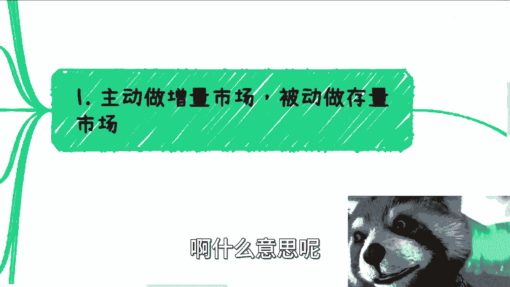
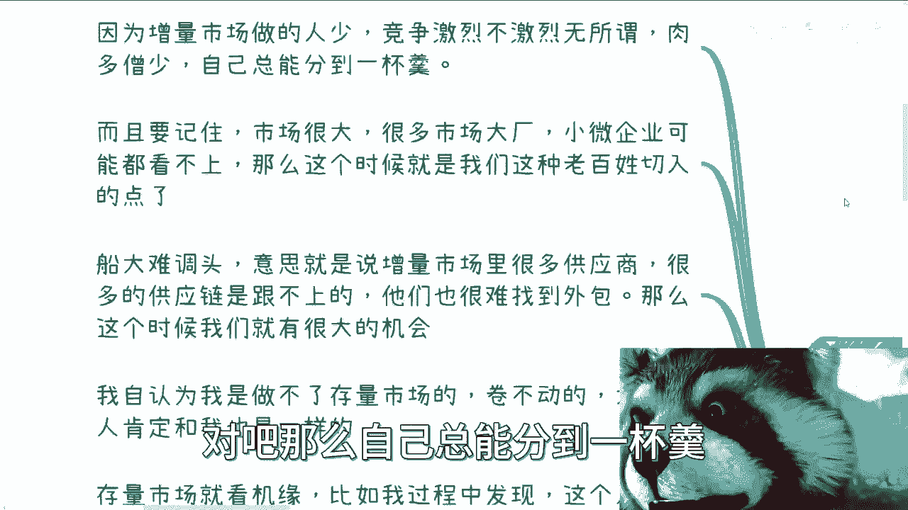
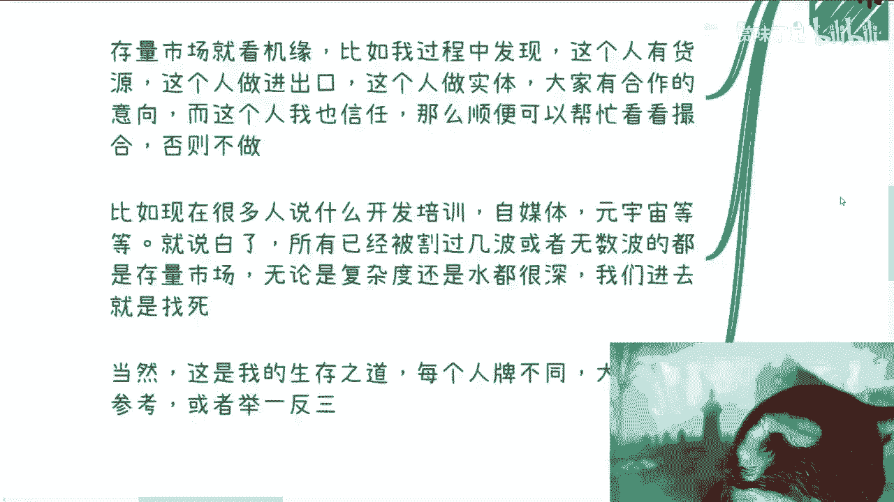
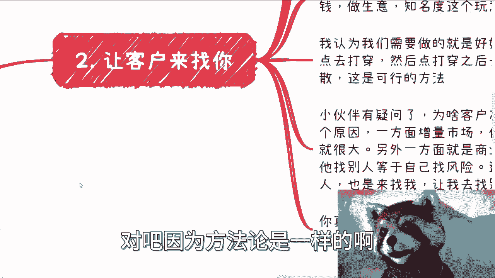
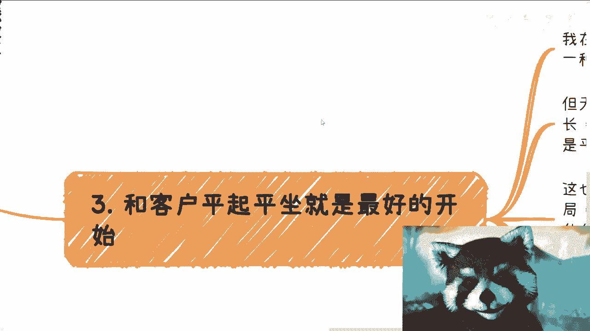
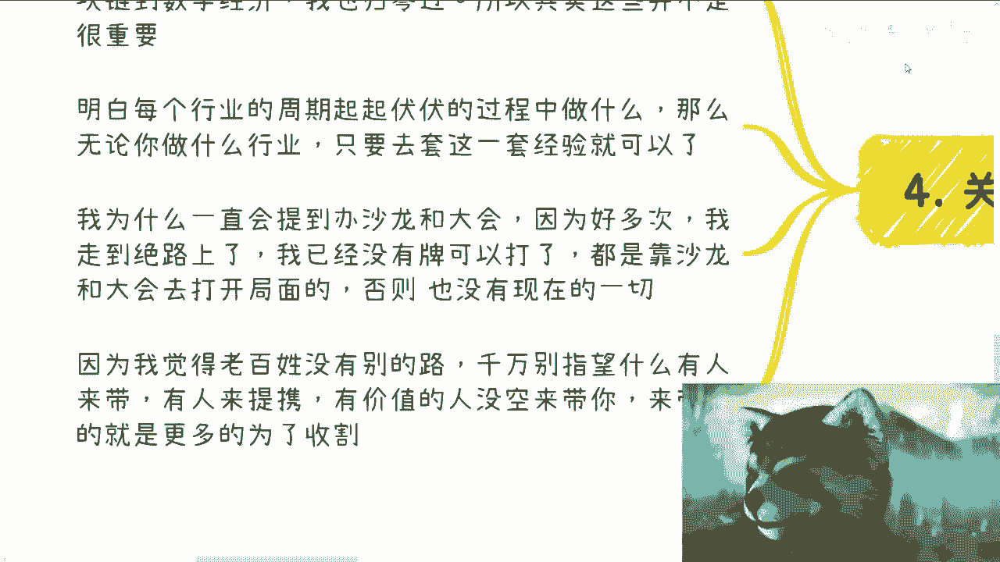
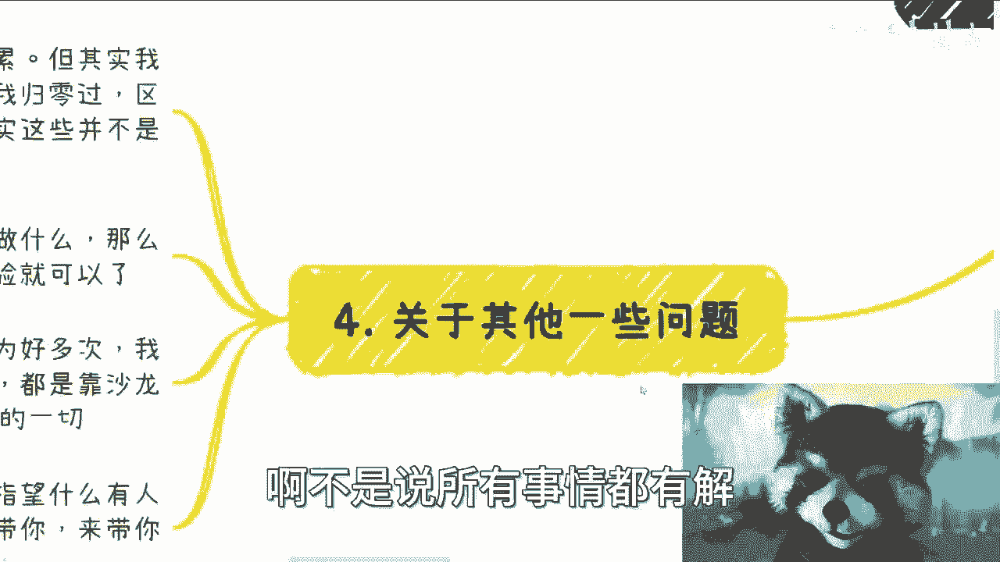

# 高性价比赚钱规则篇1-要让客户来找你-要让客户开始就尊重你---P1---赏味不足---BV1Kj4




在本节课中，我们将探讨如何以高性价比的方式开展业务。核心在于转变思维：从主动寻找客户变为让客户主动找你，并从合作伊始就建立平等、相互尊重的关系。这对于资源有限的普通人而言，是一条更可持续的路径。

## 1. 主动选择增量市场，被动参与存量市场


上一节我们概述了课程目标，本节中我们来看看第一个核心观点：市场选择策略。



简单来说，增量市场是正在成长、有大量新机会的领域；存量市场则是竞争激烈、格局相对固定的领域。对于手上“牌不多”的普通人，从零开始时，应优先选择增量市场。

**公式：个人起步策略 ≈ 优先（增量市场）**

原因如下：
*   **竞争相对缓和**：增量市场参与者较少，总体是“肉多僧少”的局面，个人更容易分得一杯羹。
*   **存在大量“缝隙”机会**：许多商业机会的规模（例如单笔金额在100万以下）对大公司而言缺乏吸引力，对小微企业也可能看不上。这些“边角料”正是普通人可以切入的点。
*   **传统供应商存在惰性**：增量市场中的现有供应商可能因已赚得盆满钵满而缺乏持续创新的动力，这为新人提供了机会。

相比之下，存量市场（如已被反复炒作过的开发培训、自媒体等领域）复杂度高、水很深，普通人贸然进入风险很大。

**个人实践参考**：我主要专注于增量市场。对于存量市场（如跨境电商），我仅在有特定机缘（如遇到可信的合作伙伴）时才会被动参与，绝不会主动投入去“内卷”。

当然，这是基于我个人情况的生存之道。每个人的“牌”不同，但方法论可供参考，请务必举一反三。

## 2. 核心策略：让客户主动来找你



理解了市场选择后，我们来看看如何在实际操作中占据主动。核心策略是：打造一个让客户主动来找你的业务模式。



很多人误以为这需要很大的名气或知名度。其实不然，尤其是在面向企业（B端）、政府（G端）的业务中。知名度更多用于收割个人消费者（C端），对于B/G端业务，对方更看重的是你的专业能力、可靠性和稳定性，而非网红名气。

那么，如何让客户主动找你？关键在于：**从单点打穿，建立信任，然后通过口碑扩散**。

以下是实现这一点的两个核心原因：

1.  **增量市场的特性**：在增量市场中，客户寻找合适供应商的难度较大。由于“肉多僧少”，你被找到的概率本身就很高。
2.  **商业的核心是可信与稳定**：对于企业、政府或高校客户而言，寻找新的、不熟悉的供应商意味着额外的风险和试错成本。如果他们已有一个可信赖的合作伙伴（即你），那么即使有新需求，他们也更倾向于先咨询你，甚至委托你来寻找或把关其他资源，因为他们相信你的专业判断。

**实践结论**：不需要海量客户。只要服务好少数几个核心客户，通过他们建立口碑和信任链，就足以获得稳定的业务和可观的收入。

## 3. 合作基础：与客户平起平坐



当客户开始主动找你时，如何开启合作？本节我们来探讨合作的正确起点：平等与尊重。

在我的商业逻辑中，客户来源主要是口碑介绍，或以专家/讲师身份结识。无论对方是局长、校长、企业高管还是创始人，我们在地位上或许不平等，但在心理层面必须保持平起平坐、相互尊重。

**代码描述合作心态**：
```plaintext
if (合作机会) {
    心态 = “相互尊重，平等对话”;
} else {
    心态 = “不做也无妨，绝不跪舔”;
}
```

我从不为了生意而去应酬或跪舔客户。我的逻辑是：离开谁地球都转。如果合作不能建立在相互尊重的基础上，我宁愿不做这笔生意。市场上总存在能够相互尊重、平等赚钱的机会。

这并非因为我有特殊的背景。恰恰相反，正因为我并非“根正苗红”，且业务横跨个人、高校、企业和政府，我才能看到并践行这种模式。商业生态中需要多元的角色。


## 4. 从零开始的实践与突围

你可能会说，这些方法建立在已有积累的基础上。但事实上，我也多次“归零”过（例如从移动互联网转向区块链，再转向数字经济）。每个行业的周期起伏规律是相似的，关键在于掌握一套适应变化的方法论。



当我无路可走、无法突破时，我最核心的突围方法是：**自己主办沙龙或大会**。

例如，2018年我在北京花了10万元主办了一场大会，吸引了700多人参加。这次活动为我带来了关键的资源沉淀和人脉链接，其影响持续至今。对于普通人而言，当你叫天天不应、叫地地不灵时，主动创造连接点（如办活动）可能是打破僵局的有效方式。有价值的人没空主动带你，而主动来带你的往往另有所图。

## 5. 总结与思考



本节课中我们一起学习了高性价比赚钱的初始规则：

1.  **市场选择**：主动进攻**增量市场**，被动参与**存量市场**，避开红海竞争。
2.  **获客策略**：核心是**让客户主动找你**。通过服务好少数客户，建立信任，实现口碑扩散，而非盲目追求知名度。
3.  **合作姿态**：始终坚持与客户**心理上的平起平坐**和相互尊重，这是健康、可持续合作的基础。
4.  **突围方法**：在困境中，可以考虑通过**自办沙龙或活动**来创造节点，打开新局面。

高性价比赚钱，我非常看重的是：**空余时间、年度工作量与收入之间的比例**。我的目标是尽可能用更少的主动出击，获得更稳定的优质回报。这套思路的核心在于提升个人业务的吸引力和稳定性，而非陷入无尽的奔波与内卷。

希望这些思路能对你有所启发。请根据你自己的“牌”（资源、条件），灵活运用并举一反三。如果你有具体问题或想咨询，可以整理好你的情况和问题后联系我。

---
**课程名称**：高性价比赚钱规则篇  
**课程编号**：P1  
**内容来源**：赏味不足 - BV1Kj41147vm