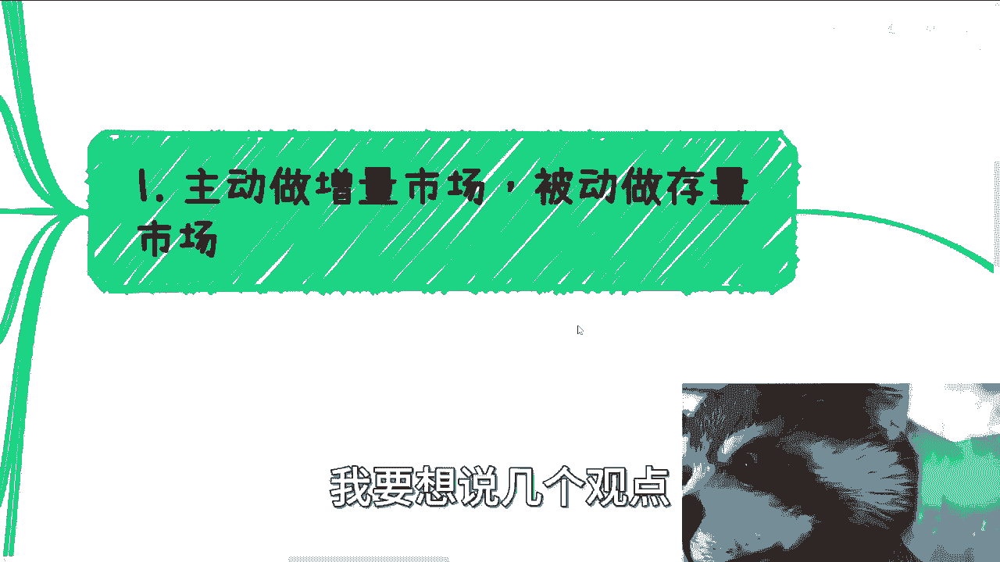
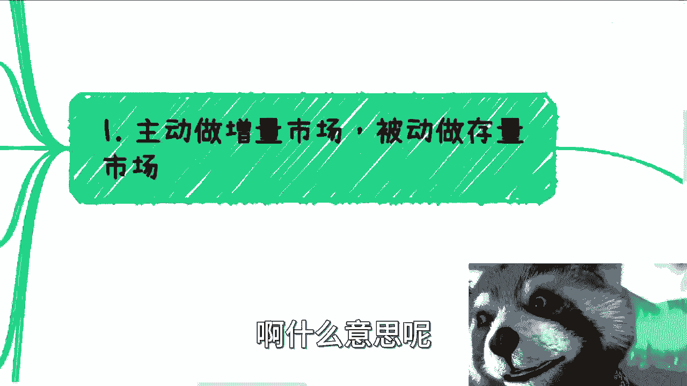
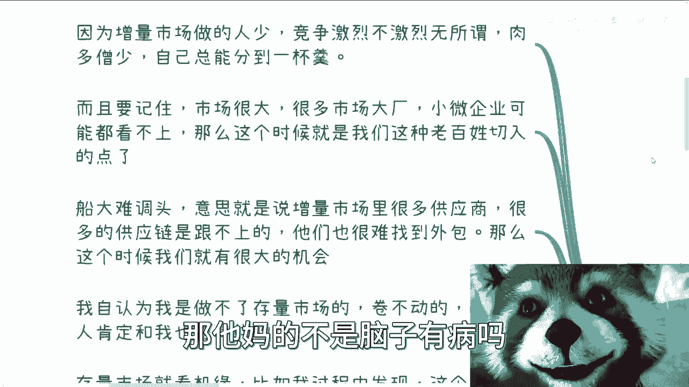
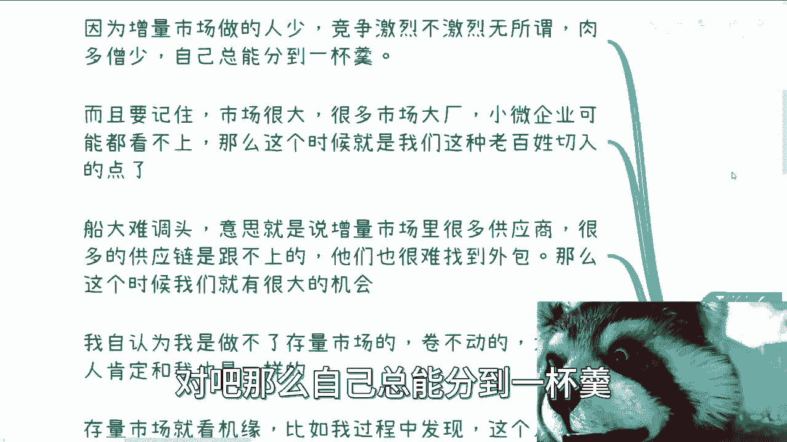
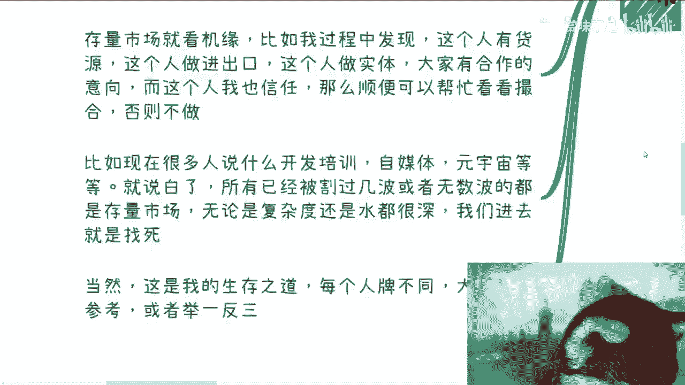
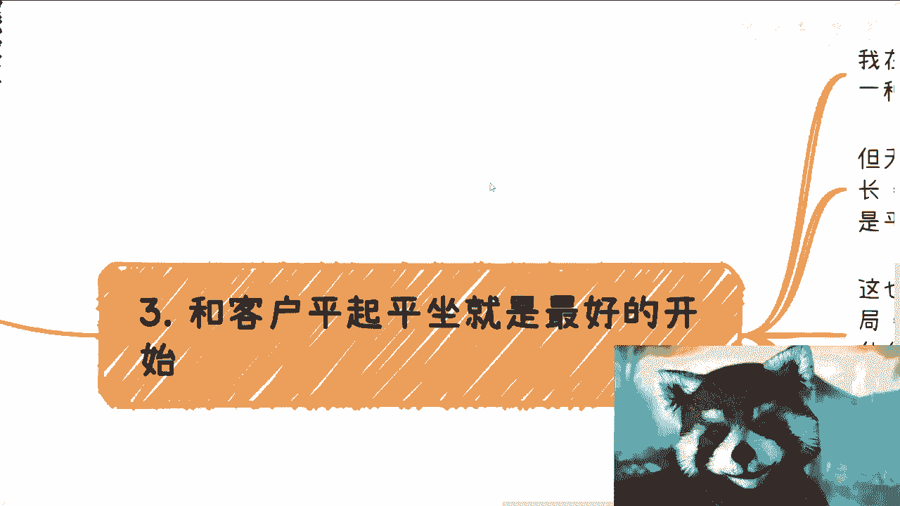
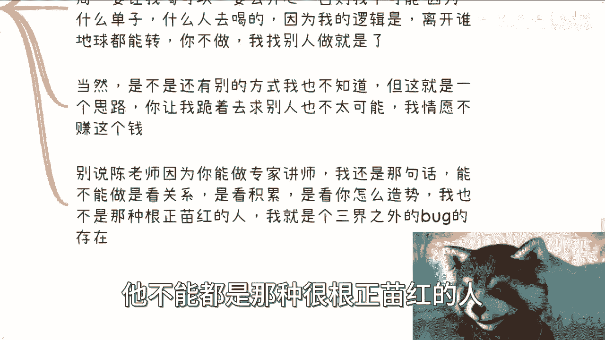
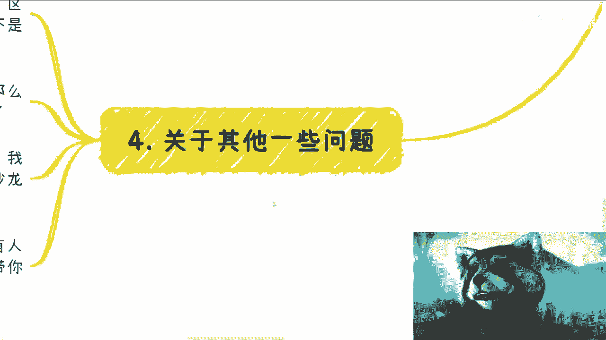
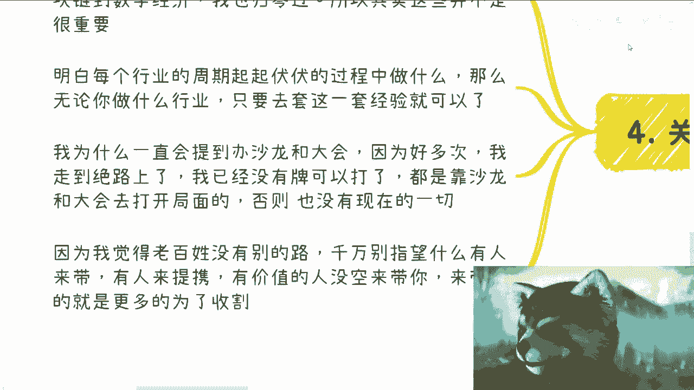
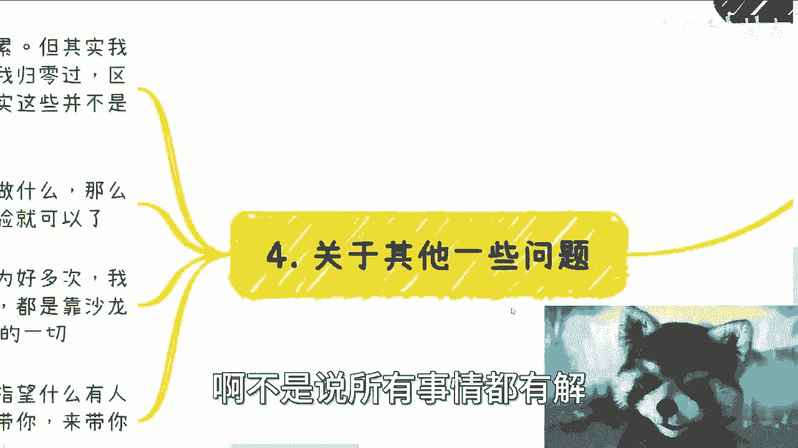

# 高性价比赚钱规则篇1：要让客户来找你，要让客户开始就尊重你 - P1 - 赏味不足 - BV1Kj41147vm

哈喽大家好，今天又是裸眼3D的一天，嘿我这我我我真的很喜欢这个嘿这么大的啊，呃我开一个新的啊，叫高性价比赚钱规则篇啊，呃最近聊下来呢，我觉得这个东西是应该跟大家讲一下，我有很多人嗯怎么说呢，不得其道啊。

不得其道嗯，看啊，首先呃我觉得在一里面啊，我要想说几个观点。

第一个是主动呢要去做增量市场，被动呢做存量市场啊，什么意思呢。

就是说其实很简单，你想啊你包括我在内对吧，你说大家都明白一个道理啊，老百姓路很少对吧，你手上牌不多对吧，那既然就像昨天我咨询一些人，也是的，就是我就跟他们说，我说既然你们都要从零开始的对吧。

因为有些人他做土木什么设计啊对吧，做别的东西他说有什么路，那我说没有啊对吧，然后他都已经转行了，就是已经跨赛道了，你知道吗，那我说你都已经跨赛道了，那对你来讲，你手上其实只有一个学历。

而且还是个专业不对口的学历对吧，那我说你已经跨赛道了，那你你那你既然从零开始，你不得去选一些增量市场嘛，对吧哦你你你选择从零开始，你还选择存量市场，那他妈的不是脑子有病吗。

啊因为增量市场做的人少，竞争激烈不激烈无所谓，永远是肉多僧少的，当然它是一个周期性的对吧，那么自己总能分到一杯羹。

而且你要记住市场呢很大，很多市场就你们记住很多的商业的切入点，你不要去想着说有没有人跟你竞争，你知道吗，就是因为很多的商业切入点啊，你们但凡去了解过，你们就会知道，就是呃他要看单量的，就是说有超过。

比如说100万，而低于100万或者低于150万，很多大厂是不接的啊，为什么不接，因为他们的销售去做了这个东西，他们没提成的那么去做是吧，那么这个时候就是说很多的这种叫什么，就边角料。

或者说啊这个残渣剩饭对吧，那么小微企业可能也看不上，那么这个时候就是我们这种老百姓去切入的，这么一个点了，你其实就是整个的一个面其实很广很广，不是说大家只就只认识到比如说这么些东西啊。

那么另外一方面呢就是说在商业层面里面啊，什么意思呢，意思就是说增量市场里面也会有很多供应商，没有错，但是这些供应商呢它是跟不上整个技术发展，也跟不上时代发展的，因为这些供应商已经赚得盆满钵满了。

而且他们其实已经过得很滋润了啊，那么这个时候你想嘛，他们会时时刻刻跟着整个增量市场变化吗，不会的，那么这个时候就变成了，我们又是一个很大的机会，呃，我自认为而且另外一方面，你看啊。

我自认为我是做不了存量市场的，我卷不动，我没这个能力卷，而且我认为大部分人肯定跟我一样，哎呀还不如我对吧，那么你增量市场就要看机缘，比如说啊我过程当中发现，比如说这个人有货源，这个人做清舒服啊。

这个人做实体啊，大家有合作意向，那么而且呢同时呢，这个人我觉得他的商业思维啊，他的各个方面是可信的，而靠谱的，那没问题，那我顺便可以帮忙看看有没有撮合对吧，那么这个时候打个比方，你们说你们问我哎老师。

你最近在做什么啊，我说我在做跨境电商啊，我在做进出口贸易对吧，诶怎么你们又在想了，唉吕老师怎么又去做存量市场了，对不对，那其实也并不是就是这种东西，就是看机缘巧合的啊，你你要能做，那我就顺便做一下。

但是这个东西就是我被动的，我不可能主动跑过去，哎，哎我参加个什么什么跨境贸易的，什么什么峰会对吧，我参加个什么会，我要去找一下，不会的，我做不了呀，我没这个能力做，而且太卷有毛病吗，这不是嗯对吧。

那么比如说现在很多人说什么开发培训啦，自媒体啦，元宇宙啦等等等，就说白了在我的在我的三观里面啊，所有的已经被割过几波或者无数波的，这种都是存量市场，我不管它叫什么啊，对于很多人来讲啊。

原来说还是增量市场啊对吧，怎么样怎么样怎么样，我不care的，为什么，因为我知道这个东西，政府高校企业是被勾过多少波的，它对我来讲就存就存量市场就这么简单对吧，而且这个存量市场我也参与过。

当他是增量市场的时候，我也做过，有什么关系呢，我懂了，他要接下来要真的能做，我也能做，没什么关系，但是他不在我的存量市场的范围内，那么这些存量市场无论是复杂度还是水，都很深啊。

你说大部分老百姓贸然进去跟找死没什么区别，做不好的。

那么当然这个是我的生存生存之道啊，每个人牌不一样啊，但是我希望大家可以参考，需举一反三对吧，因为方法论是一样的啊。

那么第二点就是让客户去找你，我发现很多人咨询我说，哎刘老师是不是很忙啊对吧，我不忙，我空中狗啊，我他妈从来没这么空过对吧，那大家觉得我要去找客户，到现在我跟你讲到，也不是到现在不到疫情前。

可能在前几年吧，基本上就不用找了，为什么，因为客户会介绍客户，同时客户有啥需求也会自己来找我，那么大家觉得呢要让客户来找自己，需要很大的名气，或者很想需要去打响知名度，我跟你讲，真的不是啊，为什么。

因为你要打响知名度，你要更多的名气，其实是为了收割C短，因为企业端跟政府端，他妈的根本就不关不关心这件事情，你知道吗，就是你今天是个网红，你觉得你觉得国家比如说地方政府对吧，省厅会来找你吗。

啊比如说你要像我一样去做个咨询，做个顾问，他会来找你吗，他会因为你是网红来找你吗，不会的，这不是，这不是这个叫什么商业，不是这个社会的运作之道啊，你知道吗，就是说如果你要单纯赚钱做生意。

知名度这个玩意儿没卵用，而且啊我可能说咱咱在这边说的，说说句这个不太说的话啊，就是说你要明白你名气越大，你的在对方手上的把柄越多，或者我再退一步来讲啊，什么意思，就是你越不敢收钱，你想想看啊，对吧啊。

那么我认为我们需要做的呢，就是好好做好一到两个客户啊，从单点去打穿，然后单点打穿之后再通过这一到两个点扩散，这个是我觉得老百姓唯一可行的方法，没有别的方法了，因为你只有先跟别人搭好关系对吧，产生信任。

你才能往下走啊，你才有可能往下走，就有这个概率啊，那么小伙伴有疑问，他说为啥客户有需求就一定会找你，我给你两个原因很简单，第一增量市场他要去找别的供应商，难度很大，当然他不是说一定要找我，他可以找别人。

但是由于这件事情，他有一定很大的概率能找到我，为什么，因为肉多僧少啊对吧，另外一方面，那就是商业的核心，可呃核心就是可信，更稳定，他找别人有越他越是政府，越是企业，越是高校呃，他要去找别人。

等于自己在跟自己过不去，他找别人等于自己在找风险，等于节外生枝，退1万步来讲，他要找别人，就算他真的要找别人，他也会来找我，让我找别人，为什么，因为我能够把关啊，他们不懂啊，我是能把关的人。

而且他相信我就这么简单啊，你真要赚钱，我给你讲一只手，什么叫一只手就五个，我给你讲一只手都有客户过来，真的过来，一年小几百万，我觉得是很稳的，你还要什么，我的，还要什么上衣啊啊上天啊，唉真的是对吧。

然后三就说跟客户平起平坐是最好的开始。

在我的商业逻辑中啊，客户来源，一种是客户相互介绍，一种是我以专家讲师的身份过去认识，但无论哪种，无论对方是谁，哪怕是听局对吧，包括什么投城投的这些投资对吧，包括你比如说高校校长，企业高管创始人。

我跟对方也许那个地位上是不平等的，但是在心理上大家是平起平坐的，至少是相互尊重的啊，而不是说我跑过去就是跪舔对方的，不好意思，绝对不可能啊，这是为什么，我一般是不可能去什么应酬，什么酒局，你要让我喝。

可以只有一种可能性，就是我开心啊，否则你说我是不可能，因为说啊今天我要去做个什么单子啊，我去找一个人喝，我的逻辑是什么，逻辑就是离开谁地球都能转，不做，我找别人走干什么了，我凭什么给你喝滚，对不对啊。

那当然是不是还有别的方式，我不知道啊，我不知道，那我只能知道，我知道啊，但这就是只是一个思路，你让我跪着去求别人，不可能啊，我前面不赚这个钱，因为什么，因为我知道有很多地方是大家可以相互尊重。

相互平等去赚钱，我为什么找你啊，滚滚有多远滚多远对吧，那别人要说了，他说啊，那陈老师，我跟你讲，我还是那句话，能不能做是看关系的啊，不是看你什么别的东西啊，能不能做做，看你关系，看你积累。

看你怎么造势对吧，你们回过头去看一下，我昨天说的那个这个10万的，那个那个石头的那个故事对吧，就看你怎么造势对吧，我从来就不是那种根正苗红的人啊，我要是根正苗红的人，我也不可能来跟你们讲这些东西对吧。

就是说正因为我是游离在三界之外，然后业务又同时贯穿了个人高校企业政府，所以说我能知道这些对吧，或者说可能在整个商业当中，就是还是需要有我这样的人存在，他不能都是那种很根正苗红的人对吧。

你们想想为什么啊。

那么关于一些其他问题，小伙伴说啊，他说吕老师啊，这是这是因为以前你有积累，但其实你要明白我归零过多少次啊，移动互联网和区块链我归零过，区块链到数字经济，我归零过，你要知道这些里面的积累。

这些里面的关系很多是用不了的，因为他不互通，或者来说我积累的关系，他也是有层级的，你像我以前在移动互联网积累的关系，简直他妈low low到爆，在我看来就是他妈过家家，你现在去找他们有用了没有用的。

你在我看来，现在他妈就是一帮loser对吧啊，明白每个行业的周期起起伏伏的过程要做什么，那么无论你做什么行业，你只要去套这套经验，套这么一套，就是说你知道怎么样的一个情况就知道了，因为整个大趋势。

它的整个这个大趋势变化，每个周期其实是一样的，没有区别的啊。

那么你你说我为什么一直会跟大家去着重的提，到办活动和沙龙，是因为很多次我走到无路可走了对吧，就是我已经也不知道接下来怎么走了，而且我也尝试过各种各样的方式，突破不了，那怎么办呢。

就是我就是靠沙龙跟大会去打开局面的对吧，我最后自办就是2018年，当时10月份在北京，我花了10万块钱办的，来了700多人，但是这个会做给我带到带来了很多很多东西，一直到今天，我有很多的沉淀。

都是靠那个会沉淀下来的，否则没有这现在这一切啊，因为什么，因为我觉得老百姓没有别的路走啊，就像很多人我相信尝试过就明白我说的对吧，你叫天天不灵，叫地不应的，你找谁谁不，你的不就这这不就是现状吗，对吧。

你你你指望别人有人来带你，人来提醒你，有价值的人，我跟你有价值的人没空来带你，来带你的，就是为了收割你，不就这么简单吗，啊不是说所有事情都有解。

也不是说所有事情，就是就是一定是就是说有这么个路，因为大家要明白，就自古至今，他就这个样子的对吧，那如果说你说啊老百姓都能找到路啊，大家都都有录大家的这个概率都很高，那不会到今天这个样子的呀对吧。

所以说你会发现两边其实都是挣扎，就你考本硕博在那边往死里卷也是挣扎，但挣扎呢主动权不在自己手上，而且赚不到钱，商业这边呢你你你也是挣扎，就是从老百姓往往商业里面切哦，削尖了脑袋往里面切。

但是你切进去之后呢，很有可能是你稳定性比较高，同时呢你的收入还比较高对吧，你两边都有它的好处，也都有它的弊端，但是你到底想要做什么，这个就是你活一辈子，每个人活一辈子自己要想清楚的事情啊，好吧。

所以说呢就是说嗯我觉得高性价比赚钱，在这当中就是我很看重的是什么，就是你每天空余时间有多少，你一年干多少活，以及你一年能赚多少钱啊，这个是我非常看重的，所以说基本上你说我你让我主动出去，很难很难很难。

除非是什么，除非就是我任何一条路都走都走不了了对吧，因为对我来讲是这样子的，我的上限，我知道天花板我是可以去调这个天花板的，你知道吗，就是我知道每个天花板我可能做什么事情，底线我也是可以调的啊。

只不过就是说可就说看我愿不愿意做，但是我会在没有路走的时候，我会不停的去调这个东西，直到我调的时候发现，如果我还走不了哈，那没办法，那我只能出去啊，主动出击啊，但是这种情况比较少，好那就先这么着吧。

后面的话我会在想想啊，大家有什么想知道的，也可以那个留言，那个评论区留言给我，或者私信给我，好吧行，然后有什么就是呃呃这个要咨询呢，好吧，你们整理好问题，整理好自己的牌好吧，私信再咨询我。

就这样就这样啊。