# 高校教育篇：影响教育的内部因素问题（P1）🎓

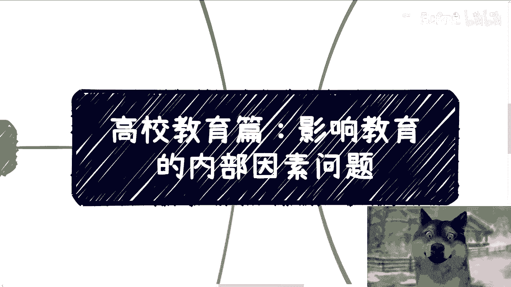

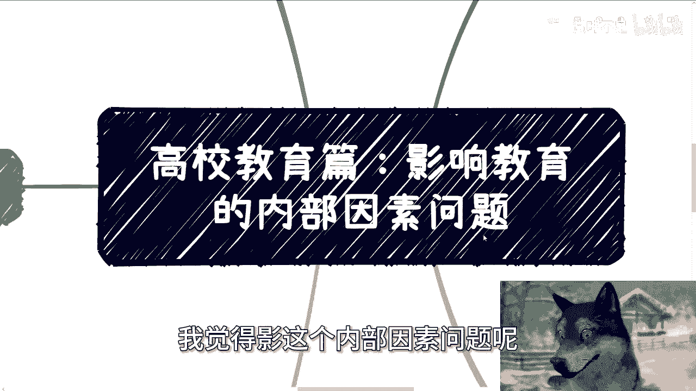

在本节课中，我们将要学习影响高校教育的核心内部因素。我们将探讨教师角色、教育理念以及机制问题，并分析这些因素如何导致教育与社会需求脱节。

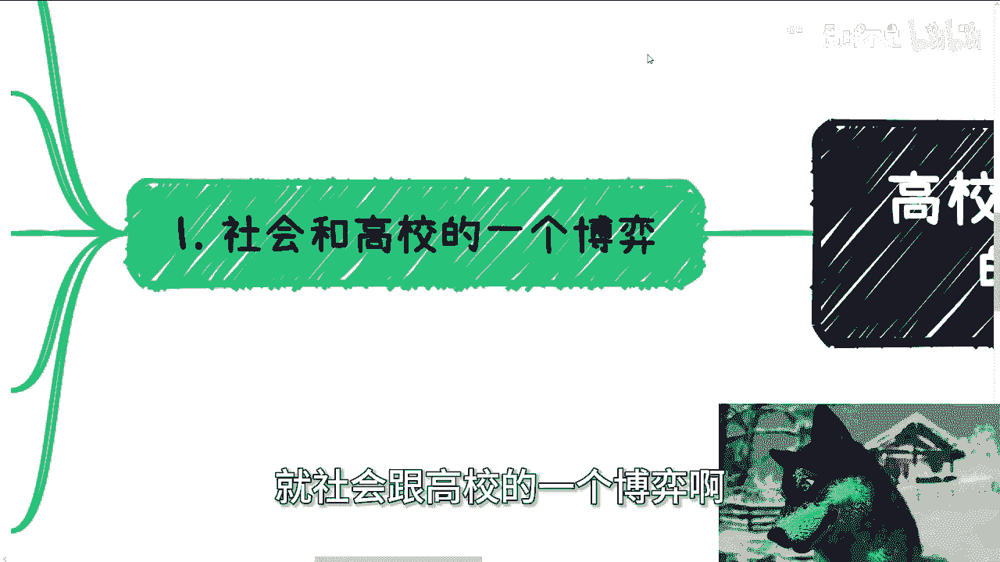

---

上一节我们介绍了课程主题，本节中我们来看看第一个核心矛盾：社会与高校的博弈关系。

曾经，高校在教育内容上领先于社会。而现在，情况发生了逆转，社会的发展速度遥遥领先于高校。许多人认为内部因素包括课程设置、选修机制或交换生项目等。然而，在我看来，这些都是次要的。

如果核心矛盾不解决，任何流程或机制上的调整都将是无效的。人类社会的核心归根结底在于**人**。这里的人指的是校长、院长、教授和授课老师，我们统称为学校老师。

学校老师如果理念固化、不与时俱进，就会导致整个教育变得形式化甚至落后。毕竟，在学生眼中，老师常常被认为是权威和全能的。这种认知差距会带来问题。

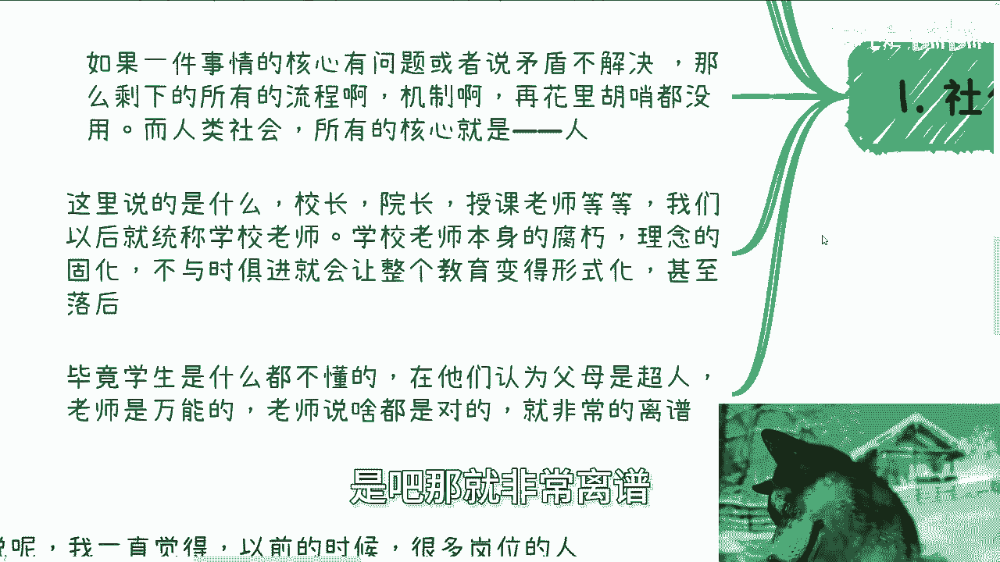

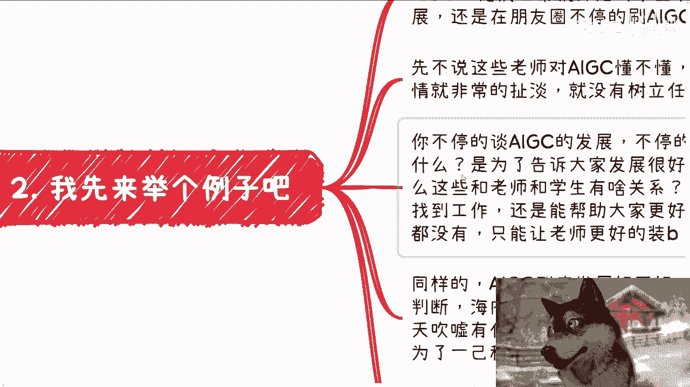

---

上一节我们讨论了教师权威可能带来的问题，本节中我们通过一个具体例子来审视教师行为的影响。

近年来，许多高校老师开始追逐AIGC（人工智能生成内容）潮流。他们日常向学生宣扬AIGC的好处与发展，在朋友圈分享效果图，讨论新工具和趋势。

从我的角度来看，且不论这些老师是否真正懂AIGC，其行为本身就存在问题。他们没有树立正确的榜样。

不停地谈论发展和展示效果图，目的是什么？是为了展示发展前景吗？如果是，这与老师和学生有何具体关联？它能否帮助学生更好地就业或赚钱？如果不能，那么这种行为在我看来，只是为了老师个人装点门面，让学生盲目崇拜，却一点也不接地气。

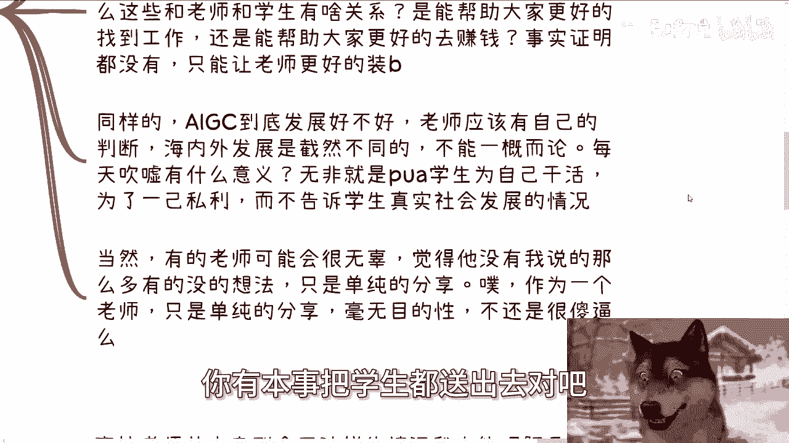

老师对AIGC的发展应有自己的判断。海内外情况不同，不能一概而论。将海外如OpenAI的案例生搬硬套过来，告诉学生“发展很好”，却没有实际用处。除非老师有能力把学生都送到海外去。

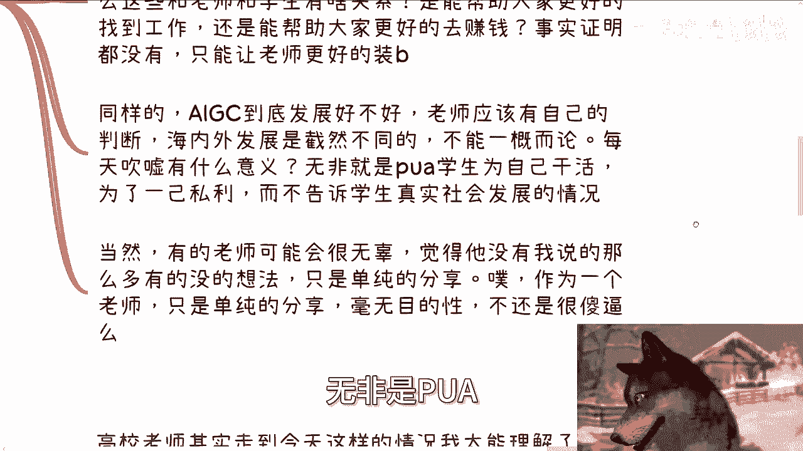

每天吹嘘没有意义，这无非是PUA学生为自己干活。

为了个人私利，而不告诉学生真实的社会发展情况。当然，可能有老师觉得无辜，认为自己没有私心，只是单纯分享。

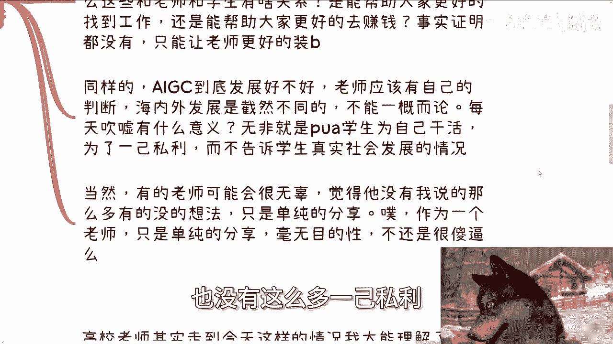

我想说，如果你作为一名老师，做事毫无目的性，你就是在教导学生做事也毫无目的性。这是你应该教的吗？

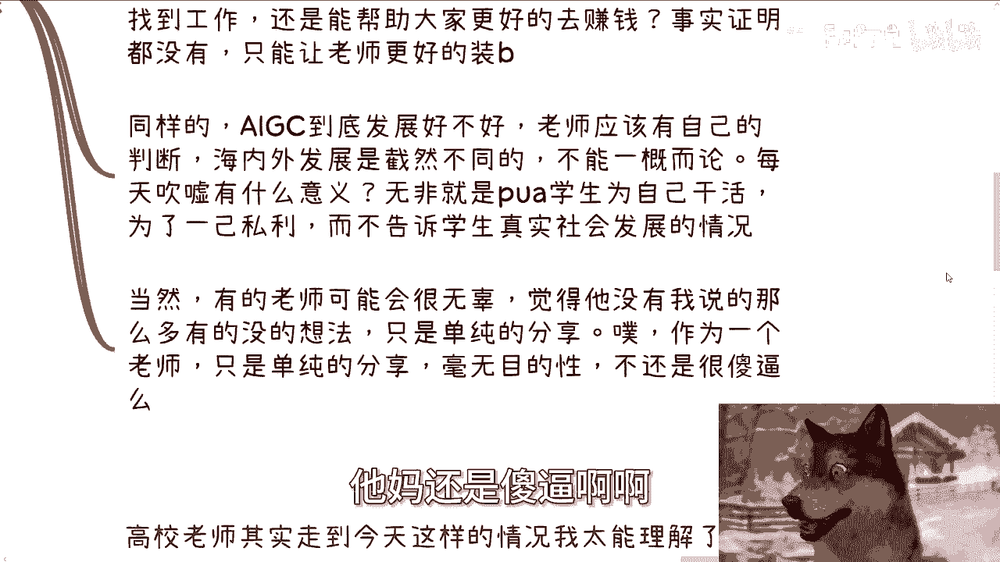

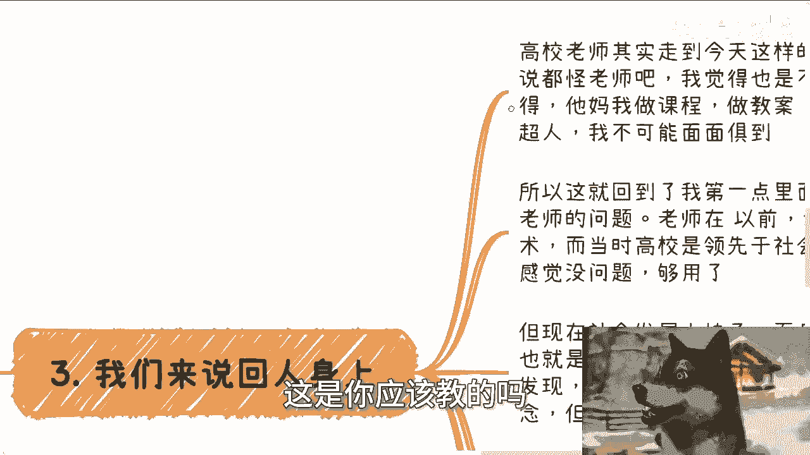

---

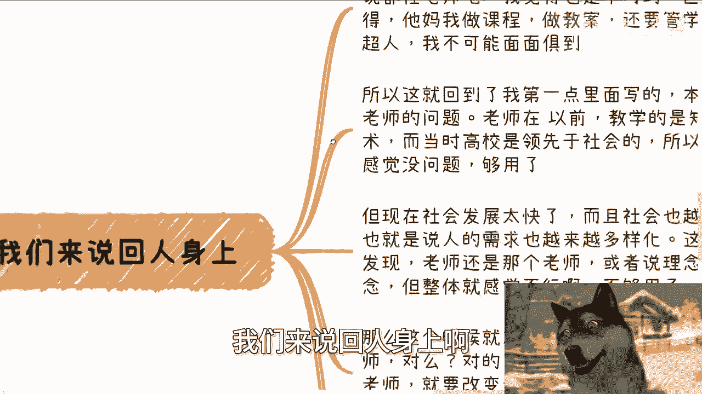

上一节我们分析了教师行为案例，本节中我们回到“人”这个根本因素上，探讨问题根源。

高校老师走到今天这个局面，原因复杂。全怪老师是不对的，老师也会觉得：做课程、写教案、管学生，面面俱到不可能。

这回到了第一点：这不单是老师的问题。以前，老师教授的是知识和技术，当时高校所教内容领先或适用于社会，所以大家感觉“够用”。

但现在社会发展太快，且越来越多元化，人的需求多样化。此时就会发现，老师还是那个老师，理念还是那个理念，但感觉“不够用”了。

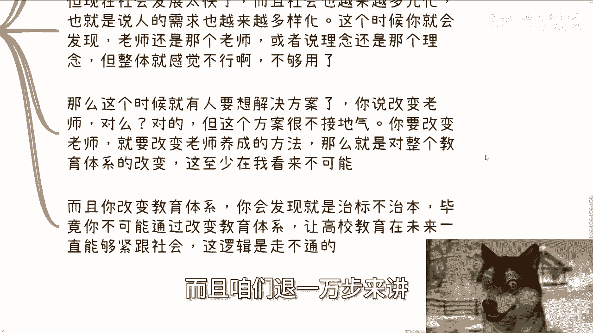

于是有人提出解决方案：改变老师。这个方案不接地气，因为改变老师意味着改变教师的培养方法，即改变整个教育体系。这在我看来是不可能的。

退一万步讲，即使可能，改变教育体制也是治标不治本。你无法保证通过体制改变，能让高校教育在未来一直紧跟社会。这个逻辑无法成立。

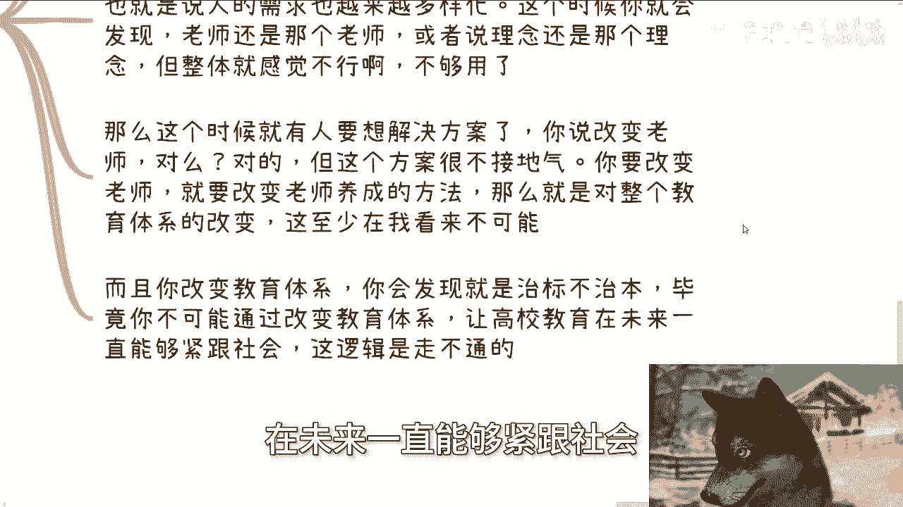

---

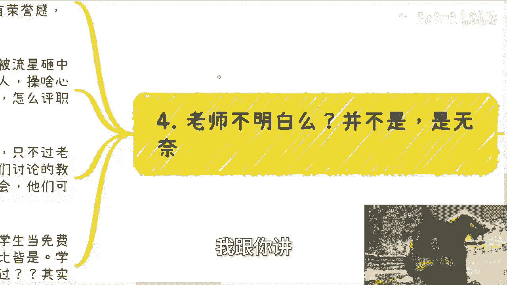

上一节我们探讨了改变教师的可行性，本节中我们来看看教师群体的认知现状。

老师不明白问题所在吗？并非如此。总有人是明白的，大家智商差不多。但很多人是无奈的，**屁股决定脑袋**。

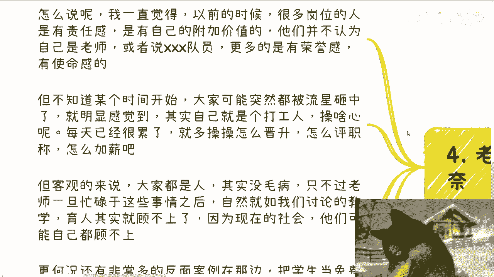

就像我以前讲的，我之所以能讲这些，是因为我“隶属于三界之外”。如果我今天在某个公司、高校或地方政府任职，我就不敢讲了。

我一直觉得，以前很多岗位的人有责任感和附加价值，他们不只视自己为老师或某单位成员，更有荣誉感和使命感。但不知从何时起，大家突然意识到自己就是个“打工人”，操那么多心干嘛？

现在很多人每天考虑的是如何晋升、评职称、加薪。客观讲，大家都是人，这没什么毛病。但老师相对于其他职业，本应更有责任感。如果只忙碌于这些，自然就顾不上教育、教学和育人。因为现在社会，他们自己可能都顾不上。

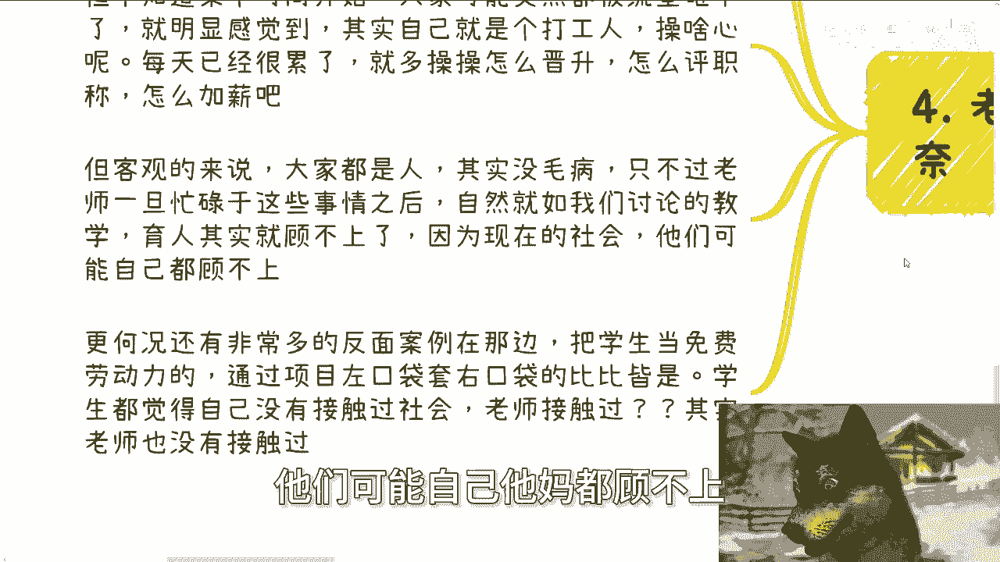

**泥菩萨过江，自身难保**。更何况还有很多反面案例：把学生当免费劳动力，通过项目“左口袋掏右口袋”比比皆是。学生觉得自己没接触过社会，反过来问：老师接触过社会吗？老师接触过产业吗？老师接触过行业吗？接触个屁。

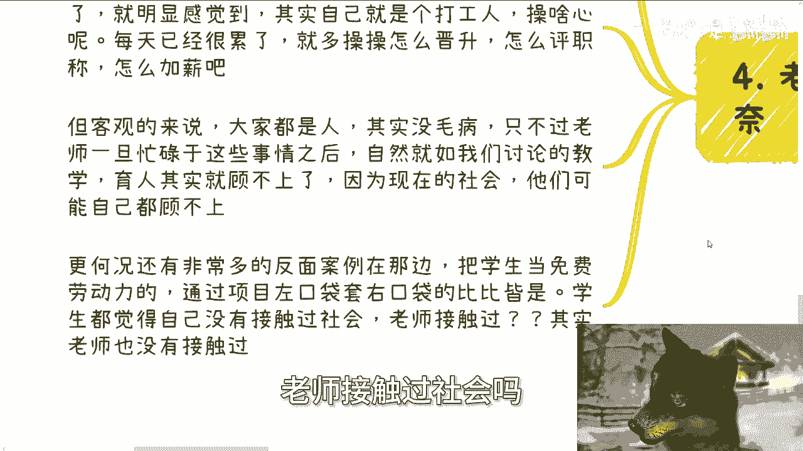

---

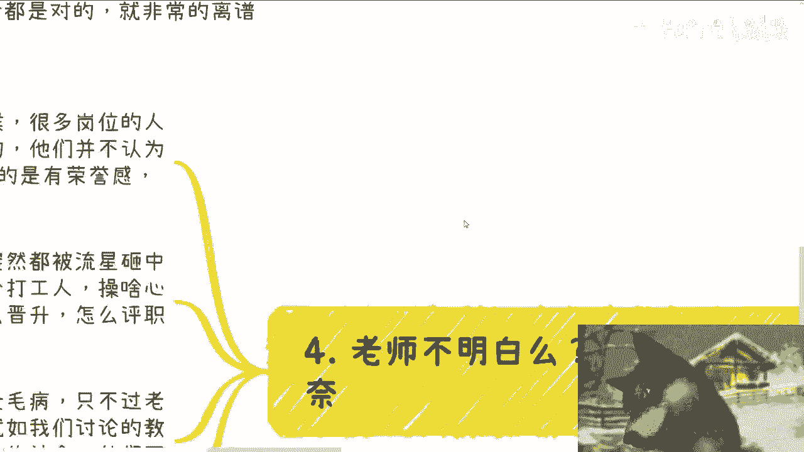

上一节我们讨论了教师的现实困境，本节中我们来看看内部与外部因素叠加的影响，以及改变的尝试。

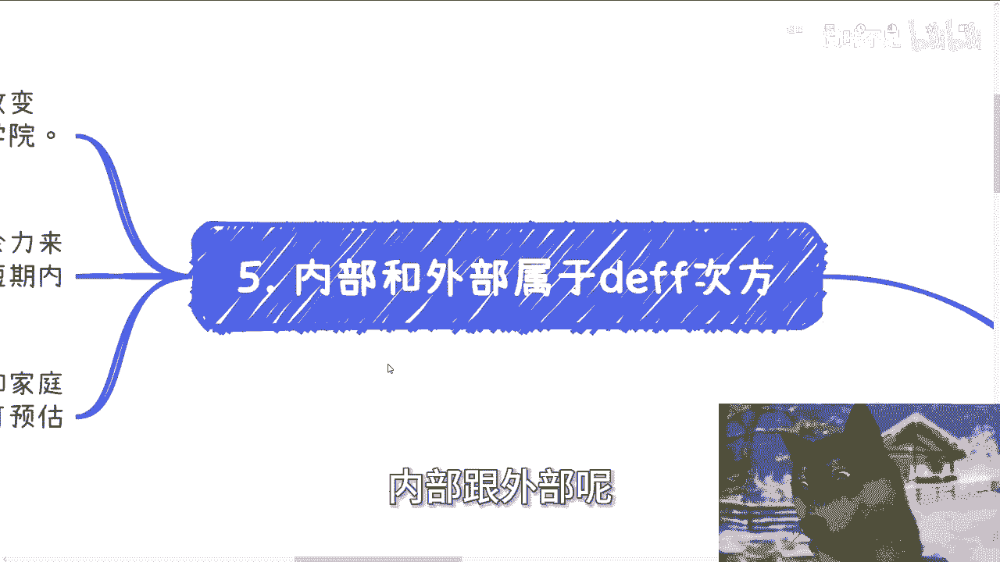

内部与外部因素叠加，已属于 **Debuff的次方**（负面影响成倍增加）。

说实话，改变尝试过吗？很多人不了解，从政策上、中央层面早就提过改变，例如**产学研**、**产教融合**、**产业学院**、**职教本科**等。但结果呢？原因我们不清楚，可能是执行层问题，也可能是中央推动力度不够，我们不去猜测。

现在经济紧张，全球形势严峻，更不会有余力来重点管教育了。高校教育基本上已经定型，短期内很难改变。这个“短期”我认为至少以**10年**为一个周期。

但10年也是时间。所以我认为，目前的状况不单会让许多大学生和家庭变成“炮灰”，更会对未来长远发展产生不可预估的影响。

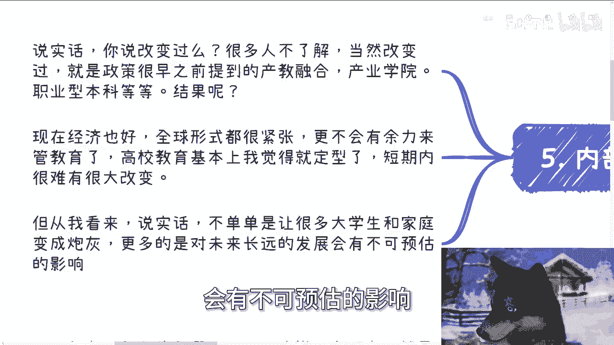

因为不管教育现状如何，社会总要向前发展，世界洪流不会停下来等任何人。5年、10年后，很多人会因缺失这部分教育而影响一生。有的人聪明、悟性高、野蛮一点，可能走得出来，但大部分人不行。

---

本节课中我们一起学习了影响高校教育的核心内部因素。我们分析了社会与高校的博弈、教师行为案例、问题根源、教师群体现状以及内外因素叠加的影响。核心结论是：以“人”（教师）为核心的观念固化、与社会的脱节，以及系统性的激励错位，是导致高校教育形式化、落后于社会需求的关键。短期内，这种状况很难有根本性改变。

---

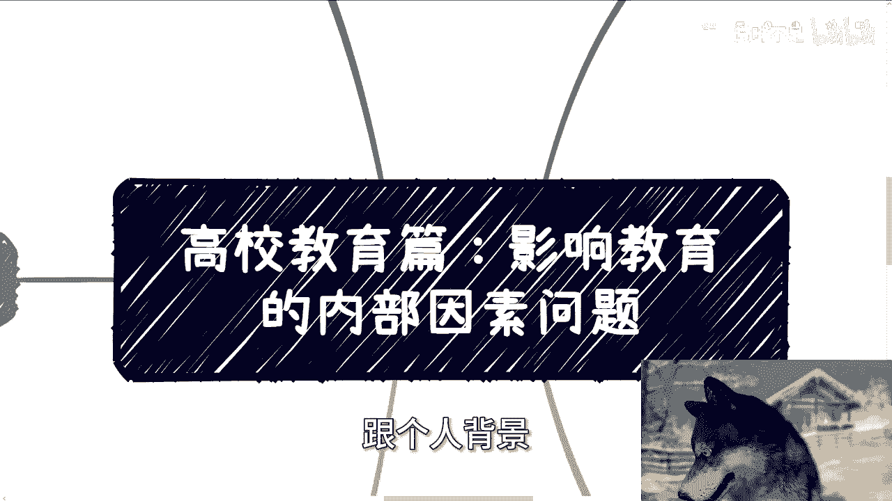

如果你在职业规划、工作、商业规划、副业、赚钱、合作、合同、分红、商业计划书、白皮书、估值、融资等方面，希望获得更多建议或少走弯路，可以整理好对应的问题与个人背景。