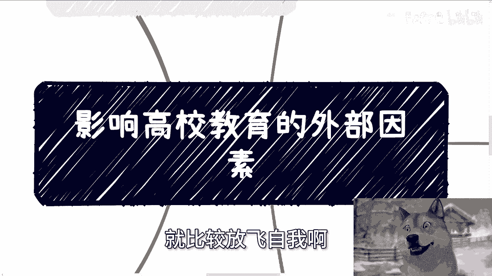
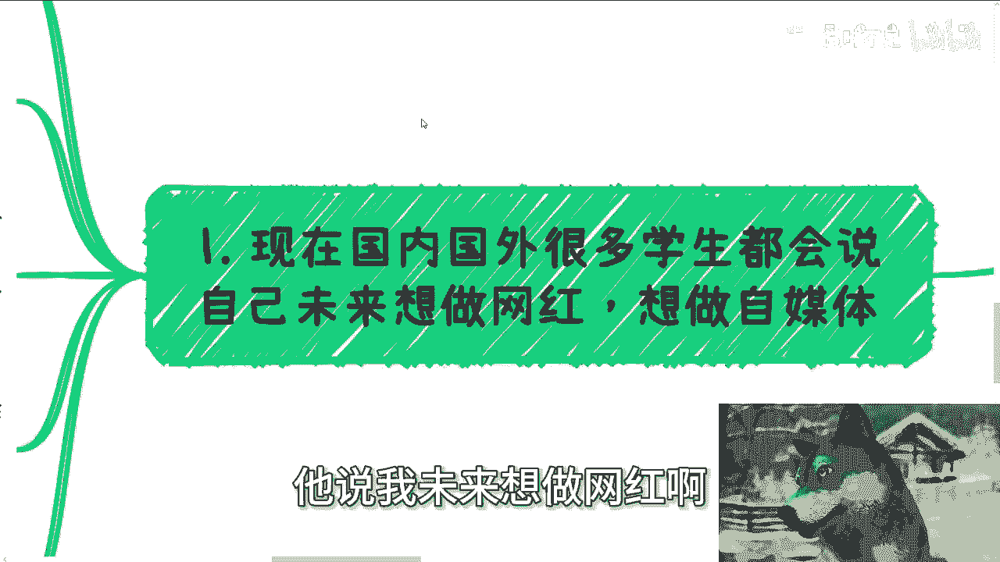
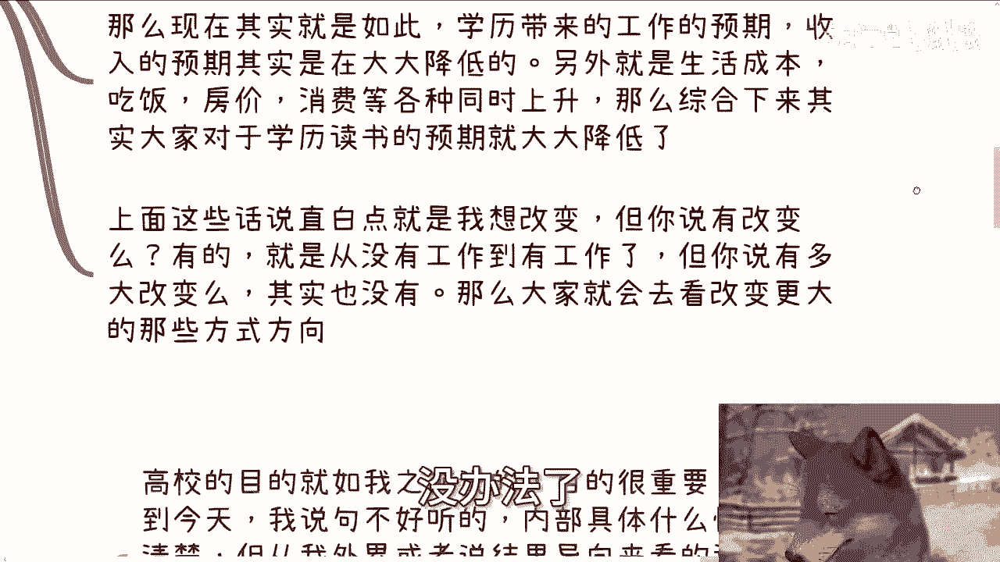
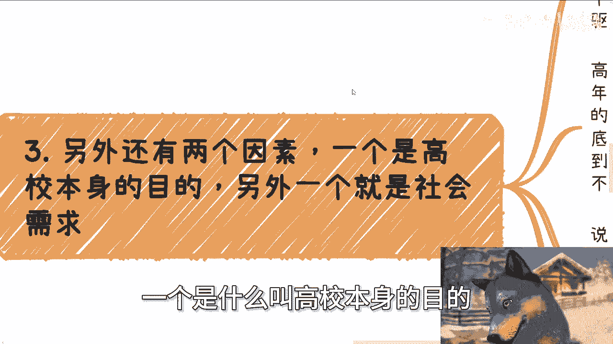
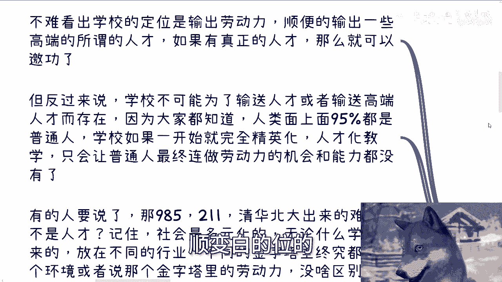
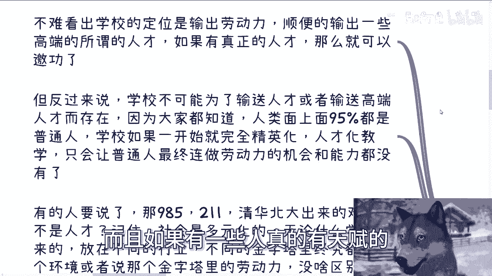
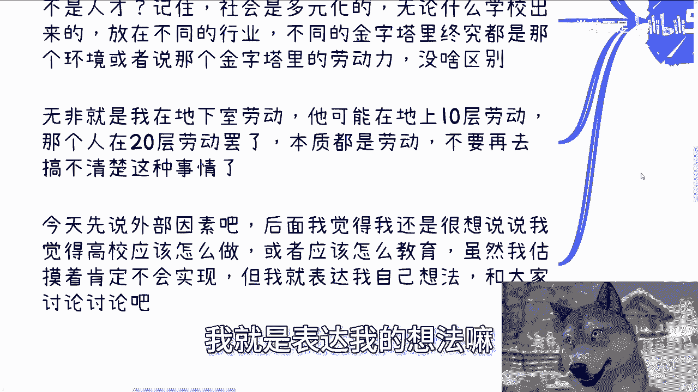

# 高校教育篇：影响高校教育的社会外部因素 - P1 - 赏味不足 - BV1MWxqeVEYZ

啊大家好啊，呃今天是礼拜六啊，礼拜六，众所周周知啊，就是我一般双休日讲的内容呢，就比较放飞自我啊。

呃那今天呢就是心血来潮对吧，我也想聊一聊，就是关于这个高校教育的啊一些情况，但是我也想了一下，一期肯定是聊不完的，所以我会把它分多期啊，那么今天呢你们能看到，就是我讲的是影响这个高校教育的。

这个外部因素，那对于大部分人来讲呢，你们现在正在读大学也好，或者毕业了工作了也好，我觉得这个事情你们都是感同身受的啊，首先这第一点，第二点呢，为什么把它放在高校这个角度啊。

因为毕竟一方面我比较了解这个东西，另外一方面呢就是说这个小学初中啊，小学初中高中这边的一些东西呢，我觉得可能跟这个叫什么学生的这个年龄啊，和整个社会发展还是有些硬性条件，在这在这里面的。

可能有些不是这么好调整的地方，但是高校教育这个事情，我说实话我觉得其实是有可调整性的啊，所以我就想来谈谈这个事情啊。

那么首先这第一个啊，就是说现在国内外很多学生都会说啊，他说你未来想做什么啊，他说我未来想做网红啊。

想做自媒体啊，想做带货主播对吧，那这个地方也说了啊，毕竟海外情况呢我也不是说特别了解啊，因为这个你说我了解了解吧，但不能说特别了解啊，所以我也不能敢妄言啊，所以我们还是以先以国内的情况为主啊。

来聊聊国内的这个情况，那么前几天呢我跟朋友聊聊，聊到一个话题，就是说现在越来越多的这个小小朋友啊，觉得自己想做网红或者说带货或者说自媒体啊，这事儿我们首先从中国的家长跟老师来讲。

他肯定是觉得不可理喻或者说不支持的对吧，那那说白了，你说你他们的这个这个理念还是在于啊，你要做个科学家对吧，你要你要做个军人对吧，你要做个干嘛，就说他会有那种传统意义上面，你应该去做的东西。

而这些东西呢其实在他们看来是歪门邪道啊，那么那天我跟那个朋友聊的时候呢，我就说我说我们思考一下这个问题的源头，就是家长跟老师，可能会觉得这是你们孩子的问题，但是你不能甩锅甩在小朋友身上啊对吧。

你甩锅你随便怎么甩，你不能甩到这些人头上啊，你你让这些学生有这种想法的，甚至来说就是说很多人觉得卧槽他妈的啊，这工作做的没什么吊用对吧，我他妈就是想要去做带货呃，做做直播做什么样子。

为什么我们有没有想过，为什么有的人会说啊，因为媒体宣传很多，因为大家会看到很多自媒体，很多网红赚很多钱对吧，然后媒体夸大，就说这个一天一个月一年赚多少钱对吧，好，我跟你们讲，这是一部分的原因。

但我个人啊我还是强调那句话，就是我个人觉得啊，核心不在这个地方，核心是在于当所有的人啊，你说他是个孩子也好，不是个孩子也好啊，所有的人年龄越来越大，接触到的东西越来越多，了解到的东西越来越多之后。

发现自己所做的所积累的所要去怎么说呢，所要去奋斗的和自己所得的他不成正比啊，或者说自己努力是得不到自己想要的，当这个事情发生的时候，那么就会有我们刚刚说的，那一系一系列的问题出现。

那么这就是所谓的外部因素啊，因为不是我们个人能控制的，但是这个外部因素，其实潜移默化的在改变每一个人，对不对啊，好那么我们详细往下来讲。

第二我觉得本质首先还是就我，我跟你们这个怎么说呢，就是说聊到现在你们也知道嘛对吧，就是我跟你们说的这个做事情方式很简单，就我不我不跟你们绕绕圈子的对吧，咱咱们就有一说一，就是本质还是在于收入。

学历物价，房价等等这方面的变化，因为人做事情一般都是有个预期的，我们并不是让每一个人都达到那个预期，但至少有一个正常的一个预期，或者有一个正常的比例能达到那个预期，那么整个生态才能很好的发展下去。

这就好像啊我们打个比方，这就好像你让大家买彩票，大家有个预期，比如说中奖率50%，最高中奖金额为十个亿，对不对，好，那大家去买啊，没问题啊，但是呢一旦大家买了多了之后。

因为一开始你不会知道问题出在什么地方吗，一旦你买了只多了之后，发现哎哎中奖率他妈的根本就没50%，只有20%啊，那么最高呢哎也没有十个亿啊，只有1000万好，那么这个时候大众会对这个生态保持怀疑。

但是会还会继续买吗，买的，但是里面一部分人会在那边想，我可能得另谋出路，对不对，就是说他会去想别的方式，这是人性，这不是说信任不信任的问题，这就需要很多很多人就会觉得哦，你你喷高校教育啊。

你喷你喷现在的这个这个高工作啊，你喷现在的这个整个的这个社会现状啊，你不爱国，这他妈有什么关系啊，哎奇了怪嘞，这是客观情况，我们要去客观地了解事实，对不对，的老是在那边搞那些有的没的对吧。

那么现在其实就是如此，就是说学历带来的工作预期，收入预期其实是在大大降低的啊，那么另外一方面在降低的同时呢，生活成本呃，呃这个吃饭房价等消费各方面是同时提升的，那么这就好像一个天平，左边再往下。

右边再往上就越这个当中的这个这个怎么说呢，这个心理差距越来越大，那么综合下来，其实大家对于学历，对于读书的预期，也就是说对于高校教育的预期。

其实是大大降低的，因为你不降低，没办法啦。

你不降低，你让自己怎么活呢，对不对，那么上面这些话再说的直白一点，就是我想改变，但是你说有改变吗，有的就是你说我通过高校教育，我能不能有改变，当然有啊，你会从一个没有工作人到一个有工作的人。

但是你说有多大改变吧，哎原本是有的，但是现在开始打问号对吧。

那么就像我们刚刚说的，当你的整个中奖率降低，最高预期值变低的时候，那么总有一部分人开始就会去寻谋求新的方向。

没有办法的事情啊，对不对，好第三在这里面啊，另外还有两个因素，一个是什么叫高效本身的目的。

另外一个就是社会需求啊，我们先从高校目的来讲，高校目的之前我单独出过一期对吧，就如我之前说的，目的很重要，当然发展到今天，我说句不好听的，内部的情况到底烂成什么样子，我不清楚啊，我也不敢去说啊。

但是你我单纯从一个外外部的一个人士，或者说从结果导向来看，就两个高校现在就2。1，要么温水温水煮青蛙，不思进取，要么就是利益驱动没了，就就你问我是不是没有看到过私进去的，有没有看到过激进往前走的。

没有一个都没有啊，就这么简单好，那么高校前面前来看啊，就是要么就是每一年呢就这样，比如说日复一日，年复一年，你说创新吧，你说科研吧，你说校企合作吧，你说校外联谊吧，你说海内外交流吧，有的都有的啊。

都有的，你问他到底为了什么，为了提升的，为了提升学生的什么，以及提升了学生这些东西之后，到底在出了校园之后有什么用，知道吗，不知道的老师自己都不知道为什么，因为说难听点，老师自己也卷得晕头转向。

老师自己都他妈不知道自己在卷着干什么，他都是循规蹈矩的在里面卷，上上梁不正，下梁歪对吧，他妈老师每天在边卷职称卷，开会卷，研究卷PPT对吧，卷怎么让这个跟学生斗智斗勇，但到最后传授什么呢。

学生又学到了什么呢，不知道对吧，为什么，因为换而言之，老师毕竟也是一个脱离社会很久的存在啊，那我说不好听点，很多学生他妈比老师还接，还至少接触社会，接触多了对吧，那么剩下的还有很多高校。

基本上就是我们说的第二种纯赚钱性质，学费啊，培训费啊，各种乱七八糟的费用啊，这研究费用多么大的量啊，我就不去说了，你们自己去了解，你们自己去了解，你们就会背后发凉对吧，其实说难听点。

这么长时间都是这种套路，但还是那句话，无论什么出发点，我不管他是第一种煮青蛙的出发点，还是赚钱出发点。

学生最终还是得到nothing好，那么第四点就是我们说的社会需求，其实大家找工作啊，这些年大家会都有这种感觉，就是我自己学习东西跟社会公司在JD上面，也就是说社会公司的需求跟我自己学习的东西。

它会有出路有脱节，你说这是不是事实呢，是的，但我就跟你们这么说，你说是不是真的普罗大众事实，我告诉你们，不是的，为什么，因为感觉有出路的往往都还是那种比较高级的，或者说我们说的有门槛的。

有一些技术含量的螺丝钉，虽然都是螺丝钉，但是是螺丝钉当中的战斗机啊，或者螺丝钉当中的这个呃，怎么说呢，新能源对吧啊，就是说他还是有那么一丢丢的咳，这个这个这个优越感优越性的。

但真正你从整个社会面上面来讲，社会需求，因为你不能总看你自己嘛对吧，你说你自己出发，他妈的高校也不用也不围着你一个人转职，这个中过也不围着你一个人转对吧，所以说你要真正的从整个的一个面上面来讲。

中国的社会需求是什么，还是劳动力，你放到哪儿都是劳动力啊，那么只不过呢就是说他会就说从原本啊，比如说100%都是板砖啊，都是要那种啊搬砖的对吧，或者说怎么样，咳咳咳，转化到转化到，就是说现在。

比如说有那么二三十%，需要敲键盘的劳动力啧，问题是什么，问题是学校不是一个能够自给自足，就是学校不是一个能自我造血的地方，什么意思呢，意思就是说他毕竟是整个社会生态的一个环节，如果学校脱离社会。

它是发展不下去的，那么学校他必须要去满足这个社会需求，因为他不满足这个需求，他就没有必要存在，或者说我们就这么说，如果学校没有办法去满足社会上的需求，那么学校里面的这个位置。

某些中高层的管理者位置上的屁股就得换了，对不对好，那么我们就这么说啊，一个正常人，一个正常的组织做事情，他都会满足占比大的那部分人，你想想看，你不要问我为什么呀，这有什么为什么吗，哦你做一件事情。

你去满足小部分人，然后是你满足小部分人的时候，就会势必带来大部分人的不满意，就会就会闹矛盾，你会怎么做不了，一个正常人不会这么做的呀，这是个必然结果呀，对吧，你记住啊，我这边写的是占比大的那部分人。

不是说大部分的啊，就不是说就是说啊，就是说啊，你说你你你说比如说呃是大部分人或小部分人，因为你今天我们打个比方，你今天招100个人，你要满足的是100个人里面，比如说八九十个人的那种普。

就是就是普世化的需求对吧，但是反过来说，你说哎我今天招100个人，卧槽我他妈这100个人是占这个社会的，就是那一小撮，我就把这社会里面去就非常小的那一小撮，100个人，我把他拎出来。

那么这100个人你想怎么去做，怎么去做都无所谓，但是你从宏观整个面上面来讲，学校要去满足的一定是占比大的那部分，因为学校毕竟里面的基数太大，对吧好，那么我们就回到最后一点啊，所以你从全局来看的时候啊。

不难看出来学校的定位，它其实就是输出劳动力啊。

不要来跟我提什么985211，什么什么本科硕士博士，不要去谈这种东西，这种东西都是人类都是资本家，政治家所定出来的一种，怎么说呢，一种头衔对吧，你你把这种东西有的没的，就是我们叫做虚假的这种东西。

你把它抛掉，他就是输出劳动力啊，逼逼别的啊，他会在输出劳动力的同时，顺便白的喂的输出一些所谓的高端人才。

而且如果有一些人真的有天赋的。

那么就可以邀功了，能明白吧啊好，但是反过来说，学校是不可能为了输送人才，或者输送高端高端人才而存在的，因为大家要知道，人类整个面上面，95%甚至99%都是普通人，学校如果一开始就完全走精英化。

人才化教育，那么他只会让那些剩下的，真就是我们刚刚说的那种占大比例的普通人，最终可能连做劳动力的机会都没有，你想想看是不是对吧好，那么有的人说了，那985211清华北大出来难道不是人才吗。

我还是那句话啊，你记住一点，社会是多元化的，我不管你是什么学校出来，放在不同的行业里面，不同的金字塔里面，终究都是那个环境，或者那个金字塔里面的劳动力，因为劳动力它不是一个绝对值，它是个相对值对吧。

你需要有不同的参考物，但是在不同的环境当中，不同的上下文当中，不同的参考物当中，你无论什么地方出来，你都是劳动力，没有区别的对吧，无非就是说我今天在地下室劳动啊，你们可能是在地上十层劳动啊。

他们可能是在地上20层劳动罢了啊，本质都是劳动，唉何必大家还要再来搞个369等呢，对不对，那当然他在十层可以鄙视我这个在地下室的，但是从整个社会面来讲，我们是一样的啊，那么好，我觉得今天啊就先说到这啊。

先说这个外部因素，后面呢我觉得我还是想谈谈啊，就是说如果你让我来做啊，我觉得高校应该怎么做啊，或者应该怎么教育啊，或者应该就是说从老师啊对吧，从这个学校制度啊对吧，或者怎么样子啊。

虽然我估摸着啊大概率99。99999啊，不可能跟不可能像我说的这样去实现，但是呢无所谓啊对吧，我就是表达我的想法嘛。

那你他不能实现，不能妨碍我表达我的想法嘛对吧，那我表达出来跟大家讨论讨论嘛，啊好吧，蛮好玩的啊，行吧啊，那我觉得这一反正就是说呃这也我我也没想过，就是说做一个系列啊，就是反正就这个呃高校教育的这种。

围绕这个东西的一些想法啊，我跟你们讲完了，我也希望就是说啊我先说一下我的初衷啊，我倒不是说呃改变谁或不改变谁，我的想法就是说一方面呢，从我的这个呃怎么说呢，一些思考当中呢，我希望大家能够更。

就是就是真真真实实的去认识到呃，目前整个社会跟高校教育的一些情况，你不要盲目的，还是那句话，你不要盲目的自大，你也不要盲目的妄自菲薄，都没必要，对不对，那我觉得这是一方面，另外一方面呢。

就是说因为因为有很多那个也不叫很多吧，一部分吧，之前有些小伙伴私信的时候也跟我说嘛，就他们可能接下来要面临着，就是说孩子的教育啊或者怎么样子，其实你们也可以参考一部分这种想法啊，你们可以想想看。

就说我呃，你到底能给你的孩子带来什么东西对吧嗯好，那就这么着啊，然后那个叫什么，就是工作上面就职业规划啊，然后商业上面就是那个啊赚钱啊，副业啊对吧，包括你跟别人做项目啊，就商业规划呃，业务模型啊对吧。

包括呃项目靠不靠谱啊，靠不靠谱啊，合同啊啊分红分润啊，这商业计划书啊对吧，白皮书啊，或者其他各种东西额估值啊，融资啊，你们在这里面如果觉得啊就是有需求有需要，就是说有自己想法啊。

或者来说有些东西不确定的，你们希望跟我能够沟通啊，然后就是说呃我结合你们个人的情况，给你们一些更贴近于你们个人的啊，每个人不同情况嘛对吧，贴合于你们个人的这种规划和建议的话，那么我们可以整理好对应的。

个人问题和个人背景。

