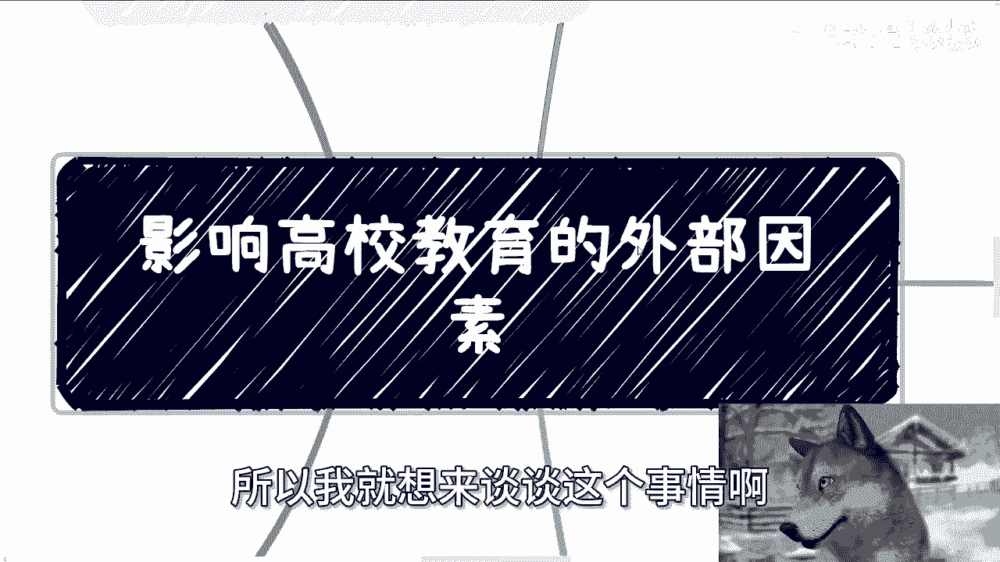
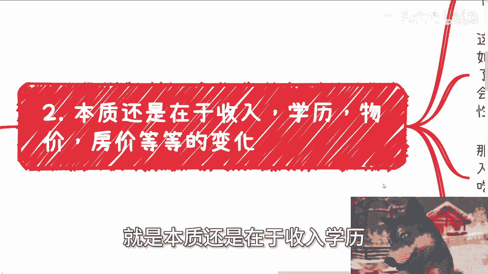
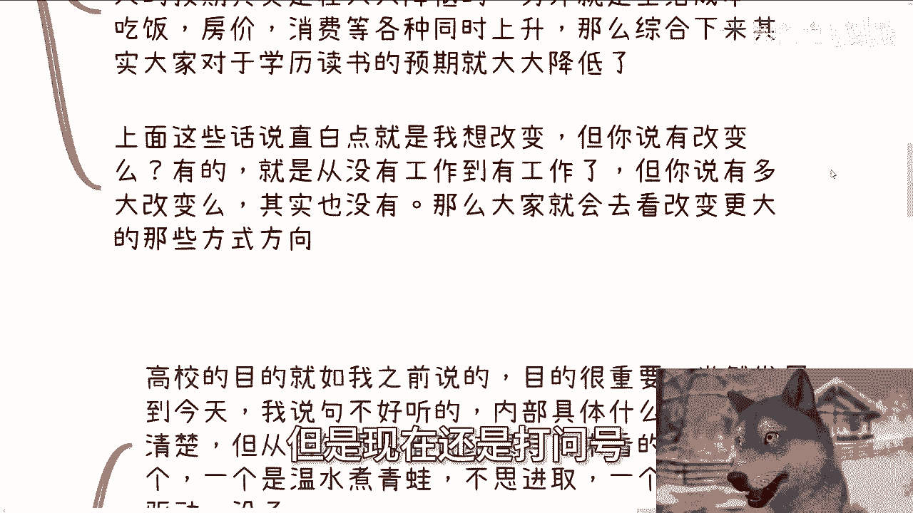
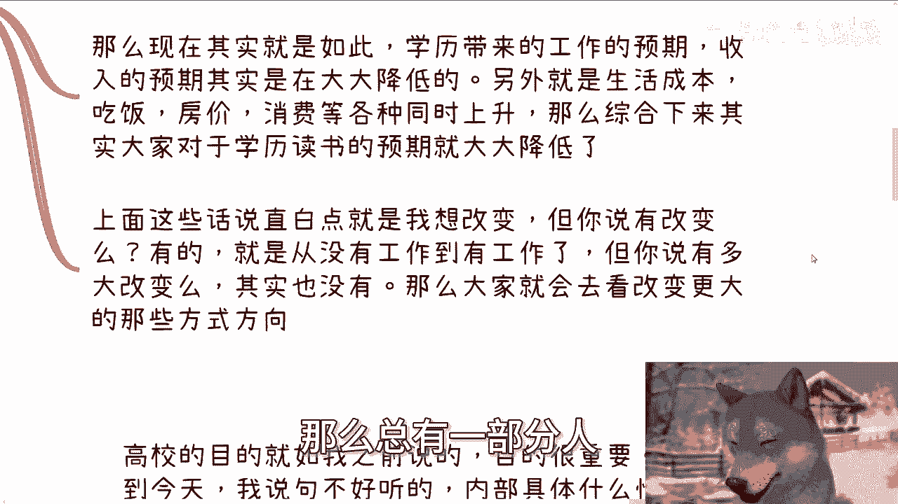
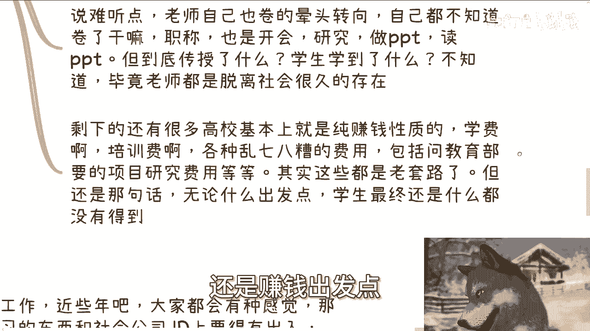
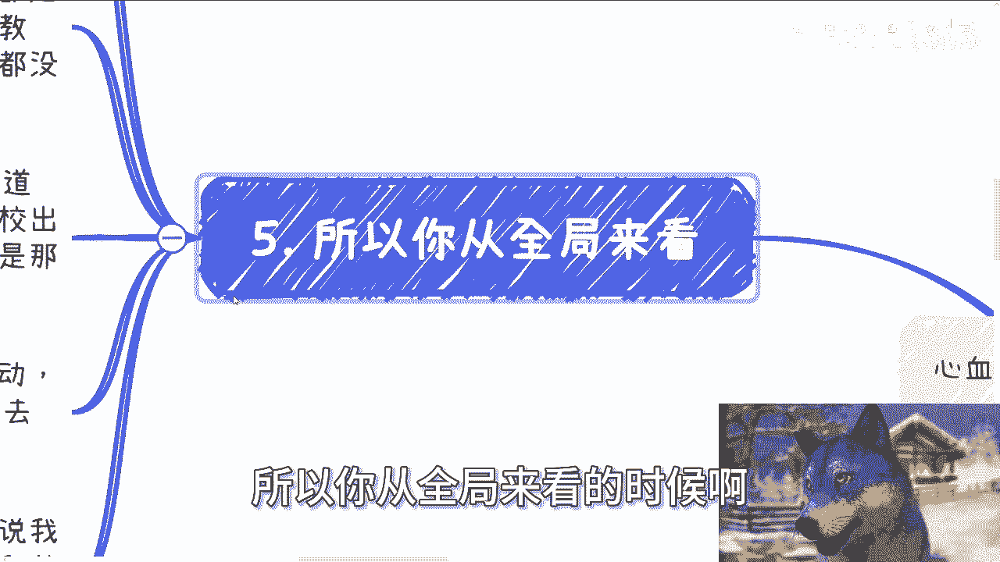
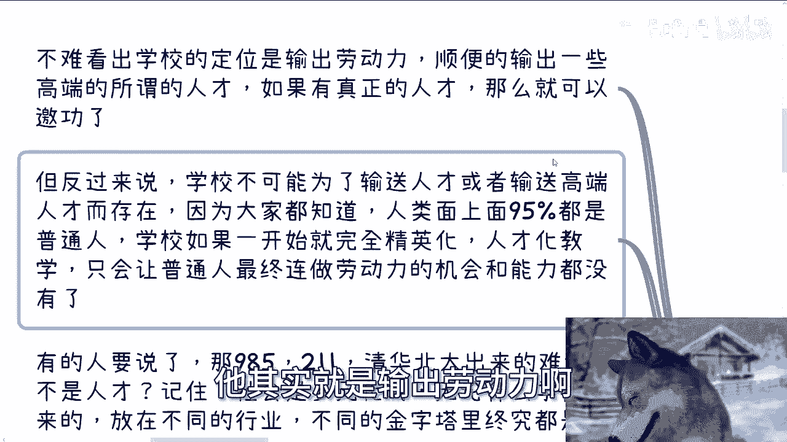
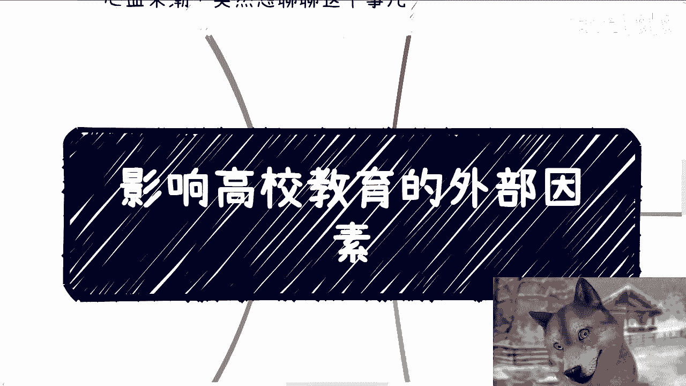

# 高校教育篇：影响高校教育的社会外部因素 - P1 🏫

在本节课中，我们将探讨影响当代高校教育的主要社会外部因素。这些因素并非由高校或学生个人直接控制，却在无形中塑造着教育的形态、目标以及人们对教育的预期。

上一节我们介绍了课程主题，本节中我们来看看第一个关键因素：**职业预期的转变**。




## 1. 职业预期的转变 🎯

越来越多的学生，包括年轻一代，表达了未来想成为网红、自媒体从业者或带货主播的愿望。这与传统家长和老师期望的科学家、军人等职业路径相悖。

这种现象的根源不能简单归咎于学生。核心问题在于，当人们随着年龄增长，接触的信息增多后，发现个人努力、积累与最终所得**不成正比**。用公式表示这种感受就是：

**个人感知价值 = 实际所得 / 预期所得**

当这个比值持续小于1时，人们就会对传统路径产生怀疑，并开始寻求新的出路。媒体宣传高收入案例只是表象，深层原因是努力与回报的预期关联被削弱。

---


上一节我们分析了职业预期的变化，本节中我们来看看导致这种变化的根本驱动力。



## 2. 经济现实的失衡 ⚖️

本质问题在于收入、学历、物价和房价等因素的变化关系失衡。人们行动通常基于一个合理预期。当预期与现实严重不符时，整个系统的可信度就会受损。

这就像一个抽奖活动：
*   **宣传预期**：中奖率 = 50%，最高奖金 = 10亿。
*   **实际体验**：中奖率 = 20%，最高奖金 = 1000万。

当大众发现实际回报（`实际回报`）远低于宣传预期（`宣传预期`）时，部分参与者自然会寻求其他途径（`寻求新途径`）。这个过程可以简化为一个决策逻辑：


```python
if 实际回报 < 预期回报 * 可信度阈值:
    行为 = “维持现状但心存疑虑” 或 “寻求新出路”
```


当前的情况是，学历带来的工作和收入预期在降低，而生活成本（房价、消费）在升高。这种双重压力导致公众对高校教育的整体预期**大大降低**。因为不降低预期，个人心理上难以平衡。



---




在讨论了经济层面的直接影响后，我们还需要审视高校自身的目标设定。

## 3. 高校目标的模糊与异化 🎓

高校的目的至关重要。但从外部和结果导向来看，当前许多高校的状态可归为两类：

以下是两种常见的高校状态：

1.  **温水煮青蛙型**：按部就班，缺乏真正的进取与创新。虽有科研、合作、交流等活动，但其根本目的——提升学生什么能力、这些能力出校后有何具体用处——往往不清晰。教师自身也陷入“内卷”（如卷职称、会议、PPT），难以有效传授与社会接轨的知识。
2.  **利益驱动型**：以盈利为主要目的，通过学费、培训费、项目费等手段运作。



无论出发点如何，如果学生最终获得感很低，那么教育的效果就会大打折扣。

---

高校并非孤立存在，其生存与发展必须回应社会的需求。

## 4. 社会需求的本质 💼

许多求职者感觉所学知识与公司招聘要求（JD）脱节。这种感觉在有一定技术门槛的岗位上可能更明显。但从整个社会宏观面来看，核心需求仍然是**劳动力**。

社会需求结构可能从过去100%的体力劳动，转变为现在包含20%-30%的脑力或技能型劳动。但本质未变。

学校作为社会生态的一环，无法脱离社会自我造血。它必须满足社会的主要需求才能存续。一个理性的组织通常会优先满足**占比最大的那部分群体**的需求，因为满足小众需求可能导致与大众群体的矛盾。用集合论的概念可以理解为：

设总需求集合为 `U`，高校选择满足的需求子集为 `S`。高校倾向于使 `S` 覆盖 `U` 中基数最大的子集 `M`（即 `|M|` 最大），以维持系统稳定和自身存在的合理性。





---

综合以上各点，我们可以得出一个全局性的观察。


## 5. 学校的核心定位：劳动力输出 📤

从全局视角不难看出，学校的核心定位是**输出劳动力**。所谓的985、211、本科、硕士等头衔，是一种社会分层标签。

学校的运作模式可以概括为：
**核心产出 = 大规模劳动力 + 附带产出的少量高端人才**

如果附带产出的人才中有天赋突出者，学校便可将其作为成果展示。但学校不可能纯粹为培养精英而存在，因为社会绝大多数是普通人。完全精英化的教育会让大部分普通人失去成为合格劳动力的机会。


社会是多元的，在不同行业和层级中，所有人本质上都是特定语境下的“劳动力”，区别仅在于劳动的环境和形式（如地下室、十楼或二十楼），而非绝对性质。

---

## 总结 📝

本节课我们一起学习了影响高校教育的四个关键社会外部因素：

1.  **职业预期转变**：因努力与回报关联减弱，新兴职业路径对年轻人吸引力增加。
2.  **经济现实失衡**：学历贬值与生活成本上升，降低了教育投资的感知回报率。
3.  **高校目标异化**：高校在“维持惯性”与“利益驱动”中，可能偏离以学生能力提升为核心的目标。
4.  **社会需求约束**：社会对劳动力的本质需求，决定了高校必须服务于大规模、基础性的培养目标。



这些因素共同作用，将高校的核心角色锚定在为社会大规模输出合格劳动力这一基本定位上。理解这些外部力量，有助于我们更理性地看待高校教育，规划个人发展路径，既不盲目自大，也不妄自菲薄。