# 高校教育篇：影响教育的内部因素问题，比如老师，教育机制等 - P1 - 赏味不足 - BV1Vtx1ekECU

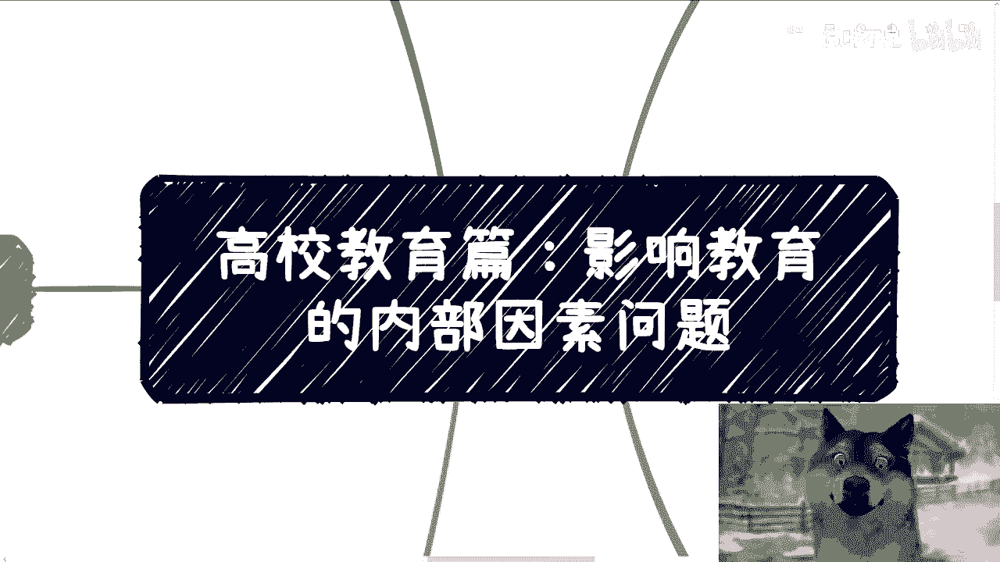

好大家好啊，这个我们今天继续来讲这个高校教育啊，呃影响教育的这个内部因素问题啊，我觉得因这个内部因素问题呢是这样子的。

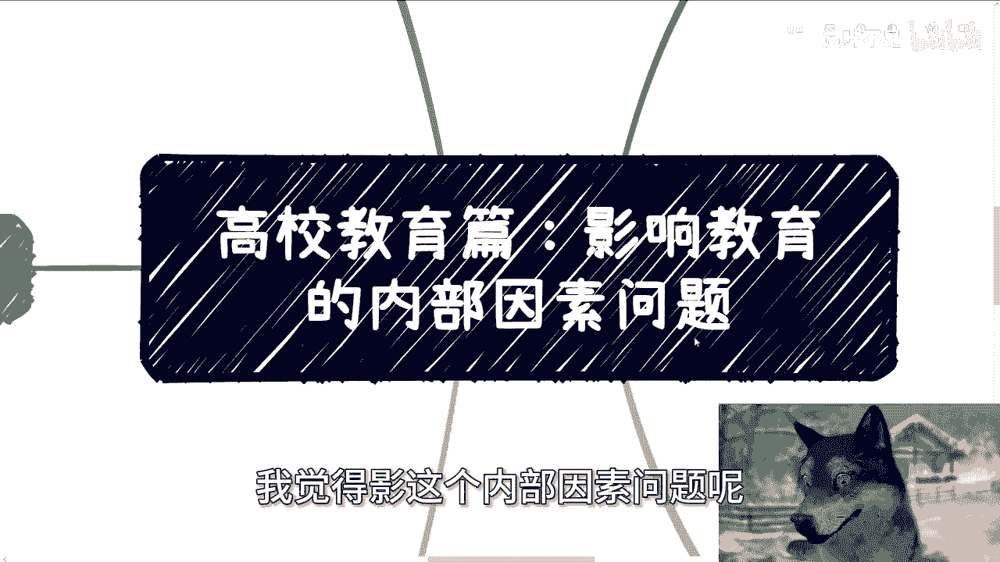

就是首先第一个啊就社会跟高校的一个博弈啊。

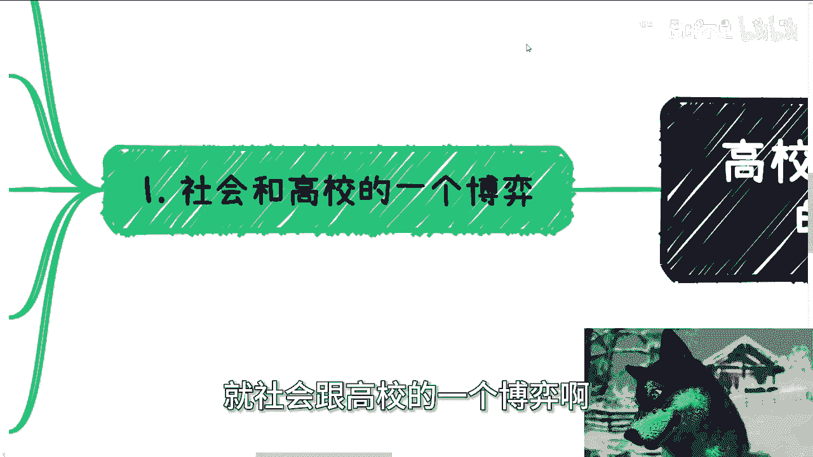

就我忘记我之前是在哪听到过了，就是听到这么一个观点，就是以前啊叫做高校呢领先于社会啊，而现在呢是社会领先于高校，而且呢是遥遥领先，哎我跟你们讲，我真的是遥遥领先啊，其实你说内部因素啊。

很多人会觉得你比如说课程啊对吧，必修课啊，选修课啊对吧，包括要不要开放一些交换生机制啊对吧，其他各种各样的东西啊等等等，你说是不是对啊，但是在我看来，这些他妈的都是花里胡哨的。

就是如果一件事情的核心啊有问题，或者说这个矛盾不解决，那么剩下的其实你你在流程上面啊，机制上面啊对吧，你搞得再花里胡哨，我跟你讲没卵用啊，而且人类社会呢所有的核心，你归根结底到最后他就是一个原因。

人对吧，那么这里说的人是什么呢，校长啊，院长啊，教授啊，授课老师啊，对不对啊，那我们以后呢就统称为学校老师啊，那么学校老师本身的腐朽啊，理念的固化啊，不与时俱进，他就会让整个教育变得形式化啊，甚至落后。

那么毕竟啊我们就这么说啊，就是说哈这个学生的确什么都不懂，在他们认为父母是超人，老师是万能的，老师是10万个，为什么啊，百科全书老师说啥都是对的，你怎么办呢是吧。

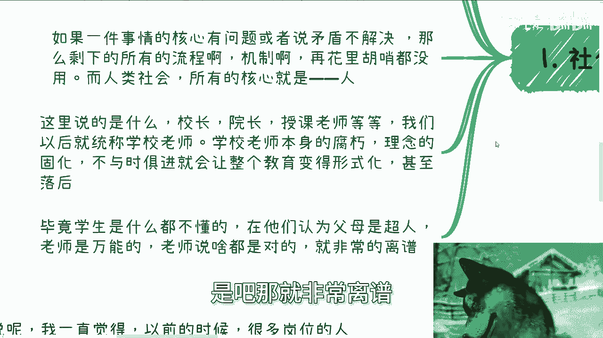

那就非常离谱，好那么第二啊。

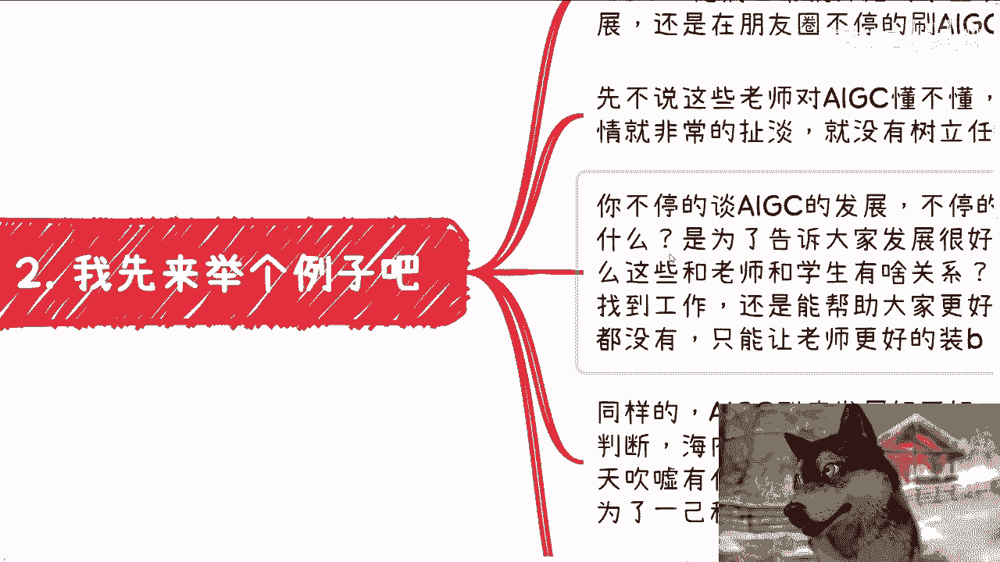

我先来举个例子啊，就是从前年开始，很多的这个高校老师就不停的在追逐AIGC，他们日常呢就开始对学生来说啊，比如AIGC好处啊，AIGC发展啊对吧，还有在朋友圈刷那种AIGC效果图啊。

然后就说各种什么趋势啊，什么什么新的工具出来了啊，那么你从我角度来讲啊，先不说这些老师对AIGC懂不懂，其本身就我刚刚描述的这些事情，就他妈非常扯淡，他就没有树立任何的榜样，为什么很简单。

你不停的谈AIGC发展，不停的发效果图的目的是什么呢，你是为了告诉大家发展很好吗，如果是的话，那么这些东西跟你这个老师，跟你所教的学生有什么关系呢，他是能帮助大家更好的找到工作。

还是能帮助大家更好的去赚钱，都没有对吧，那那你在我看来是什么，就是能够让你这个老师更好的装逼，还能有什么用用处呢，对不对，让你的学生更多的崇拜你还有什么用呢，觉得你是对的是吧，但TMD一一点都不接地气。

你同样的AIGC到底发展好不好，老师应该是有自己的判断对吧，你海内外发展是截然不一样的，不不能一概而论，你把海外啊OpenAI对吧，很很多东西拿过来，你拿过来有什么用呢，你跟大家说发展很好，有什么用呢。

你有本事把学生都送出去对吧。

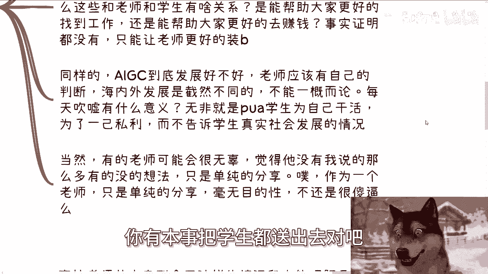

每天吹嘘有意义吗，没有意义，无非是PUA学生为自己干活。

为了一己私利，而不告诉学生真实的社会发展情况，当然啊，说到这里，如果有老师听到这里的话，我相信有的老师可能会觉得很无辜啊，觉得他没有我说的以上这么多想法，也没有这么多一己私利对吧。

只是单纯的分享，那我也想说一句话，如果你作为一名老师，你只是单纯的分享，毫无目的性，他妈还是啊啊。

你就在教导你的学生做事情毫无目的性，这是你应该教的吗。

对不对啊，第三咳，我们来说回人身上啊。

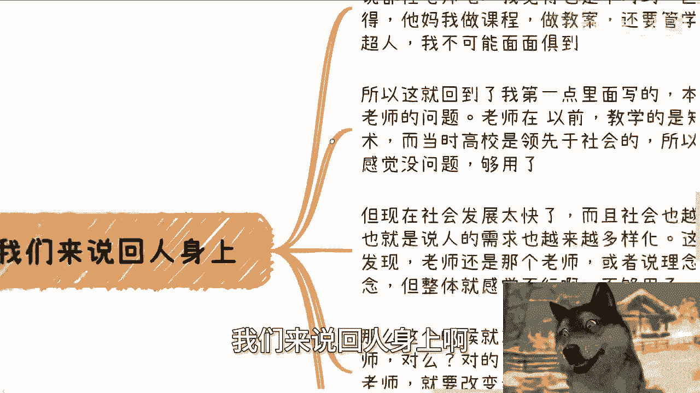

高校老师呢其实走到今天这个情况我很难理解，你说都怪老师吧，我觉得不对，因为老师会觉得他妈的我做课程，做教案还要管学生，我又不是superman，我不可能面面俱到，对不对对嗯。

所以这就回到了我第一点里面说的本身，这不单单是老师的问题，老师在以前教学的内容是什么，是知识，是技术，而当时高校所教学的东西，他是领先于社会，或者说是适用于社会的，所以整体会让大家感觉诶没什么毛病啊。

够用，但现在社会发展太快，而且社会也越来越多元化，也就是说人的需求是越来越多样化的，那么这个时候你就会发现，卧槽他妈的老师还是那个老师，或者说理念还是那个理念，但整体感觉不行，那他妈就是不够用，对吧啊。

那么这个时候就有人要想解决方案了啊，他说改变老师对吗对，但这个方案很不接地气，为什么，因为你要改变老师，那就要改变老师的养成方法对吧，你相当于就是要改改变整个教师编的养成方法。

那么就是对整个教育体系的改变，这件事情至少在我看来是不可能的，而且咱们退1万步来讲。

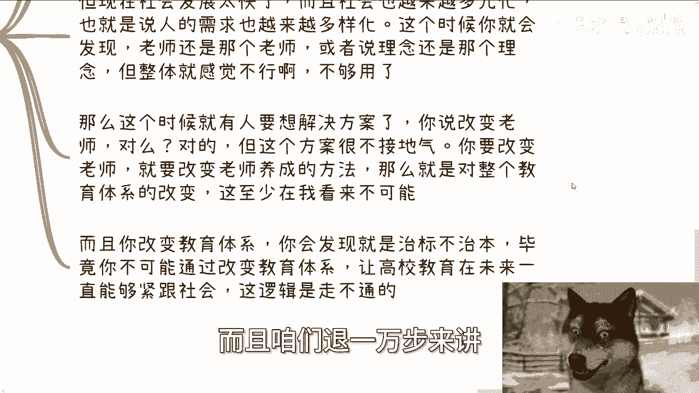

你就算可能你会发现你改变了教育体制，也是治标不治本的，毕竟你不可能通过改变教育体制，让整个高校教育在未来一直能够紧跟社会。

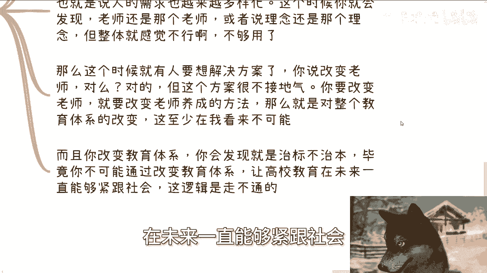

这逻辑是走不通的对吧，你能保证吗，没人能保证，所以这个逻辑是没法成立的，好第四老师不明白吗，我跟你讲。

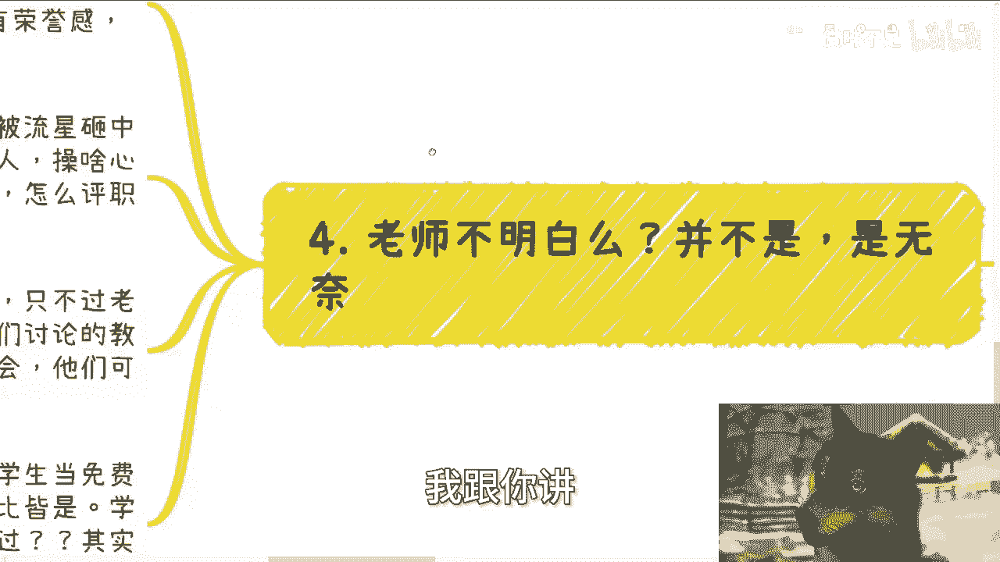

并不是老师里面总有人明白的，还是那句话，大家智商是差不多的啊，你能明白我能明白，总有别人会明白啊，但是还是那句话，很多人是无奈，他屁股决定他的脑袋对吧，你就像我以前跟你们讲的，我之所以能跟你们讲这些。

是因为我隶属于三界之外，就如果我但凡今天在某一个公司，某个高校，某个地方政府任职，我敢跟你们讲，你想想看，对吧，所以说啊我一直觉得以前的时候，很多岗位的人是有责任感的，他是有自己的附加价值的。

他们并不认为自己是老师。

或者还说某某某什么队员，更多的是荣誉感，使命感，但不知道我也不知道什么时候开始啊，大家突然就感觉他妈被流星砸到了，就明显感觉到其实自己就是个打工人，操啥心呢对吧，但吃萝卜咸操心，现在已经每天已经很累了。

就多操操心，怎么晋升，怎么评职称，怎么加薪，这个是现在很多人很多所谓的老师关心的，但客观来讲，大家都是人，其实没什么毛病，我们也不能多要求他们，只不过老师的确相对于其他岗位，相对于其他职业。

他应该是需要有责任感的，因为你如果只忙碌于这些事情，自然就如我们讨论的教育，教学啊，育人啊，自然就顾不上，因为现在社会，他们可能自己他妈都顾不上。

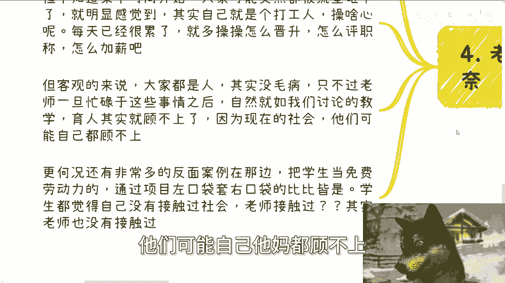

泥菩萨过江，自身难保，更何况还有很多的反面案例，在那边把学生当免费劳动力，通过项目左口袋掏右口袋比比皆是，学生都觉得自己没接触过社会，那他妈的反过来问老师接触过吗，老师接触过社会吗。

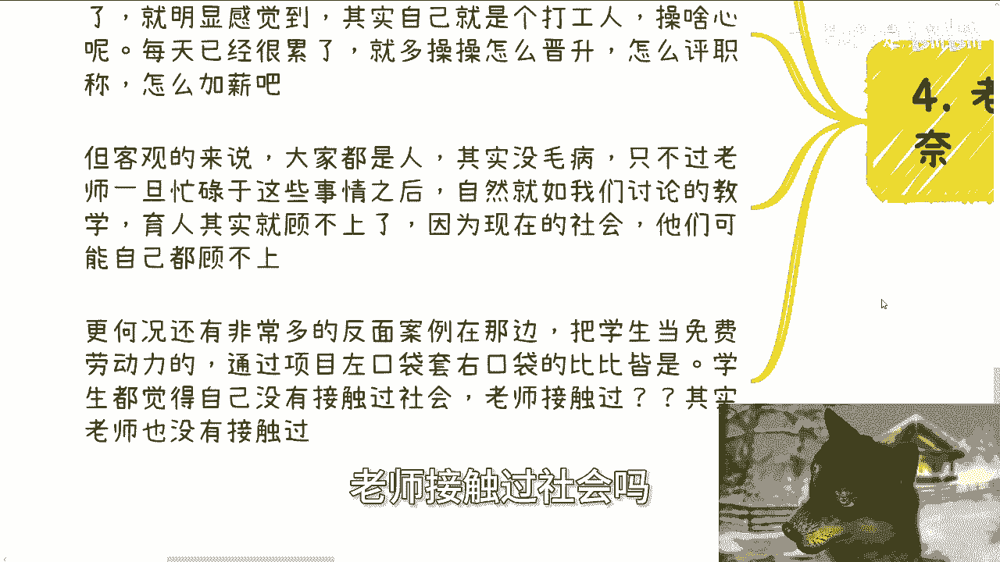

老师接触过产业吗，老师接触过行业吗，接触个屁嗯。

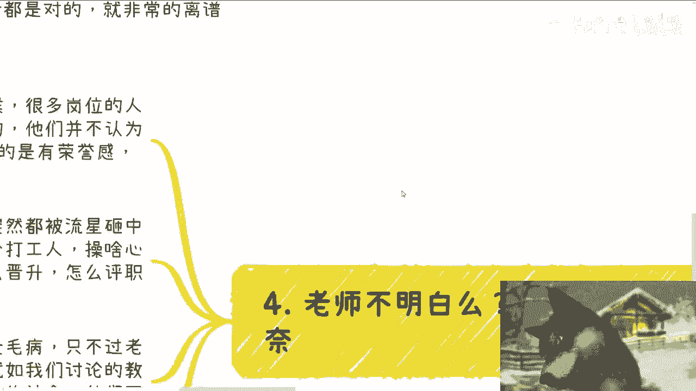

对不对，好第五啊，内部跟外部呢已经属于DEBUFF的次方了啊。

那么说实话你说改变过吧，很多人其实不了解，从政策上，从中央上面他当然改变过，就是政策，很早之前就提到了产学研，产教融合，产业学院职教本科，一直说你们自己去查对吧，但结果呢那当然原因我们不知道啊。

你说到底是执行层的原因呢，还是说是中央推这个东西力度不够呢，还是怎么样，咱不先不去猜测啊，那么我们先接下来往下说，现在经济也好，全球形势都很紧张，更不会有余力来管来管教育了。

那么高校教育基本上我觉得就已经定型了，短期内他是很难有改变的，那这个短期我觉得起码以10年为一个周期啊，很难有改变，但是你从我角度来讲，10年也是时间了对吧，所以说实话，我觉得我之前就给你们这个结论。

不单单是让很多大学生和家长家庭变成炮灰，更多的是对未来长远的发展，会有不可预估的影响对吧。

因为还是那句话，不管我们现在教育的好还是不好，也不管大家的认知到底怎么样子，社会总要往前发展，社会世界也总会往前发展，整个洪流不会停下来，等某一个人对吧，那么到届时5年后，10年后。

那么很多人就会被这个怎么说呢，就是说缺失的这部分教育会影响到他一生，这没有办法的，有的人聪明一点，悟性高一点，野蛮一点，他可能走得出来，但是大部分人不行，好那么好，那么我觉得内部外部因素啊。

我觉得基本上也都谈了啊，但是我也没法谈的太深对吧，也为了让视频能够存在啊，那么接下来后面的话我会跟大家再聊一下，如果改变，就如果我来改啊，怎么个改法对吧，好好那就这么着吧啊。

然后那个职业规划就是工作上面商业规划啊，就是副业啊，赚钱啊对吧，这个这个这个合作啊啊合同啊对吧，分红啊，丰润啊，商业计划书啊，白皮书啊，估值啊，融资啊等等等啊，你们觉得希望跟我的沟通啊。

给你们更多的一些建议，或者说少走点弯路的话，那么你们可以整理好对应的问题跟个人背景。

好吧。