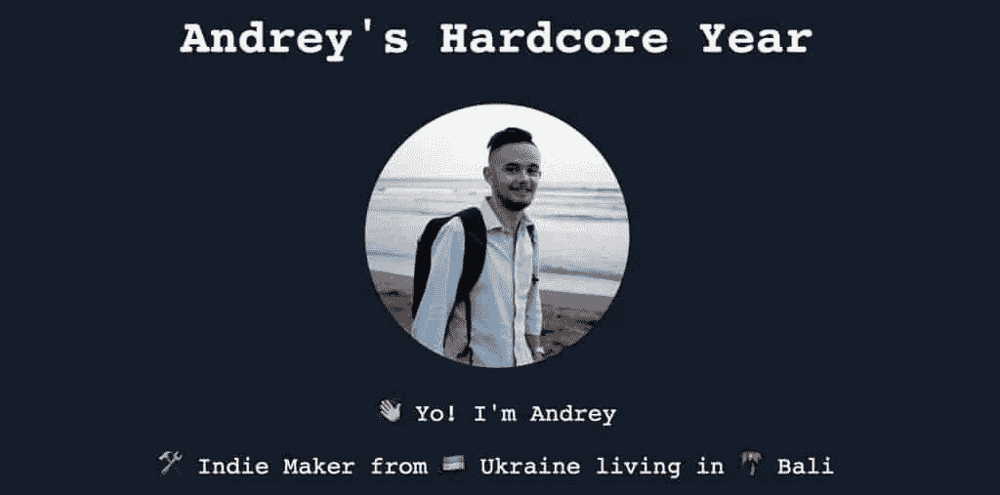
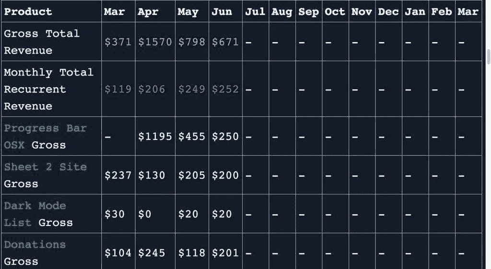

<!--yml
category: 未分类
date: 2022-06-26 00:00:00
-->

# 数字游民榜样 - 乌克兰小伙Andrey Azimov的硬核年

> 原文：[https://jarodise.com/andrey-asimov-indie-maker-hardcore-year](https://jarodise.com/andrey-asimov-indie-maker-hardcore-year)

平时在与一些数字游民生活方式爱好者的交流中，我常听到这样一些说法：“我也想成为一名数字游民，可惜我不会编程。”，或者“数字游民生活方式看似美好，但是我害怕辞职了以后收入不稳定。”，“那些西方的数字游民就算失败了也可以回国领低保，我们中国人做不到。”如此云云，这些说法虽然表面上反应了一些生活方式设计过程中客观存在的障碍，但是折射出的其实是人们的心理障碍，因为仔细想想就不难发现，其实这些问题都是可以通过各种方式和努力解决掉的。今天我要跟大家介绍的这位数字游民来自“底子”比我们中国还要差一些的乌克兰，让我们看看他是如何用行动来证明“这都不是事儿”的。

Andrey Azimov是一名来自乌克兰的90后小伙, 在成为数字游民之前，他在一家名为Railsware的公司做IT产品经理。幸运的是，这家公司允许员工进行远程办公，因为Andrey一直都特别想学习如何冲浪，于是在2016年，他将自己的办公桌从乌克兰搬到了位于巴厘岛长谷的联合办公空间DojoBali，开始了边学冲浪边远程工作的游民生活。

在DojoBali，Andrey遇到了另外一个名叫Pieter Levels的年轻人，他发现Levels靠着自己做各种网站和APP，每个月能入账五位数的美元收入，这极大的鼓舞了他。于是在Levels的指引下，Andrey也开始在正常工作之余来把自己的一些想法做成产品，希望自己能像Levels一样通过自己的努力成为一名成功的创客。

要实现这个目标，他首先需要克服的一个障碍就是编程，因为在这之前他几乎没有任何编程经验。但是Levels告诉他，自己刚刚开始的时候也基本上什么都不会，靠着Google和各种网上的教程和论坛，他不但一步一个脚印地打造了多款受欢迎的产品，而且很快地学会了好几种编程语言。

Andrey如法炮制，在经历了一番还算顺利的折腾之后，他的第一个产品When2Surf顺利上线了，这个产品旨在解决他自己和其它一些初级冲浪学习者不懂得如何阅读网上复杂的海浪预报数据的困难。从一个不会编程的小白，到When2Surf上线，他只用了两个月，而整个产品的上线成本只有11美元（5美元的服务器+6美元的域名）。而且整个过程中，他也没有上任何的编程学习课程，所有的问题全部通过谷歌搜索一步步解决。

Andrey所有的产品灵感几乎都来自于他自己在生活与工作中的困扰，他自己在工作过程中觉得频繁地使用终端进行程序部署的步骤太繁琐，于是他设计了一个专门用于部署程序的实体USB按键 -PushtoDeploy，并在网上进行了众筹，虽然最终众筹失败了，但是他也从中获得了很多经验教训，并且进一步扩大了自己在独立创客圈子的知名度，连Product Hunt的创始人Ryan Hoover都在自己的推特上转发了这款产品的介绍。

折腾了一段时间，也弄出了一些产品，Andrey虽然并没有从中赚到太多钱，但是他似乎已经看到了一丝成功的曙光，他知道只要自己这么一直不停地努力推出这些能够帮自己和其它人解决问题的产品，终究有一天会有人会愿意为之买单，他的收入也就不成问题了。他更需要的是时间，于是经过一番思想斗争，他决定辞去在Railsware的产品经理职位，开始专心地做一名独立创客。

Andrey给自己定了一个小目标，要在一年的时间达到平均月收入1000美元。之所以是1000美元，是因为在他看来，每个月1000美元就可以让他在巴厘岛这样的地方很舒服地生活且有盈余了。他把这一年命名为Hardcore Year（硬核年），并且详细记录了自己发展进度，把自己所有的收入明细都放到网上供人们监督观摩。

辞职后，Andrey的第一个产品叫做Sheet2Site。在制作When2Surf的过程中，他发现很多人都有非常棒的点子，但是把点子通过技术手段打造成一个可用的产品对于很多人来说是一个无法逾越的鸿沟，他想，如果有个工具帮助人们在无需编程的情况下快速上线自己的产品页面一定会很受欢迎。于是，没过多久，Sheet2Site诞生了，它可以让人们在几分钟的时间内把一个填好数据和图片的excel表格变成一个精美的网站页面。这个产品在Product Hunt上获得了单日最佳的好成绩，并且获得了lifehacker等流量大号的关注和报道。产品上线十天后，它卖出了16分付费版sheet2site，共计获得收入237美元，加上关注者在Paypal上给他的打赏，和他的一款小产品Dark Mode List的付费收入，他在硬核年的第一个月获得了371美元的净收入。

虽然这些收入还不足以支持他在巴厘岛一个月的开销（500美元），但是这已经是一个足够让他继续坚持下去的好的开端。他紧接着又马不停蹄地通过自学Swift编程，开发出了自己迄今为止最为成功的一款产品 - Progress Bar，一款在MacOS状态栏上帮人们计算时间进度的APP。截止发文，他已经卖出了382份，每份售价5美元，他发现自己离自己一开始设定的1000美元的目标越来越近了。

我认为Andrey的创业故事对所有的数字游民和准数字游民们有这么几点启示： 1.迈出生活方式设计的最重要的一步是要首先解开自己的心结，把最坏的情况在脑中预演，并为之做好相应的心理准备。Andrey他在博客中坦言，自己最担心被老板炒鱿鱼，银行里的钱花光光，但是就算这样的事情发生了，他大不了回家啃一段时间老，然后再找新的工作就可以了，毕竟自己还年轻。当然他的辞职行为也并不是盲目地不负责任的行为，为了能够顺利地完成硬核年，他已经按照500美元一个月的标准攒够了超过一年的“裸奔”基金。

2.与一般的创业形式不同，数字游民式的草根创业不需要太多的启动资金，也不需要风投。对于开发程序的创客而言，一个几美元一个月的VPS服务器加一个域名就足够了。这种创业形式需要更多地是一个人持之以恒的自己解决问题的能力和把生活工作中遇到的问题转化为产品或者服务的能力。

3.记录与分享是最好的低成本营销方式。Andrey并没有给自己的产品花钱打广告，他的营销方式很简单，把自己打造产品的点点滴滴写成博客分享在Medium上，产品开发过程中积极寻找潜在用户进行试用反馈，产品发布后在Product Hunt和Hacker News这样的平台上进行造势。我想，很多人之所以愿意付费购买他的产品，需求是一方面，另一方面也是被他这种锲而不舍的精神和勇于追求自己想要的自由所感动所致。

我希望能够借助Andrey的案例帮助很多朋友打开生活方式设计的心结，如果真的想要成为一名数字游民，其实真的没有必要瞻前顾后，畏缩不前，找准自己的创业方向，付诸行动，获得数字游民的终极自由是早晚的事儿。

如果大家对Andrey的硬核创业年感兴趣，可以通过他的网站[andreyazimov.com](https://www.andreyazimov.com) 进行全程观摩。

***本文系Jarod Zhang原创，如需转载请联系作者授权。坚持原创不易，你的打赏和转发是我继续创作的最大动力。**

数字游民部落致力于推广目前在全世界日益流行的数字游民（Digital Nomad）生活方式，和Lifestyle Design的方法和理念。

数字游民知识星球是目前华文圈最权威的数字游民（Digital Nomad）生活方式设计主题社群，最大的数字游民/远程办公/环球旅行中文资源库，云集环球旅行，远程办公，自由职业等各路达人大V。

数字游民部落官网：[JARODISE.COM](http://JARODISE.COM)

微信公众号：数字游民部落