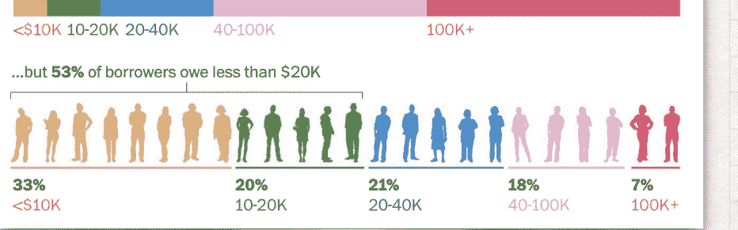
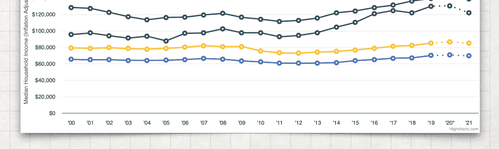
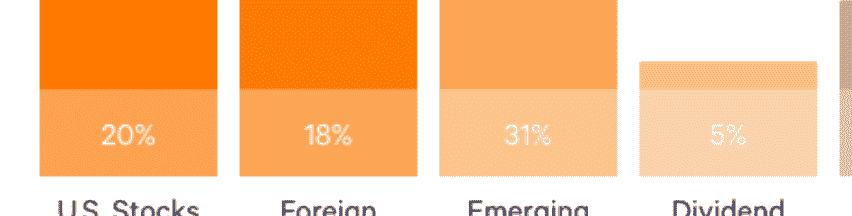
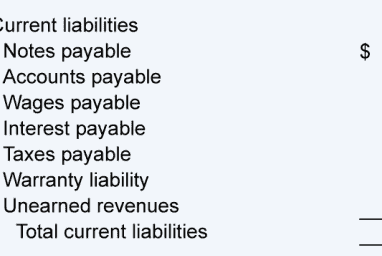
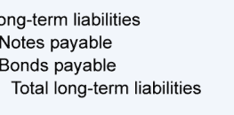
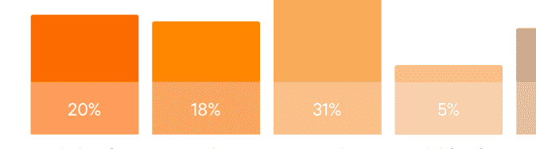

# 斯坦福 CS007 讲义

CS 007: SESSION 1

PERSONAL 

FINANCE FOR 
ENGINEERS

# Disclosures

STANFORD UNIVERSITY - COURSE MATERIAL - CS 007 - FALL 2023-4
- These slides are provided as-is and do not necessarily match the exact version of the content provided in classroom for students formally enrolled in the class at Stanford University. 

- This presentation is intended to provide information and frameworks to assist the additional research and education of individuals. This presentation is not financial advice, nor is it intended to provide advice for specific financial decisions. 

- These slides are provided publicly to be used for non-commercial purposes only. All material derived from this content must include appropriate citations to Adam Nash & Stanford University. 

# Why Personal Finance?

- Poorly covered in secondary school 
& university curricula, even at top schools. 

- Not technically difficult, but the signal-to-noise ratio is terrible. 

- Massive impact on your life. - Affects **everyone**.

* Please note: many of the hand-made drawings in this presentation are sourced from Carl Richards, behaviorgap.com

# Why For Engineers?

- Engineers are typically well educated in math, and enjoy it. 

- Engineers face significant financial decisions early in life. 

- Engineers tend to believe that they are rational decision makers. 

- Engineers create products that can affect the finances of billions.

# Real Questions, Real Data

- Most adults do not feel comfortable talking about money & financial decisions with friends & colleagues. 

- Bad data can lead to bad decisions - This class will be based, whenever possible, on real data 
- Please push yourself to share openly, and ask the questions you really want answers to.

# Social Contract: Build Trust

- Students in this class come from a wide variety of financial situations 
- We are lucky, because this diversity can help educate us on a broader set of potential financial decisions 
- Assume your classmates deserve privacy about the financial information they choose to share 
- Do everything you can to earn & 
deserve their trust

# 1: What Year Are You?

- This class is optimized for students who will be graduating soon. 

- It is never too early to start learning about personal finance. 

- My personal journey really started after my sophomore year, when I interned with Hewlett-Packard…

* https://www.businessinsider.com/personal-finance/best-money-adam-nash-ever-spent-2015-4

# 2: How Do You Define Wealth / Success?

- Is there a "magic number?" - Expectations vary widely. - Some people find success focusing on goals, others on running up a score. 

- Your peers do not adequately describe the range of successful financial outcomes possible, nor the range of lifestyles that could make you happy.

Low: $10,000 

 High: $1 Trillion 

# 3: How Much Do You Know About Your Parents

- Many parents are conflicted about how to talk about money. 

- This is not surprising, because money can be an uncomfortable reflection of values & behavior. 

- Many parents are better prepared to discuss sex & drugs with their children than money. 

- This class could be an opportunity for you to learn with your family.

# 4: Purchased Stock, Etf Or Mutual Fund?

- 64% of American households have Amazon Prime, but only 52% own stocks. (Source: Gallup) 
- The top 1% of households by wealth own 56% of all company shares. (Source: Goldman Sachs, FT) 
- Owning stock can be a path to learning about companies & investing. 

- Investing in equities, ideally through an index fund, can be one of the best 

 ways to build long term wealth.

# 5: Filed Your Own Taxes?

- If you earn money from a job, you should be filing taxes. 

- Many financial decisions are seriously impacted by taxes. 

- Ignoring the after-tax value of a financial decision can lead to serious financial mistakes. 

- An irrational fear of taxes can also lead to poor financial decision making.

# 6: Student Loans That You Are Responsible For?

-  National student loan debt at $1.75T
-  45 million student loan borrowers.

-   Average debt for per borrower in 2021 was $39,351.

-  25% of borrowers default in 1st five years of repayment.

 About 13% of federal student debt is held in loans with $20K or less still owed...

5% 8% 
17%
32%
38%

* https://fred.stlouisfed.org/series/SLOAS
*   https://www.nerdwallet.com/article/loans/student-loans/student-loan-debt
*   https://www.washingtonpost.com/education/2022/05/22/student-loan-borrowers/
>
 6 Do you have student loans that you will be responsible for after college?

146 out of 146 people answered this question Nope 117 resp.   80.1%
Between $20K - $50K
10 resp.

| 6.8%   |
|--------|

Less than $20K
8 resp.

5.5%

| 6 resp.   | 4.1%   |
|-----------|--------|

Between $50K - $100K

# 7: What % Of Your Salary Should You Save?

· Spend less than you make.

-  10% is not the right answer.

-  There is no magic rate of savings, but when you save you win two ways.

- Saving means learning to live on less, which lowers your goal.

-  Saving means more capital to invest to reach your goals.

V

When you graduate, what percentage of your salary do you believe you should save every month?

146 out of 146 people answered this question 20%+
98 resp.    67.1%
15%
30 resp.   20.5%
10%
17 resp.     11.6%

| 0%   |
|------|

# 8: What % Of Americans Have $400 For Emergencies?

- Commonly misquoted statistic. 

- US Federal Reserve reported in 2023 that 37% of Americans do not have sufficient 

 cash savings to cover a $400 emergency 

 expense. 

- Actual survey question reveals the number is 13% that self-reported that they couldn't cover the emergency through other means. 

- Liquidity means having access to money 

| when you need it.   |                                                                 |
|---------------------|-----------------------------------------------------------------|
| -                   | Don't underestimate the value of liquidity.  Liquidity matters. |

* https://www.federalreserve.gov/publications/2023-economic-well-being-of-us-households-in-2022-executive-summary.htm

# 9: What Do You Believe Is Median Income In Us?

- Financial statistics can be confusing, because the time period, data set and questions vary dramatically. 

- US Census reported median household income at $74,580 for 2022. It was $76,330 in 2021. 

- US Census reported median household income in California at $85,300 in 2022. 

- Median household income in Palo Alto, CA was $194,782 in 2022.

* *https://www.census.gov/library/publications/2023/demo/p60-279.html* * *https://www.statista.com/statistics/205778/median-household-income-in-california/* * https://www.point2homes.com/US/Neighborhood/CA/Santa-Clara-County/Palo-Alto-Demographics.html * https://siliconvalleyindicators.org/data/economy/income/household-income/median-household-income/

# 10: What Financial Decisions Do You Want To Cover?

- Good news: we will cover most of them in the prepared sessions 

- Lots of questions about stocks, investing, and options 
- Additional Topics from Last Year 
- Venture Capital / Private Equity - Derivatives - Crypto CS 007

SYLLABUS

# Administrative Details

- Email: 
adamnash@cs.stanford.edu
- Slides will be posted on the course blog: 
http://cs007.blog
- Everyone who wants to take this class can take this class… 
- To register attendance: 
- Visit https://bit.ly/cs007-attend
- Enter SUNET & Secret Word - Timestamp tells the tale 
- As long as the timestamp for the magic word is before midnight, you are good. 

# Week 2: Predictably Irrational

-  Behavioral Finance Cognitive Bias o
- Impact on Financial Decisions

DESIGNHACKS.CO · CATEGORIZATION BY BUSTER BENSON · ALGORITHMIC DESIGN BY JOHN MANOOGIAN III (JM3) · DATA BY WIKIPEDIA
©creative s

## * Designhacks.Co: 188 Known Cognitive Biases

# Week 3: Getting Paid

# Week 4: Spend Less Than You Make

- Income vs. Spending - Time frames - Budgets - Savings Rates - Personal Income Statement

# Week 5: Your Financial Profile

# Week 6: Credit & Debt. Digging Out.

- Different types of Debt: 
Student Loans, Auto, Credit Cards, Mortgage 
- Secured vs. Unsecured Loans - Loans & Rates - Credit Scores - Compounding in Reverse

# Week 7: Good Investing Is Boring

- The Magic of Compounding - How to Calculate Returns - Different Types of Investments: 
Stocks, Bonds, Commodities, Real Estate 
- Diversification - Modern Portfolio Construction - Taxes Matter

# Week 8: Financial Goals

- How to Plan for Financial Goals - Different Types of Goals: 
Travel, Marriage, House, Children, College, Starting a Business, Retirement 
- Life Insurance - Couples & Financial Decisions

# Week 9: Location, Location, Location

- Real Estate - Rent vs. Buy - The Home as an Investment - Rental Properties / Passive Income - REITs & Partnerships - Tax Benefits

# Week 10: People'S Choice

- Student Selected Topics 
- Derivatives - Venture Capital - Crypto! 

- Final Thoughts - CS 007 Alumni CS 007 QUESTIONS

,但是一个人的一个人的一个人的一个人 র প্রায় বাংলাদেশ করে না করে না করে না করে না করে না করে না করে না করে আর কর CS 007: SESSION 2

PERSONAL 

FINANCE FOR 
ENGINEERS
CS 007 PREDICTABLY
IRRATIONAL
COGNITIVE BIAS CODEX

DESIGNHACKS.CO · CATEGORIZATION BY BUSTER BENSON · ALGORITHMIC DESIGN BY JOHN MANOOGIAN III (JM3) · DATA BY WIKIPEDIA
ලද්දි 1 mmons
*"Predictably Irrational" is the title of a book by Dan Ariely
* DesignHacks.co: 188 Known Cognitive Biases BEHAVIORAL FINANCE
How many of you think you are rational with your money?

| (show of hands)   |
|-------------------|

GAMBLER'S FALLACY

ANCHORING MENTAL ACCOUNTING CONFIRMATION & 

HINDSIGHT BIAS

# You Are Not 

 Rational

HERD BEHAVIOR OVERCONFIDENCE OVERREACTION & 

AVAILABILITY BIAS

LOSS AVERSION

# Why Behavioral Economics?

- A number of economic frameworks assume that humans evaluate financial decisions consistently & rationally 
- **Daniel Kahneman & Amos Tversky** 
(1960s) 
- 2002 Nobel Memorial Prize in Economic Sciences 
- Prospect Theory

# Three Themes In Behavioral Economics

- **Heuristics**
Humans make a vast majority of their decisions using mental shortcuts or rules of thumb. 

- **Framing**
Humans use anecdotes & stereotypes to understand & respond to events 
- **Market Inefficiencies**
Mis-pricing or non-rational decision making

# Anchoring

- People estimate answers to new & 
novel problems with a bias towards reference points 
- **Tversky & Kahneman (1974)** 
(quick multiplication) 
- **Dan Ariely**
(social security numbers & prices) 
- Common examples: 
- Price you bought a stock at - High point for a stock

# Mental Accounting

- Money is fungible, but people put it into separate "mental accounts" 
- Also known as "bucketing" - Example: Lost Movie Tickets - Example: "Found Money" - Real world problems: 
Vacation Fund & Credit Card Debt

# Confirmation & Hindsight Bias

- Very different biases, but often conflated with each other. 

## - **Confirmation Bias**

We selectively seek information that supports pre-existing theories, and we ignore / dispute information that challenges or disproves them. 

- **Hindsight Bias** 
We overestimate our ability to predict the future based on the "obviousness" of the past. 

- Combination of the two is particularly bad.

# Gambler'S Fallacy

- We see patterns in independent, random chains of events. 

- We believe that, based on a series of previous events, an outcome is more likely than odds actually suggest. 

- Example: Dinner Party & Coin Flips - Real odds might be 51/49, but we tend to jump to 80/20. 

- Likely cause: the rarity of "independent events" in day-to-day experience.

# Herd Behavior

- We have a tendency to mimic the actions of the larger group 
- Example: Building Psych Experiment - Example: Empty Supermarket 
- Crowd psychology may be a contributor to bubbles. 

- Bucking the crowd creates stress & fatigue. 

It gets harder, not easier. 

- Easier to be "wrong with everyone" than 
"right and alone" 
- No gets fired for buying IBM?

# Overconfidence

- In "Behaving Badly" (2016), 74% of investment managers believed that they deliver above-average performance. 

- Dunning-Kruger Effect. The more poorly you perform, the more you over-estimate your performance. 

- Capability in one domain can lead to overconfidence in others. 

- Humility is a virtue.

# Recency & Availability Bias

- **Recency Bias**
We overreact to recent events 
- Example: Celebrity Illness 
- **Availability Bias**
We assume that the data we have been provided is representative of the entire data set. 

- The combination is particularly bad. 

- Studies show checking stock prices daily leads to more trading & worse results on average. 

- Worse for engineers, because we are immersed in "game changers" & "it is different this time"

# You Have **$1,000** And You Must Pick One Of The Following Games

You have a 50% chance of gaining $1,000, and A a 50% chance of gaining $0. 

OR
B You have a 100% chance of gaining $500.

# Now, You Have **$2,000** And You Must Pick One Of The Following Games

You have a 50% chance of losing $1,000, and a 50% chance of losing $0. 

OR

You have a 100% chance of losing $500.

# Loss Aversion (Prospect Theory)

- **We hate losses more than we love winning** - Average loss aversion across multiple studies is between 2:1 and 3:1 
- Affects our views on a wide range of situations, including career decisions, dating, purchasing, investing and taxes. 

- We even hate being responsible for decisions that could result in a loss 
- Example: "Sunk Cost" mistakes with investments 
- **Currently under debate!***
* https://blogs.scientificamerican.com/observations/why-the-most-important-idea-in-behavioral-decision-making-is-a-fallacy/?amp IT'S OK TO NOT BE RATIONAL

# It'S Ok To Not Be Rational

- As Dan Ariely beautifully put it, the key is that humans are **predictably** irrational
- Know your own flaws, and you can set up systems to help account for them 
- Self awareness is key 
(yes, my Mom is a psychologist)

# Additional Courses & Material

- Econ 178: Behavioral Economics - Econ 278: Behavioral & Experimental Economics 
- ACCT 618 (GSB): Market Efficiency & 
Informational Arbitrage 
- Coursera / Duke: Behavioral Finance https://www.coursera.org/learn/duke-behavioral-finance CS 007 QUESTIONS

,但是一个人的一个人的一个人的一个人 র প্রায় বাংলাদেশ করে না করে না করে না করে না করে না করে না করে না করে আর কর

# Next Week: Getting Paid

CS 007: SESSION 3

PERSONAL 

FINANCE FOR 
ENGINEERS

# Nobel Prize In Economics For 2017

- Richard Thaler (@R_Thaler) 
- Professor @ University of Chicago, "Nudge" 
- **Key insights:** 
- Mental Accounting - Endowment Effect 
- **Nice write-ups on NYT & Vox:** 
- https://www.nytimes.com/2017/10/09/
business/nobel-economics-richard-thaler.html
- https://www.vox.com/policy-and-politics/
2017/10/9/16447752/richard-thaler-nobelexplained-economics

Understanding how people are paid

# Compensation Compensation

- **Attract talent to your company**, by rewarding capability with competitive market-based pay. 

- **Motivate employees** by rewarding performance aligned with company strategy & objectives. 

- **Retain employees** by fairly matching their contribution to the company 
- Compensation is only one part of culture, but it is a critical part.

# Components

- **Base Pay** - **Relocation / Signing Bonus** - **Annual Bonus** - **Equity Compensation** - **Financial Benefits** - Perks

# Components: Base Pay

- **Key factors:** Level, Function, Geography
- **Market data** easily accessible by companies, increasingly available to individuals. 

- **Adjustments** are most commonly made due to annual inflation, internal audit, market competitiveness, promotion.

# Components: Bonus

- **Signing Bonus / Relocation:** Money paid up-front, at first pay period, to help with move / relocation or to improve offer without affecting base salary. Be careful: usually has a clawback.

- **Annual / Quarterly Performance Bonus:**
Typically a company wide program, fixed potential % based on level, based on both individual & company results.

- **Spot Bonus:** Less common, but managers occasionally are empowered to give one-off bonus to teams / individuals to reward results.

# Components: Equity

- Designed to align employee compensation with shareholder results.

- Particularly attractive to companies that are cash sensitive. 

- Very common at almost all levels & 
roles in technology. Other industries tend to skew towards executives. 

- Two common forms: 
stock options & restricted stock.

# Components: Financial Benefits & Perks

- Wide variety of benefits that either offer employees tax advantages or shift costs to employer. 

- Health Insurance, Retirement, Stock Purchase likely the most significant. 

- Increasingly common at large, wellfunded tech companies to see fairly expensive perks (food, transit, fitness) 
- Benefits tend to be very uneven in value to employees depending on their personal situation & needs.

Understanding how people are paid

EQUITY

# What Is Equity?

- Fancy name for the value of a share of ownership of the business. 

- Company ownership is divided into shares, and those shares entitle owners to various rights. 

- There can be different classes of shares. This is very common with private companies. 

- In the simplest case, you can determine how much of a company you own with this fraction 
( \# of shares you own)
( \# of shares total )

# Public Companies

- There are ~5.8 million employer businesses in the US. Fewer than 4,000 are publicly traded. 

- 99.7% fewer than 500 employees. 

- Public companies tend to be larger, as measured in employees & revenue. 

- Strict regulations for public companies on timeliness and content of financial results published for the public. 

- Market price for both stock and stock options extremely transparent. 

* US Census Bureau 2014 http://sbecouncil.org/about-us/facts-and-data/

# Private Companies

- Most businesses are private, but for graduating engineers most relevant form are venturebacked startups. 

- Private companies have multiple share classes, and are frequently cashflow negative. 

- Future financing means **dilution**. Your share of the company will decrease as the company issues more shares. 

- You cannot evaluate a company's equity without knowing **the amount raised** and at **what terms** & preferences. 

- Companies vary widely in how much they disclose to their employees & candidates. 

- For the most part, you cannot sell your stock when a company is private.

# Stock Options

- Stock options are a "derivative," a security based on another security. There are many types, but for compensation they represent "the right to buy" 
- Key terms 
- **Grant date.** When you receive the options. Typically after the first board meeting when you start.

- **Vesting Start Date.** Typically your first day of work.

- **Vesting Schedule.** Typically 4 years, with a 1 year cliff. - **Exercise / Strike Price.** Typically fair market value the day the options are granted.

- **Expiration Date.** Typically 10 years, although 7 is not uncommon. Expiration triggers early if you leave the company (90 days).

- There are tax consequences if the strike price does not match the current fair value, and when you exercise them. **Pro Tip: 83(b)** 
- There are tax consequences when you exercise a stock option based on type (ISO vs. NQSO), but not when you vest them. 

- **Intrinsic value** is market price - strike price. **Time value** adds the value of the option itself & the flexibility it provides.

# Restricted Stock

- Restricted stock is a broad term for shares in a company that have restriction on their ownership (example: vesting). 

- **Restricted Stock Units (RSUs)** are a promise from a company to issue shares to the employee. **Restricted** Stock are actual shares with a restriction on them. 

- There is no strike price. You are granted a number of shares with a vesting schedule. 

- You owe income taxes immediately when you vest restricted stock. Most companies withhold taxes by selling the portion of stock necessary at that time. 

- Originally a feature at public companies (e.g. Google), 
became increasingly common at large private companies when strike price becomes prohibitive. 

- Once vested, there is no meaningful tax difference between these shares and ones you could buy that same day with cash.

# Stock Options Vs. Restricted Stock

- Stock options can be worthless if the value of the stock drops below the exercise price. Restricted stock only becomes worthless if the stock price drops to zero. 

- Employees typically receive more shares via stock options than via restricted stock, because the restricted stock lacks a strike price and is worth more than an option. Ratio can be 3:1. 

- Both have liquidity concerns. 

- With stock options, not everyone has the cash to exercise their stock & pay related taxes when they leave the company. 

- With restricted stock, you likely will not be able to sell your earned shares until a liquidity event (IPO or acquisition). 

- Significant tax benefits with stock options, because you do not owe taxes upon vesting & you can control when you exercise. 

- Common stock is valued significantly below preferred stock in private companies, but that difference disappears when a company goes public. AS a result, your strike price is typically at a discount to the preferred stock. 

- Restricted stock is much easier to value in present day dollars.

EVALUATING OFFERS
Looking at real world offers from 2022-23

# Four Offers: Titantech Public

- Based on real offer data - **Size**: 10,000+ people 
- **Market capitalization** of over $100B 
- **Title**: Software Engineer - **Offer Terms**: 
- Base compensation: $120,000 - $140,000 - Relocation / Signing Bonus: 
$10,000 to $25,000 
- Annual Bonus: 10% 
- Equity: RSUs with a current value of $100K 
to $150K, vesting over 4 years 
- Perks / Benefits: Too many to count, 401(k) 
match of 100%

# Four Offers: Unicorntech Private

- Based on real offer data 
- **Size**: 500+ people 
- **Market capitalization** of over $1B - **Title**: Software Engineer - **Offer Terms**: 
- Base compensation: $140,000 
- Relocation / Signing Bonus: $10,000+ - Annual Bonus: None - Equity: Either $200K - $320K RSU or Stock options for 0.01% of the company, vesting over 4 years 
- Perks / Benefits: Free food, lots of perks, no 401(k) matching.

# Four Offers: Nextbigthing

- Based on real offer data - **Size:** 30 people 
- **Market capitalization**: raised $15M Series A at 
$60M valuation 
- **Title**: Software Engineer - **Offer Terms** 
- Base compensation: $120K - $145K - Relocation / Signing Bonus: $0 - Annual Bonus: None 
- Equity: Stock options worth 0.1% (10 bps) 
of the company, vesting over 4 years 
- Perks / Benefits: Basic. Health insurance, 401(k), Parking / Transit Pass.

# Four Offers: Toobigtofail Jumbobank

- Based on real offer data 
- **Size:** 100,000+ people 
- **Market capitalization**: Over $200B - **Title**: Analyst - **Offer Terms** 
- Base compensation: $100K - $120K 
- Relocation / Signing Bonus: $20K 
- Annual Bonus: $60K - $100K 
- Equity: None - Perks / Benefits: Generous financial benefits, not a lot of perks, quite a bit of travel & airline miles. 

- Considerations: 80-100 hr weeks, travel, unpredictable timing (deals) 
- **With promotion, can reach $300K - $500K total** 
compensation in 3-5 years. 

# It'S Never Just About Money

- For equity, what is the potential for upside in the value of the company? Downside? 

- Company success disproportionately affects job offers from future companies, but success in technology can be fleeting. 

- Title vs. Compensation vs. Quality - Talent & network matters significantly - Building skills / experiences / achievements with lasting value 
- Career trajectories vary. Success rates. Luck. 

Potential future roles. 

- The market is fairly efficient, but it does not compensate for all types of risk.

# Last Word: Negotiation

- The market is fairly efficient, but companies vary significantly in their approach. 

- Some reward negotiation. Others explicitly work against it. Lack of negotiation is one of the contributing causes to pay disparity. Polite but firm is often the right approach. 

- High quality companies do a lot of work on fair compensation, but startups can vary widely. Know the market data. 

- Some terms are more flexible than others. Base comp is often more difficult to move than signing bonus or equity. If you are going to a private company, it's almost always a bet on equity anyway. 

- Don't be afraid to approach the topic of fair compensation with your manager. Understand the difference in roles between a recruiter & a manager. 

- Be emotionally honest with yourself on what is a deal breaker. Lines in the sand can be hard to erase.

CS 007 QUESTIONS

,但是一个人的一个人的一个人的一个人 র প্রায় বাংলাদেশ করে না করে না করে না করে না করে না করে না করে না করে আর কর

# Week 4: Spend Less Than You Make

- Income vs. Spending - Time frames - Budgets - Savings Rates - Personal Income Statement CS 007: SESSION 4

PERSONAL 

FINANCE FOR 
ENGINEERS
EVALUATING OFFERS

Final Thoughts

# Last Word: Negotiation

- The market is fairly efficient, but companies vary significantly in their approach. 

- Some reward negotiation. Others explicitly work against it. Lack of negotiation is one of the contributing causes to pay disparity. Polite but firm is often the right approach. 

- High quality companies do a lot of work on fair compensation, but startups can vary widely. Know the market data. 

- Some terms are more flexible than others. Base comp is often more difficult to move than signing bonus or equity. If you are going to a private company, it's almost always a bet on equity anyway. 

- Don't be afraid to approach the topic of fair compensation with your manager. Understand the difference in roles between a recruiter & a manager. 

- Be emotionally honest with yourself on what is a deal breaker. Lines in the sand can be hard to erase.

CS 007

SAVING & BUDGETS

# Income & Expenses

Spend less than you make

# Don'T Buy Stuff You Cannot Afford

https://www.nbc.com/saturday-night-live/video/dont-buy-stuff/n12020

# Spend Less Than You Make

- This is the **ultimate secret** to personal financial success. 

- Important at almost every level of income & wealth. 

- Important for all levels of success & 
intelligence. 

- There is no amount of money that you can't spend. There are reasons 

 why multi-millionaires go broke. 

- Very easy to measure, few people do.

# Why Is This Difficult?

- Not all expenses happen in the same time frame as income. Paycheck every two weeks vs. monthly or annual bills. 

- Not all expenses are predictable - Endowment effect can be counter-productive. 

A budget of $300 for clothing per month turns into a license to spend more than you need. 

- Credit cards make it trivial to overspend - Incomes fluctuate but lifestyle & expenses are sticky. Very difficult when you make a lot of money in a short amount of time (Hollywood, Pro Sports, Silicon Valley) 
- Taxes are complicated.

# Stop Keeping Up With The Joneses

- Why do we do it? 

- Desire to show off our success - Need to have what other people have. Even worse when it's an aggregation across a wide variety of lifestyles. 

- They are broke. - You have to set your own priorities.

SAVINGS RATES
How Much Should You Save?

# Us Savings Rate

- Actually a number that governments track as an important macroeconomic statistic. 

- US Personal Savings Rate was 3.6% 
in August 2017, but 8.1% in August 2019. Now 14.1% due to 2020 crisis. 

- Savings = Income - Spending - Does not account for non-income value generation or for future 

 liabilities
* https://tradingeconomics.com/united-states/personal-savings
* https://ycharts.com/indicators/personal_saving_rate

# What'S The Ideal Target?

- Most common recommendations: 
10% & 15% 
- No mathematical basis for 10%. Humans just like the number 10. 

- 15% is based on historical assumptions of length of time working, rate of return, wage inflation, and 80% retirement income goal. 

- Real answer: every % matters. 

- You lower the amount you need to live on / lifestyle. 

- You increase the pool of capital to hit that goal.

# Employer Benefits To Saving

- Compensation structure can affect savings rates. - If you receive a 10% bonus and don't spend it, that boosts your savings rate. 

- Unfortunately, most people spend **more than** 
their expected bonus before they receive it. 

- Three systemic ways to boost savings rates: 
- Forced savings (e.g. Australia) makes it a requirement to save a % of your pay. 

- Employer match (e.g. 401k) can contribute significantly to overall savings rates. (It's free money. Take it.) 

- Health savings accounts (HSA) may contribute to savings as well, although empirical evidence is limited.

# Mortgage As Forced Saving

- 65.6% of Americans are homeowners 
(as of Q1 2021) 
- Mortgage payments are made of two components: interest & principal. 

- Paying off debt wipes a liability off your books, leaving the asset. This boosts your net worth, just like savings does. 

- For many Americans, the forcing function of monthly principal payments effectively leads them to build significant value in their homes over long time periods (decades).

* https://www.census.gov/housing/hvs/files/currenthvspress.pdf

# The Benefits Of Automation

- Pay Yourself First 
- Build a budget, calculate your savings, automate the withdrawal, just like taxes. 

- Opt-out enrollment in 401(k) plans is far more effective than Opt-in. 

- Automatic increases in 401(k) contributions is far more effective than Opt-in. 

- When your salary increases, try to save that percentage. You can boost your savings rate over time. 

- Money not seen is less likely to be spent.

* https://www.census.gov/housing/hvs/files/currenthvspress.pdf BUDGETING
Where Does Your Money Go

# What Is A Budget

- Breakdown of spending, by category - If you are settled, you can build a surprisingly accurate budget by looking at your spending for the last 3 months and averaging. 

- Don't forget annual expenses - Emergency fund is meant to handle truly unusual expenses, not overspending on holiday gifts.

* https://ycharts.com/indicators/personal_saving_rate

# Tracking Empirical Vs. Ideal Results

- Big difference between what you are spending in a category & what you need to spend in a category 
- Comparables from colleagues / 
friends are valuable, but need to be taken in context 
- Track your ideal vs. empirical results on a regular basis. 

- The key metric for a budget is whether or not it is realistic

# Needs / Wants / Savings & Debt

- "All Your Worth" - Elizabeth Warren 
(D) co-authored with her daughter 
- 50 / 30 / 20 in the book, but those are unlikely to be your \#'s. 

- **Needs**: Keep roof over your head, safe, healthy and able to work. 

- **Wants**: Any other consumption - **Savings / Debt**: Paying down debt, building emergency fund, saving for long term goals

# You Can Make It Work

- There are people who make less than you who manage to save 
- There are people who make more than you who go bankrupt. 

- Beware of emotional justification: language like "I've earned this" or "I deserve this" or "why not me?" 
- It has been demonstrated that just the act of making a budget reduces the amount that people spend. 

- Do not be surprised if you go over your budget. Leave a buffer estimating income & allocating spending.

INCOME STATEMENT

Pulling It All Together

# What Is An Income Statement

-   An income statement is a financial statement that reports a company's financial performance over a specific accounting period.

· A personal income statement reviews a time period including income, expenses, and savings.

Revenues

| Merchandise Sales   | રે     | 24,800   |
|---------------------|-------|----------|
| Music Lesson Income | 3,000 |          |
| Total Revenues:     |       |          |

ર્
27,800

| Cost of Goods Sold   | 10,200   |        |
|----------------------|----------|--------|
| Depreciation expense | 2,000    |        |
| Wage expense         | 750      |        |
| Rent expense         | 500      |        |
| Interest expense     | 500      |        |
| Supplies expense     | 500      |        |
| Utilities expense    | 400      |        |
| Total Expenses:      |          | 14,850 |
| Net Income           | $        | 12,950 |

## Expenses

# Example: Income Statement

-  Best source for income data:
Pay Stub o Best source for expenses?

Last 3 months of spending 0 Best source for comparables?

Colleagues / Friends / Family

| Income                      | Expenses                 |                  |                     |          |      |
|-----------------------------|--------------------------|------------------|---------------------|----------|------|
| Salary                      | Housing                  |                  |                     |          |      |
|                             | Utilities                | $ 300.00         | 2.5%                |          |      |
| UnicornTech                 | $ 12,000.00              | 100.0%           |                     |          |      |
| - Taxes                     | ($ 2,430.40)             | 20.3%            | Water/Garbage       | $ 120.00 | 1.0% |
|                             | AT&T Wireless            | $ 120.00         | 1.0%                |          |      |
| - Insurance                 | ($ 739.98)               | 6.2%             | TV / Netflix / Hulu | $ 110.00 | 0.9% |
| Total Salary                | $ 8,829.62               | 73.6%            |                     |          |      |
| Total Income                | $ 8,829.62               | 73.6%            | Home Insurance      | $ 76.50  | 0.6% |
|                             | Maintanence              | $ 200.00         | 1.7%                |          |      |
|                             | Total Housing            |                  |                     |          |      |
| Savings                     | $ 926.50                 | 7.7%             |                     |          |      |
| Retirement                  |                          |                  |                     |          |      |
| Roth 401K                   | $ 500.00                 | 4.2%             | Auto                | $ 323.50 |      |
|                             | Toyota Prius             | 2.7%             |                     |          |      |
| IRA                         | $ 0.00                   | 0.0%             | Auto Insurance      | $ 132.29 | 1.1% |
| Total Retirement            | $ 500.00                 | 4.2%             | 0.8%                |          |      |
|                             | Gas                      | $ 100.00         |                     |          |      |
|                             | Repairs/License          | $ 0.00           | 0.0%                |          |      |
| College                     | End Auto                 | $ 555.79         | 4.6%                |          |      |
| Pride & Joy 529             | $ 250.00                 | 2.1%             |                     |          |      |
| Total College               | $ 250.00                 | 2.1%             | Household Expenses  |          |      |
| Total Savings               | $ 750.00                 | 6.3%             | Groceries/Costco    | $ 800.00 | 6.7% |
|                             | Dining Out               | $ 400.00         | 3.3%                |          |      |
| Debt Repayment              | Entertainment            | $ 50.00          | 0.4%                |          |      |
| Housing                     | Clothing                 | $ 150.00         | 1.3%                |          |      |
| Mortgage                    | $ 2,500.00               | 20.8%            | Periodicals         | $ 38.00  | 0.3% |
| Total Housing               | $ 2,500.00               | 20.8%            | Personal Spending   | $ 100.00 | 0.8% |
|                             | Pets                     | $ 50.00          | 0.4%                |          |      |
| College                     | Computers/Gadgets        | $ 200.00         | 1.7%                |          |      |
| Stanford Loans Consolidated | $ 250.00                 | 2.1%             | Gym                 | $ 70.00  | 0.6% |
| Total College               | $ 250.00                 | 2.1%             | Gifts               | $ 100.00 | 0.8% |
| Total Debt Repayment        | $ 2,750.00               | 22.9%            | Charity             | $ 300.00 | 2.5% |
|                             | Medical                  | $ 100.00         | 0.8%                |          |      |
|                             | Total Household Expenses | $ 2,358.00       | 19.7%               |          |      |
| Annual Expenses             | Annualized Expenses      | $ 716.67         | 6.0%                |          |      |
| Life Insurance              | $ 800.00                 |                  |                     |          |      |
| Property Tax                | $ 7,800.00               | End Expenses     | $ 4,556.96          | 38.0%    |      |
| Total Annual Expenses       | $ 8,600.00               | Cash Flow Buffer | 6.4%                |          |      |
|                             | $ 772.66                 |                  |                     |          |      |

# Ongoing Maintenance

- **Quarterly** 
- Check your progress, real vs. 

expected 
- **Annual** 
- Model in changes & learnings from real behavior. 

- **Automate** 
- The more you automate your savings & spending, the less room for error.

CS 007 QUESTIONS

,但是一个人的一个人的一个人的一个人 র প্রায় বাংলাদেশ করে না করে না করে না করে না করে না করে না করে না করে আর কর

# Next Week: Your Financial Profile

- Liquidity 

CS 007: SESSION 5

PERSONAL 

FINANCE FOR 
ENGINEERS
CS 007

ASSETS & NET WORTH
LIQUIDITY
access to money when you need it

# What Is Liquidity?

- How quickly can you get access to cash when you need it? 

- Market liquidity refers to the extent a marketplace allows assets to be bought & sold at stable prices. 

- Accounting liquidity measures the ease an individual or company can meet their financial obligations with the liquid assets available to them. 

- Don't underestimate the value of liquidity. Liquidity matters.

# Why Does Liquidity Matter?

- Liquidity is the only thing that matters when you need to pay for something. 

- Liquidity is the power to take advantage of investment opportunities.

# Liquidity & Returns

- Liquidity is typically **inversely** 
correlated with returns 
- **Examples** 
- Cash is very liquid - Private Equity is very illiquid 
- **Safety ≠ Liquidity** 
- 5 Year CD is safe, but illiquid 
- Tesla stock is liquid, but volatile!

# Emergency Funds

a financial buffer to protect your goals

# 8: What % Of Americans Have $400 For Emergencies?

- Commonly misquoted statistic. 

- US Federal Reserve reported in 2023 that 37% of Americans do not have sufficient 

 cash savings to cover a $400 emergency expense. 

- Actual survey question reveals the number is 13% that self-reported that they couldn't cover the emergency through other means. 

- Liquidity means having access to money when you need it. 

- Don't underestimate the value of liquidity. 

Liquidity matters.

* https://www.federalreserve.gov/publications/2023-economic-well-being-of-us-households-in-2022-executive-summary.htm

# Why Emergency Funds?

- Practical outcome of need for liquidity 
- Example of "mental accounting" used for financial health 
- Goal is to protect your long term assets / plans from unexpected short term needs.

# How Large Should An Emergency Fund Be?

- Standard recommendation is at least **3 months of living** expenses in cash or cashequivalents 
- Calculated based on impact of losing employment 
- National average is 3-6 months to find a job of equal pay. 

- Time increases in recession & 
based on your seniority.

# Common Mistakes With Emergency Funds

- Don't focus on investment return or opportunity cost. 

- Think of it as a **buffer**, or as insurance. Not as an asset. 

- First on the list to fill, first to refill if tapped for emergency. 

- Do not tap it for frivolous needs. It is for emergencies.

ASSETS & LIABILITIES
what you own & what you owe

# What Is An Asset?

- Any resource with economic value 
- **Financial assets** are investments in cash, bonds, stocks, etc. 

- **Real assets** are investments in real estate, collectibles, commodities, etc.

# Different Types Of Assets

- Liquid vs. Illiquid
- Financial vs. Real
· Appreciating vs. 

 Depreciating 
- Tangible vs. Intangible

# · Debt Owed To You

U.S. Stocks
16%
5%
5%

| Foreign   | Emerging   |             |           |        |
|-----------|------------|-------------|-----------|--------|
| Emerging  | Dividend   | Real Estate | Corporate |        |
| Stocks    | Markets    | Stocks      | Bonds     | Market |
|           | Bonds      |             |           |        |

* https://www.wealthfront.com/plan

# What About Human Capital?

- Easy to argue that your skills & capabilities are the largest asset you have. 

- Don't ignore "intangible assets" - sometimes they are the best investments. 

- Do remember that human capital varies significantly in liquidity.

* https://www.wealthfront.com/plan

# What Are Liabilities?

- A liability is a financial obligation, typically debt. 

- Most common personal liability is a loan. 

- **Common types** 
- Mortgage - Auto Loan - Student Loan - Credit Cards - Tax Liability

# Different Types Of Liability

# Credit Scores

- Lenders report to 3 major centralized credit agencies when you apply for debt, receive debt, and when you pay off debt. 

- Building a good credit score is essential for qualifying for most loans. It can affect other services too, as it is used for identity verification. 

- Issues that affect credit score: length of history, on time payment, percent of capacity utilized, new applications for debt, bankruptcy. 

- Credit Karma http://www.creditkarma.com

# Is Debt A Bad Thing?

- Modigliani-Miller market value is determined by earning power & risk of underlying assets, not by the method of financing. 

- Assumes no taxes, transaction costs, bankruptcy costs 
- Tradeoff Theory of Leverage There is an optimal capital structure.

# Should I Pay Off All Of My Debt?

- More debt = more risk - Not all debt is the same - Compounding is not your friend with debt, especially high interest debt. 

- Some debt is subsidized (e.g. 

Mortgage, Student Loans) 
- Paying off debt can be emotionally satisfying, but financially irrational. 

- Paying off debt can improve savings rates over time.

# Balance Sheet

know your net worth

# What Is Your Net Worth?

- **Assets - Liabilities** - **Total net worth** includes all assets. 

- **Liquid net worth** excludes illiquid assets & primary home (and related liabilities) 
- Do not confuse with cash flow. Very different.

* https://www.census.gov/data/tables/2018/demo/wealth/wealth-asset-ownership.html

# What Is A Balance Sheet?

- A balance sheet is a financial statement that summarizes a companies assets, liabilities &
shareholders' equity.

| 5,000   |
|---------|
| 35,900  |
| 8,500   |
| 2,900   |
| 6,100   |
| 1,100   |

- Assets = Liabilities + Equity
(see, it has to balance)
- Common ratios
· Cash Ratio ・ Quick Ratio
- Debt to Equity

| Goodwill     | 105,000                   | 110,000                                  |           |
|--------------|---------------------------|------------------------------------------|-----------|
| Trade names  | 200,000                   | Retained earnings                        | 220,000   |
| 305.000      | Accum other comprehensive | 9,000                                    |           |
|              | (50,000)                  |                                          |           |
| Other assets | 3,000                     | 289,000                                  |           |
| Total assets | $ 770,000                 | Total liabilities & stockholders' equity | $ 770,000 |

· Asset Turnover
· ROA (Return on Assets)

Balance Sheet

December 31, 2016

 

Total liabilities & stockholders' equity
$ 770,000

400,000

 420,000 481,000

* http://www.investopedia.com/articles/04/031004.asp?ad=dirN&qo=investopediaSiteSearch&qsrc=0&o=40186 The notes to the sample balance sheet have been omitted.

| Current asset    |          |     |
|------------------|----------|-----|
| Cash             | $ 2,100  |     |
| Petty cash       |          | 100 |
|                  | 10,000   |     |
|                  | 40,500   |     |
| Inventor         | 31,000   |     |
|                  | 3,800    |     |
| Supplie          | 89,000   |     |
|                  | 36,000   |     |
|                  | 5,500    |     |
| Land improvement | 6,500    |     |
| Buildings        | 180,000  |     |
|                  | 201,000  |     |
|                  | (56,000) |     |
|                  | 337.000  |     |

# Creating Your Personal Balance Sheet

· Very simple summary of a personal balance sheet
· Some recommend excluding primary residence (and related mortgage)
- Very different than income statement, but useful for evaluating progress

| 2,000.00          |             |            |                               |    |           |
|-------------------|-------------|------------|-------------------------------|----|-----------|
| 25,000.00         | 2.000.00    |            |                               |    |           |
|                   | 25,000.00   |            |                               |    |           |
|                   | 27,000.00   |            |                               |    |           |
| 800,000.00        |             |            |                               |    |           |
| 800,000.          | 5,000.00    |            |                               |    |           |
|                   | 5,000.00    |            |                               |    |           |
| 5,000.00          |             |            |                               |    |           |
| 5,000.00          | 15,000.00   |            |                               |    |           |
|                   | 115.000.00  |            |                               |    |           |
| 15,000.00         | Total Asset |            |                               |    |           |
| 115.000.00        |             |            |                               |    |           |
| Total Asset       |             |            |                               |    |           |
| Liabilities       | 5,000.00    |            |                               |    |           |
|                   | 5,000.00    |            |                               |    |           |
| 5,000.00          |             |            |                               |    |           |
| 5,000.00          | $30,000.00  |            |                               |    |           |
| Student Loans     | $30,000.00  |            |                               |    |           |
| Mortgage          | રે           | 640,000.00 | Total Liabilities             | રે  | 35,000.00 |
| રે                 |             |            |                               |    |           |
| Total Long Term   | 670,000.00  | $          |                               |    |           |
| Net Worth         | 112,000.00  |            |                               |    |           |
| Total Liabilities | રે           | 675,000.00 | (excluding primary residence) |    |           |
| Net Worth         | $           | 272,000.00 |                               |    |           |

CS 007 QUESTIONS

,但是一个人的一个人的一个人的一个人 র প্রায় বাংলাদেশ করে না করে না করে না করে না করে না করে না করে না করে আর কর

# Week 6: Credit & Debt. Digging Out.

- Different types of Debt: 
Student Loans, Auto, Credit Cards, Mortgage 
- Secured vs. Unsecured Loans - Loans & Rates - Credit Scores - Compounding in Reverse CS 007: SESSION 6

PERSONAL 

FINANCE FOR 
ENGINEERS
CS 007

ALL ABOUT DEBT

# Compounding

good for savings. bad for debt.

# The Magic Of Compounding

- Not convinced that Albert Einstein said it was the greatest force in the universe. 

- It's the key to almost all long term financial planning. 

- Exponentials are bad in algorithmic cost, good for savings returns. 

- The problem is that financial rates of return seem small, particularly in the early years. 

- The key is to stick with it.

# Compounding Made Easy

- Rule of 72 - For each year, just use 
=POWER(1+rate, year)
- 4% over 20 years is 2.19x - 8% over 20 years is 4.66x - Careful: it works on debt just as well as savings... in 

 reverse!

# Annual Percentage Rate (Apr)

- Standardized measure of how expensive a loan is, or the expected return of an investment 
- Needed because of the wide variety of fees and interest-rate structures possible. 

- Does not include compounding - Tends to be higher than nominal interest rate due to fees or related payment requirements. 

- **APR = simple interest**
APY = compound interest APR ≠ APY
APR = Periodic Rate x Number of Periods in a Year APY = (1 + Periodic Rate) ^ Number of Periods - 1 1% monthly = 12% APR = 12.68% APY

# The Benefits Of An Early Start

- Compounding really takes off over long time periods 
- Exponential functions are nonlinear. Every time period builds on the previous one. 

- In most retirement planning models, money saved between ages 25 - 35 produces more assets in retirement than all savings between 35 - 65!

| Years   | Return at 8%   |
|---------|----------------|
| 10      | 2.16x          |
| 20      | 4.66x          |
| 30      | 10.06x         |
| 40      | 21.72x         |
| 50      | 46.9x          |

# Types Of Debt

student loans, mortgage, auto, credit cards

# 6: Student Loans That You Are Responsible For?

- National student loan debt at: 
$1.76 Trillion 
- 55% of the Class of 2020 graduated with student debt. Average debt of $28,400 
- Average US household w/ student debt has $58,238 in debt. 

- 53% of borrowers owe less than 
$20,000 in student loan debt. 

- … but that represents only 13% of the total $ amount of student debt!

* https://fred.stlouisfed.org/series/SLOAS
* https://www.nerdwallet.com/article/loans/student-loans/student-loan-debt
* https://www.washingtonpost.com/education/2022/05/22/student-loan-borrowers/

# Student Loans

- $1.76 Trillion in the US, and growing rapidly. * - Unsecured loan provided to fund education & 
some related expenses 
- Loan programs for students & parents. Financial need based. 

- Interest rates can be fixed or variable. 

Significant difference in undergrad vs. grad 
- Rates are much lower than equivalent unsecured long term personal loan to a teenager. 

- US government subsidizes in a variety of ways: 
no interest, rate limits, payment programs, loan waivers 
- **Typical term is 10 years**, but research shows average payoff time is closer to 21 years due to alternative payment plans & refinancing
* https://fred.stlouisfed.org/series/SLOAS ** https://www.pewresearch.org/fact-tank/2019/08/13/facts-about-student-loans/

# Mortgages

- $19.3 Trillion in the US. $13.4 Trillion for just family residences. 

- Secured loan against a property. 

Can be residential or commercial. 

- Wide variety of terms. Interest rates can be fixed or variable. 

- Common mortgages: 30 year fixed, 5/1 adjustable rate mortgage (ARM) 
- Refinancing is common. - Qualification: debt / income, debt / 
property value, credit score
*https://www.statista.com/topics/1685/mortgage-industry-of-the-united-states/
*https://www.statista.com/statistics/274638/mortgage-debt-outstanding-on-us-family-residences/

# Auto Loans

- $1.58 Trillion (as of Q2 2023) - Secured loan against a vehicle, typically acquired at purchase. 

- Wide variety of terms. Interest rates can be fixed or variable. 

- Typically 3-5 years, fixed rate. - Rates vary significantly across providers, auto manufacturers use financing to influence demand. 

- Leasing vs. Buying - Qualification: credit score
* https://tradingeconomics.com/united-states/debt-balance-auto-loans

# Credit Cards

- $1.03 Trillion (Q2 2023) - Unsecured loan, paid on a revolving 30-day cycle 
- Wide variety of terms. Interest rates are typically variable. 

- Fees, benefits complicate simple analysis. 

- Interest rate is calculated daily, grace period can be counter-intuitive / expensive when exceeded. 

- Qualification: income, credit score - Key component of credit score (!)
* https://www.newyorkfed.org/newsevents/news/research/2023/20230808 * https://www.lendingtree.com/credit-cards/credit-card-debt-statistics/

# Credit Scores

your borrowing record & why it matters

# What'S A Credit Score

- Lenders report to 3 major centralized credit agencies when you apply for debt, receive debt, and when you pay off debt. 

- Building a good credit score is essential for qualifying for most loans. It can affect other services too, as it is used for identity verification. 

- Issues that affect credit score: length of history, on time payment, percent of capacity utilized, new applications for debt, bankruptcy. 

- Credit Karma http://www.creditkarma.com

# Why Do Credit Scores Matter?

- Critical component in qualifying for new loans and the rate they are set at. 

- Many products & services (like wireless & cable plans) utilize them as well to assess credit risk. 

- Often utilized for identity verification purposes. 

- Particularly difficult for new immigrants to build. 

- Seems like a Catch-22, but there are entry products that make it easier.

# How Do I Get A Credit Score?

- **Most common methods** 
- Secured credit cards - Student credit cards - Store credit cards 
- Authorized user on a parent's card - Student loans, auto loans - Don't pay interest. Don't miss a payment. Don't spend too much. 

- There are services now that report rent payments

# Loans & Rates

how much will you owe?

SIMPLE LOAN
$12,000 AT 0% INTEREST FOR 1 YEAR
$1,300.00

SIMPLE LOAN
$12,000 AT 12% INTEREST FOR 1 YEAR

# Amortization

- The process of reducing the value of a loan by a periodic amount. 

- PMT(), PPMT(), IPMT() built into spreadsheets 
- E60 teaches the basics of how to convert cash flows to rates of return (or vice versa) 
- Once you have payment, you can figure out interest & principal portions trivially on an iterative basis. (e.g. calc 1st period, reduce principal, repeat for 2nd period, etc)

# Sample Auto Loan $30,000 At 2.5% Interest For 3 Years

PAYMENT = $865.84.19 PER MONTH. FIRST MONTH = $62.50 INTEREST.

# Sample Auto Loan $30,000 At 8.5% Interest For 3 Years

PAYMENT = $947.03 PER MONTH. FIRST MONTH = $212.50 INTEREST.

# Sample Mortgage $800,000 At 4% Interest For 30 Years

PAYMENT = $3,819.32 PER MONTH. FIRST MONTH = $2,666.67 INTEREST.
# Paying Off Debt

different strategies to dig out

# The Dangers Of Debt

- Bankruptcy is literally when you can't pay your debts. You can't go bankrupt if you don't have debt. 

- You will never find a legitimate investment that pays 8% 
guaranteed, let alone 20%+ 
- You will find an endless supply of credit offers out there that will charge you 20%+ 
- "Bad" debt is toxic, your best return is to pay it off. But emergency fund can take precedence

# How Do I Pay Off Debt Efficiently?

- This process assumes you can allocate more $ 
per month to paying off debt than the minimum payments. Otherwise, that's your priority. 

- Organize your loans that you want to pay off. 

Exclude mortgage from this calculation. 

- Use consolidation to simplify loans and minimize interest rate. In some cases, extending the term can make sense to free up cash. 

- **Debt Snowball** is a popularized term. Refers to paying off the smallest loan first. Based on emotional benefit of paying off debt. 

- Mathematically, ideal to **line up loans in terms of** 
interest rate. Minimumize payments on all loans, use surplus to pay off most expensive loan first. 

- Problem is that you don't get cash flow relief until you completely payoff a loan.

|                | Student  Loan 1   | Student  Loan 2   | Credit  Card   | Auto Loan   |
|----------------|-------------------|-------------------|----------------|-------------|
| Amount         | $6,000            | $8,000            | $10,000        | $20,000     |
| Rate           | 2.5%              | 4.5%              | 22.9%          | 1.9%        |
| Min Pmt        | $200              | $250              | $120           | $450        |
| Term           | 10yrs             | 10yrs             | ~              | 3yrs        |
| Peanut  Butter | $500              | $500              | $500           | $500        |
| Snowball       | $1180             | $250              | $120           | $450        |
| Optimal        | $200              | $250              | $1100          | $450        |

* These numbers are illustrative only. They are not accurate representations of ASSUME $2,000 IN DEBT PAYMENT PER MONTH
payment amounts for the rate & period given.

# Should I Pay Off All Of My Debt?

- More debt = more risk - Not all debt is the same - Compounding is not your friend with debt, especially high interest debt. 

- Some debt is subsidized (e.g. 

Mortgage, Student Loans) 
- Paying off debt can be emotionally satisfying, but financially irrational. 

- Paying off debt can improve savings rates over time.

CS 007 QUESTIONS

,但是一个人的一个人的一个人的一个人 র প্রায় বাংলাদেশ করে না করে না করে না করে না করে না করে না করে না করে আর কর

# Week 7: Good Investing Is Boring

- The Magic of Compounding - How to Calculate Returns - Different Types of Investments: 
Stocks, Bonds, Commodities, Real Estate 
- Diversification - Modern Portfolio Construction - Taxes Matter CS 007: SESSION 7

PERSONAL 

FINANCE FOR 
ENGINEERS
CS 007

GOOD INVESTING IS BORING

# Compounding

good for savings. bad for debt.

# The Magic Of Compounding

- Not convinced that Albert Einstein said it was the greatest force in the universe. 

- It's the key to almost all long term financial planning. 

- Exponentials are bad in algorithmic cost, good for savings returns. 

- The problem is that financial rates of return seem small, particularly in the early years. 

- The key is to stick with it.

# Compounding Made Easy

- Rule of 72 - For each year, just use 
=POWER(1+rate, year)
- 4% over 20 years is 2.19x - 8% over 20 years is 4.66x - Careful: it works on debt just as well as savings... in 

 reverse!

# Annual Percentage Rate (Apr)

- Standardized measure of how expensive a loan is, or the expected return of an investment 
- Needed because of the wide variety of fees and interest-rate structures possible. 

- Does not include compounding - Tends to be higher than nominal interest rate due to fees or related payment requirements. 

- **APR = simple interest**
APY = compound interest APR ≠ APY
APR = Periodic Rate x Number of Periods in a Year APY = (1 + Periodic Rate) ^ Number of Periods - 1 1% monthly = 12% APR = 12.68% APY

# The Benefits Of An Early Start

- Compounding really takes off over long time periods 
- Exponential functions are nonlinear. Every time period builds on the previous one. 

- In most retirement planning models, money saved between ages 25 - 35 produces more assets in retirement than all savings between 35 - 65!

| Years   | Return at 8%   |
|---------|----------------|
| 10      | 2.16x          |
| 20      | 4.66x          |
| 30      | 10.06x         |
| 40      | 21.72x         |
| 50      | 46.9x          |

CLASS SURVEY
how do we feel about investing?

# In Which Type Of Market Would You Prefer To Invest?

In which type of market would you prefer to invest?

66 out of 66 people answered this question 1 36 / 55%
2 16 / 24%
3 14 / 21%

| A Rising Market    |
|--------------------|
| Either is Fine     |
| A Declining Market |

# In Which Type Of Market Would You Prefer To Sell?

In which type of market would you prefer to sell your investments?

| 66 out of 66 people answered this question   |                    |          |
|----------------------------------------------|--------------------|----------|
| 14                                           | A Rising Market    | 31 / 47% |
| 2                                            | A Declining Market | 19 / 29% |
| 3                                            | Either is Fine     | 16 / 24% |

# In Which Type Of Market Would You Prefer To Sell?

Which investment would you prefer?

66 out of 66 people answered this question

|    | The one that previously performed the best   |          |
|----|----------------------------------------------|----------|
| 1  | 37 / 56%                                     |          |
| 2  | It doesn't matter                            | 24 / 36% |
| 3  | The one that previously performed the worst  | 5 / 8%   |

# How Do You Maintain The Right Risk/Reward Balance?

How do you maintain your ideal risk / reward balance?

66 out of 66 people answered this question 1 2 

| Buy more of the winners   | 37 / 56%   |
|---------------------------|------------|
| Do nothing                | 23 / 35%   |
| Buy more of the losers    | 6 / 9%     |

3 

の 1000 000 000 000 000 000 000 000 000 000 000 000 

# Which Investment Would You Prefer?

Which investment would you prefer?

66 out of 66 people answered this question 1 Index fund with a 0.04% fee 43 / 65%
2

Great mutual fund with a 1% management fee

| 23 / 35%   |
|------------|

TYPES OF INVESTMENTS
stocks, bonds, commodities, real estate

# Common Ways To Invest

- We have aggregated over 200 years of data on the primary ways that people invest their money. 

- Real return is return net of inflation, which measures how money devalues over time. (in this chart, dollars) 
- Stocks have the highest annualized return over long time periods, but also higher volatility.

* http://www.econlib.org/library/Enc/StockMarket.html

# Stocks / Equities

- Stock is a security that represents ownership in a corporation. 

- There are over 4,000 publicly traded stocks in the US alone. 

- Returns based on capital appreciation 
& dividends. 

- Businesses over time grow with the economy & adjust for inflation 
- Many ways to sub-divide stocks: 
- Large cap vs. Small cap - US vs. Developed Markets vs. 

Emerging Markets 

- Growth vs. Value

# Bonds

- A bond is a debt investment representing a portion of a loan. 

- Maturity date, coupon rate & market price all matter. Typically issued at $1000 per bond, but then trade at any price. 

- Higher credit quality, the lower the rate. - Returns based on capital appreciation & 
interest income. 

- U.S. Treasuries = key benchmark - Many ways to sub-divide bonds: 
- Government vs. Corporate - Domestic vs. International 
- Municipal bonds have special tax treatment

# Commodities

- A commodity is a basic good used in commerce. 

- Renewable (e.g. agriculture, lumber) - Non-renewable (e.g. iron, oil, gold) - Returns based on appreciation only. - Simon-Ehrlich wager from 1980, scarcity vs. tech. Pick commodities non-government controlled, will they rise or fall in price? (Simon won in 1990, but there is quite a bit of debate about alternate time periods)
* https://en.wikipedia.org/wiki/Simon–Ehrlich_wager

# Real Estate

- Real estate is a combination of land & facilities that occupy that land. 

- Investment real estate excludes your primary residence. 

- Returns based both on rental income & capital appreciation. 

- Real Estate Investment Trusts 
(REITs) trade on the public markets w/ special tax treatment.

# Diversification

don't turn down a free lunch

# Asset Classes: Volatility & Correlation

- Asset classes vary in terms of historical return, but also vary in volatility 
- Movements of different asset classes vary in correlation 
- Asset class correlation has been increasing over time, but still varies.

* https://research.wealthfront.com/whitepapers/investment-methodology/

# Risk-Adjusted Return

- Absolute return of an asset class isn't the only thing that matters. Volatility also matters. 

- Bill Sharpe developed the Sharpe Ratio in 1966, revised in 1994.

# Modern Portfolio Theory

- Harry Markowitz introduced in 1952. 

Nobel Prize.

- You can reduce portfolio risk for a given expected return by combining different asset profiles

# - The Markowitz Bullet

* https://en.wikipedia.org/wiki/Modern_portfolio_theory

# Taxes Matter

- Tax rates vary for interest, dividends & capital gains. 

- Asset classes vary in terms of the source of their historical return. 

- After-tax risk-adjusted return is critical for taxable accounts. 

- Before-tax risk-adjusted return is critical for taxdeferred accounts (401k, IRA)
* https://research.wealthfront.com/whitepapers/investment-methodology/
what to do & why you do it

# How To Invest Brokerage Accounts

- In most countries, large banks provide brokerage services. 

- In the United States, brokerages are financial firms that offer security accounts, regulated by the SEC & FINRA. 

- Most large banks have acquired or built brokerages. 

- These are not bank accounts, but they are institutions where you can deposit money and purchase (and sell) securities. 

- Unlike bank accounts, you can lose money. 

Investments can and do go down, sometimes over long periods of time. 

- SIPC insurance created in 1970, is currently 
$500,000. Covers when brokerages inappropriately endanger customer assets.

# How Do You Measure Investment Return?

- Alpha α is defined as excess return over the market rate of return. 

- Beta β is defined as the measure of volatility compared to its market benchmark over time. 

- Beta of 1 implies expected market performance & volatility. 

- Both are derived from the Capital Asset Pricing Model (CAPM) 
- The key is to achieve the best riskadjusted return, net of fees & taxes.

# Types Of Investment Approach

- **Fundamental analysis** attempts to choose securities based on the business performance & valuation. 

- **Technical analysis** attempts to choose securities based on price patterns. 

- Neither have demonstrated credible 
& repeatable above-market riskadjusted performance net of fees in practice for the average professional. 

- Fundamental analysis is very useful as a business owner & operator. Warren Buffett annual letters are famous for good reason.

# The Secular Rise Of Index Funds

- **A Random Walk Down Wall Street** was published in 1973. 

- **Vanguard** launched the first consumerfocused index mutual fund on Dec 31, 1975. 

- **Index funds** now hold almost $6 trillion in assets, and represent the majority of new equity fund inflows. 

- Large difference between broad, market based index funds (like VTI) and niche index funds based on alternate approaches or subsets of the market. 

- Factor-based investing has credible academic evidence, but the primary issue in practice has been high fees.

* https://www.statista.com/statistics/1263833/net-assets-index-mutual-funds-type-usa/
GOOD INVESTING IS 
BORING
otherwise, you are doing it wrong.

# Good Investing Is Boring

- No one wants to be average, but with investing, "average" is actually well above average. 

- You will beat most mutual funds, hedge funds & your peers with simple, low cost index funds. 

- Asset allocation explains 
~90% of the variance in manager performance

# A Random Walk Down Wall Street

- Over 40 years old, by famous Princeton economist Burt Malkiel 
- Most professionals fail to beat a simple market-weighted index, net of fees. 

- The fee is the killer. It means professionals have to reliably beat the index by more than their fee. 

- The ones who do, don't repeat for the next time period. 

- Keep your fees low by using index funds for each asset.

# Retail Investors Do Worse Than The Pros

- Dalbar publishes research annually covering 20 years of retail investor returns. 

- The average equity investor underperformed the S&P 500 by 4.32% over the 20 year period from 1992-2011. ** 
- The overall S&P 500 return over the same time period was 7.75% with dividends reinvested. * 
- Biggest causes are high fees and market timing errors.

* https://dqydj.com/sp-500-return-calculator/ ** https://www.dalbar.com/QAIB/Index

# Market Timing Is Terrible

- History of money flowing into equities shows how badly people do. 

- Dalbar research consistently shows market timing as one of the main reason retail investors underperform the market. 

- You have to be right twice. - Just. Keep. Saving.

| 2012         | 2013         |              |
|--------------|--------------|--------------|
| EM           | Small Cap    | REITs        |
| 19.1%        | 41.0%        | 30.4%        |
| Int'l Stocks |              |              |
| 18.8%        |              |              |
| REITs        | Large Cap    | Mid Cap      |
|              | 32.3%        |              |
| 17.6%        |              | 9.4%         |
| Large Cap    | Int'l Stocks | Bonds        |
|              | 21.4%        | 6.0%         |
| 16.0%        |              |              |
| Small Cap    |              | Small Ca     |
|              |              | 5.5%         |
| 15.7%        | 10.7%        |              |
| Mid Cap      | REITs        | EW           |
|              | 2.3%         |              |
| 15.2%        |              | 4.0%         |
| EW           | Cash         | TIPS         |
| 11.0%        | -0.1%        | 3.6%         |
| TIPS         | Bonds        | Cash         |
| 6.4%         | -2.0%        | -0.1%        |
| Bonds        | EM           | EM           |
| 3.8%         | -3.7%        | -3.9%        |
| Cash         | TIPS         | Int'l Stocks |
| 0.0%         | -8.5%        | -6.2%        |
| Comdty       | Comdtv       | Comdty       |
| -2.1%        |              | -18.6%       |

# Asset Classes: Winners Rarely Repeat

· Asset classes vary in terms of historical return, but also vary in volatility
- Movements of different asset classes vary in correlation
- Asset class correlation has been increasing over time, but still varies.

## · Stay Diversified.

FFA
TIP. AGG.

. DJP. BIL
* https://blog.wealthfront.com/why-you-shouldnt-just-invest-in-the-s-p-500/ * https://awealthofcommonsense.com/2022/01/updating-my-favorite-performance-chart-for-2021/

| 2015         | 2016         | 2018         | 2019         | 2020         | 10 Years     |              |        |
|--------------|--------------|--------------|--------------|--------------|--------------|--------------|--------|
| REITs        | Small Cap    | EM           | REITs        | Large Cap    |              |              |        |
| Cash         |              | Large Cap    | Large Cap    |              |              |              |        |
| 2.4%         | 26.6%        | 37.3%        | 1.7%         | 31.2%        | 18.3%        | 40.5%        | 16.4%  |
| Large Cap    | Mid Cap      | Int'l Stocks | Bonds        | REITs        | Comdty       | Small Cap    |        |
| 1.3%         | 20.5%        | 25.1%        | 0.1%         | 28.9%        | 17.0%        | 31.1%        | 14.4%  |
| Bonds        | Comdty       | Large Cap    | TIPS         | Mid Cap      | Mid Cap      |              |        |
| 0.5%         | 12.9%        | 21.7%        | -1.4%        | 25.8%        | 13.9%        |              |        |
| Cash         | Large Cap    | Mid Cap      | REITs        |              |              |              |        |
| -0.1%        | 12.0%        | 15.9%        | -4.6%        | 22.69        | 11.5%        |              |        |
| Int'l Stocks | EM           | Small Cap    | REITs        | Int'l Stocks | Mid Cap      | Int'l Stocks |        |
| -1.0%        | 10.9%        | 13.1%        | -6.0%        | 22.0%        | 10.8%        | 24.5%        | 7.9%   |
| TIPS         | EW           | EW           | EW           | EM           | EW           |              |        |
| -1.8%        | 10.0%        | 12.6%        | -7.2%        | 18.2%        | 7.5%         |              |        |
| Small Cap    | REITs        | REITs        | Small Cap    | EW           | Int'l Stocks | Int'l Stocks | EM     |
| -1.8%        | 8.6%         | 4.9%         | -8.6%        | 17.5%        | 7.6%         | 11.5%        | 4.7%   |
| Mid Cap      | TIPS         | Bonds        | Mid Cap      | Bonds        | Bonds        | TIPS         | TIPS   |
| -2.5%        | 4.7%         | 3.6%         | -11.3%       | 8.5%         | 7.5%         | 5.7%         | 2.9%   |
| EW           | Bonds        | TIPS         | Comdty       | TIPS         | Cash         | Cash         | Bonds  |
| -4.7%        | 2.4%         | 2.9%         | -13.1%       | 8.4%         | 0.4%         | -0.1%        | 2.8%   |
| EM           | Int'l Stocks | Comdty       | Int'l Stocks | Comdty       | Comdty       | Bonds        | Cash   |
| -16.2%       | 1.4%         | 0.7%         | -13.8%       | 7.6%         | -4.1%        | -1.8%        | 0.4%   |
| Comdty       | Cash         | Cash         | EM           | Cash         | REITs        | EM           | Comdty |
| 0.1%         | 0.7%         | -15.3%       | 2.0%         | -4.6%        | -3.8%        |              |        |
| Funds: EEM.  | VNQ. MDY.    | SLY. SPY.    | FFA          | TIP. AGG.    | . DJP. BIL   |              |        |

# Rebalancing

- Over long time periods, asset allocation will drift due to varied performance. 

- Tax efficient methods: intelligent dividend reinvestment, deposits, withdrawals. 

- Trigger-based rebalancing occurs only after a certain % drift from the ideal allocation. 

- Reduces risk over time, does not necessarily improve returns.

FOUR KEYS TO GOOD INVESTING
1 **Keep Saving**

Stay Diversified 2 **Low Fees**

4 **Minimize Taxes**

IT'S A MARATHON, NOT A SPRINT.

Investing is

not easy.

simple, but

- Warren Buffett
CS 007 QUESTIONS

,但是一个人的一个人的一个人的一个人 র প্রায় বাংলাদেশ করে না করে না করে না করে না করে না করে না করে না করে আর কর

# Week 8: Financial Goals

- How to Plan for Financial Goals - Different Types of Goals: 
Travel, Marriage, House, Children, College, Starting a Business, Retirement 
- Life Insurance - Couples & Financial Decisions CS 007: SESSION 8

PERSONAL 

FINANCE FOR 
ENGINEERS
CS 007

FINANCIAL 

 PLANNING & GOALS
PLANNING
how to set financial goals and meet them

# What Is A Financial Plan?

- Comprehensive evaluation of current & future financial state. 

- "The process of determining whether and how an individual can meet life goals through the proper management of financial resources" - CFP Board 
- Cash flow, assets, withdrawals. - Key components 
- Net Worth - Cash Flow Analysis - Retirement Strategy - Risks / Insurance - Investment Strategy - Tax Strategy - Estate Plan

# Why Is Financial Planning Needed?

- People tend to spend more than they need to, if they lack sufficient motivation for saving. 

- Short term rewards vs. Long term payoff. Need time to build assets. 

- Making a financial plan explicit increases likelihood of success 
- Extremely important when more than one person involved (couples / families)

# What Are Financial Advisors?

- Term can be used by anyone. Be extremely wary. - Two accreditations are well respected: 
CFP & CFA. 

- Most have a very high variable cost (1%+) and high minimums ($1M+) 
- There is evidence that financial planners significantly help people avoid behavioral errors. Vanguard estimates that value at 150 bps! * 
- Communication about money is often dysfunctional for couples. Financial advisors force transparency & joint planning, which is essential. 

- Industry is rife with conflict of interest & high commissions. 

- Will likely be disrupted by personalized, datadriven automated solutions over the next 10 years.

* Quantifying Vanguard Advisor's Alpha https://www.vanguard.com/pdf/ISGQVAA.pdf

# Why Do Financial Advisors Charge So Much?

- A financial advisor has a very small client base, typically between 50 - 75 clients. 

- A financial advisor has to cover high fixed costs (expensive office) and high variable costs (their salary & support team) 
- If an advisor wants to make $100,000, and their business has overhead of $100,000, they need $4,000 per client per year, just to break even. 

- The higher quality the advisor, the larger that problem becomes. 

- Solution: high minimums, high fees, hidden product placement kickbacks / commissions.

# Types Of Goals

e.g. build an emergency fund, retire

# What Are Financial Goals?

- Any goal with significant financial requirements (assets / income) 
- **Time frame matters.**
Short-term, medium-term, long-term, indeterminate & conditional goals. 

## - **Examples**

- Emergency Fund - Get out of Debt - Buy a car - Buy a house - Start a business - College - Retirement
* http://brokegirlrich.com/doin-it-by-the-decade-the-wealthy-barber-review/

# How To Project Savings Going Forward?

- Cash accounts, assume FDIC rates for the appropriate time frame.

· For diversified portfolio, use historical rates of return, adjusted for inflation.

- Inflation can be estimated from the difference from US Treasuries to TIPS.

(currently about 2.2%)*
 Simple method: assume annual rate, divide by 12 for monthly, build out projection month by month.

- More sophisticated: Monte Carlo uses statistical projection to estimate a huge number of potential outcomes, and assign probabilities.

| Portfolio Return   | 8%           |            |           |           |
|--------------------|--------------|------------|-----------|-----------|
| Wage Increase Rate | 3%           |            |           |           |
|                    | 2%           |            |           |           |
| Price Inflation    |              |            |           |           |
| Age                | Assets       | Savings    |           |           |
| 25                 | ર્ રે          | 25,000.00  | $         | 25,000.00 |
| 26                 | ર્ રે          | 51,500.00  | $         | 25,250.00 |
| ર્ ર                | ર્            |            |           |           |
| 27                 | 79,840.00    | 25,502.50  |           |           |
| 28                 | දි            | 110,132.90 | $         | 25,757.53 |
| දි                  | ડ            |            |           |           |
| 29                 | 142,498.40   | 26,015.10  |           |           |
| 30                 | දි            | 177,063.40 | ડ         | 26,275.25 |
| 31                 | දි            | 213,962.46 | ડ         | 26,538.00 |
| 32 $               | ર્            |            |           |           |
| 253,338.21         | 26,803.38    |            |           |           |
| 33                 | දි            | 295,341.89 | $         | 27,071.42 |
| 34                 | 후           | $          |           |           |
| 340,133.82         | 27,342.13    |            |           |           |
| 35                 | ર્ ર          | 387,883.98 | ડ         | 27,615.55 |
| 36                 | දි            | 438,772.57 | $         | 27,891.71 |
| ર્ રે                | ર્            |            |           |           |
| 37                 | 492,990.63   | 28,170.63  |           |           |
| 38                 | දි            | 550,740.70 | $         | 28,452.33 |
| 39                 | $            | $          |           |           |
| 612,237.47         | 28,736.86    |            |           |           |
| 40 $               | 677,708.57   | ર્          | 29,024.22 |           |
| 41                 | ર્ રે          | 747,395.31 | ડ         | 29,314.47 |
| 42 $               | 821,553.50   | 후         | 29,607.61 |           |
| 43                 | રે            | 900,454.32 | ર્         | 29,903.69 |
| 44                 | ડ            | ર્          |           |           |
| 984,385.26         | 30,202.72    |            |           |           |
| 45 | $             | 1,073,651.10 | ર્          | 30,504.75 |           |

Simulated paths of the value of an asset using Monte Carlo

Value ($)
* https://fred.stlouisfed.org/series/T10YIE

# Simple Goal: Emergency Fund

- One of the most important short term goals. 

- Priority: Liquidity & Safety - Typical target: 3-6 months of expenses, in an FDIC-insured bank account. 

- Simple projection: monthly savings x number of months. 

- Example: $12,000 emergency fund might require $1,000 in savings per month for a year.

# More Complex Goal: House

- US Census: 65.4% homeownership rate 
(as of Q3 2021) 
- Two key components: down payment & income requirement (cash flow) 
- Down payment typically 20%. For $1M house, that's 
$200K. Plus closing costs. 

- Common debt / income ratio for banks is 36% (pretax). In high cost areas, might stretch to 40% or more. 

- Do you have flexible timeline? If so, you likely can afford some level of market risk. If not, stick to cash. 

- Houses dramatically lower liquidity (hard to get $ out) 
and mobility (relocation for work) 
- Long term track record for real estate is positive: 
combination of beating inflation & leveraged investment.

# More Complex Goal: College

- Very expensive goal. Wealthfront estimates that sending my son to Stanford in 2027 will cost $358,942. Inflation adjusted! 

- College costs have increased faster than inflation (Wealthfront uses 1.1% faster than inflation as the long term trend) 
- Limited time frame. You have 40-50 years for retirement. 18 years is not a lot of time for compounding to become significant. 

- 529 College Savings Plans have significant tax advantages, at the cost of liquidity. 

- Layered planning for multiple children rewards over-saving early.

# Complex: Retirement

- Extremely complicated goal.

- Four interrelated problems
- Projecting income for 40+ years
· Replacing income for 30+ years
・Tax efficiency
· Planning for multiple people
- Long term asset allocation
(diversified portfolio)
・ Asset location
(where to put which investments)
- Tax-deferred accounts 401(k), IRA, Roth IRA, etc.

- Beware of the life insurance charlatans Based on your answers, here is your diversified investment plan  ص Our goal is to design a personalized asset allocation that will maximize the after-fee, after-tax returns for your particular risk tolerance.

Your Risk Tolerance:  -  10.0  +
 Taxable Investment Mix Taxable individual, joint, and trust accounts Retirement Investment Mix IRAs & Rollover 401(k)s

16%
 ୧୯

5%

| U.S. Stocks   | Foreign   | Emerging   | Dividend   | Real Estate   | Corporate   | Emerging   |
|---------------|-----------|------------|------------|---------------|-------------|------------|
| Stocks        | Markets   | Stocks     | Bonds      | Market        |             |            |
|               | Bonds     |            |            |               |             |            |

# Complex: Retirement

- **Projecting Income**
Can use wage inflation as a proxy 
- **Replacing Income**
Can use the "4% rule" as a first approximation 
- **Tax Efficiency**
Leverage tax-deferred accounts, like 401(k) plans. Roth accounts have significant advantages for some high income savers. 

- **Family Planning**
Ensure you know the retirement plans of each partner, and have estimated timing for major expenses for children. Look at total household income & assets collectively.

# Couples

how financial planning changes with a partner

# Planning For Two (Or More)

- Financial planning is difficult. 

Requires projecting the future & prioritizing choices 
- Exponentially harder with couples, because of different timelines, priorities & possibilities. 

- Key issues include communication, transparency, relationship & values. 

- Money & related issues are some of the most common reasons relationships fail.

# Couples: Budgets & Spending

- How to manage budgeting / spending with two people? 

- One account approach: one joint account, fully shared. 

- Two account approach: separate accounts, coordination on bill paying. 

- Three account approach: two personal accounts & one joint account. 

- None of these tactics solve the core problem: 
communication & values. 

- "magic" number for size of expense to discuss - **Warning**: Joint liability for credit is a serious commitment. Not to be taken lightly.

PERSONAL 1 JOINT ACCOUNT PERSONAL 2

# Couples: Saving & Investing

- Retirement accounts (401k & IRA) are individual. 

- Brokerage accounts can be individual or joint. Equity compensation is individual. 

- Social security can be individual or joint, depends on how you claim. 

- Varying incomes, careers, time lines and complicate savings rates. 

- Quality of benefits at different companies can vary significantly (e.g. Google 401(k) vs. a startup 401(k)) 
- Likely needs to be revisited as situations adapt / change.

# Life Insurance

how does it work? when does it make sense?

# Life Insurance: Why Does It Exist?

## - **Death Insurance**

- There are costs associated with death. - People with dependents need a way to provide for them after death. 

- Retirement plans often take decades to execute. Life insurance can replace income that was never received due to death. 

- There is a fundamental economic benefit to pooling risk around uncertainty. When a person will die is the original actuarial case for adding value this way. 

- Life insurance has several tax benefits. The owner is not taxed on the potential benefit size, and the beneficiary is not taxes on receipt.

# Life Insurance: What Types Are There?

- Term Life Insurance is the plain vanilla variety. You pay monthly for a time period to ensure payment to a beneficiary if you die. Payout can be level or decreasing. 

- Whole Life Insurance provides a death benefit no matter how old you are. AKA "permanent" life insurance. 

- Universal Life Insurance is similar to whole, but with greater flexibility to change death benefit & cash value. 

- Variable Life Insurance has fixed premiums and death benefit can increase based on rate of return of the cash value. 

- Every combination you can imagine has been tried. This is a $2 Trillion industry in the US. 

- High expenses & fees, with punitive clauses for exiting agreements makes life insurance a poor financial product choice for long term investment. **Stick with term life** insurance.

LEVEL DECREASING WHOLE UNIVERSAL **VARIABLE**

# Life Insurance: How Much Do You Need?

- Think of costs associated with death. - Think of dependents and expenses that require your income for funding. House. College. **Retirement**. 

- Think about the time frame before you will have accumulated the assets to pay those costs out of pockets. 

- Costs are non-linear because probability of dying increases with age. 30 year policy is not just 3x a 10 year policy. 

- Very inexpensive for young people. - Typically purchased at marriage or during planning for a child.

* 

CS 007 QUESTIONS

,但是一个人的一个人的一个人的一个人 র প্রায় বাংলাদেশ করে না করে না করে না করে না করে না করে না করে না করে আর কর CS 007: SESSION 9

PERSONAL 

FINANCE FOR 
ENGINEERS

# Why Does Real Estate Matter?

- People need **a place to live** - The **largest financial** 
commitment that most households in the US make. 

- It has a **complicated & arcane**
purchase process 
- For many it is the **largest** 
portion of their net worth. 

- **Significant portion of** national 
(and international) **wealth**.

BUYING REAL ESTATE

why & how

# Why Do People Buy (Vs. Rent) Real Estate?

- Need **a place to live** - They are looking for **control**
over where they live for a long period of time. 

- They have an **emotional** 
attachment to the idea of owning a place to live. 

- They **believe** it is a good investment

# How Is Real Estate Bought & Sold?

- Typically a brokered transaction. US 
standard is 6% of the sales price is split between real estate agents. 

- As of May 2023, the median home took 43 days on market to sell, a 38% increase from 2022. 

- Significant costs involved, for both buyer & seller. 

- Significant due diligence is required by all parties. 

- Heavily regulated process.

* https://www.redfin.com/blog/data-center
* https://fred.stlouisfed.org/series/MEDDAYONMARUS

# What Are The Immediate Costs For Buyers?

## Direct Costs

- **Down payment.** Typically 20% of the total purchase price. Otherwise, often need mortgage insurance. 

- **Closing costs.** Average of 2-5% closing costs for buyers in the US ($3,700)*
Implicit Costs
- **Opportunity cost.** There are alternate uses for that capital, for example, in a long-term diversified portfolio. 

- **Liquidity cost.** Very difficult / 
expensive to access that capital once locked in.

* https://www.zillow.com/mortgage-learning/closing-costs/

# What Are The Ongoing Costs For Buyers?

- **Property Tax.** Varies by state / locality, typically ~1% of property value per yr. 

- **Home Insurance.** Average of ~$1000 per year in the US, varies with value of the home. 

- **Mortgage**. While some of the payment is principal, interest is a significant expense. 

- **Home Owners Association (HOA)**. If a condo / community, a monthly payment for common services that can rise annually. 

- **Maintenance**. Owners can easily spend 1% of the value of the house every year.

# How Do You Get A Mortgage?

- Most banks base **mortgage qualification** on two factors. 

- Do you have access to the down payment? (assets) 
- Will your income cover the expected monthly expenses associated with a house (liabilities & income) 
- Debt / income ratio of 43% is limit in the US for a qualified mortgage (higher in some parts of the country) 
- Fixed vs. Adjustable Rate (ARM) 
30-Year Fixed or 5/1 ARM 
- Closing costs vs. interest rate - 14 day period to shop to minimize impact to credit score, which can be significant.

* https://www.consumerfinance.gov/ask-cfpb/what-is-a-debt-to-income-ratio-why-is-the-43-debt-to-income-ratio-important-en-1791/

RENTING
 benefits & costs 

# Why Do People Rent (Vs. Buy) Real Estate?

- Need **a place to live** - They are looking for **flexibility**
in where they live. 

- They have an **emotional fear** of the idea of committing to a long term location and/or large financial commitment. 

- They **lack the financial** 
resources to purchase. 

- Financial management of **cash** 
flow is much simpler.

# What Do You Need To Rent Real Estate?

- Find a landlord with a property that meets your needs and is available for rent. 

- Damage deposit, often equal to one month's rent. 

- In some cases, 1-2 months rent up front. 

- Landlords can require application process, credit score, references, criminal records, financials. 

- Legal rights for tenants vary significantly by state & locality. 

- Landlords must apply application standards uniformly without bias or discrimination.

# What Are The Major Costs For Renters?

## Immediate Costs

- **Application Fee** - **Security Deposit.** Typically 1-2 months of rent. 

- **First Month's Rent.** - **Moving Costs.**
Ongoing Costs
- **Utilities.** Electricity, Gas, Water, Cable. - **Renters Insurance.** ~$150 per year in US. - **Parking**. In urban areas, there can be a separate charge. 

- **Yard Maintenance**. - **Rent increases**. Can vary unpredictably.

BUY VS. RENT
one of largest financial decisions

# Big Decision, Strong Emotions

- Significant **non-financial** considerations. - High transaction costs mean purchasing real estate is very risky over short periods of time. 

- Fixed location can significantly limit career opportunities. 

- Social connection of community & 
schools significant. 

- For most people, it's the largest investment in their lifetime. 

- Some people have strong political beliefs about renting vs. buying.

# Financial Benefits Of Renting

- **Liquidity.** Your capital is not tied up in a large down payment, and you are not forced to make large principal payments. 

- **Location Flexibility.** You have significant flexibility to move to a new location as needed. 

- **Diversification.** Concentrating most of your wealth in one asset has a number of concentrated risks.

- **Avoid Geographical Market Risk.** Buying a home in Silicon Valley turned out great in the past 50 years. Detroit didn't. Hard to predict the future.

- **Maintenance.** Most costs tied to the ownership of the property are pushed to the owner. No need to plan for large expenses (e.g. new roof) 
- **Competitive Market.** In most cases, rents move with wage inflation. Ideally, you have competition between landlords in terms of quality & price.

# Financial Benefits Of Owning

- **Leveraged Investment.** Most of the investment is made with an inexpensive loan, with leverage of 5x (or more). Gains accrue to the owner, not the bank. 

- **Tax Advantages.** Mortgage interest & property taxes are deductible. Capital improvements are included in the cost basis of the home. 

- **Long term investment.** Real estate has, on average, had a positive return above inflation with relatively low volatility compared to other asset classes.

- Financial **Control.** Owners can control what investments they make in the property, and at what price, to increase long term return. (e.g. remodel a kitchen) 
- **Optional Additional Income.** In many cases, there is a long term option to rent the property. Rental income rises with inflation.

RENT VS. BUY: EXAMPLE (MONTHLY COSTS)
2 BEDROOM APARTMENT IN MOUNTAIN VIEW 2017 (1140 SQ FT)
RENT
· Rent: $5,235 / mo
· Renter's Ins: $400 / mo BUY
· Purchase Price: $1.1M
· Down Payment: $220K 
· Mortgage: $880K @ 3.5%
 Marginal Tax Rate: 40%

| Monthly Costs (Before Tax)   |            | Monthly Costs (After Tax)   | $ 2,924.93   |
|------------------------------|------------|-----------------------------|--------------|
| Mortgage Payment             | $ 3,951.59 | Mortgage Payment            |              |
| Property Tax                 | $ 1,008.33 | Property Tax                | 605.00       |
| HOA Fee                      |            | 300.00                      | HOA Fee      |
|                              | $ 1,000.00 |                             |              |
| Homeowner II                 |            | Homeowner Ins               | $ 1,000.00   |
|                              |            |                             | 600.00       |
| Maintanence                  | $ 1,100.00 | Maintanence                 |              |
|                              | $ 7,359.93 |                             | $ 5,429.93   |
| Total                        |            |                             |              |

NOTE: DEDUCTIBILITY OF MORTGAGE
INTEREST & PROPERTY TAX MATTERS
* Mortgage interest is based off the first month's payment, and will decrease every month.

# Rent Vs. Buy: Example (Long Term Value) No One Should Expect Palo Alto Real Estate To Be The Norm

- **Opportunity Cost.** Need to example what your return would have been on down payment if invested separately. 

- **Long Term Costs.** There are significant investments that must be made periodically. 

- **Transaction Costs.** Selling the property typically has costs of 6-8%. 

- **Mortgage Drop Off.** Paid over time, potential interest rate risk if you don't get a 30 year loan. 

- **Capital Gain.** Need to project likely sale price, which has significant uncertainty.

* https://www.zillow.com/palo-alto-ca/home-values/

# Why Does Real Estate Create Wealth For Most People?

## - **Forced Savings**

- Down payment is locked away, cannot easily be spent. 

- Principal payments in mortgage are a form of forced savings. 

- Both amounts are significant relative to most buyers income. 

- **Leveraged Investment.** Most of the investment is made with an inexpensive loan, with leverage of 5x (or more). Gains accrue to the owner, not the bank. 

- **Positive long term investment.** Over the past 7 decades, real estate has had a positive return over inflation. 

- **Long time frames.** The holding period for most investors is fairly short. People own homes for longer periods, on average, giving more time for value to compound.

INVESTING IN REAL ESTATE
historical data, approaches, pros & cons

# Real Estate

- Real estate is a combination of land & facilities that occupy that land. 

- Investment real estate typically excludes your primary residence. 

- Returns based both on rental income & capital appreciation. 

- Real Estate Investment Trusts 
(REITs) trade on the public markets.

# Common Ways To Invest

- With over 100 years of data, price trends on different asset classes are fairly clear. 

- Real return is return net of inflation, which measures how money devalues over time. (in this chart, dollars) 
- Stocks have the highest annualized return over long time periods, but also higher volatility. 

- … but are US Home Prices the best metric for real estate?

* http://www.econlib.org/library/Enc/StockMarket.html

# History Of Real Estate Vs. Other Asset Classes

- Still significant debate in financial community, based on different time periods, geographies &
sub-sectors of real estate.

- Return is based on both capital appreciation and value from rent.

· Based on recent paper (still actively debated),
global real estate seems to have offered real returns comparable to equities, with lower volatility. US numbers appear lower than equities, but above bills & bonds.

- REITs seem to confirm this, as 1970-2015 return from US REITs is comparable to US Equities
(less tax efficient, however)
- Remember: averages don't necessarily describe what any single investment will do!

| Real returns                                                                                              | Nominal Returns   |        |         |       |       |        |         |       |
|-----------------------------------------------------------------------------------------------------------|-------------------|--------|---------|-------|-------|--------|---------|-------|
| Bills                                                                                                     | Bonds             | Equity | Housing | Bills | Bonds | Equity | Housing |       |
| Full sample:                                                                                              |                   |        |         |       |       |        |         |       |
| Mean return p.a.                                                                                          | 6.89              | 4.60   | 6.10    |       |       |        |         |       |
| 0.98                                                                                                      | 2.50              | 7.05   | 10.75   | 11.06 |       |        |         |       |
| Std.dev.                                                                                                  | 6.01              | 10.74  | 21.94   | 9.98  | 3.33  | 8.91   | 22.78   | 10.70 |
| Geometric mean                                                                                            | 6.61              | 8.55   |         |       |       |        |         |       |
| 0.78                                                                                                      | 1.94              | 4.64   | 4·55    | 5.74  | 10.59 |        |         |       |
| Mean excess return p.a.                                                                                   | 1.53              | 5.91   | 6.07    |       |       |        |         |       |
| Std.dev.                                                                                                  | 8.38              | 9.86   |         |       |       |        |         |       |
| 21.43                                                                                                     |                   |        |         |       |       |        |         |       |
| Geometric mean                                                                                            | 1.19              | 3.81   | 5.64    |       |       |        |         |       |
| Observations                                                                                              | 1739              | 1739   | 1739    | 1739  | 1739  | 1739   | 1739    | 1739  |
| Post-1950:                                                                                                |                   |        |         |       |       |        |         |       |
| Mean return p.a.                                                                                          | 0.87              | 8.28   |         |       |       |        |         |       |
| 2.77                                                                                                      | 7-44              | 5.40   | 7.31    | 12.99 | 12.31 |        |         |       |
| Std.dev.                                                                                                  | 8.88              |        |         |       |       |        |         |       |
| 3·43                                                                                                      | 9.94              | 24.20  | 4.04    | 9.80  | 25.09 | 10.15  |         |       |
| Geometric mean                                                                                            | 0.81              | 6.89   | 10.28   | 11.90 |       |        |         |       |
| 2.30                                                                                                      | 5·54              | 7.10   | 5.33    |       |       |        |         |       |
| Mean excess return p.a.                                                                                   | 1.91              | 7.41   | 6.57    |       |       |        |         |       |
| Std.dev.                                                                                                  | 9.20              | 23.77  | 9.19    |       |       |        |         |       |
| Geometric mean                                                                                            | 1.51              | 6.21   |         |       |       |        |         |       |
| 4-79                                                                                                      |                   |        |         |       |       |        |         |       |
| Observations                                                                                              | 1016              | 1016   | 1016    | 1016  | 1016  | 1016   | 1016    | 1016  |
| Note: Annual global returns in 16 countries, equally weighted.  Period coverage differs across countries. |                   |        |         |       |       |        |         |       |

Consistent coverage within countries. Excess returns are computed relative to bills.

https://www.frbsf.org/economic-research/files/wp2017-25.pdf https://www.investopedia.com/ask/answers/060415/what-average-annual-return-typical-long-term-investment-real-estate-sector.asp

# Real Return Of Equities Vs. Housing (By Decade)

Figure 6: Trends in real returns on equity and housing

https://www.frbsf.org/economic-research/files/wp2017-25.pdf

# Risk / Return Of Equities Vs. Housing

Figure 8: Risk and return of equity and housing

Return and Risk
Sharpe ratios

https://www.frbsf.org/economic-research/files/wp2017-25.pdf RENTAL PROPERTIES
rationale, financial costs & benefits

# What Is A Rental Property?

- Any property owned with the purpose of leasing to a tenant for income. 

- Wide variety of units, ranging from single family homes to apartments. 

- Can be residential or commercial properties.

# Financial Details For Rental Properties

- Purchasing a rental property is similar to purchasing a property for occupancy. 

- Mortgage qualification is different, and typically results in higher rates. 

- Tax treatment is more like a business 
(depreciation, income, expenses) 
- **Capitalization Rate**: Rate of return of income vs. market value cap rate = income / market value

# Why Do People Love Rental Properties?

- People are often very emotional about the benefits of owning rental properties. 

- Most fixed costs for real estate are up front, while rental income grows with inflation over time. 

- The process of paying off the mortgage can leave an asset that generates inflation-adjusted income. 

- It typically evolves organically from owning property. 

- Most people have direct experience with both the costs of ownership & the process of renting. 

- Many people feel like it is more transparent & 
tangible vs. financial assets / markets. 

- It has some of the psychological benefits (and costs) of owning your own business.

# Problems With Rental Properties

- **Time.** This is another job. Unpredictable & 
significant commitment at times. 

- **Cash flow.** Very easy to make an investment that will be profitable long term, but cash flow negative in short term. 

- **Occupancy**. Vacancy can be expensive & 
unpredictable. 

- **People**. Managing ongoing relationship with tenants, finding new tenants, etc. 

- **Legal Issues.** Significant regulations & 
requirements around tenant rights. Eviction can be extremely difficult & expensive.

REAL ESTATE 
TAX ADVANTAGES

# Real Estate Has Significant Tax Advantages

- **Primary Residence** 
- Mortgage Interest Deduction - Property Tax Deduction - $250K Capital Gain Exclusion 
- **Investment Properties** 
- Prop 13 (California) 
- Mortgage Interest - Property Tax - Depreciation - Expenses 
- **1031 Exchanges** - **Capital gains taxes only due on sale** - Step Up Cost Basis for Heirs CS 007 QUESTIONS

,但是一个人的一个人的一个人的一个人 র প্রায় বাংলাদেশ করে না করে না করে না করে না করে না করে না করে না করে আর কর

# Week 10: People'S Choice

- Student Selected Topics - Final Thoughts - CS 007 Alumni CS 007: SESSION 10

PERSONAL 

FINANCE FOR 
ENGINEERS

# Survey Results

- Lot of agreement in the freeform entries on survey. 

- A few outliers 
- Taxes - Alternative Investments - Non-Compete Agreements - Family Foundations 
- The survey confirms: 
VC/PE, Derivatives, Crypto

VENTURE CAPITAL & 
PRIVATE EQUITY
what are they, why do they exist

# What Is Private Equity?

- Private equity (PE) is composed of funds & investors that are not publicly traded that invest directly in private companies or buyout public companies. 

- Technically includes venture capital, but commonly refers to funds that invest in established companies. 

- Focus is on long term, illiquid investments. - Funds can be used to buy out former investors, fund new development, make acquisitions, expand working capital, establish control to change management and company structure. 

- A private equity firm typically has multiple funds that can vary in size and approach. 

- Funds are structured as partnerships with general partners that make investment decisions, and limited partners who provide capital.

# What Is Venture Capital?

- Venture capital (VC) is a type of private equity focused on financing small, early-stage, emerging companies with high growth potential. 

- Companies are funded in a phased model where more capital is provided as the company executes, eliminating risk and increasing value. 

- Originated with wealthy families in the first half of the 20th century. 

- Closely associated with the exponential growth of technology companies in Silicon Valley in the 1970s & 80s. Early successes include Digital Equipment Corporation, Apple Computer & Genentech. 

- ERISA changes in 1978 opened the door for pension funds to invest in venture capital. Industry went from $750M in 1978 to $31B by end of the 1980s.

# How Do Venture Capitalists Make Money?

- Rounds are typically referred to as pre-seed, seed, A, B, C, etc. 

They receive a special class of shares called "preferred" that have extra rights & privileges, but cost more than "common" 
- Venture capital firms typically receive capital back only in the case of a liquidity event, an IPO or an acquisition. 

- It can take anywhere from 5-7 years for a venture investment to become liquid. 

- Top 20 VC firms (out of approximately 1000) generate about 95% of the industry's returns. 

- Limited partners typically expect a significant premium over the stock market to compensate for the additional risk & illiquidity of venture capital. 

- 80% of a typical venture capital fund returns are generated by 20% of the investments (William Sahlman). 

| - As a result, winners have to be very large to return the fund,  let alone a venture-class compounded return. A company  worth $1B is a very successful company, but 20% of that  company is only worth $200M. To just return a $1B fund, you'd  need 5 of those. To return 3x the fund, you'd need 15.   | Howard Marks 2x2 Matrix   |
|------------------------------------------------------------------------------------------------------------------------------------------------------------------------------------------------------------------------------------------------------------------------------------------------------------|---------------------------|
| - To find investments that 10x your money, you have to be nonconsensus and right. (Howard Marks)                                                                                                                                                                                                                                                                                                            |                           |

VC Firm Returns

* https://blog.wealthfront.com/venture-capital-economics/ Biggest problem? You can't get your money into the Top 20 firms.

DERIVATIVES

| futures & options   |
|---------------------|

# What Is A Derivative?

- A derivative is a security that is dependent upon one or more underlying assets. 

- A derivative can be created by a unique contract or standardized for trading on exchanges. 

- The most common standardized derivatives are: futures & options 
- They are often used for hedging or speculation. 

- The overall notional value for derivatives was estimated at $618 Trillion in 2022, more than 6x the size of global GDP. 

* https://www.investopedia.com/ask/answers/052715/how-big-derivatives-market.asp

# What Is A Future?

- A future is a contract for the future sale of a commodity at a predetermined time & price. 

- Original use cases included farming & 
shipping. 

- First exchange in feudal Japan, Dojima Rice Exchange. 

- Futures are settled by delivery of the underlying goods, on the date and at the time specified. 

- Clearinghouses ensure that contract payments are fulfilled.

# What Is An Option?

- An option is the right to either buy or sell a security by a future date. 

- European options can only be exercised on the expiration date. 

- American options can be exercised anytime up to the expiration date. 

- A call option is the right to buy - A put option is the right to sell

# How Do You Value An Option?

- There are multiple factors that affect the value of a stock option. 

- Current stock price - Intrinsic value - Time to expiration - Volatility - Interest rates - Cash dividends 

- Black-Scholes was developed in 1973 by Fischer Black, Robert Merton & Myron Scholes. 

- "Fair Value" often refers to the Black-Scholes value for a derivative, although there are other methods to calculate the value of a derivative. 

- The price of an option is called the premium, and is quoted as a per share price even though options trade in blocks of 100.

# Example: Buying A Call Option (Intrinsic Value)

STOCK CALL OPTION @ 10

UNLIMITED UPSIDE, CAPPED DOWNSIDE (PREMIUM)

# Example: Buying A Put Option (Intrinsic Value)

STOCK PUT OPTION @ 10

CAPPED UPSIDE (STOCK PRICE), CAPPED DOWNSIDE (PREMIUM)

# Example: Selling A Call Option (Intrinsic Value)

CAPPED UPSIDE (PREMIUM), UNLIMITED DOWNSIDE

# Example: Selling A Put Option (Intrinsic Value)

CAPPED UPSIDE (PREMIUM), CAPPED DOWNSIDE (STRIKE PRICE)

# Combinations: A Zero Cost Collar (Intrinsic Value)

ASSUME YOU HAVE STOCK YOU WANT TO HOLD, BUT PROTECT DOWNSIDE

# Combinations: A Zero Cost Collar (Intrinsic Value)

|                | STOCK   | SELL CALL @ 12   |
|----------------|---------|------------------|
| $20 $15 $10 $5 |         |                  |

$0 $5

$0 $1 $2 $3 $4 $5 $6 $7 $8 $9 $10 $11 $12 $13 $14 $15 $16 $17 $18 $19 $20 SELLING CALL GIVES YOU CASH TO BUY PUT, BUT LIMITS UPSIDE TO 12

# Combinations: A Zero Cost Collar (Intrinsic Value)

STOCK SELL CALL @ 12 BUY PUT @ 8

-$5
-$10
$0 $1 $2 $3 $4 $5 $6 $7 $8 $9 $10 $11 $12 $13 $14 $15 $16 $17 $18 $19 $20 PUT GIVES YOU INSURANCE IF THE STOCK FALLS BELOW 8 COMBINATIONS: A ZERO COST COLLAR (INTRINSIC VALUE)
STOCK SELL CALL @ 12 BUY PUT @ 8 TOTAL
$20

$0 $5
$0 $1 $2 $3 $4 $5 $6 $7 $8 $9 $10 $11 $12 $13 $14 $15 $16 $17 $18 $19 $20 CAPPED UPSIDE (CALL STRIKE), CAPPED DOWNSIDE (PUT STRIKE)

# Combinations: A Zero Cost Collar (Intrinsic Value)

STOCK SELL CALL @ 12 BUY PUT @ 8 TOTAL

-$10
$0 $1 $2 $3 $4 $5 $6 $7 $8 $9 $10 $11 $12 $13 $14 $15 $16 $17 $18 $19 $20 CAPPED UPSIDE (CALL STRIKE), CAPPED DOWNSIDE (PUT STRIKE)

basics & common questions

# What Is Bitcoin?

- Bitcoin is a cryptocurrency, a digital asset designed to work as a medium of exchange. 

- Paper by Satoshi Nakamoto (who is unknown) 
published on 10/31/2008, "A System for Electronic Transactions Without Relying on Trust" 
- Network went live in January 2009 with first open source client & bitcoins. Satoshi mined the first block ever ("the genesis block") 
- Blockchain is a cryptographically secure, distributed ledger for transactions. 

- Fixed supply, constrained to 21M total possible. 

Scarcity is designed into the system. 

- Bitcoin are issued as rewards for "mining", which is the process of adding compute to the network.

# Why Is Bitcoin Interesting?

- Publicly transparent & uncensored distributed ledger for financial transactions. 

- A digital asset that cannot be freely copied, with enforced scarcity. 

- A "digital store of value" - Byzantine Generals' Problem Original paper describing from 1982* Satoshi explanation from 2008** 
- Cryptographically secure. - Network with the highest value (as measured by coin-based market capitalization)
* https://www.microsoft.com/en-us/research/publication/byzantine-generals-problem/
** https://www.mail-archive.com/cryptography@metzdowd.com/msg09997.html

# What Is Ethereum?

- Ethereum is a decentralized platform that runs smart contracts. 

- Blockchain-based distributed computing. 

- Launched 2014. - Ether is the digital asset. - Supply of Ether not limited. Built in inflation of 18m (max) per year, but staking & burning now lowering supply. 

- Big multi-year migration to "Proof of Stake" executed in 2022. 

# What Are Nfts?

- NFTs (or "non-fungible tokens") are a special kind of cryptoasset in which each token is unique. 

- Can be used to authenticate ownership of digital assets like artworks, recordings, and virtual real estate or pets. 

- Most non-fungible tokens are built using the ERC-721 and ERC-1155 standards. 

- Accessible via wallets (Coinbase, Rainbow, Metamask) & marketplaces (Opensea) 
- In 2017, Cryptopunk \#7804 sold for $15,000. In 2021, Dylan Field sold it for 4200 ETH (~$7.5M) 
- Total sales of $1.68B expected in 2023.* - NFT trading volume has dropped 97% in 2022, from over $17B to $466M in September.**
* https://www.statista.com/outlook/fmo/digital-assets/nft/worldwide
** https://www.bloomberg.com/news/articles/2022-09-28/nft-volumes-tumble-97-from-2022-highs-as-frenzy-fades-chart

# How Much Is Bitcoin Worth?

- First bitcoin transaction was on May 22, 2010, purchasing two Papa John's pizzas for 10,000 BTC. 

- In five days, price of BTC went from $0.008 to 
$0.08, a gain of 1000%. 

- Bitcoin was less than $1,000 on 1/1/2017 
- Bitcoin was $11,600 on 12/4/2017 - Bitcoin was $3,896 on 12/3/2018 - Bitcoin was $7,314 on 12/1/2019 - Bitcoin was $17,597 on 11/17/2020 - Bitcoin was $50,615 on 12/6/2021 - Bitcoin was $17,015 on 12/5/2022 - Bitcoin was $41,249 on 12/6/2023 

- Is there a fundamental basis for valuing Bitcoin? 

How do you value an asset that generates no cash flow?

# What Would Bitcoin Look Like In A Diversified Portfolio?

## - As Of 2023:

 - Global equity markets: ~$109T 

 - Global bond markets: ~$127T 
- Bitcoin is currently valued at ~$866B
- Bitwise Investments estimates** the correlation of Bitcoin to only 0.08 with 

 Equities (VTI), 0.02 with Bonds (BND).

- Bitwise Investments*** has a portfolio simulator that allows you to view how your portfolio would have performed w/ either Bitcoin or the Bitwise 10 Index. 

- Increasing possibility that cryptocurrency becomes an asset class, long term.

* https://www.bitwiseinvestments.com/resources
** https://bitwiseinvestments.com/tools/correlations
*** https://s3.amazonaws.com/static.bitwiseinvestments.com/Research/Bitcoins-Role-in-a-Traditional-Portfolio-08-2023.pdf
**** Please note: this is not an endorsement for Bitwise Investments. Adam Nash is a seed investor & advisor to the company.

# Life Insurance

how does it work? when does it make sense?

# Life Insurance: Why Does It Exist?

## - Death Insurance

- There are costs associated with death. - People with dependents need a way to provide for them after death. 

- Retirement plans often take decades to execute. Life insurance can replace income that was never received due to death. 

- There is a fundamental economic benefit to pooling risk around uncertainty. When a person will die is the original actuarial case for adding value this way. 

- Life insurance has several tax benefits. The owner is not taxed on the potential benefit size, and the beneficiary is not taxes on receipt.

# Life Insurance: What Types Are There?

- Term Life Insurance is the plain vanilla variety. You pay monthly for a time period to ensure payment to a beneficiary if you die. Payout can be level or decreasing. 

- Whole Life Insurance provides a death benefit no matter how old you are. AKA "permanent" life insurance. 

- Universal Life Insurance is similar to whole, but with greater flexibility to change death benefit & cash value. 

- Variable Life Insurance has fixed premiums and death benefit can increase based on rate of return of the cash value. 

- Every combination you can imagine has been tried. This is a $2 Trillion industry in the US. 

- High expenses & fees, with punitive clauses for exiting agreements makes life insurance a poor financial product choice for long term investment. Stick with term life insurance.

LEVEL DECREASING WHOLE UNIVERSAL **VARIABLE**

# Life Insurance: How Much Do You Need?

- Think of costs associated with death. - Think of dependents and expenses that require your income for funding. House. College. Retirement. 

- Think about the time frame before you will have accumulated the assets to pay those costs out of pockets. 

- Costs are non-linear because probability of dying increases with age. 30 year policy is not just 3x a 10 year policy. 

- Very inexpensive for young people. - Typically purchased at marriage or during planning for a child.

* 

CS 007 QUESTIONS

,但是一个人的一个人的一个人的一个人 র প্রায় বাংলাদেশ করে না করে না করে না করে না করে না করে না করে না করে আর কর FINAL THOUGHTS

| wrapping up   |
|---------------|

# First Slide: Why Personal Finance?

- Poorly covered in secondary school 
& university curricula, even at top schools. 

- Not technically difficult, but the signal-to-noise ratio is terrible. 

- Massive impact on your life. - Affects everyone.

* Please note: many of the hand-made drawings in this presentation are sourced from Carl Richards, behaviorgap.com

# Last Slide: Things To Do After This Class

- Keep thinking actively about your financial plans and decisions. 

- Discuss personal finance and related topics with your friends & family. 

- Don't be afraid to make decisions, and learn from your mistakes. Better to make them when the dollars are small and your responsibilities are few. 

- Be skeptical of any quick and easy paths to financial success. 

- Always remember: good investing is boring. 

- Please join the CS 007 alumni group, a private list for students who have taken this class and want a safe place to discuss personal finance questions.