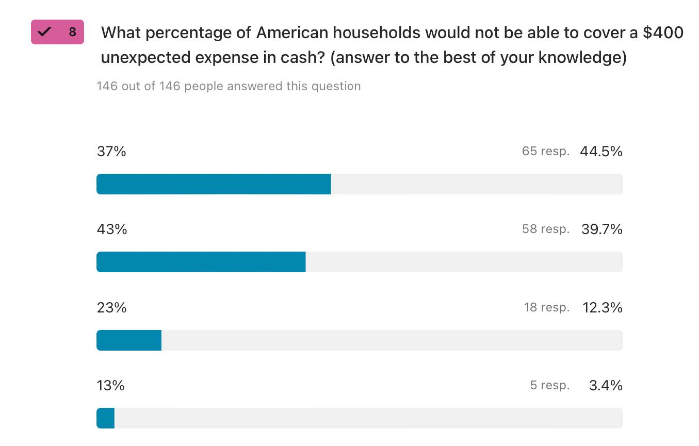
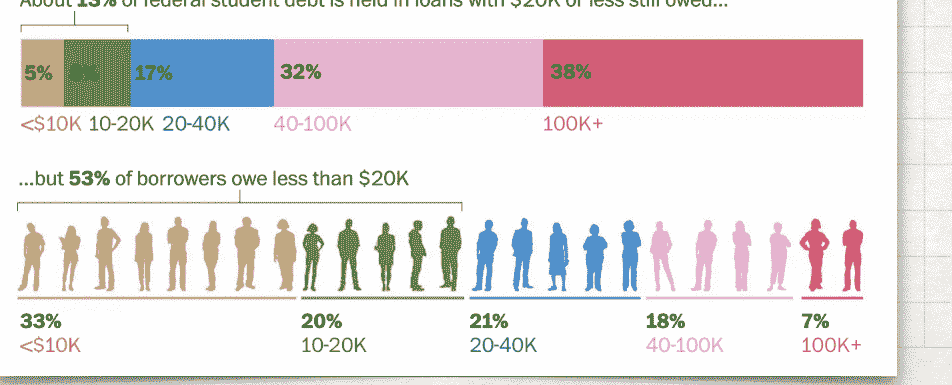
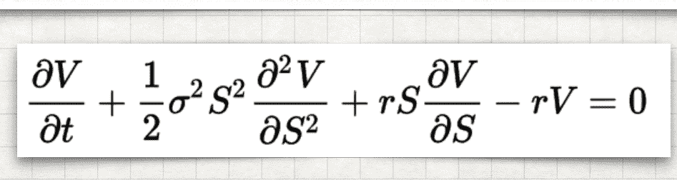

# 斯坦福 CS007 讲义

CS 007：第一节

面向工程师的个人财务

# 信息披露

斯坦福大学 - 课程材料 - CS 007 - 2023秋季学期

- 这些幻灯片按原样提供，并不一定与斯坦福大学正式注册学生的课堂内容完全一致。

- 本次演示旨在提供信息和框架，帮助个人进行进一步的研究和学习。本次演示并非财务建议，也不打算提供针对特定财务决策的建议。

- 这些幻灯片公开提供，仅供非商业用途。所有基于此内容的材料必须适当引用Adam Nash和斯坦福大学。

# 为什么学习个人财务？

- 中学阶段对这一主题的覆盖非常薄弱

& 大学课程，即使是在顶尖学校。

- 技术上并不困难，但信噪比非常差。

- 对你生活的影响巨大。- 影响**每个人**。

* 请注意：本次演示中许多手绘图来自Carl Richards，behaviorgap.com

# 为什么是为工程师准备的？

- 工程师通常在数学方面受过良好的教育，并且享受这一过程。

- 工程师在年轻时就会面临重大的财务决策。

- 工程师往往相信自己是理性决策者。

- 工程师创造的产品可能会影响数十亿人的财务状况。

# 真实问题，真实数据

- 大多数成年人不太愿意与朋友和同事谈论钱和财务决策。

- 错误的数据可能导致错误的决策 - 本课程将尽可能基于真实数据

- 请鼓励自己开放分享，并提出你真正想要得到答案的问题。

# 社会契约：建立信任

- 这个班级的学生来自各种不同的经济背景

- 我们很幸运，因为这种多样性可以帮助我们教育自己，做出更广泛的财务决策

- 假设你的同学对于他们选择分享的财务信息应当保持隐私

- 尽你所能去赚取&

值得信赖

# 1: 你现在是几年级？

- 本课程已针对即将毕业的学生进行优化。

- 学习个人财务永远不嫌早。

- 我的个人历程真正开始于大二，当时我在惠普实习……

* [https://www.businessinsider.com/personal-finance/best-money-adam-nash-ever-spent-2015-4](https://www.businessinsider.com/personal-finance/best-money-adam-nash-ever-spent-2015-4)

# 2: 你如何定义财富/成功？

- 是否有一个“神奇数字”？ - 期望差异很大。 - 有些人通过专注于目标取得成功，另一些人则专注于增加分数。

- 你的同龄人未能充分描述可能实现的成功财务结果范围，也未描述能让你幸福的生活方式范围。

低：$10,000

高：$1万亿

# 3: 你对父母了解多少？

- 许多父母在如何与孩子谈论金钱时感到矛盾。

- 这并不奇怪，因为金钱往往不舒适地反映出个人的价值观和行为。

- 许多父母比起与孩子讨论金钱，更愿意讨论性与毒品。

- 这堂课可能是你和家人一起学习的机会。

# 4: 购买股票、ETF还是共同基金？

- 64%的美国家庭拥有Amazon Prime，但只有52%拥有股票。（来源：Gallup）

- 按财富排名前1%的家庭拥有56%的公司股票。（来源：高盛，金融时报）

- 拥有股票可能是了解公司和投资的一条路径。

- 投资股票，理想情况下通过指数基金，是最佳的投资方式之一。

建立长期财富的方法。

# 5: 你自己报过税吗？

- 如果你通过工作赚取收入，你应该报税。

- 许多财务决策受到税收的严重影响。

- 忽视金融决策的税后价值可能导致严重的财务错误。

- 对税收的非理性恐惧也可能导致糟糕的财务决策。

# 6: 你负责偿还的学生贷款？

- 国家学生贷款债务为$1.75万亿

- 4500万学生贷款借款人。

+   2021年，每位借款人的平均债务为$39,351。

- 25%的借款人在还款的前五年内违约。

* https://fred.stlouisfed.org/series/SLOAS

+   https://www.nerdwallet.com/article/loans/student-loans/student-loan-debt

+   https://www.washingtonpost.com/education/2022/05/22/student-loan-borrowers/

6 你是否有大学毕业后需要负责偿还的学生贷款？

# 7: 你应该储蓄多少百分比的收入？

· 花费低于收入。

- 10%不是正确答案。

- 没有固定的储蓄率，但当你储蓄时，你会以两种方式获胜。

- 储蓄意味着学会减少开支，从而降低你的目标。

- 储蓄意味着拥有更多资本用于投资，以实现你的目标。

当你毕业时，你认为你每个月应该存下自己薪水的百分之几？

146人中有146人回答了这个问题，超过20%的人回答了。

# 8: 有多少百分比的美国人有足够的$400应急储蓄？

- 常被误引的统计数据。

- 美国联邦储备委员会在2023年报告称，37%的美国人没有足够的

- 实际调查问题揭示，13%的人表示他们无法通过其他方式应对紧急情况。

- 流动性意味着在需要时能够接触到资金

* https://www.federalreserve.gov/publications/2023-economic-well-being-of-us-households-in-2022-executive-summary.htm

# 9: 你认为美国的中位收入是多少？

- 财务统计可能让人困惑，因为时间段、数据集和问题差异巨大。

- 美国人口普查局报告称，2022年家庭中位收入为74,580美元。2021年为76,330美元。

- 美国人口普查局报告称，2022年加利福尼亚州的家庭中位收入为85,300美元。

- 2022年，帕洛阿尔托（加利福尼亚州）的家庭中位收入为194,782美元。

* *https://www.census.gov/library/publications/2023/demo/p60-279.html* * *https://www.statista.com/statistics/205778/median-household-income-in-california/* * https://www.point2homes.com/US/Neighborhood/CA/Santa-Clara-County/Palo-Alto-Demographics.html * https://siliconvalleyindicators.org/data/economy/income/household-income/median-household-income/

# 10: 你想覆盖哪些财务决策？

- 好消息：我们将在预定的课程中覆盖大部分内容

- 关于股票、投资和期权有很多问题

- 去年额外的主题

- 风险投资 / 私募股权 - 衍生品 - 加密货币 CS 007

教学大纲

# 行政细节

- 邮箱：

adamnash@cs.stanford.edu

- 课件将发布在课程博客上：

http://cs007.blog

- 想上这门课的人都可以上这门课……

- 注册出席：

- 访问 https://bit.ly/cs007-attend

- 输入SUNET和秘密词 - 时间戳会告诉你结果

- 只要魔法词的时间戳在午夜之前，你就没问题。

# 第2周：可预测的不理性

- 行为金融学 认知偏差 o

- 对财务决策的影响

DESIGNHACKS.CO · 分类由BUSTER BENSON提供 · 算法设计由JOHN MANOOGIAN III (JM3)提供 · 数据来源于WIKIPEDIA

©creative s

## * DesignHacks.Co：188种已知的认知偏差

# 第3周：收入

# 第4周：支出少于收入

- 收入与支出 - 时间框架 - 预算 - 储蓄率 - 个人收入报表

# 第5周：你的财务档案

# 第6周：信用与债务。摆脱困境。

- 不同类型的债务：

学生贷款、汽车、信用卡、抵押贷款

- 有担保与无担保贷款 - 贷款与利率 - 信用评分 - 反向复利

# 第7周：好的投资很无聊

- 复利的魔力 - 如何计算回报 - 不同类型的投资：

股票、债券、商品、房地产

- 分散投资 - 现代投资组合构建 - 税务很重要

# 第8周：财务目标

- 如何规划财务目标 - 不同类型的目标：

旅行、婚姻、房子、孩子、大学、创业、退休

- 人寿保险 - 夫妻与财务决策

# 第9周：位置、位置、位置

- 房地产 - 租房与买房 - 房屋作为投资 - 租赁物业/被动收入 - 房地产投资信托基金（REITs）与合伙企业 - 税务优惠

# 第10周：人们的选择

- 学生选定的主题

- 衍生品 - 风险投资 - 加密货币！

- 最后的想法 - CS 007校友 CS 007 问题

,但是一个人的一个人的一个人的一个人 র প্রায় বাংলাদেশ করে না করে না করে না করে না করে না করে না করে না করে আর কর CS 007: SESSION 2

个人

金融学

工程师

CS 007 可预测性

不理性

认知偏差法典

DESIGNHACKS.CO · 分类由BUSTER BENSON提供 · 算法设计由JOHN MANOOGIAN III (JM3)提供 · 数据来源于WIKIPEDIA

ලද්දි 1 mmons

*"可预测的不理性"是丹·阿里里（Dan Ariely）所著的一本书的书名

* DesignHacks.co：188种已知的认知偏差 行为金融学

你们中有多少人认为自己在处理钱财时是理性的？

| (举手)   |
| --- |

|-------------------|

赌徒谬误

锚定效应 心理账户 确认偏误 &

后见之明偏差

# 你不是

 理性

群体行为 过度自信 过度反应 &

可得性偏差

损失厌恶

# 为什么选择行为经济学？

- 一些经济学框架假设人类始终以一致且理性的方式评估财务决策

- **丹尼尔·卡尼曼 & 阿莫斯·特沃斯基**

（1960年代）

- 2002年诺贝尔经济学奖

- 前景理论

# 行为经济学的三个主题

- **启发式**

人类在做大多数决策时使用心智捷径或经验法则。

- **框架效应**

人类通过轶事和刻板印象来理解和应对事件

- **市场无效性**

错误定价或非理性决策

# 锚定效应

- 人们估计新的问题的答案时 &

带有偏见的参考点问题

- **特沃斯基 & 卡尼曼 (1974)**

（快速乘法）

- **丹·阿里耶利**

（社会安全号码和价格）

- 常见示例：

- 你买股票时的价格 - 股票的最高点

# 心理账户

- 钱是可替代的，但人们把它放入不同的“心理账户”中

- 也称为“分桶法” - 示例：丢失的电影票 - 示例：“发现的钱” - 现实世界中的问题：

假期基金和信用卡债务

# 确认偏见与事后偏见

- 非常不同的偏见，但常常被混淆在一起。

## - **确认偏见**

我们有选择地寻求支持已有理论的信息，忽视或争辩挑战或反驳它们的信息。

- **事后偏见**

我们高估了基于“显而易见”过去经验预测未来的能力。

- 两者的结合尤其糟糕。

# 赌博者谬误

- 我们在独立的、随机的事件链中看到模式。

- 我们相信，根据一系列之前的事件，某个结果比实际的概率更可能发生。

- 示例：晚宴和抛硬币 - 实际的概率可能是51/49，但我们往往跳到80/20。

- 可能的原因：在日常经验中，“独立事件”的稀缺性。

# 群体行为

- 我们有模仿大群体行为的倾向

- 示例：建筑心理学实验 - 示例：空旷超市

- 群体心理可能是泡沫的一个原因。

- 与人群背道而驰会带来压力和疲劳。

难度越来越大，而不是变得更容易。

- 比起单独“错误”，与大家一起“错误”更容易接受

“正确且孤独”

- 买IBM的股票不会被解雇？

# 过度自信

- 在《行为不端》(2016)一书中，74%的投资经理认为他们的业绩优于平均水平。

- 邓宁-克鲁格效应。你表现得越差，你就越高估自己的表现。

- 在某一领域的能力可能导致在其他领域的过度自信。

- 谦逊是一种美德。

# 近期与可得性偏差

- **近期偏差**

我们对最近发生的事件反应过度

- 例如：名人病

- **可得性偏差**

我们假设我们所得到的数据是整个数据集的代表。

- 这种组合特别糟糕。

- 研究表明，天天检查股价会导致更多交易，且平均结果更差。

- 对工程师来说更糟，因为我们沉浸在“游戏改变者”和“这次不一样”的观点中

# 你有**$1,000**，必须选择以下一个游戏

你有50%的机会获得$1,000，A有50%的机会获得$0。

或者

B你有100%的机会获得$500。

# 现在，你有**$2,000**，必须选择以下一个游戏

你有50%的机会失去$1,000，50%的机会失去$0。

或者

你有100%的机会失去$500。

# 损失厌恶（前景理论）

- **我们讨厌损失胜过喜欢赢得** - 多项研究中的平均损失厌恶比率为2:1到3:1之间

- 影响我们对广泛情境的看法，包括职业决策、约会、购买、投资和税务等。

- 我们甚至讨厌为可能导致损失的决策承担责任

- 例如：投资中的“沉没成本”错误

- **目前正在争论中!**

* https://blogs.scientificamerican.com/observations/why-the-most-important-idea-in-behavioral-decision-making-is-a-fallacy/?amp 不理性也没关系

# 不理性也没关系

- 正如丹·阿里里（Dan Ariely）美丽地表达的那样，关键是人类是**可预测地**不理性的

- 了解自己的缺点，你就能建立系统来帮助应对这些缺点

- 自我意识是关键

（是的，我妈妈是心理学家）

# 额外课程与材料

- Econ 178: 行为经济学 - Econ 278: 行为与实验经济学

- ACCT 618 (GSB): 市场效率与

信息套利

- Coursera / Duke: 行为金融学 https://www.coursera.org/learn/duke-behavioral-finance CS 007 问题

,但是一个人的一个人的一个人的一个人 র প্রায় বাংলাদেশ করে না করে না করে না করে না করে না করে না করে না করে আর কর

# 下周：获得报酬

CS 007: 第3节

个人

财务

工程师

# 2017年诺贝尔经济学奖

- 理查德·塞勒（@R_Thaler）

- 芝加哥大学教授，《助推》一书作者

- **关键洞察：**

- 心理账户 - 禀赋效应

- **NYT 和 Vox 上的精彩文章：**

- [纽约时报链接](https://www.nytimes.com/2017/10/09/)

[商业 / 诺贝尔经济学 理查德·塞勒](https://www.nytimes.com/2017/10/09/16447752/richard-thaler-nobel-explained-economics)

[Vox 链接](https://www.vox.com/policy-and-politics/)

2017/10/9/16447752/richard-thaler-nobelexplained-economics

了解人们是如何获得报酬的
# 薪酬 薪酬

- **吸引人才到公司**，通过具有竞争力的市场薪酬来奖励能力。

- **激励员工**通过奖励与公司战略和目标一致的表现。

- **留住员工**，通过公平地匹配员工对公司的贡献。

- 薪酬只是文化的一部分，但它是至关重要的一部分。

# 组成部分

- **基本工资** - **搬迁 / 签约奖金** - **年度奖金** - **股权薪酬** - **财务福利** - 附加福利

# 组成部分：基本工资

- **关键因素：** 职级、职能、地区

- **市场数据**公司容易获取，个人也越来越容易获得。

- **调整**通常因年度通胀、内部审计、市场竞争力、晋升等原因进行。

# 组成部分：奖金

- **签约奖金 / 迁移补助：** 预付的钱，通常在第一次发薪期支付，用于帮助搬迁或改善报价，而不影响基本工资。要小心：通常有回收条款。

- **年度 / 季度绩效奖金：**

通常是公司范围内的计划，基于职级的固定潜在百分比，基于个人与公司业绩。

- **临时奖金：** 较少见，但经理们偶尔有权授予单次奖金，奖励团队 / 个人的成绩。

# 组成部分：股权

- 旨在使员工的薪酬与股东的回报保持一致。

- 特别吸引那些对现金敏感的公司。

- 几乎在所有级别都非常常见

技术领域的角色。其他行业则倾向于偏向高管。

- 两种常见形式：

股票期权和限制性股票。

# 组成部分：财务福利与附加福利

- 提供各种福利，既能为员工提供税收优惠，又能将成本转嫁给雇主。

- 健康保险、退休福利、股票购买可能是最重要的。

- 在大型、资金充裕的科技公司中，较为常见的昂贵福利（餐饮、交通、健身）

- 福利对于员工来说通常价值不均，取决于他们的个人情况和需求。

了解人们是如何获得报酬的

股权

# 什么是股权？

- 对于公司所有权股份的价值的一个高大上的说法。

- 公司所有权被分为股份，这些股份赋予股东不同的权利。

- 可以有不同种类的股份。这在私营公司中非常常见。

- 在最简单的情况下，你可以通过这个比例来确定你拥有公司多少股份。

( \# 你拥有的股份数 )

( \# 总股份数 )

# 公开公司

- 美国大约有580万家雇主企业，其中不到4000家是公开交易的。

- 99.7% 的公司员工少于500人。

- 公开公司通常较大，从员工人数和收入的角度来看。

- 公开公司在财务结果的及时性和内容上有严格的规定，必须对外公开。

- 股票和股票期权的市场价格非常透明。

* 美国人口普查局 2014年 http://sbecouncil.org/about-us/facts-and-data/

# 私营公司

- 大多数公司是私营的，但对于毕业工程师来说，最相关的形式是风险投资支持的初创公司。

- 私营公司有多种股份类别，且经常是现金流为负。

- 未来融资意味着**稀释**。随着公司发行更多股份，你在公司的股份比例会减少。

- 你不能评估一家公司的股权，除非知道**募集的资金量**以及**募集的条款**和优先权。

- 公司在向员工和候选人披露信息方面差异很大。

- 大多数情况下，当公司是私营公司时，你无法出售你的股票。

# 股票期权

- 股票期权是一种“衍生工具”，是一种基于其他证券的证券。有很多类型，但作为薪酬，它们代表“购买的权利”。

- 关键术语

- **授予日期**。你收到期权的日期。通常是在你开始工作后的第一次董事会会议之后。

- **归属开始日期**。通常是你的第一天工作。

- **归属时间表**。通常是4年，并有1年的悬崖期。- **行使/行使价格**。通常是期权授予当天的公平市场价值。

- **到期日期**。通常是10年，尽管7年也并不罕见。如果你离开公司（90天），到期会提前触发。

- 如果行使价格与当前公允价值不匹配，或者在行使时有税务后果。**小贴士：83(b)**

- 行使股票期权时会有税务后果，具体取决于期权类型（ISO与NQSO），但在归属时不会有税务后果。

- **内在价值**是市场价格减去行使价格。**时间价值**则包括期权本身的价值及其提供的灵活性。

# 限制性股票

- 限制性股票是一个广泛的术语，指的是在公司中拥有所有权限制的股份（例如：归属期）。

- **限制性股票单位（RSU）**是公司承诺授予员工股份的一种方式。**限制性**股票是有一定限制的实际股份。

- 没有行权价。你被授予一定数量的股票，具有归属时间表。

- 你在限制性股票归属时需立即缴纳所得税。大多数公司通过出售必要的股票部分来扣缴税款。

- 原本是上市公司（如Google）的一项特点，

当行权价变得过高时，股票期权在大型私营公司中变得越来越普遍。

- 一旦股票归属后，这些股份与你当天用现金购买的股份在税务上的区别就不再显著。

# 股票期权与限制性股票

- 如果股票的价值跌破行权价，股票期权可能一文不值。限制性股票只有在股价跌至零时才会变得一文不值。

- 员工通常通过股票期权获得比限制性股票更多的股份，因为限制性股票没有行权价，且其价值高于期权。比例可能是3:1。

- 两者都有流动性问题。

- 对于股票期权，并非每个人都有现金来行使股票并支付相关税款，特别是当他们离开公司时。

- 使用限制性股票时，除非发生流动性事件（如IPO或并购），否则你可能无法出售已经获得的股票。

- 股票期权有显著的税收优惠，因为你在股票归属时无需缴税，并且可以控制何时行使。

普通股在私营公司的估值远低于优先股，但当公司上市时，这一差异会消失。因此，你的行权价通常会低于优先股的价值。

- 限制性股票在今天的美元中更容易估值。

评估报价

查看2022-23年实际报价

# 四个报价：Titantech 公开公司

- 基于真实报价数据 - **公司规模**：10,000人以上

- **市值**超过1000亿美元

- **职位**：软件工程师 - **报价条款**：

- 基本薪酬：$120,000 - $140,000 - 迁徙/签约奖金：

$10,000 至 $25,000

- 年度奖金：10%

- 股权：当前价值$100K的RSU

至 $150K，4年归属期

- 福利 / 额外福利：数不胜数，401(k)

配套100%

# 四个报价：Unicorntech 私营公司

- 基于真实报价数据

- **公司规模**：500人以上

- **市值**超过10亿美元 - **职位**：软件工程师 - **报价条款**：

- 基本薪酬：$140,000

- 迁徙/签约奖金：$10,000以上 - 年度奖金：无 - 股权：$200K - $320K RSU 或期权，占公司0.01%，4年归属期

- 福利 / 额外福利：免费餐饮，许多额外福利，没有401(k)配套。

# 四份录用：下一个大事

- 基于真实的录用数据 - **规模**：30人

- **市值**：筹集了$1500万的A轮资金

$60M估值

- **职位**：软件工程师 - **录用条款**

- 基本薪酬：$120K - $145K - 调动/签约奖金：$0 - 年终奖金：无

- 股权：0.1%的股票期权（10个基点）

公司股份，四年内逐步归属

- 福利/待遇：基本的。健康保险，401(k)，停车/通勤卡。

# 四份录用：大到不能倒的巨型银行

- 基于真实的录用数据

- **规模**：100,000+人

- **市值**：超过$2000亿 - **职位**：分析师 - **录用条款**

- 基本薪酬：$100K - $120K

- 调动/签约奖金：$20K

- 年终奖金：$60K - $100K

- 股权：无 - 福利/待遇：丰厚的财务福利，福利较少，出差和航空里程较多。

- 考虑因素：80-100小时工作周、差旅、不确定的时机（交易）

- **通过晋升，可以达到总薪酬$300K - $500K**

3-5年后的薪酬。

# 钱并不是唯一的考虑因素

- 对于股权，公司价值的上涨潜力如何？下行风险呢？

- 公司成功对未来公司的工作机会影响极大，但在科技行业，成功可能是转瞬即逝的。

- 职位与薪酬与质量 - 人才与网络的影响非常显著 - 构建具有持久价值的技能/经验/成就

- 职业轨迹各异。成功率。运气。

潜在的未来角色。

- 市场相对高效，但并不对所有类型的风险提供补偿。

# 最后一条：谈判

- 市场相对高效，但各公司在其处理方式上差异很大。

- 有些人会进行薪酬谈判。其他人则明确反对谈判。缺乏谈判是薪酬差距的一个主要原因。礼貌而坚定通常是正确的方式。

- 高质量的公司在公平薪酬方面做了大量工作，但初创公司可能差异很大。了解市场数据。

- 有些条款比其他条款更具灵活性。基本薪酬通常比签约奖金或股权更难调整。如果你要去一家私营公司，它几乎总是押注于股权。

- 不要害怕与经理谈论公平薪酬的问题。理解招聘人员与经理在角色上的差异。

- 对自己是否能接受某些条件要保持情感上的诚实。设定底线后，可能很难改变。

CS 007 问题

，但是一个人的一个人的一个人的一个人 র প্রায় বাংলাদেশ করে না করে না করে না করে না করে না করে না করে না করে আর কর

# 第4周：支出低于收入

- 收入与支出 - 时间框架 - 预算 - 储蓄率 - 个人收入报表 CS 007: 第4节

个人

财务管理

工程师

评估报价

结语

# 最后一言：谈判

- 市场相当有效，但不同公司在处理方式上差异显著。

- 有些人会进行奖励谈判，其他人则明确反对它。缺乏谈判是导致薪资差距的原因之一。礼貌而坚定往往是正确的做法。

- 高质量的公司会做大量关于公平薪酬的工作，但初创公司则可能差异很大。了解市场数据。

- 有些条款比其他条款更具灵活性。基本薪酬通常比签约奖金或股权更难调整。如果你去的是私人公司，那几乎总是押注股权。

- 不要害怕与经理讨论公平薪酬的话题。了解招聘者与经理之间角色的区别。

- 对自己在什么是交易破裂点上要情感上诚实。沙线往往很难擦掉。

CS 007

储蓄与预算

# 收入与支出

少花钱，储蓄多于支出

# 不要购买你买不起的东西

https://www.nbc.com/saturday-night-live/video/dont-buy-stuff/n12020

# 少花钱，储蓄多于支出

- 这是**个人财务成功的终极秘诀**。

- 几乎在所有收入和财富的水平上都很重要。

- 对所有成功层次都很重要 &

智力。

- 没有任何金额的钱是你不能花的。是有原因的

 为什么百万富翁破产。

- 很容易衡量，但很少有人做到。

# 为什么这很困难？

- 不是所有的支出都与收入在相同的时间框架内发生。每两周一次的薪水与每月或每年的账单。

- 并非所有支出都是可预测的 - 捐赠效应可能适得其反。

每月300美元的衣物预算会变成一种花费超过需求的许可。

- 信用卡让过度消费变得微不足道 - 收入波动，但生活方式和支出却较为固定。当你在短时间内赚到很多钱时（好莱坞、职业体育、硅谷），这种情况尤其困难。

- 税务复杂。

# 停止跟随“琼斯家族”的步伐

- 我们为什么这么做？

- 渴望展示我们的成功 - 需要拥有别人拥有的东西。尤其是在多种生活方式之间的聚合情况下，更是如此。

- 他们破产了。- 你必须设定自己的优先事项。

储蓄率

你应该储蓄多少？

# 美国储蓄率

- 实际上，这是政府跟踪的重要宏观经济统计数字。

- 美国个人储蓄率为3.6%

2017年8月为8.1%，但2019年8月为8.1%。由于2020年危机，现在为14.1%。

- 储蓄 = 收入 - 支出 - 不考虑非收入价值生成或未来储蓄

 负债

* https://tradingeconomics.com/united-states/personal-savings

* https://ycharts.com/indicators/personal_saving_rate

# 理想的目标是什么？

- 最常见的建议：

10% 和 15%

- 10% 没有数学依据。人类就是喜欢数字 10。

- 15% 基于历史假设，包括工作时间、回报率、工资通胀和 80% 的退休收入目标。

- 真实答案：每一个百分比都很重要。

- 你降低了生活费用/生活方式所需的金额。

- 你增加了资本池来达到这个目标。

# 雇主福利对储蓄的影响

- 薪酬结构会影响储蓄率。- 如果你收到 10% 的奖金并且不花掉，它将提高你的储蓄率。

- 不幸的是，大多数人花的钱**比**他们赚的更多。

他们在获得奖金之前就已经预期到了它。

- 提高储蓄率的三种系统性方式：

- 强制储蓄（例如澳大利亚）要求储蓄你工资的一定百分比。

- 雇主配对（例如 401k）可以显著提高总体储蓄率。（这是免费的钱，拿着吧。）

- 健康储蓄账户（HSA）也可能有助于储蓄，尽管经验数据有限。

# 按揭作为强制储蓄

- 65.6% 的美国人是房主

（截至 2021 年第一季度）

- 按揭支付由两个部分组成：利息和本金。

- 还清债务会消除你的负债，留下资产。这会像储蓄一样增加你的净资产。

- 对于许多美国人来说，每月本金支付的强制性功能实际上促使他们在长时间段内（数十年）在房屋中积累了可观的价值。

* https://www.census.gov/housing/hvs/files/currenthvspress.pdf

# 自动化的好处

- 先储蓄自己

- 制定预算，计算储蓄，自动扣款，就像缴税一样。

- 401(k) 计划的默认加入比主动加入要有效得多。

- 401(k) 贡献的自动增加比主动加入要有效得多。

- 当你的工资增加时，尽量保持一定的储蓄比例。你可以随着时间的推移提高储蓄率。

- 看不见的钱更不容易被花掉。

* https://www.census.gov/housing/hvs/files/currenthvspress.pdf 预算编制

你的钱都去哪了？

# 什么是预算？

- 按类别划分的支出 - 如果你已经安定下来，可以通过查看过去三个月的支出并取平均值，建立一个非常准确的预算。

- 别忘了年度支出 - 紧急基金是用来应对真正不寻常的支出的，而不是用来应对假期礼物的过度消费。

* https://ycharts.com/indicators/personal_saving_rate

# 追踪经验结果与理想结果

- 你在某一类别的支出和你实际需要支出的差异很大

- 同事的可比数据 /

朋友是宝贵的，但需要放在具体环境中看待

- 定期追踪你的理想结果与实际结果。

- 预算的关键指标是它是否现实可行

# 需求 / 想要 / 储蓄与债务

- 《你该为自己做什么》 - 伊丽莎白·沃伦

(D) 与她的女儿共同著作

- 书中提到的50/30/20法则，但这些不一定适用于你的情况。

- **需求**：确保有屋顶遮蔽，安全、健康并能工作。

- **想要**：任何其他消费 - **储蓄/债务**：偿还债务、建立紧急基金、为长期目标储蓄

# 你可以做到

- 有些收入低于你的人，依然能够存钱

- 有些收入高于你的人，最终破产。

- 小心情感上的自我辩解：像“我应得的”或“我值得拥有”或“为什么不是我？”这种语言。

- 已经证明，仅仅制定预算的行为就能减少人们的支出。

- 如果超出预算，不要感到惊讶。留出一个缓冲区，估算收入并分配支出。

收入报表

综合起来

# 什么是收入报表

+   收入报表是一个财务报表，报告公司在特定会计期间的财务表现。

· 个人收入报表回顾的是包括收入、支出和储蓄的某一时间段。

## 支出

# 示例：收入报表

- 收入数据的最佳来源：

薪资单 o 最佳的支出来源？

过去3个月的支出 0 最佳的可比数据来源？

同事 / 朋友 / 家人

| 收入                  | 支出                      |                  |                     |          |      |
| --- | --- | --- | --- | --- | --- |
| 工资                        | 住房费用                  |                  |                     |          |      |
| --- | --- | --- | --- | --- | --- |
|                             | 公共事业费用              | $ 300.00         | 2.5%                |          |      |
| UnicornTech                 | $ 12,000.00              | 100.0%           |                     |          |      |
| - 税收                       | （$ 2,430.40）           | 20.3%            | 水费/垃圾处理       | $ 120.00 | 1.0% |
|                             | AT&T无线服务             | $ 120.00         | 1.0%                |          |      |
| - 保险                       | （$ 739.98）             | 6.2%             | 电视/Netflix/Hulu   | $ 110.00 | 0.9% |
| 总工资                      | $ 8,829.62               | 73.6%            |                     |          |      |
| 总收入                      | $ 8,829.62               | 73.6%            | 房屋保险            | $ 76.50  | 0.6% |
|                             | 维护费用                  | $ 200.00         | 1.7%                |          |      |
|                             | 总住房费用                |                  |                     |          |      |
| 储蓄                        | $ 926.50                 | 7.7%             |                     |          |      |
| 退休金                      |                          |                  |                     |          |      |
| Roth 401K（罗斯401K）        | $ 500.00                 | 4.2%             | 汽车费用            | $ 323.50 |      |
|                             | 丰田普锐斯                | 2.7%             |                     |          |      |
| IRA（个人退休账户）          | $ 0.00                   | 0.0%             | 汽车保险            | $ 132.29 | 1.1% |
| 总退休金                    | $ 500.00                 | 4.2%             | 0.8%                |          |      |
|                             | 燃气费用                  | $ 100.00         |                     |          |      |
|                             | 维修/车牌                | $ 0.00           | 0.0%                |          |      |
| 大学费用                    | 结束的汽车贷款           | $ 555.79         | 4.6%                |          |      |
| Pride & Joy 529             | $ 250.00                 | 2.1%             |                     |          |      |
| 总大学费用                  | $ 250.00                 | 2.1%             | 家庭开支            |          |      |
| 总储蓄                      | $ 750.00                 | 6.3%             | 杂货/好市多         | $ 800.00 | 6.7% |
|                             | 外出就餐                  | $ 400.00         | 3.3%                |          |      |
| 债务偿还                    | 娱乐费用                  | $ 50.00          | 0.4%                |          |      |
| 住房费用                   | 衣物支出                 | $ 150.00         | 1.3%                |          |      |
| 按揭贷款                    | $ 2,500.00               | 20.8%            | 定期账单         | $ 38.00  | 0.3% |
| 总住房费用               | $ 2,500.00               | 20.8%            | 个人支出            | $ 100.00 | 0.8% |
|                             | 宠物支出                 | $ 50.00          | 0.4%                |          |      |
| 大学支出                 | 计算机/电子产品         | $ 200.00         | 1.7%                |          |      |
| 斯坦福贷款合并           | $ 250.00                 | 2.1%             | 健身房              | $ 70.00  | 0.6% |
| 总大学支出               | $ 250.00                 | 2.1%             | 礼物支出            | $ 100.00 | 0.8% |
| 总债务偿还                | $ 2,750.00               | 22.9%            | 慈善捐款         | $ 300.00 | 2.5% |
|                             | 医疗支出                 | $ 100.00         | 0.8%                |          |      |
|                             | 总家庭支出               | $ 2,358.00       | 19.7%               |          |      |
| 年度支出                 | 年化支出                 | $ 716.67         | 6.0%                |          |      |
| 人寿保险                 | $ 800.00                 |                  |                     |          |      |
| 房产税                    | $ 7,800.00               | 结束支出       | $ 4,556.96          | 38.0%    |      |
| 总年度支出               | $ 8,600.00               | 现金流储备       | 6.4%                |          |      |
|                             | $ 772.66                 |                  |                     |          |      |

# 持续维护

- **季度**

- 检查你的进度，实际与预期对比。

预期

- **年度**

- 模拟变化并从实际行为中学习。

- **自动化**

- 你越是自动化储蓄与支出，出错的空间就越小。

CS 007 问题

,但是一个人的一个人的一个人的一个人 র প্রায় বাংলাদেশ করে না করে না করে না করে না করে না করে না করে না করে আর কর

# 下周：你的财务概况

- 流动性 

CS 007：第5节

个人

财务概况

工程师

CS 007

资产与净值

流动性

需要时可以随时访问资金

# 什么是流动性？

- 当你需要现金时，你能多快获得它？

- 市场流动性指的是市场在稳定价格下允许资产买卖的程度。

- 会计流动性衡量的是个人或公司利用其可用流动资产履行财务义务的难易程度。

- 不要低估流动性的价值。流动性至关重要。

# 为什么流动性很重要？

- 当你需要支付某项费用时，流动性是唯一重要的因素。

- 流动性是把握投资机会的力量。

# 流动性与回报

- 流动性通常与回报**呈反比**关系

与回报相关

- **示例**

- 现金非常流动，私募股权非常不流动

- **安全≠流动性**

- 5年期定期存款安全，但流动性差

- 特斯拉股票流动性强，但波动性大！

# 应急基金

一种财务缓冲，保护你的目标

# 8：多少百分比的美国人有$400应急备用金？

- 常见的统计数据误引用。

- 美国联邦储备银行在2023年报告称，37%的美国人没有足够的储蓄。

用现金储蓄覆盖$400的紧急费用。

- 实际调查问题显示，有13%的人自报无法通过其他方式应对紧急情况。

- 流动性意味着在需要时可以获得资金。

- 不要低估流动性的价值。

流动性至关重要。

* https://www.federalreserve.gov/publications/2023-economic-well-being-of-us-households-in-2022-executive-summary.htm

# 为什么需要应急基金？

- 对流动性需求的实际结果

- "心理账户"在财务健康中的应用示例

- 目标是保护你的长期资产/计划，免受突如其来的短期需求的影响。

# 应急基金应有多大？

- 标准建议是至少准备**3个月的生活**费用作为现金或现金等价物

- 根据失业影响进行计算

- 全国平均需要3到6个月时间来找到一份同等薪资的工作。

- 在衰退时期，时间的增加与流动性相关

基于你的资历。

# 应急基金常见错误

- 不要只关注投资回报或机会成本。

- 将其视为**缓冲**，或作为保险，而非资产。

- 应急基金清单上应优先填充，若动用后应优先补充。

- 不要为了无关紧要的需求动用应急基金。它是为了应急。

资产与负债

你拥有的与你欠的

# 什么是资产？

- 任何具有经济价值的资源

- **金融资产**是现金、债券、股票等的投资。

- **实物资产**是对房地产、收藏品、大宗商品等的投资。

# 不同类型的资产

- 流动性资产与非流动性资产

- 金融资产与实物资产

· 升值与贬值

贬值

- 有形资产与无形资产

# · 欠你债务

美国股票

16%

5%

5%

| 外国     | 新兴市场  |             |           |        |
| --- | --- | --- | --- | --- |
| 新兴市场  | 分红     | 房地产     | 企业债券  |        |
| 股票     | 市场      | 股票        | 债券      | 市场   |
|           | 债券      |             |           |        |

* https://www.wealthfront.com/plan

# 关于人力资本呢？

- 很容易辩称，你的技能和能力是你拥有的最大资产。

- 不要忽视“无形资产”——有时它们是最好的投资。

- 记住，人力资本在流动性上差异巨大。

* https://www.wealthfront.com/plan

# 什么是负债？

- 负债是一种财务义务，通常是债务。

- 最常见的个人负债是贷款。

- **常见类型**

- 按揭贷款 - 汽车贷款 - 学生贷款 - 信用卡 - 税务负债

# 不同类型的负债

# 信用评分

- 当你申请债务、收到债务和偿还债务时，贷方会向三个主要的信用评级机构报告。

- 建立良好的信用评分对于申请大多数贷款至关重要。它还会影响其他服务，因为它用于身份验证。

- 影响信用评分的问题：历史长度、按时付款、已用容量百分比、新的债务申请、破产。

- Credit Karma http://www.creditkarma.com

# 债务是坏事吗？

- 莫迪利亚尼-米勒市场价值由基础资产的盈利能力和风险决定，而非融资方式。

- 假设没有税收、交易成本、破产成本

- 杠杆的权衡理论存在一个最优资本结构。

# 我应该偿还所有债务吗？

- 更多债务 = 更多风险 - 不是所有债务都一样 - 债务上的复利不是你的朋友，尤其是高利贷。

- 一些债务是有补贴的（例如

按揭贷款，学生贷款）

- 偿还债务可能在情感上让人满意，但在财务上是不理智的。

- 偿还债务可以随着时间的推移提高储蓄率。

# 资产负债表

了解你的净资产

# 你的净资产是多少？

- **资产 - 负债** - **总净资产**包括所有资产。

- **流动净资产**不包括流动性差的资产和主要住宅（及相关负债）

- 不要与现金流混淆。两者完全不同。

* https://www.census.gov/data/tables/2018/demo/wealth/wealth-asset-ownership.html

# 什么是资产负债表？

- 资产负债表是总结公司资产、负债及

股东权益。

* [http://www.investopedia.com/articles/04/031004.asp?ad=dirN&qo=investopediaSiteSearch&qsrc=0&o=40186](http://www.investopedia.com/articles/04/031004.asp?ad=dirN&qo=investopediaSiteSearch&qsrc=0&o=40186) 该资产负债表示例的注释已被省略。

# 创建个人资产负债表

· 个人资产负债表的非常简单的总结

· 有些人建议排除主要住所（及相关按揭贷款）

- 与损益表非常不同，但对于评估进展非常有用

CS 007 问题

# 第6周：信用与债务，如何摆脱债务。

- 债务的不同类型：

学生贷款、汽车贷款、信用卡、抵押贷款

- 有担保贷款与无担保贷款 - 贷款与利率 - 信用评分 - 反向复利 CS 007: 第6节

个人

财务管理课程

工程师

CS 007

全面了解债务

# 复利

对储蓄有利， 对债务有害。

# 复利的魔力

- 不相信爱因斯坦说它是宇宙中最强大的力量。

- 它是几乎所有长期财务规划的关键。

- 指数函数在算法成本中不利，但在储蓄回报中有利。

- 问题在于，财务回报率似乎很小，尤其是在早期。

- 关键是坚持下去。

# 复利简化

- 72法则 - 每年，只需使用

=POWER(1+rate, year)

- 20年内4%的利率是2.19倍 - 20年内8%的利率是4.66倍 - 小心：它对债务的影响与对储蓄的影响一样……在

反转！

# 年利率（APR）

- 衡量贷款成本或投资回报的标准化指标

- 由于可能存在多种费用和利率结构，因此需要这种计算方法。

- 不包括复利 - 由于费用或相关支付要求，通常高于名义利率。

- **APR = 简单利息**

APY = 复利 APR ≠ APY

APR = 每期利率 x 每年期数 APY = (1 + 每期利率) ^ 每年期数 - 1 1%的月利率 = 12% APR = 12.68% APY

# 提前开始的好处

- 复利在长期内真正显现出来

- 指数函数是非线性的，每个时间段都建立在前一个时间段的基础上。

- 在大多数退休规划模型中，25岁至35岁之间节省的资金，在退休后比35岁至65岁之间的所有储蓄带来的资产更多！

| 年数   | 8%回报率   |
| --- | --- |
| 10      | 2.16x          |
| --- | --- |
| 20      | 4.66x          |
| 30      | 10.06x         |
| 40      | 21.72x         |
| 50      | 46.9x          |

# 债务类型

学生贷款、抵押贷款、汽车贷款、信用卡

# 6：你需要负责的学生贷款？

- 全国学生贷款债务为：

1.76万亿美元

- 55%的2020届毕业生带着学生债务毕业。平均债务为28,400美元

- 平均美国家庭有学生债务的家庭负债为58,238美元。

- 53%的借款人欠款少于

20,000美元的学生贷款债务中。

- …但这仅占学生债务总金额的13%！

* https://fred.stlouisfed.org/series/SLOAS

* https://www.nerdwallet.com/article/loans/student-loans/student-loan-debt

* https://www.washingtonpost.com/education/2022/05/22/student-loan-borrowers/

# 学生贷款

- 美国学生债务为1.76万亿美元，并且正在迅速增长。* - 为资助教育而提供的无担保贷款&

一些相关费用

- 学生及家长贷款计划。基于财务需求。

- 利率可以是固定的或可变的。

本科与研究生之间的显著差异

- 利率远低于相当的无担保长期个人贷款，尤其是对青少年的贷款。

- 美国政府通过多种方式提供补贴：

无利息、利率限制、付款计划、贷款豁免

- **典型期限为10年**，但研究表明，由于替代付款计划和再融资，平均还款时间接近21年

* https://fred.stlouisfed.org/series/SLOAS ** https://www.pewresearch.org/fact-tank/2019/08/13/facts-about-student-loans/

# 抵押贷款

- 美国的总债务为19.3万亿美元。仅家庭住宅部分为13.4万亿美元。

- 以房产为担保的贷款。

可以是住宅或商业用途。

- 期限种类繁多。利率可以是固定的或浮动的。

- 常见的抵押贷款：30年固定利率、5/1可调利率抵押贷款（ARM）

- 再融资很常见。 - 资格要求：债务/收入比、债务/

房产价值、信用评分

*https://www.statista.com/topics/1685/mortgage-industry-of-the-united-states/

*https://www.statista.com/statistics/274638/mortgage-debt-outstanding-on-us-family-residences/

# 汽车贷款

- 1.58万亿美元（截至2023年第二季度）- 以汽车作为担保的贷款，通常在购买时获得。

- 期限种类繁多。利率可以是固定的或浮动的。

- 通常为3-5年固定利率。 - 利率在不同提供商之间差异显著，汽车制造商利用融资来影响需求。

- 租赁与购买 - 资格要求：信用评分

* https://tradingeconomics.com/united-states/debt-balance-auto-loans

# 信用卡

- 1.03万亿美元（2023年第二季度）- 无担保贷款，按30天的循环偿还

- 期限种类繁多。利率通常是浮动的。

- 手续费和福利使得简单分析变得复杂。

- 利率是按日计算的，宽限期超出时可能会导致不符合直觉的高费用。

- 资格要求：收入、信用评分 - 信用评分的关键组成部分（！）

* https://www.newyorkfed.org/newsevents/news/research/2023/20230808 * https://www.lendingtree.com/credit-cards/credit-card-debt-statistics/

# 信用评分

你的借款记录及其重要性

# 什么是信用评分

- 当你申请债务、获得债务或偿还债务时，贷款机构会向3大中央信用机构报告。

- 建立良好的信用评分对于获得大多数贷款至关重要。这也可能影响其他服务，因为信用评分用于身份验证。

- 影响信用评分的问题：历史长度、按时还款、使用的信用额度百分比、新的债务申请、破产。

- Credit Karma http://www.creditkarma.com

# 为什么信用评分很重要？

- 这是获得新贷款及其利率设定的关键因素。

- 许多产品和服务（如无线通讯和有线电视计划）也利用信用评分来评估信用风险。

- 经常用于身份验证。

- 对新移民来说，建立信用记录特别困难。

- 看起来像是一个困境，但有一些入门产品可以让它变得更容易。

# 如何获得信用评分？

- **最常见的方法**

- 担保信用卡 - 学生信用卡 - 商店信用卡

- 成为父母信用卡的附卡用户 - 学生贷款，汽车贷款 - 不支付利息。不要错过任何一笔付款。不要花费过多。

- 现在有一些服务会报告租金支付情况

# 贷款与利率

你将欠多少钱？

简单贷款

$12,000，年利率0%，期限1年

$1,300.00

简单贷款

$12,000，年利率12%，期限1年

# 摊销

- 通过定期偿还一定金额来减少贷款的价值。

- PMT()、PPMT()、IPMT()是电子表格中的内置函数

- E60讲授了如何将现金流转换为回报率（或反之亦然）的基本知识。

- 一旦你有了还款额，你就可以通过迭代方式轻松地计算利息和本金的分配。（例如，计算第一期，减少本金，再计算第二期，依此类推）

# 示例汽车贷款 $30,000，年利率2.5%，期限3年

还款 = 每月$865.84.19。首月 = $62.50利息。

# 示例汽车贷款 $30,000，年利率8.5%，期限3年

还款 = 每月$947.03。首月 = $212.50利息。

# 示例按揭贷款 $800,000，年利率4%，期限30年

还款 = 每月$3,819.32。首月 = $2,666.67利息。

# 偿还债务

不同的策略来摆脱债务

# 债务的危险

- 破产是指你无法偿还债务。如果你没有债务，就无法破产。

- 你永远找不到合法的投资能支付8%的回报

保证的，更不用说超过20%的利率

- 你会发现外面有源源不断的信用卡优惠，年利率超过20%

- “坏”债务是有毒的，你最好的回报是偿还它。但紧急基金可以优先考虑

# 如何高效偿还债务？

- 这个过程假设你可以分配更多的资金

每月偿还债务所需支付的金额高于最低还款额。否则，那就是你的优先事项。

- 组织你想要偿还的贷款。

从此计算中排除按揭贷款。

- 使用贷款合并来简化贷款并最小化利率。在某些情况下，延长期限可以有助于释放现金。

- **债务雪球法**是一个广泛传播的术语。指的是优先偿还最小的贷款。基于偿还债务的情感收益。

- 从数学角度看，理想的方式是**按顺序排列贷款**

利率。最小化所有贷款的还款，利用剩余资金优先偿还最昂贵的贷款。

- 问题是，在完全偿还贷款之前，你无法得到现金流的缓解。

|                | 学生贷款 1        | 学生贷款 2        | 信用卡         | 汽车贷款   |
| --- | --- | --- | --- | --- |
| 金额         | $6,000            | $8,000            | $10,000        | $20,000     |
| --- | --- | --- | --- | --- |
| 利率         | 2.5%              | 4.5%              | 22.9%          | 1.9%        |
| 最低还款额   | $200              | $250              | $120           | $450        |
| 期限         | 10年             | 10年             | ~              | 3年        |
| 花生酱       | $500              | $500              | $500           | $500        |
| 雪球计划     | $1180             | $250              | $120           | $450        |
| 最优还款额   | $200              | $250              | $1100          | $450        |

* 这些数字仅供参考。它们并非准确反映每月$2,000债务还款的情况。

给定利率和期限下的还款金额。

# 我应该还清所有债务吗？

- 更多债务 = 更多风险 - 并非所有债务都一样 - 复利对债务没有帮助，特别是高利息债务。

- 有些债务是有补贴的（例如，按揭贷款、学生贷款）

按揭贷款、学生贷款)

- 还清债务可以带来情感上的满足感，但在财务上不理性。

- 还清债务可以随着时间的推移提高储蓄率。

CS 007 问题

# 第7周：好的投资是无聊的

- 复利的魔力 - 如何计算回报 - 不同类型的投资：

股票、债券、商品、房地产

- 多元化 - 现代投资组合构建 - 税收很重要 CS 007: 第7节

个人财务

财务管理

工程师

CS 007

好的投资是无聊的

# 复利

对储蓄有益，对债务有害。

# 复利的魔力

- 不相信爱因斯坦说它是宇宙中最强大的力量。

- 它是几乎所有长期财务规划的关键。

- 指数增长在算法成本中不利，但对储蓄回报有利。

- 问题在于，财务回报率似乎很小，特别是在早期几年。

- 关键是要坚持下去。

# 轻松理解复利

- 72法则 - 每年只需使用

=POWER(1+rate, year)

- 20年内4%是2.19倍 - 20年内8%是4.66倍 - 小心：它对债务的作用和对储蓄一样……

反向！

# 年利率（APR）

- 标准化的贷款费用度量或投资的预期回报

- 由于可能的费用和利率结构种类繁多，因此需要使用此度量。

- 不包括复利 - 由于费用或相关付款要求，通常高于名义利率。

- **APR = 简单利息**

APY = 复利 APR ≠ APY

APR = 每期利率 x 一年期数 APY = (1 + 每期利率) ^ 期数 - 1 1% 每月 = 12% APR = 12.68% APY

# 提前开始的好处

- 复利在长时间内效果显著

- 指数函数是非线性的。每个时间周期都建立在之前的基础上。

- 在大多数退休规划模型中，25至35岁期间节省的钱比35至65岁之间的所有储蓄所产生的资产还要多！

| 年数   | 8%的回报   |
| --- | --- |
| 10      | 2.16x          |
| 20      | 4.66x          |
| 30      | 10.06x         |
| 40      | 21.72x         |
| 50      | 46.9x          |

班级调查

我们如何看待投资？

# 你更愿意在哪种类型的市场投资？

你更愿意在哪种类型的市场投资？

66人回答了这个问题 1 36 / 55%

2 16 / 24%

3 14 / 21%

| 上升的市场    |
| --- |
| 任意都可以     |
| 下行市场 |

# 你更愿意在哪种类型的市场出售？

你更愿意在哪种类型的市场出售你的投资？

| 66人回答了这个问题   |                    |          |
| --- | --- | --- |

| 14                                           | 上升市场    | 31 / 47% |
| --- | --- | --- |
| 2                                            | 下行市场 | 19 / 29% |
| 3                                            | 任意都可以     | 16 / 24% |

# 你更愿意在哪种类型的市场出售？

你更倾向于选择哪个投资？

66人回答了这个问题

|    | 之前表现最好的                        |          |
| --- | --- | --- |
| 1  | 37 / 56%                                     |          |
| 2  | 无所谓                            | 24 / 36% |
| 3  | 之前表现最差的                           | 5 / 8%   |

# 如何保持正确的风险/回报平衡？

你如何保持理想的风险/回报平衡？

66个回答者中，有66个回答了这个问题 1 2

| 买入更多赢家   | 37 / 56%   |
| --- | --- |
| 什么都不做                | 23 / 35%   |
| 买入更多亏损者    | 6 / 9%     |

# 你更偏好哪种投资？

你更偏好哪种投资？

66个回答者中，有66个回答了这个问题 1 指数基金，费用为0.04%，43 / 65%

优秀的共同基金，管理费为1%

| 23 / 35%   |
| --- |

投资类型

股票、债券、商品、房地产

# 常见的投资方式

- 我们汇总了超过200年的数据，展示人们投资资金的主要方式。

- 实际回报是扣除通货膨胀后的回报，衡量货币随时间贬值的程度。（在此图中，单位为美元）

- 股票在长期内具有最高的年化回报，但也伴随较高的波动性。

* http://www.econlib.org/library/Enc/StockMarket.html

# 股票 / 股权

- 股票是一种代表公司所有权的证券。

- 仅在美国，就有超过4000只公开交易的股票。

- 基于资本增值的回报

& 分红。

- 企业随着经济的增长而发展，并根据通货膨胀做出调整

- 股票有许多细分方式：

- 大盘股与小盘股 - 美国与发达市场与

新兴市场

# 债券

- 债券是一种债务投资，代表贷款的一部分。

- 到期日、票息率和市场价格都很重要。通常每只债券的发行价格为1000美元，但随后可以以任何价格交易。

- 信用质量越高，利率越低。 - 基于资本增值的回报 &

利息收入。

- 美国国债 = 关键基准 - 有多种方式细分债券：

- 政府与企业 - 国内与国际

- 市政债券有特殊的税收待遇

# 商品

- 商品是一种在商业中使用的基础商品。

- 可再生资源（例如农业、木材） - 不可再生资源（例如铁、石油、黄金） - 仅基于增值的回报。 - 1980年Simon-Ehrlich赌约，稀缺性与技术。选择非政府控制的商品，它们的价格是会上涨还是下跌？（Simon在1990年获胜，但对于其他时间段仍存在较大争议）

* [https://en.wikipedia.org/wiki/Simon–Ehrlich_wager](https://en.wikipedia.org/wiki/Simon–Ehrlich_wager)

# 房地产

- 房地产是土地和占用这些土地的设施的组合。

- 投资房地产不包括你的主要住宅。

- 基于租金收入和资本增值的回报。

- 房地产投资信托基金

(REITs) 在公共市场上交易，并享有特殊税收待遇。

# 多样化

不要拒绝免费的午餐

# 资产类别：波动性与相关性

- 资产类别在历史回报上有所不同，但波动性也有所不同

- 不同资产类别的波动性相关性不同

- 资产类别的相关性随着时间的推移在增加，但仍然有所变化。

* [https://research.wealthfront.com/whitepapers/investment-methodology/](https://research.wealthfront.com/whitepapers/investment-methodology/)

# 风险调整后的回报

- 一类资产的绝对回报不是唯一重要的，波动性同样重要。

- 比尔·夏普于1966年提出了夏普比率，并在1994年进行了修订。

# 现代投资组合理论

- 哈里·马科维茨于1952年提出了这一理论。

诺贝尔奖。

- 通过结合不同的资产配置，可以在给定预期收益的情况下降低投资组合的风险

# - 马科维茨子弹理论

* [https://en.wikipedia.org/wiki/Modern_portfolio_theory](https://en.wikipedia.org/wiki/Modern_portfolio_theory)

# 税务重要

- 利息、股息和资本利得的税率不同。

- 资产类别的历史回报来源各不相同。

- 税后风险调整回报对于应税账户至关重要。

- 税前风险调整回报对于递延税账户（如401k、IRA）至关重要

* [https://research.wealthfront.com/whitepapers/investment-methodology/](https://research.wealthfront.com/whitepapers/investment-methodology/)

做什么以及为什么这么做

# 如何投资证券账户

- 在大多数国家，大型银行提供证券经纪服务。

- 在美国，经纪公司是提供证券账户的金融公司，受SEC和FINRA的监管。

- 大多数大型银行已经收购或建立了证券公司。

- 这些不是银行账户，但它们是可以存入资金并购买（和出售）证券的机构。

- 与银行账户不同，你可能会亏损。

投资可能会下降，有时甚至会在较长时间内出现亏损。

- SIPC保险于1970年创建，目前仍在使用

50万美元。当经纪公司不当危及客户资产时提供保障。

# 如何衡量投资回报？

- 阿尔法（Alpha）定义为超过市场回报率的超额回报。

- 贝塔（Beta）是衡量相较于市场基准波动性的指标。

- 贝塔值（Beta）为1意味着预期的市场表现和波动性。

- 两者都来源于资本资产定价模型（CAPM）。

- 关键是实现最佳的风险调整后回报，扣除费用和税收。

# 投资方法类型

- **基本面分析**试图根据企业的表现和估值来挑选证券。

- **技术分析**试图根据价格模式挑选证券。

- 两者都未能展示出可靠性

& 在实践中，普通专业人士能够持续获得超过市场的风险调整后回报，扣除费用。

- 基本面分析对于企业主和经营者非常有用。沃伦·巴菲特的年度信函因其内容而广为人知。

# 指数基金的世俗崛起

- **《华尔街漫步》**于1973年出版。

- **先锋集团**于1975年12月31日推出了首个面向消费者的指数共同基金。

- **指数基金**目前管理着近6万亿美元的资产，并占据了新股权基金资金流入的主导地位。

- 宽泛的市场基础指数基金（如VTI）与基于替代方法或市场子集的专业指数基金之间存在巨大差异。

- 基于因子的投资拥有可信的学术证据，但实际操作中的主要问题是高费用。

* https://www.statista.com/statistics/1263833/net-assets-index-mutual-funds-type-usa/

好的投资就是

无聊

否则，你做得就是错的。

# 好的投资很无聊

- 没有人愿意平庸，但在投资中，“平庸”实际上远远高于平均水平。

- 通过简单、低成本的指数基金，你将超过大多数共同基金、对冲基金和同行。

- 资产配置的解释

~90%的经理表现差异

# 《华尔街漫步》

- 由著名普林斯顿经济学家伯特·马尔基尔（Burt Malkiel）撰写，已有40多年历史。

- 大多数专业人士未能击败一个简单的市场加权指数，扣除费用后。

- 费用是致命的。它意味着专业人士必须可靠地超过指数，回报要高于他们的费用。

- 做到的人，并不会在下一个时间段继续保持。

- 通过为每项资产使用指数基金来保持低费用。

# 散户投资者表现不如专业人士

- Dalbar 每年发布涵盖 20 年零售投资者回报的研究报告。

- 在 1992 至 2011 年的 20 年期间，平均股票投资者的回报比标准普尔 500指数（S&P 500）低了 4.32%。**

- 同一时期内，标准普尔 500 指数的整体回报率为 7.75%，并且包括股息再投资。*

- 最大的原因是高额费用和市场时机错误。

* https://dqydj.com/sp-500-return-calculator/ ** https://www.dalbar.com/QAIB/Index

# 市场时机非常糟糕

- 资金流入股票市场的历史表明，投资者的表现很差。

- Dalbar 的研究一再表明，市场时机错误是零售投资者表现不佳的主要原因之一。

- 你必须对两件事情都做对。- 只管. 持续. 储蓄。

| 2012         | 2013         |              |
| --- | --- | --- |
| 新兴市场（EM）   | 小盘股（Small Cap） | 房地产投资信托（REITs） |
| --- | --- | --- |
| 19.1%        | 41.0%        | 30.4%        |
| 国际股票（Int'l Stocks） |              |              |
| 18.8%        |              |              |
| 房地产投资信托（REITs） | 大盘股（Large Cap） | 中盘股（Mid Cap） |
|              | 32.3%        |              |
| 17.6%        |              | 9.4%         |
| 大盘股（Large Cap） | 国际股票（Int'l Stocks） | 债券（Bonds） |
|              | 21.4%        | 6.0%         |
| 16.0%        |              |              |
| 小盘股（Small Cap） |              | 小盘股（Small Cap） |
|              |              | 5.5%         |
| 15.7%        | 10.7%        |              |
| 中盘股（Mid Cap） | 房地产投资信托（REITs） | EW           |
|              | 2.3%         |              |
| 15.2%        |              | 4.0%         |
| EW           | 现金（Cash）   | TIPS         |
| 11.0%        | -0.1%        | 3.6%         |
| TIPS         | 债券（Bonds）  | 现金（Cash）  |
| 6.4%         | -2.0%        | -0.1%        |
| 债券（Bonds）   | 新兴市场（EM） | 新兴市场（EM） |
| 3.8%         | -3.7%        | -3.9%        |
| 现金         | TIPS         | 国际股票（Int'l Stocks） |
| 0.0%         | -8.5%        | -6.2%        |
| 商品（Comdty）    | 商品（Comdtv）   | 商品（Comdty）    |
| -2.1%        |              | -18.6%       |

# 资产类别：赢家很少重复

· 资产类别在历史回报上各有不同，但波动性也有所差异。

- 不同资产类别的波动相关性各不相同

- 资产类别的相关性随着时间的推移在增加，但仍然存在差异。

## · 保持多样化。

FFA

TIP. AGG.

. DJP. BIL

* https://blog.wealthfront.com/why-you-shouldnt-just-invest-in-the-s-p-500/ * https://awealthofcommonsense.com/2022/01/updating-my-favorite-performance-chart-for-2021/

| 2015         | 2016         | 2018         | 2019         | 2020         | 10 年       |              |        |
| --- | --- | --- | --- | --- | --- | --- | --- |
| 房地产投资信托（REITs） | 小盘股（Small Cap） | 新兴市场（EM） | 房地产投资信托（REITs） | 大盘股（Large Cap） |              |              |        |
| --- | --- | --- | --- | --- | --- | --- | --- |
| 现金         |              | 大盘股（Large Cap） | 大盘股（Large Cap） |              |              |              |        |
| 2.4%         | 26.6%        | 37.3%        | 1.7%         | 31.2%        | 18.3%        | 40.5%        | 16.4%  |
| 大盘股      | 中盘股      | 国际股票   | 债券        | REITs        | 商品        | 小盘股      |        |
| 1.3%         | 20.5%        | 25.1%        | 0.1%         | 28.9%        | 17.0%        | 31.1%        | 14.4%  |
| 债券        | 商品        | 大盘股      | TIPS         | 中盘股      | 中盘股      |              |        |
| 0.5%         | 12.9%        | 21.7%        | -1.4%        | 25.8%        | 13.9%        |              |        |
| 现金         | 大盘股      | 中盘股      | REITs        |              |              |              |        |
| -0.1%        | 12.0%        | 15.9%        | -4.6%        | 22.69        | 11.5%        |              |        |
| 国际股票   | EM           | 小盘股      | REITs        | 国际股票   | 中盘股      | 国际股票   |        |
| -1.0%        | 10.9%        | 13.1%        | -6.0%        | 22.0%        | 10.8%        | 24.5%        | 7.9%   |
| TIPS         | EW           | EW           | EW           | EM           | EW           |              |        |
| -1.8%        | 10.0%        | 12.6%        | -7.2%        | 18.2%        | 7.5%         |              |        |
| 小盘股      | REITs        | REITs        | 小盘股      | EW           | 国际股票   | 国际股票   | EM     |
| -1.8%        | 8.6%         | 4.9%         | -8.6%        | 17.5%        | 7.6%         | 11.5%        | 4.7%   |
| 中盘股      | TIPS         | 债券        | 中盘股      | 债券        | 债券        | TIPS         | TIPS   |
| -2.5%        | 4.7%         | 3.6%         | -11.3%       | 8.5%         | 7.5%         | 5.7%         | 2.9%   |
| EW           | 债券        | TIPS         | 商品        | TIPS         | 现金         | 现金         | 债券  |
| -4.7%        | 2.4%         | 2.9%         | -13.1%       | 8.4%         | 0.4%         | -0.1%        | 2.8%   |
| EM           | 国际股票   | 商品        | 国际股票   | 商品        | 商品        | 债券        | 现金   |
| -16.2%       | 1.4%         | 0.7%         | -13.8%       | 7.6%         | -4.1%        | -1.8%        | 0.4%   |
| 商品        | 现金         | 现金         | EM           | 现金         | REITs        | EM           | 商品 |
| 0.1%         | 0.7%         | -15.3%       | 2.0%         | -4.6%        | -3.8%        |              |        |
| 基金：EEM。  | VNQ。 MDY。  | SLY。 SPY。  | FFA          | TIP。 AGG。  | . DJP。 BIL   |              |        |

# 再平衡

- 长期来看，资产配置会因表现不一而发生漂移。

- 税收高效方法：智能股息再投资、存款、取款。

- 基于触发条件的再平衡仅在与理想配置的漂移超过一定百分比后发生。

- 随着时间的推移，降低风险，但不一定改善回报。

好投资的四个关键

1 **继续储蓄**

3 保持多样化 

2 **低费用**

4 **最小化税务**

这是马拉松，不是短跑。

CS 007 问题

# 第8周：财务目标

- 如何为财务目标规划 - 不同类型的目标：

旅行、婚姻、住房、子女、大学、创业、退休

- 人寿保险 - 夫妻与财务决策 CS 007: 第8节

个人

财务

工程师

CS 007

财务

 规划与目标

规划

如何设定财务目标并实现它们

# 什么是财务规划？

- 对当前和未来财务状况的全面评估。

- “通过正确管理财务资源，确定个体是否以及如何实现生活目标的过程” - CFP委员会

- 现金流、资产、提款。- 关键组成部分

- 净资产 - 现金流分析 - 退休策略 - 风险/保险 - 投资策略 - 税务策略 - 遗产规划

# 为什么需要财务规划？

- 如果缺乏足够的储蓄动机，人们往往会花费超出所需的金额。

- 短期奖励与长期回报。需要时间来积累资产。

- 使财务计划变得明确能提高成功的可能性

- 当涉及到多人时（夫妻/家庭），尤其重要

# 什么是财务顾问？

- 任何人都可以使用这个术语。务必小心。- 有两个认证非常受尊敬：

CFP和CFA。

- 大多数具有非常高的可变成本（1%以上）和较高的最低要求（超过100万美元）

- 有证据表明，财务规划师能显著帮助人们避免行为错误。先锋估算这个价值为150个基点！*

- 夫妻之间关于钱的沟通往往存在问题。财务顾问推动透明化和共同规划，这一点至关重要。

- 行业充斥着利益冲突和高额佣金。

- 在未来10年内，很可能会受到个性化、数据驱动的自动化解决方案的干扰。

* 量化先锋顾问的阿尔法 https://www.vanguard.com/pdf/ISGQVAA.pdf

# 为什么财务顾问收费这么高？

- 一位财务顾问通常拥有非常小的客户群，通常介于50到75个客户之间。

- 财务顾问必须承担高固定成本（昂贵的办公室）和高变动成本（他们的薪水和支持团队费用）。

- 如果一位顾问想赚取100,000美元，而他们的业务有100,000美元的固定成本，他们每年需要每个客户提供4,000美元，仅为了收支平衡。

- 财务顾问的质量越高，这个问题就越大。

- 解决方案：高门槛、高费用、隐性产品置换回扣/佣金。

# 目标类型

例如：建立应急基金，退休

# 财务目标是什么？

- 任何具有重大财务需求的目标（资产/收入）

- **时间框架非常重要。**

短期、中期、长期、不确定和有条件的目标。

## - **示例**

- 应急基金 - 还清债务 - 购买汽车 - 购买房屋 - 创办企业 - 大学 - 退休

* http://brokegirlrich.com/doin-it-by-the-decade-the-wealthy-barber-review/

# 如何预测未来的储蓄？

- 现金账户，假设使用适当时间框架下的FDIC利率。

· 对于多样化投资组合，使用历史回报率，并考虑通货膨胀调整。

- 通货膨胀可以通过美国国债和TIPS之间的差异来估算。

(当前约为2.2%)*

简单方法：假设年利率，除以12得到月利率，逐月建立预测。

- 更复杂的方法：蒙特卡洛模拟使用统计投影来估算大量潜在结果，并分配概率。

| 投资组合回报率   | 8%           |            |           |           |
| --- | --- | --- | --- | --- |
| 工资增长率 | 3%           |            |           |           |
| --- | --- | --- | --- | --- |
|                    | 2%           |            |           |           |
| 物价通胀    |              |            |           |           |
| 年龄                | 资产       | 储蓄    |           |           |
| 25                 | ર્ રે          | 25,000.00  | $         | 25,000.00 |
| 26                 | ર્ રે          | 51,500.00  | $         | 25,250.00 |
| ર્ ર                | ર્            |            |           |           |
| 27                 | 79,840.00    | 25,502.50  |           |           |
| 28                 | දි            | 110,132.90 | $         | 25,757.53 |
| දි                  | ડ            |            |           |           |
| 29                 | 142,498.40   | 26,015.10  |           |           |
| 30                 | දි            | 177,063.40 | ડ         | 26,275.25 |
| 31                 | දි            | 213,962.46 | ડ         | 26,538.00 |
| 32 $               | ર્            |            |           |           |
| 253,338.21         | 26,803.38    |            |           |           |
| 33                 | දි            | 295,341.89 | $         | 27,071.42 |
| 34                 | 후           | $          |           |           |
| 340,133.82         | 27,342.13    |            |           |           |
| 35                 | ર્ ર          | 387,883.98 | ડ         | 27,615.55 |
| 36                 | දි            | 438,772.57 | $         | 27,891.71 |
| ર્ રે                | ર્            |            |           |           |
| 37                 | 492,990.63   | 28,170.63  |           |           |
| 38                 | දි            | 550,740.70 | $         | 28,452.33 |
| 39                 | $            | $          |           |           |
| 612,237.47         | 28,736.86    |            |           |           |
| 40 $               | 677,708.57   | រូ          | 29,024.22 |           |
| 41                 | ર્ રે          | 747,395.31 | ડ         | 29,314.47 |
| 42 $               | 821,553.50   | 후         | 29,607.61 |           |
| 43                 | રે            | 900,454.32 | ર્         | 29,903.69 |
| 44                 | ડ            | ર્          |           |           |
| 984,385.26         | 30,202.72    |            |           |           |
| 45 | $             | 1,073,651.10 | ર્          | 30,504.75 |           |

使用蒙特卡罗模拟资产价值的路径

价值（$）

* https://fred.stlouisfed.org/series/T10YIE

# 简单目标：紧急基金

- 其中一个最重要的短期目标。

- 优先事项：流动性与安全性——典型目标：3到6个月的开支，存入FDIC保险的银行账户。

- 简单预测：每月储蓄额 x 月数。

- 示例：12000美元的紧急基金可能需要每月储蓄1000美元，持续一年。

# 更复杂的目标：购房

- 美国人口普查：65.4%的家庭拥有房产

（截至2021年第三季度）

- 两个关键组成部分：首付和收入要求（现金流）

- 首付通常为20%。对于100万美元的房子，首付为

20万美元，加上交易费用。

- 银行常见的债务/收入比率为36%（税前）。在高成本地区，可能会扩展到40%或更高。

- 你有灵活的时间表吗？如果有，你可能能够承担一定程度的市场风险。如果没有，就坚持现金。

- 房屋的流动性显著较低（难以提取资金）

和流动性（为工作搬迁）

- 房地产的长期表现是积极的：

通过对抗通货膨胀和杠杆投资的结合。

# 更复杂的目标：大学教育

- 这是一个非常昂贵的目标。Wealthfront估计，2027年送我的儿子去斯坦福大学的费用将达到358,942美元，经过通货膨胀调整！

- 大学费用增长速度超过了通货膨胀（Wealthfront使用比通货膨胀快1.1%的速度作为长期趋势）

- 时间有限。你有40到50年的退休时间，而18年对于复利的增长来说并不算长。

- 529大学储蓄计划有显著的税收优势，但以牺牲流动性为代价。

- 为多个孩子进行分层规划，过早储蓄带来奖励。

# 复杂：退休

- 极其复杂的目标。

- 四个相互关联的问题

- 预测40年以上的收入

· 替代30年以上的收入

・税务效率

· 多人规划

- 长期资产配置

（多元化投资组合）

・ 资产配置

（将哪些投资放在哪些地方）

- 税延账户401(k)、IRA、罗斯IRA等。

- 小心人寿保险的骗子 根据您的回答，以下是您的多元化投资计划  ص 我们的目标是设计一个个性化的资产配置方案，以最大化您的特定风险承受能力下的税后、费用后的回报。

您的风险承受能力： - 10.0 +

应税投资组合 应税的个人、联名和信托账户 退休投资组合 IRA和转账401(k)

# 复杂：退休

- **预测收入**

可以用工资通货膨胀作为代理

- **替代收入**

可以使用“4%规则”作为初步估算

- **税务效率**

利用税延账户，如401(k)计划。罗斯账户对一些高收入储蓄者具有显著优势。

- **家庭规划**

确保了解每位配偶的退休计划，并估算孩子重大开支的时间。共同考虑家庭的整体收入和资产。

# 夫妻

如何随着伴侣改变财务规划

# 为两人（或更多人）做规划

- 财务规划很困难。

需要预测未来并优先考虑选择

- 对于夫妻来说，规划难度指数级增加，因为有不同的时间表、优先事项和可能性。

- 关键问题包括沟通、透明度、关系和价值观。

- 金钱及相关问题是导致关系破裂的常见原因之一。

# 夫妻：预算与开支

- 如何与两个人一起管理预算/开支？

- 一账户方案：一个联名账户，完全共享。

- 两账户方案：分开账户，协调账单支付。

- 三账户方案：两个个人账户和一个联名账户。

- 这些策略都无法解决核心问题：

沟通与价值观。

- 讨论开支时的“魔法”数字 - **警告**：联合信用责任是一项严肃的承诺，不容小觑。

个人账户 1 联名账户 个人账户 2

# 夫妻：储蓄与投资

- 退休账户（401k和IRA）是个人账户。

- 经纪账户可以是个人账户或联合账户。股权补偿是个人的。

- 社会保障可以是个人的或联合的，取决于你如何申领。

- 收入、职业、时间线的变化使得储蓄率复杂化。

- 不同公司提供的福利质量可能有显著差异（例如，谷歌401(k)与初创公司401(k)的对比）

- 随着情况的适应/变化，可能需要重新审视。

# 人寿保险

它是如何运作的？什么时候有意义？

# 人寿保险：它为何存在？

## - **死亡保险**

- 死亡会带来一些费用。- 有抚养人的人需要一种方式，在去世后为他们提供保障。

- 退休计划通常需要几十年才能执行。人寿保险可以替代因死亡而未能获得的收入。

- 将风险集中在不确定性上有一个基本的经济效益。死亡时间是最初的精算案例，通过这种方式增加价值。

- 人寿保险有几个税务上的好处。持有人不会对潜在的赔偿金额征税，受益人也不会在领取时被征税。

# 人寿保险：有哪些类型？

- 定期寿险是最简单的一种。你按月支付，在一定的时间内确保如果你去世，受益人会收到赔偿。赔偿可以是固定的，也可以是递减的。

- 终身寿险提供无论你多大年龄的死亡赔偿金。也称为“永久”寿险。

- 普通寿险类似于终身寿险，但具有更大的灵活性，可以调整死亡赔偿金和现金价值。

- 变额寿险有固定保费，并且死亡赔偿金可以根据现金价值的回报率增加。

- 你能想象的每种组合都已经尝试过。这是美国一个2万亿美元的行业。

- 高费用和手续费，以及退出协议的惩罚性条款，使得人寿保险成为长期投资的糟糕金融产品选择。**坚持选择定期寿险**。

等级递减终身普遍 **变额**

# 人寿保险：你需要多少？

- 考虑与死亡相关的费用。- 考虑抚养人和需要你收入来支付的开支。房屋。大学。**退休**。

- 考虑一下你在积累足够资产以支付这些费用之前的时间框架。

- 费用是非线性的，因为死亡的概率随着年龄的增长而增加。30年的保单并不仅仅是10年保单的3倍。

- 对年轻人来说非常便宜。- 通常在结婚或规划生育时购买。

CS 007 问题

个人

财务管理

工程师

# 为什么房地产很重要？

- 人们需要**一个住所** - 这是**最大的财务**

这是大多数美国家庭做出的承诺。

- 它有一个**复杂且晦涩的**

购买过程

- 对许多人来说，这是**最大**的

他们净资产的重大部分。

- **国家的重大部分**

（以及国际）**财富**。

购买房地产

为什么以及如何

# 为什么人们购买（而非租赁）房地产？

- 需要**一个住所** - 他们在寻找**控制权**

在他们长时间居住的地方。

- 他们有**情感上的**依附

对拥有一个住所的概念的依附。

- 他们**认为**这是一个好投资

# 如何购买和出售房地产？

- 通常是经过中介的交易。美国

标准是销售价格的6%由房地产代理商分配。

- 截至2023年5月，中位数房屋在市场上待售的时间为43天，比2022年增加了38%。

- 买卖双方都涉及重大费用。

- 所有相关方都需要进行重大尽职调查。

- 这个过程受到严格的监管。

* https://www.redfin.com/blog/data-center

* https://fred.stlouisfed.org/series/MEDDAYONMARUS

# 买家的即时费用是什么？

## 直接费用

- **首付**。通常为总购买价格的20%。否则，通常需要购房保险。

- **交易费用**。在美国，买家的交易费用平均为2-5%（$3,700）*

隐性成本

- **机会成本**。这笔资本有其他用途，例如在长期多元化投资组合中。

- **流动性成本**。非常困难 /

一旦资金被锁定，获取这些资金将变得非常昂贵。

* https://www.zillow.com/mortgage-learning/closing-costs/

# 买家有哪些持续的费用？

- **财产税**。根据州/地方的不同，通常每年约为房产价值的1%。

- **房屋保险**。在美国，每年平均约为$1000，具体金额取决于房屋的价值。

- **抵押贷款**。虽然部分还款用于本金，但利息是一个显著的支出。

- **业主协会（HOA）**。如果是公寓/社区，需支付一个月度费用用于公共服务，且费用可能每年上涨。

- **维护**。业主每年可能花费房屋价值的1%来进行维护。

# 如何获得抵押贷款？

- 大多数银行根据两个因素来评估**抵押贷款资格**。

- 你是否有能力支付首付？（资产）

- 你的收入是否能够覆盖与房屋相关的预期月度支出（负债和收入）

- 美国合格抵押贷款的负债/收入比为43%（某些地区可能更高）

- 固定利率与可调利率（ARM）

30年固定利率或5/1 ARM

- 结算费用与利率 - 为减少对信用评分的影响，通常有14天的购物期，这可能影响较大。

* https://www.consumerfinance.gov/ask-cfpb/what-is-a-debt-to-income-ratio-why-is-the-43-debt-to-income-ratio-important-en-1791/

租赁

好处与成本

# 为什么人们租房（而不是买房）？

- 需要**一个居住的地方** - 他们寻求**灵活性**

在他们居住的地方。

- 他们对承诺长期居住和/或重大财务承诺的想法有**情感上的恐惧**。

- 他们**缺乏财务**能力

购买资源。

- **现金**的财务管理

流程更简单。

# 租赁房地产需要什么？

- 寻找一位有符合你需求且可租赁房产的房东。

- 损坏押金，通常等于一个月的租金。

- 在某些情况下，需要提前支付1-2个月的租金。

- 房东可以要求申请过程、信用评分、推荐信、犯罪记录、财务状况等。

- 租户的法律权利因州和地方的不同而有显著差异。

- 房东必须公正无偏地统一应用申请标准，不得歧视。

# 租房者的主要成本是什么？

## 即时费用

- **申请费** - **押金**。通常为1-2个月的租金。

- **第一个月租金** - **搬家费用**

持续成本

- **水电费**。电费、燃气费、水费、有线电视费。 - **租户保险**。在美国，约为每年$150。 - **停车费**。在城市地区，可能需要单独收费。

- **庭院维护**。 - **租金上涨**。可能会出现不可预测的变化。

买房与租房

这是最大的财务决策之一

# 重大的决策，强烈的情感

- 重要的**非财务**考虑因素。 - 高交易成本意味着短期内购买房地产风险极大。

- 固定位置可能会显著限制职业机会。

- 社区的社会联系和

学校很重要。

- 对大多数人来说，这是他们一生中最大的一笔投资。

- 有些人对租房与买房有强烈的政治信仰。

# 租房的财务利益

- **流动性**。你的资本不会被大量首付占用，也不需要强迫进行大额本金支付。

- **位置灵活性**。你有很大的灵活性根据需要搬到新地点。

- **多样化。** 将大部分财富集中在单一资产上会带来许多集中风险。

- **避免地理市场风险。** 过去50年，购买硅谷的房产非常成功。而底特律则没有。未来难以预测。

- **维护。** 与房产拥有相关的大部分费用由业主承担。不需要为大额开支（例如更换屋顶）做规划。

- **竞争市场。** 在大多数情况下，租金与工资通胀同步增长。理想情况下，房东之间在质量和价格上存在竞争。

# 拥有房产的财务利益

- **杠杆投资。** 大部分投资是通过低成本贷款进行的，杠杆倍数为5倍（或更多）。收益归业主所有，而非银行。

- **税收优惠。** 抵押贷款利息和房产税是可扣除的。资本性改善会计入房产的成本基础。

- **长期投资。** 与其他资产类别相比，房地产的回报率通常高于通货膨胀，并且波动性相对较低。

- 财务**控制。** 业主可以控制在房产上的投资以及投资的价格，以提高长期回报。（例如，翻新厨房）

- **可选额外收入。** 在许多情况下，长期来看有租赁物业的选择。租金收入随着通货膨胀增长。

租赁与购买：示例（每月费用）

2017年山景城2卧公寓（1140平方英尺）

租赁

· 租金：$5,235/月

· 租客保险：$400/月 购买

· 购买价格：$1.1M

· 首付款：$220K

· 抵押贷款：$880K @ 3.5%

边际税率：40%

| 每月费用（税前）            |            | 每月费用（税后）            | $ 2,924.93   |
| --- | --- | --- | --- |
| 抵押贷款支付                | $ 3,951.59 | 抵押贷款支付                 |              |
| --- | --- | --- | --- |
| 房产税                      | $ 1,008.33 | 房产税                      | 605.00       |
| HOA费用                     |            | 300.00                      | HOA费用      |
|                              | $ 1,000.00 |                             |              |
| 房主II                       |            | 房主保险                    | $ 1,000.00   |
|                              |            |                             | 600.00       |
| 维护费用                    | $ 1,100.00 | 维护费用                     |              |
|                              | $ 7,359.93 |                             | $ 5,429.93   |
| 总计                         |            |                             |              |

注意：抵押贷款的可扣除性

利息与房产税事项

* 抵押贷款利息基于第一个月的付款，并且每月都会减少。

# 租赁与购买：示例（长期价值）没有人应该期待帕洛阿尔托房地产成为常态

- **机会成本。** 需要评估如果将首付款单独投资，回报将会如何。

- **长期成本。** 必须定期进行重大投资。

- **交易成本。** 卖出物业通常需要支付6-8%的费用。

- **按揭贷款的减少。** 随着时间支付，如果没有获得30年期贷款，可能面临利率风险。

- **资本增值。** 需要预测可能的销售价格，这存在较大的不确定性。

* https://www.zillow.com/palo-alto-ca/home-values/

# 为什么房地产能为大多数人创造财富？

## - **强制储蓄**

- 首付被锁定，不能轻易花费。

- 按揭贷款中的本金支付是一种强制储蓄形式。

- 这两项费用对于大多数买家的收入来说都是相当可观的。

- **杠杆投资。** 大部分投资是通过廉价贷款进行的，杠杆率为5倍（或更高）。收益归投资者所有，而非银行。

- **长期积极投资。** 在过去的七十年中，房地产的回报率超过了通货膨胀。

- **长期周期。** 大多数投资者的持有期相对较短。人们平均拥有房屋的时间较长，给予了价值复合增长的更多时间。

投资房地产

历史数据、方法、优缺点

# 房地产

- 房地产是土地和占用该土地的设施的组合。

- 投资房地产通常不包括你的主要住所。

- 回报既基于租金收入，也基于资本增值。

- 房地产投资信托基金

(房地产投资信托基金)在公开市场上交易。

# 常见的投资方式

- 通过超过100年的数据，不同资产类别的价格趋势相对清晰。

- 实际回报是扣除通货膨胀后的回报，它衡量货币随时间贬值的程度。（在此图表中为美元）

- 股票在长期内的年化回报最高，但波动性也较大。

- …但美国房价是衡量房地产的最佳指标吗？

* http://www.econlib.org/library/Enc/StockMarket.html

# 房地产与其他资产类别的历史对比

- 财务界仍然存在大量讨论，基于不同的时间段、地理位置和

房地产的子领域。

- 回报基于资本增值和租金收入。

· 根据最近的论文（仍在积极辩论中），

全球房地产似乎提供了与股票相当的实际回报，波动性较低。美国的数字似乎低于股票，但高于票据和债券。

- 房地产投资信托基金似乎证实了这一点，因为1970-2015年期间，美国房地产投资信托基金的回报与美国股票相当。

（税务效率较低，但）

- 记住：平均数并不一定描述任何单一投资的表现！

| 实际回报                                                                                              | 名义回报   |        |         |       |       |        |         |       |
| --- | --- | --- | --- | --- | --- | --- | --- | --- |
| 债券                                                                                                     | 股票             | 房地产 | 债券   | 股票 | 房地产 |       |         |       |
| --- | --- | --- | --- | --- | --- | --- | --- | --- |
| 完整样本：                                                                                                 |                   |        |         |       |       |        |         |       |
| 年均回报率                                                                                                | 6.89              | 4.60   | 6.10    |       |       |        |         |       |
| 0.98                                                                                                      | 2.50              | 7.05   | 10.75   | 11.06 |       |        |         |       |
| 标准差                                                                                                    | 6.01              | 10.74  | 21.94   | 9.98  | 3.33  | 8.91   | 22.78   | 10.70 |
| 几何平均值                                                                                                | 6.61              | 8.55   |         |       |       |        |         |       |
| 0.78                                                                                                      | 1.94              | 4.64   | 4·55    | 5.74  | 10.59 |        |         |       |
| 年均超额回报率                                                                                            | 1.53              | 5.91   | 6.07    |       |       |        |         |       |
| 标准差                                                                                                    | 8.38              | 9.86   |         |       |       |        |         |       |
| 21.43                                                                                                     |                   |        |         |       |       |        |         |       |
| 几何平均值                                                                                                | 1.19              | 3.81   | 5.64    |       |       |        |         |       |
| 观察值                                                                                                    | 1739              | 1739   | 1739    | 1739  | 1739  | 1739   | 1739    | 1739  |
| 1950年后：                                                                                                |                   |        |         |       |       |        |         |       |
| 年均回报率                                                                                                | 0.87              | 8.28   |         |       |       |        |         |       |
| 2.77                                                                                                        | 7-44              | 5.40   | 7.31    | 12.99 | 12.31 |        |         |       |
| 标准差                                                                                                      | 8.88              |        |         |       |       |        |         |       |
| 3·43                                                                                                        | 9.94              | 24.20  | 4.04    | 9.80  | 25.09 | 10.15  |         |       |
| 几何平均值                                                                                                   | 0.81              | 6.89   | 10.28   | 11.90 |       |        |         |       |
| 2.30                                                                                                      | 5·54              | 7.10   | 5.33    |       |       |        |         |       |
| 平均超额回报每年                                                                                           | 1.91              | 7.41   | 6.57    |       |       |        |         |       |
| 标准差                                                                                                      | 9.20              | 23.77  | 9.19    |       |       |        |         |       |
| 几何平均值                                                                                                   | 1.51              | 6.21   |         |       |       |        |         |       |
| 4-79                                                                                                        |                   |        |         |       |       |        |         |       |
| 观察值                                                                                                      | 1016              | 1016   | 1016    | 1016  | 1016  | 1016   | 1016    | 1016  |
| 注意：16个国家的年度全球回报，等权重。各国的期间覆盖不同。                                                 |                   |        |         |       |       |        |         |       |

各国内的一致覆盖。超额回报相对于票据计算。

https://www.frbsf.org/economic-research/files/wp2017-25.pdf https://www.investopedia.com/ask/answers/060415/what-average-annual-return-typical-long-term-investment-real-estate-sector.asp

# 股权与房地产的实际回报（按十年划分）

图6：股权与房地产的实际回报趋势

https://www.frbsf.org/economic-research/files/wp2017-25.pdf

# 股票与房地产的风险/回报

图8：股权与房地产的风险与回报

回报与风险

夏普比率

https://www.frbsf.org/economic-research/files/wp2017-25.pdf 租赁物业

原因、财务成本与收益

# 租赁物业是什么？

- 任何以出租给租户获取收入为目的的物业。

- 物业类型多样，从独立住宅到公寓都有。

- 可以是住宅或商业物业。

# 出租物业的财务细节

- 购买出租物业类似于购买自住物业。

- 按揭资格不同，通常会导致更高的利率。

- 税收处理更像是一个企业

（折旧、收入、支出）

- **资本化率**：收入与市场价值的回报率，资本化率 = 收入 / 市场价值

# 为什么人们喜欢出租物业？

- 人们通常对拥有出租物业的好处有很强的情感。

- 大多数房地产固定成本是一次性的，而租金收入会随着时间的推移和通货膨胀一起增长。

- 还清按揭的过程可以留下一个生成通胀调整后收入的资产。

- 它通常是从拥有物业开始逐渐演变而来的。

- 大多数人都有关于拥有物业和租赁过程的直接经验。

- 许多人觉得这更加透明，并且&

有形资产与金融资产/市场。

- 它具有拥有自己生意的一些心理益处（和成本）。

# 出租物业的问题

- **时间。** 这又是一个工作。不可预测且&

有时需要做出重大承诺。

- **现金流。** 通过投资一种长期盈利，但短期现金流为负的方式，容易实现盈利。

- **占用率**。空置可能非常昂贵，&

不可预测。

- **人们**。管理与租户的持续关系，寻找新租户等。

- **法律问题。** 有重大法规，&

关于租户权利的要求。驱逐可能是非常困难且昂贵的。

房地产

税收优势

# 房地产具有显著的税收优势

- **主要住所**

- 按揭利息扣除 - 房产税扣除 - $250K资本利得免税

- **投资物业**

- Prop 13（加利福尼亚）

- 按揭利息 - 房产税 - 折旧 - 支出

- **1031交换** - **资本利得税仅在出售时支付** - 为继承人调整成本基准 CS 007 问题

,但是一个人的一个人的一个人的一个人 র প্রায় বাংলাদেশ করে না করে না করে না করে না করে না করে না করে না করে না করে আর কর

# 第10周：人们的选择

- 学生选定主题 - 最终想法 - CS 007 校友 CS 007：第10节

个人

财务

工程师

# 调查结果

- 在调查的自由表单条目中有许多一致意见。

- 少数几个异常值

- 税收 - 另类投资 - 竞业禁止协议 - 家族基金会

- 调查结果确认：

VC/PE，衍生品，加密货币

VENTURE CAPITAL &

PRIVATE EQUITY

它们是什么，为什么存在

# 什么是私募股权？

- 私募股权（PE）由不公开交易的基金和投资者组成，这些投资者直接投资于私人公司或收购上市公司。

- 技术上包括风险资本，但通常指投资于已成立公司的基金。

- 重点是长期、流动性差的投资。 - 基金可以用于收购前期投资者、资助新开发、进行并购、扩展营运资金、建立控制权以改变管理层和公司结构。

- 一家私募股权公司通常拥有多个基金，这些基金在规模和方法上可能有所不同。

- 基金结构为合伙关系，其中普通合伙人负责做出投资决策，有限合伙人提供资本。

# 什么是风险资本？

- 风险资本（VC）是一种专注于资助小型、早期阶段、具有高增长潜力的新兴公司的私募股权。

- 公司采用分阶段的资金模式，随着公司执行，逐步提供更多资本，从而消除风险并增加价值。

- 起源于20世纪上半叶的富裕家庭。

- 与1970年代和1980年代硅谷技术公司指数增长紧密相关。早期成功的公司包括数字设备公司、苹果电脑和基因泰克。

- 1978年ERISA的变化为养老金基金投资风险资本打开了大门。行业从1978年的7.5亿美元增长到1980年代末的310亿美元。

# 风险投资家是如何赚钱的？

- 融资轮次通常称为前种子轮、种子轮、A轮、B轮、C轮等。

它们会获得一种特别类别的股票，称为“优先股”，这种股票具有额外的权利和特权，但价格高于“普通股”。

- 风险资本公司通常只有在发生流动性事件、首次公开募股（IPO）或并购时，才能收回资本。

- 风险投资成为流动性资产可能需要5到7年的时间。

- 排名前20的风险资本公司（大约1000家公司中的20家）创造了行业回报的约95%。

- 有限合伙人通常期望获得显著的溢价，以补偿风险和风险资本的流动性不足。

- 典型风险资本基金的80%回报来自于20%的投资（William Sahlman）。

- 结果是，赢家必须非常庞大才能回报基金，更不用说实现风险投资类的复合回报。一个价值10亿美元的公司是一个非常成功的公司，但该公司20%的股份仅值2亿美元。为了回报10亿美元的基金，你需要5家公司。为了回报三倍基金，你需要15家公司。

霍华德·马克斯2x2矩阵 

- 要找到能将你的资金增值10倍的投资，你必须持有不同于大众的看法并且正确。 (霍华德·马克斯)                                                                                                                                                                                                                                                                                                   
风投公司回报

* https://blog.wealthfront.com/venture-capital-economics/ 最大的问题？你无法将资金投入到前20家公司。

衍生品

| 期货与期权   |
| --- |

# 什么是衍生品？

- 衍生品是一种依赖于一个或多个基础资产的证券。

- 衍生品可以通过独特的合同创造，也可以标准化以便在交易所交易。

- 最常见的标准化衍生品包括：期货和期权

- 它们通常用于对冲或投机。

- 2022年，衍生品的整体名义价值估计为618万亿美元，是全球GDP的6倍多。

* https://www.investopedia.com/ask/answers/052715/how-big-derivatives-market.asp

# 什么是期货？

- 期货是一种在预定的时间和价格未来出售商品的合同。

- 原始的使用场景包括农业和

航运。

- 日本封建时代的第一个交易所，堂岛米市。

- 期货通过交付标的物来结算，在指定的日期和时间。

- 清算所确保合同支付的履行。

# 什么是期权？

- 期权是指在未来某一日期之前，有权买入或卖出某一证券的权利。

- 欧洲期权只能在到期日行使。

- 美式期权可以在到期日前的任何时间行使。

- 看涨期权是买入的权利 - 看跌期权是卖出的权利

# 如何对期权进行估值？

- 影响股票期权价值的因素有很多。

- 当前股票价格 - 内在价值 - 距离到期的时间 - 波动率 - 利率 - 现金股息

- 黑-舒尔斯模型由费舍尔·布莱克、罗伯特·默顿和迈伦·舒尔斯于1973年开发。

- "公允价值"通常指衍生品的黑-舒尔斯模型价值，尽管还有其他方法可以计算衍生品的价值。

- 期权的价格称为溢价，按每股价格报价，尽管期权是以100股为一个单位交易的。

# 示例：购买一个看涨期权（内在价值）

股票看涨期权 @ 10

上行无限制，下行有上限（**溢价**）

# 示例：购买一个看跌期权（内在价值）

股票看跌期权 @ 10

上行有上限（**股票价格**），下行有上限（**溢价**）

# 示例：卖出一个看涨期权（内在价值）

上行有上限（**溢价**），下行无限制

# 示例：卖出一个看跌期权（内在价值）

上行有上限（**溢价**），下行有上限（**行权价**）

# 组合策略：零成本保护带（内在价值）

假设你有股票希望持有，但需要保护下行风险

# 组合策略：零成本保护带（内在价值）

|                | 股票   | 卖出看涨期权 @ 12   |
| --- | --- | --- |

|----------------|---------|------------------|

| $20 $15 $10 $5 |         |                  |
| --- | --- | --- |

$0 $5

$0 $1 $2 $3 $4 $5 $6 $7 $8 $9 $10 $11 $12 $13 $14 $15 $16 $17 $18 $19 $20 卖出看涨期权为你提供购买看跌期权的现金，但将上行限制在12

# 组合策略：零成本保护带（内在价值）

股票卖出看涨期权 @ 12 买入看跌期权 @ 8

-$5

-$10

$0 $1 $2 $3 $4 $5 $6 $7 $8 $9 $10 $11 $12 $13 $14 $15 $16 $17 $18 $19 $20 看跌期权为你提供保险，如果股票跌至8以下 组合策略：零成本保护带（内在价值）

股票卖出看涨期权 @ 12 买入看跌期权 @ 8 总计

$20

$0 $5

$0 $1 $2 $3 $4 $5 $6 $7 $8 $9 $10 $11 $12 $13 $14 $15 $16 $17 $18 $19 $20 上行有上限（**看涨期权行权价**），下行有上限（**看跌期权行权价**）

# 组合策略：零成本保护带（内在价值）

股票卖出看涨期权 @ 12 买入看跌期权 @ 8 总计

-$10

$0 $1 $2 $3 $4 $5 $6 $7 $8 $9 $10 $11 $12 $13 $14 $15 $16 $17 $18 $19 $20 上行有上限（**看涨期权行权价**），下行有上限（**看跌期权行权价**）

基本知识与常见问题

# 什么是比特币？

- 比特币是一种加密货币，一种旨在作为交换媒介的数字资产。

- 中本聪（Satoshi Nakamoto）发表的论文（作者身份不明）

2008年10月31日发布，《一种不依赖信任的电子交易系统》

- 网络于2009年1月上线，推出了第一个开源客户端和比特币。中本聪挖出了第一个区块（“创世区块”）

- 区块链是一个加密安全的分布式账本，用于金融交易。

- 固定供应，总量限制为2100万个。

稀缺性是系统设计的一部分。

- 比特币作为“挖矿”奖励发行，挖矿是向网络添加计算资源的过程。

# 为什么比特币很有趣？

- 公开透明且不受审查的金融交易分布式账本。

- 一种无法被自由复制的数字资产，具备强制性稀缺性。

- 一个“数字价值存储” - 拜占庭将军问题 原始论文，描述自1982* 中本聪解释自2008**

- 加密学上安全。 - 具有最高价值的网络（按币种市值计算）

* https://www.microsoft.com/en-us/research/publication/byzantine-generals-problem/

** https://www.mail-archive.com/cryptography@metzdowd.com/msg09997.html

# 以太坊是什么？

- 以太坊是一个去中心化的平台，运行智能合约。

- 基于区块链的分布式计算。

- 2014年推出。 - 以太币是数字资产。 - 以太币供应量无限制。每年最多18百万的内建通货膨胀，但质押和销毁机制正在降低供应量。

- 2022年成功执行了多年的“大规模迁移”到“权益证明”。

# 什么是NFT？

- NFT（或“非同质化代币”）是一种特殊的加密资产，每个代币都是独一无二的。

- 可以用来验证数字资产的所有权，如艺术作品、录音、虚拟地产或宠物。

- 大多数非同质化代币使用ERC-721和ERC-1155标准构建。

- 可以通过钱包（Coinbase、Rainbow、Metamask）和市场（Opensea）访问。

- 2017年，Cryptopunk \#7804 以15,000美元出售。2021年，Dylan Field以4200 ETH（约750万美元）将其转售。

- 预计2023年总销售额为16.8亿美元。* - 2022年NFT交易量下降97%，从超过170亿美元降至9月的4.66亿美元。**

* https://www.statista.com/outlook/fmo/digital-assets/nft/worldwide

** https://www.bloomberg.com/news/articles/2022-09-28/nft-volumes-tumble-97-from-2022-highs-as-frenzy-fades-chart

# 比特币值多少钱？

- 第一次比特币交易发生在2010年5月22日，购买了两张Papa John's披萨，价格为10,000 BTC。

- 在五天内，BTC的价格从0.008美元上涨至

0.08美元，增长了1000%。

- 2017年1月1日，比特币价格低于1,000美元

- 2017年12月4日，比特币价格为11,600美元 - 2018年12月3日，比特币价格为3,896美元 - 2019年12月1日，比特币价格为7,314美元 - 2020年11月17日，比特币价格为17,597美元 - 2021年12月6日，比特币价格为50,615美元 - 2022年12月5日，比特币价格为17,015美元 - 2023年12月6日，比特币价格为41,249美元

- 比特币的价值是否有基本依据？

如何评估一个没有现金流的资产的价值？

# 比特币在多元化投资组合中的表现如何？

## - 截至2023年：

- 全球股票市场：约109万亿美元

 - 全球债券市场：约127万亿美元

- 比特币目前的市值约为8660亿美元

- Bitwise Investments估计**比特币与的相关性仅为0.08

 股票（VTI），0.02与债券（BND）比较。

- Bitwise Investments*** 提供了一个投资组合模拟器，可以查看你的投资组合在比特币或Bitwise 10指数下的表现。

- 加密货币成为资产类别的可能性正在增加，尤其是长期来看。

* https://www.bitwiseinvestments.com/resources

** https://bitwiseinvestments.com/tools/correlations

*** https://s3.amazonaws.com/static.bitwiseinvestments.com/Research/Bitcoins-Role-in-a-Traditional-Portfolio-08-2023.pdf

**** 请注意：这并不是对Bitwise Investments的推荐。Adam Nash是该公司的种子投资人及顾问。

# 寿险

它是如何运作的？什么时候是合理的？

# 寿险：它为什么存在？

## - 死亡保险

- 死亡是有费用的。- 有抚养责任的人需要一种方式来为其死后生活提供保障。

- 退休计划通常需要数十年的时间才能执行完毕。寿险可以替代因死亡而未曾获得的收入。

- 在不确定性下集中风险有一个根本的经济效益。死亡时间是最早的精算案例，通过这种方式增加价值。

- 寿险有几个税务优势。保险持有人不会对潜在的保险金金额缴税，受益人也不会在领取时缴税。

# 寿险：有哪些类型？

- 定期寿险是最基本的种类。你按月支付一段时间的保费，以确保如果你去世，受益人能够获得赔偿。赔付金额可以是固定的或递减的。

- 终身寿险提供死亡保险金，无论你多大年龄。也称为“永久”寿险。

- 通用寿险类似于终身寿险，但具有更大的灵活性，可以调整死亡保险金和现金价值。

- 可变寿险有固定的保费，死亡保险金可根据现金价值的回报率增加。

- 你能想到的每种组合都已被尝试过。这是美国一个2万亿美元的行业。

- 高昂的费用和费用，且退出协议时存在惩罚条款，使得寿险在长期投资中成为一种不良的金融产品选择。建议选择定期寿险。

等级递减的终身通用**可变**

# 寿险：你需要多少？

- 考虑与死亡相关的费用。- 考虑抚养人以及需要你收入来资助的开支。房屋、大学、退休。

- 在你积累足够的资产来支付这些费用之前，考虑一下时间框架。

- 费用是非线性的，因为死亡的概率随着年龄的增长而增加。30年期的保单并不只是10年期保单的3倍。

- 对年轻人来说非常便宜。- 通常在结婚或规划生育时购买。

CS 007 问题

| 总结 |
| --- |

# 第一张幻灯片：为什么个人理财？

- 在中学阶段没有得到很好的覆盖。

& 大学课程，即使是在顶尖学校。

- 从技术上讲并不困难，但信号与噪声的比例非常糟糕。

- 对你的人生产生巨大影响。- 影响每一个人。

* 请注意：本演示文稿中的许多手绘图来自Carl Richards，行为差距网站（behaviorgap.com）

# 最后一张幻灯片：这门课后的行动事项

- 持续积极思考你的财务计划和决策。

- 与朋友和家人讨论个人理财及相关话题。

- 不要害怕做决策，从错误中学习。最好在金额较小、责任较轻的时候犯错。

- 对任何快速和轻松的财富成功路径保持怀疑。

- 永远记住：好的投资是枯燥的。

- 请加入CS 007校友小组，这是一个面向已经修过这门课的学生的私人列表，旨在为大家提供一个安全的地方讨论个人理财问题。
