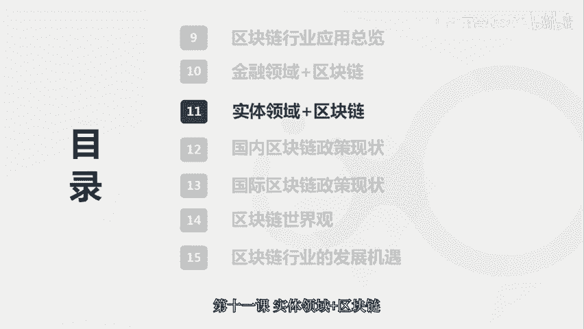
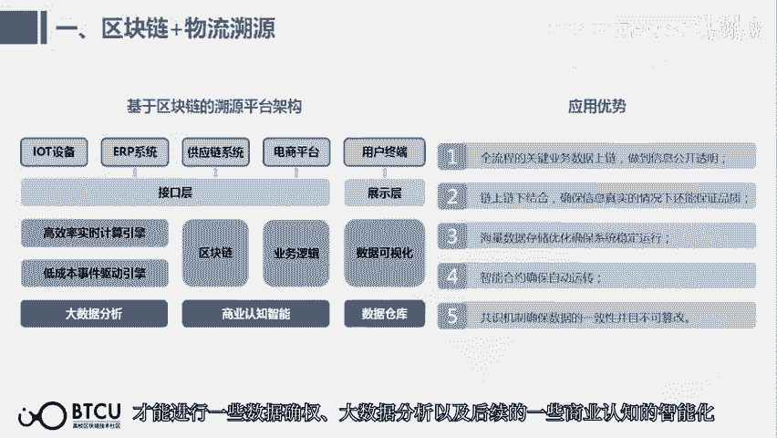
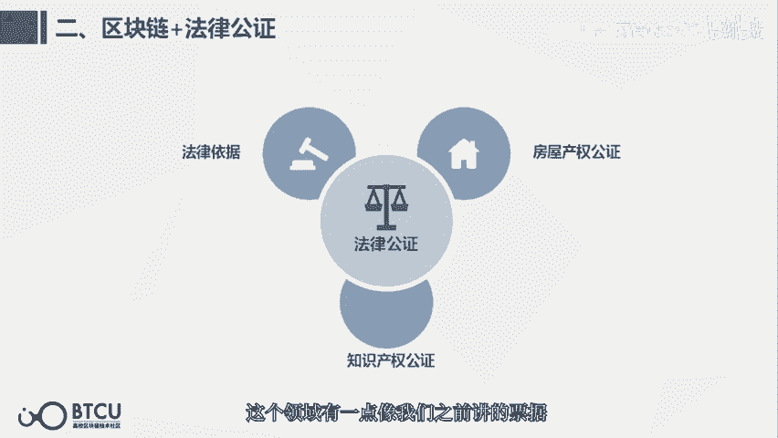
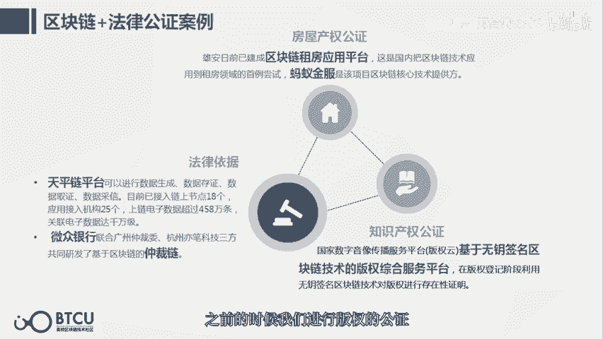
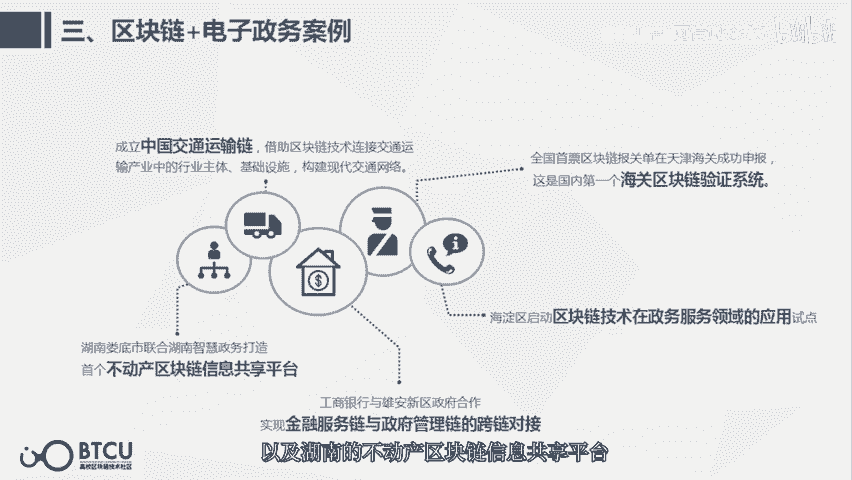
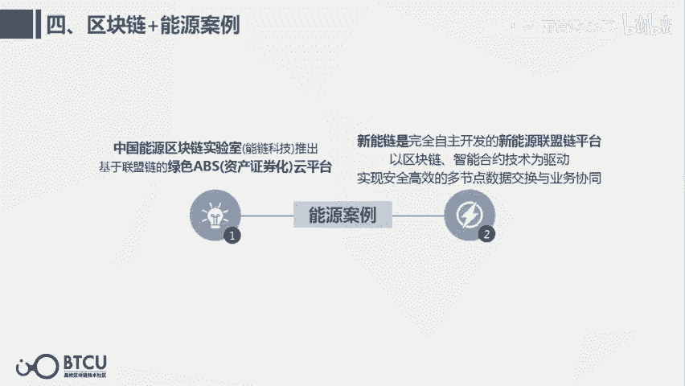
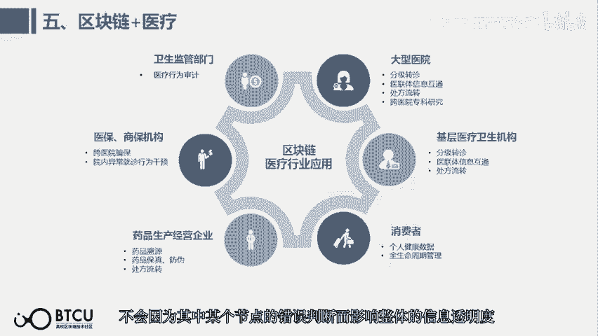
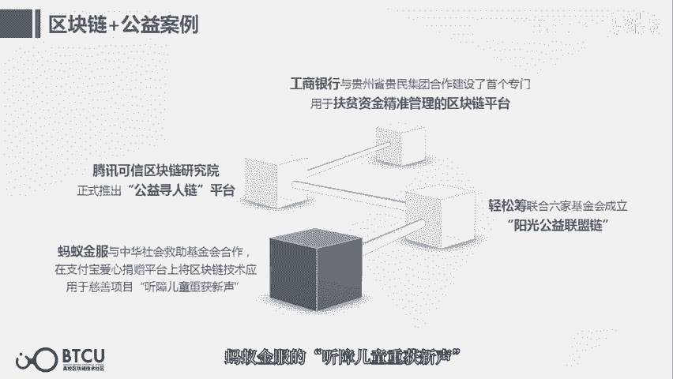
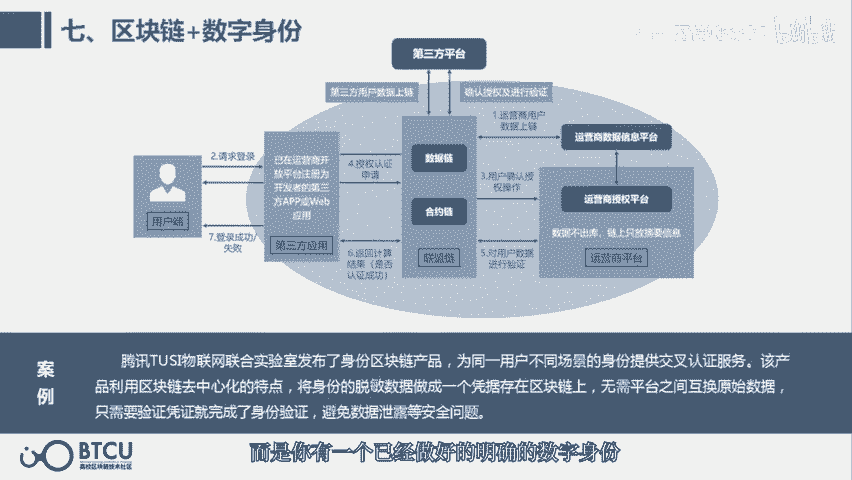
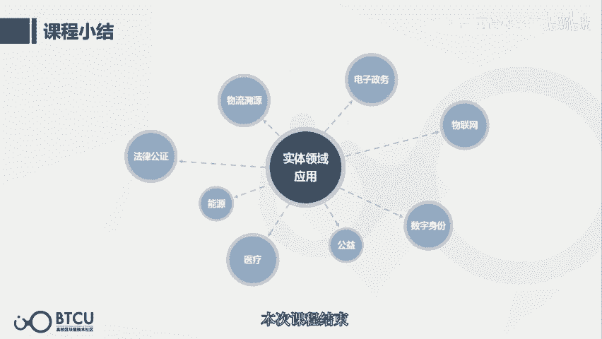

# 【清华大学区块链课】深入浅出讲web3：从比特币到区块链（全14讲） - P10：11-11讲：实体领域+区块链 - web3深度学习 - BV1mL411a7jo

大家好，今天我们来讲第11课。

实体领域加息化联，首先我们可以看到这个产业地图，刚才金融领域已经讲完了，那么为什么要明确的去区分，金融领域和实体领域呢，因为实体领域到区块链的应用，它其实是呃有一个初恋前的最后1km。

这个问题是只有实体领域需要去解决的，因为金融是高度数字化的，它并不像我们实体的啊，一个苹果这种在物理世界存在的这种食物，这种食物，如果想运用区块链去确权或者流转的话，他首先需要唯一确认并且被数字化。

而且还要保障他在上链前的真实性，这个是比金融领域的呃，区块链应用是困难的多的，所以一旦与实体去结合，就是与物理世界去打通，就需要结合物联网，红外感应，无人机等等其他的技术，比如说我们这个第一个应用就是。

区块链加物流溯源，这个就是我刚才说的那个，比如说苹果的那个案例，他确实是需要与练前就是物理世界，其他技术去结合，在进行唯一缺钱并真实上链之后，做了才能发生作用，才能进行一些数据确权。

但数据分析以及后续的一些商业认知的智能化。

比如说有很多案例的，腾讯与中国物流与采购联合会发布的这样一个，物地的物流场景，还有去练科技打造的初恋普洱茶溯源服务，清华沃尔玛，ibm共同开展的食品可溯源项目，还有京东和阿里的物流以及华为的bus平台。

第二个方向的应用是初恋加法律公正，这个领域有一点像我们之前讲的票据。

因为它都是一种纯正嘛，这个第一个是房屋产权公证，其实是一个数字化和区块链化，非常高的一个地方，而且布局也是非常显眼的，它不仅是有这个区块链租房应用平台，还有他所有的资金管理平台都是用粗链去做的。

那么第二个区块链加法律公证案例的案例，是在司法领域，比如说天平链，还有仲裁链，它是可以让这些我们有可能会产生争端的，一些数据提前放在链上，那么当你一旦出现终端就很方便的进行取证。

第三个案例是知识产权公正，我们会发现，区块链做的其实更多的是对无形资产的确缺，这些无形资产之前很容易被窃取，或者是盗用倒卖，但是只有经过确权之后，才能真正的去流转和价值发现。

而且区块链还可以让这种无形资产，的颗粒度变得很小，之前的时候我们进行版权的公证。

可能必须得是达到一本书的，或者是一份完整的文章才能去进行确权，但是之后的话，可能我们几百字就可以进行确权和流转，第三个方向是粗发链加电子政务，电子政务这个领域，我们一想就知道一定是跨部门，跨行业。

跨地区的，比如说我们一个身份证明，很有可能就会跨不同的地区和部门，在电子政务这个领域，也可以说是最涉及民生的领域，其他的在20191024的讲话里面，也特别提到了这个领域，他的理念是让数据多跑路。

让民众少跑路，这也是一个非常嗯偏民生化的一个应用方向，比如它的呃中国交通运输链，还有海关系链验证系统，以及海淀区启动的这样一个，综合的政务服务领域试点，还有呃，工商银行与西安新区合作的金融服务和政府管。

理这样一个跨链对接，以及湖南的不动产区块链信息共享平台。

第四个方向是初恋加能源案例，这个能源呢它是实现了多节点，数据交换和业务协同，提高了多方的协同性。

第五个方向是区块链加医疗，我们可以看到医疗这个行业是有非常多环节的，而且他的数据是涉及个人健康如此关键的信息，如果用激光链可以提高它的真实性，并且它提高一定程度的透明度的话，你想我们想想。

如果用区块链去上报信息，他是无法被篡改的，而且很有可能是多渠道的申报信息，不会因为其中某个节点的错误判断，而影响整体的信息透明度。

而他现在有的一些案例呢，预计是会解决之前隐私保护和有效，信息共享的矛盾，用区块链作为一种多方维护，全量备份信息安全的分布式记账技术，可以满足患者历史数据，以及这些用于建模和图像检索。

辅助医生治疗和健康咨询，第六个板块是工艺，工艺呢之前再透明，也只是会明示出一个支出清单之类的，这种买了什么东西啊，这样一个列表以及最后多少钱，但是实际上你还是没办法看到你捐的那一块钱。

你捐的那个物资到底是怎么流转的，但是之后如果用区块链去改善的话，他是很有可能能够让你看到你那一块钱，你那个一个物件到底是怎么流转的，现在已经有了一些关联家公益的案例，比如说工商银行与贵州呃。

以及腾讯的公益学生链，蚂蚁金服的听障儿童重获新生。

以及轻松筹的阳光公益联盟链，第四个部分，区块链家书的身份，这个是比较偏底层技术架构标准的，可以让我们之后实现不用下载每一个app，都要验证一次手机号，而是你有一个已经做好的明确的数字身份。

第八个方向是物联网，这个部分也是比较偏底层技术架构标准的，它可以相当于是去打通各个部门，然后去保障链上，不管是资金流还是信息流流转的一个真实性，我们来课程小结一下，在实体领域的应用。

有一些是架构标准方面的，比如说物联网和数字身份，有一些偏民生的这种电子政务，物流医疗公益，还有一些偏司法领域的，就是法律公正以及偏工业领域的能源，相信呢就像互联网一样。

区块链也会经历一个从歪门邪说到伟大革命，再到稀松平常这三个阶段，很明显他现在已经到了伟大革命的阶段，所以我们可以在这次的变革中，成为参与者和建设者，好本次课程结束。

