# 【清华大学区块链课】深入浅出讲web3：从比特币到区块链（全14讲） - P11：12-12讲：国内区块链政策 - web3深度学习 - BV1mL411a7jo

大家好，我是中央财经大学的张胜楠。

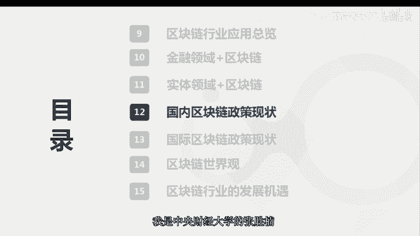

下面我为为大家带来第12课，国内区块链政策现状。

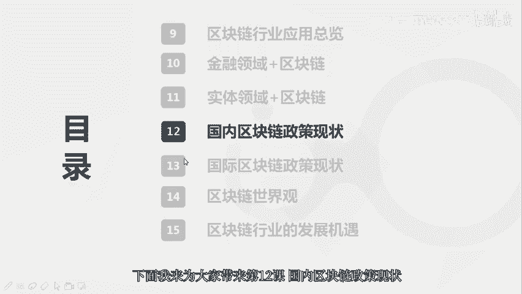

首先我们来回顾一下细胞链政策的主要现状，以及发展历程，我们都知道，监管或者是政策永远是滞后于技术的发展，但是永远不会缺席，由此我们也可以通过梳理政策来去倒推，关链技术本身的迭代历程。

在政策方面有三个比较重要的时间节点，第一个是2013年，中国第一次发布了有相关的政策，关于防范比特币风险的通知，第二个时间节点是2017年，融资风险的公告，第三个时间节点是2019年。

我们也可以倒推区块链技术本身的迭代，就是刚好对应了苏联的一点比特币和区块链，二点以太坊以及区块链三点，分布式账本的社会化应用，首先呢，我认为在这里，我需要为大家先澄清一个比较广泛的误区。

就是大家会认为比特币或者以太币是非法的，但其实它作为商品或者是虚拟财产，无论是在国外还是在国内，都是被认可或者承认的，在中国的一些法律判决里面，已经明确的去表示比特币，比特币现金以太坊至少是这三类。

我是已经看到法院判决保护至少是这三类，作为商品或者是虚拟财产的合法属性的，而我们再去深究一下，在2014年9月，这个政策，他具体说的是什么，这个防范代币发行融资的风险，它主要指的是s o。

再具体点就是以太坊的e2 c2 领代币，它所衍生出来被很多人利用去发行一些资金盘，用来非法集资或者诈骗的，他禁止的是那类行为，而由这些12c20 代币发行的，这些都是属于一种非法证券。

用来非法融资的这种对于这个比特币，比特币现金以太坊来说，这些如果不作为货币来去使用的话，它作为商品或者虚拟财产，是完全受到中国法律的保护的，而在我们的区块链三点阶段，2019年10月24日。

把区块链技术上升为一个国家战略级别的高度，在这个时期呢发行了之后，我们也可以看到有非常多的，都在积极的去享用或者是跟进，但其实呢他们也是在前期就有很多的布局，只不过之前大家都是没有摆在明面上说。

相当于都是压箱底儿的那种，然后他的一些票据早就已经上线了，已经运转了，只不过他没有去跟这个广泛的普通人，或者是广大的c端用户去表明而已，而我们也可以看到，在1024之后。

真的是掀起了中国区块链的一个新时代，已经成为了一种正极性的，依着这种新的时代号召了吧，而各省的呃这个政策呢，北京和上海比较关注金融科技这方面，贵州是因为它自身就是带数据中心，所以它也有天然的基因。

包括对区块链的理解或者认知都会比较超前，各省出台的这些政策，主要是从技术加快标准体系制定和产业，就是给各种补贴用用呢，也就是去加快核链。

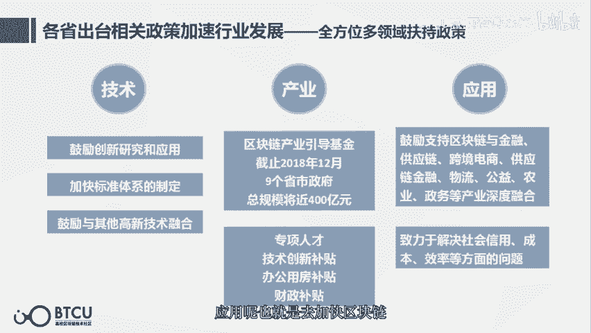

在民生啊，金融还有实体等等各个领域的一些落地的应用，它的技术标准呢也是大体上是从两个方向，一个是技术，一个是金融监管，因为区块链本身，它也是具有技术和金融的双重属性，而金融监管往往是由监管沙河去监管的。

第二个部分是中央单位及各省市的区块链政策。

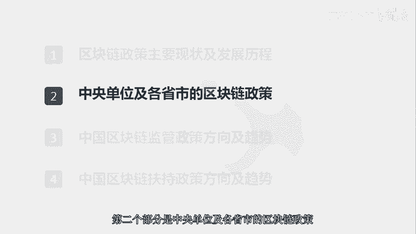

首先我们来看一下中央单位的政策，从三个视角出发，技术产业和监管，首先第一个是技术视角，我们可以看到从16年开始，就已经各个部门都在制定一些技术方面的政策，包括一些区块链技术的发展路线图。

以及把初教练作为战略性的前沿技术，写进13 五规划。

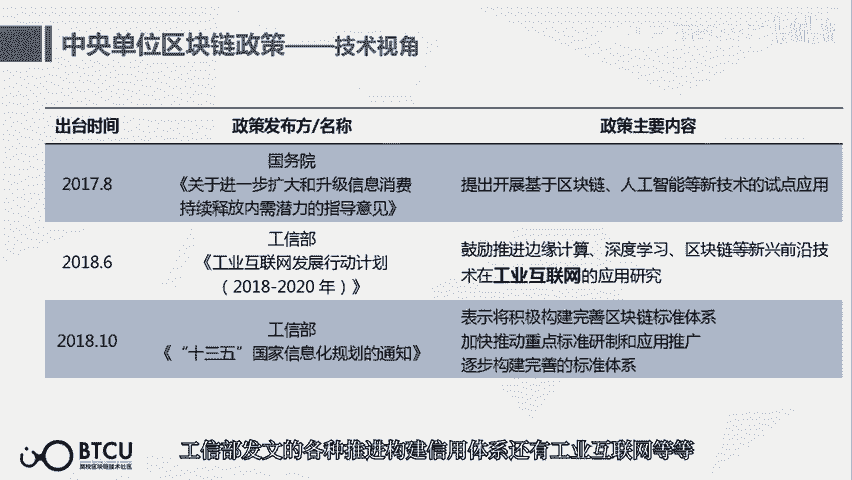

还有工业互联网等等，第二个视角是产业应用视角，他这个也是从供应链，工业互联网，邮政信息，物流，教育等等维度去进行的，一些区块链加产业的尝试，它的本质还是我们一直说的，分布式账本的社会化应用。

第三个视角是监管视角，主要是防范seo，防范各种诈骗行为，我们可以看到这些政策都是围绕诈骗啊，或者是这些seo去给定的，下面是各省市的苏联政策，也是从三个角度，第一个是首都，第二个是产业集群。

第三个是各地特色的政策，首先呢我们可以来看一下首都的政策。

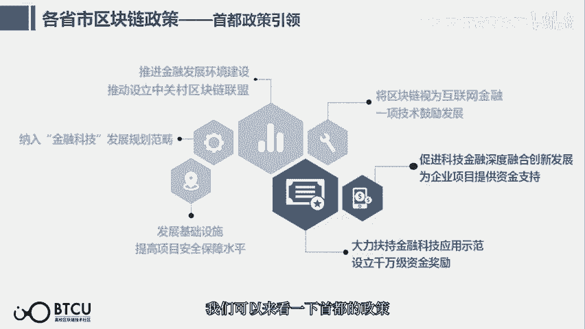

它主要是侧重于金融科技，北京在2016年成立了中关村区块链联盟，我们也知道在北京它是当时的互联网加起源，就是在创业大街那个地方，所以北京对于这种新技术的发展，还是比较早去有这个认知的，然后呢。

北京也是把金融科技，纳入了比较重要的发展规划，第二个角度是产业集群，也是我们一直说的金融科技，这就是与我们之前那个课说的一样，区块链的最佳的应用场景。

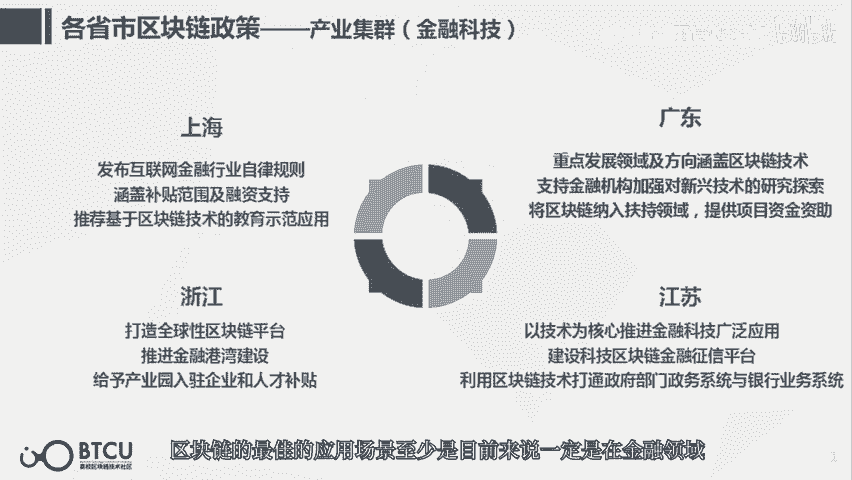

至少是目前来说一定是在金融领域，上海的区块链政策，也可以看到是各种金融民生等等，广东也是设计了非常多的金融科技相关的政策，还有浙江，因为浙江有杭州嘛，他们是有比较多的这个技术啊。

还有这个互联网方面的人才，所以也是比较开放，发展比较前沿的一个省会，然后就是江苏，江苏呢推进金融科技在征信授信风险控制，还有政务方面等等方面的政策，然后第二个产业集群是供应链方面，比如说安徽重庆。

福建山东。

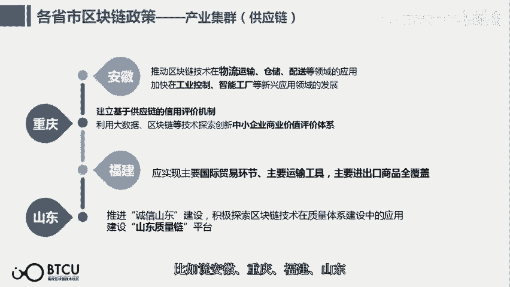

安徽的工业控制智能工厂，还有物流运输，重庆的基于供应链的信息信用评价机制，中小企业商业信用评价机制，福建的国际贸易，山东的山东质量链，第三个是特色产业集群，比如说绿色金融啊的数字医疗，区关链立体化素源。

还有区关链数字资产交易平台，因为贵州它本身是大数据的中心，所以大数据的交易平台最早也是在贵州，而它运用切链的话，它可以解决一些呃，确权和流转的更为关键的数据交易的问题。

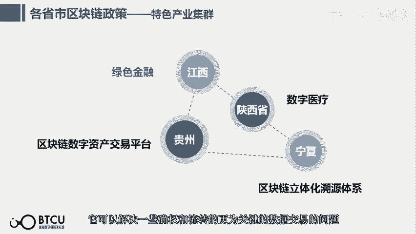

第三个比较大的省市塑料链政策板块，就是各地其实是都有布局的，而且是应该是各有各的特色吧，第三个部分是中国区块链，监管政策的方向及趋势，这四个方向的来源是人民创投，中国区块链政策现状及趋势分析报告。

它主要讲的是建立分布式的监管机制，监管科技和合规，科技成熟以及四层监管层面，以及朝着规范化全面化方向发展。

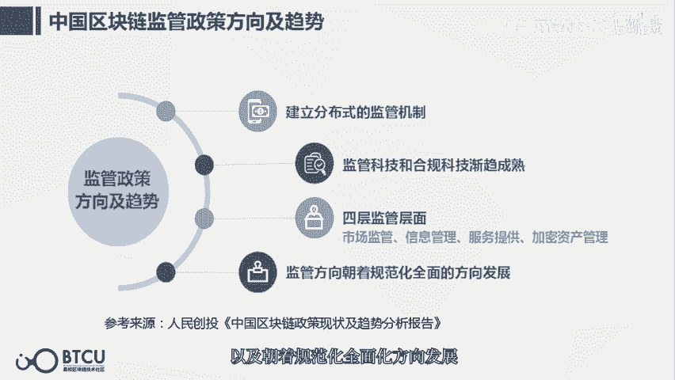

因为初恋本身就是一个分布式的系统，所以它的监管也是要向着这个方向去发展，比如说用分布式记账，多部门去协同，以及数据的可溯源全覆盖，共享账本共同管理，智能合约自动监管。

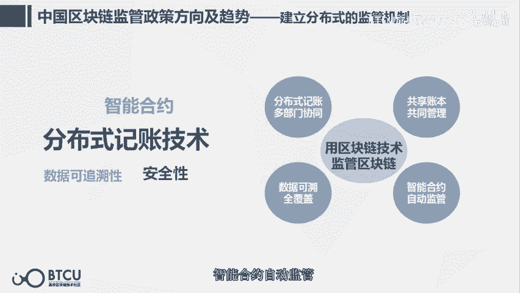

同时监管科技和合规科技也是逐渐的成熟。

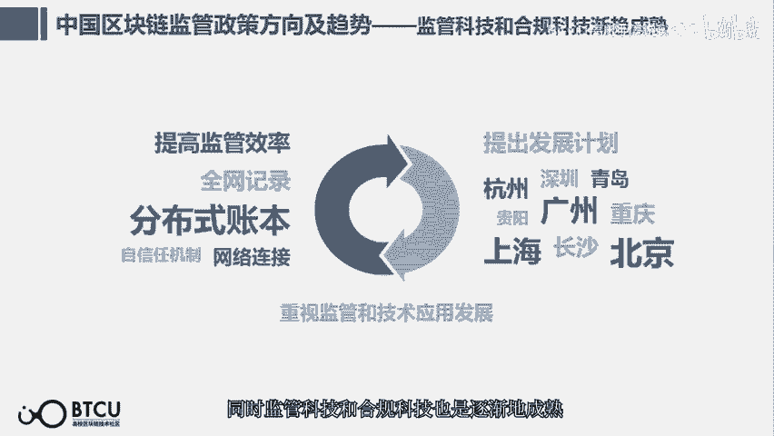

四层监管层面主要是从市场方面，服务方面，加密资产方面和信息管理方面全面化，主要是讲的从练前到链上。

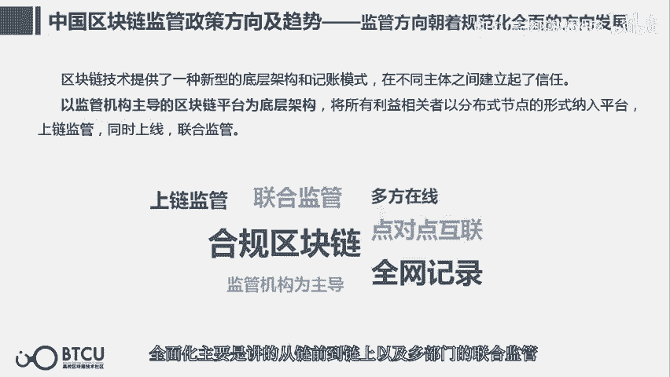

以及多部门的联合监管，第四个部分是中国区块链扶持政策方向及趋势。

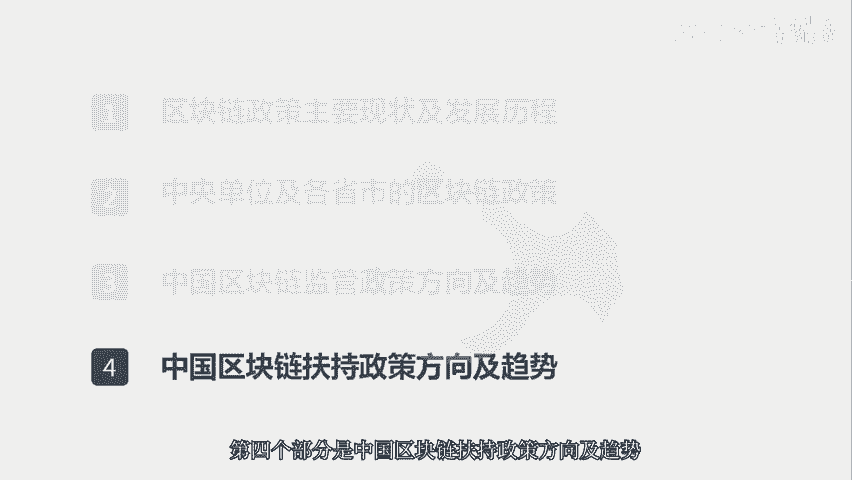

方向，主要是培育发展初链的各种新的业态，以及鼓励发展技术，鼓励发展产业。

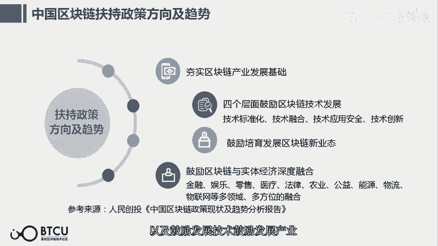

总体来说，课程小结我们来回顾一下，首先我们来回顾了区块链的政策发展，政策发展，同时也就对应着区块链自身技术的迭代，第二个呢就是中央单位和各省市的链政策，在1024之后，他的政策方向。

大部分是趋于鼓励这个技术的发展，尤其是在金融领域，各个领域，他监管政策的方向主要是全面化，以及用区块链去监管区块链，这也是一种监管科技的方向发展，第四个是扶持方向，其实跟政策方向是一致的。

也都是让大家去更多的去看到这个技术，尤其是与一些存量的市场去结合。

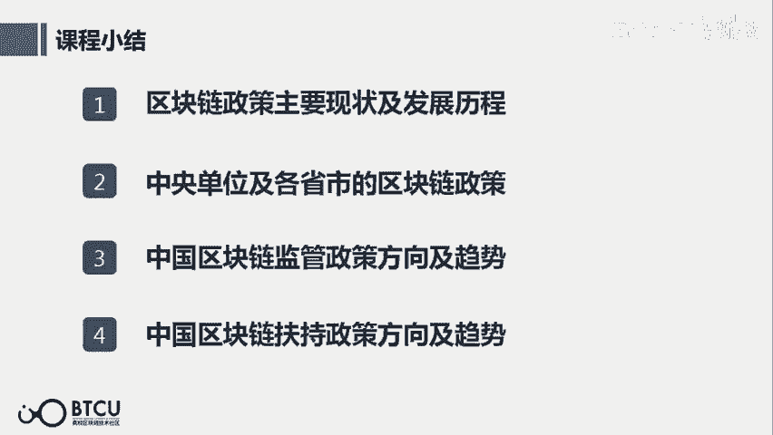