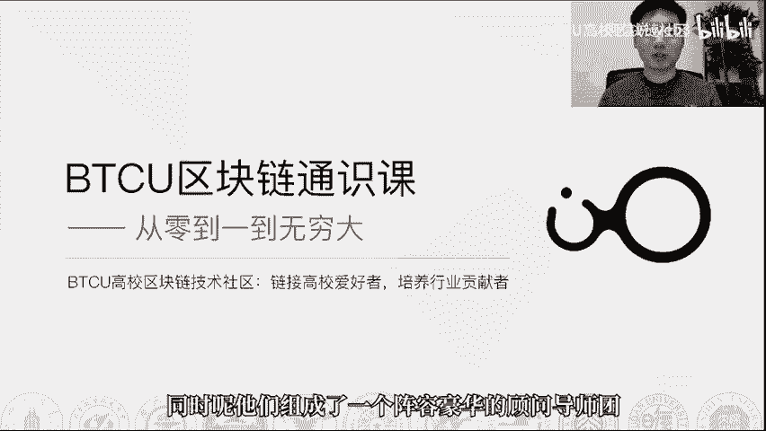
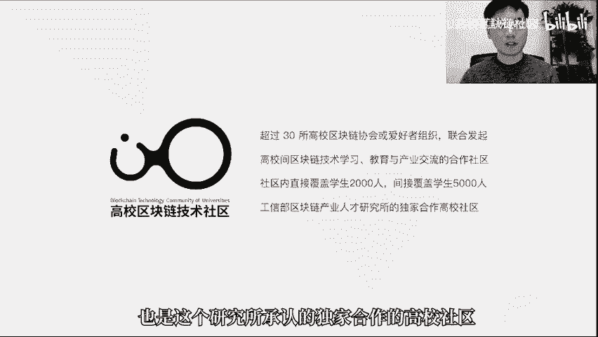
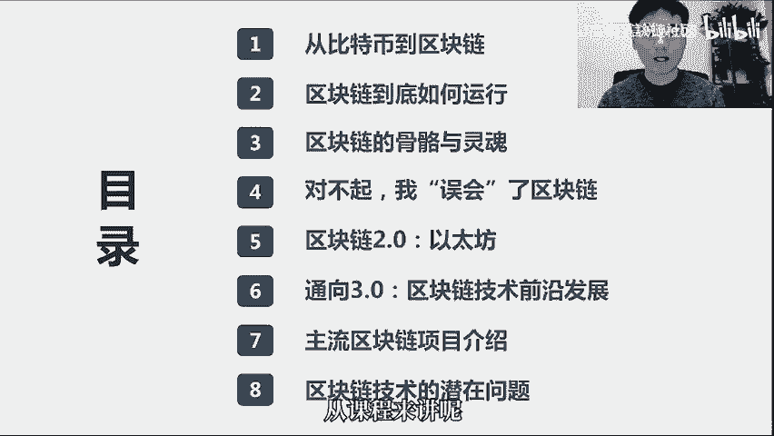
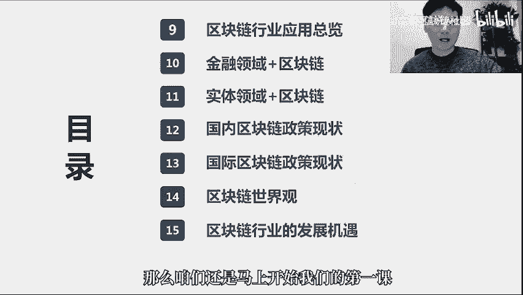
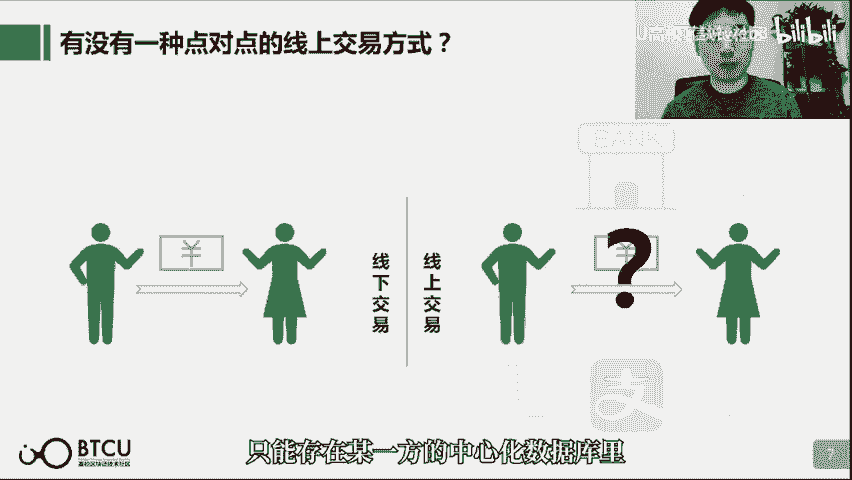
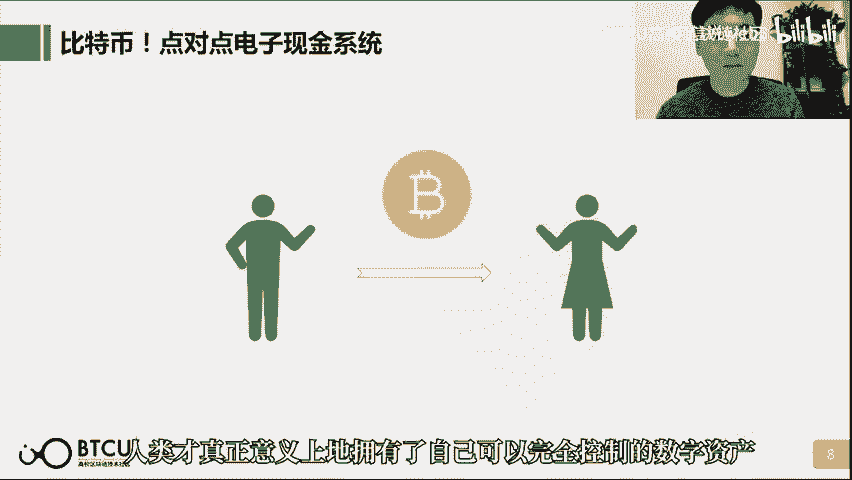
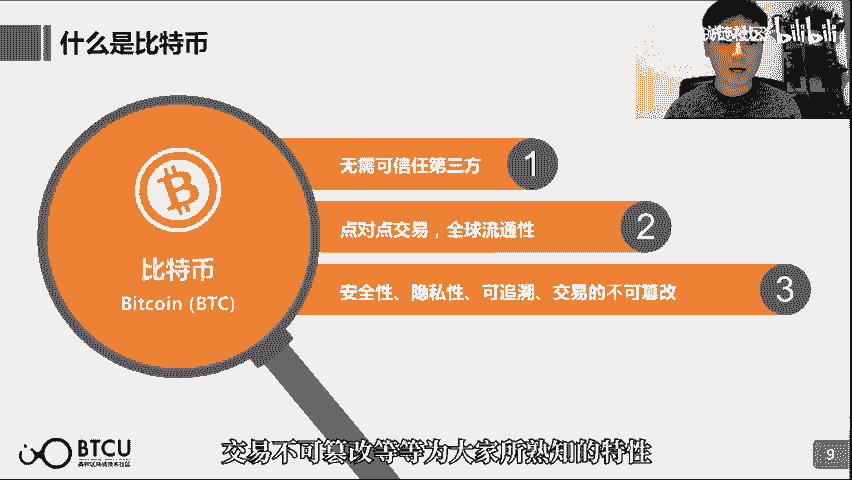
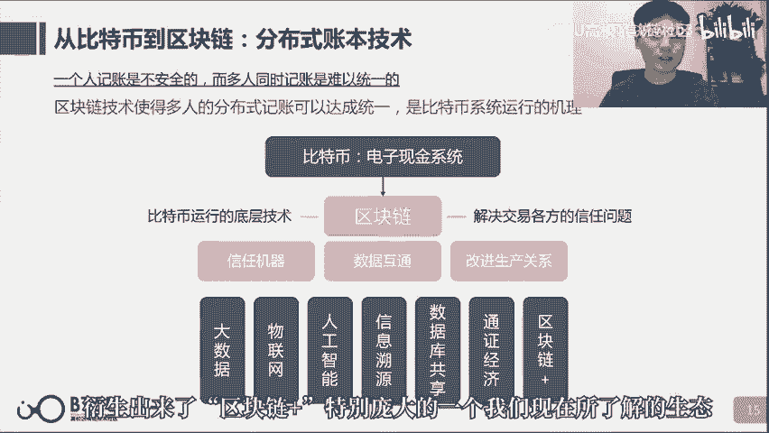
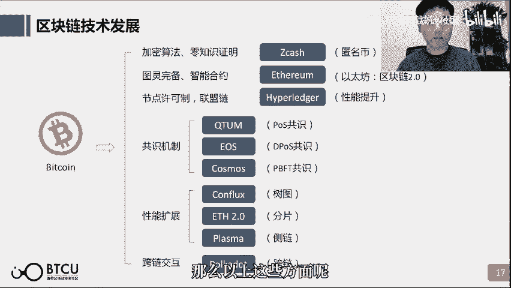
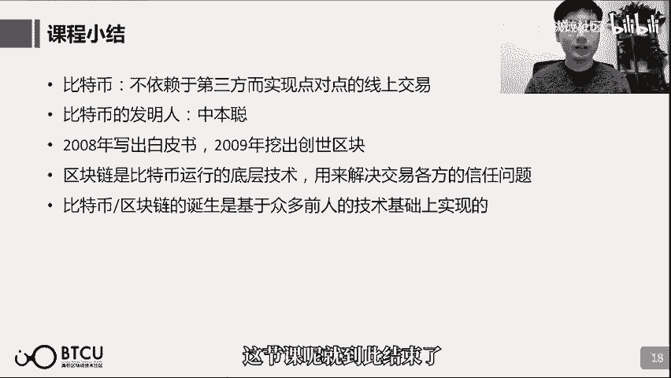

# 【清华大学区块链课】深入浅出讲web3：从比特币到区块链（全14讲） - P1：1-01讲：从比特币到区块链 - web3深度学习 - BV1mL411a7jo

hello，朋友们大家好，欢迎来到由bbc u高校区块链技术社区，推出的系列区块链通识课啊，从0~1到无穷大，那么我是卢迪，也是这一门系列课的讲师之一啊，同时也是b b c u高校。

区块链技术社区的创始人啊，非常欢迎大家，那么这门课呢，b d c o社区真的是特别用心的在去做，投入了特别多的精力，也投入了特别多的资源，那么我们总共发动了几十位啊，高校中的顶尖的博士和硕士。

来参与到这个课件的制作之中，同时呢他们组成了一个阵容豪华的顾问，导师团。

也会陪伴大家，接下来每一天的学习也在这里花一点点时间，简单的介绍一下我们高校区块链技术社区啊，这是一个超过30所高校，区块链协会或者爱好者组织，他们来联合发起的一个高校间区块链技术学习。

也希望促成教育和产业交流的一个合作社区，社区内呢主要的主体都是学生，那么直接覆盖的学生呢有2000人左右，间接覆盖的学生呢达到5000人啊，都是区块链技术的爱好者，那么我们社区的理念呢是链接高校爱好者。

培养行业贡献者，一直以来都在致力于从事区块链技术的步道，和开发的教学等等，区块链产业才研究所，我们社区和这个研究所合作非常紧密，也是这个研究所承认的独家合作的高校社区好。

还是回到课程本身，咱们的课呢总共分15讲，课程内容也特别多啊，这一页只放前八讲，还要提奖在下一页，然后咱们的课的名字呢叫从0~1到无穷大，我们特别强调中间这个一，因为我们觉得从0~1的认知构建呢。

其实是非常根本的，你只有对区块链有一个比较正确的基础认知，你才能慢慢去谈后面无穷大的事情，从课程来讲呢。

我们觉得第一课到第三课，其实就是我们说的从0~1的这么一个，认知构建的过程，帮助大家去了解到底什么是区块链，那么第四课呢，又会紧接着带大家浏览一些社会上常见的，对区块链的误会，那么通过这样的反向。

再来加深大家对于正确的区块链的认识，在此基础之上呢，我们就能继续来谈一谈区块链的技术发展，然后区块链主流的项目，区块链潜在的问题啊，区块链的应用啊，区块链的政策等等等等。

那么第14课呢是我自己也非常喜欢的一节课，那么咱们在学习了那么多东西之后呢，来聊一聊情怀，聊一聊理想，聊一聊区块链的世界观，第15课呢则是一个非常开放的课程，第15课的形式就不再是以现在大家看到的。

线上的视频课这样的形式了，咱们呢会在微信群里面长期的开放，我们会不断地邀请行业里面啊，真正的从业者，从业时间比较久的那些大咖们，他们来聊一聊他们怎么认识这个区块链行业。

他们觉得区块链行业存在哪些发展机遇，我们觉得这样的认识才是一个，更加具有代表性的认识，那么以上呢就是我们对于这15讲，他们要分别讲什么的一个大致的总览，那么咱们还是马上开始我们的第一课啊。

从比特币到区块链，从比特币到区块链，先从比特币讲起，那么在讲比特币之前呢，我们不妨从一件更小的事情来讲起，从最简单的交易来讲起，什么是交易，我从你这买了个东西，我给你付了十块钱人民币。

我从钱包里掏出十块钱来给到你手里，这就是一笔最简单的交易，并且是一笔线下的交易，那么在线下的交易过程中，就只有我们两方，我和你咱们一手交钱，一手交货啊，非常简单，后来呢。

咱们从线下交易慢慢的过渡到了线上交易，特别是在支付宝流行之后，咱们几乎没有发生过线下交易了，那线上交易和线下交易有什么区别呢，区别在于我们远隔万里，我不能再把一个纸币交到你手里了，这个时候我们怎么办呢。

首先我们有了银行，我在银行里开一个账户，你也在银行里开一个账户，我往我的账户里存了一些钱，然后我就可以把钱从我的账户转给你的账户，后来呢又有了支付宝，其实也是一样的，你也有。

那我从我的支付宝账户里面转钱给你的账户，所以线上的交易行为，其实它就是一个记账的行为，比如说银行他自己拿出了一个大账本，你在上面开了户，你就在这个账本上有了一个账户，银行做的是一个什么事情呢。

首先你存钱好，你的账户余额增加了，那这种交易的行为是指什么呢，其实就是往你的账户里面扣减了一些钱，往他的账户里面呢增加了一些钱，只是一种记账的数字差别，支付宝呢其实也是一样的。

线上的交易其实是一个记账的行为，那么我们就发现线上交易中有一个很特殊的点，我们两方之间的交易行为必须有一个第三方，他来做一个中介，无论是银行也好，还是支付宝也好，我们都只能通过他们的渠道来进行交易。

那线上的交易就从我们两方之间的行为，变成必须需要有一个第三方介入，并且这个第三方他拥有一个很强的权利，因为我们两方的钱都存在他这里，最后表达是一个线上的数字，这个数字可以改吗，当然可以改。

要不然他怎么去增加你的余额呢，那他可以随意改吗，我们一般认为它不会，但从技术上来说它是可以的，比如说有一个很经典的问题，马云能否给他的支付宝账户，无缘无故的打100万呢，那么从法律上来说可能不行。

但是从技术上来说其实可以，所以在这样的一个两方交易中，承担中介角色的第三方，它是否足够的可信，就是一个很强的壁垒，而为此需要付出极大的信任成本，那么问题就来了，在线上的交易过程中。

我们是否也能像线下交易一样，哎我们两方之间的交易，那就是我们两个人的事情，不要有第三个人，他来插足啊，他插足我就必须要信任他，我得信任他不会造假我们的数据，他我得信任，他不会拿着我们的钱跑路。

我得付出特别多的信任成本，那么这种只和我们双方相关的，这么一种交易模式呢，叫做点对点的交易，那么点对点呢又叫peer to peer，其实就是我们大家常听到的p two p。

不过大家对p two p的认知呢，可能主要是p two p借贷啊，他曾经1度非常火，但是呢也爆了很多雷p to p借贷，其实它是一个伪p two p，因为他们之间也有中介，中介不仅起到信息的撮合作用。

孩子往往起到一个资金的沉淀作用，而往往是这样的伪p two p他们最终都爆雷了，因为他们不是真正的去中介化的，那么还是说回来，我们能否就是实现一个两方之间的点对点交易。

而从技术上就完全避免一个第三方的介入呢，那么在比特币和区块链出现之前是不可避免的，所有的线上交易都一定需要一个可信的第三方，因为线上意味着你需要电子数据，而电子数据存在哪里，在区块链出现之前。

只能存在某一方的中心化数据库里。

但是比特币它的出现，他就打破了这种不可能，它从技术上实现，我们可以实现一种分布式的，点对点的两方之间的直接的交易，比特币，它的定位呢就是一个点对点的电子现金系统。

大家可能还不太理解比特币出现的划时代意义，如果说之前我们的线上交易，必须通过第三方来达成，那也意味着我们有多少钱，这个数据是完全记在它的中心化数据库里的，那这个数据库的管理员。

他其实可以任意的去修改我们到底有多少钱，甚至直接删掉你就没有钱，而比特币不仅实现了一个，点对点的电子现金交易，同时也意味着我有多少比特币，这个数据不只是存在任何一方的中心化，数据库里的，也就意味着。

这个数据没有一个人可以轻易的去篡改它，所以说比特币出现之后，人类才真正意义上的拥有了自己，可以完全控制的数字资产。

那我们再来好好的认识一下比特币啊，比特币英文叫bitcoin，缩写呢是bp c，它的logo呢就是这样的一个圆套一个币啊，那么比特币具有哪些很好的特性呢，首先就是交易不需要任何可信任的第三方。

完全实现一个点对点的交易啊，全球流通，那么它还具备安全性，隐私性，可追溯，交易不可篡改等等。

为大家所熟知的特性，我们来回顾一下货币的发展史，最早呢是纸币和硬币，那么在慢慢的进行线上化虚拟化的过程中呢，我们出现了像q币这样的虚拟货币，有人说虚拟货币是不是数字货币呢，那么其实根本不是的啊。

虚拟货币就是纯属于有一个第三方企业，他来发行的某种商品，那么这个商品的所有数据呢，也都存在这个企业自己的数据库里，所以说他可以任意的去修改，或者说任意的去增加它的发行量，在这里呢。

所以说它可以为这个电子货币来提供一个，信誉担保，那么这样的话呢，我们就能够信任我们所使用的电子货币，它的数据虽然都是由银行来记账的，但是他不会随意的去更改我们的数据，那么最后呢。

我们有了以比特币为代表的数字货币，数字货币最大的特点呢，中心化的发行机构，也就意味着无人可以控制它，所以我们不需要信任任何人，我们只需要信任写好的计算机程序，写好的计算机代码。

它会按照写好的程序去自动执行啊，通过技术来保证货币的发行量和交易的安全性，那么数字货币呢又叫加密货币，比特币呢就是数字货币的代表，比特币的最小记账单位呢叫聪，为什么要叫这个名字呢。

啊其实和比特币的发明人有很大的关系，他的名字呢看上去非常像是一个日本的姓名啊，thatosha moto，但是他是日本人吗，其实我们完全不知道，在网络事件里面留下的笔名，至于他是哪国人，是男是女。

是一个人还是一个团队，其实我们都不得而知，但其实也许这些都不重要，我们只需要知道，他天才性的创造了比特币就好了，在2008年的时候，他第一次对外公开发表了比特币的白皮书，比特币啊。

一种点对点的电子现金系统，而在2009年的1月三日，他第一次发布了比特币的第一个版本，并且挖出了比特币的创世区块，然后比特币一直运行到现在已经运行了11年，我们知道像比特币这样的数字货币。

是依靠已经写好的程序代码来自动发行的，那比特币到底是怎样发行的呢，所谓区块链，比特币，其实是说每十分钟就会挖出来一个新的区块，那么每挖出来一个新的区块，就会有按照程序写定的规定数量的比特币。

奖励给挖到这个区块的人，那么这个规定的数量呢，最早是50个比特币，也就是说我每挖到一个区块了，我就获得50个比特币的奖励，但是每21万个区块，那么因为每个区块十分钟，这21万个区块。

大概就是4年的这样的一个时间间隔，每过4年这个规定的数量就会减半一次，所以过了4年之后，我挖出一个区块，就只能获得25个比特币，从2009年到现在已经过去了两个4年，那么现在比特币的每个区块的奖励。

是12。5个，并且在今年2020年，比特币将迎来它的第三次减半，届时减半之后，每个区块的比特币奖励数量呢，就会变成6。25个，那么因为每4年，挖出的比特币的数量都会减半一次，不断减半不断减半。

最终挖出一个区块数量将无限趋近于零，那么到了2140年左右，所有的比特币就将全部挖出，而它的总量是2100万个，那么目前到2020年呢，我们已经挖出了将近1800万个，但是其中由于私钥的丢失。

硬盘的损坏等等，有很多人都丢失了自己的比特币啊，忘记了自己的密码，相当于，那么现在我们观察有上百万的比特币，已经很长时间没有移动了，我们怀疑呢就已经遗失了，所以比特币不仅总量是2100万个，无法增发。

并且由于很多人不断的丢失了自己的比特币，所以比特币其实是一个通缩的模型，虽然说比特币，它创造了一种点对点的电子现金系统，它具有划时代的意义，但是最早期它看起来就像一个小众的游戏，你挖一个矿，我挖一个块。

然后我转给你一笔比特币，你转给我一个比特币，就这么玩来玩去，那什么时候比特币真正的对外产生价值呢，这个其实有一则很有意思的意识，2010年的时候，5月18日，一个网友，他也是这批极客小圈子中的一个人。

他在比特币的论坛上，大家都在比特币论坛上，互相交流自己的挖矿心得，那么这个程序员呢他发了一个帖子说，他愿意用1万个比特币来换取两块披萨，希望有人可以帮他买两块披萨，他愿意为这个购买者呢支付1万比特币。

当时他把这个帖子发在论坛里，没人理他啊，很尴尬，大家都问你为什么不自己用美金来买呢，大家还纷纷来嘲讽他啊，大人时代变了，你现在已经可以通过线上支付来买披萨了，不用搞这么麻烦。

但是这个开发者呢铁了心要买啊，他说我就是想看一看，我这1万个比特币有没有用啊，那么最终过了四天才有一个人实在看不下去了，帮他买了，5月22日，最终成功地用1万比特币换了两块披萨，两块皮蛋的价值25美金。

那么这个呢就是非常非常经典的比特币，在物理世界中也产生了对应的价值的一个例子，但它其实并不是比特币第一次产生价格，其实在2009年下半年的时候，就有一些小交易所已经发生了，比特币和美元之间的兑换行为了。

但是大家都喜欢记住那些传奇性的故事，两块披萨当时价值25美金，并且马上就吃掉了，而如果这1万比特币留到现在，它的价值可能已经高达9000万美金了，所以大家都记住了这一天，所以到了这一天呢。

比特币的信仰者们都会往往进行一些庆祝活动，并且把5月22日呢叫做比特币披萨日，当然后来呢比特币的持有者们，他们之间进行比特币和美元的交易的行为，也变得越发的正常，也越发的频繁。

因此也就有了各种各样的交易所，他们来提供人们在这里交易，比特币和美元的一个场所，那么随着越来越多的人，愈发地意识到比特币的价值之后呢，比特币在交易所内的交易价格也是逐渐的走高。

并且我们会发现总会有一些特别特殊的时点，使得人类社会对比特币的价值，有了一个新一步的认识，将它的价格急剧地推高，这种推高往往是很大一个量级上的推高，在这样大的一个价格变动之后之前，比特币价格的起伏。

往往就会被压成一条很平缓的线，1度在比特币的社区中也依然非常活跃，在和开发者们讨论各种问题，但是在2011年之后，无法去认识他是一个怎样的人，但是通过他留给这个世界最大的财富，比特币中。

我们其实可以寻找到一些很关键的线索，他希望比特币承载怎样的作用，所以在这里有两条非常关键的线索，是一定要和大家进行一个分享的，首先一条线索还是很容易找到的，在2009年1月三日，比特币网络正式上线。

挖出的第一个创世区块里，这个话其实摘抄的是，泰晤士报在当天的一个头版的新闻的标题，这个标题写的意思是，英国财政大臣正处于第二次救助银行的边缘，这句话其实特别有深意，咱们之后呢再来细品第二个线索。

是在一个网站上发布的，这个网站要求每一个注册的用户呢，都必须提供出生日期，不知道，但其实我们通过这个生日，又解读出来了很多信息，它其实是两个在金融上非常重要的日期，组合而成的，1933年4月五日。

美国总统罗斯福签署法令，规定所有的美国公民他们持有黄金是非法的，你们都必须上交黄金，政府呢以20。67美元的价格来收取黄金，但是之后美国政府又将黄金的价格稳定在了，35美元一盎司。

这样使得美元直接贬值了四成，但是它大大地减轻了美国当时的债务压力，然而同时所有的美国国民，他们的财富都因此缩水了四成，而到了1975年，当时的美国总统福特，他再次签署了黄金合法化的法案，时隔了42年。

美国公民他们持有黄金才终于恢复了合法化，1975年和4月五日拼凑在一起，1975年4月五日生日的由来，这两种线索表达了什么样的意思呢，当时国民都在使用的货币体系，政府总有自己的一些诉求。

无论是减轻债务压力也好，或者救助银行也好，当然他们从长远来看，也许对于这个国家的发展是有好处的，但是背后为此买单的是所有国民财富的缩水，所以在这样的货币体系下，其实国民的财富安全是得不到一个。

应有的保障的，这种案例在现在其实也屡见不鲜，南美的小国，非洲的小国，货币贬值也就贬值了，国民能有怎样的办法呢，则将这一切规则都写得明明白白的，就写在代码里，代码是完全公开的，并且是不可篡改的。

以此代码发行的比特币上限就是2100万个，谁也改不了，但是他也确确实实唤醒了人们，对于个人财产安全，对于个人财产价值保值的诉求，好我们介绍比特币也介绍了特别多了，那比特币和区块链它又有怎样的关系呢。

其实区块链是保障比特币可以运行的底层技术，比特币它的定位是一个点对点的电子现金系统，它能够消除原来的线上交易中，我们必须要引入一个可信的第三方，比特币，不需要这样的第三方，能够实现一个点对点的交易。

而这一点就是区块链技术帮助他来达到的，区块链技术为什么能达到呢，区块链技术其实就是一个分布式账本技术，简而言之，比如说支付宝它就是这样的一个单一的记账方，支付宝来记这个账，我要给你交易多少钱。

他就在我的账户里扣多少，在他的账户里加多少，他就是唯一的记账方，而区块链想要实现的是，而有特别多的记账者，他们在同时记账，这样的情况下，某一个记账者他如果想作恶，他如果想篡改数据的话。

他在这么多个记账者中，他的力量是很单薄的，而现在唯一的难题就是这么多人同时记账，如何让这么多人记得账是统一的一个账本呢，这个就是区块链需要解决的问题，也正因为他解决了这个问题。

它使得比特币系统可以消除某个第三方的信任，使得比特币系统可以正常的运行，所以咱们梳理一下，比特币是电子现金系统，区块链是比特币运行的底层技术，而区块链解决的最重要问题，是交易各方之间的信任问题。

而由于区块链能够解决这样的问题，他又被人总结出信任机器数据互通，改进生产关系种种的特性，然后可以应用在与大数据的结合，物联网结合人工智能，结合信息溯源，数据库共享，通证经济等等各种各样的应用场景。

衍生出来了区块链家，特别庞大的一个我们现在所了解的生态。

比特币是应用区块链技术的首个应用，他凭一己之力就发明了整个区块链技术吗，其实也不是，正和牛顿一样，在1982年的时候，就有人提出了注重隐私安全的，密码学的网络支付系统，在1985年。

椭圆曲线加密算法得到了提出，在1991年提出了时间戳，这样的技术，在1997年就已经有人发明了，采用pow算法的哈希现金，而在1998年，在2001年，s h a系列的加密算法呢也得以推出。

那么到这里为止，比特币它所采用的区块链的技术诞生，所需要的技术基础，在理论上呢也都得到了解决，可以被称为一个很好的技术整合者，当然自比特币发明之后呢，区块链技术得到了更多的人关注。

区块链技术自身也得到了更好的发展，这其中就包括加密算法，零知识证明图灵完备智能合约节点的许可制，诞生了联盟链这样一条新的种类，然后发展出来了特别多种多样的共识机制，然后在区块链的性能扩展上。

也有特别多团队在做着不同方向的努力，以及不同区块链之间他们如何进行跨链交互，这也是现在区块链技术发展的一大方向，那么以上这些方面呢。

在未来的课程中，我们都将为大家一一的详细介绍，那么以上呢就是咱们的第一课，从比特币到区块链的全部的课程了，那么小结一下比特币，它的特点呢是不依赖于第三方，而实现点对点的线上交易。

它是一种点对点的电子现金系统，我们现在也还未知身份的这么一个人，他在2008年发布了比特币的白皮书，在2009年比特币正式上线，区块链是使得比特币得以运行的底层技术，它用来解决交易各方的信任问题。

那么比特币或者区块链，它的诞生呢，基于众多前任的技术基础之上来实现的，那么以上呢就是我们的第一节课，我们介绍了比特币这样的一个，划时代的发明产物，以及它背后的区块链技术，未来的几节课呢。

我们就将继续带领大家去剖析，区块链到底是如何运行的，希望大家呢可以继续关注我们的区块链通识课，这节课呢就到此结束了。

