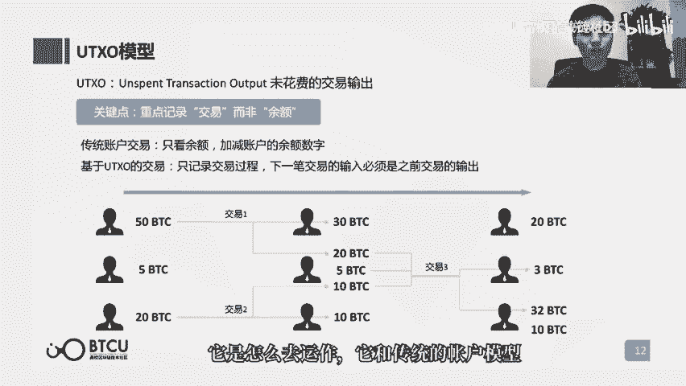
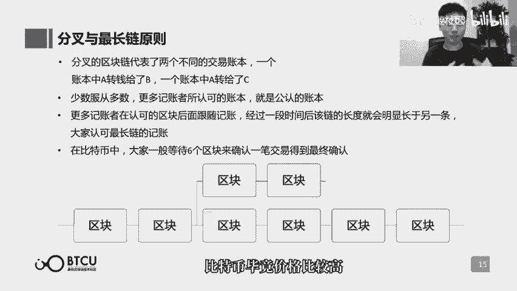

# 【清华大学区块链课】深入浅出讲web3：从比特币到区块链（全14讲） - P2：2-02讲：区块链如何运行 - web3深度学习 - BV1mL411a7jo

hello，朋友们，欢迎回到咱们的区块链通识课堂，第二课啊，咱们的上一节课呢从比特币讲起啊，讲到了区块链啊，作为比特币的一个底层技术，其实是一个多人共同记账的，一个分布式的账本啊。

为什么要这么多人一起来记得啊，本质上就是因为我们彼此都互相不信任啊，所以不希望任何一个人，他来单独的控制这个账本啊，所以那办法就是所有人都一起记，那么所有人都在记，怎么能够把这个账给记清呢。

啊这个就是区块链要解决的问题，那么这一课呢我们就来讲，区块链到底是如何让这么多人同时记一个账。

那咱们看课件哈，首先区块链做一个账本啊，一个账本就要如果你不发生交易的话，那这个账本所有人的这个状态是不会变的啊，所以那么也就没有意义，那么更多的是要关注交易的过程中啊，怎么去记账啊。

所以说一切都会从交易开始，那么我们来看啊，这么一个区块链，他所参与的这么角色中啊，有两个人，他们现在呢发生一笔交易了，那么发起这笔交易的人啊，就是这个转账的人，他会把这笔交易呢向全网广播广播出去啊。

告诉所有人，这笔交易发生了，那么告诉我我是谁啊，我要转给谁，我要转给他多少钱啊，什么时间转的啊等等这些信息都要公布出去，那么在这个网络中呢，同时也会有这个角色是记账者的人，那么他的这样的一个职责呢。

就是要把自己收听到的所有广播给自己的，这个交易啊，要记录下来啊，记录啊谁谁谁转给谁多少钱啊，什么时间转的好，那么每过一段时间呢，他就要把自己这一段时间听到的所有交易啊，整理一下啊，写一个账单啊。

就比如说今天十点到11点啊，我总共听到了100笔交易啊，分别谁谁谁转给谁多少钱，那么这100笔交易完了之后啊，他们的所有这个账户是一个什么状态啊，还有多少钱啊等等，这样的一页账单呢。

就是咱们区块链中所理解的一个区块，所以区块呢就是记录了一段时间内，发生的所有交易啊，以及参与这些交易的角色，他们这个账户的这么一个状态，那么好，我们刚刚提到了啊，十点到11点啊，写了一页账单。

那么九点到十点也会有这么一页账单，11点到12点还会有这么一页账单，那么我们形象化的来想一想啊，那么一页账单，一页账单，一页专门合起来就是一个账本，那么区块链也是一样的啊，这一段时间一个区块。

下一段时间一个区块，他们按时间顺序连接起来啊，连成了一条链啊，时间顺序，这个区块的初始状态，一定是上一个区块的末的状态啊，那么他们呢就能进行一个连接，那么这么一个区块连成链，最终构成的区块链的啊。

就是我们能够从最开始一直看到现在，这么一个账本的连续的变动的过程，所以这就是区块和我们所说的区块链，它的一个真正的含义，那么刚刚讲述的呢，是对区块链如何运行的一个基本讲解。

那么其中呢其实有很多还挺有意思的点，那么接下来呢我们会一个一个的进行一个，深入的剖析。

刚刚呢我们提到了很多的账户的问题，那么账户是账本中非常重要的一个组成部分啊，毕竟账本他其实记录的就是不同账户，他的这么一个余额或者状态的变更，那么区块链的账户体系呢。

和我们之前所普遍认知的一种传统体系中的，账户体系是有很大的区别的，那么比如说我们在淘宝里面，我们注册了一个账户，然后同时我们在注册的时候就登录了，登录了我们的密码。

那么这样的一个账户和密码就会存储在淘宝，它所能控制的一个数据库里，这也是为什么如果我们丢失了密码，我们寻找淘宝客服，依然可以把密码找回的原因啊，因为都在他的数据库里面，记得好好的，只不过你忘了。

但是在区块链里面我们就不能这么做了啊，因为淘宝是因为我们都信任淘宝啊，他不会随意的去更改我们的账户密码，也不会拿它去做一些坏事，但是在区块链中，我们是不相信任何人啊，我们本质是不信任任何人。

所以没有这样的一个可信的一方，它可以起这样的一个存储账户，密码的这么一个职责，那么如果没有这样的存储，也就无法实现账户和密码之间的一个绑定关系，无法实现他们的映射关系，这个就是比较难办的一点。

那么在区块链的体系中，我们可以怎么做呢，那么还是有一些密码学的工具啊，可以给我们使用的啊，比如说这个比特币它所用的椭圆加密曲线函数，那么它是怎么运作的呢，首先我们先说两个概念啊。

公钥和私钥啊其实也很好理解啊，公钥就相当于区块链里面的账户啊，是可以对外公开的，也用于这个互相之间的转账，那么私钥呢就相当于区块链里面的密码，那么你通过私钥，你可以证实你确实是这个公钥的持有者。

那么怎么通过一个密码学的函数，来实现公钥和私钥之间的这么一个对应关系呢，那么这个函数它的原理呢，是可以通过私钥来计算出一个公钥，通过你给私钥，给这个函数就可以很快速的算出公钥，也就很快的可以证实啊。

你确实你因为拥有私钥，所以你确实是这个公钥的拥有者，但是外界知道了嗯，你所公布出来的公钥之后，它是无法反算出你的私钥，所以意思就是说，这个私钥和公钥之间，通过某种函数产生了映射关系。

但是外界无法通过公钥去计算出四幺，但是你如果有私钥又可以很快地验证，你确实啊这个私钥和公钥是一一映射的，那么这样呢，相当于通过一种密码学的方式，来实现了私钥和公钥之间的映射，而不是传统体系中。

来把这种人为给定的映射关系来存在数据库里，来实现这种映射，所以这个是区块链体系，和传统体系的一个很大的区别，那么同时呢啊关于这个椭圆加密曲线函数，其实还挺有意思的啊，也欢迎大家在课下呢自己去搜一些资料。

来增进对他的了解啊，其实这是一个很有意思的事情，它的原理呢可以简单的解释一下啊，就好像一个台球桌啊，有一个白球啊，然后我我知道白球原来的起点，那么我根据一个角度把它很大力的打了出去。

然后他在各个台球桌的各个边框上，碰撞了特别多次啊，最终停在了啊一个点，这个时候我就告诉你，台球桌上白球起点在这儿啊，终点在那儿啊，你告诉我他中间碰撞了多少次啊，你肯定很难告诉我他中间碰撞了多少次。

但是假设我这个时候告诉你，哎我最开始打的那个角度是多大啊。

然后我告诉你碰了几次之后，他回到了这个点，他回到了最终的终点，而这个又是很容易去验证的一个事情啊，所以其实啊这个椭圆加密曲线函数，它的实现原理，就和我刚刚所描述的这么一个打台球的案例，就非常的相似。

所以也很好理解，其实我们在生活中也充斥着这种呃很难反算，但是你把这个起始的状态说明了之后呢，又很好验证了，这么一些例子。

好那么接下来呢我们来详细的剖析一下啊，这个交易以及记录交易的这么一个过程，首先交易啊，a和b两个人，他们之间要达成一笔交易，实际上是在做一件什么事情呢啊，因为实质上我也不可能真的拿出十块钱，来给到币。

那我们能做的事情只有向网络中发送一个信息，告诉他，我要给他转啊，比如说十块钱，我a要给b转十块钱，那么我a的余额有多少，我从多少里面拿出十块钱给他，那么你们来看看我的余额是否够啊，如果够的话。

就比这就把这笔交易给记上，那么最后呢由我a的数字加密的签名来证实，这个交易单确实是我a发出去的好。

那么这是交易的发出过程，那么作为一个记账者，他所做的事情呢就是首先我要监听啊，最新的一笔账单，也就是最新的区块记录到哪了啊，我好在他的后面呢，跟着记好，上一笔账单已经确定了，那么接下来我要监听的就是。

现在我所能够听到的广播出来的交易，每听到一笔交易呢，我就把它递上去啊，最终又到了呃，比如说一个小时啊，或者比特币的十分钟啊，又到了十分钟了，那么我要把这十分钟我听到的交易啊写好，组成一个账单哎。

也就是备选的区块好，这个账单首先有上一页账单的一些信息，证明我确实是在这个上一页账单之后呢，跟着写的，还有呢就是我这是跟中国记录的所有的交易啊，交易交易啊，交易三它们分别是什么好，那现在问题来了。

如果这个网络中有特别多的记账者啊，比如说这个图里画的有四个记账者，他们其实都在做着同样的事情，那么时间一到，他们都能拿出来一页账单，这就是多人记账的最大的问题，到底我下一页放在能够放在账本上的这一页。

账单用谁的啊，也就是说我这个区块链现在时间到了，要往上记一个区块了，我到底用谁记得这样的一个区块，这就是多人记账要解决的一个核心问题。

那么好，我们来看比特币啊，它是怎么解决这个问题的啊，其实就是在玩一个游戏啊，说到底是在玩一个游戏，什么游戏呢，每个记账者他们都要找一个随机数，找一个随机数，这个随机数呢要使得啊，某个结果达成某个条件啊。

说详细一点呢，就是把这个随机数放在这个账单里，然后这个账单呢要做一个叫哈希函数的计算啊，这个哈希函数的特征呢，是会把任意的输入值都输出成，一个标准格式的输出值，而这个输入值和输出值之间呢。

他们的关系是一个谜题，友好的关系，也就是说我无法通过一些呃推理也好，逻辑也好，计算也好，去猜测，或者去合理的揣测，我通过怎样的一个输入值会对输出值有影响啊，他们之间完全没有任何的，你你能想到的可能关系。

所以说为了使这个输出值达到我所设定的条件，我只能不停的去尝试我的输入值，那么也就是随随机的去尝试，来找到一个真的有效的一个随机数诶，它恰好就能使得我的这个输出值呢，满足我所给定的要求呃。

所以这个如果我们去限制我们的这个要求，越来越严格，那就会使得啊，记账者他要找到这样的一个随机数，就更加的困难，因为它是一，而因为它是一个完全随机的这么一个过程，所以要想找到这么一个随机数。

一定是需要付出大量的工作量的啊，这个其实我们在之后的讲共识机制的时候呢，也会给大家提到，这就是比特币它所用的这么一个工作量，证明机制好，那我们收回来也就是这么多个记账者，唉。

他们都非常想让自己的区块被登记上，这个唯一的区块链，也就是登记上唯一的账本，那么他们所要做的事情呢，就是不断的去找那样的一个随机数，在找随机数这样的呃事情面前呢，所有的记账者都是平等的。

所以说就完全是靠啊一种运气，以及他们所付出的工作量好，他非常的幸运，他最后啊布利仙啊，找到了这样的一个有效的随机数诶，他有资格现在有资格把自己寄的账单啊，登记到账本上去了，好那么现在是最后一步。

他必须要让他的账单，被全网所有的其他的记账者接受啊，这样的话呢他的账单才能真正的递上去，怎么才能被记账者接受呢，或者说其他的记账者他考验的是哪些点呢，啊，第一个你所记的账单里面，希值呢。

其实就是我们刚刚所提到的这样的一个哈，希函数啊，它所算出来的，他把上一页账单，这样的一个完整的信息输入进去，它所算出来的一个输出值啊，就是上一页账单的哈希值，输入值和输出值是唯一对应的。

所以一定程度上哈，希值就代表了上一页账单的一个浓缩，只要他所跟随的那个上一页账单，也就是呃上一个区块里面，所有账户的这样的一个最终的状态，如果跟我的是不符合的，那我就不会认这样的一个他所寄的账单。

而上一页的区块和和我记录的这个区块，只要有一丁点差别哈，希值就会千差万别，所以这个是很好验证的，那么第二个呢就是验证它所记录的这段时间，所记录的所有的交易啊，这些交易是否是合法的一个呢。

看这个交易的发送者他的签名在不在啊，它是否是他所签名的这个交易，第二个呢就看这个交易的发出者，他的余额是否足够，然后就看就依靠这两点来看这个交易是否合法，那么第三个呢在最终的验证一下啊。

这个账单呢他自己也会产生一个哈希值，那这个账单和这个哈希值是之间，是否是匹配的啊，所有的其他的记账者呢，都会非常严格的卡这三观啊，如果确实啊都卡都卡中了，那也只好很遗憾的把别人所记的这笔账呢。

最终放到这个区块链上啊，为什么会这么遗憾呢，啊因为包括比特币在内的这样的一个区块链呢，都会存在一个奖励的机制，为了奖励那些诚实的矿工，他既正确的记了账，并且呢他在刚刚所玩的这样的一个。

哈希解谜的游戏中呢，他付出了大量的工作啊，然后他最终胜出了，那么最终成功的把这个账单记录在账本，也就是把成功的把这个区块接在了其前面，所有区块的屁股后面啊，成为新一个区块的。

提交的这么一个区块的记账者呢，在比特币的系统里面，他最开始是能够获得50个比特币的奖励啊，所以说所有的记账者呢，他都会去争这样的一个奖励，也就是他们的工作报酬，所以他们在上一轮的竞争中呢。

会非常努力的去玩这个游戏来解谜，而在这个环节呢又会非常严格的去卡，那些胜利者，他是否是啊真的记账正确，而通过这样的一个过程呢来尽可能的维护啊，大家的这么一个记账是诚实而真正有效的。

我们回过头来啊，再来看一看区块和区块链，它们这样的一个实体的构造，那么每一个区块呢，其实在结构上它会分为块头和块体两个部分啊，快题呢，其实就是我们所记录的这样的一些，交易信息的啊，主要的信息。

那么块头呢就包含两个，一个叫头哈希，一个叫富哈希，那么其实呢也就是在上一页中，我们所提到的每一页账单的哈希值啊，我们也提到了，账单的内容和哈希值是完全是一一对应的，那么头哈希呢其实就代表了这一页账单。

他所算出来的哈希值，而富哈希呢就是上一页账单，它所算出来的哈希值，每一个区块，也就是每一页账单呢，都必须首先包含你所跟你所跟随的这样的一个，区块的哈希，那么这个区块的头哈希，也就是你这一个区块的负哈系。

那么同时我们还要记录上自己的头哈希，所谓的区块连成链啊，因为都是抽象的概念嘛，它其实并没有我们物理意义上所理解的，那种连成链，那么到底是什么连成链呢，其实就是这样的一个头哈希，和富哈希的映射关系。

我这个区块所记录的符华符哈希，一定是上一个区块，它的头哈系这样的一个关系，其实才是真正我们所理解的恋的关系，那么我们再来看比特币，它所采用的一种记录账户余额的模型，这个模型呢也是一个很特殊的设计啊。

叫做ut超模型，这个概念大家在之前呢可能就听说过啊，因为也是经常被提到，那么ut xo是on spend transaction output的缩写，翻译过来是未花费的交易输出啊。

这个名字呢可能听上去还是很难以理解，咱们呢就来看他们和传统的账户模型，有一个怎样的差别，那么传统的账户模型余额就是简单的余额啊，比如说你有500块钱，他有300块钱，那么你们发起一笔100块的交易呢。

其实就是500块的余额变到400块，然后300块的余额增加到400块，但是在比特币中呢，它其实更加注重的是记录交易的过程，而非交易初始和结束状态的余额的状态值，那么怎么理解这句话呢。

咱们不妨用一个更加生动的例子来看一下，比如在比特币的网络中啊，有a b c3 个地址，也就是三个账户，那么初始呢a有50个比特币，b有五个，c有20个，那么这个时候假使a他要向b转20个比特币。

那么在传统的模型中呢，可能就是a的账户余额有50个变成30个，b呢就有五个变成25个，那么在比特币中呢就不是这个样子的，比特币记录的是交易，那么a呢他发起一笔交易，交易需要有输入，同时他要有输入输出。

输入和输出都可以是多比的，但是多笔输入的值加起来，和多比输出的值加起来必须要一样，那么a这个时候他发起交易，它的输入就是a的地址中的50个比特币，那么输出除了给b的20个比特币之外，20和50并不相等。

所以还有一个30 30，比特币的输出是重新回到了a自己的地址，所以这就是很不一样的一个点，它不是说简单的50变成30，而是50输入进去，30再折返，重新回到自己的地址，来保证输入和输出是相同的。

那么假使在这个时候呢，c也给b转了十个比特币，那么也是一样的，c发起一笔交易，输入是c的20个比特币，输出呢有十个比特币给了b，有十个比特币呢又重新回到了c自己的地址，那么这个时候我们通过简单的算数。

就能算得出来哈，b现在的这个地址的余额呢，其实是35个比特币，但它不会直接的写出来，你在比特币的网络上去看b这个账户，他会上面写着b它的地址下面有三笔输出啊，有20个比特币是交易一的输出之一。

有十个比特币是交易二的输出之一，那么还有五个比特币等，那么还有五个比特币呢是b自己本来就有的，那么这五个比特币，其实也是某一次交易的输出值，那么这三笔输出在b的地址中呢，就是b它还没有花费的交易输出啊。

这就是未花费的交易输出，这个名字的由来，没有花费的交易输出，意味着你在之后就可以把它花掉，所以其实就是你的余额，那么这个时候如果b他想发起一笔交易啊，他要给c转32个比特币。

因为他现在所有的余额加起来有35个嘛，它是可以转的，但是我们可以看到他的地址下面，任何一笔输出都达不到32这个数，所以他想发起这笔交易的时候，需要同时有多笔输入，那么把他的未花费的交易输出全部都用上。

终于呢大于了32比特币，凑够了35个比特币，那么这个时候呢，就会有32个比特币来到了c的地址，同时有三个比特币呢重新回到b自己的地址，那么通过这样一个比较生动的例子呢。

我们就能理解ut超模型它是怎么去运作的，它和传统的账户模型有一个怎样的差别。

那么接下来讲一个点对点的电子现金系统中，很容易会出现的一个问题，以及啊区块链它是如何来解决这个问题，那么这个问题呢有一个缩写叫双花啊，但它的意思呢是双重的支付问题，所以双花就是双重的花费啊。

我们一般都叫双花问题，那么在我们的纸币系统中呢，或者说物理的现金系统中呢，是不会出现双方问题的，因为一块一张纸币就是一张纸币，你不能说把它给了b又把它给c，但是在电子货币中呢。

是很容易出现双方的问题的啊，比如说我a啊，我同样有十块钱，咱们回想一下区块链的那个交易方式，其实就是我a我说我要把十块钱交易给b，我向全网广播了这样的一个消息，同时你不能阻止我，我同时我又把这个十块钱。

我说我要交易给c，所以这两个交易单呢就是广播出去的，这两个交易信息呢都是合法的，因为一有我a的这个数字签名，二我的余额呢确实大于十，那么这个呢就会出现问题，我把同样的十块钱又给了b，同时又给了c。

那么如果发生了这样的问题，会在区块链的系统中啊，发生怎样的问题呢，首先因为区块链的系统有很多的记账者，那么按道理上来说呢，一个记账者他收到了你a发送给b的交易，他就不会再记录你a发送给c的交易。

或者说他在a和a，你a给b还是a给c这两笔交易中，肯定会选择其一来进行一个登记啊，因为你的余额中，刚刚咱们也讲了ut超模型啊，十块钱就是独立的十块钱，你无法把它拆分掉，但是在区块链中有特别多的记账者。

这是一个多人同时记账的分布式的账本，有可能我我记账，这a我记录的交易呢是你a发送给b，我同事另一个记账者，他所记录的交易呢是你a发送给c，因为广播嘛总是会有先后的，那么我可能先听到了a给b。

你听到的是先听到的是a给c，然后我们记录的这笔账单呢就会不一样，而如果我们又同时几乎同时完成了这样的一个，哈希解谜的过程，我们都把自己的区块啊放上了区块链，这个时候在我们放上这个区块之前的区块。

可能这个账本的状态是统一的，但是这个区块因为我记得是a转b，而你记得是a转给c，这两个区块就是截然不同的两个区块，这个时候其实就发生了，我们一般所说的区块链的分叉，也就是有不同的区块。

同时接到了一个区块的屁股后面。

而它们都是合法的，但是呢我们最终只会承认一条区块链啊，就像我们最终只会承认一个中国一样啊，那么分叉的区块链，由于他们记录了不同的交易，所以他们其实是两个账本，因为这两个账本中同一个账户有不同的余额。

有不同的账户状态，而在一个账本中，a是转钱给了b，另外一个账本中，a是转钱给了c，这两个账本最终谁是合法的呢，最终只能有一个合法，那么在区块链里面解决这个问题的办法就是。

少数服从多数更多的记账者所认可的账本啊，就是大家公认的这么一个账本，公认的账本就是合法的账本，那么什么叫更多的记账者所认可的呢，好大家看这个图哈，从第三个区块高度开始，我们发生了这样的一个分叉的行为。

但是啊区块链还要接着往后记账呀，好那好，那70%的人，他们只会接着在a转给b的那个区块后面，继续去记录，然后上传自己的区块，因为这个才是跟他们所记得这是相符的，只有跟在这样的区块后面。

他们的账才放得上去啊，因为我们之前提到了，我所记的账单，必须和上一个账单的状态是一样的，我才能放得上去，好那另外30%呢的记账者呢，就也会只跟随他们所认可的这么一个，账本的状态后面，然后接着往上记。

但是70%和30%，总有这么一个差别，那么也就意味着下一个区块的概率，一方是70%，一方是30%，那么多轮之后呢，70%乘70%乘70%，它所记的概率就会远大于30%的连成，这样呢在比较多的区块之后。

这两条链就会出现明显的高度差别，而在明显高度差别出现之后呢，大部分矿工就会弃暗投明，因为他们在短的区块链上挖矿是没有意义的，在短的区块链上挖矿，我们确实把这个区块放到了后面。

我们得到了50个比特币的奖励，但这个但这个给我们账本上加了50个比特币，是不被另外一条更长的脸，也就是大多数矿工所认的那条链所承认的，所以说我们在短链上挖矿是没有前途的啊。

挖出来50个比特币最终也不被大家所认可，那我们还不如赶紧弃暗投明，继续在长链上去刮，那么这个呢就是区块链里面面对分叉的时候的，最常见的原则，那么由于在比特币中，其实还挺容易出现这样的分差的情况啊。

其实无时不刻都在分叉，原因是什么呢，啊不同的矿工相隔的距离太远了，那么我在这个地方发生交易的时候，我要广播给所有矿工，其实需要一个很长的时间，那么就即便我是矿工a。

我其实已经找到了那个哈希谜题的正确答案，我就想把我的区块给上传了，我上传了我的区块，把这个新的区块广播给全网，所有矿工的这个信号传输的过程中，可能又有其他人挖到了这个区块，他找到了那个谜题的正确答案。

但它也是合法的，我在听到新的区块之前，我就找到了答案，我也挖出了一个区块，那么这个时候呢其实很很常见的，会发现分差会发生分差，但是呢呃每过了几个区块之后呢，大部分的矿工会作出选择来嗯。

继续保持这样的一个最长的怨言，最长链原则，所以在发生比特币交易的时候啊，为了这个分，为了避免这样的一个区块分叉的啊情况啊，也为了防止这样的一个双花的出现，大家一般来等待六个区块。

就是说啊他承诺给我转十个比特币，那么发生这笔交易发生在了这个区块上，我会再等六个区块，是否在它的区块屁股后面也跟上来了，六个区块啊，如果跟上来了六个区块，那我就确认这一笔交易，我能够确实到了我的账上。

那么六个区块其实比特币一个区块是十分钟，六个区块呢是一个小时啊，所以这个等待时间呢还是比较久的，但是呢，也是为了确保一个交易的真正的合法性啊，比特币毕竟这个价格比较高。

所以大家也愿意等，接下来呢就是我们这堂课的最后一个部分了，我们刚刚一直有聊到啊，在区块链的角色中啊，有两种角色啊，一种呢就是发起交易的人啊，另外一种呢就是记录交易的人。

那么显然记录交易是一个更加重要的一个权限，那么关于这样的一个权限啊，它是开放给所有人还是开放给特定的人，其实就构成了我们区块链里面，最重要的一个差别，那么也就诞生了，我们最主要的区块链的类型的不同啊。

也就有公有链，联盟链和私有链啊，这三种主要的区块链类型，那么这三种类型呢其实有呃挺多的定义的，那么其实也都大差不差，那么我们在这里面呢，主要用这个以太坊的创始人avision。

他对这三种类型区块链的定义，那么公有链呢，其实就是把这样的一个记账的权利啊，开放给所有人，那么任何人想要加入，想要成为记账者的一份子啊，他都可以加入进来，然后反正大家就一起来竞争这样的一个记账权。

那么怎么竞争呢，啊这么多人都在这里争夺机场，我们必须有一个奖励的机制，去奖励那些诚实了矿工，去奖励一览那些正确记账了的矿工，所以对于公有链来说，它是一定会存在这样的一个奖励机制。

也就证明它一定会存在这样的一个数字货币的，那么在联盟链里面呢，他会把这样的一个记账的权限啊，只开放给特定的人，或者是说你如果想要成为记账者，你必须得先申请啊，需要某个权利机构，它是可以啊。

他是可以批准的，那么只有得到了批准才能加入进来，成为记账者的一份子，那么这个场景呢，其实就一般适用于特别特定的一个，合作类的场景啊，大家呢其实彼此都认识呃，我们之间有一个合作场景。

需要我们之间的这样的一个交易呢，是多方之间透明的，但不是开放给所有人，那么我们之间写了这么一个多方参与的区块链，账本之后呢，能够提升我们固有的一个合作，能够提升它的效率，或者说产生一些外部的价值。

所以这样的一个联盟区块链，它的存在本身就能给外部的这样的记账者，能提供价值的提升，那么他们也就不需要在区块链的内部，来获得一些奖励，来奖励他们的诚实的行为，所以在联盟链的系统里面的是不需要。

所以也往往没有这样的一个奖励机制，然后也没有这样的一个数字货币的发币的机制，那么第三个私有链呢，其实就是把这样的一个记账的权限啊，更加的缩小，更加的狭窄啊，只能够自己啊，或者说自己所在的组织来记这个账。

那么其实呢他就是在自己每天写日记啊，但是呢还是采用了区块链的这么一个形式，还是一页一页的账单，一个一个的区块，然后按时间顺序连成链，那么稍微的小结一下呢，就是根据这个写的权利记账的这样的一个权利。

它的开放程度啊，分成不同的类型，而公有链因为他是任何人都可以加入，他为了奖励那些诚实的记账行为，他一定会有代币的这么一个激励的机制，而联盟链和私有链的，他因为在外部产生了价值。

它在内部是可能是不设奖励的，因为他的这个合作场景呢也非常的局限，而记账者呢又是一个申请登记制，所以说对于任何一个矿工，其实都有一种外部的约束在，那么当然公有链联盟链和私有链啊。

现在呢其实对这种概念的提法也不是啊，现在最流行的提法了，现在我们可能更加会谈许可练或者非许可练，也就是permission或者permission list，那么许可记账权，甚至许可这个账本的阅读权啊。

都是有可能的。

那么最后我们小结一下今天的第二课啊，有哪些重要的知识点，有哪些重要的概念，首先呢区块什么是区块呢，其实就是记录了一段时间啊，所有的交易的这么一个账单啊，区块链呢就是把区块按时间顺序连起来。

就构成了一个账本，那么区块链所采用的账户体系呢，和传统的账户体系是有很大的差别的，它所采用的是一种公钥和私钥的体系，那么多人同时记录了一个分布式账本，他怎样来解决多人同时记账这个问题呢。

其实是构建了一个竞争记账的这么一个机制啊，这个机制用到的是一个哈希函数的解谜的过程，那么以比特币为代表的区块链呢，它所采用的余额的模型，是一种叫ut xo的模型，在这种模型下呢。

每一个比特币呢都是单独而可以溯源的，那么在电子现金的这么一个系统中呢，很常见会有一种双重花费的问题啊，这个问题在区块链中，是用最长链原则来解决这个问题，那么同时呢区块链由于读写的权限。

会产生类型很大的差别，这也就构成了我们现在比较主流的区块链的，分类方法，那么以上呢就是第二节课啊，的主要的讲课的内容，希望大家呢在第二节课呢也能够学得开心，那么有任何的疑问呢，也欢迎在课下。

在我们的微信群呢做一个线上的沟通。

