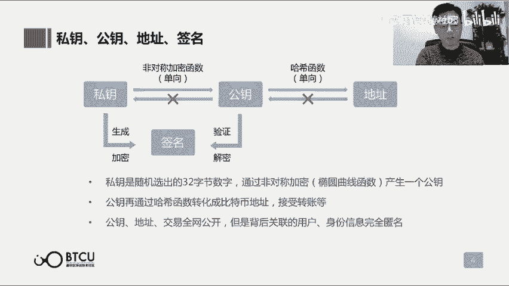
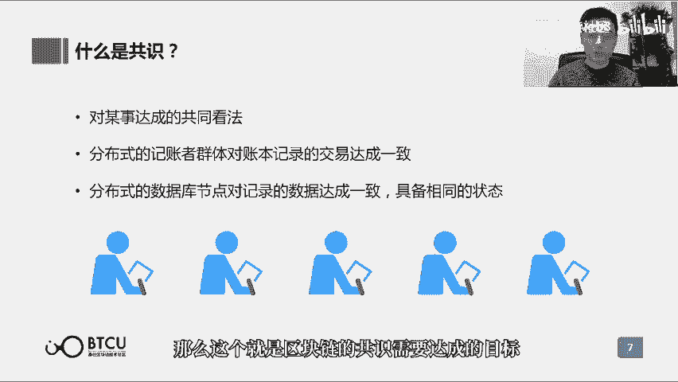
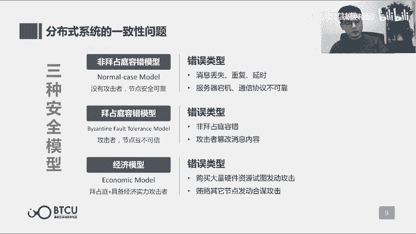
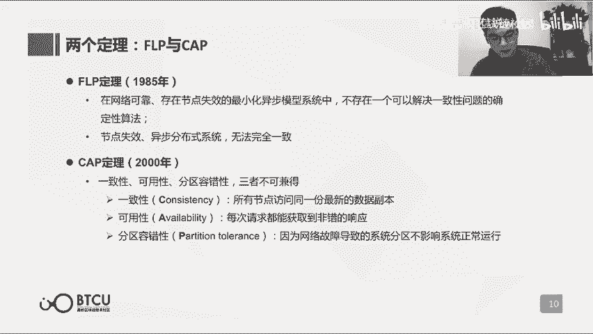
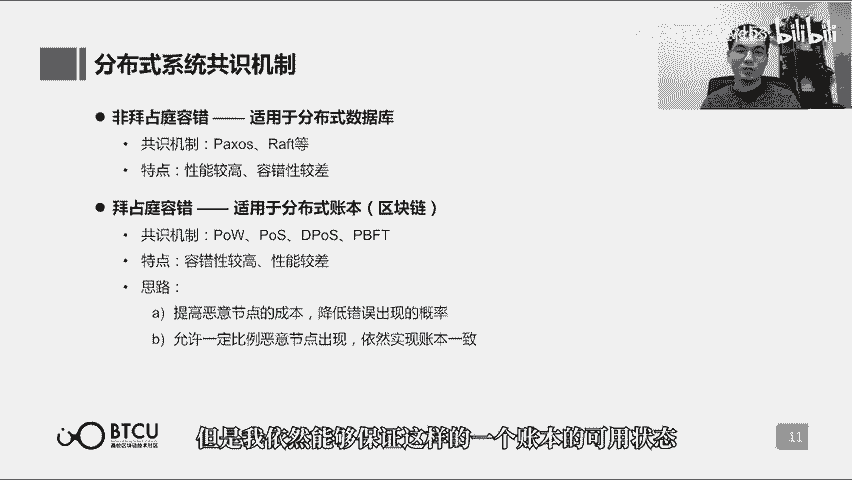
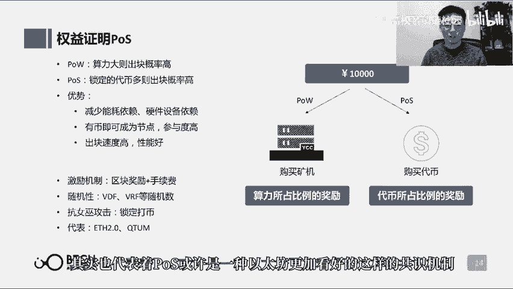
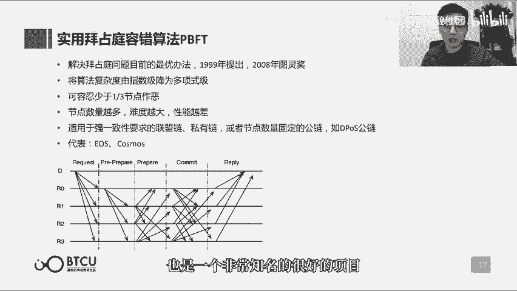
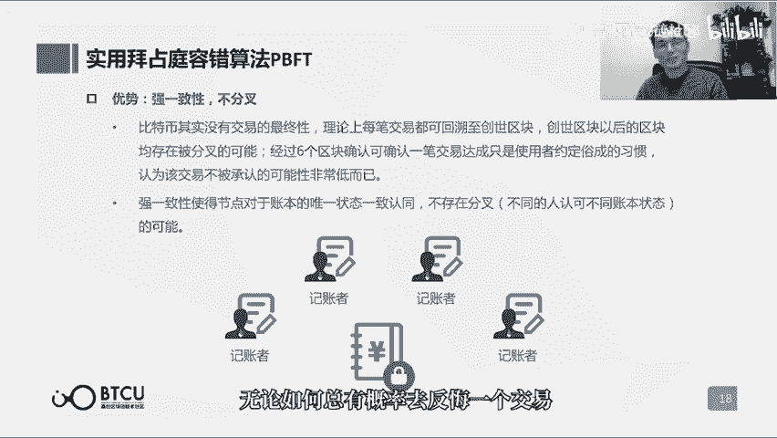
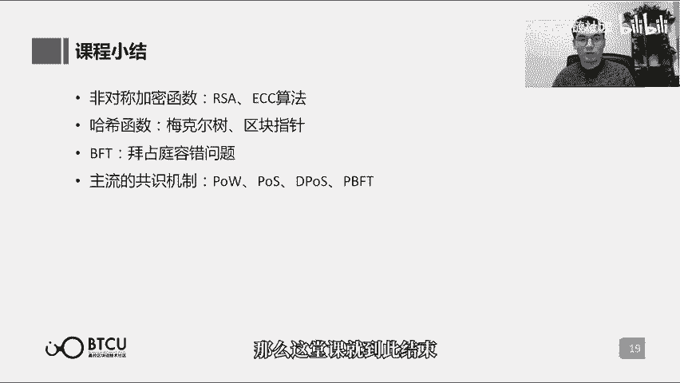

# 【清华大学区块链课】深入浅出讲web3：从比特币到区块链（全14讲） - P3：3-03讲：区块链的骨骼与灵魂 - web3深度学习 - BV1mL411a7jo

hello，朋友们啊，欢迎大家回到咱们的区块链通识课，那么我是这节课的讲师啊，鲁迪，那么这节课的标题呢还是很有意思的啊，叫区块链的骨骼与灵魂啊，听上去呢就非常的重要啊，这个呢其实是一个很形象的比喻。

那么区块链的骨骼呢其实讲到的是加密的算法，那么加密算法呢在区块链中啊，无论是他的账户体系啊，或者是说交易中的签名，那么交易的验证，那么以及啊区块如何连接成链啊等等，都会用到加密的算法。

所以说确实是区块链中啊，不可或缺的一个重要的组成部分，那么区块链的灵魂呢谈到的是共识机制，那么解决的问题就是区块链这样的一个啊，多人共同记账的这么一个分布式的账本啊，到底怎么来维持一个统一的账本啊。

这就是共识机制在这其中起到关键性的作用，所以说区块链的骨骼和灵魂呢也切，也确实是啊非常恰当的比喻，那么这节课呢我们就来深入的了解一下啊。

这个骨骼和灵魂，那么首先讲骨骼哈。

讲加密的算法，那么区块链中用到的加密算法呢，主要分为两类啊，第一类呢叫非对称加密算法，这样的一个非对称加密算法呢，它的名字主要是相对于对称加密算法，那么什么是对称，加密算法的意思就是说加密和解密啊。

用的都是同一套密钥啊，其实就好像我们之前可能看到一些谍战片里面，所用到的密码，那么你只要把密码表给拿到了，那么你收到听收听到啊，密报你就可以正常的去进行破译，而破译成原文。

而原文加密成密报呢也用的是那一套密码表，那么这个呢就是类似于对称的加密，那么非对称的加密又叫做公开的加密算法，意思就是说非对称加密会生成一对啊两把密钥，那么就不像对称加密算法，我只有一把密钥。

那我那么我们就只能把这个密钥给藏好啊，必须要把自己的密码表给藏好，那么如果是非对称加密算法，产生了两把密钥，其中有一把呢就可以用来公开啊，所以它又叫公开加密算法，其中有一把密钥可以公开，另外一把私有。

那么公开和私有这两套密钥呢，就可以分别用来加密和解密，那么这个呢用于区块链的体系中呢，就可以很适合啊构成区块链的账户体系啊，一个呢充当账户，一个充当密码，那么非对称加密算法呢比较知名的啊。

有rsa算法和ecc算法，那么ecc算法呢也是我们比较熟知的啊，椭圆曲线加密算法啊，在上一节课中呢也提到了，这是我个人也觉得非常有意思的这么一个例子，大家可以课下的自己寻找一些资料来学习一下。

那么ecc的算法也是比特币和其他的区块链中，常用的算法，那么它相比r s a算法呢就有一个很大的进步，那么这里也提到了，破解ecc密钥，需要的能量，是远大于破解r c密钥所需要的能量。

那么一定程度上呢也显示出来了它的安全性呃，那么另一个呢这个常用的加密算法呢，是这个哈希函数，那么哈希函数本质上呢它是一种映射的关系啊，它能把一个任意长度的消息啊，或者说信息啊。

压缩成固定长度的一个二进制的串，那么这就是哈希函数，它有一个很好的这么一个作用或者特性呢，就是它可以相当于实现任意呃，无论多小或者多大的这么一个信息，生成一个和他唯一对应的一个数字id。

这个其实就相当于数字里面，概念中的指纹一样啊，对于任何一个数字信息，可以给它生成一个唯一的数字的指纹，这个一个特点呢也经常的被用到，区块链的存证啊等等这样的应用之中，其实用到的是哈希函数。

那么在比特币这样的区块链中，哈希函数呢主要在梅克尔树区块指针，以及比特币挖矿啊，这三个方面呢啊发挥它重要的作用，那么哈希函数常见的几种函数呢，包括s h a家族的s h a杠一啊。

s h a256 啊等等，那么s h a256 呢，其实就是比特币它所用到的哈希函数，那么s h a杠一呢其实是已经被攻破了啊，包括下面所提到的md 4，md 5，这是更加呃更早被攻破的哈希函数算法。

那么攻破者呢都是清华大学的王小云教授。

那么接下来来讲一讲啊，在这个刚刚提到的几项加密算法，在区块链中的具体的应用，那么首先呢就会讲到这个非对称的加密算法，刚刚其实也提到了一些啊，它会生成一对啊，两个民谣，一个是公开的，一个是私有的。

那么同私有的这把私钥呢，可以通过这个非对称加密函数，导出一个公开的密钥，就是公钥，那么私钥可以推出公钥，但是公钥反向是不能推出私钥，所以说公钥可以用于公开啊，私钥可以很好的验证。

这个私药确实能够导出供养，它们存在一个映射关系呃，私钥和公钥，除了起到账户和密码的这样一个作用的啊，之外呢，另外在我们在发送交易的时候啊，或者在其他的验证自己信息的时候。

我们都是需要啊给自己做一个签名啊，这个签名呢得证实这个签名是私钥的持有者，他才可能发得出来的签名，但同时又不能向外界泄露自己的私钥，那么这里呢其实是再用私钥来对一个信息，进行一个加密的过程。

那么其实是用私钥将某段信息加密啊，生成了自己的数字签名，而这个数字签名的一个特性呢，就是它可以用公钥来非常简单的进行一个解密，其实也就是来进行一个验证的过程，所以我作为一个私钥的持有者呢。

我可以非常简单的啊，生成一个我属于我自己的数字签名，而因为我的公钥是公开给全网的，那么其他人可以很简单的通过这个公钥，来验证啊，这个数字签名确实是我来发出的，那么所以在公钥私钥除了充当账户和密码啊。

这样的一个作用之外呢，还可以用来做数字签名，那么这里提到的呢是非对称加密函数，它所起到的一个作用，那么其实在嗯以比特币为首的这么一个，区块链的账户体系中呢，除了私钥和公钥，一般公钥是一个很长的数字。

我们一般不会直接用公钥来进行转账，我们一般去做转账和交易的时候，是会打给对方的一个地址，我们称之为地址的这么一个东西，那么这个东西呢是由公钥来进行，做了一个哈希函数来生成得到的地址。

那么公钥和地址呢其实都是向全网公开的，只不过地址我们一般在交易的过程中，更常用一些，那么所以在这个部分呢，我们同样也是会用到哈希函数的。

那么用到哈希函数的还有很还有更多的地方，那么哈希函数呢，刚刚谈到了他很大的一个特点呢，就是相当于生成一段数字信息的，它的唯一的数字id，那么这个特性呢就被用在了啊每一个区块当中。

那么在上节课我们提到了一个区块的组成，比较大的一个部分呢，就是这个矿工在这一段时间，它所记录的所有的交易，那么为了呃生成这个区块它唯一的一个头哈希，这也是我们在上节课里面提到的概念头。

哈希就相当于意味着这个区块的一个唯一的id，这个唯一的id怎么来一步一步的，包含我们所记录的所有的交易呢，那么它是通过一个叫梅克尔树啊，这样的一个结构啊，来把所有的交易和最后的头哈希来串在一起的。

它具体的结构是怎样的呢，我们记录的交易一到交易八啊，以这八笔交易为例，那么我们两两先每一个交易生成一个哈希，然后两两再生成一个哈希，然后每两个啊这么二接过的一个哈希呢，再去生成哈希，那么最后呢。

我们会在这个树的树顶得到一个唯一的哈希值，那么这个哈希值，通过这样的一个二分差的结构呢，其实是可以导到任何一笔交易的，那么我们去验证某一笔交易，是否发生在这样的一个区块中的时候呢。

我们就不用去核查这个区块的所有的交易了，我们其实通过这个交易，它所产生的哈希，可以很简单的验证，它是否在这个区块的图哈希中，所以它可以起到一个快速的归纳和校验，区块数据的存在性和完整性。

的这么一个重要的功能，也因此而生成了这整个区块的一个唯一验证的，头哈系的id，而上节课的时候，我们也提到了所谓的区块，连成链的这么一个过程，其实就是啊一个区块的腹哈希，和他上一个区块的头哈希。

来进行一个验证的这么一个功能，这个呢其实就是我们所谈到的区块，指针的这么一个概念，所以是头哈希和富哈希的相等，来使得区块在数字意义上连成了链，那么哈希函数，除了这一页ppt所提到的每克数和这个区块指针。

这样的功能之外，其实我们在上节课也提到了比特币的挖矿，也就是在玩那个哈希的谜题，其实就用到的是哈希函数啊，用到的是哈希函数的，输入值和输出值之间，难以有一个可以揣测的关系啊。

所以只能去不停的试来尝试这个数，来得到一个符合要求的输出值，那么在比特币挖矿以及其他的p o w，共识类的挖矿呢，其实都用到的是哈希函数这么一个密码算法，那么也在这一页呢做一个补充。

好那下一个部分呢就来聊一聊，其实我觉得会更有意思的一个部分。

共识机制啊，也被叫这个区块链的灵魂，什么是共识呢，其实就是对某事达成一个共同的看法，那么在区块链这样的一个特定的讨论场景下，的共识就是全网这么多的共同的记账者，他们这个记账者群体能否对一个统一的同。

有一个统一的一致的结果，那么这个呢就是区块链的共识需要达成的目标。

那么一那么谈到这样的一个区块链的共识问题，就一定不得不谈，分布式系统中一个很重要也很知名的问题啊，叫拜占庭将军问题，拜占庭将军问题是怎样的一个问题呢，那么说到这样的一个啊，在拜占庭时代啊。

这么多有很多个拜占庭的将军啊，他们分别率领了一支军队，要共同的攻打一座城市，每个将军所率领的军队就只有两种选择，一种呢是进攻啊，一种呢是撤离，但是呢这么多个将军围困一座城市，这个城市易守难攻。

所有的将军必须保持步调一致，要不然我们就共同进攻，才有可能攻得下去这一座城市，要不然我们就共同撤退，那这样的话呢我们的损失是最小的，但是就最想避免的情况呢，就是部分将军得到消息是进攻。

但是部分将军他们又撤退了，那这样的情况下呢，我们的损失是最大的好，那么现在所有的将军，就希望通过彼此之间的协商，来达成一致的意见啊，我们就投票啊，我们要么投，我们要进攻，要么投票，我们要撤退。

那么最终少数服从多数，最终得到一个统一结果后，大家都要服从，但是这些将这些将军啊彼此离得很远，那么我们只能通过信使来互相联系，那么决策的过程呢，就是将军把自己投票是进攻还是撤退的信息。

通过信使来通知其他的所有将军，然后每个将军再通过我收到的信息啊，到底是多数是进攻还是多数是撤退，来决定自己的行为啊，我收到的信息是多数人表示进攻，那我就要进攻好，这个呢就是这个问题的这么一个背景。

那么这个问题它难在哪呢，有很多很现实的难题哈，第一呢送信的信使他送信可能很慢啊，这还不是最坏的，最坏的情况是，信使在送信的半途中就可能被截杀，信使被截杀还不是最坏的情况，最坏的情况是将军还有可能死了。

那么将军死了也不是最坏的，那么死了就是发不出消息嘛，但是还有更坏的将军啊，他们可能叛变，他们可能发送一些假的消息，他们甚至可能伪造其他人的信件，那么还有一种更加坏的情况呢。

就是说将军还有可能策反其他的将军诶，我决定来作恶，你要不要也跟我一起，我们不干了，那么为什么我们在讨论分布式系统的共识问题，的时候，要讨论这么古老的这么一个打仗的问题呢。

因为这些刚刚我们所讨论的很现实的问题，其实就很像我们在一个分布式系统中，各个服务器啊互相响应的这么一个情况，并且我们刚刚所提到的难题呢，在真实的分布式系统中都是很容易发生的啊，比如说信使送信太慢的问题。

其实就是我们发消息，你是不知道这个消息发送的快与慢啊，他到达的啊及时或者说有延时，那么信使还有可能被截杀，意思就是说我发出去的消息，在网络中是可能就直接丢失的，将军阵亡，就是说分布式系统中的某些服务器。

它可能就宕机了，而至于叛变发送假消息等等，这个呢就是分布式系统中啊，可能会出现恶意的攻击者啊，甚至贿赂节点发动合谋攻击等，这些呢在区块链中就更加的常见了，所以现在区块链他想解决我们如此多的记账者。

来共同维护一个统一的账本，其实就好像分布式系统中，或者说就好像这么多个拜占庭将军，他们想要达成一个统一的进攻或撤退的，这么一个结果，会面对这么多啊，非常现实而非常难以解决的问题，所以这个拜占庭将军问题。

就是分布式系统的共识问题中，非常著名的一个问题，那么我们总结一下，刚刚我们在讨论拜占庭将军问题中，我们可能遇到的这么多问题啊，那么其中呢我们根据这些问题的难易啊，或者是说我们在现实中面对的不同的场景。

我们分成了三种不同的安全模型，第一个呢叫非战，非拜占庭中错模型，那么它的错误类型呢就只包括消失，消息的丢失，重复或者延时，以及服务器的宕机和通信协议的不好，那么在这样的模型中呢，是没有攻击者的。

我们认为每个节点都是安全可靠的，这样的一个模型，比较多的用在互联网的通信传输模型，或者是说分布式服务器的这么一个模型之中，相对来说呢是比较的简单的一种模型，那么第二种呢是拜占庭容错模型。

那么它在包括了所有的非拜占庭中，错模型的错误类型之外，还会包括攻击者，他会篡改自己的消息内容的问题，也就是说这样的一个分布式系统中，是存在着攻击者的，那么在他之上呢，还会再包括一个。

把经济这样的影响因素也考虑在内，那么还可能包括了错误类型的，就包括有某些节点，他会购买大量的资源来发动攻击，或者他会贿赂其他的节点，来发动一个合谋的攻击，那么在区块链这样的系统之中呢。

其实我们就要考虑到最高级的，甚至包括到经济模型这个层面的啊，分布式系统的一致性问题，这样的一种最高级的安全模型问题，那么面对这样的错误类型，我们到底应该如何去解决呢。

那么在讨论解决方案之前，我们先来看一看一些定理啊，所谓的定理呢是已经被证明过的，确实就是这个样子的啊，我们任何情况下都无法去改变的，这个叫定理，那么有两个定理和分布式系统的这个一致性。

问题都是有关系的啊，一个叫f l p定理啊，在1985年就提出来了，另外一个叫cap定理，在2000年的时候也提出来了，什么叫f l p定理呢，那么这个定理其实就说明，在一个异步的分布式系统中。

如果有节点会失效，那么其实无论你用任何的办法，都不能完全的保证，所有的节点依然有一个一致的结果，所以也就不存在一个可以解决，他们完全一致性问题的，这么一个确定性的算法啊，这是在1985年就已经证明。

给我们看了的东西，那么2000年的时候提出了cap定理，他又告诉我们说，在一个分布式系统中啊，一致性可用性和分区容错性，这三点呢是不可能同时满足的，那么什么是一致性的，一致性。

就是说在一个分布式系统中有如此多的节点，那么我们去访问任何一个节点，我们得到的都会是一个相同的结果啊，这叫一致性，可用性是指无论在什么样的情况下，我们去访问这样的一个分布式的系统。

都能给我们一个不是错误的响应，第三点啊，分区容错性，在一个分布式系统中，由于这样的一些网络的故障，是可能导致这个系统会分区的啊，什么叫分区呢，就是说一个区的节点发消息，给另一个区的节点啊。

是不可能发消息过去的啊，然后就会产生这个网络的分区，分区容错性，就是说即便发生这样的分区，也不会影响这样的一个分布式系统的正常运行，那么这三点呢都是很重要的三点，但是cp定理也告诉我们。

这三点是不可能同时满足啊，必然有一点会达不到，或者说是一种弱达到的状态。

那么既然已经有这样的定理告诉我们，其实是在一个异步分布式系统，其实就是区块链所处的这么一个系统的类型，是不可能达成一个强抑制性的，那么我们怎么来解决这个问题呢，其实无论是区块链的这么一个共识机制。

还是说说啊，比较广范围的一个分布式系统的共识机制呢，都存在一定的前提假设，比如说大家可能比较熟知的啊比特币系统啊，他会说呃我无法抵抗，或者说难以抵抗51%的攻击，那么我可以做到的是。

假定这样的一个网络中，有50%以上的这样的节点，都是一个城市的节点，那么这是他可能做出的假设之一，那么其他现在的，我们的分布式系统的共识机制呢，其实都啊做出了或多或少的假设。

来满足自己在一个比较常用的场景下，能够有一个比较好的性能，那么分布式系统的共识机制呢，基于不同的安全模型啊，也有不同的类型的共识机制，比如说非拜占庭容错的机制，就现在其实或者说在区块链出现之前。

就已经很广广泛的适用在了分布式数据库中啊，包括pixels啊，raft等等，这样的共识机制已经是非常实用的，也用的非常多了啊，它们的性能呢啊非常高，容错性能比较差，但是在互联网的分布式数据库。

这样的一个场景下呢，呃不会发生太高的错误，那么拜占庭容错这样的一个安全模型呢，就适用于以区块链为代表的，分布式账本的这样的一个场景啊，因为它可能发生的各种各样的攻击呢，会更加的高级一些。

那么适用于这样的模型的共识机制呢，啊，这节课接下来就会为大家介绍到的，p o w机制啊，p o s机制啊，d p o s机制以及p b f t机制，那么它们的特点呢，就是他们容错性会比较高一些。

但是随之而来呢性能也就会比较差，这个和cap定理呢也是相似的，那么他们的思路呢就是一方面我要提高啊，恶意节点的成本，降低他们做个成功的概率啊，另一方面呢，我也允许在整个网络中。

是有一定比例的恶意节点出现，但是它依然不会过多的影响我整个，区块链账本的性能，那么这个和fl p定理呢也是相似的啊，就是我无法保证全网所有节点都完全一致。

但是我依然能够保证这样的一个，账本的可用状态，那我们来聊一聊啊，以比特币为代表的这样的区块链的项目啊，他们是采用怎样的共识机制，或者说他们是怎么来解决啊，刚刚我们所聊到的拜占庭将军的问题啊。

拜占庭的将军问题说的是，这些将军之间呢必须要通过沟通唉，告诉自己是一个怎样的投票结果，最终他们之间的达成一致啊，比特币呢就说你们不要这么搞啊，这么搞的话呢，作恶者困在里面呢就很容易作恶。

然后发送假消息来使得这个共识呢很难达成，比特币怎么玩呢，他就说我在每一轮达成共识的时候呢，我就随机选一个人，我随机选中了它，那大家就都听他的，这个在比特币里面具体是怎么体现的呢。

就是说呃大家都在玩那个哈希游戏解谜嘛，大家都是随机的去猜，有一个人呢随机的猜中了，那他们就把这个区块上传上传上去，那么这样一个随机选人的模式，它怎么解决这个问题呢，啊假使现在有十个记账者啊。

或者说十个将军里有两个呢，是心怀鬼胎的作恶者，那么这一轮共识中，我们选中了这两个人的概率呢就是20%，所以说这一轮有20%的概率啊，作恶者会去作恶，那么我们知道啊，比特币的系统中啊。

或者说区块链的系统中，它都是一个连续的账本，那么你在这一个区块里做了恶呢，啊大家一般都会习惯性的再等几个区块啊，来看你这个作恶啊，啊来看我这笔交易是否真的达成了，所以说呢作恶必须要连续的多个区块作恶。

才能使得你的做个有意义，而连续作恶你都能成功的概率呢，就是刚刚那个20%的概率去连城，那这样连城下来成功的概率就很小了，所以说一个作恶者如果想要有意义的作恶啊，成功的作恶，他必须连续作恶成功。

而这个呢就极大地提高了它的成本，它必须要在这整个群体中占有一个极大的比例，才会使得他连续作的成果，所以这个呢就可以很好地防止，部分心怀鬼胎的记账者呢去作恶，但是这个玩法能够成功的前提呢，是这个随机选人。

他是一个真的随机啊，意味着你的随机选人是不可以被预测，也不可以被操控的，因为假使我可以预测，你随机下一轮会选到哪一个人，我作为一个作恶者呢，我就会提前的去贿赂他啊，提前的说服他来一起来完成一个合谋作恶。

如果我可以去操控或者影响的话呢，那就更简单了，我只要影响你选中作恶者阵营的概率呢，变得更大就可以了，所以说随机选人这样的一个玩法成功的前提是，它的随机是一个真随机，那么在比特币的系统中呢。

他们是通过啊玩儿哈希函数这样一个，谜题友好的游戏来达成这样的一个随机性的，那么随机选择这个玩法啊，还需要去抵抗一个问题，就是假使我作为一个作恶者，我能不能低成本的复制大量的小号啊。

他们呢也都参与这个共识的过程，但是他们的都是我的人啊，这个就好比比如说我是一个将军，我是这个想要作恶的将军，我就把自己阵营的叫来五个小兵，然后这五个小小兵化装成将军，加入十个将军，所以现在呢15个将军。

有六个都是想要作恶的人，那我这个概率就比原来1/10要大多了，那么这个问题呢在学术上呢叫做女巫功绩啊，就好比一个女巫她可以复制特别多分身一样呃，而而一个能够运作正常的共识机制呢。

就需要具备这种抗体物攻击的特性啊，比如说啊其实大啊，其实大家的思路呢都是去增加作恶者，他创建这个账号，或者说加入共识的这个账号，必须是要有门槛的啊，就好比这个现在我们互联网的产品上，我们要去。

比如说发短信的时候，我们都要先进行一个人机验证啊，这个其实呢就是在增加一种门槛，那么比特币的系统呢，就是说啊要么呢你就提供大量的工作量啊，或者计算力，就像比特币它所用的这个呢叫做工作量证明。

另外呢就是要么你就提供大量的资源啊，比如说我是这个呃，我要锁定大量的币啊，才能参与公式，那么这个呢就是另一种权益证明，所以说本质上呢通过增加这样的门槛来抵抗啊，刷小号的这样一种行为。

那么满足这两点之后呢，才能使得随机损人的这样的一个玩法，能够行得通，那么在此基础之上呢，再加入一种激励的机制啊，我给予那些不想作恶，就想诚实，老老实实记账的人呢，我给他们激励。

那么对于那些想要作恶的人呢，我甚至会加入一种反击力啊，就是你作恶概率成功的概率就很小，但是你一旦作恶之后呢，我还要给你惩罚，那么就能极大的去压制这样一些作恶者的动机，那么这三点呢基本上就是啊。

现在所区块链所采取的共识机制。

他们所共有的这三点，那我们一个个聊啊，先聊这个比特币系统，它所采取的这样的一个工作量证明，工作量证明呢又叫p o w，那也就是英文proof of work的缩写啊，呃其实这个已经聊了很多了。

大家也都有一个基本的了解，就在玩这个哈希函数嘛，找到一个数啊，找这个数的过程呢很困难，但是你找到之后呢，验证你找到的这个是否是正确答案呢，又很容易啊，就像这个图一样，这个魔方一样。

然后我们来看这个p o w的机制呢，它的这个是否满足我们刚刚所说到的，三个共性的特点啊，首先随机性是怎么满足的呢，就是通过哈希函数，是哈希哈希函数的这样一个谜题，友好的特性，抗女巫攻击呢。

就是你要想完成这样的一个随机的过程，你必须要付出大量的工作啊，这就是工作量证明这个名字的由来啊，你必须要去消耗大量的算力啊，去计算这个问题，而关于这样的一个计算呢，啊也是呃最早的时候呢是比特币啊。

系统刚刚出来的时候，大家用的是cpu啊，用个人电脑就可以去计算这个问题，那么到后来呢，由于啊参与的玩家呢越来越多，每一个玩家呢都想扩大自己的算力，来使得自己被选中的概率呢能够提升。

所以说大家去用来计算游戏的，这样的一个硬件呢也是越来越高端啊，逐步的升级，首先用gpu逐渐的就替代了之前大家所用的cpu，然后后来呢又纷纷发明了a s i c的矿机啊。

也就是这个这个芯片呢是专门的用来设计，去玩这个哈希游戏，去计算这个哈希问题啊，它的效率是最高的这样一种专用矿机，那么这种矿机的出现呢，就使得现在想要去挖矿比特币这样的一个事情。

是你拿家用电脑是几乎分不到任何一杯羹的，这么一个游戏了，那么随着大家的硬件设施呢啊逐渐的升级啊，然后参与的矿工呢也是越来越多，那么比特币的全网算力呢，也是有了一个极大的增幅啊，大家可以看到。

现在这个全网算力基本上已经达到了，60e h每秒的这么一个状态，也就是说所有比特币的矿工加起来，他们每秒完成了多少次计算呢，完成了60x18次方计算啊，60x18次方哈，希计算每秒钟都在完成这么多次。

那么这样呢啊在另一方面呢，也就消耗了大量的电力，那么这个呢也是啊以比特币为代表的，采用p o w这样的一个机制的区块链系统的啊，可能会被人所诟病的一点，那么也就是说它很消耗能源。

那么采用p o w机制的区块链项目呢，除了比特币呢啊还有莱特币啊，之后也可以也会和大家介绍到，那么还有呢就是以太坊啊，从它诞生到现在呢，都是采用了p o w的这样的一个机制啊。

可以说这是啊区块链项目在很早期的时候，大家基本上都只会采用p o w机制，那么在p o w机制出现之后呢，啊出现了第二种这个共识机制呢，就叫p o s机制，基本上是p o w机制。

在另一个程度上的一个改版啊，p o s机制呢中文名叫权益证明机制啊，p o s呢就是权益证明的英文，approof of stake这样的一个缩写，那么p o s呢，简单来说就是用我们锁定的代币的数量。

来代替算力，来作为我们的一种挖矿的权重啊，我锁定的代币越多，就好像在比特币系统中，我所投入的算力越多，然后我锁定的代币越多呢，我对应能够挖到矿的这样的一个概率就越大，那么本质上来说呢。

在这么一个随机选人的问题中，我们同时要满足两个特点，一个是随机性啊，一个是抗女巫攻击的特性，那么p o s呢这个s其实基本上解决了问题呢，是抗女巫攻击啊，也就是说我不能随意的去复制特别多的小号。

来增大我的概率，那么在p o w共识的里面呢，就是说呃我的反正算力是有成本的，那么我一个组织所能投入的算力呢是一定的，那么在这种情况下，我复制再多的小号也没用啊，我复制的小号越多。

那么我每个小号所能分担的算力呢就少，因为算力呢总量还是就那么一定的，它是有成本的，那么p o s呢就是说我反正b就这么多，那我复制再多的小号也没用，因为最终看的还是我锁的币有多少，那么这个呢。

其实就是通过代币数量来去抗女巫攻击，那么随机性这个问题怎么解决呢，他也他就不能去像p o w机制一样，去玩那个哈希函数了，因为玩哈希函数是工作量证明的那一套机制，那么p o s机制去解决这样的一个。

随机性的问题呢，就是用啊一些随机数生成的函数啊，比如说v d f或者v r f啊，这样的函数去生成随机数，那么其实呢现在能够做到真随机数的生成，其实是不可能做到的，因为所有的所谓的真随机数。

都是自然界中发生的啊，真随机我们无法通过人工去模拟，所以v df和v r f呢也并不是真随机，但是他是在学术上能够证明他很难以去预测，也很难以去操控的这么一种机制啊。

啊所谓vr f呢就是可验证的随机函数，那么通过这样的一种随机数的生成函数呢，啊就不必再采用p o w那样去玩哈，希函数来产生随机性了，它就可以直接通过数学的方法来产生一个，不可预测不可操控的随机性的啊。

随机数，那么来达到随机选人的目的，那么激励机制呢和比特币也是一样的啊，就是区块的奖励啊，和这个区块中发生交易的手续费啊，给到这个记账者，那么采用pos机制的代表也有一些啊，也有一些区块链的项目。

他们p o s机制呢其实在2012年被人提出，然后2013年2014年就已经有实践者了，那么到现在来看的，其实采用p o s机制的项目呢也是越来越多啊，因为他不必再向啊，比特币那样去消耗大量的电力。

它是一种比较能源友好的这么一个机制啊，同时呢他的这样的一个计算呢，也是更加的轻量级的，所以采用p o s机制的项目呢，往往性能会比p o w的机制的项目呢，在效果表现上会那么好一些。

比较知名的代表呢有国内的一个公链量子链，那么还有现在世界第二大的区块链项目以太坊，这也是之后的课程会详细介绍到的，以太坊呢啊，现在到目前为止，还采用的是pow工作量证明机制。

但是他预计在今年2020年就会转成pos啊，转成权益证明机制，那么这样一种转变呢，啊，其实也代表着p o s，或许是一种以太坊能加看好的这样的共识机制。

那么在pos共识机制出现之后，又出现了它的算是一个变种啊，叫d p o s共识机制，那么b这个字母呢其实就是delegated的缩写，那么也就是中文的授权，所以d p o s它的中文呢叫授权。

权益证明机制啊，英文呢就是delegated proof of stake，那么什么是d pos共识机制呢，它的意思呢，就是说我不再是说我锁定一定的代币，然后我自己去成为记账者。

然后以锁定代币的数量来决定自己挖矿，挖到的概率，而是说任何人都可以锁定代币，我锁定代币，我现在可以不选择自己做一个节点，我可以去投票给那些愿意做节点的人啊，投票给我信任的，愿意做节点的人。

我觉得他是一个诚实的人啊，来好好的完成他的工作啊，也就是记账啊出块，所以这样一个制度呢其实就很像啊，或者议会制度等等啊，很像政治上的制度，那么它的优势就是啊，首先第一点啊，专业的人呢来做专业的事情啊。

就是真正的愿意去24小时去啊记录交易，去记账，去出号的人呢，他们就来做这个事情啊，很多其他的人呢，他不愿不用去考虑这样的一些问题，也不用去负担，这样的一个24小时都要去工作的，这样一份啊职责。

他需要做的事情呢就是我锁定我的代币，然后选出我认为专业的节点就可以了，而另一个优势很大的好处呢，就是呃像比特币也好，以太坊也好，它是一个完全开放的，就是所有人都可以加入来做记账者。

也因此记账者会特别特别多，那么在这么多，可能数千上万个记账折中达成共识呢，是一件很困难的事情，但是d p o s呢，它们一般有一个节点的门槛要求啊，就是说我投得票啊，得到这个投票的节点。

得票量排名前多少的节点啊，才能够参与这样的一个共识的过程，才能够去出块，所以说这个账本的共识一下，从成千上万个节点之间达成共识，一下就变成了，只要在几十个啊或者几个之内都是有可能的啊。

这么一些节点之内达成共识，那这样达成共识的速度就会快得多，当然这样的一个性能的提升，是在牺牲了去中心化程度的前提下达成的，所以说另一方面它的去中心化程度非常的低啊，这是啊会受到其他人所啊非常诟病的一点。

那么采用d p o s的代表呢啊就有u s，这个是目前最出名的一个啊，也是采用d p o s机制中啊市值最高的一个，那么它呢是总共设置了21个，超级节点的门槛，就相当于他的议会呢只有21个议员的席位。

然后需要其他持有eos的人呢，然后再去给其他的节点投票来选出这21位，那么谈到pos共识呢，也就不得不谈一下pos共识，下面的一种新型的挖矿模式啊，叫speaking，因为pow的挖矿。

大家可能都或多或少的知道一些就是买矿机啊，耗电去挖矿，那么pos共识呢刚刚也提到了锁闭，来参加这样的一个共识记账的过程，那么作为持币者呢，就能够很方便的把自己的币进行锁定。

然后因为现在用委托delegated的，这样的一个机制的p s项目呢也是越来越多，那么持币者锁定好b之后呢，不需要自己去建立节点，投票给自己所信任的节点啊，就能参与到挖矿的过程，并且获得挖矿的收益。

那么随着采用p o s共识的项目越来越多了，staking在未来也必将啊，能够得到一个更好的发展，并且由于它更加的轻量化，那么它的参与门槛更低，也一定可以有更大的一个受众。

那么在这里呢也是做一个简单的介绍，那么在最后呢也给大家介绍一下啊，最后一个非常著名的拜占庭，容错问题的解决方法啊，叫实用拜占庭容错算法叫p b f t，那么这四个字母呢，希望这个顺序大家一定要记对哈。

然后p呢其实就是practical啊，就使用的b呢就是拜占庭f呢是错误啊，t呢是容忍tolerance啊，希望大家这样来把它记住，不要做，不要记错这四个字母的顺序，要不然呢就会闹笑话。

那么这个算法呢是很早其实很早就已经提出来，是拜占庭容错的这个问题的一个解决方法，也是目前为止拜占庭容错问题啊，最好的解决方法，那么他在1999年就提出了，那么到现在可能20年的时间过去。

其实啊依然是最好的方法，那么它将原来解决拜占庭容错问题的算法，复杂度得指数级降成了多项式级，那么可以说它是有别于刚刚我们所介绍的，p o w也好，p o s也好啊，或者d p o s也好，这样的。

其实和比特币他们所采用的这样的一个，共识机制是很不一样的，另外一套共识机制，那么它可以容忍的是少于1/3个节点作恶，并且参与这样的一个网络的节点的数量越多，难度越大，性能也就越差。

因为提到了是多项式级嘛，它其实难度是随着这样的一个节点数量，有一个多项式级的这样的一个增长的，那么它适用的呢是有强一致性要求的啊，关于什么是强一致性呢，在下一页ppt会做一个详细的解释。

它更加适用于联盟链，私有链啊，包括像比如说现在比较知名的联盟链的算法，比较常用的都是用的p b f t算法，或者说啊公有链，如果说节点数量呢是非常固定的，其实也可以用p f t这样的一个算法。

那么就比如说啊，之前我们所介绍的d p s这样的公链啊，比如说u u s啊，它的节点数量呢是非常固定的，21个，那么无论节点的候选人有多少个，最终参与出块呢，只有21个，那么这21个节点之间呢。

就可以采用一个pdf t的算法啊，来加强他们的共识的过程，那么像另一个项目是cosmos啊，也是类似的，那么它所采用的共识机制呢，就是纯粹的有pdf t算法所衍生出来的。

一种叫tendermint这样的一个共识机制，那么之后呢的之后的课上，我们有机会也会介绍到这个项目，也是一个非常知名的啊。

很好的项目，那么p d f t算法的它的一个最大的优势呢，就是一个很强的一致性啊，什么叫很强的一致性呢，p b p b f t算法它的一个核心的理念，其实是说在参与共识的啊，这么多个拜占庭将军之中。

我选出其中一位，他们会把他的决定告诉给其他的所有的呃，其他的将军，那么其他的将军会返回他们，对于这位将军的角色的一个结果反馈，那么只要有超过2/3的将军是诚实的，那么他们就能得到一个一致的结果。

那么这十位将军就能得到一个一致的结果，说我们需要攻打还是要撤退，那么这一步完成之后呢，所有的将军就达成了一个强毅之心，他们对结果有一个很强的一致认同，那么如果回归到区块链的这样的一个场景下呢。

其实就意味着这个区块，从它诞生到区块的这个呃记账者，他会把这个区块告诉给全网所有的节点，全网所有的节点都必须在一定时间内给一个，反馈的结果啊，说这个区块到底是我认为，我认为他记得对还是记得错。

那么假使全网2/3的节点呢都是诚实的，这个时候就能得到一个一致的反馈，那么这个区块如果是对的，这个区块就被记载了区块链上，并且永远不能改，因为当时我们所有的节点都已经达成一致了，它就是对的。

那么这样的一个强一致性，其实呢是，无论你用pow共识机制还是pos共识机制，这样的啊，比特币类的共识机制，其实是无法形成这样的一个强硬制性的啊，举个例子，我们在上一节课里面介绍到了什么叫分叉。

分叉就是因为在比特币的网络中，有一部分节点它可能认同的是这样的一笔交易，另一部分节点它可能认同的是另外的一种交易，或者说他认同的是另外的一种账本的状态，所以任何时候我们都可能发生分叉。

这个分差可能发生在当前的区块高度，也可能发生在之前的区块高度，比如说我现在的区块高度是100，我依然可以在区块高度是80的时候，发起一条分叉链，假设在那个时候发起这个分叉链，它所背后所代表的一种组织。

掌握了全网80%的算力量，那么他就很有可能虽然从百分，虽然从区块高度为80的，这样的一个区块开始分差，但依然最终分叉分叉分叉分叉在啊，最后依然在分叉的这条链上不停的写区块，写区块，最后长度长于了之前啊。

区块高度为100的区块，那这样的时候根据最长链原则，这样分叉出来的一条链，就成为了新的大家所公认的这么一个账本状态，也就是说，理论上在比特币这样的一个区块链系统中，理论上每一笔交易。

都可能回溯到前面的区块高度，甚至回溯到创世区块，就是我们即便从创世区块开始分叉，这个链，写一条重新完全不一样的，比特币的账本都是啊都是有可能的，它的概率你不能说完全为零，只不过说这个概率非常的低。

所以说他是没有这样的一个强一致性的，任何一个区块都是一个不稳定的，那么也就是说没有一个，没有一个确定的终极状态，所以在比特币的系统中，我们会经常提到，经过六个区块的确认，我们来确认一笔交易达成。

但其实这笔交易是否真的达成，它也并不一定，它只是我们在使用比特币的时候，约定俗成的一种习惯，只是说这笔交易之后，再会被反悔的可能性非常的低，但是可能性不是零，这就是强抑制性和不是强抑制性。

的一个很重要的区别，那么强一致性呢会使得节点各个节点，所有节点对于账本的唯一状态的一致认同，所以具备强抑制性，或者说具备了，或者说使用了p b f t算法的区块链呢，它是不会存在分差。

永远的只有同一一个啊，唯一的一个账本状态，这个呢是使用了pdf t算法的区块链系统，有别于比特币，这种没有使用p v f t算法的区块链系统，的很强的一个差别，所以说包括刚刚我们所谈到的两个项目。

eos和cosmos，他们由于采用了p f t算法，那么他们的是具有强力制性的，其实这种强力制性的啊，在法律的层面是非常占优势的，因为法律是比较认啊，比较认这个交易是否已经最终完成。

来辨别某项交易的合法性，但是在比特币系统中，无论如何总有概率去反悔一个交易。

那这个其实在法律上的抗辩性呢，是会比较的差一点，那么总结一下，今天第三课还是非常重要的一课，我们讲到了区块链的骨骼啊，和区块链的灵魂两个非常形象的比喻，那么具体聊到的呢。

是区块链中使用的加密算法和共识机制，那么加密算法呢，主要包括非对称加密函数和哈希函数，这是区块链中所用到的两种呃非常重要的啊，加密算法类型，那么共识机制呢先给大家介绍了啊。

分布式系统或者说区块链中非常著名的问题啊，拜占庭容错共识机制的所要解决的所有问题，可以说在拜占庭容错问题中，都有一个很经典的体现，那么主流的所用到的，解决拜占庭容错问题的共识机制呢。

啊给大家介绍了p o w机制，pos机制，d p o s机制和p b f t机制，那么希望这些机制呢，大家课下呢都能做一个啊很好的总结回顾，也可以找一些课下的资料来帮助自己理解，那么这堂课呢就到此结束。

