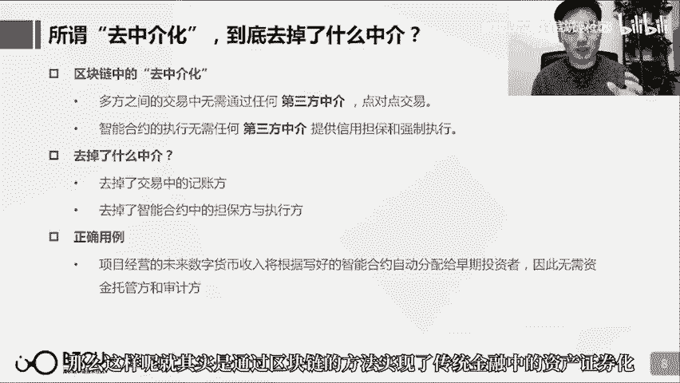

# 【清华大学区块链课】深入浅出讲web3：从比特币到区块链（全14讲） - P4：4-04讲：我可能“误会”了区块链 - web3深度学习 - BV1mL411a7jo

好哈喽大家好，欢迎又回到了区块链通识课的第4课，我是这节课的讲师鲁迪，那么前三课呢，我们已经带领大家从头到尾把区块链的，最核心的部分都完整的梳理了一遍了，那么可以说前三课已经帮助大家把区块链的。

这样的一个从0到1的认知构建，已经构建完毕了，那么这个时候呢我就觉得非常有必要开启这节课，这节课我们讲什么呢，对不起我误会了区块链。

讲的就是我们这个世界或者这个社会上。

有特别特别多人，他们对区块链的种种误解，很有可能上这一课之前你也是这么理解区块链的，那么这些人呢还不是说对区块链完全不了解，他们往往是这个听说了区块链的一些概念。

不知道这个概念具体是什么，但是就这个凭着自己对这些概念的想象乱用。

把区块链吹得更加的莫名其妙神乎其神，反而搞了很多人对区块链的将信将疑，真的有这么神吗。

其实又不是，所以说这可能也是我做这一系列科普课的一个很大的初衷。

就是我真的再受不了那些概念的误用了，那么这一节课呢我们就来好好的看一看，哪些概念最容易被人误用，那么它到底在区块链里面是指的什么，而会被人误用成什么。

而这些误用到底错在哪，那我们就赶紧迫不及待的开始我们这一节课吧。

那么提到区块链大家会想到什么，一般就想到这张图所示的这些词，第一个最容易被想到的就是不可篡改，然后去中介化，然后溯源啊匿名啊安全啊透明啊等等，大家可能听到了特别多了，然而这个中文汉字是非常博大精深的。

有特别多的意义，那么区块链里面所说的不可篡改，和你所理解的不可篡改是不是一个不可篡改，你理解的不可篡改和区块链里的不可篡改，由于不是同一个不可篡改，所以你想用区块链的不可篡改来达到你的不可篡改的目的。

是不可能的，那么咱们就这样来梳理一下这些概念，那么先就从不可篡改讲起，到底什么是区块链中的，总说不可篡改不可篡改，什么是区块链中的不可篡改呢，就是区块链是多方记账者通过一个共识机制，来对账本达成一致。

所以就任何一方记账者，他都是难以去篡改这个账本上记录的交易，已经发生了交易，或者这个账本上所有账户的状态，那么对于中心化数据库来讲的，这个中心化数据库的管理者就很容易篡改，所以说区块链不可篡改呢。

指的是这个不可篡改，并且这个不可篡改呢，其实更加准确的描述呢是难以篡改，因为虽然很难，但是依然有被改的可能性啊，在哪些情况下是可以被改的呢，一方面呢就是说这个多方记账者中，有一方节点他占据的是这个。

记账权的完全的主导啊，比如说他有这个51%的算力啊，他可以发起51%攻击，那这样的时候他就可以根据一方的意愿，来更改这个账本上的交易啊或者状态，另外一种办法呢就是我们之前提到的，通过分叉的方式。

也可以改变这个账本上已经发生的一个既定的交易，或者改变账账户的余额，那么通过这两种方式呢，也都存在可能性啊，即便你用的是区块链，但我依然可以改动，所以在区块链中在什么条件下，什么是不可篡改的呢。

我们梳理一下前提啊，节点需要足够的去中心化，然后这个区块链中呢不存在啊，有绝对的控制力的节点，那么第二呢什么不可篡改呢，是这个区块链中啊记录的资产啊，或者他所发生的交易，那么还有的就是说。

我们经常说要把什么什么写在区块链上，写在区块链上之后就不可篡改了，那这个写的动作啊是怎么完成的呢，其实因为区块链是一个账本，他记录的只是交易，那么但是我们在银行里面去交易的时候。

也有一个地方可以让我们写备注，啊区块链中也有一个可以写备注的地方，那么通过写memo的形式呢，就可以把我们想写的话，在以太坊中呢还要经过一次转码啊，通过转码来把这个话写在备注里，从而记在区块链上。

所以说如果说我们想要用区块链不可篡改的特性啊，来做一个实际场景中真正有意义的事情的话呢，啊比如说给一个正确的例子啊，比如说我把对你的表白啊，写在了以太坊的这个交易备注里，如果以太坊继续存在啊。

他的这个记账者呢还是这么多，并且记账的节点呢足够的去中心化呢，那么这个表白写下来了就不会被改动了，但是我的爱不一定，所以说写上去的东西和真实发生的事情，也是可能不一样的啊，好那我们来看一看啊。

有什么在我们的生活中，大量把这个不可篡改到处瞎用的地方，听的最多的一句话就是啊，记在区块链上就不能改了，是不是记在区块链上就不能改了呢，首先要看这是一个什么区块链，你要是记在比特币上记在以太坊上。

像我刚才所说的啊写了一句话，那确实不能改了。

那你要是写在自己的自己就写了一条区块链，然后说我把这个话呢写在了这个自己的区块链上。

那你自己的区块链要么他参与的节点很少。

很有可能就是你自己所控制的几个节点，要不然就私有链公有链呢可能节点也很少，那么这样的话呢其实就还是你想改就可以改，虽然他的形式用了区块链，但他和不可篡改没有什么关系。

大家一定要理解不可篡改它的本质的原因是什么，那么第二个呢即便就是说我写在以太坊上了，但是假使这是一个非常重大的事情，可能引起社区的这种共识的分叉的话。

通过分叉这样的一个方式，也是可以去进行更改虽然写在了区块链上。

但是比如说发起了一个区块链交易。

或者写了一句话，也有可能因为另一部分社区呢不认这个交易，他们呢就单独分叉分叉出另一条链。

然后他们写的这条链呢就不认这笔交易，或者不认这个交易所敷衍的这句话都是可能的。

那么在那个账本上呢写上去的东西就依然被擦除了，那么还有的话呢就是说我这个应用啊用了区块链，就很多这个区中信化应用的开发商啊，他们这么说啊用了区块链啊，所以我的这个数据呢也是改不了的。

那么第一呢要看他这个用的是什么链啊，你把这个dapp他搭载在哪个链上，那么道理呢就跟刚刚所讲的一样啊，你要是用的自己的私有链呢啊你想改就能改，那么第二个呢，他的这个应用他的核心的代码是否真的。

以智能合约的形式在链上去运行，如果不是的话他可能只是把一些细枝末节的功能啊，用在了这个区块链上，核心的东西呢他依然想改就能改啊，都记在自己的中心化数据库里，那这个也没用，所以说第三呢就是要看他的代码啊。

是否开源啊，是否真的是把核心代码写在了区块链上，如果是写在区块链上的话，按照理来说他应该开源给所有人，可以确认这件事情，如果不确认的话那这个就是一个黑箱，你也不知道他把代码写在哪里。

那么同时呢你如果确实搭载在区块链上。

同时要提供一个链上可供查询的窗口，到底是你说你写在区块链上，那我就应该通过区块链浏览器，可以看到那些关键的数据啊。

确实是运行在区块链上，只有满足这三点之后，你这样的一个Dapp才能够被人承认，是一个真实的Dapp，好 紧跟不可篡改。

紧随其后的一个概念呢，就也是被人经常提到的信任机器，大家总说区块链是信任机器，那么什么他到底怎么创造信任呢，那么区块链中其实所谓创造信任，更多的可以说是一种去信任化，就是我无需信任。

本来我们之间完成交易，一般都是通过银行，这样的一个可信第三方来实现的，或者支付宝，那么在区块链中是想实现，多方之间的交易无需信任任何第三方，是一种无需信任的状态，那么在区块链中可以信任什么呢。

首先还是有它那个最大的前提，就是这样的一个区块链，它的节点是否足够的去中心化，以至于无人可以篡改，那么在无人可以篡改的前提下呢，那么我们可以信任的是区块链中的，交易账户状态，那么他们是不可篡改的。

那么还有一点可以信任的是呢，区块链上运行的智能合约，是任何人都无法妨碍的，它会去自动的执行，也就是在区块链上运行了一个无法停止，它会自动执行的代码，那么这个呢。

关于智能合约和它的最大的应用，DAO和DEFI呢，我们会在下一节区块链2。0以太坊中，这节课里面给大家讲到。

那么对信任机器的误用呢，也是特别特别多的，第一句话就特别让人无语了，用到区块链你就放心吧，它是创建信任的，这个话听起来就很无语，这个核心逻辑到底是什么，你用了区块链你怎么用的，我怎么就放心了。

咱们还是研究一点，这个剖析一点更加有意义的例子，比如说第二句话，他说你的信息呢，已经记在区块链上。

就不会有错的，首先咱们还是先假定啊，他的这个区块链是咱们的前提，假定这个区块链确实是足够可信的，他记完之后这个数据啊，确实不会被改动了，但是他在计数的这个过程中，可能就已经出错了啊，比如说这个啊。

比如说一个审计系统啊，他说我用了区块链啊，所以呢就不会有错，那这个呢就是有问题的，因为这个审计系统它其实是把。

会计信息里面的一些数据，登记在区块链上，那么你登记之后，他确实是无法篡改的，但是你在登记的时候就有可能做假账呀，啊比如说这个其实是200元，你在进区块链的时候只写了100元。

而这个时候登记的时候就做了假账啊，所以不能说是不会有错的，但是区块链在这其中它能起到什么作用呢，就是由于事后无法篡改，所以很方便追责，在这一块确实是有用的，那么第三点就是说，我们写了智能合约啊。

执行就不会有问题，那么还是第一点写在哪个链上了，第二点智能合约的代码会不会有漏洞，那么第三点智能合约判定条件的时候。

这个信息源是否可靠呢，所以说智能合约和区块链。

只能保证这个代码确实是自动执行的，但是依然有很多的点都可能导致它会产生问题。

所以信任机器信任机器，我们一定要知道区块链在这个环节中，它所创造的信任仅限于哪些方面。

而其他还可能产生哪些问题，第三点啊去中介化。

这个也是一个被误用特别多的概念，主要就是因为中介这个词呢。

意义太多了，那么我们来看区块链中。

到底去掉的是什么中介，那么第一呢就是多方之间点对点交易，不需要这个交易的第三方，第二个呢就是智能合约的执行。

咱们也讲了智能合约就是区块链上，自动执行的代码。

那么这个合约的执行呢，它不像传统合约执行。

所需要信用担保或者强制执行，在链上呢是不需要这两个的，所以说在区块链中去掉的中介呢，就只有三种角色，一种是记账方，一种是担保方，一种是这个合约的执行方。

那么咱们在判断区块链在一个去中介的场景下。

是否真的能去掉中介，就看这个场景中的中介是否符合这种角色，咱们所提到的这三种角色中的之一，那么正确的用法呢。

比如说有一个区块链的项目，它这个项目是说这个项目未来经营会获得。

一笔一笔的数字货币的现金流，那么我写一个智能合约，流进这个智能合约的每一笔现金流呢，都将根据智能合约中分配的规则，来分配给之前购买某种数字证券的投资方。

那么这样呢就其实通过区块链的方法，实现了传统金融中的资产证券化。

而传统金融的资产证券化，一定需要资金的托管方和审计方。

但是通过链上的方法呢，可以省掉这两个角色。

也就可以省掉这两个环节的成本，那么这个过程呢是用区块链是成立的，因为它所代替掉的这个去中介呢，是符合刚刚我们所说的三个角色之一的。

那么对于去中介化这个概念呢，在平常我们所听到的话里面呢，就有特别多的误用的地方，比如说啊一个农产品物流项目啊，他说这个用了区块链啊，区块链加物流也是大家经常听到吧，那么说利用区块链去中介化的特点。

能够降低中间环节的成本，首先啊供应链中物流运输的这个中间角色，是无法通过区块链来替代的啊，区块链怎么能够替代运输的中间角色呢，当然区块链和供应链呢，也是有很好的结合点的，但主要利用的是。

应用区块链它能够实现的这样的一种啊，价值穿透啊，点对点的价值直接传输啊，可以替代现阶段对这个账款周期的问题，来提供服务的服务方，这个是可以替代，但是这句话本身说的就很有起义。

那么第二点呢这个就比较综合了啊，我身边也有朋友确实有有过这个想法啊，说区块链加房地产创意啊，这个就柔和了很多信息哈，大家来看一下啊，首先呢想实现的第一点啊，信息上链不可篡改啊，有用到不可篡改。

然后消除信息差啊，然后去中心化啊，取代房屋中介的作用，然后呢还想的特别好啊，只能合约付房款啊，然后账款上链啊，做可信的普惠金融，这个呢确实好像是这个深入思考过这个方向啊，区块链和房地产有什么结合点。

这个我就帮这位朋友来好好的分析一下哈，这个不带任何贬义的来分析一下哈，主要是正确理解这个问题，首先咱们刚刚分析了去中介能够去掉的那三种中介的角色的职责，那么区块链自身的这个所谓的中介呢。

和这个房屋中介关系不大，就是说房屋中介其实起到了很多其他的作用，那么信息上链啊不可篡改这个问题呢，咱们在不可篡改那个话题里面已经聊聊过了啊，他最大的问题是你把信息寄上链之后却是不可篡改。

但是你寄上链的时候就可能造假啊，这个呢是需要解决的一个很大的问题，那么还提到消除信息差啊，这个消除信息差是互联网的主要作用，不是区块链的主要作用，然后说这个智能合约付房款啊，这个想法挺好的。

其实因为上一页咱们提到的这个正确的用例里面，其实就用的是一个智能合约的例子嘛，但是呢比较遗憾的是啊，智能合约只能构建在数字货币上面，那么现在我们付房款没有说用比特币的啊，不用的是人民币。

那么人民币呢无法使用智能合约啊，除非这个央行他的dcp发出来，然后再看一下他用的什么架构，能不能写智能合约啊，这还是个问题啊，所以说法币啊怎样通过一个链上链下的映射，使得他能够用智能合约。

那么这也是一个需要解决的问题，最后呢这个账款商链做可信普惠金融，呃这个想法还是挺好的，但是呢账款商链同样也会存在啊，链后无法确实无法造假，但是你商链的过程就可能造假啊，这也是需要解决的问题。

那么如果想做区块链加房地产创业的呢，我所列的这些问题都是需要解决的，那创业当然是一个要解决问题的过程，只不过呢我个人认为区块链加房地产，现在有些很多基础设施还没有完全的做到啊，所以说这个应用方向呢。

啊可能还需要等待时机，当然前提是一定要正确理解区块链它的概念，不要再有一些异想天开的物诱，那么再讲一讲溯源哈。

区块链加溯源也提到特别多啊，然后区块链中好像就有自带溯源的一些特性。

那么区块链中的溯源指的是什么呢。

啊在utxo这个事情上我们聊到过啊，utxo模型呢它本质上是只记录一个比特币从哪到哪。

啊它只记录交易，它不记录一个账户一个地址下面有多少比特币。

它本质上记录的就是交易啊，所以说在这样的一个模型下呢，我们跟踪每一个比特币啊，都可以跟踪其从哪来到哪去。

然后追溯到它从这个区块被挖出来的时候。

它诞生的那一天啊，它诞生的那个块啊我们都可以追溯过去，那么这个呢听上去就跟溯源有点关系，那么什么其实在区块链上是真正可以溯源的呢，第一个啊比如说这个所有比特币它的交易历史，我们都是可以溯源的。

那么第二个呢在以太坊我们这个下一节要聊到的，那么在以太坊这样的2。0的区块链上，我们也可以创建我们的加密资产，那么创建的加密资产它就和比特币一样，它的所有的历史交易呢，也都是可以追踪的。

那么这里呢提到了一个啊迷恋猫，也是这个区块链上比较火热的一种区块链原生资产，所以说正确的说区块链溯源的例子呢就是。

比如说我买了区块链上的一个原生资产啊，迷恋猫，他呢我从别人那购买了他，那么他在历史上他的历任主人啊。

什么时候卖掉了他什么时候下一任接手，这些呢我在区块链上是都可以查到的。

那么这个呢做区块链溯源没有任何问题。

非常简单，但是一旦想和实体的物流也好呀，供应链也好呀等等，要和实体的这种溯源去产生联系呢，就很难了，比如说咱们也经常听到还是这个农产品物流啊，用了区块链不止有刚刚所提到的这个，区块链去中介化的特点。

也往往提到区块链溯源的特点，这里说的溯源和我们刚刚所说的溯源呢，就没什么关系了，他记录的本质上不是资产的交易，他其实用到的是想要用的是这个，信息不可篡改的特性，还是用的不可篡改。

他指的是这个农产品从产地到这个物流运输的各个环节，或者供应链的各个环节中，然后以及最后啊给到消费者，这整个环节各个环节中的信息呢，把它记在链上，来想要实现这个消费者呢，可以根据这个来追溯这个农产品。

他是不是从这个产地产的，那这个呢就很不科学了啊，这个还是我们之前提到的最大的一个问题，就是你记在链上的数据和你链下实际发生的事情呢，可能是毫无关联的啊，可能是非常相违背的，比如说武昌大米这个挺有名的。

也在应该是支付宝上也用到了区块链的技术，说想做溯源，好那我比如说我就是在另外一个地方产的大米，然后我就硬往区块链上记，这就是武昌产的，那能怎么办呢，所以其实在这个过程中呢。

最后区块链上能产生的一个最大的作用呢，还是追责啊，就是这个信息是你记上去的，反正记上去之后不可改了，是你记的它是武昌产的大米，最后一看哎不是，那是你出的问题啊，这是追责方面的作用，如果真的想实现区块链。

通过信息不可篡改的这个特性来实现一种农产品的溯源呢，那么一定要依托于物联网技术的完善，就是这个信息的录入，录上链不是通过人工的输入的方法，而是通过物理设备来记录信息并将它传上链。

并在这个过程中完全去除一切人工可干扰的可能性，那这样的话呢，物联网加区块链呢能够实现溯源，那么第2个呢啊就是区块链加艺术品啊，这个也提到了比较多区块链加艺术品的创业啊，说这个艺术品啊采用区块链的技术。

那么这个艺术品的利润主人买入卖出的信息呢，都可以在链上查询啊，这样呢就能够使得这个艺术品，它能够更有价值啊，因为艺术品的价值就是故事来赋予的嘛，它曾经被谁拥有过啊等等，那么这样的一个用力呢。

其实比较类似于我刚刚所提到的，这个迷恋猫的正确的用力，但是区别在于，迷恋猫是区块链上的原生资产，我们谈到的迷恋猫就是区块链上发行的一种数字资产，但是艺术品它是一个物理世界中的实体资产。

物理世界中的实体资产怎么用区块链上的一个资产来进行一个映射，然后在链上来查询这样的一个数字资产的移动，就能够实际代表这样的一个实体艺术品资产的移动，这个就是很大的一个问题啊，比如说哈。

这个项目它其实想要达到的是一个怎样的状态呢，就是说啊链下有一个艺术品，我链上呢发一个通证啊，nft啊就是非同质化代币啊，nft代表这个艺术品，然后呢这个艺术品从A交易给了B。

链上的这个通证呢就相应的从地址A转移给地址B，他们要求在这个艺术品交易的过程中呢，实时的发生这样的一个链上交易，但这个其实是无法达成的啊，A完全有可能直接就把艺术品交易给了B。

然后链上呢不做任何的更改啊，所以说在链上你看到艺术品好像属于A，但其实艺术品交易给了B，那么区块链实际上在艺术品领域，它可以做到什么样的事情呢，它其实也可以通过刚刚的方式，确定产权的归属啊，比如说。

链上的nft显示在A的地址手掌，但是他不小心弄丢了自己的艺术品，然后某一天呢他发现这个艺术品在B手上，那么他可以通过nft在A的地址，这样的一个事实来证明，他A对于这样的一个艺术品的所有权。

那么这样呢可以确定艺术品的产权归属，以及在数字艺术品这样的一个领域呢，可以打击盗版现象，那么这个呢是区块链确实可以做到的事情，那我们也经常听到啊讲区块链安全的问题，总说区块链呢特别安全。

那安全又是一个意义非常广泛的一个词了，什么安全，食品安全，那我们看看区块链中的安全到底是什么安全，区块链中是指有了区块链之后，人们才终于有了一个完全由自己掌管的数字资产，因为之前所有的数字化的东西呢。

都是记在中心化数据库里的嘛，所以说他说属于你，但其实中心化数据库管理员输改就改了，但是有了区块链之后呢，真正实现了数字资产完全由自己来掌握，私要至上有私要的人呢就拥有这个资产，没有私要的人呢就没有。

所以没有私要呢，那么任何人都无法窃取我的比特币，也就是意味着无法更改我的比特币余额，所以说有了区块链之后，他就能够做到互联网和中心化数据库，他所达不到的数字资产的安全，所以他所说的安全呢。

指的是这样的一个数字资产的安全，但是这样的安全他是有前提的，那就是完全的私要至上，只要别人有了私要，他就能够挪动你的数字资产，而什么情况下别人可能获得私要呢，第一就可能你的私要就是不小心被别人看到了。

第二呢就是你在别人做的APP里面，你把你的私要输进去了，那这个APP的控制人其实就可以知道你的私要，那么第三个呢就是说你在某某设备上，去输入私要的时候呢，可能被黑客攻击了，黑客就能够看到你所输入的私要。

那这样的话呢他也获得了你的私要，那么正确的对数字资产安全的一种描述呢，就是我把放有100个比特币的私要忘了，那这下呢就没有任何人可以取得走它了，因为我都忘了也没有任何人可以看得到。

那这100个比特币呢就永远的停留在那个地址里，也就其实就是被完全的遗失了，那么对于区块链安全呢有很多这个理解不到，总觉得这个安全是一个特别强的安全，总以为啊说区块链安全就完全不会出现任何的安全，事件啊。

比如说你们说区块链安全为什么还有那么多资产被盗的新闻啊，你们说区块链安全都是骗局，其实呢刚刚我们也解释过了这个区块链的安全呢，就是一种私要至上的主义，只要黑客通过种种办法盗走了你的私要。

那他就能够移动你的资产，那么第二个呢就也发生过特别多这种事情，就是我放在交易所的比特币怎么提不出来了，交易所说跑路就跑路了，倒闭了就倒闭了，我放在里面的比特币提不出来了，它不是属于我的吗。

但是呢大家一般所用的交易所啊，都是一个中心化的交易所，就是某个人他开了个交易所，然后呢他希望那些所有想要交易的人呢，都把想要交易的资产放在自己这里，你们首先信任我，然后放在我这里，然后我来撮合你们交易。

所以说你在交易所里面充币的时候，就意味着你已经把比特币转移给这个交易所了，交易所就拥有了这些比特币，交易所之所以在你提币的时候，还愿意让你提出去，它主要是为了保持自己的一个信誉，哪天他不想干了。

他完全就可以拿着所有的币就彻底不干了，自己也能安度晚年，那么第三个呢就是这个也是挺常见的一个问题，特别多人就说，我用了某某公司做的一个数据钱包，它看起来呢有私钥，有给我助纪词，也有给我私钥。

那他应该就不是一个中心化的钱包，也就是不是一个中心化交易所那样的一个机构，那这样的钱包安全吗，也并不是一定安全的，因为他虽然给你创建了私钥，给你创建了助纪词，好像你在有自己的私钥和助纪词。

来管理这样一个自己的钱包，但是他在把私钥给你看的时候，他有没有记录下你的私钥，如果他这个钱包软件的代码不是完全开源的话呢，那我们就不清楚，但如果我们处以谨慎的话，我们还是假定他确实存在偷偷记录。

他给我的私钥的可能性，当然他们一定会强调自己，绝对不记录，那其实最好的办法，就是你开源，你开源给我们看，你们确实没有这个记录私钥的可能性的话呢，那我们就相信，所以说不要的去轻易的信任第三方的团队。

他们所开发的数字钱包，也就不要往里面存数额过大的数字资产，那么最安全的做法呢，就是使用这个公有链，用他自己开发的钱包，那么这个呢是不会造假，或者就用开源的钱包，那么当然呢，如果你用的那个钱包呢。

是用账户密码来管理你的资产的，连私钥都没有，那肯定是这个钱包他来控制你的资产，那想都不要想了，这个是最不安全的，然后再聊一聊透明，区块链都说区块链是透明的，什么是透明的呢，就是对于公有链而言呢。

任何人都可以加入交易，并且查询区块链中的所有交易，所以他这个无论是交易也好，还是所有账户的状态也好，都是完全的公开透明的，那么如果是联盟链的话呢，一般而言，各个联盟节点之间呢，是公开透明的。

那么对于外部呢就是不一定的，那么同时如果是一个，专门专注于隐私密铭的区块链项目的话呢，这个在之后的课程呢，也会给大家介绍到，那么这样的区块链项目呢，他就会特意的去做到，交易和余额是不公开给所有人的。

而是这个就只有这个账户的持有者，他能看得见，因为他就是这样专门做的，很隐私和匿名，所以什么在区块链中是透明的呢，就是他首先不是一个隐私匿名币，那么其次呢，你就能够看到所有账户的账户余额。

和发生了所有的交易，所以说呢，根据比特币完全透明的这个特点，我们就能找到比特币的创世区块，也就是比特币的第1个区块，是谁创建了它，那么这个人呢肯定是中本聪，所以我们就找到了中本聪的，这样的一个钱包地址。

那么因为中本聪，他是一个未知的人物嘛，不知道他背后是谁，那么现在呢，也有很多人跳出来说，自己是中本聪，那么其实他们如果真的想证明自己是中本聪的话呢，最简单的办法，就是去移动这个大家都知道的。

中本聪的地址里的比特币，比如说他今天就说，我为了证明我是中本聪，我要转移这个地址的10个比特币出去，然后大家一看，这个地址真的转移出去了10个比特币，那证明这个地址确实是他所有，也就证明他确实是中本聪。

但是很遗憾的呢，现在所有跳出来，自称中本聪的人，都会说他们以各种理由，遗失了这个地址的私钥，所以现在我们也不知道到底谁是中本聪，那么来讲一讲，大家就有的时候，可能接受到了某些概念，就可能。

不去计较他应用的，特定的场景，那么总是会说区块链就是透明的，那么区块链是不是，一定是透明的呢，首先对于公有链而言，确实它既然是一个公有链，那么你就可以通过，无准入接入节点的方法，你同步他的所有区块。

你就能够看到他的所有的交易历史信息，但是对于一般人而言，第一你接入节点，就是一个需要门槛的工作，第二个呢你找到了所有的交易历史信息，他也只有交易而已，所以我们一般需要，特地开发出来一个，比较方便查阅的。

所谓叫区块链浏览器，它其实呢就是一个工具，可以去查看区块链上的交易，账户余额等等信息，那么否则呢，你接入节点进去，看到的只有交易历史，那么通过历史来慢慢的追溯，某一笔交易就特别难，这是对于公有链而言。

那么第二个呢，对于公有链而言呢，他可能就不开放这样的一个公开透明的账本查询，那么第三个呢，如果是一个隐私币的话呢，他们也就会特地的去做的，让他不透明，所以说区块链不会当然是透明的，他也有很多限定的条件。

那么另一点呢，就是匿名了，大家都知道比特币是一个匿名，抗审查的币，那么比特币他的这个匿名，到底是为什么匿名呢，其实就是因为，加入非许可的这样的一个性质，那么就没有任何的一方会对加入的节点。

那么就没有任何的一方会对加入的节点，那么就没有任何的一方会对加入的节点，或者其中的交易者，需要去做一个信息的认证，这个信息的认证是不会去做的，那么也就使得，所有加入这个账本的人呢，都是一个匿名的状态。

你不知道这个地址背后是谁，但是我们也往往会说，比特币其实是一个，为匿名的，为什么叫为匿名呢，虽然我们无法直接知道，一个地址背后是谁，但是其实结合一些外部的信息呢，我们就能知道一个地址背后是谁。

我们就能知道一个地址背后是谁，比如说一些特殊的行为，比如说刚刚我们也提到了，我们其实已经找到了，中本聪他所拥有的比特币的地址，那么通过一些特殊的交易呢，那么通过一些特殊的交易呢。

我们也能够辨认交易所的地址，比如说我像这个交易所，比如说我像这个交易所，刚刚充了10个比特币，那我们就搜索全网，哪个地址刚刚多了10个比特币，然后重复几次之后，相信你一定能够找到那个交易所的地址。

那么这个呢，都是因为交易完全公开透明，都是因为交易完全公开透明，所以你可以去查到这些信息，那么如果一笔交易，发生在一个实际的场景下，比如说就是这个，你找老板买了一瓶水，然后你要付他比特币了。

我也不知道为什么要用比特币来买水，反正有这样的交易场景，这个时候呢老板就把他的比特币地址，就给你看请给我打钱，就给你看请给我打钱，跟支付宝付钱是一样的，那么这个时候呢，你就知道了这个老板的比特币地址。

那么通过这些信息，你知道了某些人的某个比特币地址之后呢，你再通过他们和其他地址的交易，你就慢慢的能够追溯和辨认其他的地址，而同时呢整个区块链世界，本来是一个完全匿名抗审查的状态，但是有某些节点。

他要做KYC，就是know your customer，就是这个认证，他会去做信息认证的，比如说交易所，这是最大的要做KYC的，区块链系统中的可能的节点，你从一些特定的交易，和特定的地址出发，然后追踪。

最终呢，追踪到他进入了某个交易所的地址，然后呢，你就可以去要求交易所，他来提供刚刚是谁冲进来多少个比特币啊，然后一看交易所，他会提供这个用户的详细信息，如果你是警方的话，那么实际上呢。

有很多警方正是在这样的帮助下呢，打击了很多这个暗网的交易，那么小结一下啊，这些课呢，就是帮助大家梳理了一下啊。

在我们平常的生活中啊，或者说啊。

在有一些创意的想法的时候，很容易去误用的一些区块链的概念，那么本质上呢。

其实是因为，大家对于这些概念。

或者说区块链的核心的激励，并没有一个正确的认知，才会把这些概念。

用的呢相当的不清楚，把这些概念用的呢相当的混淆，那么希望呢，大家上完了这一节通识课，或者说上完这一系列的通识课之后呢。

就一定要正确的认知这些概念，不要再把头们弄得乱七八糟。

我真的再也不想再听到，这些概念被误用的时候了，谢谢。

这些概念被毋庸的时候了，谢谢。