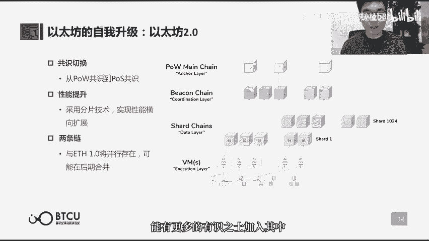

# 【清华大学区块链课】深入浅出讲web3：从比特币到区块链（全14讲） - P5：5-05讲：区块链2.0-以太坊 - web3深度学习 - BV1mL411a7jo

好，hello，朋友们大家好啊，欢迎又回到了区块链通识课的第五课啊，我是这节课的讲师鲁迪，那么咱们的进度呢，到了第五课基本上过了1/3了，那么在之前的几节课呢，我们也是带领大家啊。

通过比特币完成了对区块链的一个基本的，从0~1的认知构建，那么这个构件呢是非常基础而重要的，大家说，比特币是区块链技术的首个典型落地应用嘛，所以说从比特币来看，区块链构成的这样的一个基础呢。

对于我们之后所加深或者衍生，对区块链的认知呢都是非常重要的，那么通过前几课呢，我们知道啊，区块链通过解决了一个啊，多人分布式记账的这么一个问题，来，实现了比特币这样一个点对点的电子现金系统。

而我们现在一般所认知到的区块链项目呢，他们的应用啊或者价值都已经远不止点对点，电子现金系统基本简单了啊，所以如果我们把数字货币上的应用，试做区块链的一点版本应用的话。

那么现在我们把区块链应用到金融领域啊，泛金融领域啊等等，有了更加广泛的一个应用，我们把它视作区块链的一个二点应用，而是什么，使得区块链能够从一点应用，跨越到一个二点应用呢，这和我们这节课所要介绍的。

这样的一个重要的项目以太坊是分不开的，因为以太坊所代入的一些天才的设计啊，和他开源的代码，可以说使得整个区块链行业的应用生态呢，从数字货币这样一个比较单一的场景，慢慢的扩展到了越来越多的场景。

而区块链它的这样的一个定性，也慢慢的从分布式的账本啊，得到了一个广阔的延伸啊，可以说啊以太坊啊，他无论从加密货币的市值来看，还是说它对整个行业的影响力来看啊，都是仅次于比特币的存在。

那么今天呢我们就来着重的介绍一下，这样一个重要的项目。

区块链二点的代表啊，以太坊，那么在介绍以太坊的一开始，我觉得非常有必要啊，先介绍一下以太坊的创始人vitalic啊，vitalic呢，他可以说是在这个加密行业中影响力啊，首先他是一个匿名的形象。

那么它背后到底是谁，不知道，那么vitalic呢是一个真实的人啊，他的身份是始终是公开的，并且第二方面呢，基本上就从网络上销声匿迹了，那么呃vitalic呢一直都是活跃在加密行业中。

然后始终在积极的推动以太坊的发展，所以说从现在来看，其实vitalic，他在整个行业的影响力是数一数二的，那么也因此呢我们一般把vitalic尊称为vision v神。

在我们心中几乎就是一个非常形象化的标志，那么在全球他去做演讲的话，都是能掀起啊很大的关注度，那么威神呢我们尊称他为神，但是也是一个啊年轻的小伙子啊，他1994年出生在俄罗斯啊，跟我同为94年生人。

但是对区块链目前的贡献来看天差地别，所以神呢还是神啊，并且从小就有一些和常人不一样的经历啊，比如说四岁就开始编程，17岁呢得知了比特币，也是深受比特币和区块链的精神的感染啊。

然后在13年的时候写下了以太坊的白皮书，把它公布出去，然后以太坊他所构想的一些啊很天才的设计，也是受到了业界很大的关注，那么在这种情况下呢，他在14年啊就招募合伙人。

说以太坊的是一个啊很好但也很大的工程啊，光靠我一个人完不成，希望大家都来帮助我啊，有人出人有钱出钱啊，所以招募到了很多也很有技术开发实力的人，也募集到了3。1万枚的比特币，来支持这个以太坊开发。

那么最终呢在2015年，以太坊这个系统诞生了，并且在相当长的一段时间里，都始终是啊全球的这个加密市值，仅次于比特币的加密货币啊，所以说呃在区块链这样的一个新兴行业中，还是有很多的机会啊，去等待这样的啊。

有想法也有能力的年轻人，那么或许现在正在听这堂课的人啊，下一个机会就在等待着，我们好，那么说了这么久，以太坊到底是一个什么，那么从以太坊自己的白皮书来看，就是官方所发布出来的。

这个最权威的这样的一个解读来看，以太坊是一种建立在区块链技术上的，去中心化的应用平台啊，也是区块链二点的代表，那么这个一点和二点啊，到底有什么巨大的差别啊，为什么它就能够叫二点。

而不是一点x那么我们罗列了几点，首先最大的差别呢，就是一个图灵完备还是非图灵完备的关系啊，这个是一个本质差别啊，一点呢是非图灵完备的，二点呢是图灵完备的，那么什么是图灵完备呢，啊下一页就可以详细的介绍。

那么再讲一讲这个比较明显的一些特点啊，第二个事呢是一点是不支持智能合约的，而二点呢是支持智能合约，那么这是一个功能上的明显差别，什么是智能合约呢，哎夏夏也会讲到，那么现在大家能够最为能理解的东西呢。

就是一点啊，区块链一点以比特币为首，他们的定位是一个支付网络啊，就比如说比比特币啊，他的白皮书就写的很明白啊，我是一个点对点的电子现金系统，所以我啊确实就是一个数字货币啊，我除了用来作为货币。

我没有其他的用途，那么二点的区块链呢，就不是说我就只能做一个数字货币了，那么它的定位呢是一个平台啊，以太坊的白皮书也写了，是一个去中心化的应用平台，它的意思是说呢，基于区块链的这样的一个底层技术。

它已经可以实现在区块链上写应用了，就相当于在区块链上开发app了啊。

那这是一个很大的一个提升，好那刚刚也提到了啊，图灵完备一个很重要的差别，但这个概念是什么意思呢，啊图灵完备它本身是一个计算机的术语，他想说的是什么呢，他想定义啊，某一类的计算机或者某一类的编程语言。

他如果想是图灵完备的，那他就必须啊所有可以计算的问题啊，这个计算机或者编程语言它都可以计算，这个叫图灵完备啊，什么意思呢，说的更加浅显一点啊，就是区块链，它原来只是一个账本。

那么图灵完备之后的区块链它就变成了什么呢，它变成了一个excel啊，这样说大家就可能懂了，你在excel上面你不仅可以记账，你还可以写各种各样的公式啊，写各种各样的函数啊。

甚至有人就拿excel就可以写一个，还挺复杂的小程序啊，这个原因就是因为excel背后的那个语言呢，它是图灵完备的，那么如果我们把区块链啊，变成了一种图灵完备的状态，它就变成了一种可以编程的状态啊。

所以vitalic他做的一个是是个什么事呢，他做的就是基于比特币那个版本的区块链，它进行一定程度的扩写，把它写的足够图灵完备之后啊，它就可以基于让其他的开发者，基于区块链来进行编程，甚至应用的开发。

那这相当于什么呢，区块链就变成了一种啊，可以写程序的操作系统了啊，原来开发者就比如说我基于windows去开发啊，我基于安卓系统，我去开发，那现在我就可以在区块链上去开发应用了。

那么这个应用相比于windows或者安卓系统，写出来的程序，它有什么差别呢，它多了一个最大的差别，就是这些数据相当于是记录在区块链上的，它就具有了啊无法轻易篡改的这么一个特性。

那么可编程区块链和其他可编程系统啊，一个比较核心的区别啊，也是大家可能听到的比较多的一个功能，叫智能合约啊，这个概念呢也是大家听的比较多，这个功能呢也确实用的比较广，那么什么是智能合约呢。

那么咱们还是来先说一说啊，什么是非智能合约啊，毕竟先了解一些传统的东西，你才能知道它们的区别在哪啊，非智能合约就是我们传统所签订的一些合约啊，比如说哎我借给某个人，我就叫做a吧。

我借给a50000 块钱，那么我们签了一个欠条啊，就是说到某年某月某日啊，还款日期啊，之前a呢必须要把5万块钱还给我，那么咱们一般在传统线下签了一个欠条，到期不还怎么办呢，我们就得起诉他。

到法院去起诉他，法院判决这个呃a败诉，然后同时呢强制执行啊，把他的5万块钱给还上，那么可以说在这样的一个场景下呢，其实是必须需要法院来作为一个第三方来协助，去这个条款，或者说我们之间合约的执行。

如果没有法院这样的一个第三方存在的话呢，单靠我们两方是无法保证，这样一个合约能够到期准确地执行的啊，因为有一方他就是不还，你也无法拿他怎么样啊，所以一定需要一个第三方的存在。

而这个呢需要的成本也是比较大的啊，首先我们需要这样的一个第三方，第二呢从这个起诉到强制执行，又需要一段比较长时间的时间成本啊，所以说是无法按息强制执行的啊，现实呢就是有很多这样的bug。

那么能否就我们两方之间就能把这个合约给啊，settle啊，给完全的这样一个执行呢，这个观点呢就其实挺像比特币，他所希望的就是点对点之间，达成一个啊现金的交易，而不需要一个第三方。

作为这样的一个交易的信用背书，所以说跟区块链呢它的理念呢是很像的，那么智能合约呢，就是根据区块链可以编程的这样的一个功能，而写在区块链上的一串自动执行的代码，或者说自动执行的程序。

那么这串代码写的多复杂啊，它能实现的功能呢也就越多，那么本质上的智能合约他在做的事情呢，就是一方面，他去不断的去监听一个预制的触发条件啊，有没有达到啊，比如说我们所提的借钱的场景下的。

就是看啊还款日期有没有到啊，如果还款日期到了，那么它就自动的执行下一步的规则，这个比如说借钱这个场景，下一步规则呢就是啊，把他账户上的5万块钱就自动的话给我啊，当然这个前提呢是他账户上有这么多余额。

那么大家可能就问了，那账户上没有钱，所以还不了钱的这种场景或者状况呢，还是挺多的呀，那这种怎么就怎么怎么办呢，那么其实我们在生活里进行一种大额的借贷，的时候，也不可能无缘无故的就借给你钱啊。

一定是需要抵押物的啊，比如说我们去银行，我们抵押一个100万的房子，我们才可能贷出来60万，那么所以说在这样的一个智能合约，如果说借钱这个场景下也是这样的啊，他一定得先有一个抵押物。

那么这个时候智能合约它的规则就是诶，到了还款日期，先看他账户余额有没有5万，有5万就把5万还给我，没有的话，那对不起，你之前抵押的这个物品就会划转到我的账户下，面，就会变成我的资产。

那么智能合约最后影响的呢啊，一定是区块链上这个账本中所记录的，各个账户中啊，无论是数字货币也好，或者说其他类的资产啊，他的这样的一个状态的变更啊，这个呢就是智能合约和区块链的的这么，一个关系啊。

区块啊首先智能合约是运行在区块链上，其次呢它最终结果的影响和记录呢，是写在区块链上，那么这个两重呢，就一保证这样的一串代码不能被随意的更改，第二呢他所更啊。

他所执行的最终结果也是不能被随意的更改的，智能合约这样的一个概念的提出呢，其实也是相当的早了，1990年代的时候也就提出来了，但是没有一个可信的执行环境啊，所以区块链的出现。

才提供了这样的一个可信的执行环境，才使得这样的一个呃上世纪90年代的概念啊，终于在这个世纪呢得到了很好的应用，什么叫可信的执行环境呢，刚刚我们提到了啊智能合约，智能合约和区块链的关系啊。

区块链保障了智能合约所写的代码，和他所执行的结果都是无法轻易被篡改的啊，比如说啊我们如果之前没有区块链，我们就是单纯的一个啊电子信息时代啊，那么我们其实也可以写这样的智能合约，无非就是写个程序吗。

但是这个程序在区块链出现之前，那么这一方如果和合约之间的两，方中的任意一方进行一个合谋的话，他们就有可能合谋啊，比如说我出一个更大的利益，我付出一定的成本，我去贿赂你，本来是作为一个第三方。

我去贿赂你啊，那么咱们呢共同的去修改这样的一串代码，或者说共同的去修改这个代码，最终执行出来的结果，所以这个呢都是有可能的，那么这就是一个不可信的执行环境，那么区块链的出现呢。

就使得代码或者说它执行的结果，都是不可篡改的，那么就提供了一个很良好的可信的执行环境，也就再也就诞生了，以以太坊为代表的这样的一个区块链二点。

那么我们刚刚讲的智能合约呢，是一个很基础的功能，那么基于智能合约呢，你把大码代码写的更复杂啊，然后再把前端啊，ui啊这些等等都给他配上，那么就成了一个a p p了啊，就成了一个可以去使用的应用了。

那么在区块链上所写出来的app呢，我们一般把他们叫做d a p p，来区别于传统的app，那么什么是d a p p呢，d呢就是decentralized，就是意味着它是一个去中心化的app。

那么什么是去中心化啊，其实就是意味着它的后端的数据库呢，哎是放在以太坊，或者放在以太坊为代表的二点的区块链上的，那么也就意味着啊，之前呢，我们把各种数据都放在中心化的数据库里，他是可以随时的去修改啊。

中心化的数据的，那么d a p p呢，就会把一些关键的代码和关键的数据呢，都放在区块链上，这样呢就无法去轻易的篡改了，那么dapp的用户呢对于这一块核心功能啊，信赖度和认可度呢就会更强啊。

说一个d a p p的代表，也是一个啊很可爱的虚拟宠物游戏啊，叫cryptokitties，中文名叫迷恋猫啊，1度呢在以太坊的网络上是非常的火热啊，这是一个什么游戏呢，啊其实就是一个养猫啊。

然后去和别的猫交配，然后生小猫的这么一个游戏，其实听起来挺无聊的，并且这是一个很很基本的游戏，那么为什么会这么火呢，那么它相比于传统的虚拟宠物游戏啊，关键的不同在哪呢。

那么关键的不同就在于每一个小猫背后，它一定是有一串数据来代表这只猫的，那么这一串数据呢因为记在了以太坊上，所以这一串数据将永远的跟随以太坊而存在，不可能这个游戏公司倒闭了，或者说它删库跑路了啊。

这个猫就不存在了，不会的，它会永远的记在以太坊上，所以说你一旦购买了这只猫，它就是一个可以无限存在的，一个永久保有的资产，所以说它的资产的属性呢会极其的浓厚，并且呢这个呃公猫母猫。

生小猫的这个过程呢是随机的啊，并且这一串代码呢也是作为关键的代码，写在区块链上的啊，也是无法去篡改的，那么这就保证了你生下来的特别变异，或者是说啊特别好看的猫呢，呃就是独一无二，特别稀有的之后呢。

不可能说我通过改代码改程序的方法诶，使得遍地都是好看的猫，诶这个不可能啊，这串代码就是无法篡改了，所以你现在所获得的很好看的猫呢，它就是非常珍惜的啊，在很长的一段时间里面都会拥有的。

保持这样的一个珍稀属性和它昂贵的收藏性，所以他就使得哎这样的一个游戏呢啊，里面的猫的资产的价格1度被炒得非常的高，那么大量的希望炒猫的一些投机的玩家啊，就涌入了以太坊的网络啊。

交易额就1度达到了以太坊20%啊，甚至造成了以太坊整个网络的拥堵，那么这个呢就是一种啊，在一个很普通的游戏里面，加入了区块链不可篡改的特性之后，就使得这个游戏尤其的特别是一个很生动的，很经典的例子。

那么现在呢就啊不只是像迷恋猫这样的，虚拟宠物类的游戏，还有很多更好玩的游戏，也包括了一些啊其他种类的应用，包括去中心化金融啊，治理啊，存储啊啊，甚至健康媒体类的啊。

d a p p现在的生态呢啊非常的繁荣，在以太坊上呢，之前统计的数据呢是超过六两千600种，那么现在呢一定是一个更多的状态，那么24小时用户呢，3万人还不是一个特别多。

因为区块链的d a p p呢虽然有种种好处，但它呢入门的门槛呢也是啊，比较显而易见的，就是你首先得有一个以太坊上的钱包啊，你才能算这个d a p p的真实用户，那么这个呢门槛呢相对来说相比于传统app。

现在的用户门槛还是要高上不少的，那么谈到以太坊，谈到智能合约，还有一点不得不谈的啊，就是发币啊和icu啊，发币和ico是一个是两个很敏感的话题，然后这两个话题呢其实也是很很有关联性的。

那么我就在这里一起给大家讲了，不能因为他敏感就不讲，你不能放着一个大象在那，然后大家对他视而不见啊，我觉得还是应该把他聊清楚，聊到发币呢，我觉得首先有一个误区，是我觉得很有必要去澄清的。

因为我觉得很多人对他都有一个误解，就是大家可能在前2年的时候，1度听到特别多啊，发币发币的事情，大家可能知道，现在整个市面上可能得有几千种数字货币，那么是否每一个数字货币都像比特币一样。

它背后是有一个很完整的啊，区块链账本来作为这个货币交易的啊，记录的底层账本呢啊其实不是的，因为像比特币这样的一个区块链，其实还是挺复杂的，就很难用代码实现，不是一个阿猫阿狗的团队就能写得出来的啊。

这是一个很天才的设计，那么为什么还有几千种数字货币啊，在这个市面上留存呢，啊当然一部分原因呢是这个比特币是开源的，所以你只要抱着一种啊，我就把比特币代码复制过来，就改个名字。

发个币的话呢啊也能发这样的技术门槛的啊，也比较低，当然还有一种更加省事的办法，也正是因为这样的办法，才使得啊发币这种行为1度呢非常风靡，那么这个办法呢，就是直接用以太坊上的某一个智能合约来发币。

那么具体它其实是怎么做到的呢，其实是以太坊定义了一种叫e2 ，c20 的这么一个协议啊，这样的协议啊，你写一个智能合约，就可以在以太坊上定义一种资产类别，或者说定义一种totoken啊。

token呢又叫通证，那么什么意思呢，以太坊这样的一个账本，大家可以想一下，这个账本呢记录的就是啊以太币，就是以太坊的原生的货币，它们之间在各个账户之间的一个交易，那么现在呢。

相当于你在这个账本上多加了一个资产，多加了一个资产，在以太币之外又加了一个资产，咱们姑且就叫它a b c，那么只要你加了这一类资产类别之后，以太坊全网的矿工，他们所监听的交易内容就不只是e t h。

以太币之间的交易了，他们也会监听这样的一个abc的交易啊，并且把他们监听到的交易写下来，所以以太坊首先自己写好了一个，e r c20 协议，那么基于这个协议，你就可以通过写智能合约的方法。

来添加你所想定义的一种token，那么你就可以定义这个token的名字啊，它的缩写，然后还有它的总量啊，是多少个，你想罚多少个，然后以及一些其他的衍生的功能，比如说它的增发机制啊等等。

那么通过这样的一个智能合约，你在以太坊的网络上添加了这样的一个资产类，别，就相当于你直接借用了以太坊现在一个很安全，很可靠的区块链账本系统，然后直接借用他的系统来发币啊，这个呢就是以太坊上的发币。

那么由于这样的一个发b的，它的智能合约的代码是开源的啊，网上呢有特别多人提供了特别多的版本，可以满足几乎大家能想到的各种功能，所以说想要借助以太坊发币呢，是一件非常非常容易的事情啊。

是一个技术实现门槛非常低的事情，这个呢就是造成1度发病啊，特别风靡的这个本质原因，那么我们说发b啊，b发出来了之后呢啊有什么用呢，因为你只是在这个你只是交了一些钱，在以太坊上添加了一类资产。

没有人用它就没有价值，那么一般的套路是什么呢，就是一个啊项目团队啊，他们会说他们想比如说他们要开发一个游戏啊，他们要开发一个dapp，那么这个时候呢他们就会发一个b啊。

跟大家说这个b呢将来在我开发出的游戏啊，将来在我开发出的第二部中，会是一个怎样的作用，但是呢我的游戏和我的dapp呢还没有开发出来，但是我b先发出来了，唉这个挺快的，那么我希望大家呢就是先来买币啊。

先来买币，然后我就拿大家买币的钱呢，我去开发游戏或者开发dapp，等我把游戏和dapp开发出来之后呢，大家现在买的这些币就有价值了，这种行为本质上是一个什么行为呢，是一个众筹行为，那么众筹呢。

其实还是一个挺成熟的一个模式的啊，就是说我一个团队，我有一个好的想法啊，我想一般是说我想做出来某种商品，这个商品还挺先锋的啊，也有一些很好的用处，但是呢我们研发的过程中呢需要钱啊。

如果大家也支持我这样的想法，就希望呢大家先筹一些钱给我们团队，我们去把这个东西做出来，做出来之后呢，我会把这个东西给那些前期支持我们的人，相当于啊东西还没做出来呢，希望大家用低价来预定一些。

那么众筹的模式呢，其实本质上没有什么问题，并且在以太坊上，用智能合约来完成这样的一个众筹兑换呢，其实是更加的透明的，那么这样的一个兑换的行为呢，啊就叫initial coin offering啊。

中文名呢叫首次代币发行啊，缩写呢就叫icu了，那也就是那个臭名昭著的seo，那为什么叫首次代币发行呢，因为我们之前虽然把币给发出来了，但是没有人用啊，那么这是我们首次将代币啊开放给公众啊。

他们可以用其他的币来进行一个兑换啊，比如说用以太币兑换，或者说用比特币进行兑换，而这个兑换的规则呢啊我之前写好了啊，说我接受以多少多少以太币兑换我这一个币，而这个规则写好之后呢，写在智能合约上。

只要他打过来，比如说五个以太币，哎，我就自动的给你发一个，我现在所发出来的这个币，那么这个规则呢非常透明，其实是对众筹这样的一个行为呢，是一个更加有好处的，那么为什么icu会促生那么多的乱象。

而传统的众筹不会呢，我觉得本质上呢是因为他的这样的一个众筹，得来的商品是有本质的区别的啊，虽然他说这个呃我的这个代币是用于这个游戏，或者说第二啊里面的应用啊，也就是说这个就相当于q币一样啊。

呃其实项目方一般都会把它们定义成一种，utility token啊，也就是实用型代币啊，它一般是用来用的，但是呢因为这个代币写在区块链上，他无法避免的其实是具备数字货币的属性的啊，因为他发在以太坊上。

刚刚也说了嘛，他的在不同账户之间的交易啊，是和以太币一样的，是会被全网矿工所记录的，它本质上其实就是一种数字货币，或者说广义的数字货币，而这个货币呢无论你在区块链上可以进行交易。

或者说你在交易所中也是可以进行交易的，这也就造成你所种出来的这个商品啊，首先它是完全电子化的啊，它不会过期啊，它没有使用期这么一说，第二呢它可以在交易所里面快速的流通啊，也就可以使得它的这样的一个价格。

可以快速的升值或者贬值，那这样的一个比较强的流动性呢，就造成它有很强的投机属性啊，也就造成在icu这个啊应用，或者说这样的一个规则啊，出来之后呢，大量的投机者进场啊，然后把icu当时所发行的特别多的。

无论是说数字货币也好，还是说token也好，他们的价格都1度炒的很高，而当然由于其中优质的项目，永远永远只有那么一小撮，所以说大量的啊发出来的b呢，最后都是没有价值的。

所以i c o呢是被早期的区块链项目，所广泛采取的一种融资渠道啊，那么它就相比于众筹而言呢，他这种融资的属性呢会强的多，那么除了比如说写dapp，写游戏的这种项目方，还有那种就是我的目标呢。

就是写一出一条性能更好的区块链啊，它比比特币更厉害，比以太坊更厉害，那么但是呢我由于这个区块链现在还没写，那么我只能先发个币啊，希望大家通过买币的方法来支持我写练，等我写好了新的区块链呢。

再把现在大家买的12420协议的币呢，映射过去啊，这种的也不在少数，所以当时icu呢特别的火热，但是呢这本质上是一种对于买币的人来讲，它本质上是一种投资行为，但是这里面会涌入大量的散户投资者。

或者说不合格投资人，在术语上叫不合格投资人，他没有承担那么大风险的心理预期和能力，那么其实他们之前呢只能在啊，比如说股市这样的二级市场上，能够有这么高流动性的一个炒作啊炒作。

但是股市是通过证监会审批批准，能够上市的企业啊，才能够进进场来玩的，这些呢一般都是资质和表现还都比较好的企业，现在相当于这样的散户投资人不合格，投资人过早的介入到了啊前期创业，风险投资的这个领域。

那么这样的失败的概率就很高，并且在i c o的当时的这样的一个时期下，代币极强的流通性，带来了极大极多的投资人，而监管又是很缺失的，所以说在那个时期有大量的项目呢，他们追求的是一种噱头型啊。

但是啊他们的实际的落地程度，或者说啊落地的时间周期的预期啊，又是一个啊很难实现的一个状态，所以说大量的项目，他们所发行的所谓的币呢最终是没有价值的，因为他们构想的应用场景做不出来，场景做不出来。

你b没有用处，没有价值，那么在交易所中交易出来的价格呢就趋近于零，那么使得很多的投资者呢坐在那时，蒙受了大量的一个财产的损失，而在当时的特殊时期下，是很难及时的，而这个时候呢就可能采取一刀切的这样的。

一个政策啊，把他们完全禁止，那么本质上呢还是一种出于啊，保护中小投资者的这么一个目的啊，接下来呢介绍一下以太坊上的原生的加密货币，以太币啊，以太币的缩写呢是eth。

然后这个啊这个背景中做了一个淡化处理的，这个图像呢是这个e t h的logo，那么以太币有什么用呢，啊首先呢它就和比特币一样啊，它也可以作为一种数字的加密货币啊，进行这个点对点的交易啊。

第二个呢它是作为这样的一个去中心化的，应用平台中的一个很重要的服务戒指，就是说我写好了一个智能合约或者说dp，那么我希望运行这个dapp的时候呢，我一定需要向运行这个dapp的记账者呢，去付费啊。

所以说在以太坊网络中的记账者，除了承担向比特币网络中去啊，收听交易的这么一个行为的指责之外呢，还需要去承担的职责呢就是运算啊，很多的智能合约，那么所以职责就不光是记账者这一点了。

所以我们一般都把它们统称为叫节点啊，那么以太币其他的用处呢还包括啊，像在icu这样的众筹中呢是最常用的啊，募资的款项啊，一般呢大家在以太坊上发布icu，然后去啊募集的资金呢都是以太币。

最后呢也是因为以太坊，他这样的一个极强的影响力，所以说在加密货币交易市场中，主流的交易对呢，一般也都包括e t h这样的一个交易队，也就是说一般交易所中其他的数字货币。

他们都会开放他们和以太币之间的交易，接下来呢介绍两类啊，现在在以太坊或者说啊主流的区块链中，都非常有发展前景的啊，两类应用的方向啊，第一个呢就叫去中心化金融啊，缩写呢叫defi啊。

因为它是去中心化金融的英文啊，decentralized finance啊的缩写，那么为什么defi如此的火热呢，因为大家这个尝试了特别多方向之后呢，最终还是发现啊，区块链呢因为本质上还是一个账本啊。

而账本和金融的关系最密切啊，所以最后还是发现，金融领域是最容易突破的领域，那么像以太坊呢，之前给自己的定位呢是去中心化的应用平台，那么近些年呢，就感觉这个定位呢，慢慢的就像去中心化的全球金融结算层啊。

这样的一个定位去开始转变了啊，也是因为现在defi是以太坊上发展的，去中心化应用的发展的最好的一个方向哈，那聊一聊去中心化金融，它的核心的理念呢，就是对传统金融等一个升级啊，希望消除传统金融上的中介方。

繁琐的手续和交易的成本啊，这是defi相比于传统金融的一个更好的点，那么具体来说呢说几个方向啊，比如说支付这个方面呢啊这个也是啊，比特币可能就已经做到的地方，就是说我点对点的电子现金交易啊。

不需要依赖于银行这样的一个第三方的系统，那么在跨国支付的场景下呢，啊就显得更加的轻便啊，节省的成本呢更加的多呢，因为跨国支付中，我得跨过好几个银行才能完成一笔支付啊，那么我们现在点对点直接支付啊。

跨过的成本就很多，那么第二个呢是借贷啊，其实之前呢也聊到了，比如说啊，我们之前这个比如必须把房子抵押给银行，银行才能给我们贷款，因为只有银行，他是觉得他有足够的信用啊。

你可以你觉得你可以把房子给抵押给他了，但是现在由于有了智能合约之后呢，智能合约来提供这样的信用，那么无论对手方是谁，我都啊敢把我的一个很昂贵的资产，抵押在这个智能合约里啊，因为对方他动不了啊。

智能合约写好了之后呢，就是无法轻易去篡改的，那么也无法去轻易地把我锁在里面的，一个资产呢拿出来，所以我就啊，而这样的一个智能合约来提供信用的手段呢，就能够极好地实现一个普惠金融啊。

比如说这个我们之前想要去这个做啊，点那点的金融呢是不可能的，因为必须要第三方来提供信用，那么现在呢靠智能合约来提供信用就可以了，第三个呢就是一个去中心化的交易所，因为传统的我们所认知到的交易所。

都是中心化的，交易所，是我要把b啊存给这个交易所，另一方呢也把币存给这个交易所，然后在这个交易所的场内呢，做一个场内的撮合啊，这和传统的交易所呢也是一样的，那么去中心化交易所呢就想实现的是啊。

各种数字货币，首先他们之间在技术实现上，要通过跨链能够连接起来，使得他们能够互相交易，而如果这一层实现了之后呢，我们就能在区块链上就自动的实现一个，区块链上的点了点的自动交易了啊，就不用采取链上啊。

锁锁内撮合的这么一种模式了，而第二个很热的方向呢，就是去中心化自治的组织啊，这个名字也是很长啊，decentralized autonomous organization，那么它的缩写呢d a o啊。

又叫道道呢，还是最近很火的一个概念啊，很好理解这个事情哈，就是比如说现在的组织方式呢，比如说公司啊，公司是最常见的一个人类组织方式，那么公司呢有自己的公司的规章制度啊，有公司的章程。

但是我相信很多入职一个公司的朋友呢，也不会去看，那么具体这个章程很可能写了，只是形式上的写了啊，具体的规则呢啊实际执行可能又是另外一套，那么所以最近也闹出了这个某某公司，这个员工离职。

然后和公司闹得不可开交啊，等等诸如此类的问题，那么我们就想通过道德方式呢，来实现人类组织的一种啊更好的方式啊，更加去信任化的方式，以程序来替代管理，那么什么意思呢，啊说的简单一点的。

就是把我们之前写在纸面上的公司的章程呢，落实在程序上，具体达成了某个条件，那就自动执行某种规则，那这样呢非常透明啊，并且最大的特点呢就是不可篡改啊，这个也是写在区块链上。

和你写在传统的数据库上最大的差别，区块链上不仅能提供一个规则不可篡改的特性，还能提供一个分布式协作的特性，那么我们天南海北天各一方，可能彼此呢都没有见过，但没有关系，我们只要加入了这一套啊。

规则自动运行的这么一个组织里面，我们就自动的服从这个规则就好了，那么这样呢我们只要把规则写好，不需要认识其中任何一个成员，我们都可以实现一个大规模的，去中心化的分布式协作，所以说这样的一个理念呢。

第一非常符合区块链的概念啊，第二也非常的让人激动人心啊，觉得这个对既有的规则，或者说既有的一种模式呢是一个极大的改革，那么第一个道呢叫得道啊，名字也非常的简洁啊，这个出现的其实还挺早的。

当时呢他是想通过道的这么一种模式，来构建一个去中心化的投资基金啊，这规则写的很简单，就是说大家投入一些资金呢加入这个组织，同时根据你投入资金的多少呢，然后你投入了一些资金啊，那么再组织下一个啊。

用多少资金去投资某个项目的时候呢，那么这么多人做一个投票决策呢，来决定我要把资金投资于某个项目，然后最终在投资这个项目的过程中呢获得盈利，那么这个呢就是它的一个基本的理念啊，规则呢也非常简单易懂。

所以当时吸引了很多很多人的加入，但是不幸的是呢，他这个写的代码有漏洞啊，然后就被盗取了大量的e t h，这都是加入这个组织所啊，投资的钱，然后也这个事情也造成了很大的影响，那么这是一个非常关键的事件。

之后呢，我们还会聊到他，那么得到的失败呢，啊没有扑灭到这个里面的火苗，那么后来呢也是有了特别多的后继者。

再继续去发展道德这样的一个理念，那么最后讲一讲这个以太坊的自我升级啊，大家知道以太坊2013年写了白皮书啊，2015年上线，那么到现在呢也有了快5年的时间了，那么以太坊呢并不是说一成不变的。

毕竟他有威神的代理，并且它还有现在整个区块链行业中，可以说最活跃啊，开发能力可以说最强的一种啊，分布式的开发者社区，所以说他也是在不停地追求自己，性能的一种升级啊，我们说以太坊是区块链的二点。

那么其实在今年呢，以太坊也将走向自己的二点版本，那么有几点啊，很大的一个啊，提升一个呢，就是说它所采用的共识机制呢，将从p o w共识机制切换为p o s共识机制啊。

这两个共识机制咱们在啊之前的课上也讲到了，第二个呢就是它的性能的提升，它将采用一种新的叫分片的技术，去扩展它的这样的一个性能，也就是说以太坊这样的一个本质上，还是一个分布式的账本。

它上面能够跑的能够每秒记录的交易数量，或者说每秒记录的每秒跑的，这样的一个去中心化的应用程序将变得更多，那么这个呢是他啊，从以太坊一的版本升级为以他放二的版本，将要做出了最大的两个改变，那么在短期呢。

以太坊一和以太坊二还将同时存在，那么在之后呢，他们就会进行一个合并，成为一个新的以太坊啊，继续前进，那么未来呢相信还会出现三点和四点版本，所以说无论是以太坊做出这样的自己，自我的升级啊。

其实比特币呢它的代码呢也是有一个，有几个固定的团队呢，定时的在做着更新和维护，那么整个区块链的行业呢，发展呢还是一个探索期的阶段，那么希望在这样的过程中呢，能有更多的有识之士加入其中。

来让这些区块链的项目变得更好，那么最后小结一下啊，这节课所讲到的几个关键的概念，第一个呢很重要的就是区块链的二点啊，他到底有什么区别啊，和一点有什么区别啊，最关键的几点呢就是实现了图灵完备啊。

然后让区块链从一个分布式账本啊，变成了一种分布式的可编程计算机，然后区块链二点实现了一个重要的功能呢，就叫做智能合约，通过智能合约，我们又发展出来了非常繁荣的df生态，那么在df生态中。

目前发展最有前景的两个方向呢，啊是有defi和道，那么最后呢也介绍了一下以太坊二点的，它的一个自我的升级，那么以太坊二点呢我觉得还是挺有趣的，那么我自己呢也对以太坊二点有着呃，个人的一些研究和解读。

那么这些解读的部分呢，也放在了b t c u的这个b站的官方账号上，有兴趣的朋友呢也可以去自行的去观看，然后也可以去找一些啊课下的资料，进行自我的学习，那以上呢就是本节课关于区块链。

二点和以太坊的介绍，也是非常感谢大家的观看。