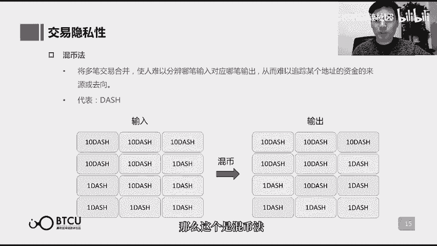

# 【清华大学区块链课】深入浅出讲web3：从比特币到区块链（全14讲） - P6：6-06讲：通向3.0-区块链技术前沿发展 - web3深度学习 - BV1mL411a7jo

hello，大家好，欢迎大家又回到了咱们的区块链通识课堂啊，咱们今天讲第六课啊，我是这节课的讲师鲁迪啊，上一节课呢，咱们刚刚讲完了区块链的二点的版本，那么现在呢我们要讲一讲啊，通往三点版本啊。

其实三点版本我们并没有达到哈，所以对于三点的定义呢，其实并没有一个准确的定义，就好像我们处在区块链一点的时候，我们也不知道啊，区块链二点哦，是一个去中心化的应用平台，所以三点具体是什么呢。

我们也还不知道，那么这节课主要讲的是区块链技术，它的前沿发展就是说经历了二点版本之后，我们现在又在做着哪些的努力。

那么第一个大家所要主要关注并且去发展，去提高的方，去提高的方向呢啊就是性能的扩展。

哎大家都知道啊，区块链的性能不太好，一直都是被诟病的一个点啊，咱们具体来看一看啊，比特币它的一个区块的大小限制的是一兆，一个区块的大小限制是一兆，然后十分钟出一个块。

意思呢就是说我十分钟能够记录的所有交易啊，只能记录最多记录一兆，再多的就记录不了了，然后以现在的交易，每一笔交易的平均大小来算呢，折算下来，每秒能够承载的交易数量就大概只有七左右啊。

这就是大家一般都说啊，区块链的t p s只有企业，只有各位都是这么来的，那么另外呢大家也会去比较啊，说这个viva大概能够承载的是千或者万计啊，然后又会说双11的时候，淘宝的服务器承载的又是多少多少啊。

总之就比区块链要大得多了，所以说区块链它的这样的一个性能很低呢，是一个需要迫切去解决的问题啊，那么以太坊和比特币也差不多啊，现在呢啊15秒出一个区块，一个区块虽然这个出的很快啊。

但是每个区块的大小呢又很小，算下来的tp呢跟比特币呢也是差不多的，那么怎么去提升区块链的性能呢，啊有一部分人就说了，那我们这个很简单啊，我就这个缩短区块的间隔啊。

让这个啊比如说十分现在十分钟才出一个块儿，我缩小这个间隔，让十分钟多出几个块啊，同时呢我来扩大这个区块的大小啊，让这个每个区块能够啊，承载的交易的数量呢就更变得更多。

那这样是不是就能够提升我们的t p s了呢，啊，但是呢区块的大小是不能做一个，简单的扩大的啊，因为我把这个区块我做出来，我上传到区块链上，我再把这个区块广播给所有的节点。

然后所有的节点去验证我这个区块啊，都是需要时间的，那我这一个区块越大，我把它广播出去啊，传递给所有的节点所需要的时间就越久，那么假设我们在什么都不做的前提下，我就直接去给区块扩容。

我增加这个区块的容量会发生什么事呢，那我把这样一个更大容量的区块，我把它广播给全网所有的节点，我需要的时间就更长了，那么在这样长的一段时间里，其他的节点他们也这个找到了哈，希解谜的游戏的谜题的答案。

他们也创造了一个区块，把它上传到区块链上的概率就更高了，那么我创造了一个区块，广播的过程中，其他的矿工又创造了新的区块，那结果就是特别多的新的区块，都会接在同一个区块的屁股后头。

这个呢也就是我们之前的课上提到的分叉，所以说我们什么都不做的前提下，诶我们就把这个区块的容量给它扩大，就可能发生分叉的问题，同时呢对于节点的这个网络和硬件的要求呢，也就会变得很高。

那么普通的检验呢就很难加入进来啊，成为整个区块链网络中的记账者的一部分，那么也有对比特币啊进行这个区块扩容的，他们就是说我这个我也不管，我就是要把区块扩容试一试啊，比如说b c h啊和b s v一啊。

这两个项目呢都是比特币分叉出去的两条链，那么b c h呢就把每个区块的大小呢，从比特币的一兆啊改成了32兆，那么b s v一呢就更加激进了啊，他就把一个区块的大小呢改成了两个g。

那么最终是一个怎样的结果呢，在他们的压力测试中啊，b c h的压力测试，曾经1度有16%的节点呢都掉线了，因为他们的这个呃设备的门槛不足以，支撑这个要求，b s v呢就发生了我们之前所谈论的啊。

你这个区块太大了，你广播和验证都需要特别长的时间，那么他们也是1度发生了节点，这个跟不上的情况，然后造成了重组这样的问题啊，所以说呢，他们都帮忙去证实了这样的一种结论啊。

区块的大小你是不能去仅仅做一个简单的扩大，来实现区块链的扩容的，那么如果我们不能简单的进行一个区块扩容，我们还有哪些办法可以去提升啊，区块链的这样的一个性能呢，那么区块扩容的种种办法中啊。

有一个呢就叫做隔离见证，那么什么叫做隔离见证呢，隔离见证就是本来一个区块里面，它会包含一个验证交易合法性的数据啊，也就是交易的签名啊，这个数据本来是放在区块里面的，就是它占用这一兆大小里面的一部分。

那么现在隔离见证之后呢，就把它从区块里面给挪出来，这个呢就能够啊，还继续维持区块的大小一兆不变呢，但是把这部分挪出来之后呢，就能够放入更多的交易内容，那么现在呢做好做了隔离见证之后啊。

区块原来一兆的大小，就可以容纳接近1万笔的交易啊，整个区块的大小就可以扩大到2。5到三兆，那么目前呢，比特币就已经完成了隔离见证的升级，而现在实际跑下来，峰值的区块的大小已经超过了一兆啊，最高达到了1。

4兆，同时呢，隔离见证还能解决一个叫做交易延展性的问题，交易的延展性攻击呢，是之前包括比特币在内的区块链，都可能会碰到的一种攻击形式，他的攻击呢就是啊改变某个交易的签名，就是交易的签名。

他始终只有一个是合法的，但它在表现形式上可以做一些微小的，差别的变动，那么节点收到一笔交易之后呢，他把这个签名啊做一些微小的变动，这个交易呢还是实际发生了，但是这个交易id呢。

它就会变会产生一些迷惑性的误导性的攻击，那么这个估计呢在实际的交易场景中呢，也是会配合一些其他的欺骗的行为，来达到一些作恶的效果的，那么通过格力见证啊，把这个签名信息从区块里面给拿出来之后呢。

节点就无法去改变这个交易签名了，所以说隔离见证，除了有一个区块扩容的效果之外呢，它还能解决这样的一个交易延展性攻击的问题，那么另一个能够解决区块扩容的办法呢叫树图，那么它的原理呢就是去解决我刚刚所说的。

我如果一味的把区块扩大，很容易发生分叉的这样的一个问题，那么用数图的办法啊，虽然不能防止分叉啊，但是可以将分差的区块也加入到账本里面，也就是说产生分叉区块的矿工呢。

他依然对这个账本的稳定维持是有贡献的啊，他不是说我这个三个分差的区块，最终只有一个区块有贡献啊，另外两部分的算力呢就被浪费掉了，那么这个对于整个区块链网络的安全性来说呢，是不好的啊。

因为有2/3的算力相当于是没有用的，那我再发起51攻击的时候，我只需要在1/3的算力上，发起51%攻击，那就是1/6的算力就能发起攻击了，那这个呢就很不好，那么树图呢就能够解决这个问题啊，即便分叉。

但他们都会对整个区块有贡献，那么在这样的基础上呢，我就能够对区块的容量进行一个扩大了，所以说啊树图所采用采用树图的，这样的一个典型的项目啊，就比如说conflux啊，也是清华的学生啊做的做出来的项目。

那么从实验室数据的表现来看呢，啊，他们就把这个呃出块的间隔呢，做了一个极大的提升，一秒呢能出四个块，同时对这个区块的大小呢，又没有做很大的一个减小，这样的话呢，呃实际跑下来的tp呢就能到千这个量级了。

刚刚所谈到的隔离见证啊，还有树图啊，他们本质都是通过扩大区块的容量，来提升的性能，那么另外一种不是扩大区块容量的这个范畴呢，还有的扩展性能的方法呢，就包括闪电网络啊，怎么理解闪电网络这个概念呢。

啊其实比较简单一点的去理解他的话呢，就是说比特币啊，虽然十分钟一个块一个块呢只有一兆，然后折算一秒只能容纳七笔交易，但是假设啊我a和另一边b啊，我们之间经常会发生一个高频的交易。

如果说我们俩之间有一个高频交易的话，我们可以在练下啊，开一个快速的交易的通道，意味着什么呢，啊我a往比特币里面啊，压十个比特币，你呢b呢往比特币里面压十个比特币啊，我们先就记录好一个初始的状态。

然后我们再练下呢，就进行高频的交易啊，比如说我今天买你一个东西，我付你两块钱，你今天又买我一个东西，你付我三块钱啊，怎么总之几块几块的交易来交易去啊，交易了一两个月之后呢，这些东西都还记在链下。

但是呢我们就把这个最终的交易状态，我们最终再把它更新到比特币的主网络上，这样的话呢我们就能够绕开啊，比特币它只能十分钟一个块啊，一秒钟记起笔交易的这么一个限制，我们在练下先进行小额的。

你来我往的这样的一个交易啊，最终只是把最终的状态记录上去啊，比如说进入经过若干次交易之后，我十个比特币变成了七个啊，你十个比特币变成了13个，那其实本质上就是经过若干次交易之后，我给了你三个比特币。

最终把这个最终状态记录上去。

同样也能够保证这样的一个交易，的安全性和合法性，那么闪电网络还有一个好处呢，就是它可以通过多人之间构建起来的，这么一个支付通道呢，实现啊，最初点和最终点之间连通的这么一个啊，支付通道。

比如说我a和b啊建立了一个支付通道，b又和c建立了支付通道，c又和e啊建立了一个支付通道，那我就可以通过已经构建的这一套的，支付通道啊，在我a和e之间建立起来一个支付通道。

那么这个也是能够使得它比较好用的一个特性。

那么不只是比特币啊，基本上所有的区块链呢都能够实现这样的一个，闪电网络的这么一个快速交易的通道，那么在比特币中呢，这样的一个通道呢叫闪电网络，在以太坊中呢这样的一个通道呢叫雷电网络。

那么因为它的这样的一个特性啊，相当于基于啊这样的一个区块链的主链，在它的下面呢又自己开了一个啊快速的通道，所以我们一般把比特币和以太坊的叫做layer one。

然后把闪电网络这样的技术叫做layer two啊，也是比较的形象，那么除了区块扩容闪电网络，那么还有一种啊，比较常用的区块链性能扩展的方式，也是最近比较火热的一种方式呢啊叫做分片，那么分片这个办法呢。

也是因为以太坊二点，会采用这样的一个分片的技术，那么现在也是越来越多的区块链项目的，都开始用分片这样的一种技术，来进行自己的性能扩展，那么分片这个技术，其实在传统的数据库里面就会比较长的，用，到现在呢。

也是想说，在区块链中对它进行一个适应性的改造，那么其实还是比较难的，有很多技术上的难点还在等待着啊，杰出的开发者们去攻克，那么分片是一个怎样的原理呢，其实可以简单的解释一下，也比较好懂。

在传统的单片网络，比如说比特币呀或者以太坊一点啊，他们这样的网络中啊，任何两方之间发起了一笔交易，那么所有全网，所有的记账者们都要去记录这样的一个交易，那么这个呢就相当的冗余啊。

因为任何一笔交易都是所有矿工去记啊，相当冗余，那么在一个分片的网络中呢，就相当于划分出了很多个区域，那么在这个区域中的发生的交易呢，就由这个区域的记账者去记录啊，那个区域的交易呢。

就由那个区域的记账者去记录，相当于把季度相当于把记账者给分区了，那么不同记账者各有分工啊。

这样的效率呢就能够有一个成倍的提升，同时分片有别于其他性能扩展的方法呢，啊有一个很好的点，就是它是一个横向扩展的性能扩展方法啊，什么叫横向扩展呢，横向扩展意味着我这个网络的规模扩展。

我的网络的吞吐量也可以扩展，也就是说加入我这个网络中的记账者越多，那么我所能够承担的吞吐量呢，也能够随之增多啊，这个在比特币这样的网络中是不具备的啊，因为你无论加进来多少记账者，它最终只能够某种程度上。

提升比特币这个网络的安全性啊，因为算力越多，我就越不好攻克，但是对于比特币的性能是没有帮助的，它永远都是t p s等于七，那么分片就可以做到你加入的节点越多，那我的这个性能就越好。

这样来实现一个横向的扩展，它为什么能做到这一点呢，啊其实啊根据看一下这个图来想象一下，就能够很好的理解了啊，比如说这个高速公路上，高速公路上就只有一个收费站啊，每一辆车通过都必须要收费站去寄一次费啊。

但是你这个只有一个收费站，那所有的车都只能在这卡着，那么如果采用分片的技术，你给他画到啊，都画好，然后节点越多呢，进来新的节点，我就单开一条道，那这样的话呢节点越多，那这个车道越宽啊。

同时能够通过的汽车呢就越多啊，这就是分片。

它能够实现一个横向扩展的原因，那么分片呢它有一些很多的技术难点啊，比如说这个咱们挑几个数啊，比如说这个1%攻击的问题，咱们不是说到这个分片是把记账者们分片啊，每部分记账者各有分工，只记录一部分的交易吗。

那这随之而来的问题呢就是一种安全性的降低，比如说我把这个整个网络的矿工啊，我把它画成了100个区域，那么假使这个网络中总共有1万个矿工，那么我把它画成了一一百个区域之后，每个区域平均有100个矿工。

那么之前我需要掌握全网50%的算力啊，我才能发起一次正常的50%攻击，那么现在由于你画成了100个网络，那我是不是需要攻击所需要的算力啊，就随之而减小了，那么关于这个攻击呢，就有一个这个问题呢。

就有一个比较形象的称呼啊，就叫1%攻击，意思呢就是说我掌握很少的算力，我就能发起一次51%攻击，当然呢也对他有一个解决的办法，就是我去随机的分配节点啊，你不知道你会划分到哪个区域。

同时呢对这个节点的这样的一个权重呢，我也会做出一定的限制，那么第二个比较关键的问题呢，就是啊跨片的交易问题，那么我我划分100个区域，每个区域之间啊，每个区域自己里面内部的交易当然是很好记的。

但是我假使我这个区域的，我这个分区的a，我想给另外一个分区的b我发送一笔交易，那a分区的矿工和b分区的矿工，谁来记录这笔交易呢，啊这个也是很难解决的一个问题啊，啊解决的办法是有。

但是一旦涉及到跨片的交易呢，就会使得它的性能啊有所降低，所以说解决的办法呢一个是在场景上啊，尽可能的避免跨片上的交易啊，尽可能让频繁互相交易的账户呢，隶属于同一个分片。

那么这个呢就相当于啊有点像你之间频繁交易，你就单独开个通道啊，在这里呢就是说你俩都凑到一个分配去啊，第二个呢就是还是通过一些公关技术上的公关，来解决这样的跨片交易问题，使得跨片交易的性能啊也能够提升。

那么第三个问题呢是数据的可用性问题啊，因为分区了嘛，每个区域的节点呢，只记录这个分区中发生的交易，那他们可能就只记录了这个分区中啊，最新的状态，其他的分区的节点就没有记录，这个分区的最新状态。

那么就可能导致节点，在不同分区之间迁移的时候，而导致某个分区的最新状态的数据，彻底丢失了啊，那这个就很影响这个信徒的这个系统的有效性，那么解决的办法呢，也总有一些啊人为的调整的办法啊。

就是说啊不同节点在分区的调整的过程中呢，不要全部调整到下一个分区，那么每次呢只是少部分比例的进行调整，那么逐渐的完成这样的一个过渡的过程，那么总之呢分片啊还是有一些，虽然有一些问题存在。

但它还是目前呢大家都非常看好的一个方向啊，因为它能够实现横向扩展啊，等等种种种非常好的特性，那么现在呢，呃整个行业中有很多优秀的开发者呢，也是在这个方向上做着极大的努力。

那么刚刚讲完的是性能扩展这个部分，然后另一大主要的方向是现在啊，主要的区块链项目方，他们所在尽力的去呃，去完善的呢是隐私匿名这个方向。

那么为什么还要在隐私匿名上做这么多努力呢，啊不是说比特币就是一个匿名的币嘛，那么之前我们在第四章，误会区块链这一章的时候，也讲到了，比特币其实是一种伪艺名的啊，虽然大家不知道啊。

一个地址它背后的控制人是谁，但是因为呃地址的所有交易和地址的余额变动，都是公开可查的，那么根据这样的一些数据你去做分析，你就可能分析出来一个比特币地址，它背后的控制人实际是谁，那么为了增强啊。

以比特币为代表的这样的数字货币，他在交易上的隐私性，那么就要实现啊账户交易，账户余额啊都是不可查的这样的一个状态，那么这个呢其实是很难实现的，因为他很矛盾啊，区块链它的运行机制本来就是我要给谁啊。

交易多少b啊，把这个信息告诉所有的记账者，让记账者来记录这样的信息，但现在相当于他又要记录交易，又不能知道交易中的具体信息，所以这是很矛盾的，当然也还是有解决的办法，那么现在比较主流常用的呢有四种。

提高这样的交易隐私的办法。

那么我们一种一种的来介绍一下，第一种呢是混币法，它呢呃相对比较好理解一些，就是将节点收到的多笔交易进行一个合并，那这样的话呢记账者他就很难分辨啊，哪个输入对应拿笔输出，他就只知道有这么多个输入。

然后有这么多个输出啊，前后一对啊，具体的数额能对得上其他的他也就不知道了，那么通过这样的混币呢，来这个让节点或者其他人难以追踪啊，某个地址的资金的来源或者去向，那么这个是混币法。

那么第二个呢是叫环形签名法啊，环形签名法呢呃也可以简单的理解呢，就是我要去在这个发送一笔交易的时候，我就临时拉了特别多人啊，跟我一起，然后通过我自己的私钥和群里面所有人的公钥，对这个交易信息签名。

这样呢大家就只能知道啊，这笔交易出自这一群人，但不知道出自这一群人中的谁，那么这个呢就能够把自己很好地隐藏起来，那么第三个呢，呃零知识证明也是大家可能听到的比较多的，这么一个概念。

因为这个概念呢也是非常的有趣啊，什么叫零知识证明呢，啊它的英文是zero knowledge approve，那么缩写呢更加常用的一种缩写的就是jk啊，所以大家一般看到jk就知道，他是在说零知识证明。

或者他所谈到的这样的一个概念呢，用到零知识证明的技术，那零知识证明呢是指的是证明者能够，不向验证者提供任何有用的信息的情况下，还能使验证者相信某个论断是正确的啊，就比如说啊验证者问了个问题啊。

证明者呢跟他说我知道吧，然后验证者呢说你知道答案呢，就把答案告诉我，然后证明者说我知道答案，但我就是不告诉你答案是什么啊，就是大概这么个意思，那证明者如何让验证者相信啊，我确实知道正确答案。

但我就是不告诉你，但你也能知道我真的知道正确答案的啊，就是这样的一个问题，那么这个问题呢很有名的一个案例呢，就是阿里巴巴与40大盗，不知道大家是否还记得这一篇故事，然后里面有一个情节啊。

就是阿里巴巴知道一个山洞，他的这个门的打开的方法啊，他知道这个具体的口号啊，具体的一个暗号，只要说出这个暗号呢，这个门就会打开，当然现在大家都知道啊，这个暗号就是芝麻芝麻开门吧。

然后当时呢阿里巴巴需要让40大盗相信啊，我确实知道这个暗号，同时呢我又不能把暗号告诉那40个大盗，因为我一旦告诉他们，我就没有价值了，那阿里巴巴就会被杀掉，那么具体怎么操作呢。

那阿里巴巴就站在这个山洞的门前，然后呢让40大道离自己远远的同时呢，阿里巴巴又不能逃跑，因为40大盗虽然离自己很远，但是用弓箭依然可以射死自己啊，那么这个时候呢阿里巴巴就对着山东的门啊，念咒语。

山东的门呢就能打开，40大盗呢在很远的地方，他们听不到咒语，但是他们确实可以看到诶，阿里巴巴念完咒语之后，这个门打开了，那么这样呢，阿里巴巴就在不告诉40大盗，这个咒语是什么的前提下。

又向40大盗证明了，哎我确实知道这个咒语，那么这个其实还挺好理解的，生活中也有很多这样的场景啊，比如说也有一个非常著名的故事啊，就是啊几元几次方程组啊，求解公式啊，然后当时有两个数学家呢。

说自己知道了这样的一个通用解的求解公式，然后呃彼此呢又不想公布出来，因为我一旦公布，那个人就说诶我发现的公式就是这个，那他们怎么办呢，他们就说那这样我就找一个人，他呢随机的出十道。

这个几元几次方程组的一个啊随机出十道题，然后双方呢就看能否把结果给求解求得出来，那么最后当然是真正找到了那个求解公式的，数学家呢，他能够把这个问题给解出来，那么它呢也同样是在啊。

没有告诉这个求解公式的情况下，要证明自己确实拥有这样的求解公式，那么第三个方向呢来讲，跨链跨链也是最近两场火热。

大家都非常关注的一个发展方向，那么为什么要跨链呢，啊比特币呢是一条区块链，以太坊也是一条区块链，那么他们彼此之间呢，是很难进行直接的交易的啊，因为比特币是一个自己的一套账本，以太坊又是自己的另一套账本。

账本和账本之间无法互通啊，你需要在不同的账本里面开户啊，然后这个账户和这个账户之间呢是毫无关联的，所以现在一个人如果他有比特币，他想把他的比特币交易成以太坊，他可以怎么办呢。

那他最终只能在中心化交易所里，在中心化交易所的撮合下啊，和某个人达成一致的意见，然后我把比特币从我的账户呢转移给他的，比特币的账户，同时他呢再把他的以太坊，从他的以太坊地址里面转移给我的以太坊地址。

那么这个呢就是现在只能在中心化的，交易所的撮合之下才能实现，而这个呢就和区块链，它想消除这种交易的时候的可信，第三方的介入啊，这个理念是违背的，所以跨链呢还是从交易的角度上去理解，是非常必要的。

那么从另一个角度去理解呢，呃跨链沟通的必要性呢也是很大的，就是从这个区块链的性能去理解啊，有一种说法在区块链的世界里面，有一种说法有一个难以兼顾的三角啊，分别是可扩展性，去中心化，还有安全性，说区块链。

一个区块链很难同时兼顾这三点呃，在业界的时候有又会把它称作不可能三角啊，在很长一段时间里面都会把它称作不可能三角，但是这个不可能三角的，就不像之前我们谈到的cap定理一样啊，他cp定理是一个定理。

是数学上证明这三点确实无法完全的同时达到，但是这个所谓的不可能三角，只是业界提出来的一种想法，他并不是被证实的，并且现在也从理论上，其实这三点是可以通过技术突破来同时达到的，有这样的可能性。

所以我们在这里呢就称它为难以兼顾的三角，只是更加一种啊客观和科学的说法，但是不管如此，这三点呢对于现在的区块链来说，很难同时达到，很难同时兼顾，所以现在的区块链项目，大部分都在某一点上做出了牺牲。

而满足另外两点啊，那么不同的区块链基于他们自己的考虑啊，可能是这个在可扩展性上比较好，有可能是在这个去中心化程度上比较好，那么有可能是在安全性上比较好，那么在这三点各有所长的区块链。

就分别适用于不同的应用场景，那么如果想有一个综合的场景去应用，区块链的话，其实是把不同的区块链啊综合起来用，是更加来适应生活中实际会遇到的复杂场景的，而这样的话呢就必须要通过跨链。

来使得我们刚刚的这样的一个构想来成为可能。

那么跨链嗯有多种方法来进行跨链啊，最简单的办法呢其实就是通过人为的锁定啊，比如说我要用比特币换以太坊，那我在一个第三方的见证下哦，我把比特币在这边锁定，然后在那边呢释放出以太坊。

那么这个就其实实现了一种跨链，那么当然现在更多的采用了一种，实现跨链的方法了啊，一般是通过跨链的连接体，也就是中间件啊这样一种方法来实现的，所谓中间件呢，其实就是定义一个共同遵遵循的，数据的接口规范。

那么在这样的一套数据接口规范下呢，所有的区块链呢都以这一套规范啊，为标准来设计，那么这样的标准下设计出来的区块链呢，它们彼此之间呢就能进行互通，那么这样是一个呃，现在最为主流的一种跨链的设计方法啊。

比如说比较有代表性的两个跨链的项目呢，一个是cosmos，一个是pockett，然后这两个项目呢都啊非常的典型，cosmos所采用的中间件的，是一个叫做hub的这么一个啊构建。

那么它呢可以联系不同的区块链，然后在hub和hub之间呢再进行一个联系，就可以实现所有区块链之间的一个沟通，那么ba dot呢，pa dota呢它所实现的这样的一个中间件的啊，叫做relay chin。

也就是中继链啊，那么原理呢其实也是啊大同小异的。

那最后呢小结一下这节课的内容啊，给大家介绍了目前比较主流的三个区块链，的发展方向啊，分别是性能扩展，然后隐私的匿名啊，然后还有跨链，然后希望大家在课后呢。

对这节课呢能够有一个回顾，然后按时完成作业。