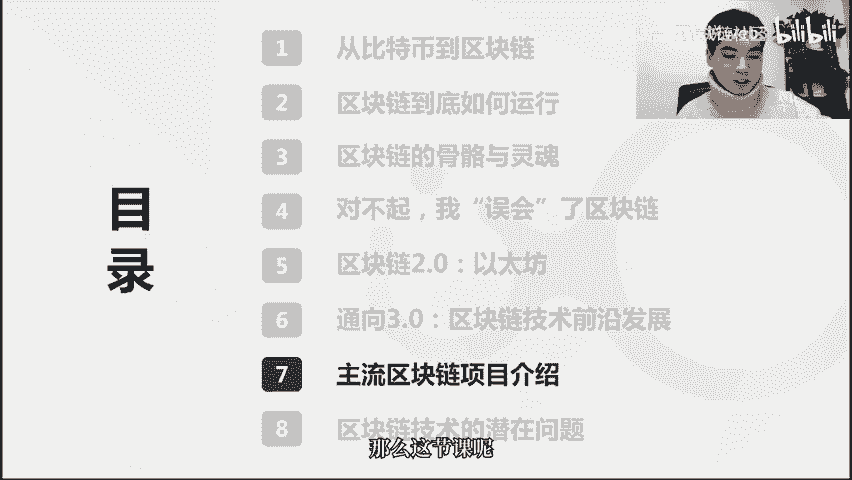
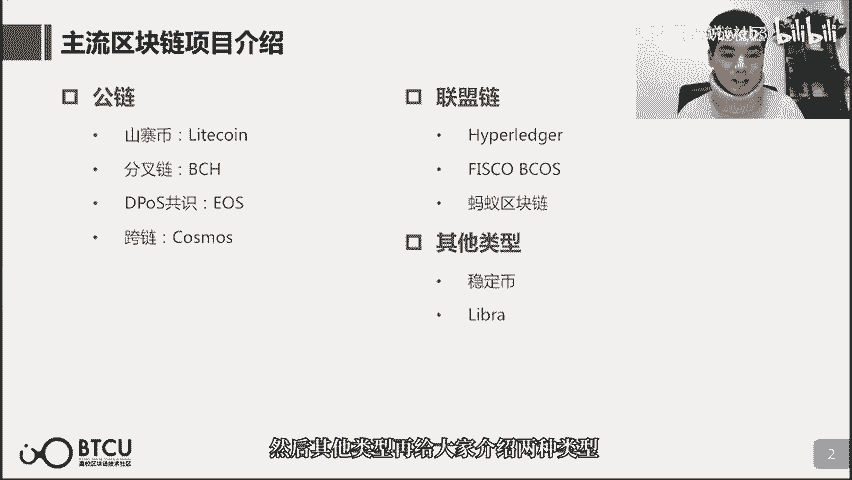
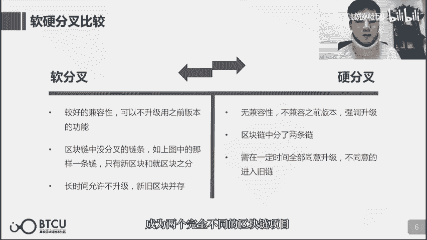
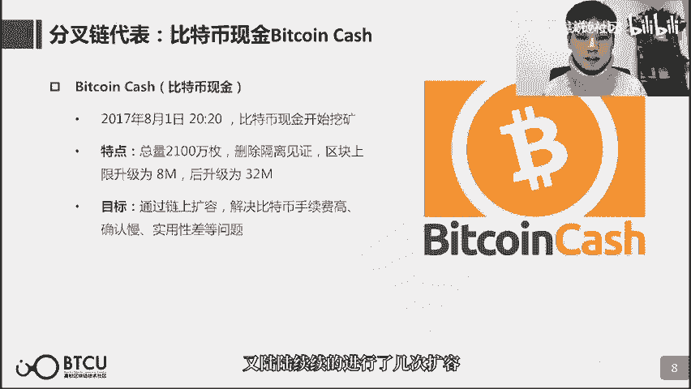
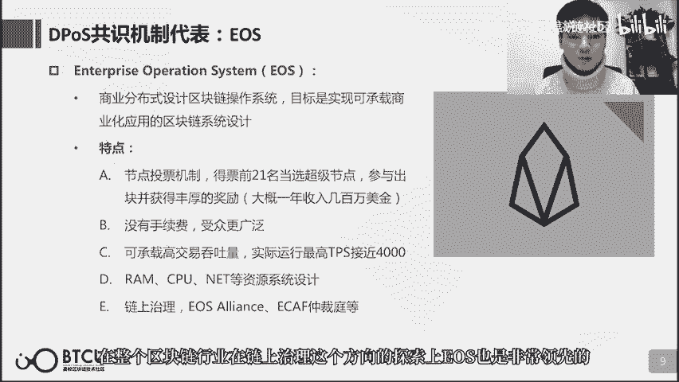
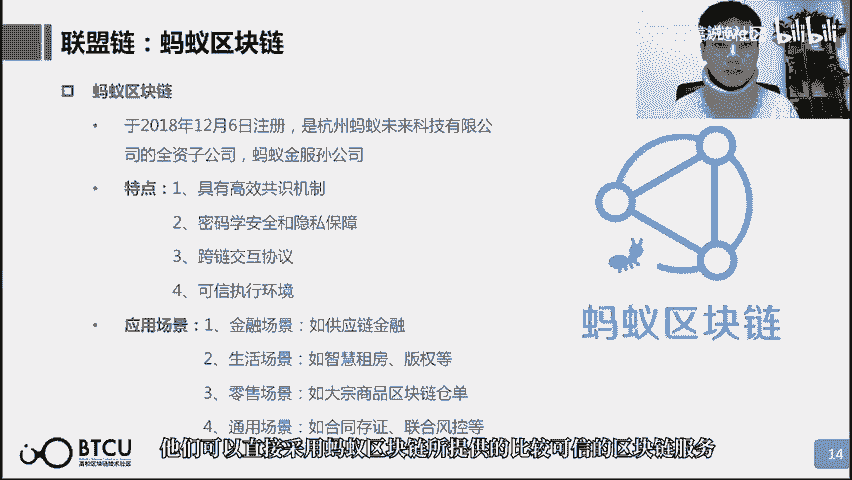
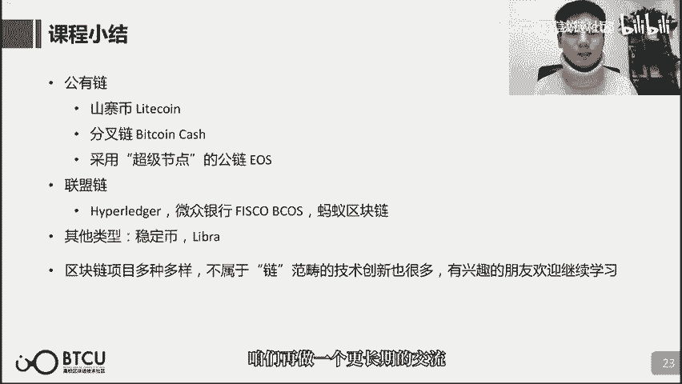

# 【清华大学区块链课】深入浅出讲web3：从比特币到区块链（全14讲） - P7：7-07讲：主流区块链项目介绍 - web3深度学习 - BV1mL411a7jo

好，朋友们，欢迎大家又回到了咱们的第七课，我是这一课的讲师鲁迪，那么这一课呢会带大家再了解一下，其他的比较主流的区块链的项目呃，时间的关系不会谈到特别多，其实还挺多项目都有自己的特色。

也都有值得一提的地方啊，但是时间的关系呢只能帮助大家去，除了以太坊和比特币之外呢啊再去了解一些啊，从名气上来讲会更加有名的，从时间上来讲会更加老牌的这么几个，还是说挺重要的几个项目啊。

那么这节课呢不要公链和联盟链的项目呢。

会更多一些，除了公链和联盟链之外的项目呢比较少谈到，那么可能朋友们还会有疑问，比如说区块链和行业结合有实际应用的项目呢，呃会不会介绍到呢，那个呢其实是在之后的课里面，会跟大家详细的介绍，那么这一课呢。

主要把公链呢给大家介绍四个项目，联盟链呢给大家介绍三个项目，然后其他类型呢再给大家介绍两种类型吧。

那从公有链讲起啊，给大家介绍几个除了比特币和以太坊之外的。

还比较知名的项目，先给大家介绍一个山寨币的概念啊，什么叫山寨币啊，山寨币听名字也听得出来，他的这个呃含义呢不是特别好，他的意思是说呢啊因为比特币或者以太坊，他们的代码呢都是完全开源的。

也就是说任何人都能完全的复制，这样的一套代码，所以说其实要对比特币不做任何改动，然后自己去搭一条区块链来讲呢，啊从代码这个方面来说是可以很轻易的获得的，那么山寨币就是呃为了和比特币有所区别。

在某些参数上进行一些改动，然后造出来的一条新的区块链，因为他在创新力上没有什么特别大的创新，所以说又被人叫做山寨比，那么在英文中呢呃叫alcoin，也就是一种替代币啊，这个呢。

其实它的定义会相对来说更加的广泛一些啊，因为几乎所有的区块链项目，他们都会从比特币的代码中，或多或少的借鉴了很多东西，所以说l coin呢本质上就是在讲啊，非以特以太啊，非以比特币。

或者说非以太坊之外的一些，替代性的区块链方案啊，咱们还是说回山寨币啊，山寨币中的典型的代表呢，就是这一页ppt所介绍的莱特币，莱特币英文light coin，那么这个light呢呃在英文中就是一种啊。

更加轻便轻量的这么一个意思，那么莱特币它自己呢就是把比特币的代码呢，改成了它的数块的间隔更加的短，那么币的总量呢也更加的多啊，来实现这么一样的一个数字货币，其实山寨币。

如果你要在现在在copy这个比特币的代码，再发一套山寨币出来，那肯定是没有人认的，但是莱特币呢因为他发的非常早啊，在11年就发了啊，相比于比特币呢也只玩了2年多左右的时间，同时莱特币它自己。

官方给自己的定位呢也是非常的巧妙啊，那么莱特币呢就是数字白银，那么在这么长的一段时间里面呢，把自己的定位啊做的非常好，然后也是市值呢长期居于前十啊，曾经1度长期是第三的位置。

所以说也是啊加密数字货币这个事件里面，是举足轻重的一个数字货币项目，再讲下一个区块链项目之前呢，我们再来啊重温，或者说加深一下对于分叉这个概念的认识，那么分叉咱们在之前的课上讲过几次了啊。

分差本质上呢其实就是在说一个区块，屁股后面跟了好几个区块，那么这样的话呢，矿工就可能会选择我在我，我到底在哪个区块后面接着记账，那么这样的话呢，区块链可能就有不同的发展方向，那么区块链的分叉呢分几种啊。

比如说有的呢是我在很短的一个时间间隔里面，呢，啊就几乎同时有很多矿工都提交了自己的区块，那么这样的话呢，就有可能多个区块连在同一个区块后面，但是在这种情况下呢，因为整个矿工群体。

他们对于这个账本还是有一个呃一致的共识的，所以说这样的分叉呢并不会维持太久，在之前的课上也提到了，那么总归呢会存在一个高度差，而在存在明显的高度差之后呢，啊，所几乎所有的矿工都会在最长的链上去。

接着记账，但是呢假使矿工群体，他们已经在共识层面发生了分割了啊，他们彼此所认同的账本呢不再是同一个账本了，那么这样的时候呢，就可能会发生一个非常长期的分差，比如说这一页提到的啊。

像比特币或者以太坊这样的区块链项目，他们也是要实现一个版本的升级的啊，他们的代码可能会更新，可能会删掉一些觉得有问题的内容，也可能加入一些新的功能，那么在做这样的版本升级的时候。

假使啊有一部分人他们升级了新的版本，另一部分人，他们或许没有收到版本升级的通知啊，通知没有收到这样一个版本升级的消息，又或者就是对这样的一个新版本不认同，比如说他新加的某些功能我不赞同。

所以在版本升级的时候呢，可能会发生软硬分叉，两种类型的分叉的分别，那么它们的差别就是在于，升级前后的版本是否兼容，那么对于硬分叉而言呢，它是无法兼容的，所以会分叉出来两条链，那么至于哪一条链是有效链的。

这个其实主要取决于矿工支持哪一条链，假使大多数的矿工呢都选择版本升级，那么少部分的那一些啊没有升级的矿工，他们渐渐的就会发现自己还在坚持的这个版本，其实是没有人认同的，那么他们呢慢慢的就会被淘汰掉。

或者说也会转移到啊升级了的版本这条链上，那么如果多数人支持版本不升级，那么其实也是一样的，那么就是这个版本升级的倡议者，他所倡议的这个升级就失败了，但是如果两个账本背后都有相当大而已。

一个矿工群体去分别支持的话呢，这两个账本都不会最终消亡，因为都还有很多人在这个账本上继续去记账，那么在分叉之前的账本状态呢会继续沿用啊，比如说分差十啊，这个账本中有三个账户。

a b c他们的余额是100 200 300，这样的账户呢会成为分叉之后的一个初始状态，但是呢两个账本就会分别各记各自的账啊，所以也就渐行渐远，差别越来越大，成为两个完全不同的区块链项目。

那么这个从原有的区块链项目中，分叉出来的新的项目呢，我们一般就叫它分叉链啊，这其中的代表呢就是比特币现金啊，比特coin cash，他从2017年从比特币里面分叉出来，成为一个新的区块链项目。

也就有了一个新的币，那么当时呢如果你在2017年这个7月，他分差之前，你就只有一个比特币的话，你在它分叉之后，你就同时拥有了一个比特币啊，和一个他的比较bc h，因为因为这个分叉之前的账户状态呢。

是两条链都会沿用的，所以你就相当于凭空又多出来了一个资产，那么为什么会分叉出来比特币现金呢，啊它的背景呢是因为随着交易量的上升了，比特币的网络也出现了拥堵，因为比特币它能承载的交易量相当少嘛。

t p s只有七，那么这个时候呢社区就有不同的看法啊，大部分的社区里的人呢，他们更加坚持，不要对原有的比特币做太多的修改，他们就希望通过线下的闪电网络啊和隔离见证，这样的方法也都是我们之前提到的方法。

通过这样的方法呢来啊，通过这样的方法呢，来使比特币的转账速度能够提高，但是这个时候呢啊，以吴极寒和他领导的比特大陆，他们呢就觉得啊，我们需要对比特币呢进行一个扩容，他们是希望通过版本升级的方法。

把比特币的区块容量限制从一兆啊提升至两兆，那么这个呢，就是对比特币原有代码的一个很大的改动，那么也就是一个新版本的发布，如果他这样的发布的一个新的版本，能够得到大多数矿工的支持的话呢。

那么这样的一个版本升级就可以成功，当时比特啊，吴忌寒和比特大陆，把这样的想法公布在比特币社区里面的时候呢，有很多人都是反对的啊，他原有的设计，但是比特大陆是一个怎样的公司呢，它是一个卖矿机的公司。

所以说它直接或者间接的，能够影响相当大的一批比特币矿工，所以说他自己评估了一下，觉得他完全有可能去印分差出来这样的一条链，并且受到还不少的一个比特币矿工群体的支持，也因此呢他在17年7月17号的时候呢。

就宣布分叉了比特币，把b c h分叉了出来，那么也可以看到啊，b c h相比于btc呢啊，除了这个容量进行了扩容，其他的参数呢都没有变化，那么再从遗照提升至两兆之后呢。

比特币现金呢又陆陆续续的进行了几次扩容。

那么现在呢整个容量大小扩大到了32兆，那么下一个要介绍的项目呢是u s，u s是采用d p o s这样的一个，共识机制的代表，咱们在讲共识机制这一块儿的时候呢，讲到d p o s共识。

那么也介绍了一下eos，但是我认为呢eos在它的这样的一个设计里面，和它的性能，和它的这样的一个知名度和行业影响力来看的，都是需要在啊比较详细的讲一讲的，当然它最大的特点就是采用了d p o s。

这样的一个共识，这个共识呢之前也提到过，那么也就是用b来投票啊，选出这个出块节点，那么得票前21的就相当于当选超级节点，当然超级节点是一个中文的这个说法哈，其实英文是叫blog producer。

就是出块者，那么每一个超级节点呢他们去参与出块，也能获得这个区块的奖励，那么这个奖励呢，由于u s的市值也是很高的一个区块链项目，所以说每个节点的奖励呢也是非常的丰厚啊，1年呢大概收入几百万美金。

那么围绕着u s的这样的一个节点投票机制呢，其实衍生出来特别多，它相比于其他的区块链项目，也非常不一样的设计，首先呢因为这个出块节点，通过这个出块奖励的增发呢，这一块就能够获得特别高的奖励。

那么u s在设计这个交易的过程中，是没有手续费的，那么也就是说我们在u s这个链上去交易，是不用支付手续费的，那么这一点呢，对于交易双方而言是更加的友好的，但是无论是出于交易。

还是说u u s要承载一些商业化的应用，那么这样的应用的计算呢也是要消耗资源的，所以ios也相应的设计出了一套啊，包括ram cpu net啊，甚至于rex啊，这样的一些资源系统或者资源交易系统的设计。

那么这一块设计呢，也是和其他的区块链项目非常不一样的，第三个呢就是得票当选的超级节点，他们除了啊出块啊，这也就是记账这样的一个职责之外呢，他们还会承担一些链上治理啊，包括u s这样的一个区块链项目。

未来将会是一个如何的走向啊，怎样发展，他们会用他们的投票来去做一个决策，同时呢为了约束u s超级节点的权利呢，u s也设计了u s alliance，或者e c a a f。

仲裁庭这样的一些链上治理的机构，在整个区块链行业，在链上治理这个方向的探索上呢。

u u s也是非常领先的，u s由于采用了和传统的区块链项目，很多不一样的设计，那么也因此造成了很多的非议，那么最大的非议呢，当然是围绕着它长，它的21个超级节点的机制啊，因为这和区块链本身所想追求的。

去中心化的这么一个理念呢是违背比较大的，同时呢21个超级节点是投票投上去的，他们呢又会发生很多，传统政治中可能出现的问题啊，比如说投票的会选票仓的控票等等，有很多不公平的现象呢。

在eos的投票选举中呢是屡见不鲜的啊，同时呢u s本来非常令人期待的，链上治理这个板块呢又可谓是一波三折，非常坎坷，eos本身的e c a f这样的一个仲裁庭呢，本身是想追求一个去中心化的对案件的仲裁。

但是他们往往和u s超级节点的利益呢，又是有冲突的，这就导致仲裁庭的很多判决结果啊，超级节点不予理睬，同时呢仲裁庭它本身还是一个人质的模式，而不是说像到这样的一种代码自动执行的模式。

这也就造成eos社区中很多极客的反对啊，他们会认为啊我希望是私钥之上，我希望是代码至上，而不是一些人来决定我的资产是否是合法的，这和他们之前所推行的cl至上的理念呢，是很不一样的，那么最后一点呢。

而在交易性能这方面呢，u u s本来描绘了一个交易无手续费啊，交易性能非常好的这么一个愿景，但是在实际使用的时候，cpu资源却往往紧缺，当u s出现一些爆款应用的时候，这些应用会占用极大的cpu资源。

而普通的用户因为缺少cpu资源，甚至可能连一笔普通的交易都完全发不出去，所以在某些时候，普通用户的使用体验会非常差，总的来说呢，eos作为当年备受关注的一个明星项目，他们的创始团队呢也先后创立了彼得。

sh stmit这样的两个很知名的项目，u s努力想要做到的一点呢，是能够承载商业分布式应用的一个公有链，所以也是在积极地探索一个高性能，公有链的可能的模式，那么在这个过程中呢，也遇到了很多。

可以说整个行业都会面对而难以解决的问题，那么也是希望未来呢us团队和社区，或者说在整个行业的努力下，我们能够早日找到解决这些问题的办法，那么接下来介绍几个主流的联盟链项目啊，联盟链和公有链最大的区别呢。

首先大家都知道啊，联盟链一般不发币，当然这里的发币呢主要指的是联盟链，他不会发币去激励其中的记账者，当然他作为一个账本，所以说还是会有这样的一个记账单位存在的，那么其次呢最大的区别在于节点是准入制的啊。

节点你要加入，需要某某个人或者某个机构的许可，那么这种这种模式呢，非常适合已经存在的商用场景，比如说某个场景下就只有几个若干个合作方，他们之间呢需要实现一个合作记账。

或者说他们之间要进行一个某个业务的协作，那么或者呢这几个公司，他要联合推出某项服务啊，这个呢都非常适合，联盟链在其中起到一个信任增强的作用，那么主流的联盟链呢在我看来可以归纳为两种。

一种呢是我提供一个开源的平台啊，其他人呢可以用这个平台去搭建联盟链，另一种呢是我已经搭好了一条联盟链，那么其他人可以直接用这个联盟链的服务，具体是什么意思呢，那我先讲后一种。

后一种是我已经搭好一个联盟链，节点我也已经找好了，那么这个联盟链呢反正也正在正常的运行，大家想要用这条联盟链来提供一些服务的话，那就直接用这个逻辑呢和公有链是相似的，但是它和公有链最大的不同是什么呢。

就比如说区块链存证这样的一个目的，我把某个信息写在区块链上来，达到一个不可篡改的记录的目的的时候，我信任的是公有链上所有节点可加入，然后他们之间形成共识的这么一个强信任，但是联盟链由于节点非常略有限啊。

并且还是一个准入制的，它并不是实现一种完全公有来实现的，这么一个强信任的存正，这个时候我就会非常的考虑，这个节点到底是一个怎样性质的节点啊，比如说区块链存证，如果这条联盟链，它的若干个节点。

是各个地方的法院或者最高法院，那它的存证效力就极强，因为你相当于在法院的见证下，把这样的一个文件做了一个存证，而如果这个节点只是简简单单的普通的三个人，那他其实可以说毫无信用力。

所以说对于已经写好的联盟链，它所提供服务的话，我们就会主要的看他的节点是谁，而这也是它的主要的优势，那么对于第一种联盟链的项目来说呢，它提供的是一个开源的平台，他把这样的一个平台提供好了之后呢。

开发者就能够啊，根据不同所需要适应的场景的不同需求，去设计和开发这样的一个联盟链，来适应这样的一个特殊的场景，所以主要分为两类，一个呢就是我写好了一个联盟链，另一个呢就是我提供一个底层。

让别人去来写联盟链，联盟链项目中最知名的当然是hypolarger了，它是linux基金会在15年发起的开源项目，所以说它实现了一个开源的框架，那么所有的开发者呢，都可以用这一套框架去搭新的联盟链。

那么hyper下面有很多的开源项目，其中最最知名的呢就是hyper fabric，那么bt c o社区在这一系列通识课之前，就推出过联盟链的开发指导课，那么这个开发课呢就是基于fabri。

教学生们如何在fabric的框架下去打联盟练，那么国内谈到区块链底层平台呢，一般会谈到fiscal by cos啊，fiscal cost呢是金融区块链合作联盟啊，也一般被称为金联盟啊。

这个金链盟呢里面包含了特别多的大厂啊，包括微众银行，腾讯华为等等，是这个金链盟，它所发起的这么一个开源的区块链底层平台，所以和fabric的定位是一样的，那么它的主要的发起者呢啊。

微众银行也是btc u社区，非常好的一个合作伙伴，那么对于这样的开源平台而言，他们提供一个完全开源的平台，来让开发者免费的开发，那么他们自己呢往往也会开发出来一些，适合特定场景的典型案例。

所以他们呢也能够提供一个，类似于一个成熟的联盟链来提供成熟的服务，那么最后介绍一下蚂蚁区块链，蚂蚁区块链当然是这个蚂蚁金服阿里系的，那么蚂蚁区块链呢一直被人所知道的呢。

是这个在b a a s上发力特别多啊，b a s也就是blockchain as a service，也就是说它会提供一个成熟的联盟链的服务啊，包括他的存证服务，也是接了特别多的地方法院进来。

然后能够提供一个很好的存证效率，那么在其他的场景中呢，也是有特别多的非常成熟的服务可以直接提供，那么对于企业来说就比较的友好了，那么他们呢就不用付出开发成本啊，在开源的平台上再开发出来一条联盟链。

他们可以直接采用蚂蚁区块链所提供的啊。

比较可信的区块链服务，那么接下来介绍两个，其他类型的主流区块链项目啊。

他们可能既不是公有链，也不是联盟链啊，比如说这个稳定币，稳定币其实是基于公有链技术来发行出来的，一种数字货币，那么这种数字货币相较于比特币，这样的数字货币有什么好处呢。

好处就是它相对于法定货币的这个价格，波动非常的小，那么这种波动小有什么好处呢，这种好处就太大了啊，比如说在一个比较实际的场景中啊，你要买了一瓶水，然后你要用比特币去支付，可能你在支付的这三秒钟里面。

比特币你的两块钱，比特币可能就已经变成了两块五啊，总之也可能跌到了一块五啊，总之你和店家呢总有一个觉得自己亏了，那这样的话呢，这种数字货币就很难在一些落地的应用中去，应用啊，这只是一个很小的方面。

在其他的方面呢也是一样的，那么如果有了稳定币之后呢，相对于法币的价格呢有一个锚定，那么这种呢就非常方便的，适合用在很多的生活的实际的场景里面，只有这样的话，我们才能享受到啊。

这种数字货币所谓的点对点交易也好，降低交易成本也好，或者说采用智能合约也好啊，这样种种的好处呢才能够真正的用得上，那么稳定币是如何实现和法定货币的价格，锚定的呢，啊现在主流的呢有三种办法。

一种呢是法定资产抵押型啊，这个呢代表的就是u s d t，它的原理是什么呢，就是我往银行里存一美元，然后我就发一个u s d t，通过这种方法来实现，法定资产和这个数字资产的价格锚定。

另外一种呢是加密资产抵押型，它也是一种资产抵押，只不过这种抵押的行为呢发生在链上，我不再是把一美元存到银行里了，我可能是把几个以太坊锁到某个智能合约里，然后通过智能合约再发出相应比例的某个，稳定货币。

这个稳定币的代表呢就是带，那么u s d t和代呢，我们在之后呢也都可以详细的介绍到，那么第三个呢就是依靠某种算法啊，能够实现稳定币，也就不需要抵押，但是这种算法稳定币呢啊，相对来说现在成熟的比较少。

那么在这里呢可能只是简单的介绍一下，这样的一种类型，在后面呢不会去介绍一个具体采用这种算法的，b，那么首先要介绍的稳定币呢，就是最著名的u s d t啊，u s d t看名字呢。

大家都知道它是和美元锚定的这么一个稳定币，那么他自己是没有自己的区块链的，他是发行在已有的区块链上啊，借用一些比较成熟的协议啊，比如以太坊就用e r c20 来发这样的，e2 c20 的token。

那么发出来的这样的数字资产，如何让它的价值和美元是一比一锚定的呢，那么这个发行方泰勒公司呢，他是说这个每发一个usb，它都会往这样的一个银行里去存一美元，但是实际他有没有去存呢。

呃因为没有一个特别公开透明的一个审计，所以外界一直都在质疑这件事情，那么这个呢就是要实现一个链下的法定资产，抵押啊，就很难保证的一件事情，那么外界一直在质疑，所以u s d t它的实际的交易价格。

也未必就和一美元完全相等，当大家怀疑这件事情的时候，u s d t曾经它的价格有过暴跌的时候啊，但是呢usb t依然是目前市面上最流行啊，大家认可度也最高的一种美元的稳定币。

那么与u s d t链下比啊，相对应的呢，这个就是带啊带师做的链上比呀，链上抵押，这个抵押呢就非常的透明了，因为都是写在智能合约里的，这个规则是很清晰的，它的规则呢就是写了一个，基于以太坊的智能合约。

智能合约呢规定了一个抵押率啊，比如说现在是150%，那么也就是说你抵押进去1。5美元的以太坊，它就能够带出来一美元一个贷，那么通过这样的一个方式呢来锚定贷的，它的价格呢是一美元。

那么如果以太坊价格下跌怎么办呢，那么贷呢，那么贷的这个智能合约呢，同样锁定了一个抵押率的下限，当达到这样的一个抵押率下限的时候，这个智能合约就会把锁定的以太坊去把它卖出，那么这样呢就能把仓给平掉。

那么这个模式呢就很像啊，我们把房子押给银行，然后呢借出钱来，然后银行如果当房产价格下跌的时候，他有权把房子卖掉来保证自己不会亏损，只不过呢把这个过程搬到了智能合约上，那么它呢就更加的透明。

以及我们不用去信赖银行，这样的非常有信誉担保的机构，而只用信贷这个智能合约，它会自动执行就可以了啊，然后通过这个过程呢，来实现一个数字资产抵押的铸币方法啊，最后聊一聊libra也是不得不提的一个话题啊。

他的影响确实非常的深远，虽然总有人跳出来说a libra，你用的区块链技术也没有多牛逼，但是libra的推出，对于整个区块链的行业的意义是非常深远的啊，因为这是目前为止。

第一次有facebook这样体量的公司跳出来说，我要用区块链的技术，推出这样的一个超主权货币，那么这对于外界对区块链技术价值的认知度，是有了一个极大的提升，那么我们来看一看libra。

libra是要应用区块链的技术啊，通过绑定一揽子的主权货币啊，作为一个价值的支撑，成为一款全球性的超主权的数字货币，libra自去年的6月份推出了他的白皮书之后啊，一直都在很艰难地和各国政府去谈判。

那么通过libera的白皮书呢，我们来看一下libra，他用的区块链到底是一个怎样的技术架构呢，我们从libra的白皮书可以看到，它基本上呢会分为两个阶段，第一个阶段呢它的结构呢是类似于联盟链的。

这个时候他的这个账本中的记账者呢，还都是准入制的啊，需要申请的这样的一些节点，那么也就是我们所熟知的啊，libra协会，那么到了第二阶段呢，libra也会寻求一个更加开放的方式。

不仅限于libera协会中的这些机构，可以来做节点，而希望libra区块链，最终呢是一个完全无许可的状态，也就是一个公有链的状态，那么供应链的时候就不能用它在联盟链的时候。

这样的一个类bf t的这么一个公式机制了，那么他在供应链的阶段呢，也是计划逐步采用权益证明啊，也就是p o s这样的一个共识机制，那么最后聊一下libra的一篮子货币，大家可能知道啊。

libra的背后是一堆主权货币的集合，那么每一个用钱来兑换了libra的用户呢，libra会拿这个钱呢，去把它再按比例换成这一部分货币组合，那么这一块呢就会存在一些误区啊。

有的人可能以为这个货币组合和他们的比例呢，都是定死的，但其实不是的啊，都是可以通过libra协会，他们之间的商议和投票来进行决策和调整的，那么另一个呢他是不是只能由货币来组成呢，啊其实不是。

那我们看一下libra的白皮书呢，他说的是啊，它会有优质的中央银行的一揽子银行，存款和国债来充分支撑，只不过呢现阶段早期的形式呢是通过啊，主权货币啊直接来支撑，那么未来呢相信这样的一个组合呢。

会从货币组合变成资产组合，会融入更多的优质的资产进来，作为这个货币价值支撑，所以说libra，它的价格也未必就是现在的所有的货币的，价格的一个加权，他们并不是一个强行锚定的关系，那么这个模式呢。

有相关背景的同学呢可能也知道，黄金等等，来作为他发出的主权货币的一个价值支撑，所以说利布软它也是采用相同的模式，也比较符合他的这样的一个超主权，数字货币的定位，那么这样的一个超主权货币的出现。

有什么好处呢，那么它一定程度上可以避免主权货币，它可能存在的一些问题啊，比如说这样的一个国家主权，他出于一些考虑啊，但是出现了问题的企业，那么这个背后呢就会造成货币的贬值。

那么也就造成所有的国民为这件事情而买单，那么比如南美或者非洲的一些小国家，那么他们的货币发行机构呢，并不能对货币的这个发行有一个很好的控制，导致这个货币大幅贬值啊，也就造成国民的财富大幅缩水。

那么如果这个时候呢出现一个超主权货币，作为一个可选择项，那么国民就有一个选择可以保住自己的财富啊，不要去滥发货币，而另一个比较让我有感触的一点呢，就是我在看到这样的一个资产组合的时候。

我第一时间的反应呢，觉得他非常的像一个货币指数基金，主要大家也没有同样的感觉，那么为什么现在的货币指数基金，不能像libra一样实现一个点对点支付，来作为一个支付工具呢，因为现在货币指数基金。

都只能在中心化的交易所里进行一个，场内的撮合交易啊，为什么离不了这个交易所呢，因为数据都在他那啊，开了这个厂就没有信任的基础了，所以如果所有的基金类理财类啊，这样的资产啊。

也都能够通过区块链的这样一种方式，实现一个开放的数据库，是否也能实现一个点对点交易呢，那那样的时候我们的钱包打开，各种各样的可支付工具，可能会极大地丰富我们现在生活的便利性啊。

不像现在我们如果要进行交易的时候，才能进行交易，那么今天的内容也挺多的哈，给大家介绍了呃，三个公有链项目，三个联盟链项目，还有两种稳定币，然后还有libra，其实区块链项目中，就像我开头所讲到的。

可圈可点的项目呢其实还特别多，但是由于时间的限制，无法给大家一一讲到，那么有兴趣的朋友呢，希望可以在这个课下啊，或者在社群里面提问，咱们呢再做一个更长期的交流。

好这节课就到这里。