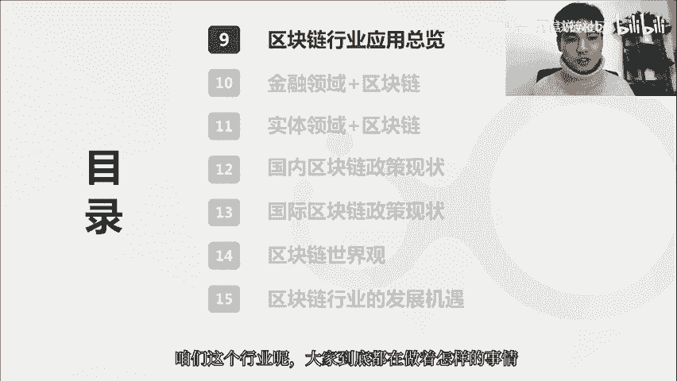
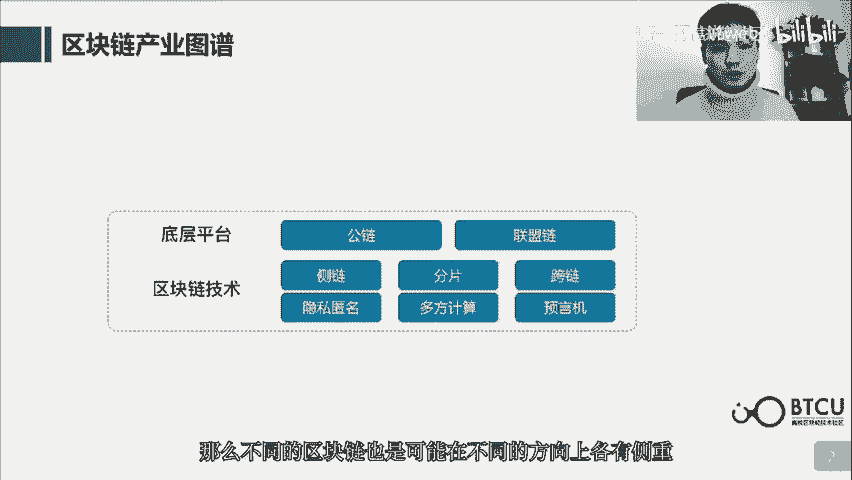
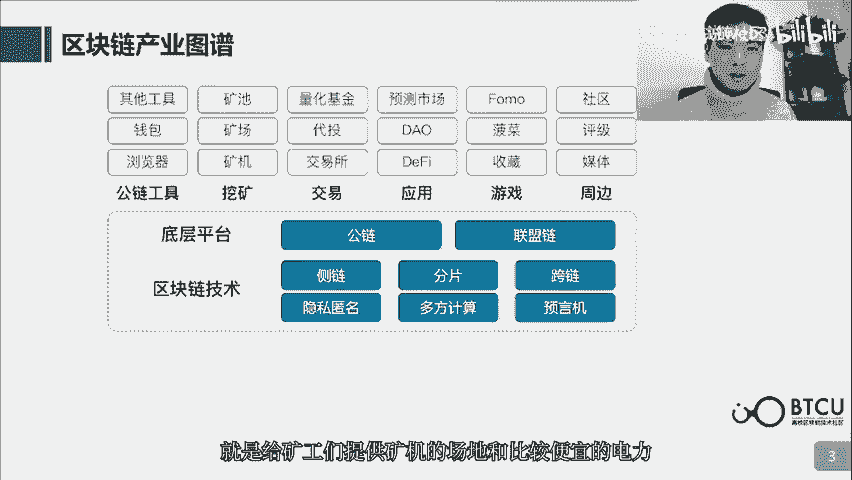
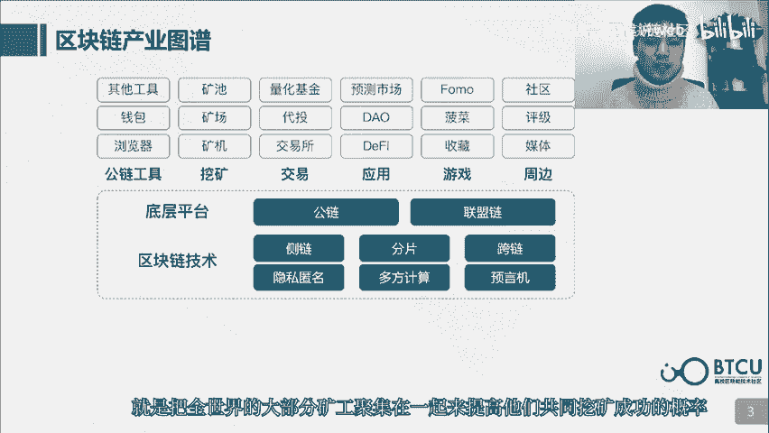
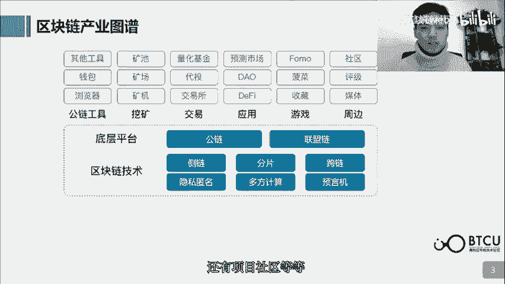
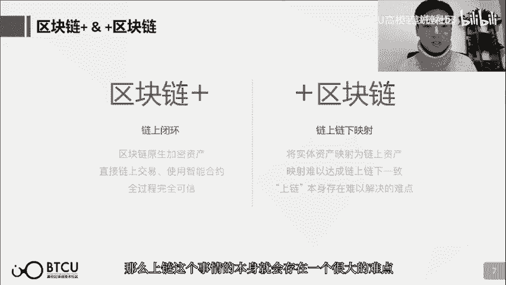
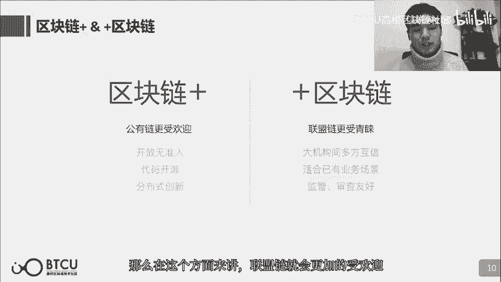
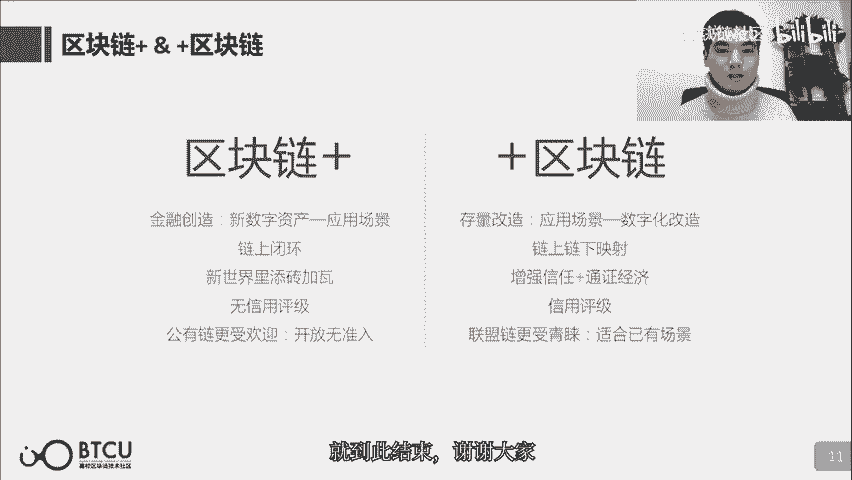

# 【清华大学区块链课】深入浅出讲web3：从比特币到区块链（全14讲） - P8：9-09讲：区块链行业应用总览 - web3深度学习 - BV1mL411a7jo

hello大家好，欢迎来到第9课啊，区块链行业应用总览这一课，那么我是这节课的讲师卢弟，那么这节课呢主要就是带大家了解一下，咱们这个行业到底大家都在做着怎样的事情。

这个行业最基础或者说最核心的部分呢，当然是各种各样的区块链啊，无论是公有链还是联盟链，他们在为这个行业提供一个最基础的底层设施，提供一个基础的记账平台，那么为了让这样的一个账本更好用。

为了提高它的种种性能，或者说其他的一些特性上的提升呢，就包括侧链啊分片啊跨链隐私命名啊，多方计算预言机等等，这些方面的技术的提升呢，也都在有不同的团队在做着这方面的事情，那么不同的区块链呢。

也是可能在不同的方向上各有侧重啊。

这个咱们之前呢也介绍过了，那么以底层的区块链为基础呢，就构建出了特别多衍生的生态啊，那么在这里面呢提到了特别多的衍生产业，咱们一个个的挑一些重点的来讲一下，首先区块链浏览器就是一个非常重要的。

啊区块链需要适配的一个工具，啊有了区块链浏览器，那些外部的用户呢，才能够在浏览器上非常方便的去查询，啊某某账户现在是一个什么样的状态啊，什么样的余额，某一笔交易啊现在是还没有到账。

还是说已经到账成功啊等等，必须要有区块链浏览器才能够使得区块链，这种公开的读取能力呢，啊变得更加的方便，啊第2个呢就是这个区块链的钱包啊，一个区块链写出来之后，它的钱包也是非常重要的，有了钱包之后。

那么不是以节点的身份介入到区块链的，其他的资产持有者才能够通过钱包啊，非常方便的去收发交易以及管理自己的资产啊，还有一些其他的工具呢，也是非常重要需要团队去来做的，那么挖矿的产业呢就非常大了。

啊挖矿产业首先从区块链来讲呢，他们是承担记账者的职责，所以这个角色呢也是非常重要，那么从挖矿行业的利润上来讲呢，由于这个利润是啊挖出区块得到的奖励，是一个非常稳定的现金流。

也可能说是区块链行业目前最大的一笔现金流了，所以说挖矿产业呢支撑的非常大，包括矿机矿场矿池啊三种角色，矿机呢就是制造矿机的厂商啊卖给矿工们啊，比如说比特大陆啊就是一个知名的矿机厂商。

那么矿场呢就是给矿工们提供啊矿机的场地。

和比较便宜的电力，那么矿池呢啊就是把全世界的大部分矿工呢，聚集在一起来提高他们共同挖矿成功的概率。

那么交易呢也是啊现在大部分的数字货币的持有者，都需要去啊满足的一个需求啊，因为现在大部分的这个数字货币的持有者呢，啊抱着的投资的目的呢还是比较强的，那么需要交易所来让他们进行交易，来达到他们投资的目的。

除此之外呢带头基金量化基金呢，也是可以满足一些投资的目的，那么也是发展的比较好，那么基于区块链发展出来的应用呢，啊define和DAO之前提到的比较多了，也是发展的目前最繁荣的两种类型。

那么预测呢也是基于区块链智能合约的特性，类似于啊区块链上的足踩进拆啊等等，那么游戏呢在区块链上的游戏，也是具有区块链游戏的特色啊，比较常见的呢是这三种类型。

那么收藏类型的代表呢就是crypto kitties，啊迷恋猫这样的类型，他应用的就是区块链的数字资产，是完全属于一个人来具备极强的收藏属性，那么菠菜呢这个词呢是这个，啊另一个词的一个谐音。

那么那个词呢比较的敏感，啊所以说呢也就不多提了，那么周边的一些生态呢，就包括区块链类的媒体啊，他会及时的传递区块链行业的，特别多特别多的资讯啊，以及一些消息，那么还有项目评级啊，还有项目社区等等啊。

也都是周边衍生出来的，非常重要的一些角色，那么上面这一些呢，就是区块链行业衍生出来的一些产业，当然很多人就会在问啊，区块链技术何时能够落地啊，说落地的时候呢，其实就是想问区块链技术和。

实际已有的应用场景能否做一个结合，那么在这一块呢，首先金融领域上区块链技术是结合的，还算比较好的，那么在供应链金融贸易金融啊征信，交易清算，积分共享和保险啊等等领域呢，区块链和金融的，啊这个结合应用呢。

都有一些突破性的进展啊，因为区块链呢，自身它还是以一个分布式账本为基础，所以说和金融的结合向心呢，会更加的好一些，那么在非金融领域实体经济这一块呢，在存证啊，溯源版权保护仲裁等等方面。

这些呢也是我们经常提到的，那么区块链还和大数据，物联网等技术啊，经常的被提到啊结合在一起去做服务，那么在电子证物，公益能源医疗文娱等等方面呢，也有一些很好的进展，那么今天呢这个呢只是一个影子。

在未来的两节课呢，就会对啊区块链和金融领域和区块链，和实体经济领域具体有哪些应用，做一个详细的介绍，大家也可以感受得到啊，上下两部分产业呢，他们之间的差异呢还是挺大的啊，那么我们会把它分类成两种啊。

上面这一种呢，我们叫做区块链加产业啊，下面这一种呢，我们叫做加区块链产业，那么谁加谁啊，这个还是挺重要的，区块链加产业是什么呢，是我先有了区块链，我自然而然衍生出来的这一批产业啊，那么加区块链呢。

则是我先有了一些实际的商业应用场景，那么我在思考能否把区块链结合进来，让区块链在这其中呢也发挥价值，先有的谁后有的谁，这个顺序呢就差异非常大，可以说区块链加和加区块链。

他们在产业的理念上呢就有很大的差异，那么接下来呢我们就一点一点的来帮大家梳理一下，他们之间的差异，那么区块链加产业呢，它更多的是一种金融创造，我先有的一种新型的数字记账方式。

以及诞生了一些新型的数字资产，我再来思考把这些用在什么地方，衍生出来了很多相关的产业，那么加区块链呢，更多的是一种存量改造的模式，我先有了一种应用场景，我再来思考能否用区块链来改造它。

那么区块链加的产业呢，大部分是一个链上闭环的状态，因为大部分的资产是区块链的原生的加密资产，他们直接呢进行链上的交易，或者写链上的智能合约都是非常方便的，整个过程呢是完全可信的。

那么加区块链由于要和实际的应用场景呢，做一个结合，那么必不可少的，就会有一个链上链下映射的过程，那么这个映射呢，现在还不具备太好的去中心化的方法，来保证这样的数据或者资产是完全一致的。

那么上链这个事情呢。

本身就会存在一个很大的难点，那么在区块链加的产业里面呢，他们的发展的逻辑呢，是在想这个区块链里面，大家还有什么需求没有被满足，我要做一些什么事情，一般呢不是特别的去在意，区块链不可篡改的特性啊。

或者安全的特性啊种种，但是加区块链里面呢，就会特别的去考虑这些事情，因为他要应用区块链的这些特性，来改造现有的场景，那么一般呢用到的是增强信任和通证经济，这两个特性，一个呢就是通过区块链。

来增强这个业务中多方的之间的一个信任，第2个呢就是通过通证这样一个流动性的积分呢，来改善现在目前的一种激励关系，那么在区块链加的产业呢，因为大家一般都是开源的，所以不需要信用评级啊。

我就看你开源的代码就好了，我就信任你的代码，信任你所采用的密码学的原理，那么最多最多呢，我就看一下你是基于的哪条区块链啊，你是基于的以太坊还是基于的一条小链，那么通过区块链上。

它的算力大小和作业成本的高低呢，来评估你的这样的一个项目，它的安全性的程度，但是加区块链呢就很不一样，因为和实际的应用场景结合，多半呢都是不开源的，不开源的话呢，那我们没有一个信赖的基础。

我们只能信任啊这个区块链是谁发布的，啊他自身会带一定的背书属性，那么在区块链加的产业里面呢，我们更加提倡啊开放无准入，啊更加提倡代码的开源，提倡分布式的创新，所以区块链加的产业。

你如果是基于一条公有链的话呢，你会更加的受欢迎，但是加区块链呢，因为它要适合已有的业务场景，啊要实现大机构之间的多方互信，那么大机构呢就非常的在意啊监管，审查以及数据的隐私，那么在这个方面来讲呢。

联盟链呢就会更加的受欢迎。

那么最后呢我们来小结一下，啊区块链加和加区块链啊，这两种产业方向呢，它们之间的差异呢还是很大的，但是呢加区块链产业啊，或者说我们平常在谈到的区块链落地啊，区块链能否成功落地，其实是意味着区块链产业。

能否得到实体经济的价值支撑的，一个非常重要的方面，也正如习总书记所强调的一样啊，要大力发展区块链技术，和产业创新发展，也是在强调区块链技术，和实体经济的一个深度融合，那么接下来两个呢。

我们就将就加区块链这个方向呢，好好的来谈一谈啊，金融领域加区块链和实体经济加区块链，的种种现在非常啊，做的非常好的一些重要的案例，那么这节课呢就到此结束，好谢谢大家。

